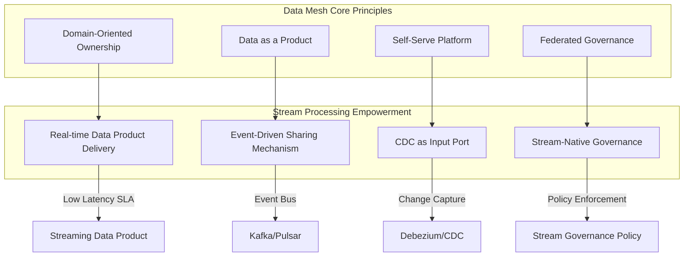
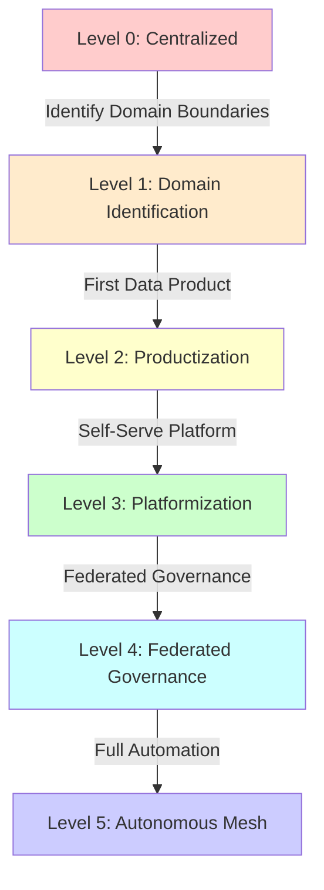
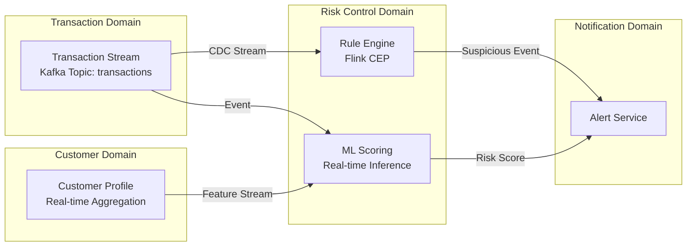
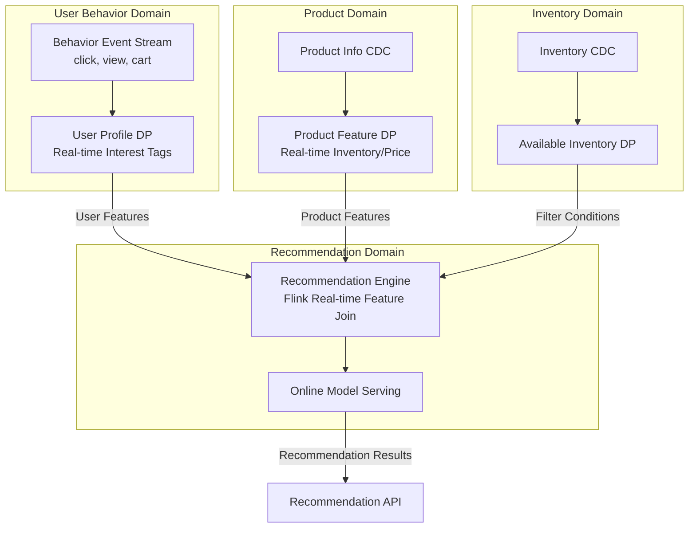
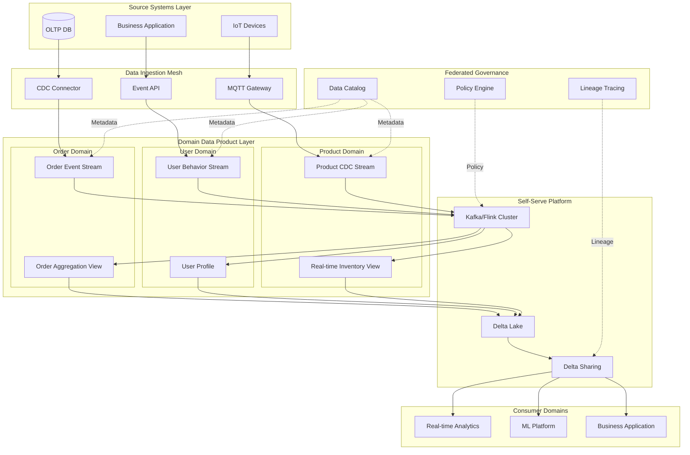
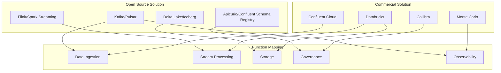

# Data Mesh and Stream Processing Deep Integration: 2026 Architecture Practice Guide

> Stage: Knowledge | Prerequisites: [Streaming Data Product Design Patterns](./streaming-data-product-economics.md) | Formalization Level: L4

---

## Table of Contents

- [Data Mesh and Stream Processing Deep Integration: 2026 Architecture Practice Guide](#data-mesh-and-stream-processing-deep-integration-2026-architecture-practice-guide)
  - [Table of Contents](#table-of-contents)
  - [1. Definitions](#1-definitions)
    - [1.1 Data Mesh Formal Definition](#11-data-mesh-formal-definition)
    - [1.2 Streaming Data Product Definition](#12-streaming-data-product-definition)
    - [1.3 Domain-Oriented Stream Ownership](#13-domain-oriented-stream-ownership)
    - [1.4 Federated Stream Governance](#14-federated-stream-governance)
  - [2. Properties](#2-properties)
    - [2.1 Data Mesh 2026 Status Analysis](#21-data-mesh-2026-status-analysis)
    - [2.2 Scalability Boundaries](#22-scalability-boundaries)
    - [2.3 Governance Complexity](#23-governance-complexity)
  - [3. Relations](#3-relations)
    - [3.1 Data Mesh vs Data Fabric Comparison Matrix](#31-data-mesh-vs-data-fabric-comparison-matrix)
    - [3.2 Selection Decision Framework](#32-selection-decision-framework)
    - [3.3 Hybrid Mode Possibilities](#33-hybrid-mode-possibilities)
    - [3.4 Relationship Between Stream Processing and Data Mesh](#34-relationship-between-stream-processing-and-data-mesh)
  - [4. Argumentation](#4-argumentation)
    - [4.1 Decentralization Necessity Argument](#41-decentralization-necessity-argument)
    - [4.2 Stream Processing Accelerates Data Mesh Value Realization](#42-stream-processing-accelerates-data-mesh-value-realization)
    - [4.3 Counterexample Analysis: When Not to Adopt Data Mesh](#43-counterexample-analysis-when-not-to-adopt-data-mesh)
  - [5. Proof / Engineering Argument](#5-proof-engineering-argument)
    - [5.1 Data Mesh Implementation Path](#51-data-mesh-implementation-path)
    - [5.2 Data Mesh Maturity Model](#52-data-mesh-maturity-model)
    - [5.3 Technology Stack Recommendation Argument](#53-technology-stack-recommendation-argument)
  - [6. Examples](#6-examples)
    - [6.1 Financial Industry Case: Real-time Fraud Detection](#61-financial-industry-case-real-time-fraud-detection)
    - [6.2 E-commerce Industry Case: Large-scale Personalization Recommendation](#62-e-commerce-industry-case-large-scale-personalization-recommendation)
  - [7. Visualizations](#7-visualizations)
    - [7.1 Data Mesh Streaming Architecture Panorama](#71-data-mesh-streaming-architecture-panorama)
    - [7.2 Data Mesh vs Data Fabric Decision Tree](#72-data-mesh-vs-data-fabric-decision-tree)
    - [7.3 ROI Comparative Analysis](#73-roi-comparative-analysis)
    - [7.4 Technology Stack Mapping](#74-technology-stack-mapping)
  - [8. References](#8-references)
  - [Appendix A: Streaming Data Product Template](#appendix-a-streaming-data-product-template)

## 1. Definitions

### 1.1 Data Mesh Formal Definition

**Definition Def-K-03-30 (Data Mesh)**: Data Mesh is a decentralized data architecture paradigm that achieves data democratization and scalable value delivery in large organizations through four principles: domain-oriented ownership, data as a product, self-serve data platform, and federated computational governance.

Formal expression:
$$\text{Data Mesh} := \langle D, P, I, G, F \rangle$$

Where:

- $D$: Set of business domains (Domains)
- $P$: Set of data products (Data Products)
- $I$: Infrastructure abstraction layer (Infrastructure Abstraction)
- $G$: Federated governance framework (Federated Governance)
- $F$: Data product interface specifications (Data Product Interfaces)

### 1.2 Streaming Data Product Definition

**Definition Def-K-03-31 (Streaming Data Product)**: A streaming data product is a data product in Data Mesh provided in the form of continuous event streams, featuring real-time characteristics (low-latency delivery), event-driven interfaces, and stream-native SLA guarantees.

Formalization:
$$\text{StreamingDP} := \langle S, \lambda, \tau, SLA_{realtime} \rangle$$

Where:

- $S$: Infinite event stream $\{e_1, e_2, e_3, ...\}$
- $\lambda$: End-to-end latency upper bound
- $\tau$: Time semantics definition (processing time vs event time)
- $SLA_{realtime}$: Real-time service level agreement

### 1.3 Domain-Oriented Stream Ownership

**Definition Def-K-03-32 (Domain Stream Autonomy)**: Domain stream autonomy means that a business domain has end-to-end ownership of the streaming data products it produces, including schema design, SLA definition, access control, and lifecycle management.

### 1.4 Federated Stream Governance

**Definition Def-K-03-33 (Federated Stream Governance)**: Federated stream governance is a mechanism that ensures interoperability, compliance, and quality consistency of cross-domain stream data through a global policy framework while maintaining domain autonomy.

---

## 2. Properties

### 2.1 Data Mesh 2026 Status Analysis

Based on Monte Carlo Data's *State of Data Mesh 2025* and Calyo Consulting forecast data:

**Lemma Lemma-K-03-20 (Adoption Growth)**: Data Mesh adoption has jumped from 12% in 2023 to 28% in 2026, with a CAGR of 31.4%, indicating an accelerated trend toward enterprise data architecture decentralization.

**Lemma Lemma-K-03-21 (Maturity Gap)**: Although 67% of enterprises consider Data Mesh as a long-term strategy, only 8% consider their implementation "mature," representing a 59-percentage-point maturity gap.

| Metric | 2023 | 2026 | Change |
|--------|------|------|--------|
| Actively Implementing | 12% | 28% | +133% |
| Considering Long-term | 45% | 67% | +49% |
| Consider Mature | 3% | 8% | +167% |

**Lemma Lemma-K-03-22 (Implementation Barrier Distribution)**: The main barriers to Data Mesh implementation present a three-layer structure of skills-culture-cost:

- Skill shortage: 47% (primary barrier)
- Cultural resistance: 39%
- Platform cost: 31%

### 2.2 Scalability Boundaries

**Proposition Prop-K-03-15 (Stream Processing Scalability Theorem)**: In a Data Mesh architecture, the upper bound of stream processing capability scaling with the number of domains $n$ is $O(n \cdot m)$, where $m$ is the average number of streaming data products per domain. When a self-serve platform abstraction is adopted, operational complexity drops to $O(\log n)$.

*Derivation*:

- Without platform abstraction: Each domain independently operates stream infrastructure, complexity $O(n)$
- With platform abstraction: Shared infrastructure layer, complexity $O(1)$ + governance overhead $O(\log n)$

### 2.3 Governance Complexity

**Proposition Prop-K-03-16 (Federated Governance Complexity)**: Under federated governance, the complexity of cross-domain data lineage tracing is $O(k \cdot d)$, where $k$ is the number of cross-domain data product dependencies and $d$ is the average lineage depth. In stream processing scenarios, $d$ is typically ≤5 (due to real-time pipeline depth limits).

---

## 3. Relations

### 3.1 Data Mesh vs Data Fabric Comparison Matrix

| Dimension | Data Mesh | Data Fabric | Applicable Scenario |
|-----------|-----------|-------------|---------------------|
| **Architecture Philosophy** | Decentralized, domain-autonomous | Centralized, metadata-driven | Distributed org → Mesh; Unified platform → Fabric |
| **Data Ownership** | Domain team end-to-end responsible | Central data team | High business agility demand → Mesh |
| **Governance Model** | Federated governance | Centralized governance | Strongly regulated industry → Fabric; Multi-business line → Mesh |
| **Technology Stack** | Multi-technology, standardized interfaces | Unified platform, automated | Existing heterogeneous systems → Mesh |
| **Implementation Complexity** | High (organizational change) | Medium (technical integration) | Mature digital organization → Mesh |
| **Stream Processing Native** | Strong (event-driven design) | Weak (batch processing mainly) | Real-time requirements → Mesh |

**Definition Def-K-03-34 (Data Fabric)**: Data Fabric is a centralized data architecture centered on AI-driven metadata management, providing a unified data access layer through automated data integration, discovery, and management.

### 3.2 Selection Decision Framework

**Theorem Thm-K-03-20 (Architecture Selection Theorem)**: Organizations should select data architecture paradigms according to the following conditions:

$$
\text{Selection} =
\begin{cases}
\text{Data Mesh} & \text{if } \frac{\text{Number of Domains} \times \text{Change Frequency}}{\text{Central Data Team Size}} > \theta_{threshold} \\
\text{Data Fabric} & \text{if } \text{Regulatory Requirements} \times \text{Data Consistency Demand} > \theta_{compliance} \\
\text{Hybrid Mode} & \text{otherwise}
\end{cases}
$$

Where $\theta_{threshold} \approx 5$ (empirical value), and $\theta_{compliance}$ depends on the industry (finance typically >0.7).

### 3.3 Hybrid Mode Possibilities

**Definition Def-K-03-35 (Mesh-over-Fabric)**: Mesh-over-Fabric is a hybrid architecture that uses Data Fabric as the underlying unified storage and metadata management layer, with Data Mesh as the upper-layer domain data product organization principle.

**Applicable Conditions**:

- Large enterprises with existing centralized data lakes
- Need for gradual evolution toward Data Mesh
- Real-time layer uses Mesh, historical layer uses Fabric

### 3.4 Relationship Between Stream Processing and Data Mesh



---

## 4. Argumentation

### 4.1 Decentralization Necessity Argument

**Argument**: Why is Data Mesh the inevitable direction of data architecture evolution?

**Premise 1**: Data scale growth follows an exponential law. Global data volume grew from 64ZB in 2020 to 181ZB in 2025[^1].

**Premise 2**: Centralized data team bandwidth is limited. According to Conway's Law, system architecture maps organizational communication structures[^2].

**Premise 3**: Business domains have deeper understanding of data, and data consumers are closer to data producers.

**Inference**: Centralized architecture inevitably produces bottlenecks. Let the centralized team processing capacity be $C$ and the data demand growth rate be $r$; then when $t > \frac{\ln(C_0/C)}{r}$, the bottleneck inevitably appears.

**Conclusion**: Decentralization is the only feasible path to transform $O(n)$ complexity into $O(1)$ intra-domain + $O(\log n)$ cross-domain governance.

### 4.2 Stream Processing Accelerates Data Mesh Value Realization

**Argument**: Why is stream processing a key accelerator for Data Mesh?

1. **Real-time SLA Drives Product Thinking**: Batch processing SLAs are measured in hours/days, making it difficult to reflect domain team accountability. Stream processing SLAs are measured in seconds/minutes, forcing domain teams to focus on availability, latency, and quality.

2. **Event-Driven Eliminates Integration Coupling**: Traditional point-to-point integration produces $O(n^2)$ connection complexity. Event buses reduce complexity to $O(n)$.

3. **CDC Enables Source Domain Autonomy**: Change Data Capture (CDC) allows source domains to publish data changes without exposing internal database structures, maintaining encapsulation.

### 4.3 Counterexample Analysis: When Not to Adopt Data Mesh

**Counterexample 1**: Small organizations (<5 business domains)

- Decentralization overhead exceeds benefits
- Recommendation: Centralized data platform + good data modeling

**Counterexample 2**: Early-stage highly regulated industries

- Requires centralized auditing and compliance reporting
- Recommendation: Start with Data Fabric, gradually introduce domain data products

---

## 5. Proof / Engineering Argument

### 5.1 Data Mesh Implementation Path

**Phase 1: Pilot Domains (0-6 months)**

- Select 1-2 high-value domains (e.g., order domain, user domain)
- Establish streaming data product standard templates
- Deploy Minimum Viable Platform (MVP)

**Phase 2: Platform Expansion (6-18 months)**

- Expand to 5-8 core domains
- Refine federated governance framework
- Establish data product marketplace

**Phase 3: Scale (18-36 months)**

- Cover all business domains
- Automate governance and monitoring
- Continuously optimize costs

### 5.2 Data Mesh Maturity Model



| Maturity | Streaming Data Product Ratio | Average SLA | Governance Automation | Typical Enterprise Share |
|----------|------------------------------|-------------|-----------------------|--------------------------|
| L0 | 0% | N/A | 0% | 15% |
| L1 | 10% | Hour-level | 10% | 25% |
| L2 | 30% | Minute-level | 25% | 30% |
| L3 | 60% | Second-level | 50% | 18% |
| L4 | 85% | Sub-second | 75% | 10% |
| L5 | 95% | Millisecond-level | 90% | 2% |

### 5.3 Technology Stack Recommendation Argument

**Recommended Architecture**: Kafka + Flink + Delta Lake (Open Source Solution)

**Argument**:

1. **Kafka as Event Backbone**: Provides asynchronous decoupling between domains, supports multi-consumer model
2. **Flink as Stream Processing Engine**: Supports exactly-once semantics, event time processing, state management
3. **Delta Lake as Storage Layer**: Provides ACID transactions, time travel, schema evolution

**Commercial Solution**: Databricks Data Intelligence Platform

- Native support for Delta Sharing to achieve cross-domain data sharing
- Built-in Unity Catalog provides federated governance
- Auto Loader simplifies CDC ingestion

**Governance Layer**: Collibra Data Governance

- Data product catalog
- Cross-domain lineage tracing
- Policy-as-code integration

---

## 6. Examples

### 6.1 Financial Industry Case: Real-time Fraud Detection

**Background**: A multinational bank's credit card business, 5 billion transactions annually, average fraud loss $120M/year

**Pre-Implementation Architecture**:

- Batch processing T+1 risk scoring
- Fraud detection latency 24 hours
- False positive rate 12%, poor customer experience

**Data Mesh + Stream Processing Transformation**:



**Data Product Definition**:

| Data Product | Domain | SLA | Interface |
|--------------|--------|-----|-----------|
| `transaction-stream` | Transaction Domain | End-to-end <100ms | Kafka Topic |
| `risk-score-v2` | Risk Control Domain | Scoring latency <50ms | gRPC Stream |
| `customer-profile-realtime` | Customer Domain | Update latency <1s | Delta Sharing |

**Business Outcomes** (18 months):

- Fraud detection latency: 24 hours → 200 milliseconds
- Fraud capture rate: 73% → 94%
- False positive rate: 12% → 3.5%
- **ROI: 210%** (Fraud loss saved $252M vs Investment $81M)

### 6.2 E-commerce Industry Case: Large-scale Personalization Recommendation

**Background**: A top-tier e-commerce platform, 120M DAU, 50M+ SKUs

**Challenges**:

- Batch processing recommendation latency leads to "out-of-stock item" recommendations
- Cross-domain data silos (user behavior, products, inventory)
- Peak traffic is 10x normal traffic

**Data Mesh Architecture**:



**Key Streaming Data Products**:

```yaml
# user-profile-stream.yaml
data_product:
  name: user-profile-realtime
  domain: user-behavior
  owner: team-user-platform@company.com
  sla:
    latency_p99: 50ms
    availability: 99.99%
  interface:
    type: kafka
    topic: user-profile-v2
    schema: avro/UserProfile.avsc
  quality:
    freshness: < 5 seconds
    completeness: > 99.9%
```

**Business Outcomes**:

- Recommendation response latency: 800ms → 45ms
- Recommendation accuracy improvement: +23%
- **Conversion rate: 3.2% → 7.6%** (+138%)
- Annual GMV increment: $3.2B

---

## 7. Visualizations

### 7.1 Data Mesh Streaming Architecture Panorama



### 7.2 Data Mesh vs Data Fabric Decision Tree

```mermaid
flowchart TD
    START{Start Architecture Selection}

    START --> Q1{Organization Size?}
    Q1 -->|Small<br/><50 person data team| FABRIC[Data Fabric<br/>Centralized]
    Q1 -->|Large<br/>>200 person data team| Q2

    Q2 {Number of Domains?}
    Q2 -->|< 5 domains| FABRIC
    Q2 -->|> 10 domains| Q3

    Q3 {Real-time Demand Ratio?}
    Q3 -->|< 20%| FABRIC
    Q3 -->|> 50%| MESH[Data Mesh<br/>Decentralized]
    Q3 -->|20%-50%| Q4

    Q4 {Regulatory Intensity?}
    Q4 -->|High<br/>Banking/Insurance| HYBRID[Mesh-over-Fabric<br/>Hybrid Mode]
    Q4 -->|Medium/Low| MESH

    style FABRIC fill:#ffcccc
    style MESH fill:#ccffcc
    style HYBRID fill:#ffffcc
```

### 7.3 ROI Comparative Analysis

```mermaid
graph LR
    subgraph "18-Month ROI Comparison"
        direction TB

        FRAUD[Real-time Fraud Detection<br/>Finance]
        ECOMM[Personalization Recommendation<br/>E-commerce]
        SUPPLY[Supply Chain Optimization<br/>Manufacturing]
        IOT[IoT Predictive Maintenance<br/>Industrial]
    end

    FRAUD -->|210%| B1[$$$$$]
    ECOMM -->|185%| B2[$$$$]
    SUPPLY -->|156%| B3[$$$$]
    IOT -->|142%| B4[$$$]

    style B1 fill:#00aa00,color:#fff
    style B2 fill:#66cc66
    style B3 fill:#99dd99
    style B4 fill:#cceecc
```

### 7.4 Technology Stack Mapping



---

## 8. References

[^1]: IDC, "Worldwide Global DataSphere Forecast, 2023-2027", Doc #US50397723, 2023. <https://www.idc.com/getdoc.jsp?containerId=US50397723>

[^2]: M. Conway, "How Do Committees Invent?", Datamation, 14(4), 1968. <https://www.melconway.com/Home/pdf/committees.pdf>

---

## Appendix A: Streaming Data Product Template

```yaml
# data-product-template.yaml
apiVersion: datamesh.io/v1
kind: StreamingDataProduct
metadata:
  name: {product-name}
  domain: {domain-name}
  owner: {team-email}
  version: 1.0.0
spec:
  description: "Data product description"

  interface:
    type: kafka # or: pulsar, kinesis, pubsub
    endpoint: "kafka.datamesh.internal:9092"
    topic: "{domain}.{product-name}.{version}"
    format: avro # or: json, protobuf
    schemaRef: "https://schema-registry.datamesh.io/schemas/{product-name}/1.0.0"

  sla:
    latency:
      p50: 10ms
      p99: 50ms
      max: 100ms
    availability: 99.9%
    freshness: "< 5 seconds"

  quality:
    completeness: "> 99.9%"
    accuracy: "> 99.5%"
    schemaEvolution: backward_compatible

  access:
    authentication: mTLS
    authorization: RBAC
    public: false
    consumers:
      - domain: analytics
        purpose: real-time_dashboard
      - domain: ml-platform
        purpose: feature_engineering

  lineage:
    upstream:
      - source: mysql://orders-db/orders
        type: CDC
        transformation: debezium-json-to-avro
    downstream: []

  governance:
    classification: confidential
    piiFields: [customer_email, customer_phone]
    retention: "7 days hot, 90 days warm, 7 years cold"
    compliance: [GDPR, SOX]
```

---

*Document Version: 1.0.0 | Last Updated: 2026-04-02 | Status: Official Release*
