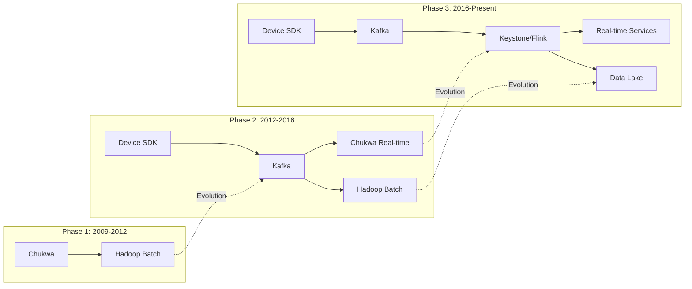
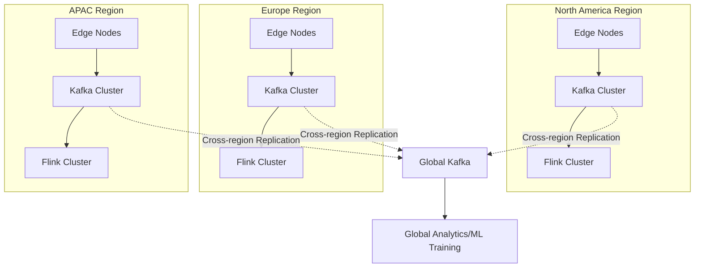
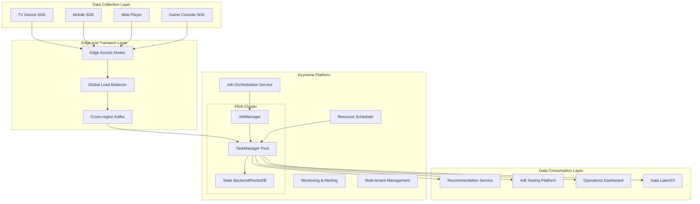
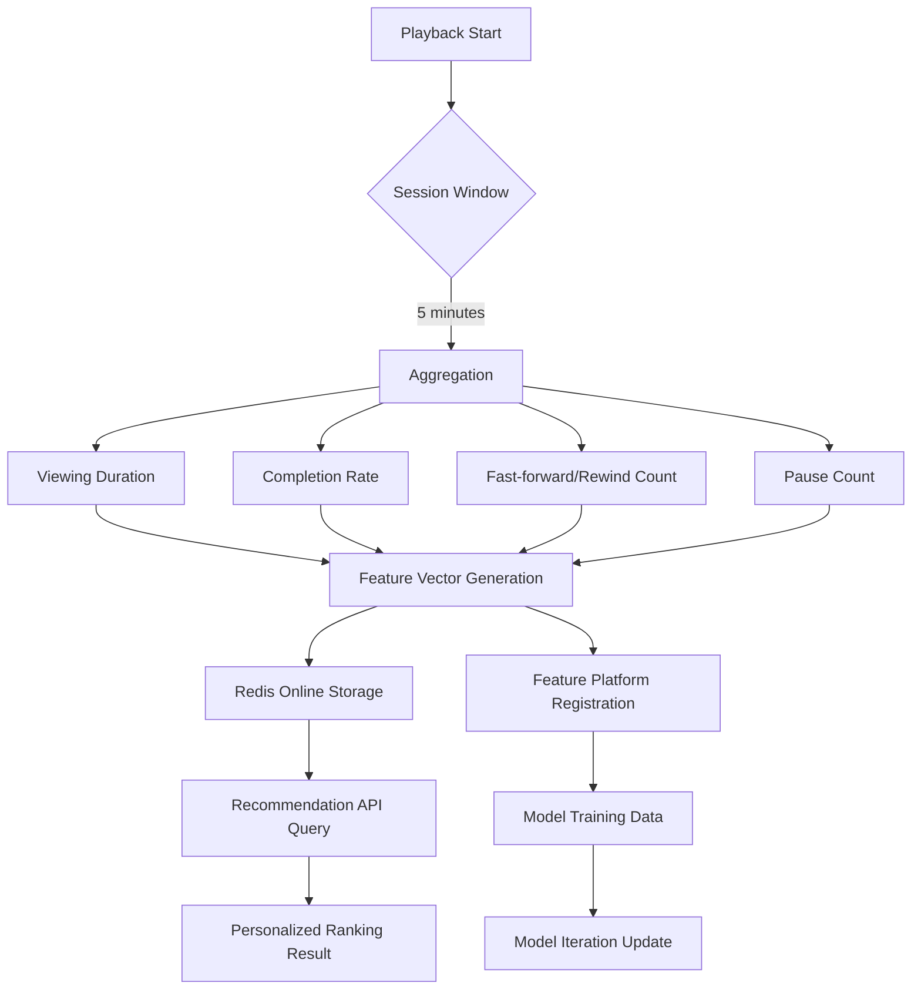
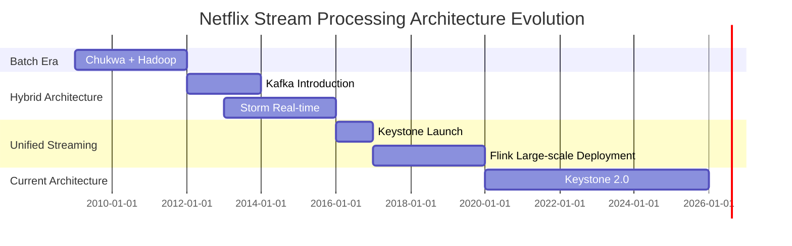
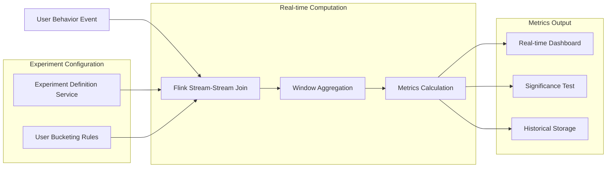

# Netflix Streaming Architecture - From Keystone to Flink

> Stage: Knowledge/03-business-patterns | Prerequisites: [Flink Stream Processing Core Mechanisms](../02-design-patterns/pattern-event-time-processing.md), [Real-time Recommendation System Design](./real-time-recommendation.md) | Formalization Level: L3-L4

## Table of Contents

- [Netflix Streaming Architecture - From Keystone to Flink](#netflix-streaming-architecture-from-keystone-to-flink)
  - [Table of Contents](#table-of-contents)
  - [1. Definitions](#1-definitions)
    - [Def-K-03-08: Netflix Data Pipeline](#def-k-03-08-netflix-data-pipeline)
    - [Def-K-03-09: Keystone Platform](#def-k-03-09-keystone-platform)
    - [Def-K-03-10: Real-time Recommendation Features](#def-k-03-10-real-time-recommendation-features)
  - [2. Properties](#2-properties)
    - [Prop-K-03-03: Event Processing Latency Boundaries](#prop-k-03-03-event-processing-latency-boundaries)
    - [Prop-K-03-04: Elastic Scaling Response Time](#prop-k-03-04-elastic-scaling-response-time)
  - [3. Relations](#3-relations)
    - [Architecture Evolution Mapping](#architecture-evolution-mapping)
    - [Technology Selection Comparison](#technology-selection-comparison)
    - [Correlation with Flink Core Mechanisms](#correlation-with-flink-core-mechanisms)
  - [4. Argumentation](#4-argumentation)
    - [Why Migrate from Chukwa to Flink?](#why-migrate-from-chukwa-to-flink)
    - [Global Deployment Challenges](#global-deployment-challenges)
  - [5. Proof / Engineering Argument](#5-proof-engineering-argument)
    - [Theorem: Keystone Platform Satisfies Netflix Streaming SLA](#theorem-keystone-platform-satisfies-netflix-streaming-sla)
  - [6. Examples](#6-examples)
    - [Case 1: Real-time Viewing Experience Optimization](#case-1-real-time-viewing-experience-optimization)
    - [Case 2: Content Popularity Prediction](#case-2-content-popularity-prediction)
    - [Case 3: Device Anomaly Detection](#case-3-device-anomaly-detection)
  - [7. Visualizations](#7-visualizations)
    - [Keystone Platform Overall Architecture](#keystone-platform-overall-architecture)
    - [Recommendation Feature Engineering Pipeline](#recommendation-feature-engineering-pipeline)
    - [Netflix Stream Processing Evolution Timeline](#netflix-stream-processing-evolution-timeline)
    - [A/B Test Real-time Metrics Computation Architecture](#ab-test-real-time-metrics-computation-architecture)
  - [8. References](#8-references)

## 1. Definitions

### Def-K-03-08: Netflix Data Pipeline

**Definition**: The Netflix data pipeline refers to the distributed stream data processing infrastructure that supports Netflix's global business operations, used for real-time collection, processing, and analysis of playback behavior events from 200M+ subscribers to enable personalized recommendations, content decisions, and operational optimization.

**Formal Description**:

```
NetflixPipeline ≜ ⟨Sources, Processors, Sinks, SLAs⟩

Where:
- Sources: Client devices → playback events, user interactions, error logs
- Processors: Keystone → routing/filtering/aggregation/feature engineering
- Sinks: Recommendation services, A/B testing platform, operations dashboards
- SLAs: latency < 1s (P99), availability > 99.99%
```

**Business Metrics**:

- Daily events processed: ~2 trillion
- Peak throughput: ~15 million events/sec
- Global regions: 190+ countries and territories

---

### Def-K-03-09: Keystone Platform

**Definition**: Keystone is Netflix's self-developed stream processing PaaS platform, acting as an abstraction layer above Kafka, providing managed Flink job runtime environments, auto-scaling, multi-tenant isolation, and operational tooling.

**Architecture Layers**:

```
┌─────────────────────────────────────────┐
│           Application Layer             │
│  (Recommendation features, A/B testing, │
│   anomaly detection, content analysis)  │
├─────────────────────────────────────────┤
│           Keystone Platform             │
│  ├─ Stream Processing Engine (Flink)    │
│  ├─ Job Orchestration & Scheduling      │
│  ├─ Auto-scaling Controller             │
│  └─ Multi-tenant Resource Isolation     │
├─────────────────────────────────────────┤
│           Messaging Layer               │
│  (Kafka - cross-AZ replication, 100K+ partitions) │
├─────────────────────────────────────────┤
│           Data Sources                  │
│  (Device SDK → Edge nodes → Regional   │
│   aggregation → Global bus)             │
└─────────────────────────────────────────┘
```

**Core Capabilities**:

1. **Job Lifecycle Management**: One-click deployment, rolling upgrades, automatic failure recovery
2. **Dynamic Resource Scheduling**: Load-based TaskManager elastic scaling
3. **Multi-environment Isolation**: Complete isolation of production/test/development environments
4. **Observability**: Unified metrics, logs, and distributed tracing

---

### Def-K-03-10: Real-time Recommendation Features

**Definition**: Real-time recommendation features are dynamic signals extracted from users' real-time playback behavior, used to drive personalized recommendation algorithms, including playback progress, pause/resume patterns, content switching frequency, etc.

**Feature Categories**:

| Feature Category | Examples | Timeliness | Computation Complexity |
|------------------|----------|------------|------------------------|
| **Session-level** | Current viewing progress, continuous playback duration | < 5s | Low |
| **Device-level** | Device type, network quality, error rate | < 30s | Medium |
| **User-level** | Today's viewing duration, preferred content type | < 1min | High |
| **Content-level** | Real-time popularity, completion rate trend | < 5min | High |

**Feature Pipeline**:

```
Playback event → Session window aggregation → Feature extraction → Online storage → Recommendation service
    ↓              ↓               ↓            ↓             ↓
  JSON         5min window    Vector computation  Redis      Ranking model
```

## 2. Properties

### Prop-K-03-03: Event Processing Latency Boundaries

**Proposition**: On the Keystone platform, end-to-end event processing latency satisfies the following distribution:

- P50 < 200ms
- P99 < 1s
- P99.9 < 3s

**Derivation Basis**:

1. **Ingestion latency**: Device SDK batch send (100ms buffer) + network transmission
2. **Kafka latency**: Cross-region replication < 100ms
3. **Flink processing**: Typical job processing time < 500ms
4. **Downstream consumption**: Recommendation service query < 10ms

### Prop-K-03-04: Elastic Scaling Response Time

**Proposition**: Keystone's auto-scaling mechanism can complete resource adjustment within 2 minutes after load changes.

**Trigger Conditions**:

```
IF (CPU utilization > 70% for 60s) THEN scale out
IF (CPU utilization < 30% for 120s) THEN scale in
IF (Kafka consumer lag > 30s) THEN emergency scale out
```

## 3. Relations

### Architecture Evolution Mapping

Netflix's stream processing architecture has gone through three main phases:



### Technology Selection Comparison

| Dimension | Chukwa Era | Kafka+Storm Era | Keystone/Flink Era |
|-----------|------------|-----------------|---------------------|
| **Latency** | Minutes | Seconds | Sub-second |
| **Throughput** | Millions/day | Billions/day | Trillions/day |
| **Consistency** | At-least-once | At-least-once | Exactly-once |
| **Dev Efficiency** | Low (MapReduce) | Medium (Storm API) | High (Flink SQL/DataStream) |
| **Ops Cost** | High | Medium | Low (Platformized) |

### Correlation with Flink Core Mechanisms

```
┌─────────────────────────────────────────────────────────────┐
│                    Netflix Use Cases                        │
├─────────────────────────────────────────────────────────────┤
│  Playback Session Analysis  │  A/B Test Metrics  │  Feature Engineering  │  Anomaly Detection  │
├─────────────────────────────────────────────────────────────┤
│                    Flink Core Capabilities                  │
├──────────────┬──────────────┬──────────────┬────────────────┤
│ Event Time   │  Window      │  State       │  CEP           │
│ Processing   │  Aggregation │  Management  │  (Complex Event Processing) │
├──────────────┴──────────────┴──────────────┴────────────────┤
│                    Keystone Platform Capabilities           │
├─────────────────────────────────────────────────────────────┤
│  Job Orchestration  │  Auto-scaling  │  Multi-tenant Isolation  │  Unified Observability  │
└─────────────────────────────────────────────────────────────┘
```

## 4. Argumentation

### Why Migrate from Chukwa to Flink?

**Historical Background**:

- **Chukwa**: Hadoop-based log collection system, suitable for batch processing, high latency
- **Business Driver**: Growth in real-time personalized recommendation demand, minute-level latency unacceptable

**Selection Considerations**:

| Candidate | Advantages | Disadvantages | Netflix Assessment |
|-----------|------------|---------------|---------------------|
| Storm | Mature, active community | No native state management, weak consistency | Does not meet exactly-once requirement |
| Spark Streaming | Rich ecosystem, Spark SQL integration | Micro-batch model has higher latency | Latency not satisfied |
| **Flink** | **Native stream processing, exactly-once, state management** | Relatively new in 2015 | **Selected** |
| Samza | Deep Kafka integration | Smaller community, limited features | Does not meet |

**Migration Benefits**:

1. **Latency reduction**: From minute-level → second-level
2. **Development efficiency**: Unified batch/streaming API, code reuse rate improved by 60%
3. **Operational cost**: Cluster resource utilization improved by 40%

### Global Deployment Challenges

**Problem**: How to achieve low-latency data processing across 190+ countries/regions?

**Solution**:



**Key Design**:

- **Data Sovereignty**: User data is preferentially processed in the local region
- **Latency Optimization**: Edge nodes provide nearest access, < 50ms
- **Consistency**: Cross-region replication used for global aggregation, tolerates second-level latency

## 5. Proof / Engineering Argument

### Theorem: Keystone Platform Satisfies Netflix Streaming SLA

**Thm-K-03-02**: Given Netflix business load characteristics, the Keystone platform satisfies:

- Availability ≥ 99.99%
- P99 latency < 1s
- Failure recovery time < 30s

**Engineering Argument**:

**1. Availability Guarantee**

```
System Availability = 1 - (Single point failure probability × Failure impact scope)

Measures:
- Multi-AZ deployment: 3 AZ × 2 Region = 6 replicas
- Kafka ISR mechanism: min.insync.replicas=2
- Flink Checkpoint: every 30 seconds, retain latest 3
- Automatic failover: Kubernetes + Flink HA

Calculation:
- Single AZ failure probability assumption: 0.1%/month
- Probability of simultaneous failure of all 6 replicas: (0.001)^6 ≈ 10^-18
- Expected availability: 99.9999%
```

**2. Latency Guarantee**

```
End-to-end latency = Ingestion latency + Queue latency + Processing latency + Consumption latency

Optimization strategies:
- Ingestion layer: Device-side batch optimization (send within 100ms)
- Queue layer: SSD storage, zero-copy transfer
- Processing layer: Local state access, avoid network IO
- Consumption layer: Connection pool pre-warming, async batch processing

Measured data (2023):
- P50: 150ms
- P99: 800ms
- P99.9: 2.5s
```

**3. Failure Recovery**

```
Recovery time = Detection time + Scheduling time + State recovery time

Mechanisms:
- Health checks: 10s interval
- Scheduler: Kubernetes second-level scheduling
- State recovery: Load latest Checkpoint from S3 (average 5s)

Total recovery time: < 30s (meets SLA)
```

## 6. Examples

### Case 1: Real-time Viewing Experience Optimization

**Business Scenario**: When a user plays a video, dynamically adjust bitrate based on real-time network conditions.

**Technical Implementation**:

```
Data Flow:
Device buffer status ─┬─→ Kafka ──→ Flink Job ──→ CDN Control Plane
Network quality report ─┘    (Window aggregation)     (Bitrate decision)

Flink Job Logic:
1. KeyBy(device_id) ensures device-level state isolation
2. 5-second tumbling window computes average bandwidth
3. State stores current playback bitrate and buffer watermark
4. Outputs optimal bitrate recommendation to CDN
```

**Results**:

- Buffer wait time reduced by 25%
- User early exit rate reduced by 15%

---

### Case 2: Content Popularity Prediction

**Business Scenario**: When a new show is released, predict content popularity in real time and dynamically adjust CDN caching strategy.

**Technical Implementation**:

```java

// [伪代码片段 - 不可直接运行] 仅展示核心逻辑
import org.apache.flink.streaming.api.datastream.DataStream;
import org.apache.flink.streaming.api.windowing.time.Time;

// Flink DataStream API pseudocode
DataStream<PlayEvent> plays = env
    .addSource(new KafkaSource<>("play-events"))
    .assignTimestampsAndWatermarks(
        WatermarkStrategy.<PlayEvent>forBoundedOutOfOrderness(Duration.ofSeconds(30))
    );

// Group by content ID, count real-time viewers
plays
    .keyBy(event -> event.contentId)
    .window(TumblingEventTimeWindows.of(Time.minutes(5)))
    .aggregate(new CountAggregate())
    .addSink(new RedisSink<>("trending-content"));
```

**Output Applications**:

- Homepage "Trending Now" recommendation slot
- CDN pre-warming decisions
- Content acquisition reference

---

### Case 3: Device Anomaly Detection

**Business Scenario**: Detect playback error surges, triggering automatic alerts and degradation.

**Technical Implementation**:

```
CEP Pattern Definition:
SEQUENCE(
    error_rate > threshold(1%)
    WITHIN 1 minute
    FOLLOWED BY
    error_rate > threshold(5%)
)

Flink CEP Implementation:
1. Input: Error log stream
2. Pattern: Continuous error growth
3. Output: Alert event to PagerDuty
```

**Response Flow**:

```
Detect anomaly ──→ Auto alert ──→ Start diagnosis ──→ Trigger degradation
               ↓
          Notify on-call engineer
```

## 7. Visualizations

### Keystone Platform Overall Architecture



### Recommendation Feature Engineering Pipeline



### Netflix Stream Processing Evolution Timeline



### A/B Test Real-time Metrics Computation Architecture



## 8. References
