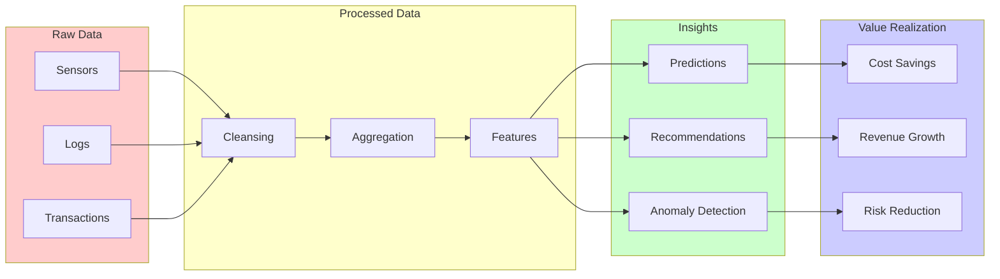
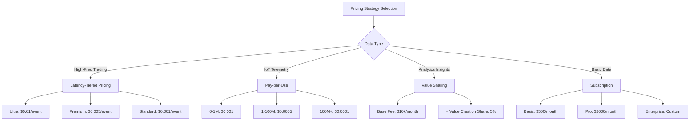
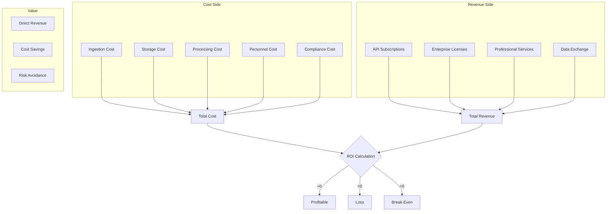

# Streaming Data Product Economics and Monetization Strategy

> **Stage**: Knowledge/03-business-patterns | **Prerequisites**: [Real-Time Data Mesh](./data-mesh-streaming-architecture-2026-en.md), [Data Governance](../08-standards/streaming-data-governance-quality-en.md) | **Formality Level**: L2-L3

## 1. Definitions

### Def-K-03-50: Data Product Economics

**Data Product Economics** studies value creation and capture from data as an asset:

$$
\text{Data Value} = f(\text{Quality}, \text{Utility}, \text{Scarcity}, \text{Timeliness})
$$

**Special Properties of Streaming Data**:

| Property | Batch Data | Streaming Data | Value Impact |
|----------|-----------|----------------|--------------|
| **Timeliness** | Hours/Days | Milliseconds/Seconds | **10-100x** |
| **Freshness Decay** | Slow | Exponential | Requires immediate consumption |
| **Processing Cost** | Low | Higher | Requires ROI optimization |
| **Application Value** | Retrospective analysis | Real-time decisions | Operational value |

### Def-K-03-51: Data Monetization Models

**Data Monetization Model Classification**:

```
Data Monetization
├── Direct Monetization
│   ├── Raw Data Sales
│   ├── API Subscriptions
│   └── Licensing
│
├── Indirect Monetization
│   ├── Product Enhancement
│   ├── Operational Efficiency
│   └── Risk Reduction
│
└── Ecosystem Monetization
    ├── Data Exchange (Barter)
    ├── Data Coalitions
    └── Platform Economics
```

### Def-K-03-52: Real-Time Data Pricing

**Real-Time Data Pricing Strategies**:

| Pricing Model | Applicable Scenario | Formula | Example |
|---------------|---------------------|---------|---------|
| **Pay-per-Use** | Event-driven | $/GB or $/Million Events | Kafka Cloud |
| **Latency-Tiered** | Differentiated service | Low latency = High price | Financial market data |
| **Value-Based** | Value capture | % of value created | Trading signals |
| **Subscription** | Stable demand | $/Month fixed fee | API packages |
| **Hybrid** | Complex scenarios | Base fee + Overage fee | Enterprise contracts |

**Latency-Price Relationship**:

$$
\text{Price}(latency) = P_{base} \times e^{-\lambda \cdot latency}
$$

- Sub-second: 10-100x base price
- Second-level: 2-5x base price
- Minute-level: 1x base price

### Def-K-03-53: Data Value Scoring

**Data Value Scoring Model**:

$$
\text{Value Score} = \sum_{i} w_i \cdot \text{Metric}_i
$$

**Scoring Dimensions**:

```yaml
Quality Dimension (30%):
  - Accuracy: Error rate < 0.1%
  - Completeness: Field fill rate > 95%
  - Consistency: Cross-source consistency > 99%

Utility Dimension (40%):
  - Usage frequency: Daily active queries
  - Decision impact: Associated business metrics
  - Irreplaceability: Competitor comparison

Timeliness Dimension (20%):
  - Update frequency: Real-time / Hourly / Daily
  - Freshness: Latency from generation to availability

Cost Dimension (10%):
  - Ingestion cost
  - Storage cost
  - Processing cost
```

### Def-K-03-54: Data Marketplace Mechanics

**Data Marketplace Mechanics**:

```
Supply Side
├── Data Producers (Raw Data)
├── Data Processors (Feature Engineering)
└── Data Scientists (Models / Insights)

Demand Side
├── Enterprise Users (BI / Analytics)
├── Developers (API Integration)
└── AI/ML Teams (Training Data)

Market Intermediary
├── Data Catalog / Discovery
├── Quality Verification
├── Compliance Review
└── Transaction Settlement
```

### Def-K-03-55: Streaming Data ROI

**Streaming Data ROI Calculation**:

$$
\text{ROI}_{streaming} = \frac{\text{Value}_{realtime} - \text{Cost}_{streaming}}{\text{Cost}_{streaming}} \times 100\%
$$

**Value Quantification Methods**:

| Value Type | Quantification Method | Example |
|------------|----------------------|---------|
| **Revenue Growth** | A/B test comparison | Real-time recommendations +15% conversion |
| **Cost Savings** | Before/after comparison | Predictive maintenance -30% downtime |
| **Risk Reduction** | Loss avoidance | Fraud detection prevents $10M loss |
| **Efficiency Gain** | Time savings | Real-time dashboards save 10 person-days/week |

## 2. Properties

### Lemma-K-03-50: Data Freshness Value Decay

**Lemma**: Data value decays exponentially over time:

$$
V(t) = V_0 \cdot e^{-\frac{t}{\tau}}
$$

Where $\tau$ is the characteristic time constant:

- High-frequency trading: $\tau$ = milliseconds
- Inventory management: $\tau$ = hours
- User behavior: $\tau$ = days

### Prop-K-03-50: Real-Time Data Premium

**Proposition**: Real-time data enjoys a significant premium over batch data:

$$
\frac{P_{realtime}}{P_{batch}} \in [2, 100]
$$

**Industry Benchmarks**:

- Financial market data: 50-100x
- IoT telemetry: 5-10x
- Log analysis: 2-3x

### Prop-K-03-51: Data Network Effects

**Proposition**: Data products exhibit network effects:

$$
\text{Value}(n) = V_0 \cdot n^{\beta}, \quad \beta \in [1, 2]
$$

Where $n$ is the number of users and $\beta$ is the network effect coefficient.

### Lemma-K-03-51: Marginal Cost Decrease

**Lemma**: The marginal cost of data replication approaches zero:

$$
\lim_{n \to \infty} MC(n) = 0
$$

**Strategic Significance**: Profit margins become extremely high at scale.

## 3. Relations

### 3.1 Data Value Hierarchy

```
┌─────────────────────────────────────────────────────────────────┐
│                    Data Value Hierarchy                         │
├─────────────────────────────────────────────────────────────────┤
│  L5: Prescriptive                                               │
│     └── AI Auto-Decision + Autonomous Optimization              │
│         Value: $$$$$$                                           │
├─────────────────────────────────────────────────────────────────┤
│  L4: Predictive                                                 │
│     └── Predictive Models + Risk Early Warning                  │
│         Value: $$$$                                             │
├─────────────────────────────────────────────────────────────────┤
│  L3: Diagnostic                                                 │
│     └── Root Cause Analysis + Anomaly Detection                 │
│         Value: $$$                                              │
├─────────────────────────────────────────────────────────────────┤
│  L2: Descriptive                                                │
│     └── Real-Time Dashboards + Ad-Hoc Queries                   │
│         Value: $$                                               │
├─────────────────────────────────────────────────────────────────┤
│  L1: Raw Data                                                   │
│     └── Event Streams + Logs                                    │
│         Value: $                                                │
└─────────────────────────────────────────────────────────────────┘
```

### 3.2 Streaming Data Monetization Architecture

```
┌─────────────────────────────────────────────────────────────────┐
│                    Monetization Platform                        │
│                                                                 │
│  ┌──────────────────────────────────────────────────────────┐  │
│  │              Data Products Catalog                        │  │
│  │  - Real-time Market Data                                  │  │
│  │  - User Behavior Streams                                  │  │
│  │  - IoT Telemetry Feeds                                    │  │
│  │  - Fraud Detection Signals                                │  │
│  └────────────────────────┬─────────────────────────────────┘  │
│                           │                                     │
│  ┌────────────────────────▼─────────────────────────────────┐  │
│  │              Pricing Engine                               │  │
│  │  - Dynamic pricing based on latency                       │  │
│  │  - Tiered subscription models                             │  │
│  │  - Usage-based metering                                   │  │
│  └────────────────────────┬─────────────────────────────────┘  │
│                           │                                     │
│  ┌────────────────────────▼─────────────────────────────────┐  │
│  │              Access Control                               │  │
│  │  - API Key management                                     │  │
│  │  - Rate limiting                                          │  │
│  │  - Entitlement checking                                   │  │
│  └────────────────────────┬─────────────────────────────────┘  │
│                           │                                     │
│  ┌────────────────────────▼─────────────────────────────────┐  │
│  │              Billing & Settlement                         │  │
│  │  - Real-time usage tracking                               │  │
│  │  - Invoice generation                                     │  │
│  │  - Revenue sharing                                        │  │
│  └──────────────────────────────────────────────────────────┘  │
└─────────────────────────────────────────────────────────────────┘
```

### 3.3 Data Product Profit & Loss Analysis

| Cost Item | Proportion | Optimization Strategy |
|-----------|------------|----------------------|
| **Data Ingestion** | 20% | Edge filtering to reduce transmission |
| **Storage** | 30% | Tiered storage, hot/cold separation |
| **Processing** | 35% | Resource scheduling, Spot instances |
| **Network** | 10% | Compression, CDN optimization |
| **Operations** | 5% | Automated operations |

## 4. Argumentation

### 4.1 Why Does Streaming Data Need Specialized Economics?

**Limitations of Traditional Data Economics**:

1. **Ignores Timeliness**: Treats real-time and batch data equally
2. **Static Pricing**: Cannot reflect value decay over time
3. **Opaque Costs**: Difficult to trace data lineage costs

**Innovations in Streaming Data Economics**:

1. **Time Dimension**: Introduces freshness as a core value parameter
2. **Dynamic Pricing**: Real-time pricing based on latency and service quality
3. **Full-Chain Cost Tracking**: Complete cost tracking from ingestion to consumption

### 4.2 Anti-Patterns

**Anti-Pattern 1: Free Data Trap**

```
❌ Strategy: Free data to acquire users
Problems:
  - Cannot cover infrastructure costs
  - Users do not value free resources
  - Service quality degrades

✅ Correct Strategy:
  - Free trial tier (limited quota)
  - Clear value exchange
  - Tiered pricing to serve multiple levels
```

**Anti-Pattern 2: Ignoring Hidden Costs**

```yaml
❌ Pricing Calculation:
  revenue: $100k/year
  infra_cost: $30k/year
  # Ignoring personnel, compliance, support costs

Reality:
  engineering: $200k/year
  compliance: $50k/year
  support: $30k/year

✅ Correct Calculation:
  total_cost: $310k/year
  required_revenue: $400k/year  # 30% margin
```

**Anti-Pattern 3: Static Pricing**

```
❌ Fixed Price:
  API Call: $0.001  # Regardless of time or load

✅ Dynamic Pricing:
  - Base rate: $0.001
  - Peak surcharge: +50% (9-5 weekdays)
  - Off-peak discount: -30% (nighttime)
  - Committed use discount: up to -40%
```

## 5. Proof / Engineering Argument

### Thm-K-03-50: Real-Time Data Optimal Pricing Theorem

**Theorem**: Profit-maximizing real-time data pricing:

$$
P^* = \arg\max_P \left( P \cdot D(P) - C(D(P)) \right)
$$

Where $D(P)$ is the price-demand function and $C(Q)$ is the cost function.

**First-Order Condition**:

$$
D(P^*) + P^* \cdot D'(P^*) = C'(D(P^*)) \cdot D'(P^*)
$$

### Thm-K-03-51: Data Network Effect Value Theorem

**Theorem**: Value of a data product with network effects:

$$
V(n) = V_0 + \alpha \sum_{i=1}^{n} i^{\beta-1}
$$

When $\beta > 1$, it exhibits superlinear growth.

### Thm-K-03-52: Multi-Tenant Cost Allocation Theorem

**Theorem**: Unit cost when $n$ tenants share fixed costs:

$$
AC(n) = \frac{F}{n} + v
$$

Where $F$ is the fixed cost and $v$ is the variable cost.

## 6. Examples

### 6.1 Real-Time Market Data Pricing

```python
# Financial market data pricing engine
class MarketDataPricingEngine:
    def __init__(self):
        self.base_prices = {
            'level1': 0.001,      # Best bid/ask
            'level2': 0.005,      # Depth data
            'level3': 0.02        # Tick-by-tick trades
        }
        self.latency_tiers = {
            'ultra': {'max_latency_ms': 10, 'multiplier': 10},
            'premium': {'max_latency_ms': 50, 'multiplier': 5},
            'standard': {'max_latency_ms': 200, 'multiplier': 1},
            'delayed': {'max_latency_ms': 15000, 'multiplier': 0.1}
        }

    def calculate_price(self, data_level, latency_tier, volume_estimate):
        """Calculate customized price"""
        base = self.base_prices[data_level]
        tier = self.latency_tiers[latency_tier]

        # Latency premium
        price_per_event = base * tier['multiplier']

        # Volume discount
        volume_discount = self.calculate_volume_discount(volume_estimate)

        # Commitment discount
        commitment_discount = 0.2 if volume_estimate > 1e9 else 0

        final_price = price_per_event * (1 - volume_discount) * (1 - commitment_discount)

        return {
            'price_per_million_events': final_price * 1e6,
            'monthly_estimate': final_price * volume_estimate,
            'sla_latency_ms': tier['max_latency_ms'],
            'breakdown': {
                'base': base,
                'latency_multiplier': tier['multiplier'],
                'volume_discount': volume_discount,
                'commitment_discount': commitment_discount
            }
        }

    def calculate_volume_discount(self, volume):
        """Tiered volume discount"""
        if volume > 10e9:      # >10B events/month
            return 0.40
        elif volume > 1e9:     # >1B events/month
            return 0.25
        elif volume > 100e6:   # >100M events/month
            return 0.15
        elif volume > 10e6:    # >10M events/month
            return 0.05
        else:
            return 0

# Usage example
engine = MarketDataPricingEngine()

# HFT client
hft_quote = engine.calculate_price(
    data_level='level2',
    latency_tier='ultra',
    volume_estimate=50e9  # 50B events/month
)
print(f"HFT Client Price: ${hft_quote['monthly_estimate']:,.0f}/month")

# Quant fund client
quant_quote = engine.calculate_price(
    data_level='level2',
    latency_tier='premium',
    volume_estimate=500e6  # 500M events/month
)
print(f"Quant Client Price: ${quant_quote['monthly_estimate']:,.0f}/month")
```

### 6.2 Data Product ROI Calculation

```python
class StreamingDataROI:
    def __init__(self):
        self.cost_structure = {}
        self.revenue_streams = {}

    def calculate_tco(self, data_product):
        """Calculate total cost of ownership"""

        # Infrastructure costs
        infra_costs = {
            'ingestion': self.calculate_ingestion_cost(data_product),
            'storage': self.calculate_storage_cost(data_product),
            'processing': self.calculate_processing_cost(data_product),
            'serving': self.calculate_serving_cost(data_product),
            'network': self.calculate_network_cost(data_product)
        }

        # Personnel costs
        personnel_costs = {
            'engineering': data_product['team_size'] * 150000,  # Annual salary
            'data_science': data_product.get('ds_team_size', 0) * 160000,
            'support': data_product.get('support_headcount', 0.5) * 80000
        }

        # Compliance costs
        compliance_costs = {
            'gdpr_compliance': 50000 if data_product['contains_pii'] else 0,
            'security_audit': 30000,
            'legal_review': 20000
        }

        total_cost = sum(infra_costs.values()) + sum(personnel_costs.values()) + sum(compliance_costs.values())

        return {
            'total_annual_cost': total_cost,
            'breakdown': {
                'infrastructure': infra_costs,
                'personnel': personnel_costs,
                'compliance': compliance_costs
            },
            'cost_per_event': total_cost / data_product['annual_events']
        }

    def calculate_revenue(self, data_product):
        """Calculate revenue"""

        revenue_streams = {
            'api_subscriptions': self.calculate_api_revenue(data_product),
            'enterprise_licenses': self.calculate_enterprise_revenue(data_product),
            'professional_services': self.calculate_ps_revenue(data_product),
            'data_reselling': self.calculate_resell_revenue(data_product)
        }

        return {
            'total_annual_revenue': sum(revenue_streams.values()),
            'streams': revenue_streams,
            'arpu': sum(revenue_streams.values()) / data_product['customer_count']
        }

    def generate_profitability_report(self, data_product):
        """Generate profitability report"""

        costs = self.calculate_tco(data_product)
        revenue = self.calculate_revenue(data_product)

        profit = revenue['total_annual_revenue'] - costs['total_annual_cost']
        margin = profit / revenue['total_annual_revenue'] if revenue['total_annual_revenue'] > 0 else 0

        return {
            'costs': costs,
            'revenue': revenue,
            'profit': profit,
            'margin': margin,
            'roi': profit / costs['total_annual_cost'] if costs['total_annual_cost'] > 0 else 0,
            'recommendations': self.generate_recommendations(costs, revenue, margin)
        }

    def generate_recommendations(self, costs, revenue, margin):
        """Generate optimization recommendations"""
        recommendations = []

        if margin < 0.2:
            recommendations.append({
                'priority': 'HIGH',
                'action': 'Increase pricing or reduce costs',
                'details': f'Current margin {margin:.1%} is too low; recommend optimizing cost structure or adjusting pricing'
            })

        infra_ratio = sum(costs['breakdown']['infrastructure'].values()) / costs['total_annual_cost']
        if infra_ratio > 0.5:
            recommendations.append({
                'priority': 'MEDIUM',
                'action': 'Optimize infrastructure costs',
                'details': f'Infrastructure ratio {infra_ratio:.1%} is too high; recommend evaluating Spot instances or reserved capacity'
            })

        return recommendations

# Usage example
roi_calculator = StreamingDataROI()

realtime_behavior_product = {
    'name': 'User Behavior Stream',
    'annual_events': 100e9,  # 100B events/year
    'team_size': 5,
    'customer_count': 50,
    'contains_pii': True
}

report = roi_calculator.generate_profitability_report(realtime_behavior_product)
print(f"\nData Product: {realtime_behavior_product['name']}")
print(f"Annual Revenue: ${report['revenue']['total_annual_revenue']:,.0f}")
print(f"Annual Cost: ${report['costs']['total_annual_cost']:,.0f}")
print(f"Profit: ${report['profit']:,.0f}")
print(f"Margin: {report['margin']:.1%}")
print(f"ROI: {report['roi']:.1%}")
```

### 6.3 Data Marketplace Platform Implementation

```python
# Data marketplace platform core
class DataMarketplace:
    def __init__(self):
        self.products = {}
        self.transactions = []
        self.pricing_engine = MarketDataPricingEngine()

    def register_data_product(self, seller_id, product_spec):
        """Register a data product"""

        product_id = generate_uuid()

        # Quality assessment
        quality_score = self.assess_data_quality(product_spec['sample_data'])

        # Pricing suggestion
        suggested_pricing = self.pricing_engine.suggest_pricing(
            product_spec['data_characteristics'],
            quality_score
        )

        product = {
            'id': product_id,
            'seller_id': seller_id,
            'spec': product_spec,
            'quality_score': quality_score,
            'suggested_pricing': suggested_pricing,
            'status': 'pending_review'
        }

        self.products[product_id] = product
        return product_id

    def purchase_data_access(self, buyer_id, product_id, tier):
        """Purchase data access"""

        product = self.products[product_id]

        # Calculate price
        price = self.calculate_purchase_price(product, tier)

        # Generate API key
        api_key = self.generate_api_key(buyer_id, product_id, tier)

        # Record transaction
        transaction = {
            'id': generate_uuid(),
            'buyer_id': buyer_id,
            'product_id': product_id,
            'tier': tier,
            'price': price,
            'api_key': api_key['key'],
            'created_at': datetime.now(),
            'usage': {'events_consumed': 0, 'cost_incurred': 0}
        }

        self.transactions.append(transaction)

        # Set usage limits
        self.enforce_usage_limits(api_key, tier)

        return {
            'transaction_id': transaction['id'],
            'api_key': api_key['key'],
            'endpoints': product['spec']['endpoints'],
            'usage_limits': tier['limits']
        }

    def track_usage(self, api_key, event_count, latency_tier):
        """Track usage and bill"""

        transaction = self.find_transaction_by_key(api_key)
        product = self.products[transaction['product_id']]

        # Calculate cost
        unit_price = product['suggested_pricing']['tier_pricing'][latency_tier]
        cost = event_count * unit_price

        # Update usage record
        transaction['usage']['events_consumed'] += event_count
        transaction['usage']['cost_incurred'] += cost

        # Check if limit exceeded
        if transaction['usage']['cost_incurred'] > transaction['tier']['monthly_limit']:
            self.throttle_access(api_key)

        # Real-time billing
        self.charge_buyer(transaction['buyer_id'], cost)
        self.credit_seller(product['seller_id'], cost * 0.7)  # 70% to seller

    def assess_data_quality(self, sample_data):
        """Assess data quality"""

        metrics = {
            'completeness': self.calculate_completeness(sample_data),
            'accuracy': self.calculate_accuracy(sample_data),
            'freshness': self.calculate_freshness(sample_data),
            'consistency': self.calculate_consistency(sample_data),
            'uniqueness': self.calculate_uniqueness(sample_data)
        }

        # Weighted composite
        weights = {
            'completeness': 0.25,
            'accuracy': 0.30,
            'freshness': 0.25,
            'consistency': 0.10,
            'uniqueness': 0.10
        }

        overall_score = sum(metrics[k] * weights[k] for k in metrics)

        return {
            'overall': overall_score,
            'metrics': metrics,
            'grade': self.score_to_grade(overall_score)
        }
```

### 6.4 Value Realization Tracking

```sql
-- Data product value tracking SQL (Flink SQL)

-- 1. Create data usage event table
CREATE TABLE data_usage_events (
    event_time TIMESTAMP(3),
    api_key STRING,
    product_id STRING,
    endpoint STRING,
    event_count BIGINT,
    latency_ms INT,
    client_ip STRING,
    WATERMARK FOR event_time AS event_time - INTERVAL '5' SECOND
) WITH (
    'connector' = 'kafka',
    'topic' = 'data-usage-events'
);

-- 2. Real-time revenue calculation
CREATE TABLE realtime_revenue (
    window_start TIMESTAMP(3),
    window_end TIMESTAMP(3),
    product_id STRING,
    tier STRING,
    total_events BIGINT,
    revenue_usd DECIMAL(18, 4)
) WITH (
    'connector' = 'jdbc',
    'table-name' = 'realtime_revenue'
);

INSERT INTO realtime_revenue
SELECT
    TUMBLE_START(event_time, INTERVAL '1' HOUR) as window_start,
    TUMBLE_END(event_time, INTERVAL '1' HOUR) as window_end,
    product_id,
    CASE
        WHEN latency_ms < 10 THEN 'ultra'
        WHEN latency_ms < 50 THEN 'premium'
        ELSE 'standard'
    END as tier,
    SUM(event_count) as total_events,
    SUM(
        event_count *
        CASE
            WHEN latency_ms < 10 THEN 0.01
            WHEN latency_ms < 50 THEN 0.005
            ELSE 0.001
        END
    ) as revenue_usd
FROM data_usage_events
GROUP BY
    TUMBLE(event_time, INTERVAL '1' HOUR),
    product_id;

-- 3. Customer value analysis
CREATE TABLE customer_value (
    customer_id STRING,
    product_id STRING,
    monthly_events BIGINT,
    monthly_revenue DECIMAL(18, 4),
    avg_latency_ms DOUBLE,
    health_score INT  -- 0-100, based on usage frequency and payment status
) WITH (
    'connector' = 'jdbc',
    'table-name' = 'customer_value'
);

INSERT INTO customer_value
SELECT
    api_key as customer_id,
    product_id,
    COUNT(*) as monthly_events,
    SUM(
        event_count *
        CASE
            WHEN latency_ms < 10 THEN 0.01
            WHEN latency_ms < 50 THEN 0.005
            ELSE 0.001
        END
    ) as monthly_revenue,
    AVG(latency_ms) as avg_latency_ms,
    CASE
        WHEN COUNT(*) > 1000000 THEN 100
        WHEN COUNT(*) > 100000 THEN 80
        WHEN COUNT(*) > 10000 THEN 60
        WHEN COUNT(*) > 1000 THEN 40
        ELSE 20
    END as health_score
FROM data_usage_events
WHERE event_time > NOW() - INTERVAL '30' DAY
GROUP BY api_key, product_id;
```

## 7. Visualizations

### 7.1 Data Monetization Value Chain



### 7.2 Pricing Strategy Matrix



### 7.3 Data Product ROI Model



## 8. References

---

*Document Version: v1.0 | Created: 2026-04-18*
