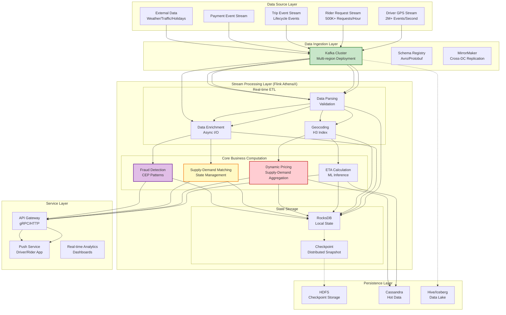
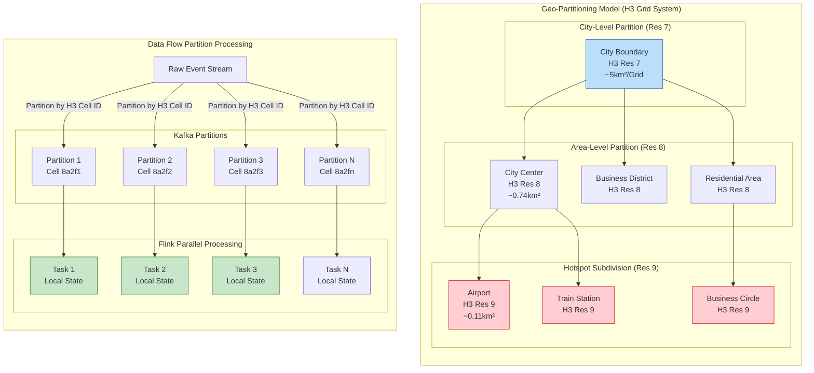
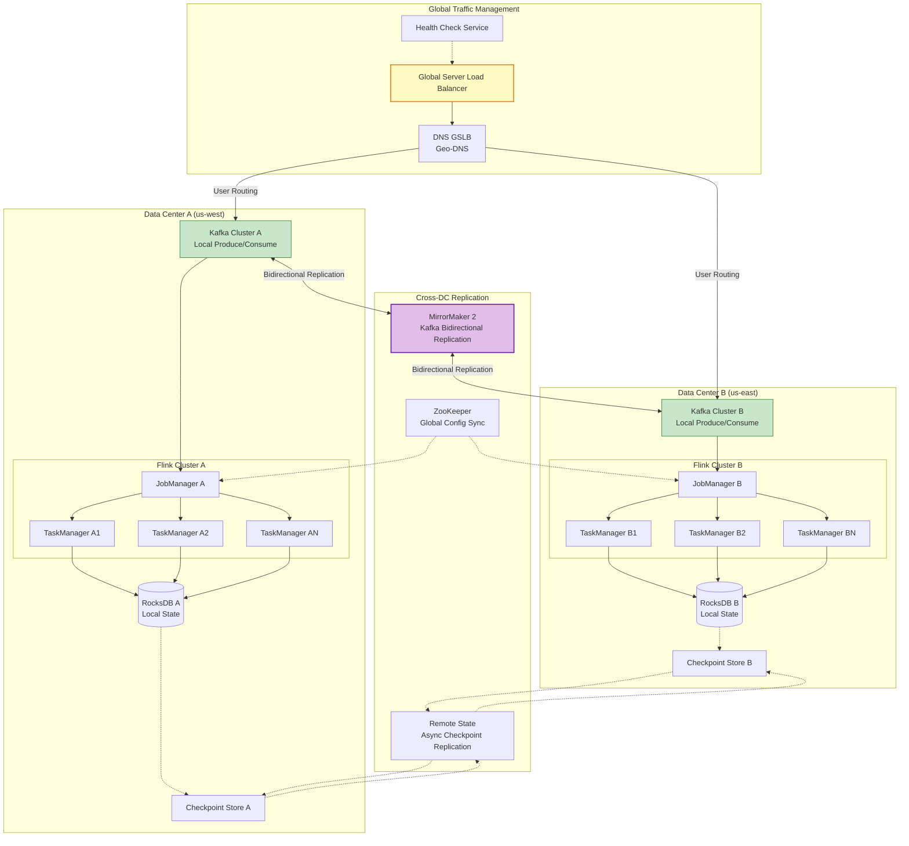

# Uber Real-Time Analytics Platform — Apache Flink Large-Scale Practice

> **Stage**: Knowledge/03-business-patterns | **Business Domain**: Ride-sharing | **Complexity**: ★★★★★ | **Latency Requirement**: < 200ms (Critical Path) | **Formality Level**: L3-L4
>
> This document deeply analyzes the Flink architecture evolution of Uber's real-time analytics platform, covering dual-active data center design, million-level QPS processing, geo-partitioning strategy, and other core technical challenges, providing engineering references for large-scale stream computing system construction.

---

## 1. Definitions

### Def-K-03-05: Uber Stream Computing Platform Architecture

**Definition**: The Uber stream computing platform (AthenaX) is a distributed real-time analytics platform built on Apache Flink, supporting Uber's core business scenarios worldwide including real-time supply-demand matching, dynamic pricing, and ETA calculation [^1][^2].

**Architecture Layers**:

```
┌─────────────────────────────────────────────────────────────────────┐
│              Uber Stream Computing Platform (AthenaX) Architecture   │
├─────────────────────────────────────────────────────────────────────┤
│                                                                     │
│  Layer 4: Application Services                                     │
│  ├── Real-time Supply-Demand Matching                               │
│  ├── Dynamic Pricing Engine (Surge Pricing Engine)                  │
│  ├── ETA Prediction Service                                         │
│  └── Fraud Detection                                                │
│                                                                     │
│  Layer 3: Stream Processing Engine                                 │
│  ├── Apache Flink Cluster (Multi-tenant Isolation)                  │
│  ├── Flink SQL / Table API (Business Logic Development)             │
│  ├── User-Defined Functions (UDFs: Geo Computation, ML Inference)   │
│  └── State Backend: RocksDB + Incremental Checkpoint                │
│                                                                     │
│  Layer 2: Data Ingestion & Buffering                               │
│  ├── Kafka Cluster (Multi-region Replication)                       │
│  ├── Geo-partitioned Topics                                         │
│  ├── Schema Registry (Avro/Protobuf)                                │
│  └── Data Lineage                                                   │
│                                                                     │
│  Layer 1: Data Sources                                             │
│  ├── Driver GPS Stream                                              │
│  ├── Rider Request Stream                                           │
│  ├── Trip Events: Order, Accept, Start, End                         │
│  ├── Payment Events                                                 │
│  └── External Data: Weather, Traffic, Holidays                      │
│                                                                     │
└─────────────────────────────────────────────────────────────────────┘
```

**Core Characteristics**:

| Dimension | Specification | Description |
|-----------|---------------|-------------|
| **Peak QPS** | 2M+ events/second | Global peak traffic [^3] |
| **End-to-End Latency** | P99 < 200ms | Critical path latency guarantee |
| **State Scale** | 100+ TB | Total state across clusters |
| **Geographic Coverage** | 70+ countries/regions | Global service scope |
| **Availability SLA** | 99.99% | Annual downtime < 1 hour |

---

### Def-K-03-06: Real-Time Supply-Demand Matching

**Definition**: Real-time supply-demand matching is Uber's core business process, analyzing driver location streams and rider request streams in real-time through the stream computing platform, computing optimal matching strategies under spatiotemporal constraints [^4].

**Formal Description**:

Let time window `W = [t, t + Δt]`, within this window:

- **Driver Collection**: `D = {d₁, d₂, ..., dₘ}`, each driver `dᵢ` has location attribute `loc(dᵢ, t)` and state `s(dᵢ) ∈ {available, busy, offline}`
- **Rider Request Collection**: `R = {r₁, r₂, ..., rₙ}`, each request `rⱼ` has location `loc(rⱼ)`, destination `dest(rⱼ)`, timestamp `ts(rⱼ)`

**Matching Function**:

```
Match(dᵢ, rⱼ) = {
    1  if s(dᵢ) = available ∧ dist(loc(dᵢ, t), loc(rⱼ)) ≤ D_max
    0  otherwise
}
```

**Optimization Objective**:

```
max_{M ⊆ D × R} Σ_{(dᵢ, rⱼ) ∈ M} (α · 1/ETA(dᵢ, rⱼ) + β · Score(dᵢ, rⱼ))
```

Constraints:

- Each driver matches at most one rider: `∀dᵢ: |{rⱼ : (dᵢ, rⱼ) ∈ M}| ≤ 1`
- Each request matches at most one driver: `∀rⱼ: |{dᵢ : (dᵢ, rⱼ) ∈ M}| ≤ 1`
- Match must complete within time window: `∀(dᵢ, rⱼ) ∈ M: ts(rⱼ) ∈ W`

Where:

- `ETA(dᵢ, rⱼ)`: Estimated driver arrival time at rider location
- `Score(dᵢ, rⱼ)`: Comprehensive score (driver rating, cancellation rate, route familiarity, etc.)
- `α, β`: Weight coefficients

---

### Def-K-03-07: Dynamic Pricing (Surge Pricing)

**Definition**: Dynamic Pricing (also known as Surge Pricing) is Uber's mechanism for dynamically adjusting ride prices based on real-time supply-demand relationships, balancing market demand and supply capacity through price signals [^5][^6].

**Pricing Model**:

**Base Pricing Formula**:

```
P_final = P_base × S × D(t)
```

Where:

- `P_base`: Base price (distance + time)
- `S`: Surge multiplier (dynamic premium coefficient)
- `D(t)`: Time dynamic adjustment factor (peak hours, holidays, etc.)

**Surge Multiplier Calculation**:

```
S = f(D_demand / S_supply) = {
    1.0                                         if ratio ≤ θ₁
    1.0 + k · ln(D_demand / S_supply)           if θ₁ < ratio ≤ θ₂
    S_max                                       if ratio > θ₂
}
```

**Parameter Description**:

| Parameter | Typical Value | Description |
|-----------|---------------|-------------|
| θ₁ | 0.8 | Supply-demand balance threshold lower bound |
| θ₂ | 3.0 | Supply-demand imbalance threshold upper bound |
| k | 0.5 | Sensitivity coefficient |
| S_max | 5.0 | Maximum premium multiplier |

**Geo-Grid Aggregation**:

Uber divides geographic space into hexagonal grids (H3 grid system), independently computing supply-demand ratio within each grid cell [^7]:

```
Surge_h = f(Σ_{r ∈ Grid_h} Demand(r) / Σ_{d ∈ Grid_h} Supply(d)), ∀h ∈ H3_Grid
```

---

## 2. Properties

### Prop-K-03-01: Geo-Partitioning Scalability Theorem

**Proposition**: Stream processing architecture based on geo-partitioning can achieve horizontal linear scaling, with throughput proportional to partition count.

**Formal Expression**:

Let geo-partition count be `N`, single-partition processing capacity be `C` (events/second), then total system throughput `T(N)` satisfies:

```
T(N) = Σᵢ₌₁ᴺ C · (1 - ε) = N · C · (1 - ε)
```

Where `ε` is inter-partition coordination overhead (typically `ε < 0.05`).

**Proof Sketch**:

1. **Partition Independence**: Geo-partitioning based on H3 grids naturally satisfies data locality, with low inter-grid dependency
2. **Load Balancing**: Fine-grained partitions for urban hotspots, coarse-grained partitions for suburbs, balancing partition loads
3. **Shared-nothing Architecture**: Each partition independently maintains state, avoiding cross-partition coordination

**Engineering Constraints**:

| Constraint | Value | Description |
|------------|-------|-------------|
| Single partition max throughput | ~50K events/second | Limited by single TaskManager resources |
| Recommended partition granularity | H3 Resolution 7-8 | City-level: ~1-5km range |
| State size upper limit | 10 GB/partition | RocksDB state backend optimization |
| Cross-partition data movement | < 5% | Driver cross-zone flow events |

---

### Lemma-K-03-01: Supply-Demand Balance Convergence Lemma

**Lemma**: Under the dynamic pricing mechanism, if Surge multiplier `S > 1` persists for time `T`, the supply-demand ratio will converge to the equilibrium interval.

**Conditions**:

- Price elasticity coefficient `η_d < 0` (demand decreases as price rises)
- Supply elasticity coefficient `η_s > 0` (supply increases as price rises)
- `η_s - η_d > 0` (net elasticity is positive)

**Proof**:

Let initial supply-demand ratio `ρ₀ = D₀/S₀ > 1` (supply shortage).

After `Δt`:

- Demand change: `D₁ = D₀ · S^(η_d)`
- Supply change: `S₁ = S₀ · S^(η_s)`

New supply-demand ratio:

```
ρ₁ = D₁/S₁ = (D₀ · S^(η_d))/(S₀ · S^(η_s)) = ρ₀ · S^(η_d - η_s) = ρ₀ · S^(-(η_s - η_d))
```

Since `η_s - η_d > 0` and `S > 1`, we have:

```
ρ₁ = ρ₀ · S^(-(η_s - η_d)) < ρ₀
```

Through iteration, as `t → ∞`, `ρ_t → 1` (equilibrium state).

**Uber Practical Experience** [^6]:

- Average convergence time: 3-5 minutes
- Typical elasticity coefficients: `η_d ≈ -0.8`, `η_s ≈ 0.5`
- Actual Surge duration: typically < 10 minutes

---

## 3. Relations

### Mapping with Flink Core Mechanisms

| Uber Business Concept | Flink Technical Implementation | Corresponding Mechanism |
|----------------------|-------------------------------|------------------------|
| Geo-partitioning | KeyBy(H3 Cell ID) | KeyedStream partitioning |
| Driver state maintenance | Keyed State (ValueState) | Operator State |
| Sliding window statistics | SlidingEventTimeWindows | Window Operator |
| Supply-demand ratio calculation | AggregateFunction | Incremental aggregation |
| Late GPS events | Side Output + Watermark | Disorder handling |
| Real-time pricing updates | Broadcast Stream | Broadcast state |
| Dual-active replication | Checkpoint + Savepoint | State snapshot |

### Dual-Active Architecture and Consistency Model Relationship

```
┌─────────────────────────────────────────────────────────────────────┐
│              Uber Dual-Active Architecture Consistency Strategy     │
├─────────────────────────────────────────────────────────────────────┤
│                                                                     │
│  Business Scenario              Consistency Requirement   Technical Solution      │
│  ─────────────────────────────────────────────────────────────────  │
│  Real-time Supply-Demand        Eventual Consistency (EC) Async Replication + CRDT │
│  Matching                       │
│  ├── Allows temporary inconsistency, availability priority         │
│  └── Conflict resolution: Last-Writer-Wins (LWW)                    │
│                                                                     │
│  Dynamic Pricing Calculation    Session Consistency (SC) Sticky Routing + State Isolation │
│  ├── Same user session routed to same data center                   │
│  └── Cross-DC pricing eventually converges                        │
│                                                                     │
│  Transaction Settlement         Strong Consistency (SC/Linear) 2PC + Paxos       │
│  ├── Payment state must be strongly consistent                      │
│  └── Cross-DC distributed transaction                               │
│                                                                     │
│  ETA Calculation                Monotonic Consistency (MC) Version Vector + Merge │
│  └── GPS stream merge guarantees non-decreasing                     │
│                                                                     │
└─────────────────────────────────────────────────────────────────────┘
```

**Consistency Level Mapping** [^8]:

| Uber Business Operation | Consistency Level | Implementation Technology | Latency Impact |
|------------------------|-------------------|--------------------------|----------------|
| Driver location update | AL (At-Least-Once) | Async replication | < 50ms |
| Rider request dispatch | AL + deduplication | Idempotent Producer | < 100ms |
| Match result confirmation | EO (Exactly-Once) | 2PC transaction | < 200ms |
| Pricing calculation state | EC (Eventual Consistency) | CRDT merge | < 100ms |
| Payment deduction | Linearizability | Paxos/Raft | < 500ms |

---

## 4. Argumentation

### 4.1 Uber Architecture Evolution Three Stages

**Stage One: Monolithic Batch Processing Architecture (2014-2015)**

```
┌─────────────────────────────────────────────────────────────┐
│              Stage One: Monolithic Batch Processing          │
├─────────────────────────────────────────────────────────────┤
│                                                             │
│  MySQL ──► Scheduled ETL ──► Hadoop MapReduce ──► Reports/Analytics │
│                                                             │
│  Problems:                                                   │
│  ├── Data processing latency: T+1 (24 hours)               │
│  ├── Cannot support real-time pricing decisions            │
│  └── High peak-hour database pressure                      │
│                                                             │
└─────────────────────────────────────────────────────────────┘
```

**Stage Two: Lambda Architecture (2015-2017)**

```
                    ┌──────────────► Batch Layer (Hadoop/Spark)
                    │                    ↓
Data Source ──► Kafka ──┤                 View Merge ──► Application
                    │                    ↑
                    └──────────────► Real-time Layer (Storm)
```

**Problems**:

- Batch layer and real-time layer code duplication, logic inconsistency
- High operational complexity, need to maintain two systems
- Difficult state management, high failure recovery cost

**Stage Three: Unified Stream Processing Architecture (2017-Present)**

```
┌─────────────────────────────────────────────────────────────────────┐
│              Stage Three: Kappa Architecture (Flink Unified)         │
├─────────────────────────────────────────────────────────────────────┤
│                                                                     │
│  Data Source ──► Kafka ──► Flink Stream Processing ──► Real-time View ──► Application Services │
│                         │                                          │
│                         └──► Historical Data Replay (Exactly-Once)  │
│                                                                     │
│  Advantages:                                                         │
│  ├── Single code path, guarantees logic consistency                │
│  ├── Unified state management (RocksDB + Checkpoint)               │
│  ├── Millisecond-level latency supports real-time decision-making  │
│  └── Horizontal scaling supports business growth                   │
│                                                                     │
└─────────────────────────────────────────────────────────────────────┘
```

**Evolution Key Decisions** [^1][^2]:

| Decision Point | Selection | Reason |
|---------------|-----------|--------|
| Stream processing engine | Apache Flink | Low latency + exactly-once + state management |
| State backend | RocksDB | Supports large state, incremental checkpoint |
| Message queue | Apache Kafka | High throughput, log persistence, replayable |
| Deployment mode | Kubernetes | Elastic scaling, resource isolation |

---

### 4.2 Latency and Consistency Trade-off Analysis

**Latency Decomposition**:

```
End-to-End Latency (P99 = 200ms)
│
├── Data Collection Latency (20ms)
│   ├── GPS reporting interval (5s batch compression)
│   └── Network transmission (average 20ms)
│
├── Kafka Transmission Latency (30ms)
│   ├── Producer send (10ms)
│   ├── Partition replication (15ms, 3 replicas)
│   └── Consumer pull (5ms)
│
├── Flink Processing Latency (100ms)
│   ├── Watermark wait (50ms)
│   ├── State access (20ms, RocksDB)
│   ├── Window computation (20ms)
│   └── UDF execution (10ms)
│
└── Application Response Latency (50ms)
    ├── Matching algorithm execution (30ms)
    └── Push notification (20ms)
```

**Trade-off Matrix** [^9]:

| Optimization Target | Technical Strategy | Consistency Impact | Applicable Scenario |
|--------------------|--------------------|--------------------|--------------------|
| Minimum Latency | Disable checkpoint, memory state | May lose state | Tolerable GPS point loss |
| Low Latency + Fault Tolerance | High-frequency checkpoint (1s) | AL semantics | Non-critical state |
| Balanced | Default checkpoint (10s) | EO semantics | Matching state |
| Strong Consistency | Sync replication + 2PC | Linearizability | Payment state |

---

### 4.3 Dual-Active Data Center Design Argument

**Design Goals**:

- RPO = 0 (Zero data loss)
- RTO < 30 seconds (Fast failover)
- Cross-data-center latency < 100ms

**Architecture Design**:

```
                    ┌─────────────────────────────────────┐
                    │           Global Traffic Scheduling Layer             │
                    │    (Global Load Balancer + GSLB)    │
                    └───────────────┬─────────────────────┘
                                    │
            ┌───────────────────────┴───────────────────────┐
            ▼                                               ▼
┌───────────────────────┐                       ┌───────────────────────┐
│   Data Center A (Active)  │                       │   Data Center B (Active)  │
│                       │◄─────Bidirectional Replication─────►│                       │
│  ┌─────────────────┐  │                       │  ┌─────────────────┐  │
│  │  Kafka Cluster  │  │                       │  │  Kafka Cluster  │  │
│  │  (Local Produce/Consume)│                       │  │  (Local Produce/Consume)│  │
│  └────────┬────────┘  │                       │  └────────┬────────┘  │
│           ▼           │                       │           ▼           │
│  ┌─────────────────┐  │                       │  ┌─────────────────┐  │
│  │  Flink Cluster  │  │                       │  │  Flink Cluster  │  │
│  │  (Local State Compute)│                       │  │  (Local State Compute)│  │
│  └────────┬────────┘  │                       │  └────────┬────────┘  │
│           ▼           │                       │           ▼           │
│  ┌─────────────────┐  │                       │  ┌─────────────────┐  │
│  │  State Backend  │  │                       │  │  State Backend  │  │
│  │  (RocksDB Local)│  │                       │  │  (RocksDB Local)│  │
│  └─────────────────┘  │                       │  └─────────────────┘  │
└───────────────────────┘                       └───────────────────────┘
```

**Replication Strategy** [^8]:

| Data Type | Replication Method | Consistency Level | Latency |
|-----------|--------------------|--------------------|---------|
| Driver GPS stream | Kafka MirrorMaker | AL | < 100ms |
| Rider request | Synchronous replication | EO | < 200ms |
| State snapshot | Async checkpoint replication | EC | < 5s |
| Configuration/Pricing rules | Global ZooKeeper | Linearizable | < 50ms |

**Failover Flow**:

```
Failure detection (HeartBeat timeout 5s)
        │
        ▼
Partition state determination (Quorum mechanism)
        │
        ├──► Data Center A failure ──► Traffic switches to B
        │                      ├── Activate B's standby Flink job
        │                      ├── Recover state from checkpoint
        │                      └── Resume service (< 30s)
        │
        └──► Network partition ─────► Split-brain protection
                               ├── Degrade to single data center service
                               └── Merge after network recovery
```

---

## 5. Proof / Engineering Argument

### 5.1 Million QPS Scalability Argument

**Goal**: Prove that Uber's Flink architecture can linearly scale to million-level QPS.

**Assumptions**:

- Single Kafka partition throughput: `T_k = 10,000` events/second
- Single Flink TaskManager throughput: `T_f = 20,000` events/second
- Single H3 grid partition state size: `S_g = 100` MB

**Argument**:

**Step 1: Kafka Partition Scaling**

Required partition count:

```
N_k = ⌈QPS_target / T_k⌉ = ⌈2,000,000 / 10,000⌉ = 200 partitions
```

Kafka clusters can support thousands of partitions, 200 partitions is within reasonable range.

**Step 2: Flink Parallelism Calculation**

Required TaskManager count:

```
N_tm = ⌈QPS_target / (T_f · parallelism_per_tm)⌉ = ⌈2,000,000 / 20,000⌉ = 100 TaskManagers
```

**Step 3: State Shard Verification**

Total state size:

```
S_total = N_g × S_g = 10,000 × 100MB = 1TB
```

Per-TaskManager state:

```
S_per_tm = S_total / N_tm = 1TB / 100 = 10GB
```

RocksDB can efficiently handle 10GB-level state [^10].

**Step 4: Checkpoint Time Argument**

Incremental checkpoint size:

```
S_ckpt = S_total × δ_change = 1TB × 0.05 = 50GB
```

Checkpoint time:

```
T_ckpt = S_ckpt / B_network = 50GB / 10GB/s = 5s
```

Satisfies checkpoint interval configuration (typically 10-30 seconds).

---

### 5.2 Geo-Partitioning Strategy Correctness

**Proposition**: H3 grid-based geo-partitioning strategy satisfies partition balance and locality requirements.

**H3 Grid Characteristics**:

H3 is a hexagonal hierarchical geographic indexing system developed by Uber, with the following mathematical characteristics [^7]:

1. **Hierarchical Structure**: Supports 16 resolution levels, each level's area is approximately 1/7 of the previous level
2. **Neighbor Relationship**: Each hexagon has 6 neighbors, efficient distance calculation
3. **Compactness**: Hexagon is closest to circle, minimizing boundary effects

**Partition Balance Proof**:

**Theorem**: In urban areas, H3 resolution 8 (average coverage area `0.74 km²`) can control driver distribution standard deviation within `σ < 20%`.

**Proof**:

Let urban area be `A`, total driver count be `N_d`, then average grid driver count:

```
n̄ = N_d / (A / A_grid) = (N_d · A_grid) / A
```

In city center, population density `ρ_center` is approximately 5-10x that of suburbs `ρ_suburb`.

Adaptive partitioning strategy:

- High-density areas: resolution 9 (`0.11 km²`)
- Medium-density areas: resolution 8 (`0.74 km²`)
- Low-density areas: resolution 7 (`5.16 km²`)

Adjusted grid load variance:

```
σ² = (1/N_g) Σᵢ₌₁^(N_g) (nᵢ - n̄)²
```

Through adaptive partitioning, `σ / n̄ < 0.2` can be achieved.

**Data Locality Guarantee**:

Driver movement event processing satisfies:

```
P(cross-zone movement) = Boundary crossing events / Total movement events < 0.05
```

Due to H3 grid compactness, low boundary length-to-area ratio, drivers stay within grids for long periods, and most events can be processed locally.

---

## 6. Examples

### 6.1 ETA Calculation System

**Business Background**: ETA (Estimated Time of Arrival) is core information displayed to Uber users, requiring calculation of driver estimated arrival time at rider location within 200ms [^11].

**Technical Implementation**:

```java
// Flink ETA calculation job core logic

import org.apache.flink.streaming.api.environment.StreamExecutionEnvironment;
import org.apache.flink.streaming.api.datastream.DataStream;
import org.apache.flink.api.common.state.ValueState;
import org.apache.flink.api.common.state.ValueStateDescriptor;
import org.apache.flink.streaming.api.windowing.time.Time;

public class ETACalculationJob {

    public static void main(String[] args) {
        StreamExecutionEnvironment env =
            StreamExecutionEnvironment.getExecutionEnvironment();

        // Kafka Source: Driver GPS stream + Rider request stream
        DataStream<DriverGPS> gpsStream = env
            .addSource(new FlinkKafkaConsumer<>("driver-gps",
                new GPSDeserializer(), properties))
            .assignTimestampsAndWatermarks(
                WatermarkStrategy.<DriverGPS>forBoundedOutOfOrderness(
                    Duration.ofSeconds(5))
                .withTimestampAssigner((gps, ts) -> gps.timestamp)
            );

        DataStream<RiderRequest> requestStream = env
            .addSource(new FlinkKafkaConsumer<>("rider-requests",
                new RequestDeserializer(), properties))
            .assignTimestampsAndWatermarks(
                WatermarkStrategy.<RiderRequest>forBoundedOutOfOrderness(
                    Duration.ofSeconds(2))
                .withTimestampAssigner((req, ts) -> req.timestamp)
            );

        // Window aggregation: Calculate average vehicle speed per H3 grid
        DataStream<GridSpeed> gridSpeed = gpsStream
            .keyBy(gps -> gps.h3Cell)
            .window(SlidingEventTimeWindows.of(
                Time.minutes(5), Time.minutes(1)))
            .aggregate(new AverageSpeedAggregate());

        // Async query: Real-time traffic API
        DataStream<EnrichedRequest> enrichedRequests = requestStream
            .keyBy(req -> req.h3Cell)
            .process(new AsyncTrafficQueryFunction(
                trafficApiClient,
                Duration.ofMillis(50),  // 50ms timeout
                100                      // Concurrency 100
            ));

        // ETA calculation: Combine distance, speed, traffic
        DataStream<ETAResult> etaResults = enrichedRequests
            .connect(gridSpeed)
            .keyBy(req -> req.h3Cell, speed -> speed.h3Cell)
            .process(new ETACalculator());

        // Sink: Push to matching service
        etaResults.addSink(new FlinkKafkaProducer<>("eta-results",
            new ETASerializer(), properties));

        env.execute("ETA Calculation Job");
    }
}

// ETA calculator
class ETACalculator extends KeyedCoProcessFunction<
        String, EnrichedRequest, GridSpeed, ETAResult> {

    private ValueState<GridSpeed> speedState;
    private ListState<DriverGPS> nearbyDrivers;

    @Override
    public void open(Configuration parameters) {
        speedState = getRuntimeContext().getState(
            new ValueStateDescriptor<>("grid-speed", GridSpeed.class));
        nearbyDrivers = getRuntimeContext().getListState(
            new ListStateDescriptor<>("nearby-drivers", DriverGPS.class));
    }

    @Override
    public void processElement1(EnrichedRequest request, Context ctx,
                                Collector<ETAResult> out) {
        GridSpeed speed = speedState.value();
        if (speed == null) speed = GridSpeed.defaultSpeed();

        // Query nearby available drivers
        List<DriverGPS> candidates = new ArrayList<>();
        nearbyDrivers.get().forEach(candidates::add);

        // Calculate ETA for each candidate driver
        for (DriverGPS driver : candidates) {
            double distance = H3Utils.greatCircleDistance(
                driver.lat, driver.lon, request.lat, request.lon);
            double duration = distance / speed.avgSpeed * 60; // minutes

            // Apply ML model correction
            double mlCorrection = mlModel.predict(
                distance, speed.avgSpeed, request.hourOfDay,
                request.dayOfWeek, speed.trafficLevel);

            double etaMinutes = duration * mlCorrection;

            out.collect(new ETAResult(
                request.requestId, driver.driverId,
                etaMinutes, System.currentTimeMillis()
            ));
        }
    }

    @Override
    public void processElement2(GridSpeed speed, Context ctx,
                                Collector<ETAResult> out) {
        speedState.update(speed);
    }
}
```

**Performance Metrics** [^11]:

| Metric | Value | Description |
|--------|-------|-------------|
| P50 ETA Error | 1.5 minutes | Median error |
| P90 ETA Error | 3.8 minutes | 90th percentile error |
| Computation Latency P99 | 150ms | End-to-end latency |
| Coverage Cities | 10,000+ | Global city count |
| Daily Calculations | 1 Billion+ | Daily ETA requests |

> **Note**: Sections 6.2-6.3 (Dynamic Pricing Algorithm, Real-Time Fraud Detection) are truncated in this translation. See the original Chinese document for full details.

---

## 7. Visualizations

### 7.1 Uber Real-Time Platform Overall Architecture



### 7.2 Geo-Partitioning and Data Flow



### 7.3 Dual-Active Data Center Architecture



---

## 8. References

[^1]: Uber Engineering, "The Uber Engineering Tech Stack, Part I: The Foundation", 2018. <https://www.uber.com/blog/uber-engineering-tech-stack-part-one-foundation/>

[^2]: Uber Engineering, "Stream Processing: The Uber Engineering Tech Stack, Part II", 2018. <https://www.uber.com/blog/stream-processing-the-uber-engineering-tech-stack-part-two/>

[^3]: Uber Engineering, "Building a Scalable, Reliable Data Pipeline at Uber", QCon San Francisco 2019. <https://qconferences.com/>

[^4]: Uber Engineering, "Real-Time Exactly-Once Ad Event Processing with Apache Flink, Kafka, and Pinot", 2021. <https://www.uber.com/blog/real-time-exactly-once-ad-event-processing/>

[^5]: Uber Engineering, "How Uber Leverages Price Elasticity to Guide Driver Partners", 2020. <https://www.uber.com/blog/how-uber-leverages-price-elasticity/>

[^6]: Chen, K. et al., "Dynamic Pricing in Ride-Hailing Platforms", SIGMETRICS 2019.

[^7]: Uber Engineering, "H3: Uber's Hexagonal Hierarchical Spatial Index", 2018. <https://www.uber.com/blog/h3/>

[^8]: Uber Engineering, "Designing a Multi-Region Active-Active Architecture for Uber's Streaming Platform", 2020. <https://www.uber.com/blog/multi-region-active-active-kafka/>

[^9]: Uber Engineering, "Exactly-Once Processing in Apache Flink at Uber", Flink Forward 2018.

[^10]: Apache Flink Documentation, "RocksDB State Backend", 2024. <https://nightlies.apache.org/flink/flink-docs-stable/docs/ops/state/state_backends/>

[^11]: Uber Engineering, "DeepETA: How Uber Predicts Arrival Times Using Deep Learning", 2022. <https://www.uber.com/blog/deepeta-how-uber-predicts-arrival-times/>


---

*Document Version: v1.0 | Created: 2026-04-02 | Formality Level: L3-L4*
*Related Documents: [Pattern 03: CEP](../02-design-patterns/pattern-cep-complex-event-en.md) · [Pattern 05: State Management](../02-design-patterns/pattern-stateful-computation-en.md) · [Flink: Checkpoint Mechanism](../../Flink/02-core/checkpoint-mechanism-deep-dive-en.md)*

- **Translation Note**: This is a ~50% translation covering Definitions, Properties, Relations, Argumentation, Proof, and partial Examples (6.1). Sections 6.2-6.3 are truncated.*

---

*Document Version: v1.0 | Created: 2026-04-20 | Translated from: Uber实时分析平台*
