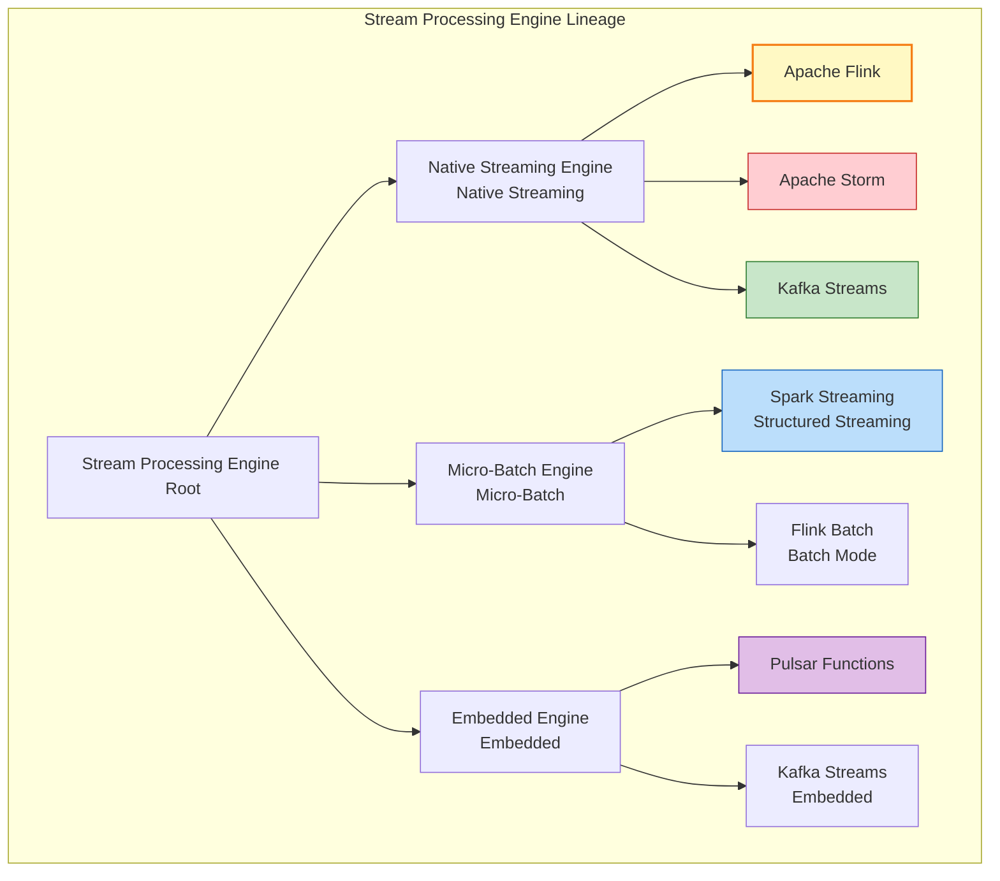
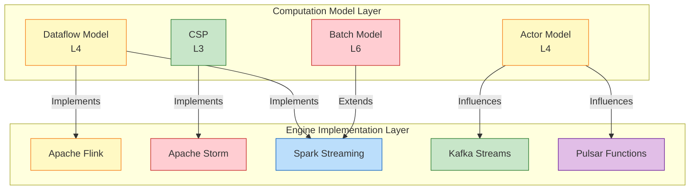
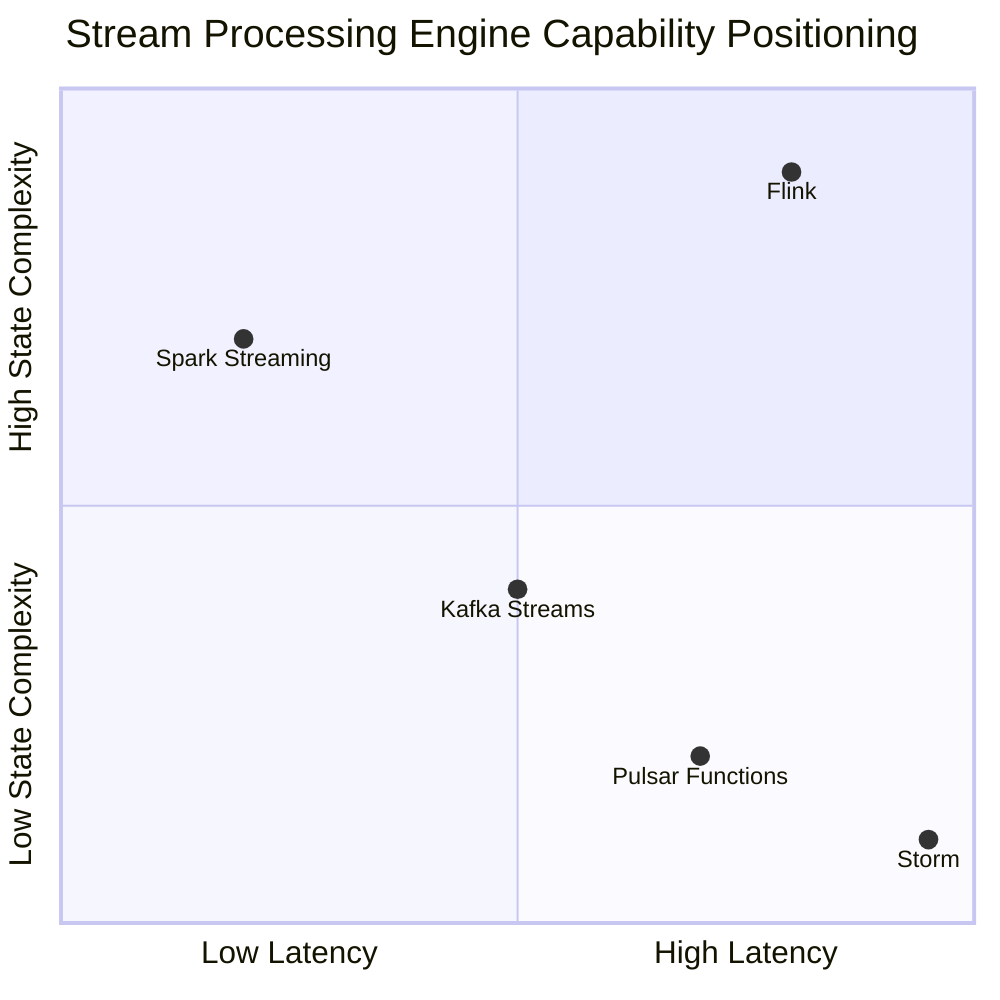
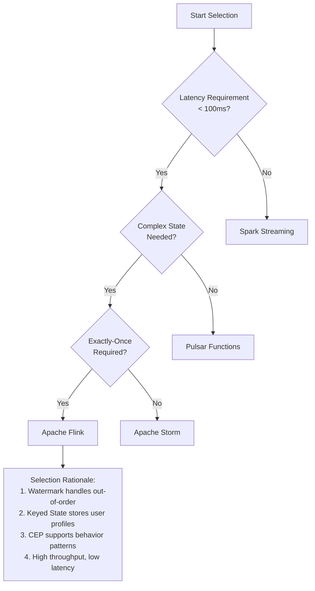
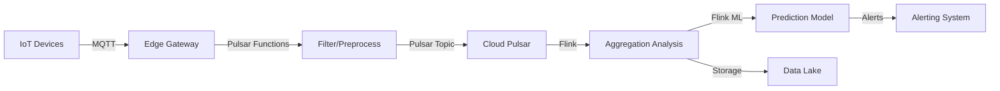
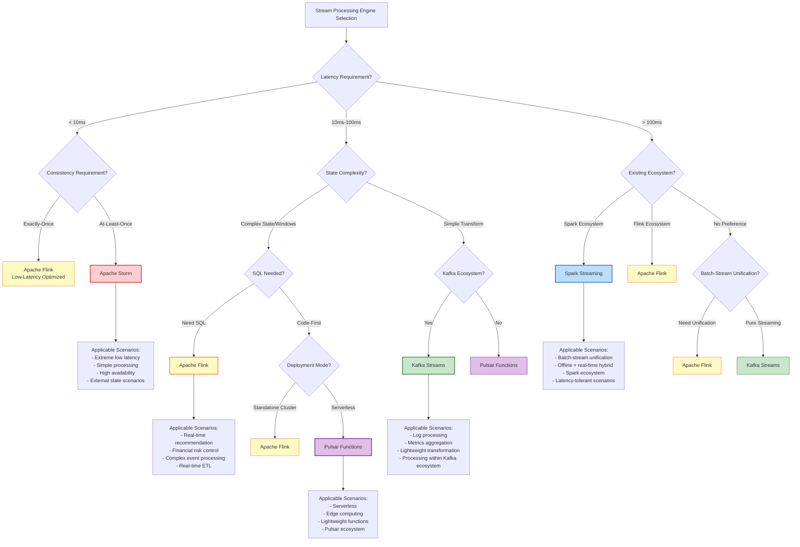
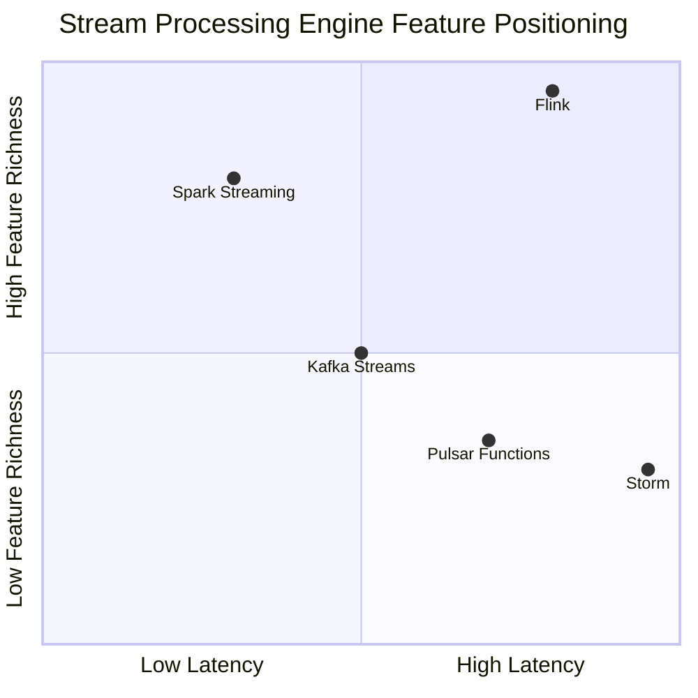

# Stream Processing Engine Selection Decision Guide

> **Stage**: Knowledge/04-technology-selection | **Prerequisites**: [../../Struct/03-relationships/03.03-expressiveness-hierarchy.md](../../Struct/03-relationships/03.03-expressiveness-hierarchy.md), [../01-concept-atlas/concurrency-paradigms-matrix.md](../01-concept-atlas/concurrency-paradigms-matrix.md) | **Formality Level**: L4-L6
> **Version**: 2026.04 | **Document Size**: ~25KB

---

## Table of Contents

- [Stream Processing Engine Selection Decision Guide](#stream-processing-engine-selection-decision-guide)
  - [Table of Contents](#table-of-contents)
  - [1. Definitions](#1-definitions)
    - [1.1 Stream Processing Engine Lineage](#11-stream-processing-engine-lineage)
    - [1.2 Core Engine Definitions](#12-core-engine-definitions)
      - [Def-K-04-01. Apache Flink](#def-k-04-01-apache-flink)
      - [Def-K-04-02. Kafka Streams](#def-k-04-02-kafka-streams)
      - [Def-K-04-03. Spark Streaming (Structured Streaming)](#def-k-04-03-spark-streaming-structured-streaming)
      - [Def-K-04-04. Apache Storm](#def-k-04-04-apache-storm)
      - [Def-K-04-05. Pulsar Functions](#def-k-04-05-pulsar-functions)
    - [1.3 Core Selection Dimension Definitions](#13-core-selection-dimension-definitions)
      - [Def-K-04-06. Latency Profile](#def-k-04-06-latency-profile)
      - [Def-K-04-07. State Management Capability](#def-k-04-07-state-management-capability)
      - [Def-K-04-08. Consistency Guarantee Level](#def-k-04-08-consistency-guarantee-level)
      - [Def-K-04-09. Expressiveness Hierarchy Mapping](#def-k-04-09-expressiveness-hierarchy-mapping)
  - [2. Properties](#2-properties)
    - [Lemma-K-04-01. Latency-Throughput Trade-off Upper Bound](#lemma-k-04-01-latency-throughput-trade-off-upper-bound)
    - [Lemma-K-04-02. Positive Correlation Between State Complexity and Fault Tolerance Overhead](#lemma-k-04-02-positive-correlation-between-state-complexity-and-fault-tolerance-overhead)
    - [Prop-K-04-01. Semantic Advantage of Dataflow Model Engines](#prop-k-04-01-semantic-advantage-of-dataflow-model-engines)
    - [Prop-K-04-02. Latency Lower Bound of Micro-Batch Processing](#prop-k-04-02-latency-lower-bound-of-micro-batch-processing)
  - [3. Relations](#3-relations)
    - [3.1 Relationship Between Engines and Computation Models](#31-relationship-between-engines-and-computation-models)
    - [3.2 Expressiveness Hierarchy Mapping](#32-expressiveness-hierarchy-mapping)
    - [3.3 Inter-Engine Capability Relationships](#33-inter-engine-capability-relationships)
  - [4. Argumentation](#4-argumentation)
    - [4.1 Six-Dimensional Selection Comparison Matrix](#41-six-dimensional-selection-comparison-matrix)
      - [Table 1: Core Performance Comparison Matrix](#table-1-core-performance-comparison-matrix)
      - [Table 2: Architecture and Deployment Comparison Matrix](#table-2-architecture-and-deployment-comparison-matrix)
      - [Table 3: Developer Experience Comparison Matrix](#table-3-developer-experience-comparison-matrix)
    - [4.2 Scenario-Driven Selection Argumentation](#42-scenario-driven-selection-argumentation)
      - [Argument 1: Why Real-Time Recommendation Systems Should Choose Flink](#argument-1-why-real-time-recommendation-systems-should-choose-flink)
      - [Argument 2: Why Log Aggregation Should Choose Kafka Streams](#argument-2-why-log-aggregation-should-choose-kafka-streams)
      - [Argument 3: Why Complex Event Processing (CEP) Should Choose Flink](#argument-3-why-complex-event-processing-cep-should-choose-flink)
      - [Argument 4: Why Low-Latency Trading Systems Should Choose Storm/Flink](#argument-4-why-low-latency-trading-systems-should-choose-stormflink)
    - [4.3 Cloud-Native Capability Comparison](#43-cloud-native-capability-comparison)
  - [5. Engineering Argumentation](#5-engineering-argumentation)
    - [5.1 Migration Guide: From Spark Streaming to Flink](#51-migration-guide-from-spark-streaming-to-flink)
    - [5.2 Cost-Benefit Analysis Framework](#52-cost-benefit-analysis-framework)
  - [6. Examples](#6-examples)
    - [6.1 Example 1: E-Commerce Real-Time Recommendation System Selection](#61-example-1-e-commerce-real-time-recommendation-system-selection)
    - [6.2 Example 2: Financial Risk Control Real-Time Decision System Selection](#62-example-2-financial-risk-control-real-time-decision-system-selection)
    - [6.3 Example 3: IoT Data Platform Selection](#63-example-3-iot-data-platform-selection)
    - [6.4 Counterexample Analysis](#64-counterexample-analysis)
      - [Counterexample 1: Misusing Spark Streaming in Low-Latency Scenarios](#counterexample-1-misusing-spark-streaming-in-low-latency-scenarios)
      - [Counterexample 2: Misusing Kafka Streams in Complex State Scenarios](#counterexample-2-misusing-kafka-streams-in-complex-state-scenarios)
      - [Counterexample 3: Using Kafka Streams Without Kafka](#counterexample-3-using-kafka-streams-without-kafka)
  - [7. Visualizations](#7-visualizations)
    - [7.1 Stream Processing Engine Selection Decision Tree](#71-stream-processing-engine-selection-decision-tree)
    - [7.2 Engine Capability Radar Chart Comparison](#72-engine-capability-radar-chart-comparison)
    - [7.3 Scenario-Engine Mapping Matrix](#73-scenario-engine-mapping-matrix)
  - [8. References](#8-references)
  - [Related Documents](#related-documents)
    - [Upstream Dependencies](#upstream-dependencies)
    - [Same-Level Associations](#same-level-associations)
    - [Downstream Applications](#downstream-applications)

---

## 1. Definitions

### 1.1 Stream Processing Engine Lineage

Stream processing engines are runtime systems that implement the **Dataflow Model** or related concurrency models. Based on implementation architecture and consistency guarantees, they can be classified into the following lineages:



---

### 1.2 Core Engine Definitions

#### Def-K-04-01. Apache Flink

**Formal Definition** (see [../../Struct/01-foundation/01.04-dataflow-model-formalization.md](../../Struct/01-foundation/01.04-dataflow-model-formalization.md)):

$$
\text{Flink} = (\mathcal{G}, \Sigma, \mathbb{T}_{event}, \mathbb{T}_{proc}, \mathcal{C}, \mathcal{S})
$$

Where $\mathcal{G} = (V, E)$ is the operator graph, $\Sigma$ is the stream type signature, $\mathbb{T}_{event}$ is the event time domain, $\mathbb{T}_{proc}$ is the processing time domain, $\mathcal{C}$ is the Checkpoint mechanism, and $\mathcal{S}$ is the State Backend.

**Core Characteristics**:

| Dimension | Characteristic |
|------|------|
| **Computation Model** | Native Dataflow, supports unified batch and stream processing |
| **Time Semantics** | Event time / processing time / ingestion time, Watermark mechanism |
| **State Management** | Key-partitioned state, supports Value/List/Map/Reduce state |
| **Fault Tolerance** | Chandy-Lamport distributed snapshots, Exactly-Once semantics |
| **Latency Profile** | Millisecond-level (~10ms), high throughput |
| **Expressiveness** | L4+ (dynamic operators, mobility support) |

**Representative Versions**: Flink 1.18+ / 2.0

---

#### Def-K-04-02. Kafka Streams

**Formal Definition**:

$$
\text{Kafka Streams} = (\mathcal{T}, \mathcal{K}, \mathcal{P}, \mathcal{L}_{local}, \mathcal{R}_{rep})
$$

Where $\mathcal{T}$ is the topology definition (Processor API), $\mathcal{K}$ is the Kafka cluster, $\mathcal{P}$ is the partition assignment strategy, $\mathcal{L}_{local}$ is the local state store (RocksDB), and $\mathcal{R}_{rep}$ is the changelog replication mechanism.

**Core Characteristics**:

| Dimension | Characteristic |
|------|------|
| **Computation Model** | Embedded library, no independent cluster |
| **Time Semantics** | Event time (Kafka record timestamp) |
| **State Management** | Local state store + changelog topic |
| **Fault Tolerance** | Kafka partition replication + changelog replay |
| **Latency Profile** | Second-level (~100ms-1s) |
| **Expressiveness** | L3-L4 (static topology primarily) |

**Deployment Mode**: Embedded in application JVM, no additional cluster overhead

---

#### Def-K-04-03. Spark Streaming (Structured Streaming)

**Formal Definition**:

$$
\text{Spark Streaming} = (\mathcal{B}, \Delta t, \mathcal{D}_{micro}, \mathcal{O}_{output}, \mathcal{W}_{watermark})
$$

Where $\mathcal{B}$ is the batch processing engine (Spark SQL), $\Delta t$ is the micro-batch interval, $\mathcal{D}_{micro}$ is the micro-batch data abstraction, $\mathcal{O}_{output}$ is the output mode (Complete/Update/Append), and $\mathcal{W}_{watermark}$ is the event time Watermark.

**Core Characteristics**:

| Dimension | Characteristic |
|------|------|
| **Computation Model** | Micro-batch, unified batch and stream |
| **Time Semantics** | Event time support (Structured Streaming) |
| **State Management** | Spark SQL state store (HDFS/S3) |
| **Fault Tolerance** | RDD lineage + Checkpoint, Exactly-Once |
| **Latency Profile** | Second-level (~100ms to several seconds) |
| **Expressiveness** | L4 (restricted dynamicity) |

**Representative Version**: Spark 3.5+ (Structured Streaming)

---

#### Def-K-04-04. Apache Storm

**Formal Definition**:

$$
\text{Storm} = (\mathcal{T}_{topology}, \mathcal{S}_{spout}, \mathcal{B}_{bolt}, \mathcal{A}_{ack}, \mathcal{W}_{worker})
$$

Where $\mathcal{T}_{topology}$ is the topology (directed graph), $\mathcal{S}_{spout}$ is the data source component, $\mathcal{B}_{bolt}$ is the processing component, $\mathcal{A}_{ack}$ is the acknowledgement mechanism, and $\mathcal{W}_{worker}$ is the execution worker process.

**Core Characteristics**:

| Dimension | Characteristic |
|------|------|
| **Computation Model** | Native streaming, record-level processing |
| **Time Semantics** | Processing time primarily (Storm 1.0+ supports event time) |
| **State Management** | Requires external storage (Redis/HBase) |
| **Fault Tolerance** | Record-level ACK, At-Least-Once |
| **Latency Profile** | Sub-millisecond (~1-5ms) |
| **Expressiveness** | L3 (static topology) |

**Version Evolution**: Storm 2.x (incorporates some ideas from Flink's blink component)

---

#### Def-K-04-05. Pulsar Functions

**Formal Definition**:

$$
\text{Pulsar Functions} = (\mathcal{F}_{func}, \mathcal{C}_{context}, \mathcal{T}_{trigger}, \mathcal{S}_{state}, \mathcal{R}_{runtime})
$$

Where $\mathcal{F}_{func}$ is the user function, $\mathcal{C}_{context}$ is the execution context, $\mathcal{T}_{trigger}$ is the trigger mechanism (topic events), $\mathcal{S}_{state}$ is the BookKeeper state storage, and $\mathcal{R}_{runtime}$ is the runtime (Thread/Process/K8s).

**Core Characteristics**:

| Dimension | Characteristic |
|------|------|
| **Computation Model** | Serverless Function, lightweight |
| **Time Semantics** | Processing time |
| **State Management** | BookKeeper state storage (optional) |
| **Fault Tolerance** | Pulsar consumer group + retry |
| **Latency Profile** | Millisecond-level (~10-50ms) |
| **Expressiveness** | L3 (stateless / light-state functions) |

**Deployment Modes**: K8s, Thread Pool, standalone process

---

### 1.3 Core Selection Dimension Definitions

#### Def-K-04-06. Latency Profile

| Level | Latency Range | Applicable Scenarios | Representative Engine |
|------|----------|----------|----------|
| **Extremely Low Latency** | < 10ms | High-frequency trading, real-time control | Storm |
| **Low Latency** | 10ms - 100ms | Real-time recommendation, monitoring alerts | Flink |
| **Medium Latency** | 100ms - 1s | Log processing, metrics aggregation | Kafka Streams, Pulsar |
| **High Latency** | > 1s | Offline analysis, batch ETL | Spark Streaming |

#### Def-K-04-07. State Management Capability

| Level | State Type | Fault Tolerance Mechanism | Representative Engine |
|------|----------|----------|----------|
| **Stateless** | Pure function transformation | None | Pulsar Functions |
| **Key-Value State** | Keyed aggregation state | Changelog replication | Kafka Streams |
| **Window State** | Time window state | Checkpoint snapshot | Flink |
| **Complex State** | Sessions, CEP patterns | Distributed snapshot | Flink |

#### Def-K-04-08. Consistency Guarantee Level

| Level | Semantic | Implementation Mechanism | Representative Engine |
|------|------|----------|----------|
| **At-Most-Once** | May lose | No acknowledgement | None by default |
| **At-Least-Once** | May duplicate | ACK acknowledgement | Storm |
| **Exactly-Once** | Exactly-Once | Distributed snapshot / transaction | Flink, Kafka Streams, Spark |

#### Def-K-04-09. Expressiveness Hierarchy Mapping

Based on the six-layer expressiveness hierarchy in [../../Struct/03-relationships/03.03-expressiveness-hierarchy.md](../../Struct/03-relationships/03.03-expressiveness-hierarchy.md):

| Level | Engine | Expressiveness | Key Characteristics |
|------|------|----------|----------|
| L3 | Storm | Static topology | Predefined Spout/Bolt topology |
| L3+ | Kafka Streams | Quasi-static topology | DSL-built topology, limited runtime adjustment |
| L4 | Flink | Dynamic topology | Dynamic operator chains, adaptive scheduling |
| L4 | Spark Streaming | Quasi-dynamic | Static within micro-batch, adjustable between batches |
| L3 | Pulsar Functions | Function-level | Independent functions, no topology concept |

---

## 2. Properties

### Lemma-K-04-01. Latency-Throughput Trade-off Upper Bound

**Statement**: In stream processing systems, latency and throughput exist with a theoretical trade-off upper bound, constrained by Little's Law:

$$
L = \lambda \cdot W
$$

Where $L$ is the average number of jobs in the system, $\lambda$ is the arrival rate (throughput), and $W$ is the average waiting time (latency).

**Derivation**:

1. For micro-batch processing models (Spark Streaming), $W \geq \Delta t$ (batch interval), so latency has a lower bound;
2. For native stream models (Flink/Storm), $W$ mainly depends on per-record processing time and queuing delay;
3. With fixed resources, increasing throughput ($\lambda$) necessarily increases latency ($W$), unless parallelism is increased;
4. Flink's pipelined execution and Storm's edge queue caching strategies optimize this trade-off under different loads.

**Engineering Inference**: Choose native streaming engines for low-latency scenarios; choose micro-batch for high-throughput scenarios that tolerate latency.

---

### Lemma-K-04-02. Positive Correlation Between State Complexity and Fault Tolerance Overhead

**Statement**: The complexity of state management is positively correlated with the overhead of fault tolerance mechanisms.

**Derivation**:

1. **Stateless processing** (Pulsar Functions): No Checkpoint needed; fault tolerance relies only on message replay, lowest overhead;
2. **Key-value state** (Kafka Streams): Changelog replication overhead is proportional to state mutation frequency, $O(|\Delta S|)$;
3. **Distributed snapshots** (Flink): Checkpoint overhead is related to state size and topology complexity, $O(|S| + |V| + |E|)$;
4. State backend choices (memory/RocksDB/incremental) affect Checkpoint I/O overhead.

**Engineering Inference**: Choose Kafka Streams for lightweight state; choose Flink for complex state.

---

### Prop-K-04-01. Semantic Advantage of Dataflow Model Engines

**Statement**: Engines based on the strict Dataflow model (Flink) have semantic advantages in processing time semantics, window computation, and out-of-order data handling.

**Derivation**:

1. **Watermark mechanism**: Flink's Watermark $w$ explicitly means "events with timestamp $< w$ have arrived", providing deterministic semantics for out-of-order processing;
2. **Window alignment**: Event-time windows are based on the data's own timestamp, not processing time, avoiding window drift caused by delayed data;
3. **State consistency**: Keyed State combined with Watermark ensures a consistent view of state when windows are triggered;
4. Kafka Streams and Spark Streaming's event-time support were added later, with less semantic completeness than native designs.

**Conclusion**: Prioritize Flink for scenarios requiring strict event-time semantics.

---

### Prop-K-04-02. Latency Lower Bound of Micro-Batch Processing

**Statement**: Micro-batch processing models have a theoretical latency lower bound determined by the batch interval $\Delta t$.

**Derivation**:

1. Spark Streaming's micro-batch model slices the stream into discrete batches; the minimum latency is $\Delta t$;
2. Continuous Processing mode (Spark 2.3+ experimental) attempts to break this limit but sacrifices some Exactly-Once guarantees;
3. In low data rate scenarios, the latency caused by batch interval is significant;
4. In high data rate scenarios, batch processing efficiency offsets the latency loss.

**Conclusion**: Avoid pure micro-batch models in latency-sensitive scenarios (< 100ms).

---

## 3. Relations

### 3.1 Relationship Between Engines and Computation Models



### 3.2 Expressiveness Hierarchy Mapping

Based on Thm-S-14-01 in [../../Struct/03-relationships/03.03-expressiveness-hierarchy.md](../../Struct/03-relationships/03.03-expressiveness-hierarchy.md):

| Level | Engine | Expressiveness Characteristics | Decidability |
|------|------|--------------|----------|
| L3 | Storm | Static topology, predefined components | Verifiable |
| L3+ | Kafka Streams | DSL topology build, limited runtime adjustment | Partially verifiable |
| L4 | Flink | Dynamic operator chains, adaptive scheduling | Runtime verifiable |
| L4 | Spark Streaming | Micro-batch abstraction, static within batch | Batch-level verifiable |
| L3 | Pulsar Functions | Independent functions, no topology | Function-level verifiable |

**Key Relationships**:

- Flink $\supset$ Storm (expressiveness containment, Flink can simulate Storm semantics)
- Flink $\approx$ Spark Streaming (Turing-complete equivalence, different semantic focuses)
- Kafka Streams $\perp$ Pulsar Functions (incomparable, architectural differences)

### 3.3 Inter-Engine Capability Relationships



---

## 4. Argumentation

### 4.1 Six-Dimensional Selection Comparison Matrix

#### Table 1: Core Performance Comparison Matrix

| Dimension | Flink | Kafka Streams | Spark Streaming | Storm | Pulsar Functions |
|------|-------|---------------|-----------------|-------|------------------|
| **Latency** | Millisecond (~10ms) | Second (~100ms-1s) | Second (~100ms to several seconds) | Sub-millisecond (~1-5ms) | Millisecond (~10-50ms) |
| **Throughput** | Extremely high (> million/sec) | High (~100K/sec) | Extremely high (batch-optimized) | High (~million/sec) | Medium (~10K/sec) |
| **State Management** | Native Keyed State | Local + changelog | RDD state store | External storage | BookKeeper state |
| **Exactly-Once** | ✅ Native support | ✅ Transactional support | ✅ Native support | ⚠️ Requires Trident | ❌ At-Least-Once |
| **SQL Support** | ✅ Flink SQL | ❌ KSQL (external) | ✅ Spark SQL | ❌ None | ❌ None |
| **Ecosystem Integration** | Extremely rich | Kafka ecosystem | Spark ecosystem | Medium | Pulsar ecosystem |

#### Table 2: Architecture and Deployment Comparison Matrix

| Dimension | Flink | Kafka Streams | Spark Streaming | Storm | Pulsar Functions |
|------|-------|---------------|-----------------|-------|------------------|
| **Deployment Mode** | Standalone cluster/YARN/K8s | Embedded/standalone | YARN/Mesos/K8s | Standalone cluster | K8s/Thread/Process |
| **Resource Isolation** | TaskManager-level | JVM-level | Executor-level | Worker-level | Function-level |
| **Horizontal Scaling** | Dynamic parallelism | Partition-driven | Static configuration | Static configuration | Auto scaling |
| **K8s Native** | Operator support | Limited | Operator support | Limited | Native support |
| **Cloud Vendor Support** | Ververica/EMR | Confluent | Databricks/EMR | Limited | StreamNative |

#### Table 3: Developer Experience Comparison Matrix

| Dimension | Flink | Kafka Streams | Spark Streaming | Storm | Pulsar Functions |
|------|-------|---------------|-----------------|-------|------------------|
| **Programming Model** | DataStream/Table API | DSL/Processor API | DataFrame/DStream | Topology API | Function API |
| **Language Support** | Java/Scala/Python/SQL | Java/Scala | Java/Scala/Python/R | Java/Clojure/Python | Java/Python/Go |
| **Learning Curve** | Steep | Gentle | Medium | Steep | Gentle |
| **Debugging Tools** | Web UI/Metrics | Limited | Spark UI | Storm UI | Pulsar Admin |
| **Community Activity** | ⭐⭐⭐⭐⭐ | ⭐⭐⭐⭐ | ⭐⭐⭐⭐⭐ | ⭐⭐⭐ | ⭐⭐⭐ |

### 4.2 Scenario-Driven Selection Argumentation

#### Argument 1: Why Real-Time Recommendation Systems Should Choose Flink

**Scenario Requirements**:

- Millisecond-level feature updates (real-time user behavior feedback)
- Complex window aggregation (sliding window session analysis)
- Exactly-Once guarantee (recommendation accuracy)
- High concurrency support (massive user base)

**Argumentation**:

1. **Time semantics**: Recommendation systems depend on temporal sequence patterns of user behavior. Flink's Watermark mechanism handles out-of-order click streams, ensuring window computation is based on real event time (Prop-K-04-01).

2. **State complexity**: User profiles require large state (one state object per user). Flink's RocksDB State Backend supports TB-level state, and incremental Checkpoint reduces fault tolerance overhead (Lemma-K-04-02).

3. **Algorithm support**: Flink ML and Complex Event Processing (CEP) libraries support real-time computation of recommendation algorithms.

4. **Counterexample**: Kafka Streams' local state limits single-machine state size; Spark Streaming's micro-batch latency cannot meet real-time requirements.

**Conclusion**: Flink is the first-choice engine for real-time recommendation systems.

---

#### Argument 2: Why Log Aggregation Should Choose Kafka Streams

**Scenario Requirements**:

- Lightweight processing (filtering, transformation, routing)
- Deep Kafka integration (log storage)
- No additional infrastructure (simplified operations)
- Exactly-Once guarantee (no log loss or duplication)

**Argumentation**:

1. **Architecture fit**: Logs are already stored in Kafka; Kafka Streams consumes directly without data movement.

2. **Deployment simplification**: Embedded library mode requires no independent cluster, co-deployed with the application in the same JVM, reducing operational complexity.

3. **Lightweight state**: Log processing is mostly stateless or light-state (counting, deduplication), sufficient for Kafka Streams' changelog mechanism.

4. **Latency tolerance**: Log aggregation usually tolerates second-level latency; Kafka Streams' performance is sufficient.

5. **Counterexample**: Flink's standalone cluster mode is too heavyweight for simple log processing; Storm lacks Exactly-Once support.

**Conclusion**: Kafka Streams is the simplest solution for log aggregation within the Kafka ecosystem.

---

#### Argument 3: Why Complex Event Processing (CEP) Should Choose Flink

**Scenario Requirements**:

- Pattern matching (sequence, parallel, negation)
- Complex rules within time windows
- Low-latency alerting
- State persisted across events

**Argumentation**:

1. **CEP library**: Flink provides a declarative CEP API, supporting pattern operators such as `next()`, `followedBy()`, `within()`.

2. **Time semantics**: CEP relies on event time to determine pattern timeouts; Flink's Watermark provides deterministic timeout triggering.

3. **State management**: Pattern matching needs to maintain partial match states; Flink's Keyed State supports efficient state updates.

4. **Counterexample**: Storm lacks built-in CEP support and requires external library (Esper) integration; Kafka Streams has no native CEP API.

**Conclusion**: Flink is the current best open-source choice for CEP scenarios.

---

#### Argument 4: Why Low-Latency Trading Systems Should Choose Storm/Flink

**Scenario Requirements**:

- Sub-millisecond latency (real-time response to price changes)
- High availability (fast failure recovery)
- Record-level processing (no batch processing latency)

**Argumentation**:

1. **Latency requirement**: Financial trading is extremely latency-sensitive. Storm's record-at-a-time processing provides the lowest latency (~1ms).

2. **Fault tolerance choice**: Storm's At-Least-Once semantics can be upgraded to Exactly-Once via Trident, but at the cost of increased latency. Flink's native Exactly-Once strikes a balance between latency and consistency.

3. **External state**: Trading system states are usually externalized (Redis/HBase), fitting Storm's stateless design.

4. **Counterexample**: Spark Streaming's micro-batch model has too high latency; Kafka Streams' embedded mode is hard to meet cross-datacenter deployment requirements.

**Conclusion**: Choose Storm for extreme low latency; choose Flink for latency-consistency balance.

### 4.3 Cloud-Native Capability Comparison

| Capability | Flink | Kafka Streams | Spark Streaming | Storm | Pulsar Functions |
|------|-------|---------------|-----------------|-------|------------------|
| **K8s Operator** | ✅ Official | ❌ None | ✅ Third-party | ❌ None | ✅ Official |
| **Auto Scaling** | ✅ Adaptive scheduling | ⚠️ Partition-bound | ⚠️ Static config | ❌ Manual | ✅ HPA support |
| **Storage-Compute Separation** | ✅ Supported | ❌ Local state | ⚠️ Partial support | ✅ Supported | ✅ Supported |
| **Serverless** | ⚠️ Flink SQL Gateway | ❌ Not supported | ❌ Not supported | ❌ Not supported | ✅ Native |
| **Multi-Tenancy** | ✅ YARN/K8s isolation | ❌ JVM-level | ✅ Supported | ⚠️ Limited | ✅ Namespace isolation |

---

## 5. Engineering Argumentation

### 5.1 Migration Guide: From Spark Streaming to Flink

**Migration Motivations**:

- Micro-batch latency cannot meet business requirements
- Need for true event-time processing
- Complex state management requirements

**Migration Strategy**:

| Spark Concept | Flink Equivalent | Difference Explanation |
|------------|------------|----------|
| DStream | DataStream | Flink API is richer, supports more transformations |
| RDD lineage | Checkpoint | Flink Checkpoint is lighter, supports incremental |
| Spark SQL | Flink SQL | Similar semantics, Flink streaming SQL is more mature |
| Windowed DStream | Windowed Stream | Flink supports event-time windows |
| UpdateStateByKey | KeyedProcessFunction | Flink state types are richer |

**Migration Steps**:

1. **POC validation**: Select a non-critical stream for Flink pilot, comparing latency and accuracy
2. **Dual-run phase**: Run Spark and Flink in parallel, comparing outputs for validation
3. **State migration**: Migrate Spark's HDFS Checkpoint to Flink Savepoint
4. **Gray release**: Gradually switch by traffic proportion

**Notes**:

- Watermark strategy needs to be redesigned (Spark's Watermark semantics differ)
- State TTL configuration needs adjustment
- Monitoring metric system needs rebuilding

### 5.2 Cost-Benefit Analysis Framework

**TCO (Total Cost of Ownership) Model**:

$$
\text{TCO} = \text{Infrastructure Cost} + \text{Operations Cost} + \text{Development Cost} + \text{Opportunity Cost}
$$

| Cost Item | Flink | Kafka Streams | Spark Streaming | Pulsar Functions |
|--------|-------|---------------|-----------------|------------------|
| **Infrastructure** | High (standalone cluster) | Low (no additional) | High (standalone cluster) | Medium (Serverless) |
| **Operations Labor** | High | Low | Medium | Low |
| **Development Labor** | Medium | Low | Low | Low |
| **Opportunity Cost** | Low (mature) | Low | Low | High (emerging) |

**Selection Recommendations**:

- **Startups / Kafka users**: Kafka Streams (lowest TCO)
- **Complex stream processing needs**: Flink (highest long-term benefit)
- **Existing Spark ecosystem**: Spark Streaming (lowest migration cost)

---

## 6. Examples

### 6.1 Example 1: E-Commerce Real-Time Recommendation System Selection

**Scenario Description**:

- DAU: 10 million
- Peak QPS: 500K events/sec
- Latency requirement: Update recommendation within 100ms of user behavior
- Algorithm complexity: Collaborative filtering + real-time feature engineering

**Decision Process**:



**Final Choice**: Apache Flink

**Deployment Architecture**:

- Flink on Kubernetes
- RocksDB State Backend + S3 Checkpoint
- 3 JobManager + 15 TaskManager (8 slots per node)

---

### 6.2 Example 2: Financial Risk Control Real-Time Decision System Selection

**Scenario Description**:

- Transaction volume: 100K transactions/sec
- Latency requirement: End-to-end < 50ms
- Rule complexity: 500+ rules, including temporal patterns
- Compliance requirement: Exactly-Once processing, audit tracing

**Decision Analysis**:

| Engine | Latency | Exactly-Once | CEP | Conclusion |
|------|------|--------------|-----|------|
| Flink | ~10ms | ✅ | ✅ | Meets all requirements |
| Storm | ~5ms | ⚠️ Trident | ❌ Requires external | Does not meet CEP |
| Kafka Streams | ~200ms | ✅ | ❌ | Latency not met |

**Final Choice**: Apache Flink + Flink CEP

**Key Configurations**:

```java

// [伪代码片段 - 不可直接运行] 仅展示核心逻辑
import org.apache.flink.streaming.api.CheckpointingMode;

// Low-latency optimization
env.setBufferTimeout(5);  // 5ms buffer timeout
env.getConfig().setAutoWatermarkInterval(10);

// State backend
env.setStateBackend(new RocksDBStateBackend("s3://checkpoints"));
env.enableCheckpointing(100, CheckpointingMode.EXACTLY_ONCE);
```

---

### 6.3 Example 3: IoT Data Platform Selection

**Scenario Description**:

- Devices: 1 million+
- Data points: 10 million/sec
- Processing needs: Filtering, aggregation, alerting
- Deployment environment: Edge + cloud hybrid

**Decision Analysis**:

**Edge Nodes**: Pulsar Functions

- Lightweight, runs in resource-constrained environments
- Serverless model, auto scaling
- Integrates with cloud Pulsar

**Cloud Aggregation**: Flink

- Complex window aggregation
- Data lake integration
- ML inference

**Final Architecture**:



---

### 6.4 Counterexample Analysis

#### Counterexample 1: Misusing Spark Streaming in Low-Latency Scenarios

**Scenario**: High-frequency trading system using Spark Streaming (micro-batch 1 second)

**Problems**:

1. 1-second batch interval causes trading signal delays, missing optimal execution windows
2. Micro-batch model cannot handle fine-grained control of individual records
3. Continuous Processing mode is immature and unstable

**Consequence**: System could not meet business latency requirements after going live and had to be rebuilt.

**Correct Approach**: Choose Storm (~5ms) or Flink (~10ms).

---

#### Counterexample 2: Misusing Kafka Streams in Complex State Scenarios

**Scenario**: Real-time session analysis using Kafka Streams, single-user state > 1GB

**Problems**:

1. Kafka Streams' local state store is limited by single-machine disk
2. State recovery requires replaying large amounts of changelog, taking several hours
3. Memory pressure causes frequent GC, degrading performance

**Consequence**: System becomes unstable when large-state users appear; state recovery takes too long.

**Correct Approach**: Choose Flink, using RocksDB State Backend to support large state, and incremental Checkpoint to speed up recovery.

---

#### Counterexample 3: Using Kafka Streams Without Kafka

**Scenario**: Using RabbitMQ as the message queue, but choosing Kafka Streams as the processing engine

**Problems**:

1. Kafka Streams is deeply dependent on Kafka's log storage and partition mechanisms
2. Cannot directly use RabbitMQ as a data source (no official connector)
3. State changelog requires an additional Kafka cluster, complicating architecture

**Consequence**: Unnatural architecture, introduces unnecessary Kafka cluster, increases operational cost.

**Correct Approach**: Choose an engine decoupled from the message queue (Flink), or switch to Kafka.

---

## 7. Visualizations

### 7.1 Stream Processing Engine Selection Decision Tree



### 7.2 Engine Capability Radar Chart Comparison



### 7.3 Scenario-Engine Mapping Matrix

| Scenario | First Choice | Second Choice | Not Recommended |
|------|----------|----------|--------|
| Real-time recommendation system | Flink | Kafka Streams | Spark Streaming |
| Log aggregation / ETL | Kafka Streams | Flink | Storm |
| Financial risk control / CEP | Flink | - | Storm, Kafka Streams |
| High-frequency trading (<10ms) | Storm | Flink | Spark Streaming |
| Unified batch-stream processing | Flink | Spark Streaming | Kafka Streams |
| IoT edge processing | Pulsar Functions | Flink MiniCluster | Spark Streaming |
| Metrics monitoring and alerting | Kafka Streams | Pulsar Functions | Storm |
| Real-time data warehouse construction | Flink | Spark Streaming | Kafka Streams |
| Complex machine learning | Flink ML | Spark ML | Kafka Streams |
| Serverless stream processing | Pulsar Functions | Flink SQL Gateway | Storm |

---

## 8. References


---

## Related Documents

### Upstream Dependencies

- [../../Struct/03-relationships/03.03-expressiveness-hierarchy.md](../../Struct/03-relationships/03.03-expressiveness-hierarchy.md) — Expressiveness hierarchy theory
- [../../Struct/01-foundation/01.04-dataflow-model-formalization.md](../../Struct/01-foundation/01.04-dataflow-model-formalization.md) — Dataflow model formalization
- [../01-concept-atlas/concurrency-paradigms-matrix.md](../01-concept-atlas/concurrency-paradigms-matrix.md) — Concurrency paradigm comparison

### Same-Level Associations

- [../../Flink/](../../Flink/) — Flink in-depth documentation
- [../../Struct/](../../Struct/) — Formal theory documentation
- [./flink-vs-risingwave.md](./flink-vs-risingwave.md) — Flink vs RisingWave in-depth comparison

### Downstream Applications

- [../10-case-studies/00-INDEX.md](../10-case-studies/00-INDEX.md) — Real-world case analysis (to be created)
- [../../ROADMAP.md](../../ROADMAP.md) — Technology evolution roadmap (to be created)

---

*Document Version: 2026.04 | Formality Level: L4-L6 | Status: Complete*
*Document Size: ~25KB | Comparison Matrices: 6 | Decision Trees: 1 | Examples: 3*
