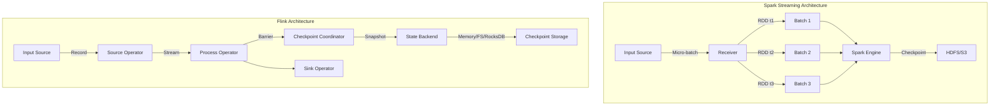
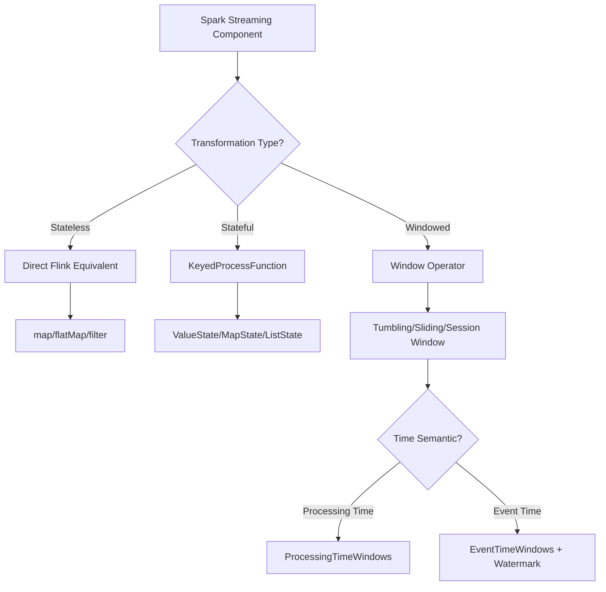

# Spark Streaming to Flink Migration Guide

> Stage: Knowledge/05-mapping-guides/migration-guides | Prerequisites: [Flink DataStream API](../../../Flink/03-api/09-language-foundations/flink-datastream-api-complete-guide.md), [Spark Streaming Architecture](https://spark.apache.org/docs/latest/streaming-programming-guide.html) | Formalization Level: L4

## 1. Definitions

### Def-K-05-01-01: Spark Streaming Core Abstraction

The core abstraction of Spark Streaming is **DStream** (Discretized Stream), formally defined as:

$$
\text{DStream}(T) = \{ RDD_i(T) \}_{i=0}^{\infty}, \quad RDD_i(T) \subseteq T^{n_i}
$$

Where $RDD_i(T)$ represents the micro-batch data within time window $[t_i, t_{i+1})$, and $n_i$ is the data volume of that batch.

### Def-K-05-01-02: Flink DataStream Core Abstraction

Flink DataStream adopts a **continuous stream processing** model:

$$
\text{DataStream}(T) = \{ (e_i, t_i) \}_{i=0}^{\infty}, \quad e_i \in T, t_i \in \mathbb{R}^+
$$

Where each element $e_i$ carries an independent event timestamp $t_i$, supporting per-record processing rather than micro-batch processing.

### Def-K-05-01-03: State Management Model Comparison

| Dimension | Spark Streaming | Flink |
|-----------|-----------------|-------|
| State Type | RDD Checkpoint | KeyedState, OperatorState |
| Consistency | Eventual consistency (WAL) | Exactly-Once (Chandy-Lamport) |
| TTL Support | Limited | Native support |
| State Backend | HDFS/S3 | Memory/RocksDB/Incremental |

## 2. Properties

### Prop-K-05-01-01: Latency Characteristics Comparison

For processing latency $\mathcal{L}$, there is an essential difference between the two:

$$
\mathcal{L}_{\text{Spark}} \geq \text{batchInterval} + \text{processingTime}
$$

$$
\mathcal{L}_{\text{Flink}} \approx \text{processingTime} + \text{networkLatency}
$$

**Derivation basis**: Spark Streaming's micro-batch model introduces fixed batch interval latency, while Flink's stream processing model can achieve millisecond-level latency.

### Prop-K-05-01-02: State Consistency Guarantee

Spark Streaming's WAL (Write Ahead Log) mechanism provides **at-least-once** semantics:

$$
\forall e \in \text{Input}, \quad P(\text{processed}(e)) \geq 1
$$

Flink's Checkpoint mechanism provides **exactly-once** semantics when Checkpointing and Barrier alignment are enabled:

$$
\forall e \in \text{Input}, \quad P(\text{processedExactlyOnce}(e)) = 1
$$

### Lemma-K-05-01-01: Watermark Generation Equivalence

Spark's `StreamingContext` implicitly handles timestamps, while Flink requires explicit Watermark strategy declaration:

$$
\text{Spark}: t_{\text{process}} = t_{\text{now}}
$$

$$
\text{Flink}: W(t) = \max\{ e.t \mid e \in \text{buffer} \} - \delta
$$

## 3. Relations

### 3.1 Core API Mapping

| Spark Streaming Concept | Flink Equivalent | Semantic Difference |
|-------------------------|------------------|---------------------|
| `StreamingContext` | `StreamExecutionEnvironment` | Execution environment initialization |
| `DStream[T]` | `DataStream[T]` | Batch vs stream processing model |
| `map(func)` | `map(func)` | Semantically identical |
| `flatMap(func)` | `flatMap(func)` | Semantically identical |
| `filter(func)` | `filter(func)` | Semantically identical |
| `reduceByKey(func)` | `keyBy(...).reduce(func)` | Requires explicit key specification |
| `window(windowLength, slideInterval)` | `window(TumblingEventTimeWindows.of(...))` | Enhanced time semantics |
| `updateStateByKey(func)` | `KeyStream.process(new KeyedProcessFunction)` | More flexible state access |
| `transform(rddFunc)` | `process(ProcessFunction)` | Underlying access differences |

### 3.2 Window Operation Mapping

```
Spark Streaming                    Flink
────────────────────────────────────────────────────────────────
window(Duration, Duration)    →    window(SlidingEventTimeWindows.of(...))
                                 .aggregate(AggregateFunction)

reduceByKeyAndWindow(...)     →    keyBy(...)
                                 .window(TumblingEventTimeWindows.of(...))
                                 .reduce(ReduceFunction)

countByWindow(...)            →    keyBy(...)
                                 .window(GlobalWindows.create())
                                 .trigger(CountTrigger.of(n))
                                 .aggregate(CountAggregate)
```

### 3.3 State Management Mapping

```
Spark Streaming State                    Flink State
────────────────────────────────────────────────────────────────
mapWithState(func)              →      KeyedProcessFunction + ValueState
trackStateByKey(func)           →      KeyedProcessFunction + MapState
StateSpec(func)                 →      StateTtlConfig + StateDescriptor
```

## 4. Argumentation

### 4.1 Micro-batch vs Native Stream Processing Engineering Trade-offs

**Spark Streaming Micro-batch Model**:

- Advantage: Unified with Spark SQL/DataFrame API, batch-streaming code reuse
- Disadvantage: Millisecond-level latency is hard to achieve, coarse-grained state management

**Flink Native Stream Model**:

- Advantage: Millisecond-level latency, fine-grained state management, exactly-once semantics
- Disadvantage: Batch processing scenarios need to be simulated through BATCH execution mode

### 4.2 Checkpoint Mechanism Differences

| Feature | Spark Checkpoint | Flink Checkpoint |
|---------|------------------|------------------|
| Trigger Mode | Periodic RDD persistence | Asynchronous Barrier snapshot |
| Storage Format | Serialized RDD | Incremental state snapshot |
| Recovery Granularity | Entire DStream | Operator-level incremental recovery |
| Alignment Mechanism | None | Barrier aligned/unaligned |
| Max Concurrency | 1 | Configurable multi-concurrent Checkpoint |

### 4.3 Time Semantics Support

Spark Streaming 1.x-2.x only supports **Processing Time**:

```scala
// Spark - Implicit processing time
val windowedStream = stream.window(Seconds(10), Seconds(5))
```

Structured Streaming introduces **Event Time** support:

```scala
// Spark Structured Streaming - Explicit event time
val windowedStream = stream
  .withWatermark("timestamp", "10 minutes")
  .groupBy(window($"timestamp", "10 minutes"))
```

Flink natively supports three time semantics:

```java
// Flink - Complete time semantics support
// Use WatermarkStrategy instead of deprecated setStreamTimeCharacteristic
env.getConfig().setAutoWatermarkInterval(200);
stream.assignTimestampsAndWatermarks(
    WatermarkStrategy.<MyEvent>forBoundedOutOfOrderness(Duration.ofSeconds(5))
        .withTimestampAssigner((event, timestamp) -> event.getEventTime())
);
```

## 5. Proof / Engineering Argument

### Theorem Thm-K-05-01-01: Spark Streaming to Flink State Migration Completeness

**Theorem**: For any Spark Streaming application $A_S$, there exists an equivalent Flink application $A_F$ such that for all input sequences $I$, the output sequences satisfy:

$$
\forall I, \quad \mathcal{O}(A_S, I) \approx \mathcal{O}(A_F, I)
$$

Where $\approx$ denotes semantic equivalence within an allowable time window deviation $\epsilon$.

**Proof**:

1. **Basic Operator Mapping**: Spark's `map`, `flatMap`, `filter` are stateless transformations; Flink provides directly equivalent operators.

2. **Key-value Aggregation Mapping**: Spark's `reduceByKey` is equivalent to Flink's `keyBy(...).reduce(...)`, and results are consistent when associativity and commutativity are satisfied.

3. **Window Operation Mapping**: Spark's sliding window can be precisely simulated by Flink's `SlidingEventTimeWindows`, with offset $\delta$ configurable.

4. **State Management Mapping**: Spark's `updateStateByKey` state function can be encoded as Flink's `KeyedProcessFunction`, storing arbitrary type state through `ValueState`.

5. **Checkpoint Equivalence**: Flink Checkpoint provides finer-grained state recovery, encompassing the functional set of Spark Checkpoint.

### Engineering Argument: End-to-End Exactly-Once Guarantee

**Spark Streaming**:

```
Source → Receiver → [WAL] → DStream Processing → Output Op
         (At-least-once)   (Idempotent/At-least-once)  (Idempotent output)
```

**Flink**:

```
Source → [Barrier] → Stream Processing → [Checkpoint] → Sink
         (Resettable source)  (State snapshot)       (Two-phase commit)
```

Flink's end-to-end Exactly-Once requires:

1. Resettable data source (e.g., Kafka with offset)
2. Enable Checkpointing and WAL
3. Sink supporting two-phase commit (e.g., Kafka Producer)

## 6. Examples

### 6.1 WordCount Migration Example

**Spark Streaming**:

```scala
import org.apache.spark.streaming._

val ssc = new StreamingContext(sc, Seconds(1))
val lines = ssc.socketTextStream("localhost", 9999)

val words = lines.flatMap(_.split(" "))
val pairs = words.map(word => (word, 1))
val wordCounts = pairs.reduceByKey(_ + _)

wordCounts.print()
ssc.start()
ssc.awaitTermination()
```

**Flink Equivalent Implementation**:

```java
import org.apache.flink.streaming.api.environment.StreamExecutionEnvironment;
import org.apache.flink.streaming.api.windowing.assigners.TumblingProcessingTimeWindows;
import org.apache.flink.streaming.api.windowing.time.Time;

import org.apache.flink.streaming.api.datastream.DataStream;


StreamExecutionEnvironment env =
    StreamExecutionEnvironment.getExecutionEnvironment();

DataStream<String> lines = env.socketTextStream("localhost", 9999);

DataStream<Tuple2<String, Integer>> wordCounts = lines
    .flatMap((String value, Collector<String> out) -> {
        for (String word : value.split(" ")) {
            out.collect(word);
        }
    })
    .map(word -> Tuple2.of(word, 1))
    .keyBy(value -> value.f0)
    .window(TumblingProcessingTimeWindows.of(Time.seconds(5)))
    .sum(1);

wordCounts.print();
env.execute("WordCount");
```

### 6.2 State Management Migration Example

**Spark Streaming - UpdateStateByKey**:

```scala
def updateFunction(newValues: Seq[Int], runningCount: Option[Int]): Option[Int] = {
    val newCount = runningCount.getOrElse(0) + newValues.sum
    Some(newCount)
}

val stateDStream = pairs.updateStateByKey[Int](updateFunction)
```

**Flink - KeyedProcessFunction**:

```java

import org.apache.flink.api.common.state.ValueState;
import org.apache.flink.api.common.state.ValueStateDescriptor;
import org.apache.flink.api.common.typeinfo.Types;

public class CountFunction extends KeyedProcessFunction<String, Tuple2<String, Integer>, Tuple2<String, Integer>> {

    private ValueState<Integer> countState;

    @Override
    public void open(Configuration parameters) {
        ValueStateDescriptor<Integer> descriptor =
            new ValueState<>("count", Types.INT);
        countState = getRuntimeContext().getState(descriptor);
    }

    @Override
    public void processElement(
            Tuple2<String, Integer> value,
            Context ctx,
            Collector<Tuple2<String, Integer>> out) throws Exception {

        Integer current = countState.value();
        if (current == null) {
            current = 0;
        }
        current += value.f1;
        countState.update(current);
        out.collect(Tuple2.of(value.f0, current));
    }
}

// Usage
keyedStream.process(new CountFunction());
```

### 6.3 Window Aggregation Migration Example

**Spark Streaming - Sliding Window**:

```scala
val windowedCounts = pairs
    .reduceByKeyAndWindow(
        (a: Int, b: Int) => a + b,  // reduce function
        Seconds(30),                 // window duration
        Seconds(10)                  // slide duration
    )
```

**Flink - Sliding Window**:

```java

import org.apache.flink.streaming.api.datastream.DataStream;
import org.apache.flink.streaming.api.windowing.time.Time;

DataStream<Tuple2<String, Integer>> windowedCounts = keyedStream
    .window(SlidingEventTimeWindows.of(Time.seconds(30), Time.seconds(10)))
    .reduce((a, b) -> Tuple2.of(a.f0, a.f1 + b.f1));
```

### 6.4 Checkpoint Configuration Migration

**Spark Streaming**:

```scala
ssc.checkpoint("hdfs://.../checkpoint")

// Enable WAL
System.setProperty("spark.streaming.receiver.writeAheadLog.enable", "true")
```

**Flink**:

```java

import org.apache.flink.streaming.api.CheckpointingMode;

// Enable Checkpoint
env.enableCheckpointing(60000); // 60s interval
env.getCheckpointConfig().setCheckpointingMode(CheckpointingMode.EXACTLY_ONCE);
env.getCheckpointConfig().setMinPauseBetweenCheckpoints(30000);
env.getCheckpointConfig().setCheckpointTimeout(600000);
env.getCheckpointConfig().setMaxConcurrentCheckpoints(1);
env.getCheckpointConfig().enableExternalizedCheckpoints(
    ExternalizedCheckpointCleanup.RETAIN_ON_CANCELLATION
);

// State backend configuration
env.setStateBackend(new RocksDBStateBackend("hdfs://.../checkpoint"));
```

## 7. Visualizations

### 7.1 Architecture Comparison Diagram



### 7.2 API Mapping Decision Tree



### 7.3 Migration Roadmap

```mermaid
gantt
    title Spark Streaming to Flink Migration Roadmap
    dateFormat  X
    axisFormat %s

    section Assessment Phase
    Current State Analysis           :a1, 0, 2
    Dependency Identification           :a2, after a1, 2
    Complexity Assessment         :a3, after a2, 1

    section Preparation Phase
    Environment Setup           :b1, after a3, 2
    Team Training           :b2, after a3, 3
    PoC Development           :b3, after b1, 3

    section Migration Phase
    Stateless Operator Migration      :c1, after b3, 3
    State Management Migration        :c2, after c1, 4
    Window Logic Migration        :c3, after c2, 3
    Checkpoint Configuration     :c4, after c3, 2

    section Validation Phase
    Functional Testing           :d1, after c4, 2
    Performance Benchmark Testing        :d2, after d1, 2
    Production Gray Release           :d3, after d2, 3
```



## 8. FAQ

### Q1: How to migrate Spark Streaming's DStream caching mechanism to Flink?

**A**: Flink does not provide an explicit caching API, but achieves similar functionality through **State Backend** and **Broadcast State**:

```java

import org.apache.flink.streaming.api.datastream.DataStream;

// Small dataset broadcast
DataStream<Rule> rules = env.fromCollection(ruleList);
BroadcastStream<Rule> broadcastRules = rules.broadcast(rulesStateDescriptor);

// Connect main stream with broadcast stream
mainStream.connect(broadcastRules)
    .process(new KeyedBroadcastProcessFunction() {...});
```

### Q2: How to handle Spark Streaming's `StreamingContext.getOrCreate` pattern?

**A**: Flink uses the **Savepoint** mechanism to achieve similar functionality:

```java

import org.apache.flink.streaming.api.windowing.time.Time;

// Restore from Savepoint
env.setRestartStrategy(RestartStrategies.fixedDelayRestart(3, Time.seconds(10)));

// CLI restore:
// flink run -s <savepoint-path> -c MainClass job.jar
```

### Q3: How to migrate Spark Streaming's multi-output?

**A**: Flink achieves multi-way output through **Side Output**:

```java

import org.apache.flink.streaming.api.datastream.DataStream;

// Define side output tag
OutputTag<String> lateDataTag = new OutputTag<String>("late-data"){};

// Main output + side output
SingleOutputStreamOperator<Result> mainResult = input
    .process(new ProcessFunction<String, Result>() {
        @Override
        public void processElement(String value, Context ctx, Collector<Result> out) {
            if (isLate(value)) {
                ctx.output(lateDataTag, value);
            } else {
                out.collect(process(value));
            }
        }
    });

// Get side output
DataStream<String> lateStream = mainResult.getSideOutput(lateDataTag);
```

### Q4: How to choose Checkpoint interval?

**A**: Recommended formula:

$$
\text{CheckpointInterval} \geq 2 \times \text{CheckpointDuration} + \text{ExpectedFailureInterval}
$$

Typical configurations:

- Low latency scenarios: 10-30 seconds
- Balanced scenarios: 1-5 minutes
- High throughput scenarios: 5-10 minutes

## 9. Performance Comparison

| Metric | Spark Streaming | Flink | Description |
|--------|-----------------|-------|-------------|
| End-to-end latency | 100ms - several seconds | 10-100ms | Flink native stream mode advantage |
| Throughput | High (batch processing optimized) | High | Comparable |
| CPU Efficiency | Medium | High | Flink has less serialization overhead |
| State Access | Slow (RDD serialization) | Fast (Memory/RocksDB) | Flink fine-grained state management |
| Checkpoint Overhead | High (full RDD) | Low (incremental snapshot) | Flink RocksDB incremental backup |
| Failure Recovery Time | Minutes | Seconds | Flink fine-grained recovery |

## 10. References
