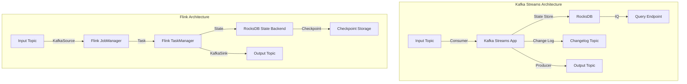
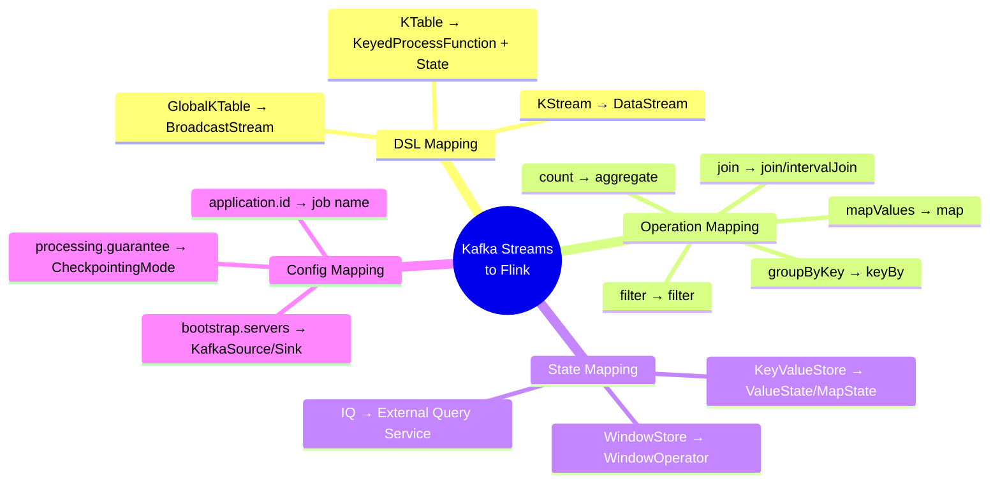
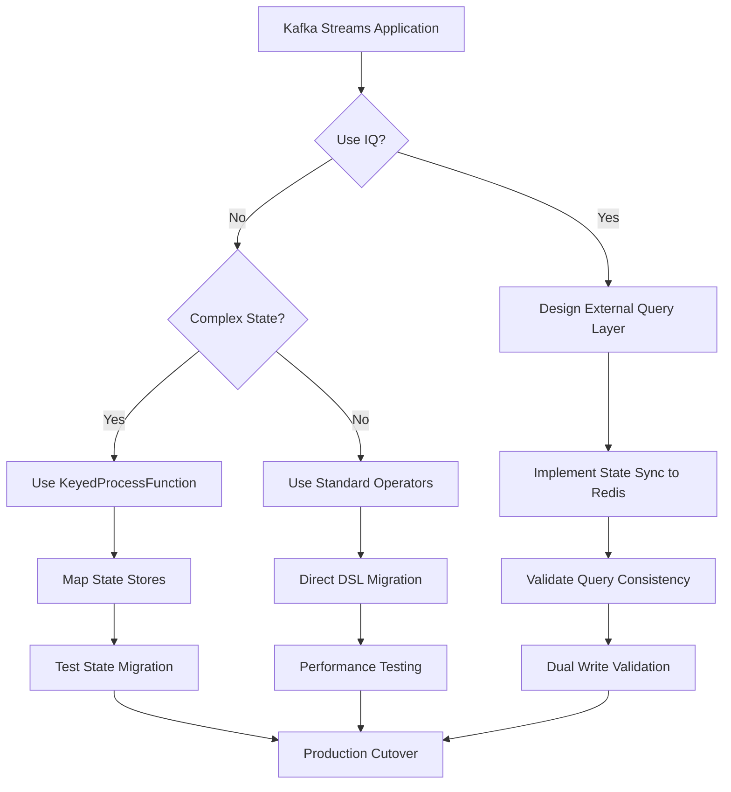

# Kafka Streams to Flink Migration Guide

> Stage: Knowledge/05-mapping-guides/migration-guides | Prerequisites: [Flink Kafka Connector](../../../Flink/05-ecosystem/05.01-connectors/flink-connectors-ecosystem-complete-guide.md), [Kafka Streams DSL](https://kafka.apache.org/documentation/streams/) | Formalization Level: L4

## 1. Concept Definitions

### Def-K-05-02-01: Kafka Streams Core Abstractions

Kafka Streams is built on two core abstractions: **KStream** and **KTable**:

$$
\text{KStream}(K, V) = \{ (k_i, v_i, t_i) \}_{i=0}^{\infty}, \quad k_i \in K, v_i \in V, t_i \in \mathbb{R}^+
$$

$$
\text{KTable}(K, V) = K \to (V \times \mathbb{R}^+), \quad \text{representing the latest key-to-value mapping}
$$

### Def-K-05-02-02: Flink Stream-Table Duality

Flink achieves stream-table duality through **DataStream** and **Dynamic Table**:

$$
\text{StreamToTable}: \text{DataStream}(T) \to \text{Table}(T)
$$

$$
\text{TableToStream}: \text{Table}(T) \to \text{DataStream}(\Delta T)
$$

Where $\Delta T$ represents the table changelog (INSERT/UPDATE/DELETE).

### Def-K-05-02-03: State Store Comparison

| Feature | Kafka Streams State Store | Flink State Backend |
|------|--------------------------|---------------------|
| Storage Engine | RocksDB (default) | Memory/ RocksDB |
| Persistence | Change Log Topic | Checkpoint |
| TTL | Supported | Native support |
| Query Capability | Interactive Queries (IQ) | Limited support |
| Fault Tolerance | Log replay | Checkpoint recovery |

## 2. Property Derivations

### Prop-K-05-02-01: Topology Structural Equivalence

Kafka Streams' **Processor Topology** and Flink's **JobGraph** are equivalent in expressiveness:

$$
\forall \text{Topology}_{KS}, \exists \text{JobGraph}_{Flink}, \quad \text{semantics}(\text{Topology}_{KS}) \cong \text{semantics}(\text{JobGraph}_{Flink})
$$

### Prop-K-05-02-02: Partition Assignment Semantics

Kafka Streams' **task parallelism** is bound to the number of Kafka partitions:

$$
\text{Parallelism}_{KS} = \text{numPartitions}_{topic}
$$

Flink's parallelism is independent of the number of Kafka partitions, achieving dynamic adjustment through **Rescale**:

$$
\text{Parallelism}_{Flink} \in [1, \text{maxParallelism}], \quad \text{dynamically reconfigurable}
$$

### Lemma-K-05-02-01: Rebalance Behavior Differences

Kafka Streams triggers a **Rebalance Listener** during partition rebalancing:

```
Consumer Rebalance → Task Migration → State Restoration → Resume Processing
```

Flink achieves stateless migration through **Checkpoint** and **Savepoint**:

```
Checkpoint/Savepoint → Cancel Job → Rescale → Restore → Resume
```

## 3. Relationship Establishment

### 3.1 DSL API Mapping

| Kafka Streams DSL | Flink DataStream API | Semantic Description |
|------------------|---------------------|---------|
| `stream()` | `env.fromSource(KafkaSource)` | Data source |
| `mapValues(func)` | `map(func)` | Value transformation |
| `flatMapValues(func)` | `flatMap(func)` | FlatMap |
| `filter(pred)` | `filter(pred)` | Filtering |
| `selectKey(func)` | `keyBy(func)` | Repartitioning |
| `groupByKey()` | `keyBy(KeySelector)` | Group by key |
| `count()` | `.aggregate(CountAggregate)` | Counting |
| `reduce(func)` | `.reduce(func)` | Reduction |
| `join(otherStream)` | `.join(otherStream)` | Stream join |
| `leftJoin(otherStream)` | `.leftJoin(otherStream)` | Left outer join |
| `outerJoin(otherStream)` | `.fullOuterJoin(otherStream)` | Full outer join |
| `to(topic)` | `.sinkTo(KafkaSink)` | Output to Topic |

### 3.2 KStream vs DataStream Semantics

```
Kafka Streams                    Flink
────────────────────────────────────────────────────────────────
KStream<K, V>                   →  DataStream<V> + keyBy()
KTable<K, V>                    →  KeyedProcessFunction + ValueState
GlobalKTable<K, V>              →  BroadcastStream + BroadcastState
KGroupedStream<K, V>            →  KeyedStream<K, V>
```

### 3.3 Window Operation Mapping

```
Kafka Streams                    Flink
────────────────────────────────────────────────────────────────
TimeWindows.of(Duration)        →  TumblingEventTimeWindows.of(Time)
SessionWindows.withGap(...)     →  EventTimeSessionWindows.withGap(...)
SlidingWindows.withSize(...)    →  SlidingEventTimeWindows.of(...)

// Window aggregation
.count()                        →  .aggregate(CountAggregate)
.reduce(func)                   →  .reduce(func)
.aggregate(initializer, ...)    →  .aggregate(AggregateFunction)
```

## 4. Argumentation

### 4.1 Deployment Mode Differences

**Kafka Streams Deployment Options**:

| Mode | Description | Flink Equivalent |
|------|------|-----------|
| Embedded | Embedded in application process | Flink MiniCluster |
| Standalone | Independent process | Flink Application Mode |
| Container | Docker/K8s | Flink Kubernetes Operator |

**Key Difference**: Kafka Streams is embedded as a library in applications, while Flink is an independent runtime managing job lifecycles.

### 4.2 Interactive Queries Migration

Kafka Streams provides **Interactive Queries (IQ)** for directly querying state stores:

```java

// [伪代码片段 - 不可直接运行] 仅展示核心逻辑
import org.apache.flink.api.common.typeinfo.Types;

// Kafka Streams IQ
ReadOnlyKeyValueStore<String, Long> store =
    streams.store("count-store", QueryableStoreTypes.keyValueStore());
Long count = store.get("key");
```

Flink does not natively support IQ, but can achieve this through:

1. **Async Query Service**: Expose query interfaces in `KeyedProcessFunction`
2. **State Backend Direct Access**: RocksDB State Backend supports snapshot queries
3. **External Storage Sync**: Sync state to external KV stores (Redis/Cassandra)

### 4.3 Serialization Comparison

**Kafka Streams**:

- Uses `Serde<T>` interface for unified serialization
- Default support for Avro/JSON/String/ByteArray

```java
// [伪代码片段 - 不可直接运行] 仅展示核心逻辑
StreamsBuilder builder = new StreamsBuilder();
KStream<String, MyEvent> stream = builder.stream(
    "input-topic",
    Consumed.with(Serdes.String(), new MyEventSerde())
);
```

**Flink**:

- Uses `TypeInformation` and `TypeSerializer`
- Supports POJO/Avro/Protobuf/Kryo

```java
// [伪代码片段 - 不可直接运行] 仅展示核心逻辑
KafkaSource<MyEvent> source = KafkaSource.<MyEvent>builder()
    .setTopics("input-topic")
    .setValueOnlyDeserializer(new MyEventDeserializationSchema())
    .build();
```

## 5. Proof / Engineering Argument

### Theorem Thm-K-05-02-01: Semantic Preservation from Kafka Streams to Flink

**Theorem**: For any stream processing topology $\mathcal{T}_{KS}$ built using the Kafka Streams DSL, there exists a Flink DataStream program $\mathcal{P}_{F}$ such that for all input stream sequences $\mathcal{I}$:

$$
\mathcal{O}(\mathcal{T}_{KS}, \mathcal{I}) = \mathcal{O}(\mathcal{P}_{F}, \mathcal{I})
$$

**Proof**:

1. **Source Operator Equivalence**: Kafka Streams `StreamsBuilder.stream()` is equivalent to Flink `KafkaSource` with `fromSource()`.

2. **Transformation Operator Equivalence**: Basic transformations (map/filter/flatMap) have identical semantics.

3. **Key Grouping Equivalence**: Kafka Streams `groupByKey()` is equivalent to Flink `keyBy()`, both producing `KeyedStream`.

4. **Window Semantics Equivalence**: Kafka Streams time windows and Flink `WindowAssigner` behave consistently under event time semantics.

5. **Join Semantics Equivalence**: Kafka Streams KStream-KStream join is semantically consistent with Flink `IntervalJoin`.

6. **Sink Equivalence**: Kafka Streams `to()` is equivalent to Flink `KafkaSink`.

### Engineering Argument: State Store Migration Strategy

**State Store Type Mapping**:

| Kafka Streams | Flink Implementation |
|--------------|-----------|
| KeyValueStore | ValueState/MapState |
| TimestampedKeyValueStore | ValueState + manual timestamp |
| WindowStore | WindowState (internal) |
| SessionStore | Custom + MapState |

**Migration Strategies**:

1. **Existing Data Migration**: Export and import through Kafka Topic
2. **Dual-write Strategy**: Write to both Kafka Streams and Flink simultaneously, switch after verifying consistency
3. **CDC Sync**: Use Change Data Capture to synchronize state changes

## 6. Examples

### 6.1 Basic Stream Processing Migration

**Kafka Streams**:

```java
// [伪代码片段 - 不可直接运行] 仅展示核心逻辑
StreamsBuilder builder = new StreamsBuilder();

// Create KStream
KStream<String, String> source = builder.stream("input-topic");

// Transformation processing
KStream<String, String> processed = source
    .filter((key, value) -> value.contains("ERROR"))
    .mapValues(value -> value.toUpperCase())
    .flatMapValues(value -> Arrays.asList(value.split(" ")));

// Output
processed.to("output-topic");

KafkaStreams streams = new KafkaStreams(builder.build(), props);
streams.start();
```

**Flink Equivalent**:

```java

// [伪代码片段 - 不可直接运行] 仅展示核心逻辑
import org.apache.flink.streaming.api.environment.StreamExecutionEnvironment;
import org.apache.flink.streaming.api.datastream.DataStream;

StreamExecutionEnvironment env =
    StreamExecutionEnvironment.getExecutionEnvironment();

// Kafka Source
KafkaSource<String> source = KafkaSource.<String>builder()
    .setBootstrapServers("kafka:9092")
    .setTopics("input-topic")
    .setGroupId("flink-group")
    .setStartingOffsets(OffsetsInitializer.earliest())
    .setValueOnlyDeserializer(new SimpleStringSchema())
    .build();

DataStream<String> stream = env.fromSource(
    source,
    WatermarkStrategy.noWatermarks(),
    "Kafka Source"
);

// Transformation processing
DataStream<String> processed = stream
    .filter(value -> value.contains("ERROR"))
    .map(value -> value.toUpperCase())
    .flatMap(new FlatMapFunction<String, String>() {
        @Override
        public void flatMap(String value, Collector<String> out) {
            for (String word : value.split(" ")) {
                out.collect(word);
            }
        }
    });

// Kafka Sink
KafkaSink<String> sink = KafkaSink.<String>builder()
    .setBootstrapServers("kafka:9092")
    .setRecordSerializer(KafkaRecordSerializationSchema.builder()
        .setTopic("output-topic")
        .setValueSerializationSchema(new SimpleStringSchema())
        .build())
    .build();

processed.sinkTo(sink);
env.execute("KafkaStreams Migration");
```

### 6.2 Aggregation Operation Migration

**Kafka Streams - Count Aggregation**:

```java
// [伪代码片段 - 不可直接运行] 仅展示核心逻辑
KTable<String, Long> wordCounts = source
    .groupByKey()
    .count(Materialized.as("counts-store"));

// Output changelog stream
wordCounts.toStream().to("counts-topic");
```

**Flink - Count Aggregation**:

```java

import org.apache.flink.streaming.api.datastream.DataStream;
import org.apache.flink.api.common.functions.AggregateFunction;
import org.apache.flink.streaming.api.windowing.time.Time;

DataStream<Tuple2<String, Long>> wordCounts = source
    .flatMap((String value, Collector<Tuple2<String, String>> out) -> {
        for (String word : value.split(" ")) {
            out.collect(Tuple2.of(word, word));
        }
    })
    .keyBy(value -> value.f0)
    .window(TumblingEventTimeWindows.of(Time.minutes(1)))
    .aggregate(new CountAggregate<>());

// Custom aggregate function
public static class CountAggregate<T> implements AggregateFunction<Tuple2<T, String>, Long, Long> {
    @Override
    public Long createAccumulator() {
        return 0L;
    }

    @Override
    public Long add(Tuple2<T, String> value, Long accumulator) {
        return accumulator + 1;
    }

    @Override
    public Long getResult(Long accumulator) {
        return accumulator;
    }

    @Override
    public Long merge(Long a, Long b) {
        return a + b;
    }
}
```

### 6.3 Stream-Table Join Migration

**Kafka Streams - KStream-KTable Join**:

```java
// [伪代码片段 - 不可直接运行] 仅展示核心逻辑
KStream<String, Order> orders = builder.stream("orders");
KTable<String, Customer> customers = builder.table("customers");

KStream<String, EnrichedOrder> enriched = orders
    .leftJoin(customers, (order, customer) -> {
        order.setCustomerInfo(customer);
        return order;
    });
```

**Flink - Stream-Broadcast Join**:

```java

// [伪代码片段 - 不可直接运行] 仅展示核心逻辑
import org.apache.flink.streaming.api.datastream.DataStream;

// Customer data as broadcast stream
DataStream<Customer> customerStream = env.fromSource(
    KafkaSource.<Customer>builder()
        .setTopics("customers")
        .setValueOnlyDeserializer(new CustomerDeserializationSchema())
        .build(),
    WatermarkStrategy.noWatermarks(),
    "Customers"
);

MapStateDescriptor<String, Customer> customerStateDescriptor =
    new MapStateDescriptor<>("customers", String.class, Customer.class);
BroadcastStream<Customer> broadcastCustomers = customerStream.broadcast(customerStateDescriptor);

// Order stream joins broadcast stream
DataStream<EnrichedOrder> enriched = orderStream
    .connect(broadcastCustomers)
    .process(new BroadcastProcessFunction<Order, Customer, EnrichedOrder>() {
        @Override
        public void processElement(Order order, ReadOnlyContext ctx, Collector<EnrichedOrder> out) {
            ReadOnlyBroadcastState<String, Customer> state = ctx.getBroadcastState(customerStateDescriptor);
            Customer customer = state.get(order.getCustomerId());
            out.collect(new EnrichedOrder(order, customer));
        }

        @Override
        public void processBroadcastElement(Customer customer, Context ctx, Collector<EnrichedOrder> out) {
            ctx.getBroadcastState(customerStateDescriptor).put(customer.getId(), customer);
        }
    });
```

### 6.4 Interactive Query Migration Solution

**Solution 1: State Backend Query**:

```java
// Flink does not support direct IQ, but Queryable State can be used (deprecated)
// Recommended solution: Write state to external storage


import org.apache.flink.api.common.state.ValueState;
import org.apache.flink.api.common.state.ValueStateDescriptor;

public class QueryableStateFunction extends KeyedProcessFunction<String, Event, Result> {
    private transient ValueState<AggregatedState> state;
    private transient Connection redisConnection;

    @Override
    public void open(Configuration parameters) throws Exception {
        state = getRuntimeContext().getState(new ValueStateDescriptor<>("state", AggregatedState.class));
        redisConnection = RedisClient.create("redis://localhost").connect();
    }

    @Override
    public void processElement(Event event, Context ctx, Collector<Result> out) throws Exception {
        AggregatedState current = state.value();
        if (current == null) {
            current = new AggregatedState();
        }
        current.update(event);
        state.update(current);

        // Sync to Redis for querying
        redisConnection.sync().set(ctx.getCurrentKey(), serialize(current));

        out.collect(current.toResult());
    }
}
```

**Solution 2: REST API Service**:

```java
// Built-in HTTP service in ProcessFunction

import org.apache.flink.api.common.state.ValueState;
import org.apache.flink.api.common.state.ValueStateDescriptor;

public class StateQueryService extends KeyedProcessFunction<String, Event, Result> {
    private transient ValueState<State> state;
    private transient HttpServer server;

    @Override
    public void open(Configuration parameters) throws Exception {
        state = getRuntimeContext().getState(new ValueStateDescriptor<>("state", State.class));
        server = HttpServer.create(new InetSocketAddress(8080), 0);
        server.createContext("/query", exchange -> {
            String key = extractKey(exchange);
            // Note: State can only be accessed within processElement of KeyedProcessFunction
            // A message-driven query mechanism needs to be designed
        });
        server.start();
    }
}
```

## 7. Visualizations

### 7.1 Architecture Comparison



### 7.2 API Mapping Panorama



### 7.3 Migration Decision Flow



## 8. FAQ

### Q1: How to migrate Kafka Streams Punctuation?

**A**: Use Flink's **TimerService**:

```java
public class PunctuatedFunction extends KeyedProcessFunction<String, Event, Result> {
    @Override
    public void processElement(Event event, Context ctx, Collector<Result> out) {
        // Register timer to implement punctuation semantics
        ctx.timerService().registerProcessingTimeTimer(ctx.timestamp() + 60000);
        // Process element
    }

    @Override
    public void onTimer(long timestamp, OnTimerContext ctx, Collector<Result> out) {
        // Timer-triggered logic
    }
}
```

### Q2: How to migrate Kafka Streams Processor API?

**A**: Directly use Flink's **ProcessFunction** family:

```java
// Kafka Streams Processor API
public class CustomProcessor extends Processor<String, String> {
    private ProcessorContext context;

    @Override
    public void init(ProcessorContext context) {
        this.context = context;
        this.context.schedule(Duration.ofSeconds(10), PunctuationType.WALL_CLOCK_TIME, this::punctuate);
    }
}

// Flink equivalent
public class CustomProcessFunction extends KeyedProcessFunction<String, String, String> {
    @Override
    public void open(Configuration parameters) {
        // Initialization
    }

    @Override
    public void processElement(String value, Context ctx, Collector<String> out) {
        // Process element
    }
}
```

### Q3: How to handle Kafka Streams custom partitioners?

**A**: Implemented through Flink's **custom partitioner**:

```java

// [伪代码片段 - 不可直接运行] 仅展示核心逻辑
import org.apache.flink.streaming.api.datastream.DataStream;

DataStream<Event> stream = ...;
stream.partitionCustom(
    new Partitioner<String>() {
        @Override
        public int partition(String key, int numPartitions) {
            return Math.abs(key.hashCode()) % numPartitions;
        }
    },
    event -> event.getKey()
);
```

### Q4: What is the impact of Kafka Streams DSL vs Processor API choice on migration?

**A**:

- **DSL applications**: Directly map to Flink DataStream API, migration is relatively simple
- **Processor API applications**: Map to Flink ProcessFunction, need to manually manage state and timers

## 9. Performance Comparison

| Metric | Kafka Streams | Flink | Description |
|------|---------------|-------|------|
| Latency | 10-100ms | 10-100ms | Comparable |
| Throughput | Medium | High | Flink has better parallelism control |
| Scalability | Limited by partition count | Independent scaling | Flink is more flexible |
| State Query | Native IQ support | Requires external implementation | Kafka Streams advantage |
| Resource Isolation | Application-level | Cluster-level | Flink better for multi-tenant |
| Ecosystem Integration | Kafka ecosystem | Multi-source support | Flink is broader |

## 10. References
