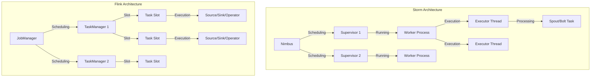
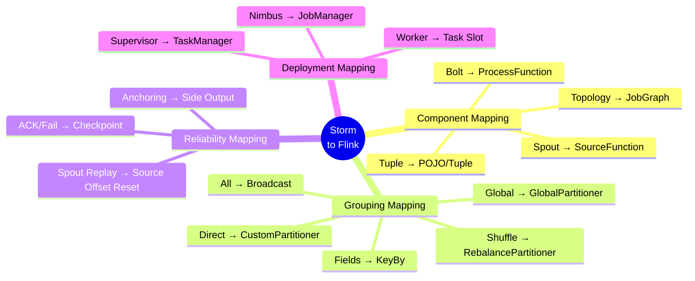
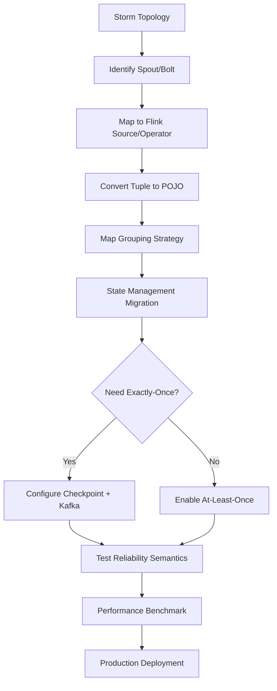

# Apache Storm to Flink Migration Guide

> **Stage**: Knowledge/05-mapping-guides/migration-guides | **Prerequisites**: [Flink JobGraph](../../../Flink/01-concepts/deployment-architectures.md), [Storm Topology](https://storm.apache.org/releases/current/Concepts.html) | **Formality Level**: L4

## 1. Definitions

### Def-K-05-03-01: Storm Core Abstractions

Apache Storm's core abstractions consist of **Topology**, **Spout**, and **Bolt**:

$$
\text{Topology} = (S, B, E, G)
$$

Where:

- $S$: Set of Spouts (data sources)
- $B$: Set of Bolts (processing nodes)
- $E$: Set of edges (data streams)
- $G$: Grouping strategy (Stream Grouping)

### Def-K-05-03-02: Storm Tuple Data Model

Storm uses **Tuple** as the basic data unit:

$$
\text{Tuple} = \langle \text{streamId}, \text{componentId}, \text{taskId}, \text{values}[] \rangle
$$

Where `values[]` is a type-erased Object array, requiring runtime type checks.

### Def-K-05-03-03: Flink JobGraph and Operator

Flink's execution graph model:

$$
\text{JobGraph} = (V_{op}, E_{pipe}, \mathcal{P}, \mathcal{S})
$$

Where:

- $V_{op}$: Set of operator vertices
- $E_{pipe}$: Set of pipeline edges
- $\mathcal{P}$: Parallelism configuration
- $\mathcal{S}$: State configuration

### Def-K-05-03-04: Reliability Semantics Comparison

| Semantics | Storm | Storm (Trident) | Flink |
|-----------|-------|-----------------|-------|
| At-least-once | ACK mechanism | Transparent | Checkpoint |
| Exactly-once | Not supported | State + Batch | Checkpoint + Barrier |
| Message deduplication | Application-level | Transparent | Transparent |
| Failure recovery | Record-level | Batch-level | Checkpoint-level |

## 2. Properties

### Prop-K-05-03-01: Topological Structure Equivalence

Storm Topology and Flink JobGraph are structurally equivalent:

$$
\forall \text{Topology}_{Storm}, \exists \text{JobGraph}_{Flink}, \quad |V_{spout}| + |V_{bolt}| = |V_{op}|
$$

### Prop-K-05-03-02: Grouping Strategy Mapping

Storm's Stream Grouping corresponds to Flink's partitioning strategy:

$$
\begin{aligned}
\text{ShuffleGrouping} &\mapsto \text{RebalancePartitioner} \\
\text{FieldsGrouping} &\mapsto \text{KeyGroupStreamPartitioner} \\
\text{AllGrouping} &\mapsto \text{BroadcastPartitioner} \\
\text{GlobalGrouping} &\mapsto \text{GlobalPartitioner} \\
\text{DirectGrouping} &\mapsto \text{CustomPartitioner}
\end{aligned}
$$

### Lemma-K-05-03-01: State Management Differences

Storm Bolt state requires **manual management** (external storage):

```java
// [伪代码片段 - 不可直接运行] 仅展示核心逻辑
// Storm - manual state management
Map<String, Object> state = new HashMap<>();
// Needs periodic persistence to Redis/HBase
```

Flink provides **built-in state management**:

```java

// [伪代码片段 - 不可直接运行] 仅展示核心逻辑
import org.apache.flink.api.common.state.ValueState;
import org.apache.flink.api.common.state.ValueStateDescriptor;
import org.apache.flink.api.common.typeinfo.Types;

// Flink - built-in state
ValueStateDescriptor<Long> descriptor = new ValueStateDescriptor<>("count", Types.LONG);
ValueState<Long> state = getRuntimeContext().getState(descriptor);
```

## 3. Relations

### 3.1 Core Component Mapping

| Storm Component | Flink Equivalent | Description |
|-----------------|------------------|-------------|
| `IRichSpout` | `SourceFunction` / `RichSourceFunction` | Data source |
| `IRichBolt` | `ProcessFunction` / `RichFlatMapFunction` | Processing logic |
| `IBasicBolt` | `MapFunction` / `FlatMapFunction` | Simplified processing |
| `BaseWindowedBolt` | `WindowFunction` | Window processing |
| `TopologyBuilder` | `StreamExecutionEnvironment` | Builder |
| `Config` | `Configuration` / env settings | Configuration |
| `OutputCollector` | `Collector` | Output collection |

### 3.2 Tuple to Row/DataStream Mapping

```
Storm Tuple                    Flink
────────────────────────────────────────────────────────────────
Tuple (Object[])              →  POJO / Tuple / Row
Fields (schema)               →  TypeInformation
tuple.getString(0)            →  event.getField()
tuple.getIntegerByField("id") →  event.getId()
new Values(...)               →  out.collect(new Event(...))
```

### 3.3 Stream Grouping Strategy Mapping

```java
// [伪代码片段 - 不可直接运行] 仅展示核心逻辑
// Storm - Fields Grouping
builder.setBolt("count", new CountBolt(), 4)
    .fieldsGrouping("split", new Fields("word"));

// Flink - KeyBy
stream.flatMap(new Splitter())
    .keyBy(value -> value.getWord())  // Equivalent to fieldsGrouping
    .process(new CountFunction())
    .setParallelism(4);
```

### 3.4 Configuration Mapping

| Storm Config | Flink Config | Description |
|--------------|--------------|-------------|
| `TOPOLOGY_WORKERS` | `parallelism.default` | Default parallelism |
| `TOPOLOGY_MESSAGE_TIMEOUT_SECS` | `execution.checkpointing.timeout` | Timeout |
| `TOPOLOGY_MAX_SPOUT_PENDING` | `execution.max-idle-state-retention` | Max backlog |
| `TOPOLOGY_ACKERS` | Built-in | ACK is transparent |

## 4. Argumentation

### 4.1 Reliability Mechanism Differences

**Storm ACK Mechanism**:

```
Spout → emit(tuple) → Bolt1 → ack(tuple) → Bolt2 → ack(tuple) → Spout.ack(tuple)
                        ↓                              ↓
                      fail → replay                   fail → replay
```

**Flink Checkpoint Mechanism**:

```
Source → [Barrier] → Operator1 → [Barrier] → Operator2 → [Barrier] → Sink
           ↓                         ↓                         ↓
        Snapshot state            Snapshot state            Snapshot state
```

**Key Differences**:

- Storm: Per-record ACK, high overhead but fine-grained
- Flink: Batch Checkpoint, low overhead and coarse-grained

### 4.2 Deployment Mode Comparison

| Mode | Storm | Flink |
|------|-------|-------|
| Local Mode | `LocalCluster` | `MiniCluster` |
| Standalone | Nimbus + Supervisor | JobManager + TaskManager |
| YARN | Storm-YARN | Flink-YARN |
| Kubernetes | Custom required | Native K8s Operator |

### 4.3 Window Processing Comparison

**Storm Windowing**:

```java
// Storm 1.x - manual window management
public class WindowBolt extends BaseRichBolt {
    private List<Tuple> window = new ArrayList<>();

    @Override
    public void execute(Tuple tuple) {
        window.add(tuple);
        if (window.size() >= 100) {
            processWindow(window);
            window.clear();
        }
    }
}
```

**Flink Windowing**:

```java

// [伪代码片段 - 不可直接运行] 仅展示核心逻辑
import org.apache.flink.api.common.functions.AggregateFunction;
import org.apache.flink.streaming.api.windowing.time.Time;

// Flink native window support
stream.keyBy(...)
    .window(TumblingEventTimeWindows.of(Time.seconds(10)))
    .aggregate(new AggregateFunction() {...});
```

## 5. Proof / Engineering Argument

### Theorem Thm-K-05-03-01: Semantic Equivalence of Storm Topology to Flink JobGraph

**Theorem**: For any Storm Topology $\mathcal{T}$, there exists a Flink JobGraph $\mathcal{G}$ such that:

$$
\forall \text{input stream } I, \quad \mathcal{O}(\mathcal{T}, I) \cong \mathcal{O}(\mathcal{G}, I)
$$

Where $\cong$ denotes semantic equivalence within window alignment deviation.

**Proof**:

1. **Spout Mapping**: Storm Spout's `nextTuple()` is equivalent to Flink SourceFunction's `run()` method.

2. **Bolt Mapping**: Storm Bolt's `execute(Tuple)` is equivalent to Flink ProcessFunction's `processElement()`.

3. **Grouping Mapping**: Storm's Stream Grouping can be implemented via Flink's KeyBy and Custom Partitioner.

4. **Reliability Mapping**: Storm's ACK/Fail semantics can be achieved via Flink's Checkpoint and two-phase commit.

5. **State Mapping**: Storm's external state management is equivalent to Flink's managed state persistence.

### Engineering Argument: Performance Optimization Strategy

**Storm Optimization Points**:

- Adjust `TOPOLOGY_MAX_SPOUT_PENDING` to control backpressure
- Optimize serialization (Kryo registration)
- Use local or shuffle grouping to reduce network transfer

**Flink Optimization Mapping**:

- Automatic backpressure management (no configuration needed)
- Type hints and POJO conventions
- Chaining optimization and slot sharing

## 6. Examples

### 6.1 WordCount Migration Example

**Storm Implementation**:

```java
// Spout
public class SentenceSpout extends BaseRichSpout {
    private SpoutOutputCollector collector;

    @Override
    public void open(Map conf, TopologyContext context, SpoutOutputCollector collector) {
        this.collector = collector;
    }

    @Override
    public void nextTuple() {
        String[] sentences = new String[]{"hello world", "apache storm"};
        String sentence = sentences[new Random().nextInt(sentences.length)];
        collector.emit(new Values(sentence));
    }

    @Override
    public void declareOutputFields(OutputFieldsDeclarer declarer) {
        declarer.declare(new Fields("sentence"));
    }
}

// Split Bolt
public class SplitBolt extends BaseBasicBolt {
    @Override
    public void execute(Tuple input, BasicOutputCollector collector) {
        String sentence = input.getStringByField("sentence");
        for (String word : sentence.split(" ")) {
            collector.emit(new Values(word, 1));
        }
    }

    @Override
    public void declareOutputFields(OutputFieldsDeclarer declarer) {
        declarer.declare(new Fields("word", "count"));
    }
}

// Count Bolt
public class CountBolt extends BaseRichBolt {
    private Map<String, Integer> counts = new HashMap<>();
    private OutputCollector collector;

    @Override
    public void prepare(Map stormConf, TopologyContext context, OutputCollector collector) {
        this.collector = collector;
    }

    @Override
    public void execute(Tuple input) {
        String word = input.getStringByField("word");
        int count = counts.getOrDefault(word, 0) + 1;
        counts.put(word, count);
        collector.emit(new Values(word, count));
    }

    @Override
    public void declareOutputFields(OutputFieldsDeclarer declarer) {
        declarer.declare(new Fields("word", "count"));
    }
}

// Build Topology
TopologyBuilder builder = new TopologyBuilder();
builder.setSpout("spout", new SentenceSpout(), 1);
builder.setBolt("split", new SplitBolt(), 2).shuffleGrouping("spout");
builder.setBolt("count", new CountBolt(), 4).fieldsGrouping("split", new Fields("word"));

Config conf = new Config();
conf.setDebug(true);
StormSubmitter.submitTopology("word-count", conf, builder.createTopology());
```

**Flink Equivalent Implementation**:

```java

import org.apache.flink.streaming.api.environment.StreamExecutionEnvironment;
import org.apache.flink.streaming.api.datastream.DataStream;

// POJO definition
public static class WordCount {
    public String word;
    public int count;

    public WordCount() {}
    public WordCount(String word, int count) {
        this.word = word;
        this.count = count;
    }
}

// Source Function (equivalent to Spout)
public static class SentenceSource implements SourceFunction<String> {
    private volatile boolean isRunning = true;
    private String[] sentences = new String[]{"hello world", "apache flink"};

    @Override
    public void run(SourceContext<String> ctx) throws Exception {
        while (isRunning) {
            String sentence = sentences[new Random().nextInt(sentences.length)];
            ctx.collect(sentence);
            Thread.sleep(100);
        }
    }

    @Override
    public void cancel() {
        isRunning = false;
    }
}

public static void main(String[] args) throws Exception {
    StreamExecutionEnvironment env = StreamExecutionEnvironment.getExecutionEnvironment();

    // Source (equivalent to setSpout)
    DataStream<String> sentences = env.addSource(new SentenceSource()).setParallelism(1);

    // Split + Count (equivalent to setBolt)
    DataStream<WordCount> wordCounts = sentences
        .flatMap(new FlatMapFunction<String, WordCount>() {
            @Override
            public void flatMap(String sentence, Collector<WordCount> out) {
                for (String word : sentence.split(" ")) {
                    out.collect(new WordCount(word, 1));
                }
            }
        })
        .setParallelism(2)  // Equivalent to Split Bolt parallelism
        .keyBy(value -> value.word)  // Equivalent to fieldsGrouping
        .sum("count")  // Built-in aggregation
        .setParallelism(4);  // Equivalent to Count Bolt parallelism

    wordCounts.print();
    env.execute("WordCount - Storm Migration");
}
```

### 6.2 Reliability Semantics Migration

**Storm ACK Mechanism**:

```java
public class ReliableSpout extends BaseRichSpout {
    private SpoutOutputCollector collector;
    private Map<Long, String> pending = new HashMap<>();
    private long msgId = 0;

    @Override
    public void nextTuple() {
        String message = getNextMessage();
        long id = msgId++;
        pending.put(id, message);
        collector.emit(new Values(message), id);
    }

    @Override
    public void ack(Object msgId) {
        pending.remove((Long) msgId);
    }

    @Override
    public void fail(Object msgId) {
        String message = pending.get((Long) msgId);
        collector.emit(new Values(message), msgId);
    }
}
```

**Flink Checkpoint Mechanism**:

```java

// [伪代码片段 - 不可直接运行] 仅展示核心逻辑
import org.apache.flink.streaming.api.datastream.DataStream;
import org.apache.flink.streaming.api.CheckpointingMode;

// Flink transparent Checkpoint, no explicit ACK needed
KafkaSource<String> source = KafkaSource.<String>builder()
    .setTopics("input-topic")
    .setGroupId("flink-group")
    .setStartingOffsets(OffsetsInitializer.earliest())
    .setValueOnlyDeserializer(new SimpleStringSchema())
    .build();

// Enable Checkpoint to get Exactly-Once semantics
env.enableCheckpointing(60000);
env.getCheckpointConfig().setCheckpointingMode(CheckpointingMode.EXACTLY_ONCE);

DataStream<String> stream = env.fromSource(source, WatermarkStrategy.noWatermarks(), "Kafka Source");
```

### 6.3 Window Processing Migration

**Storm Manual Window**:

```java
public class WindowedBolt extends BaseRichBolt {
    private List<Tuple> window = new ArrayList<>();
    private long windowSize = 10000; // 10 seconds
    private long lastEmitTime = System.currentTimeMillis();

    @Override
    public void execute(Tuple tuple) {
        window.add(tuple);

        long now = System.currentTimeMillis();
        if (now - lastEmitTime >= windowSize) {
            processAndEmit(window);
            window.clear();
            lastEmitTime = now;
        }
    }
}
```

**Flink Native Window**:

```java

// [伪代码片段 - 不可直接运行] 仅展示核心逻辑
import org.apache.flink.api.common.functions.AggregateFunction;
import org.apache.flink.streaming.api.windowing.time.Time;

stream.keyBy(value -> value.getKey())
    .window(TumblingEventTimeWindows.of(Time.seconds(10)))
    .aggregate(new AggregateFunction<Value, Accumulator, Result>() {
        @Override
        public Accumulator createAccumulator() {
            return new Accumulator();
        }

        @Override
        public Accumulator add(Value value, Accumulator accumulator) {
            accumulator.add(value);
            return accumulator;
        }

        @Override
        public Result getResult(Accumulator accumulator) {
            return accumulator.toResult();
        }

        @Override
        public Accumulator merge(Accumulator a, Accumulator b) {
            a.merge(b);
            return a;
        }
    });
```

### 6.4 State Management Migration

**Storm External State**:

```java
public class StatefulBolt extends BaseRichBolt {
    private JedisPool jedisPool;
    private String stateKey = "word-counts";

    @Override
    public void prepare(Map stormConf, TopologyContext context, OutputCollector collector) {
        jedisPool = new JedisPool("redis", 6379);
    }

    @Override
    public void execute(Tuple tuple) {
        String word = tuple.getStringByField("word");
        try (Jedis jedis = jedisPool.getResource()) {
            jedis.hincrBy(stateKey, word, 1);
        }
    }
}
```

**Flink Managed State**:

```java

import org.apache.flink.api.common.state.ValueState;
import org.apache.flink.api.common.state.ValueStateDescriptor;
import org.apache.flink.api.common.typeinfo.Types;

public class StatefulFunction extends KeyedProcessFunction<String, String, Tuple2<String, Long>> {
    private ValueState<Long> countState;

    @Override
    public void open(Configuration parameters) {
        ValueStateDescriptor<Long> descriptor =
            new ValueStateDescriptor<>("count", Types.LONG);
        countState = getRuntimeContext().getState(descriptor);
    }

    @Override
    public void processElement(String word, Context ctx, Collector<Tuple2<String, Long>> out)
            throws Exception {
        Long current = countState.value();
        if (current == null) {
            current = 0L;
        }
        current++;
        countState.update(current);
        out.collect(Tuple2.of(word, current));
    }
}
```

## 7. Visualizations

### 7.1 Architecture Comparison



### 7.2 Component Mapping Panorama



### 7.3 Migration Flow



## 8. FAQ

### Q1: How to migrate Storm's Tick Tuple?

**A**: Use Flink's **TimerService**:

```java
public class TickFunction extends KeyedProcessFunction<String, Event, Result> {
    @Override
    public void open(Configuration parameters) {
        // Register processing time timer (equivalent to Tick Tuple)
        ctx.timerService().registerProcessingTimeTimer(System.currentTimeMillis() + 1000);
    }

    @Override
    public void onTimer(long timestamp, OnTimerContext ctx, Collector<Result> out) {
        // Tick trigger logic
        // Re-register next Tick
        ctx.timerService().registerProcessingTimeTimer(timestamp + 1000);
    }
}
```

### Q2: How to migrate Storm's Metrics?

**A**: Flink provides a **Metric system**:

```java
public class MetricBolt extends RichFlatMapFunction<String, String> {
    private transient Counter counter;
    private transient Histogram histogram;

    @Override
    public void open(Configuration parameters) {
        counter = getRuntimeContext()
            .getMetricGroup()
            .counter("recordsProcessed");
        histogram = getRuntimeContext()
            .getMetricGroup()
            .histogram("recordSize", new DropwizardHistogramWrapper(
                new com.codahale.metrics.Histogram(new SlidingWindowReservoir(500))
            ));
    }

    @Override
    public void flatMap(String value, Collector<String> out) {
        counter.inc();
        histogram.update(value.length());
        out.collect(value);
    }
}
```

### Q3: How to migrate Storm's DRPC?

**A**: Use Flink's **Queryable State** or external service:

```java
// Approach: write results to external query service (e.g., Redis)
public class DRPCMigration extends KeyedProcessFunction<String, Event, Result> {
    private transient JedisPool jedisPool;

    @Override
    public void open(Configuration parameters) {
        jedisPool = new JedisPool("redis", 6379);
    }

    @Override
    public void processElement(Event event, Context ctx, Collector<Result> out) {
        Result result = process(event);

        // Write to queryable storage
        try (Jedis jedis = jedisPool.getResource()) {
            jedis.set(event.getId(), serialize(result));
        }

        out.collect(result);
    }
}
```

### Q4: How to migrate Storm's Trident?

**A**: Flink's **DataStream** + **State** provide equivalent functionality:

```java

// [伪代码片段 - 不可直接运行] 仅展示核心逻辑
import org.apache.flink.streaming.api.datastream.DataStream;

// Storm Trident State Query
// DRPCClient client = new DRPCClient(...);
// String result = client.execute("words", "hello");

// Flink equivalent - using Keyed State
DataStream<Query> queries = env.addSource(new QuerySource());
DataStream<Event> events = env.addSource(new EventSource());

// State update stream
DataStream<State> stateUpdates = events
    .keyBy(e -> e.getKey())
    .process(new StateUpdaterFunction());

// Query processing
DataStream<Result> results = queries
    .keyBy(q -> q.getKey())
    .connect(stateUpdates.keyBy(s -> s.getKey()))
    .process(new QueryHandlerFunction());
```

## 9. Performance Comparison

| Metric | Storm | Storm (Trident) | Flink | Description |
|--------|-------|-----------------|-------|-------------|
| Latency | Millisecond-level | Second-level | Millisecond-level | Flink native stream processing |
| Throughput | Medium | Medium | High | Flink optimized execution engine |
| Exactly-Once | Not supported | Supported | Supported | Trident/Flink built-in |
| State Management | External | Built-in | Built-in | Flink rich state backends |
| Backpressure | Manual | Manual | Automatic | Flink automatic backpressure |
| Resource Scheduling | Static | Static | Dynamic | Flink dynamic scaling |

## 10. References
