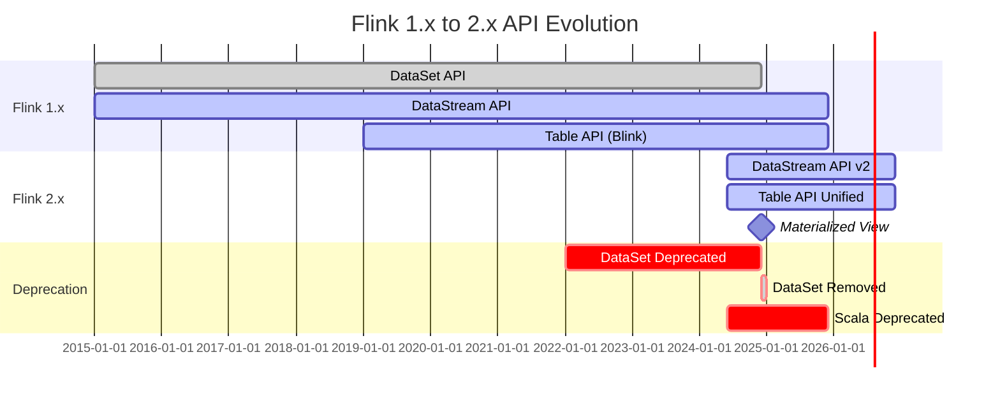
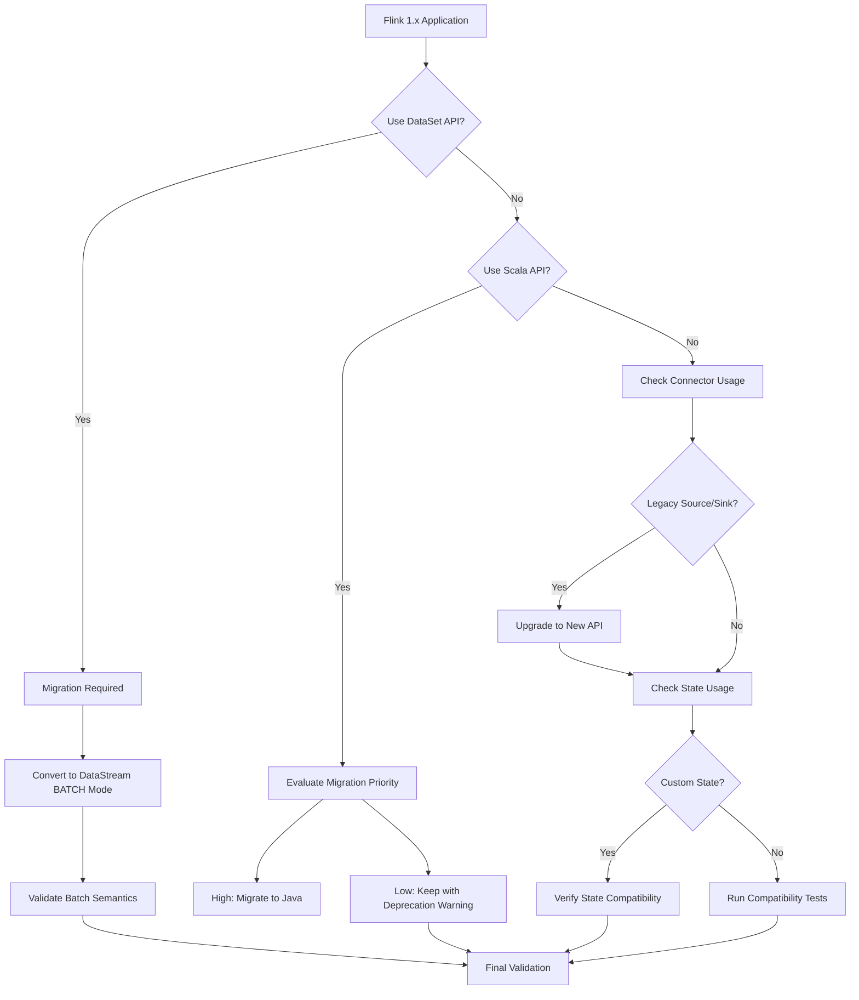
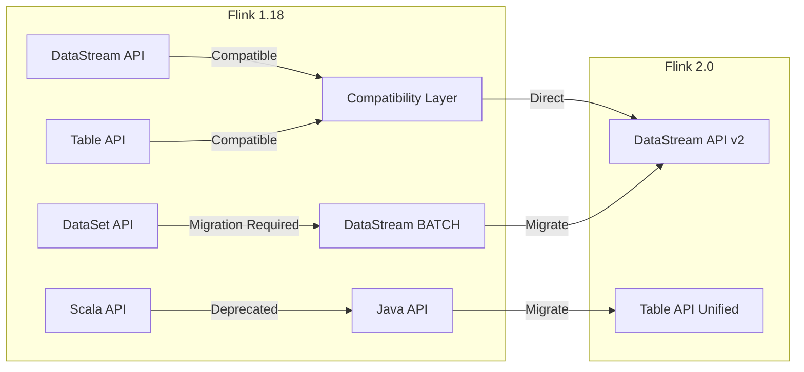

# Flink 1.x to 2.x Migration Guide

> Stage: Knowledge/05-mapping-guides/migration-guides | Prerequisites: [Flink 2.0 Release Notes](https://nightlies.apache.org/flink/flink-docs-release-2.0/release-notes/flink-2.0/), [Flink 1.20 Migration Guide](https://nightlies.apache.org/flink/flink-docs-stable/docs/dev/datastream/upgrading/) | Formalization Level: L4

## 1. Definitions

### Def-K-05-04-01: Flink 1.x Architecture Model

Flink 1.x adopts the classic DataStream API and batch-stream unification (batch as a special case of stream):

$$
\text{Flink-1.x} = \{ \text{DataSet API}, \text{DataStream API}, \text{Table API/SQL} \}
$$

### Def-K-05-04-02: Flink 2.x Architecture Evolution

Flink 2.x further unifies batch and stream processing, introducing **Materialized View** semantics and an enhanced declarative API:

$$
\text{Flink-2.x} = \{ \text{DataStream API (v2)}, \text{Table API/SQL (Enhanced)}, \text{Materialized View} \}
$$

### Def-K-05-04-03: Major Deprecated and Removed Components

| Component | Flink 1.x | Flink 2.x | Alternative |
|-----------|-----------|-----------|-------------|
| DataSet API | Supported | Removed | DataStream (BATCH mode) |
| Scala API | Supported | Deprecated | Java API / Table API |
| Legacy Sources | Supported | Removed | New Source Interface |
| Legacy Sinks | Supported | Removed | New Sink Interface |
| Savepoint V1 | Supported | Removed | Savepoint V2 |
| Flink Shaded | Supported | Restructured | Direct dependency management |

## 2. Properties

### Prop-K-05-04-01: API Compatibility Guarantee

Flink 2.x maintains core backward compatibility for the **DataStream API**:

$$
\forall \text{API}_{core} \in \text{Flink-1.x}, \exists \text{API}_{compat} \in \text{Flink-2.x}
$$

### Prop-K-05-04-02: State Migration Completeness

Savepoint V2 supports migration from V1:

$$
\text{Savepoint}_{V1} \xrightarrow{\text{upgrade}} \text{Savepoint}_{V2}
$$

### Lemma-K-05-04-01: Configuration Migration Rules

Most configurations remain compatible; some deprecated configs are automatically mapped:

```
flink-conf.yaml 1.x → flink-conf.yaml 2.x
- parallelism.default (unchanged)
- state.backend (unchanged)
- taskmanager.memory.fraction → taskmanager.memory.network.fraction
```

## 3. Relations

### 3.1 API Change Mapping

| Flink 1.x | Flink 2.x | Change Type |
|-----------|-----------|-------------|
| `ExecutionEnvironment` | `StreamExecutionEnvironment` | Unified |
| `DataSet<T>` | `DataStream<T> + ExecutionMode.BATCH` | Semantic migration |
| `DataStream.setParallelism()` | Unchanged | Compatible |
| `TableEnvironment` | `StreamTableEnvironment` (recommended) | Enhanced |
| `StreamExecutionEnvironment.execute()` | Unchanged (returns JobClient) | Enhanced |

### 3.2 Connector API Changes

**Source Interface Migration**:

```java
// Flink 1.x - Old Source interface
public class OldSource implements SourceFunction<String> {
    private volatile boolean isRunning = true;

    @Override
    public void run(SourceContext<String> ctx) {
        while (isRunning) {
            ctx.collect(generateData());
        }
    }

    @Override
    public void cancel() {
        isRunning = false;
    }
}

// Flink 2.x - New Source interface
public class NewSource implements Source<String, MySplit, MyEnumeratorState> {
    @Override
    public Boundedness getBoundedness() {
        return Boundedness.CONTINUOUS_UNBOUNDED;
    }

    @Override
    public SourceReader<String, MySplit> createReader(SourceReaderContext readerContext) {
        return new MySourceReader(readerContext);
    }

    @Override
    public SplitEnumerator<MySplit, MyEnumeratorState> createEnumerator(
            SplitEnumeratorContext<MySplit> enumContext) {
        return new MySplitEnumerator(enumContext);
    }
}
```

**Sink Interface Migration**:

```java
// Flink 1.x - Old Sink
public class OldSink implements SinkFunction<String> {
    @Override
    public void invoke(String value, Context context) {
        sendToExternalSystem(value);
    }
}

// Flink 2.x - New Sink (two-phase commit)
public class NewSink implements TwoPhaseCommittingSink<String, MyTransaction> {
    @Override
    public PrecommittingSinkWriter<String, MyTransaction> createWriter(InitContext context) {
        return new MySinkWriter();
    }

    @Override
    public Committer<MyTransaction> createCommitter() {
        return new MyCommitter();
    }
}
```

### 3.3 State API Changes

```java

import org.apache.flink.api.common.state.ValueState;
import org.apache.flink.api.common.state.ValueStateDescriptor;
import org.apache.flink.streaming.api.windowing.time.Time;

// Flink 1.x - Old State API
ValueStateDescriptor<Long> descriptor = new ValueStateDescriptor<>(
    "count",  // state name
    Long.class  // type
);
ValueState<Long> state = getRuntimeContext().getState(descriptor);

// Flink 2.x - Enhanced State API
ValueStateDescriptor<Long> descriptor = new ValueStateDescriptor<>(
    "count",
    TypeInformation.of(Long.class)
);
// New TTL configuration
StateTtlConfig ttlConfig = StateTtlConfig
    .newBuilder(Time.hours(1))
    .setUpdateType(OnCreateAndWrite)
    .setStateVisibility(NeverReturnExpired)
    .cleanupIncrementally(10, true)
    .build();
descriptor.enableTimeToLive(ttlConfig);

ValueState<Long> state = getRuntimeContext().getState(descriptor);
```

## 4. Argumentation

### 4.1 DataSet API Removal Impact Analysis

**Affected Scenarios**:

1. **Batch jobs**: Migrate to DataStream BATCH mode
2. **Iterative computation**: Use DataStream iteration API
3. **Machine learning**: FlinkML needs adaptation to the new version

**Migration Strategy**:

```java

import org.apache.flink.streaming.api.environment.StreamExecutionEnvironment;
import org.apache.flink.streaming.api.datastream.DataStream;

// Flink 1.x - DataSet API
ExecutionEnvironment env = ExecutionEnvironment.getExecutionEnvironment();
DataSet<String> dataset = env.readTextFile("input.txt");
DataSet<Tuple2<String, Integer>> counts = dataset
    .flatMap(new Tokenizer())
    .groupBy(0)
    .sum(1);
counts.writeAsText("output.txt");
env.execute();

// Flink 2.x - DataStream BATCH mode
StreamExecutionEnvironment env =
    StreamExecutionEnvironment.getExecutionEnvironment();
env.setRuntimeMode(RuntimeExecutionMode.BATCH);

DataStream<String> stream = env.readTextFile("input.txt");
DataStream<Tuple2<String, Integer>> counts = stream
    .flatMap(new Tokenizer())
    .keyBy(value -> value.f0)
    .sum(1);
counts.sinkTo(FileSink.forRowFormat(...).build());
env.execute();
```

### 4.2 Scala API Deprecation Impact

**Change Note**: The Scala API is marked as deprecated in Flink 2.x; the Java API or Table API is recommended.

**Migration Options**:

1. **Keep Scala code**: Continue using it (deprecated but still available)
2. **Migrate to Java**: Rewrite using the Java API
3. **Migrate to Table API**: Use the SQL-style declarative API

### 4.3 Deployment Configuration Changes

**Memory Configuration**:

| Flink 1.x Config | Flink 2.x Config | Description |
|------------------|------------------|-------------|
| `taskmanager.memory.fraction` | `taskmanager.memory.network.fraction` | Renamed |
| `taskmanager.memory.preallocate` | Removed | Auto-managed |
| `taskmanager.network.memory.min/max` | `taskmanager.memory.network.min/max` | Namespace adjustment |

**Checkpoint Configuration**:

```yaml
# Flink 1.x
state.backend: rocksdb
state.backend.incremental: true
state.checkpoints.dir: hdfs:///checkpoints

# Flink 2.x (backward compatible, new options added)
state.backend: rocksdb
state.backend.incremental: true
state.checkpoints.dir: hdfs:///checkpoints
state.checkpoint-storage: filesystem  # new
execution.checkpointing.unaligned: true  # new
```

## 5. Proof / Engineering Argument

### Thm-K-05-04-01: Semantic Equivalence Migration Completeness

**Theorem**: For any job $J_{1.x}$ using the Flink 1.x DataStream API, there exists a Flink 2.x job $J_{2.x}$ such that:

$$
\text{semantics}(J_{1.x}) = \text{semantics}(J_{2.x})
$$

**Proof**:

1. **Source equivalence**: The new Source interface provides a complete functional superset; old Sources can be migrated via an adapter.

2. **Transformation equivalence**: Core DataStream transformations (map/filter/flatMap/keyBy/window) keep the same API.

3. **Sink equivalence**: The new Sink interface supports two-phase commit, providing an Exactly-Once semantic superset.

4. **State equivalence**: ValueState/MapState/ListState APIs remain compatible, with enhancements such as TTL.

5. **Checkpoint equivalence**: Savepoint V2 remains compatible with V1 and supports state migration.

### Engineering Argument: Migration Risk Assessment

**Low-risk changes** (directly compatible):

- DataStream core API
- Basic window operations
- Checkpoint configuration

**Medium-risk changes** (configuration adjustments required):

- Connector upgrades (Source/Sink)
- State TTL configuration
- Memory parameter adjustments

**High-risk changes** (code rewrite required):

- DataSet API usage
- Deep Scala API integration
- Custom serializers

## 6. Examples

### 6.1 Maven Dependency Migration

**Flink 1.x**:

```xml
<properties>
    <flink.version>1.18.0</flink.version>
</properties>

<dependencies>
    <dependency>
        <groupId>org.apache.flink</groupId>
        <artifactId>flink-streaming-java</artifactId>
        <version>${flink.version}</version>
    </dependency>
    <dependency>
        <groupId>org.apache.flink</groupId>
        <artifactId>flink-connector-kafka</artifactId>
        <version>3.0.2-1.18</version>
    </dependency>
</dependencies>
```

**Flink 2.x**:

```xml
<properties>
    <flink.version>2.0.0</flink.version>
</properties>

<dependencies>
    <dependency>
        <groupId>org.apache.flink</groupId>
        <artifactId>flink-streaming-java</artifactId>
        <version>${flink.version}</version>
    </dependency>
    <!-- Connector version decoupled from Flink version -->
    <dependency>
        <groupId>org.apache.flink</groupId>
        <artifactId>flink-connector-kafka</artifactId>
        <version>3.1.0-1.18</version>
    </dependency>
    <!-- New recommended dependency -->
    <dependency>
        <groupId>org.apache.flink</groupId>
        <artifactId>flink-clients</artifactId>
        <version>${flink.version}</version>
    </dependency>
</dependencies>
```

### 6.2 Kafka Connector Migration

**Flink 1.x - Old Kafka Consumer**:

```java
// Old API (deprecated)
FlinkKafkaConsumer<String> consumer = new FlinkKafkaConsumer<>(
    "input-topic",
    new SimpleStringSchema(),
    properties
);
consumer.setStartFromLatest();

stream.addSource(consumer);
```

**Flink 2.x - New Kafka Source**:

```java

import org.apache.flink.streaming.api.datastream.DataStream;

// New API
KafkaSource<String> source = KafkaSource.<String>builder()
    .setBootstrapServers("kafka:9092")
    .setTopics("input-topic")
    .setGroupId("flink-group")
    .setStartingOffsets(OffsetsInitializer.latest())
    .setValueOnlyDeserializer(new SimpleStringSchema())
    .build();

DataStream<String> stream = env.fromSource(
    source,
    WatermarkStrategy.noWatermarks(),
    "Kafka Source"
);
```

### 6.3 Kafka Producer Migration

**Flink 1.x - Old Kafka Producer**:

```java
// Old API (deprecated)
FlinkKafkaProducer<String> producer = new FlinkKafkaProducer<>(
    "output-topic",
    new SimpleStringSchema(),
    properties
);
producer.setWriteTimestampToKafka(true);

stream.addSink(producer);
```

**Flink 2.x - New Kafka Sink**:

```java
// New API
KafkaSink<String> sink = KafkaSink.<String>builder()
    .setBootstrapServers("kafka:9092")
    .setRecordSerializer(KafkaRecordSerializationSchema.builder()
        .setTopic("output-topic")
        .setValueSerializationSchema(new SimpleStringSchema())
        .build())
    .setDeliveryGuarantee(DeliveryGuarantee.AT_LEAST_ONCE)
    .build();

stream.sinkTo(sink);
```

### 6.4 Table API Migration

**Flink 1.x**:

```java

import org.apache.flink.table.api.TableEnvironment;

// Old Table API
EnvironmentSettings settings = EnvironmentSettings
    .newInstance()
    .useBlinkPlanner()
    .inStreamingMode()
    .build();

TableEnvironment tableEnv = TableEnvironment.create(settings);

tableEnv.executeSql("CREATE TABLE input_table (...) WITH (...)");
tableEnv.executeSql("CREATE TABLE output_table (...) WITH (...)");

tableEnv.executeSql("INSERT INTO output_table SELECT * FROM input_table");
```

**Flink 2.x**:

```java

import org.apache.flink.streaming.api.datastream.DataStream;
import org.apache.flink.table.api.TableEnvironment;

// New Table API (Blink Planner is now the default)
EnvironmentSettings settings = EnvironmentSettings
    .newInstance()
    .inStreamingMode()
    .build();

StreamTableEnvironment tableEnv = StreamTableEnvironment.create(env, settings);

// New: better DataStream-Table interoperability
tableEnv.createTemporaryView("input_table", dataStream);
DataStream<Row> result = tableEnv.toDataStream(tableEnv.sqlQuery("SELECT * FROM input_table"));
```

### 6.5 State TTL Configuration Migration

**Flink 1.x**:

```java

import org.apache.flink.streaming.api.windowing.time.Time;

ValueStateDescriptor<Long> descriptor = new ValueStateDescriptor<>("count", Long.class);

// Basic TTL configuration
StateTtlConfig ttlConfig = StateTtlConfig
    .newBuilder(Time.hours(24))
    .setUpdateType(OnCreateAndWrite)
    .setStateVisibility(NeverReturnExpired)
    .build();

descriptor.enableTimeToLive(ttlConfig);
```

**Flink 2.x**:

```java

import org.apache.flink.streaming.api.windowing.time.Time;

ValueStateDescriptor<Long> descriptor = new ValueStateDescriptor<>("count", Long.class);

// Enhanced TTL configuration
StateTtlConfig ttlConfig = StateTtlConfig
    .newBuilder(Time.hours(24))
    .setUpdateType(OnCreateAndWrite)
    .setStateVisibility(NeverReturnExpired)
    // New: incremental cleanup strategy
    .cleanupIncrementally(10, true)
    // New: RocksDB compaction cleanup
    .cleanupInRocksdbCompactFilter(1000)
    .build();

descriptor.enableTimeToLive(ttlConfig);
```

## 7. Visualizations

### 7.1 API Evolution Roadmap



### 7.2 Migration Decision Tree



### 7.3 Component Compatibility Matrix



## 8. FAQ

### Q1: How to migrate DataSet API jobs in bulk?

**A**: Use the official migration scripts and checklist:

```bash
# 1. Identify DataSet usage
grep -r "ExecutionEnvironment.getExecutionEnvironment" src/
grep -r "DataSet<" src/

# 2. Replace with DataStream BATCH
# ExecutionEnvironment → StreamExecutionEnvironment
# DataSet → DataStream
# env.execute() → env.execute()

# 3. Validate batch semantics
# Ensure RuntimeExecutionMode.BATCH is used
```

### Q2: How to migrate Savepoint from V1 to V2?

**A**: Flink 2.x supports Savepoint upgrades:

```bash
# Create Savepoint from 1.x job
flink-1.x/bin/flink savepoint <job-id> hdfs:///savepoints/v1

# After upgrading to 2.x, restore (automatic upgrade)
flink-2.x/bin/flink run -s hdfs:///savepoints/v1 <job-jar>
```

### Q3: How to continue maintaining Scala code after Scala API deprecation?

**A**: Three strategies:

1. **Short-term**: Continue using it (with deprecation warnings)
2. **Medium-term**: Migrate to the Java API, using Lombok to reduce boilerplate
3. **Long-term**: Migrate to the Table API/SQL to gain declarative programming advantages

### Q4: Do custom serializers need modification?

**A**: The TypeSerializer interface remains compatible, but migrating to TypeSerializerSnapshot is recommended:

```java
// Flink 2.x recommended approach
public class MySerializerSnapshot implements TypeSerializerSnapshot<MyType> {
    @Override
    public int getCurrentVersion() {
        return 1;
    }

    @Override
    public void writeSnapshot(DataOutputView out) throws IOException {
        // serialize configuration
    }

    @Override
    public void readSnapshot(int readVersion, DataInputView in, ClassLoader userCodeClassLoader)
            throws IOException {
        // deserialize configuration
    }

    @Override
    public TypeSerializer<MyType> restoreSerializer() {
        return new MySerializer(config);
    }
}
```

## 9. Performance Optimization New Features

| Feature | Flink 1.x | Flink 2.x | Optimization Effect |
|---------|-----------|-----------|---------------------|
| Batch execution mode | Limited | Complete | Batch processing performance improved 30%+ |
| Adaptive scheduling | Experimental | Stable | Dynamic resource adjustment |
| SQL optimizer | Blink | Enhanced | Query performance improved |
| State access | Basic | Async | Latency reduced in high-concurrency scenarios |
| Network buffer | Static | Dynamic | Memory efficiency improved |
| Incremental checkpoint | Supported | Optimized | Large-state checkpoint acceleration |

## 10. References
