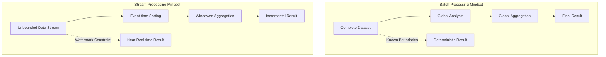
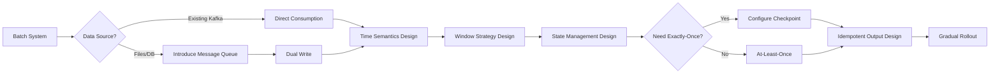
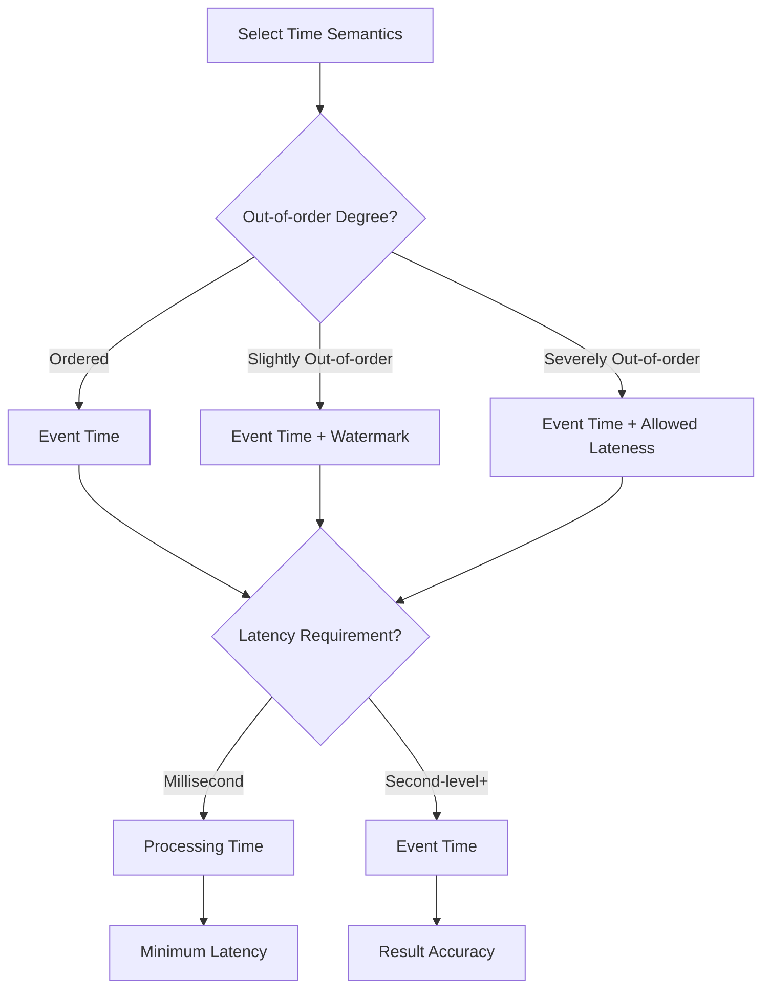

# Batch to Stream Processing Migration Guide

> Stage: Knowledge/05-mapping-guides/migration-guides | Prerequisites: [Flink DataStream API](../../../Flink/03-api/09-language-foundations/flink-datastream-api-complete-guide.md), [Time Semantics](../../../Flink/02-core/time-semantics-and-watermark.md) | Formalization Level: L3

## 1. Definitions

### Def-K-05-05-01: Batch Processing Model

Batch processing follows the **bounded dataset** computing model:

$$
\text{Batch}(T) = \{ e_1, e_2, ..., e_n \}, \quad n < \infty, \forall i, e_i \in T
$$

Key characteristics:

- Data completeness is known
- Global sorting/aggregation is feasible
- Failure restart cost is low
- Latency is on the scale of minutes/hours

### Def-K-05-05-02: Stream Processing Model

Stream processing follows the **unbounded data stream** computing model:

$$
\text{Stream}(T) = \{ e_i \}_{i=0}^{\infty}, \quad t(e_i) \in \mathbb{R}^+
$$

Key characteristics:

- Data arrives infinitely
- Requires time windows to constrain computation
- Continuous operation requires fault tolerance
- Latency is on the scale of milliseconds/seconds

### Def-K-05-05-03: Lambda and Kappa Architecture

**Lambda Architecture** (batch-stream separation):

$$
\text{Query} = f(\text{BatchView}) \bowtie g(\text{RealtimeView})
$$

**Kappa Architecture** (batch-stream unification):

$$
\text{Query} = h(\text{StreamProcessing})
$$

### Def-K-05-05-04: Time Semantics Types

| Time Type | Definition | Batch Equivalent | Stream Processing Application |
|-----------|------------|------------------|-------------------------------|
| Event Time | Data generation time | Timestamp in data itself | Out-of-order processing |
| Ingestion Time | System entry time | Load time | Approximate ordering |
| Processing Time | Processing moment | Current time | Low-latency scenarios |

## 2. Properties

### Prop-K-05-05-01: Batch-Stream Semantic Equivalence Condition

When the following conditions are met, batch processing results and stream processing results are consistent:

$$
\text{BatchResult} = \text{StreamResult} \iff \forall W, \text{StreamWindow}(W) = \text{BatchPartition}(W)
$$

Where $W$ is a time window or data partition.

### Prop-K-05-05-02: State Requirement Derivation

Batch processing is stateless because:

$$
\text{State}_{batch} = \emptyset \quad \because \quad \text{DataComplete} \land \text{RestartFromBeginning}
$$

Stream processing requires state:

$$
\text{State}_{stream} \neq \emptyset \quad \because \quad \text{DataInfinite} \land \text{IncrementalComputation}
$$

### Lemma-K-05-05-01: Windowed Batch Processing Equivalence

Batch processing `GROUP BY` is equivalent to windowed aggregation in stream processing:

$$
\text{SQL: GROUP BY key} \equiv \text{Flink: keyBy(key).window(GlobalWindows)}
$$

## 3. Relations

### 3.1 Mental Model Transformation

| Batch Processing Mindset | Stream Processing Mindset | Implementation |
|--------------------------|---------------------------|----------------|
| Complete dataset | Unbounded data stream | Boundary-less input |
| Global sorting | Event-time sorting | Watermark + Timestamp |
| Global aggregation | Windowed aggregation | Tumbling/Sliding/Session Window |
| Cartesian product | Interval Join | Time-range Join |
| Deduplication (DISTINCT) | Deduplication state | State + TTL |
| Eventual consistency | Incremental consistency | Checkpoint + State |

### 3.2 SQL Semantic Mapping

```sql
-- Batch processing SQL
SELECT
    user_id,
    COUNT(*) as order_count,
    SUM(amount) as total_amount
FROM orders
WHERE order_date >= '2024-01-01'
GROUP BY user_id
ORDER BY total_amount DESC;
```

```java

import org.apache.flink.api.common.functions.AggregateFunction;

// Flink stream processing equivalent implementation
stream.filter(order -> order.getOrderDate().isAfter(LocalDate.of(2024, 1, 1)))
    .keyBy(Order::getUserId)
    .window(TumblingEventTimeWindows.of(Time.days(1)))
    .aggregate(new AggregateFunction<Order, OrderAcc, OrderResult>() {
        @Override
        public OrderAcc createAccumulator() {
            return new OrderAcc();
        }

        @Override
        public OrderAcc add(Order value, OrderAcc accumulator) {
            accumulator.count++;
            accumulator.totalAmount += value.getAmount();
            return accumulator;
        }

        @Override
        public OrderResult getResult(OrderAcc accumulator) {
            return new OrderResult(accumulator.count, accumulator.totalAmount);
        }
    });
```

### 3.3 Batch Processing Operator Mapping

| Batch | Stream | Flink API |
|-------|--------|-----------|
| Map | Map | `.map()` |
| Filter | Filter | `.filter()` |
| FlatMap | FlatMap | `.flatMap()` |
| Reduce | Windowed Reduce | `.window().reduce()` |
| GroupBy | KeyBy + Window | `.keyBy().window()` |
| Sort | Windowed Sort | `.window().process()` |
| Join | Interval Join | `.intervalJoin()` |
| Union | Union | `.union()` |
| Distinct | State + Filter | `.keyBy().process()` |
| Partition | Custom Partition | `.partitionCustom()` |

## 4. Argumentation

### 4.1 Data Completeness Assumption Changes

**Batch Processing Assumptions**:

```
∀ data ∈ dataset, known before processing
Processing can wait for all data to arrive
Failure can recompute from the beginning
```

**Stream Processing Assumptions**:

```
∀ data ∈ stream, arrives at processing time
Cannot wait for "all" data
Requires incremental computation and fault tolerance
```

**Migration Strategy**: Introduce Watermark to handle out-of-order and late data:

```java

import org.apache.flink.api.common.eventtime.WatermarkStrategy;

WatermarkStrategy<Event> strategy = WatermarkStrategy
    .<Event>forBoundedOutOfOrderness(Duration.ofMinutes(5))
    .withTimestampAssigner((event, timestamp) -> event.getEventTime());

stream.assignTimestampsAndWatermarks(strategy);
```

### 4.2 State Management Introduction

**Batch Processing Stateless Design**:

```java
// Batch processing - read complete data each time
List<Data> allData = readAllData();
Map<Key, Result> result = allData.stream()
    .collect(Collectors.groupingBy(Data::getKey, summarizing()));
```

**Stream Processing Stateful Design**:

```java
// Stream processing - incremental state updates

import org.apache.flink.api.common.state.ValueState;

public class StatefulFunction extends KeyedProcessFunction<Key, Data, Result> {
    private ValueState<Result> state;

    @Override
    public void processElement(Data data, Context ctx, Collector<Result> out) {
        Result current = state.value();
        if (current == null) {
            current = new Result();
        }
        current.update(data);
        state.update(current);
        out.collect(current);
    }
}
```

### 4.3 Time Semantics Introduction

**Batch Processing Time Handling**:

```java
// Batch processing - process upon arrival, time is processing time
for (Record record : batchData) {
    process(record);  // use system current time
}
```

**Stream Processing Time Handling**:

```java

import org.apache.flink.streaming.api.windowing.time.Time;

// Stream processing - explicit time semantics
stream.assignTimestampsAndWatermarks(
    WatermarkStrategy.<Record>forBoundedOutOfOrderness(Duration.ofSeconds(10))
        .withTimestampAssigner((record, ts) -> record.getEventTime())
)
.keyBy(Record::getKey)
.window(TumblingEventTimeWindows.of(Time.minutes(1)))
.process(new TimeWindowFunction());
```

## 5. Proof / Engineering Argument

### Thm-K-05-05-01: Semantic Preservation in Batch-to-Stream Migration

**Theorem**: For any batch job $B$, there exists a stream job $S$, such that for all finite input datasets $D_{finite}$:

$$
\text{Result}(B, D_{finite}) = \text{Result}(S, D_{finite} \oplus \text{EOS})
$$

Where $\oplus \text{EOS}$ denotes adding an end-of-stream marker.

**Proof**:

1. **Bounded stream simulation**: Treating a finite dataset as a bounded stream, the stream processing result is consistent with batch processing.

2. **Window semantics**: Global aggregation can achieve batch processing semantics via `GlobalWindows` + triggers.

3. **Time windows**: Time-range partitioned batch processing is equivalent to time-windowed stream processing.

4. **State equivalence**: The in-memory aggregation state of batch processing is equivalent to KeyedState in stream processing.

### Engineering Argument: Migration Risk Assessment

**Low-risk Migration** (direct mapping):

- Row-by-row transformation (Map/Filter/FlatMap)
- Simple aggregation (COUNT/SUM)
- Single-table processing

**Medium-risk Migration** (requires semantic adjustment):

- Multi-table Join (requires time range)
- Global sorting (requires windowing)
- Deduplication (requires state management)

**High-risk Migration** (requires architecture adjustment):

- Iterative computation (requires custom logic)
- Complex graph algorithms
- Large Shuffle operations

## 6. Examples

### 6.1 Simple ETL Migration

**Batch Processing** (Spark):

```scala
// Read, transform, write
val df = spark.read.parquet("input/")
val result = df
    .filter(col("status") === "active")
    .withColumn("processed_time", current_timestamp())
    .select("id", "name", "processed_time")
result.write.parquet("output/")
```

**Stream Processing** (Flink):

```java

import org.apache.flink.streaming.api.datastream.DataStream;

// Source
DataStream<Row> stream = env.fromSource(
    new ParquetSource("input/"),
    WatermarkStrategy.noWatermarks(),
    "Parquet Source"
);

// Transform
DataStream<Row> result = stream
    .filter(row -> "active".equals(row.getField("status")))
    .map(row -> {
        Row newRow = new Row(3);
        newRow.setField(0, row.getField("id"));
        newRow.setField(1, row.getField("name"));
        newRow.setField(2, Instant.now());
        return newRow;
    });

// Sink
result.sinkTo(new ParquetSink("output/"));
```

### 6.2 Aggregation Migration

**Batch Processing SQL**:

```sql
SELECT
    product_id,
    AVG(price) as avg_price,
    MAX(price) as max_price,
    COUNT(*) as count
FROM sales
GROUP BY product_id;
```

**Stream Processing Implementation**:

```java

import org.apache.flink.streaming.api.datastream.DataStream;
import org.apache.flink.api.common.functions.AggregateFunction;
import org.apache.flink.streaming.api.windowing.time.Time;

DataStream<Sale> sales = ...;

DataStream<ProductStats> stats = sales
    .keyBy(Sale::getProductId)
    .window(TumblingEventTimeWindows.of(Time.hours(1)))  // introduce time window
    .aggregate(new AggregateFunction<Sale, Acc, ProductStats>() {
        @Override
        public Acc createAccumulator() {
            return new Acc();
        }

        @Override
        public Acc add(Sale sale, Acc acc) {
            acc.sum += sale.getPrice();
            acc.max = Math.max(acc.max, sale.getPrice());
            acc.count++;
            return acc;
        }

        @Override
        public ProductStats getResult(Acc acc) {
            return new ProductStats(
                acc.sum / acc.count,
                acc.max,
                acc.count
            );
        }
    });
```

### 6.3 Join Operation Migration

**Batch Processing Join**:

```sql
SELECT o.*, c.name as customer_name
FROM orders o
JOIN customers c ON o.customer_id = c.id;
```

**Stream Processing Interval Join**:

```java

import org.apache.flink.streaming.api.datastream.DataStream;
import org.apache.flink.streaming.api.windowing.time.Time;

// Order stream
DataStream<Order> orders = ...;
// Customer stream (assumed as slowly changing dimension)
DataStream<Customer> customers = ...;

// Interval Join (customer info within 5 minutes before/after order event)
DataStream<EnrichedOrder> enrichedOrders = orders
    .keyBy(Order::getCustomerId)
    .intervalJoin(customers.keyBy(Customer::getId))
    .between(Time.minutes(-5), Time.minutes(5))
    .process(new ProcessJoinFunction<Order, Customer, EnrichedOrder>() {
        @Override
        public void processElement(Order order, Customer customer, Context ctx, Collector<EnrichedOrder> out) {
            out.collect(new EnrichedOrder(order, customer));
        }
    });
```

**Stream Processing Broadcast Join (Dimension Table)**:

```java

import org.apache.flink.streaming.api.datastream.DataStream;

// Customer data as broadcast stream (slowly changing)
MapStateDescriptor<String, Customer> descriptor =
    new MapStateDescriptor<>("customers", String.class, Customer.class);
BroadcastStream<Customer> broadcastCustomers = customers.broadcast(descriptor);

// Order stream connects to broadcast stream
DataStream<EnrichedOrder> enriched = orders
    .connect(broadcastCustomers)
    .process(new BroadcastProcessFunction<Order, Customer, EnrichedOrder>() {
        @Override
        public void processElement(Order order, ReadOnlyContext ctx, Collector<EnrichedOrder> out) {
            Customer customer = ctx.getBroadcastState(descriptor).get(order.getCustomerId());
            out.collect(new EnrichedOrder(order, customer));
        }

        @Override
        public void processBroadcastElement(Customer customer, Context ctx, Collector<EnrichedOrder> out) {
            ctx.getBroadcastState(descriptor).put(customer.getId(), customer);
        }
    });
```

### 6.4 Deduplication Migration

**Batch Processing Distinct**:

```sql
SELECT DISTINCT user_id, event_type
FROM events;
```

**Stream Processing Deduplication (State + TTL)**:

```java

import org.apache.flink.api.common.state.ValueState;
import org.apache.flink.api.common.state.ValueStateDescriptor;
import org.apache.flink.api.common.typeinfo.Types;
import org.apache.flink.streaming.api.windowing.time.Time;

public class DeduplicateFunction extends KeyedProcessFunction<String, Event, Event> {
    private ValueState<Boolean> seenState;

    @Override
    public void open(Configuration parameters) {
        ValueStateDescriptor<Boolean> descriptor = new ValueStateDescriptor<>(
            "seen",
            Types.BOOLEAN
        );

        // State TTL: expires after 24 hours
        StateTtlConfig ttlConfig = StateTtlConfig
            .newBuilder(Time.hours(24))
            .setUpdateType(OnCreateAndWrite)
            .setStateVisibility(NeverReturnExpired)
            .build();
        descriptor.enableTimeToLive(ttlConfig);

        seenState = getRuntimeContext().getState(descriptor);
    }

    @Override
    public void processElement(Event event, Context ctx, Collector<Event> out) throws Exception {
        if (seenState.value() == null) {
            seenState.update(true);
            out.collect(event);
        }
        // Duplicate events are dropped
    }
}

// Usage
stream.keyBy(e -> e.getUserId() + "_" + e.getEventType())
    .process(new DeduplicateFunction());
```

### 6.5 Windowed Top-N Migration

**Batch Processing Top-N**:

```sql
SELECT category, product_id, sales_amount
FROM (
    SELECT *,
        ROW_NUMBER() OVER (PARTITION BY category ORDER BY sales_amount DESC) as rank
    FROM product_sales
) t
WHERE rank <= 10;
```

**Stream Processing Implementation**:

```java
// Implement windowed Top-N using ProcessWindowFunction

import org.apache.flink.streaming.api.windowing.time.Time;

public class TopNFunction extends ProcessWindowFunction<
    ProductSale, List<ProductSale>, String, TimeWindow> {

    private int n;

    public TopNFunction(int n) {
        this.n = n;
    }

    @Override
    public void process(String category, Context context, Iterable<ProductSale> elements,
            Collector<List<ProductSale>> out) {

        PriorityQueue<ProductSale> topN = new PriorityQueue<>(
            n,
            Comparator.comparing(ProductSale::getSalesAmount)
        );

        for (ProductSale sale : elements) {
            topN.offer(sale);
            if (topN.size() > n) {
                topN.poll();
            }
        }

        List<ProductSale> result = new ArrayList<>(topN);
        result.sort(Comparator.comparing(ProductSale::getSalesAmount).reversed());
        out.collect(result);
    }
}

// Usage
stream.keyBy(ProductSale::getCategory)
    .window(TumblingEventTimeWindows.of(Time.hours(1)))
    .process(new TopNFunction(10));
```

## 7. Visualizations

### 7.1 Batch vs Stream Mindset Comparison



### 7.2 Migration Roadmap



### 7.3 Time Semantics Decision Tree



### 7.4 Lambda vs Kappa Architecture

```mermaid
graph TB
    subgraph "Lambda Architecture"
        L1[Data Source] --> L2[Batch Layer]
        L1 --> L3[Speed Layer]
        L2 --> L4[Batch View]
        L3 --> L5[Real-time View]
        L4 --> L6[Serving Layer]
        L5 --> L6
        L6 --> L7[Query Result]
    end

    subgraph "Kappa Architecture"
        K1[Data Source] --> K2[Message Queue]
        K2 --> K3[Stream Processing Layer]
        K3 --> K4[Unified View]
        K4 --> K5[Query Result]
    end

    subgraph "Flink Unification"
        F1[Data Source] --> F2[Flink Stream Processing]
        F2 -->|Batch Mode| F3[Historical Data]
        F2 -->|Stream Mode| F4[Real-time Data]
        F3 --> F5[Unified Result]
        F4 --> F5
    end
```



## 8. FAQ

### Q1: How to handle global sorting in batch processing?

**A**: In stream processing, window constraints must be used:

```java

import org.apache.flink.streaming.api.windowing.time.Time;

// Batch global sorting -> Stream windowed sorting
stream.keyBy(...)  // partition key
    .window(TumblingEventTimeWindows.of(Time.hours(1)))
    .process(new SortWindowFunction());  // sort within window
```

### Q2: How does stream processing guarantee the same result accuracy as batch processing?

**A**: Three layers of guarantee:

1. **Watermark Strategy**: Handle out-of-order data
2. **Allowed Lateness**: Handle late data
3. **Side Output**: Handle timed-out data

```java

import org.apache.flink.streaming.api.windowing.time.Time;

OutputTag<Event> lateDataTag = new OutputTag<Event>("late-data"){};

stream.assignTimestampsAndWatermarks(
    WatermarkStrategy.<Event>forBoundedOutOfOrderness(Duration.ofMinutes(5))
        .withIdleness(Duration.ofMinutes(10))
)
.keyBy(Event::getKey)
.window(TumblingEventTimeWindows.of(Time.hours(1)))
.allowedLateness(Time.minutes(30))  // allow 30 minutes lateness
.sideOutputLateData(lateDataTag)
.aggregate(...);
```

### Q3: How to migrate large-table Join in batch processing?

**A**: Three strategies:

1. **Interval Join**: Join within time range
2. **Broadcast Join**: Broadcast small table
3. **Async I/O + Cache**: Asynchronously query external storage

```java
// Async I/O solution
AsyncDataStream.unorderedWait(
    stream,
    new AsyncFunction<Event, EnrichedEvent>() {
        @Override
        public void asyncInvoke(Event event, ResultFuture<EnrichedEvent> resultFuture) {
            // Asynchronously query external storage (Redis/HBase)
            redisAsyncClient.get(event.getKey())
                .thenAccept(result -> resultFuture.complete(
                    Collections.singletonList(new EnrichedEvent(event, result))
                ));
        }
    },
    1000,  // timeout
    TimeUnit.MILLISECONDS,
    100    // concurrency
);
```

### Q4: How to evaluate stream processing resource requirements?

**A**: Considerations:

```
Resource Requirements = Peak Throughput × State Size × Checkpoint Frequency × Fault Tolerance SLA

Typical Configuration:
- Memory: State Size × 2 + JVM Overhead
- Checkpoint Interval: Max Tolerable Latency / 2
- Parallelism: Peak Throughput / Single Parallelism Processing Capacity
```

## 9. Performance Comparison and Expectations

| Metric | Batch Processing | Stream Processing | Notes |
|--------|------------------|-------------------|-------|
| Latency | Minutes/Hours | Milliseconds/Seconds | Stream processing real-time advantage |
| Throughput | High | High | Comparable |
| Resource Utilization | Bursty | Steady | Stream processing consumes continuously |
| State Storage | None | Yes | Stream processing needs state backend |
| Failure Recovery | Re-run | Checkpoint Recovery | Stream processing faster |
| Result Consistency | Eventual | Incremental | Requires Watermark alignment |

## 10. References
