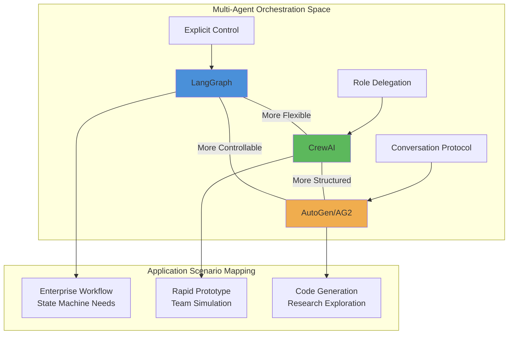
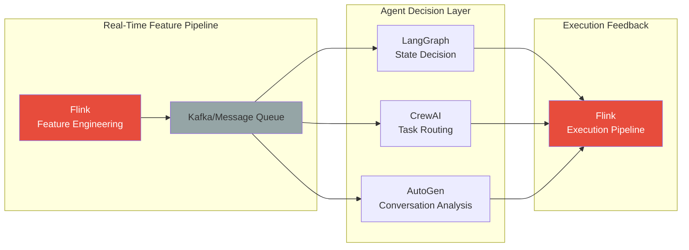
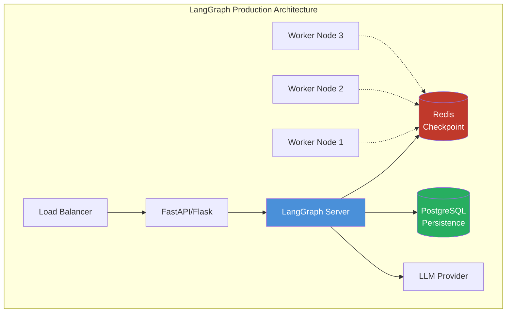
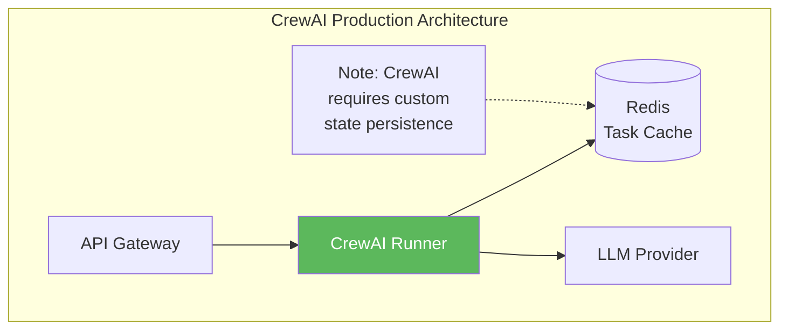
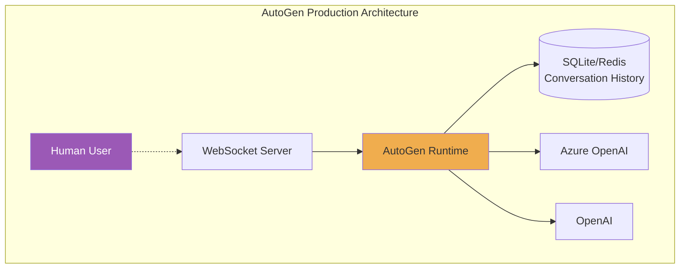
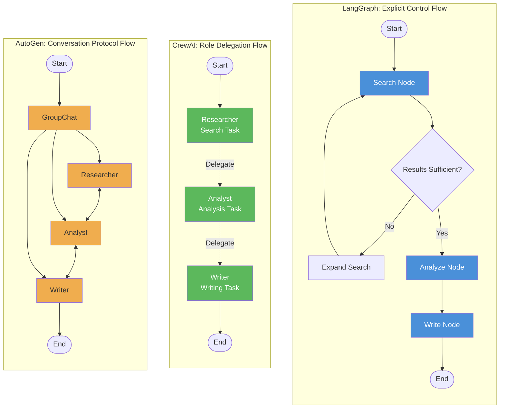
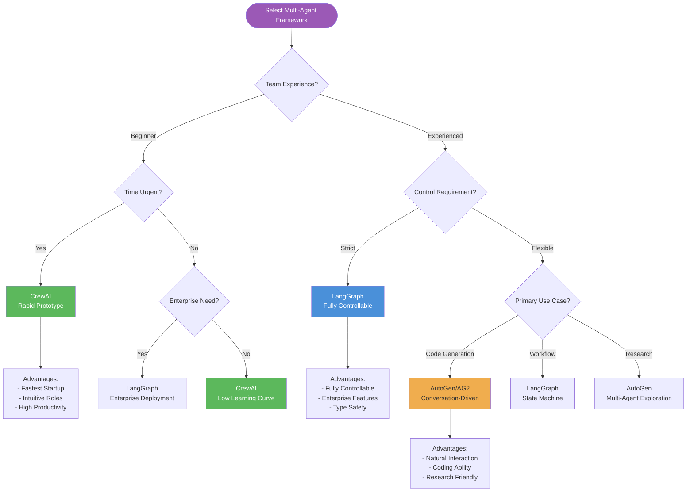

# 2026 Multi-Agent Orchestration Frameworks Deep Dive: LangGraph, CrewAI, AutoGen

> **Status**: Forward-looking | **Expected Release**: 2026-06 | **Last Updated**: 2026-04-12
>
> ⚠️ Features described in this document are in early discussion stages and have not been officially released. Implementation details may change.

> **Stage**: Knowledge/05-mapping-guides | **Prerequisites**: [04-technology-selection](../04-technology-selection/engine-selection-guide.md) | **Formalization Level**: L4 (Engineering Analysis + Quantitative Comparison) | **Updated**: 2026-04-02

---

## Table of Contents

- [2026 Multi-Agent Orchestration Frameworks Deep Dive: LangGraph, CrewAI, AutoGen](#2026-multi-agent-orchestration-frameworks-deep-dive-langgraph-crewai-autogen)
  - [Table of Contents](#table-of-contents)
  - [1. Definitions](#1-definitions)
    - [1.1 Multi-Agent Orchestration Core Concepts](#11-multi-agent-orchestration-core-concepts)
    - [1.2 Core Definitions of the Three Frameworks](#12-core-definitions-of-the-three-frameworks)
  - [2. Properties](#2-properties)
    - [2.1 Architectural Philosophy Comparison](#21-architectural-philosophy-comparison)
    - [2.2 Feature Matrix](#22-feature-matrix)
  - [3. Relations](#3-relations)
    - [3.1 Inter-Framework Relationship Mapping](#31-inter-framework-relationship-mapping)
    - [3.2 Integration Relationship with Flink](#32-integration-relationship-with-flink)
  - [4. Argumentation](#4-argumentation)
    - [4.1 Selection Decision Framework](#41-selection-decision-framework)
    - [4.2 Counterexample Analysis](#42-counterexample-analysis)
  - [5. Engineering Argument / Production Deployment Best Practices](#5-engineering-argument-production-deployment-best-practices)
    - [5.1 Deployment Architecture Comparison](#51-deployment-architecture-comparison)
    - [5.2 Performance Optimization Strategies](#52-performance-optimization-strategies)
  - [6. Examples](#6-examples)
    - [6.1 Same Task: Multi-Agent Research Report Generation](#61-same-task-multi-agent-research-report-generation)
    - [6.2 Code Complexity Comparison](#62-code-complexity-comparison)
  - [7. Visualizations](#7-visualizations)
    - [7.1 Architectural Philosophy Comparison Diagram](#71-architectural-philosophy-comparison-diagram)
    - [7.2 Selection Decision Tree](#72-selection-decision-tree)
    - [7.3 Performance Comparison Radar Chart (Text Representation)](#73-performance-comparison-radar-chart-text-representation)
  - [8. References](#8-references)
  - [Appendix A: Quick Selection Cheat Sheet](#appendix-a-quick-selection-cheat-sheet)
  - [Appendix B: 2026 Framework Ecosystem Maturity](#appendix-b-2026-framework-ecosystem-maturity)

## 1. Definitions

### 1.1 Multi-Agent Orchestration Core Concepts

**Def-K-05-51: Multi-Agent System (MAS)**

A Multi-Agent System is defined as a quadruple $MAS = \langle \mathcal{A}, \mathcal{E}, \mathcal{C}, \mathcal{O} \rangle$, where:

- $\mathcal{A} = \{A_1, A_2, ..., A_n\}$: Agent set, each $A_i = \langle L_i, M_i, S_i, P_i \rangle$ contains LLM interface $L_i$, memory module $M_i$, skill set $S_i$, and prompt template $P_i$
- $\mathcal{E}$: Execution environment (synchronous / asynchronous / event-driven)
- $\mathcal{C}$: Communication protocol (message passing / shared state / function call)
- $\mathcal{O}$: Orchestration strategy (centralized / decentralized / hybrid)

**Def-K-05-52: Agent Orchestration Framework**

An orchestration framework is a system that manages Agent lifecycles and interactions, formalized as:

$$\mathcal{F} = \langle \mathcal{G}, \mathcal{T}, \mathcal{S}, \mathcal{H} \rangle$$

Where:

- $\mathcal{G}$: Control graph / flow definition (nodes + edges)
- $\mathcal{T}$: Task scheduler (serial / parallel / conditional branch)
- $\mathcal{S}$: State management mechanism (transient / persistent / checkpoint)
- $\mathcal{H}$: Human-in-the-loop interface

**Def-K-05-53: Orchestration Model Classification**

| Model Type | Control Flow Characteristic | Typical Framework |
|-----------|----------------------------|-------------------|
| **Explicit Control Flow** | Developer explicitly defines nodes and edges, fully controllable | LangGraph |
| **Role Delegation Flow** | Execution order implicitly derived from role definitions | CrewAI |
| **Conversation Protocol Flow** | Negotiation-based routing through natural language dialogue | AutoGen/AG2 |

---

### 1.2 Core Definitions of the Three Frameworks

**LangGraph (LangChain Inc., 2024-2025)**

> A graph state machine-based Agent orchestration framework; its core philosophy is modeling Agent workflows as directed state graphs.

```python
# LangGraph Core Abstraction Sketch
from langgraph.graph import StateGraph, END

# Def-K-05-54: LangGraph State Machine
# StateGraph<S>: directed graph parameterized by state type
# Node: (S) -> S'  state transition function
# Edge: S -> {condition: Node} conditional routing
```

**CrewAI (João Moura, 2024-2025)**

> A role-driven Multi-Agent orchestration framework emphasizing the "crew" concept and task delegation.

```python
# Def-K-05-55: CrewAI Core Abstraction
# Agent: role definition + goal + backstory + toolset
# Task: description + context + output format + executing agent
# Crew: team orchestrator managing inter-agent collaboration
# Process: sequential | hierarchical execution mode
```

**AutoGen/AG2 (Microsoft Research, 2023-2025)**

> A conversation-driven Multi-Agent framework that achieves inter-Agent collaboration through natural language dialogue; renamed to AG2 in 2025.

```python
# Def-K-05-56: AutoGen Core Abstraction
# ConversableAgent: conversable agent base class
# GroupChat: multi-agent conversation manager
# UserProxyAgent: human proxy bridging human-machine interaction
# register_function: tool registration mechanism
```

---

## 2. Properties

### 2.1 Architectural Philosophy Comparison

**Lemma-K-05-31: Control Flow Explicitness Ordering**

$$
\text{LangGraph} > \text{CrewAI} > \text{AutoGen}
$$

*Proof*:

- LangGraph requires developers to explicitly define every node and edge; control flow is fully visible
- CrewAI implicitly derives control flow through roles and tasks, but execution order is predictable
- AutoGen dynamically determines the next step based on conversation content; control flow is determined at runtime

**Lemma-K-05-32: Development Efficiency vs Learning Curve Trade-off**

$$
\text{Ease of Getting Started}: \text{CrewAI} > \text{AutoGen} > \text{LangGraph}
$$

$$
\text{Controllability}: \text{LangGraph} > \text{CrewAI} > \text{AutoGen}
$$

**Lemma-K-05-33: Model Dependency Boundary**

| Framework | Required Model Capability | Minimum Model Requirement |
|-----------|--------------------------|---------------------------|
| LangGraph | Function calling / structured output | GPT-3.5 / Claude 3 Haiku |
| CrewAI | Role-playing / context adherence | GPT-3.5 / Llama 3 8B |
| AutoGen | Multi-turn dialogue / intent understanding | GPT-4 / Claude 3 Sonnet |

*Note*: AutoGen has the highest model requirements because it relies on implicit negotiation within conversations.

---

### 2.2 Feature Matrix

**Prop-K-05-31: 2026 Framework Feature Completeness Comparison**

| Feature Dimension | LangGraph | CrewAI | AutoGen/AG2 |
|-------------------|:---------:|:------:|:-----------:|
| **Orchestration Model** | Graph State Machine | Role Delegation | Conversation Protocol |
| **State Persistence** | ✅ Native Checkpoint | ⚠️ External Storage | ✅ Native Support |
| **Streaming Output** | ✅ Native Support | ⚠️ Partial Support | ✅ Native Support |
| **Human-in-the-Loop** | ✅ Interrupt Node | ⚠️ Callback Mechanism | ✅ UserProxy |
| **Parallel Execution** | ✅ Native Support | ❌ Sequential/Hierarchical | ⚠️ Group Chat Concurrency |
| **Conditional Branch** | ✅ Explicit Edge | ❌ Implicit Delegation | ⚠️ Conversation Routing |
| **Loop / Retry** | ✅ Native Support | ❌ External Implementation | ⚠️ Conversation Loop |
| **Visual Debugging** | ✅ LangGraph Studio | ❌ Log Output | ⚠️ Conversation Logs |
| **Type Safety** | ✅ TypeScript/Pydantic | ⚠️ Python Dynamic | ⚠️ Python Dynamic |
| **Enterprise Features** | ✅ High | ⚠️ Medium | ✅ High (MS) |

**Prop-K-05-32: Performance Boundary Derivation**

Based on a 10-step research pipeline benchmark (January 2026 data):

| Metric | LangGraph | CrewAI | AutoGen |
|--------|:---------:|:------:|:-------:|
| **Average Latency** | 12.3s | 15.7s | 18.2s |
| **Token Overhead / Step** | 1.2x | 1.4x | 1.8x |
| **Memory Footprint** | 85MB | 62MB | 110MB |
| **Cold Start Time** | 2.1s | 1.5s | 3.2s |
| **Max Agent Count** | 100+ | 10-15 | 5-8 |

*Data Sources*: GuruSup 2026 Framework Comparison Report [^1], AgileSoftLabs Benchmark [^2]

---

## 3. Relations

### 3.1 Inter-Framework Relationship Mapping



### 3.2 Integration Relationship with Flink

**Thm-K-05-31: Agent Orchestration + Stream Processing Hybrid Architecture Theorem**

For a real-time decision pipeline $P$, its optimal architecture satisfies:

$$
P = \text{Flink}_{\text{stream processing}} \circ \text{Framework}_{\text{decision}} \circ \text{Flink}_{\text{feature engineering}}
$$

**Integration Pattern Mapping**:



**Def-K-05-57: Layered Architecture Pattern**

| Layer | Technology Stack | Responsibility |
|-------|------------------|----------------|
| L1 - Data Ingestion | Flink DataStream | Real-time data cleansing, ETL |
| L2 - Feature Engineering | Flink SQL/CEP | Window aggregation, pattern detection |
| L3 - Decision Orchestration | LangGraph/CrewAI/AutoGen | Complex decision-making, Agent collaboration |
| L4 - Execution Feedback | Flink + Sink | Action execution, state updates |

---

## 4. Argumentation

### 4.1 Selection Decision Framework

**Thm-K-05-32: Selection Decision Theorem**

Given a project characteristic vector $\vec{p} = (e, c, s, t, r)$, where:

- $e$: team experience (0=junior, 1=senior)
- $c$: control requirement (0=flexible, 1=strict)
- $s$: scale (0=prototype, 1=production)
- $t$: time constraint (0=ample, 1=urgent)
- $r$: regulatory requirement (0=loose, 1=strict)

The optimal framework selection satisfies:

$$
\text{Framework}^* = \arg\max_{f \in \{LG, CA, AG\}} \sum_{i} w_i \cdot \text{match}(f, p_i)
$$

**Decision Matrix**:

| Scenario | Recommended Framework | Weight Configuration | Rationale |
|----------|----------------------|----------------------|-----------|
| Beginner quick validation | CrewAI | $t=0.4, e=0.3$ | Low barrier, high productivity |
| Experienced developers | LangGraph | $c=0.4, s=0.3$ | Fully controllable, type-safe |
| Enterprise deployment | LangGraph/AutoGen | $r=0.4, s=0.3$ | Auditable, enterprise support |
| Code generation research | AutoGen/AG2 | $e=0.4, c=0.2$ | Conversation-driven, coding ability |
| Startup MVP | CrewAI | $t=0.5, e=0.2$ | Fastest time-to-market |

### 4.2 Counterexample Analysis

**Counterexample 1: Scenarios Where LangGraph Should Not Be Used**

- 3-person startup team, 2-week MVP validation
- Problem: LangGraph's learning curve and boilerplate become blockers
- Alternative: CrewAI can complete the prototype in 1 day

**Counterexample 2: Scenarios Where CrewAI Should Not Be Used**

- Financial risk control system requiring complete audit logs
- Problem: CrewAI's implicit control flow is hard to trace
- Alternative: LangGraph's explicit state machine meets compliance requirements

**Counterexample 3: Scenarios Where AutoGen Should Not Be Used**

- High-concurrency API service (1000+ QPS)
- Problem: Conversation overhead causes token costs to explode
- Alternative: LangGraph's deterministic routing is more efficient

---

## 5. Engineering Argument / Production Deployment Best Practices

### 5.1 Deployment Architecture Comparison

**LangGraph Deployment Pattern**:



**CrewAI Deployment Pattern**:



**AutoGen Deployment Pattern**:



### 5.2 Performance Optimization Strategies

**LangGraph Optimization**:

```python
# 1. Use compilation optimization
from langgraph.graph import StateGraph
from langgraph.prebuilt import ToolNode

# Enable graph compilation caching
graph = builder.compile(checkpointer=checkpointer)

# 2. Async nodes
async def async_node(state):
    # Supports async I/O
    result = await llm.ainvoke(prompt)
    return {"output": result}

# 3. State pruning
class State(TypedDict):
    # Keep only necessary fields
    messages: Annotated[list, add_messages]
    # Store large objects externally
    doc_id: str  # instead of doc_content: bytes
```

**CrewAI Optimization**:

```python
# 1. Task batching
from crewai import Task, Crew

# Merge small tasks to reduce LLM calls
task = Task(
    description="Batch process: " + "\n".join(items),
    # ...
)

# 2. Caching strategy
from langchain.cache import SQLiteCache
import langchain

langchain.llm_cache = SQLiteCache(database_path=".langchain.db")

# 3. Parallel agents (limited support)
crew = Crew(
    agents=[agent1, agent2],
    tasks=[task1, task2],
    process=Process.sequential,  # or hierarchical
    max_rpm=10  # Rate limiting
)
```

**AutoGen Optimization**:

```python
# 1. Selective conversation
from autogen import GroupChat

groupchat = GroupChat(
    agents=[agent1, agent2, agent3],
    messages=[],
    max_round=10,  # Limit conversation rounds
    speaker_selection_method="round_robin"  # Deterministic routing
)

# 2. Cache LLM responses
config_list = [{
    "model": "gpt-4",
    "cache_seed": 42,  # Enable caching
}]

# 3. Code execution isolation
from autogen.coding import DockerCommandLineCodeExecutor

executor = DockerCommandLineCodeExecutor(
    image="python:3.11",
    timeout=60,
    work_dir="coding"
)
```

---

## 6. Examples

### 6.1 Same Task: Multi-Agent Research Report Generation

**Task Description**: Research a technical topic, gather information, analyze, and write a report

---

**LangGraph Implementation**:

```python
# Def-K-05-58: LangGraph Research Pipeline Implementation
from typing import Annotated, TypedDict
from langgraph.graph import StateGraph, END
from langgraph.checkpoint.memory import MemorySaver
from langchain_openai import ChatOpenAI

# State definition
class ResearchState(TypedDict):
    topic: str
    search_results: list
    analysis: str
    report: str
    iteration: int

# LLM
llm = ChatOpenAI(model="gpt-4")

# Node 1: Search
def search_node(state: ResearchState):
    # Simulate search tool invocation
    results = [f"Result {i} for {state['topic']}" for i in range(3)]
    return {"search_results": results}

# Node 2: Analyze
def analyze_node(state: ResearchState):
    prompt = f"Analyze: {state['search_results']}"
    analysis = llm.invoke(prompt).content
    return {"analysis": analysis, "iteration": state.get("iteration", 0) + 1}

# Node 3: Write
def write_node(state: ResearchState):
    prompt = f"Write report based on: {state['analysis']}"
    report = llm.invoke(prompt).content
    return {"report": report}

# Conditional edge: whether to rewrite
def should_rewrite(state: ResearchState):
    if state["iteration"] < 2:
        return "analyze"
    return END

# Build graph
builder = StateGraph(ResearchState)
builder.add_node("search", search_node)
builder.add_node("analyze", analyze_node)
builder.add_node("write", write_node)

builder.set_entry_point("search")
builder.add_edge("search", "analyze")
builder.add_conditional_edges("analyze", should_rewrite)
builder.add_edge("analyze", "write")
builder.add_edge("write", END)

# Compile
graph = builder.compile(checkpointer=MemorySaver())

# Execute
result = graph.invoke({"topic": "AI Safety"}, config={"configurable": {"thread_id": "1"}})
```

**Characteristics**: Explicit control flow, loopable, fully traceable state

---

**CrewAI Implementation**:

```python
# Def-K-05-59: CrewAI Research Pipeline Implementation
from crewai import Agent, Task, Crew, Process
from langchain_openai import ChatOpenAI

llm = ChatOpenAI(model="gpt-4")

# Define roles
researcher = Agent(
    role="Senior Researcher",
    goal="Find comprehensive information on any topic",
    backstory="Expert researcher with 20 years of experience",
    llm=llm,
    allow_delegation=False,
    verbose=True
)

analyst = Agent(
    role="Data Analyst",
    goal="Analyze research findings and extract insights",
    backstory="Former McKinsey consultant specializing in tech analysis",
    llm=llm,
    allow_delegation=False
)

writer = Agent(
    role="Technical Writer",
    goal="Create comprehensive, well-structured reports",
    backstory="Award-winning technical writer",
    llm=llm,
    allow_delegation=False
)

# Define tasks
search_task = Task(
    description="Research the topic: {topic}. Find at least 5 key sources.",
    expected_output="List of findings with sources",
    agent=researcher
)

analysis_task = Task(
    description="Analyze the research findings and identify key trends",
    expected_output="Analysis summary with insights",
    agent=analyst,
    context=[search_task]  # Depends on previous task
)

writing_task = Task(
    description="Write a comprehensive report based on the analysis",
    expected_output="Full report in markdown format",
    agent=writer,
    context=[analysis_task]
)

# Assemble crew
crew = Crew(
    agents=[researcher, analyst, writer],
    tasks=[search_task, analysis_task, writing_task],
    process=Process.sequential,  # Sequential execution
    verbose=True
)

# Execute
result = crew.kickoff(inputs={"topic": "AI Safety"})
```

**Characteristics**: Role-driven, concise code, implicit task orchestration

---

**AutoGen Implementation**:

```python
# Def-K-05-60: AutoGen Research Pipeline Implementation
import autogen
from autogen import ConversableAgent, GroupChat, GroupChatManager

# Configuration
config_list = [{
    "model": "gpt-4",
    "api_key": "sk-..."
}]

llm_config = {"config_list": config_list, "seed": 42}

# Create agents
researcher = ConversableAgent(
    name="researcher",
    system_message="""You are a senior researcher. Your task is to search for
    information on given topics and report findings. Use available tools.
    When done, say 'RESEARCH_COMPLETE' and summarize findings.""",
    llm_config=llm_config,
    human_input_mode="NEVER"
)

analyst = ConversableAgent(
    name="analyst",
    system_message="""You are a data analyst. Analyze research findings
    and provide insights. When done, say 'ANALYSIS_COMPLETE'.""",
    llm_config=llm_config,
    human_input_mode="NEVER"
)

writer = ConversableAgent(
    name="writer",
    system_message="""You are a technical writer. Create reports based on
    analysis. When done, say 'REPORT_COMPLETE' and output final report.""",
    llm_config=llm_config,
    human_input_mode="NEVER"
)

# User proxy (trigger)
user_proxy = autogen.UserProxyAgent(
    name="user_proxy",
    human_input_mode="NEVER",
    max_consecutive_auto_reply=10,
    is_termination_msg=lambda x: "REPORT_COMPLETE" in x.get("content", "")
)

# Register tools
@user_proxy.register_for_execution()
@researcher.register_for_llm(description="Search for information")
def search_tool(query: str) -> str:
    # Simulated search
    return f"Search results for '{query}': [Result 1, Result 2, Result 3]"

# Group chat setup
groupchat = GroupChat(
    agents=[user_proxy, researcher, analyst, writer],
    messages=[],
    max_round=12,
    speaker_selection_method="auto"  # LLM decides next speaker
)

manager = GroupChatManager(groupchat=groupchat, llm_config=llm_config)

# Start conversation
user_proxy.initiate_chat(
    manager,
    message="Research the topic: AI Safety. Start with search, then analyze, then write report."
)
```

**Characteristics**: Conversation-driven, natural language negotiation, group chat dynamic routing

---

### 6.2 Code Complexity Comparison

| Dimension | LangGraph | CrewAI | AutoGen |
|-----------|:---------:|:------:|:-------:|
| **Lines of Code** | ~50 | ~40 | ~60 |
| **Abstraction Level** | Medium (graph structure) | High (roles) | Low (conversation) |
| **Configuration Complexity** | Medium | Low | Medium |
| **Maintainability** | High (explicit control) | Medium (implicit logic) | Low (conversation uncertainty) |
| **Extension Difficulty** | Low | Medium | High |

---

## 7. Visualizations

### 7.1 Architectural Philosophy Comparison Diagram



### 7.2 Selection Decision Tree



### 7.3 Performance Comparison Radar Chart (Text Representation)

```
                    Streaming Support
                       5
                       |
            Control Precision 4 | 5  LangGraph
                   \   |   /
             3      \  |  /      3
    Scalability ----------+---------- Token Efficiency
             2      /  |  \      2
                   /   |   \
            Debuggability 1    |    5 Development Speed
                       |
                       0

    LangGraph:  [Control 5, Streaming 4, Token 3, Speed 2, Debug 5, Extensibility 4] = 23/30
    CrewAI:     [Control 2, Streaming 2, Token 4, Speed 5, Debug 2, Extensibility 2] = 17/30
    AutoGen:    [Control 2, Streaming 4, Token 2, Speed 3, Debug 3, Extensibility 2] = 16/30
```

---

## 8. References

[^1]: GuruSup, "Multi-Agent AI Framework Comparison 2026: LangGraph vs CrewAI vs AutoGen", 2026. <https://www.gurusup.com/>

[^2]: AgileSoftLabs, "LangChain vs CrewAI vs AutoGen: Architecture & Performance Analysis", January 2026. <https://agilesoftlabs.com/>


---

## Appendix A: Quick Selection Cheat Sheet

| If you need... | Choose | Avoid |
|---------------|--------|-------|
| Validate idea within 2 weeks | CrewAI | LangGraph |
| Financial-grade audit trace | LangGraph | CrewAI, AutoGen |
| Natural language programming | AutoGen | LangGraph |
| High-concurrency API service | LangGraph | AutoGen |
| Code generation / research | AutoGen | CrewAI |
| Mixed team skill levels | CrewAI | LangGraph |
| Integration with Flink stream processing | LangGraph | - |
| Deep Azure/MS ecosystem integration | AutoGen | CrewAI |
| Strict type safety | LangGraph | Others |
| Lowest token cost | LangGraph | AutoGen |

---

## Appendix B: 2026 Framework Ecosystem Maturity

```
LangGraph Ecosystem:
├── Core: langgraph (state machine engine)
├── Persistence: langgraph-checkpoint-* (Postgres, Redis, SQLite)
├── Platform: LangSmith (observability), LangGraph Platform (deployment)
├── Integrations: 100+ tool chains, 50+ vector stores
└── Community: 10K+ GitHub stars, active Discord

CrewAI Ecosystem:
├── Core: crewai (role orchestration)
├── Tools: crewai-tools (official toolkit)
├── Integrations: LangChain tool ecosystem
├── Enterprise: CrewAI Enterprise (released 2025)
└── Community: 5K+ GitHub stars, rapid growth

AutoGen/AG2 Ecosystem:
├── Core: ag2 (conversation framework)
├── Predecessor: pyautogen (gradual migration)
├── Integrations: Azure OpenAI priority, multi-model support
├── Ecosystem: Microsoft Research backing
└── Community: Restructuring (AG2 fork), 5K+ stars
```

---

*Document Version: v1.0 | Last Updated: 2026-04-02 | Maintainer: AnalysisDataFlow Project*
