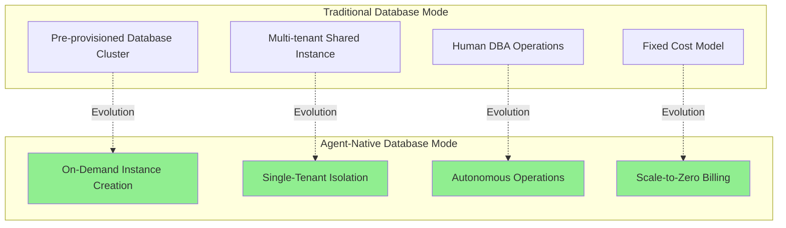
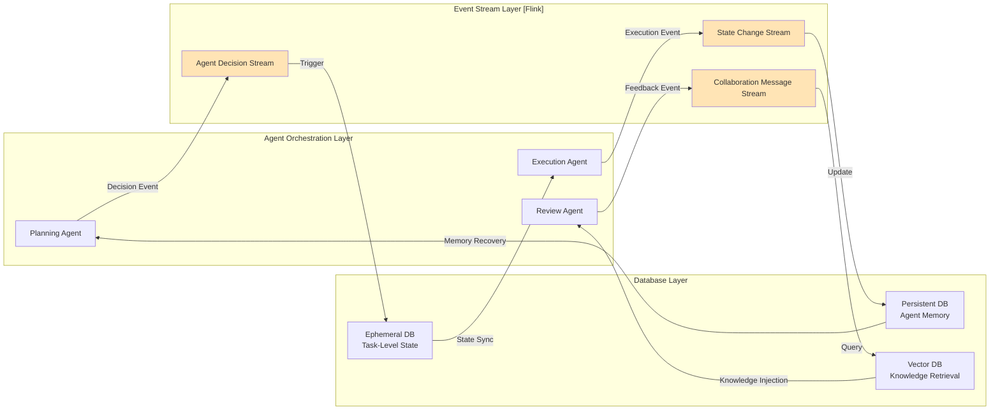
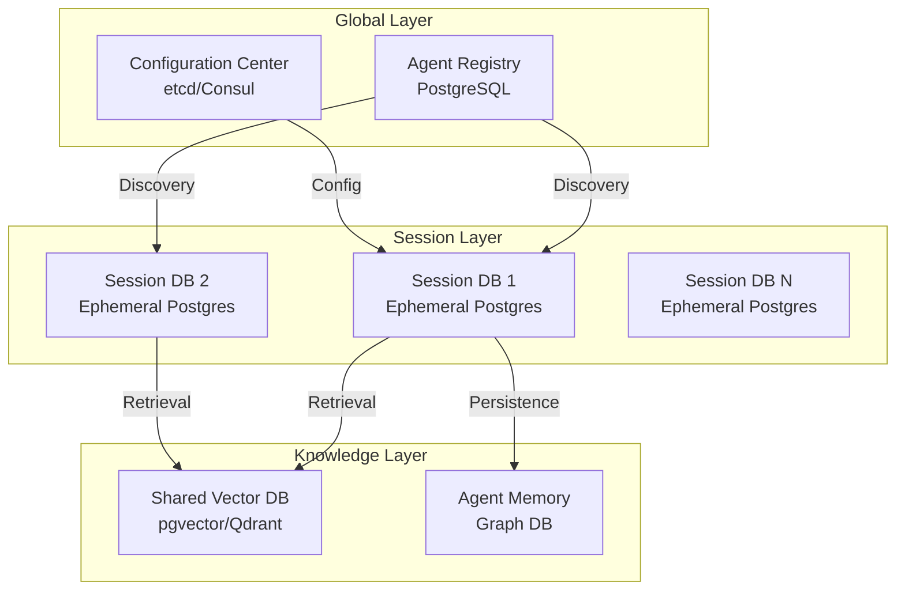
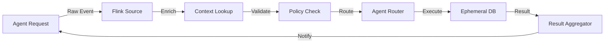
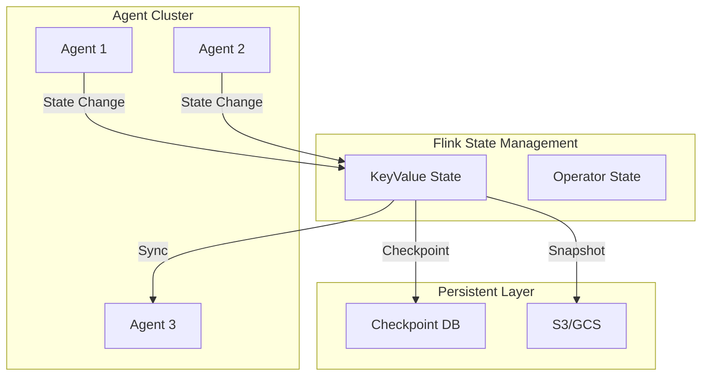
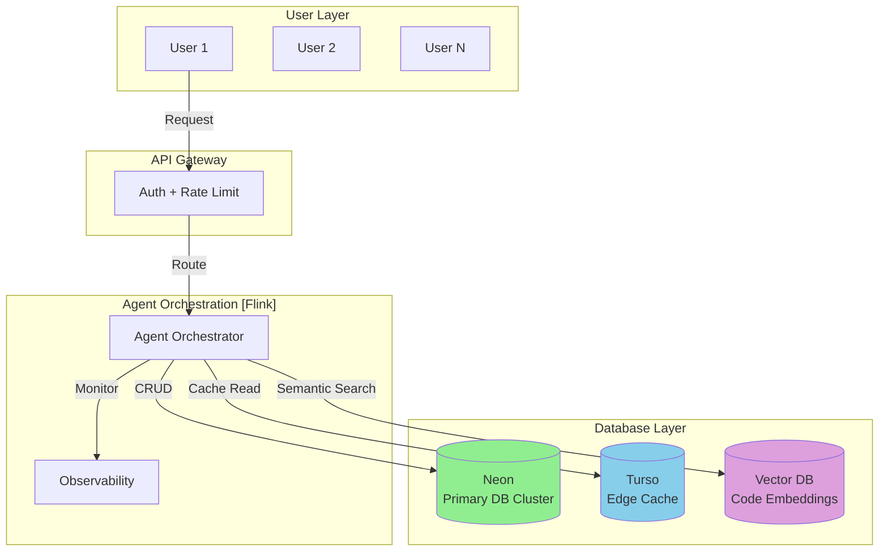
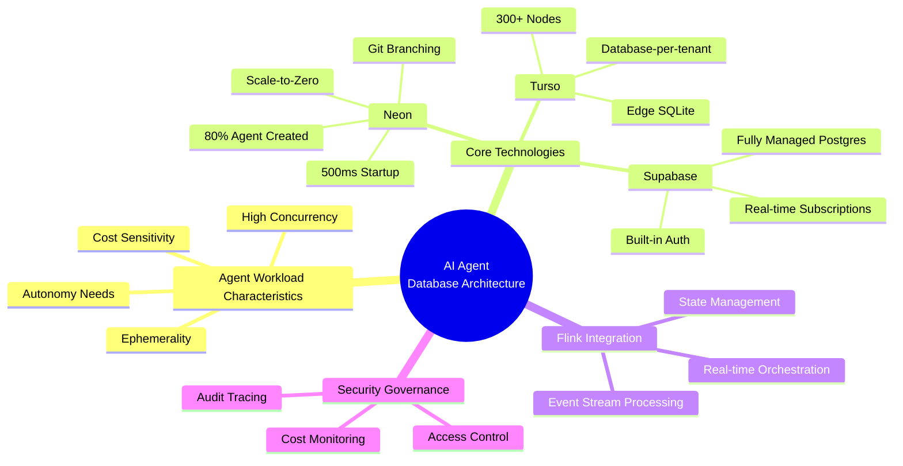
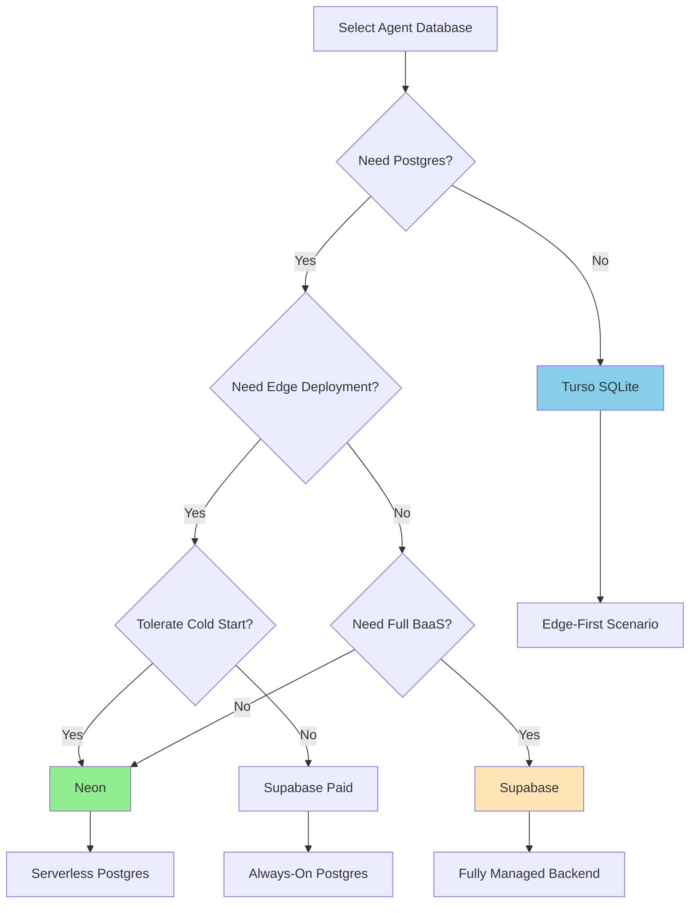
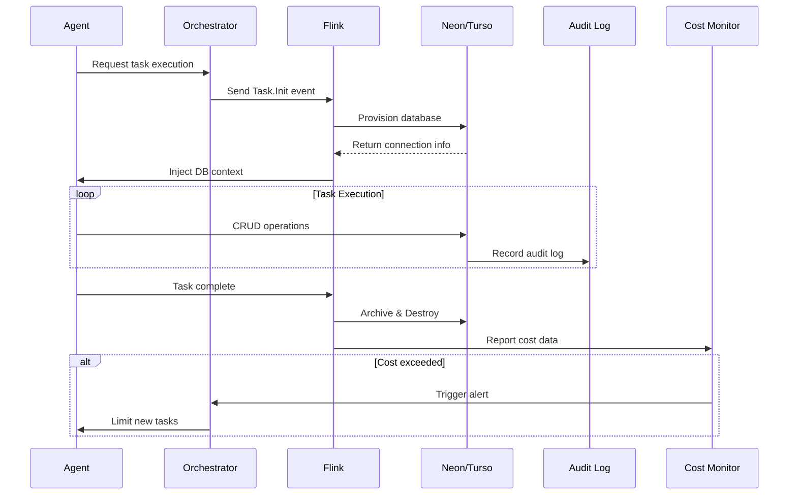

# AI Agent Database Workloads: Frontier Architecture Analysis

> **Status**: Forward-looking | **Estimated Release**: 2026-06 | **Last Updated**: 2026-04-12
>
> ⚠️ The features described in this document are in early discussion stages and have not been officially released. Implementation details may change.

> **Stage**: Knowledge/06-frontier | **Prerequisites**: [04-technology-selection/database-selection-guide.md](../04-technology-selection/storage-selection-guide.md), [Flink/03-flink-state-management.md](../../Flink/02-core/checkpoint-mechanism-deep-dive.md) | **Formalization Level**: L3-L4

---

## 1. Definitions

### Def-K-06-50: Agent-Native Database

**Definition**: An Agent-Native Database is a database system specifically designed for AI Agent workloads, satisfying the following core characteristics:

$$
\text{Agent-Native DB} \triangleq \langle D, O, P, C \rangle
$$

Where:

- $D$: Set of database instances supporting instantaneous creation and destruction
- $O$: Set of operation primitives, including declarative APIs and event-driven interfaces
- $P$: Performance constraints, including provisioning latency $T_{provision} < 1s$ and scaling response time $T_{scale} < 5s$
- $C$: Cost model, supporting scale-to-zero and pay-per-use

### Def-K-06-51: Ephemeral Database Pattern

**Definition**: The Ephemeral Database Pattern is a database usage pattern whose lifecycle is bound to a single Agent task:

$$
\text{Lifecycle}(DB_{ephemeral}) \subseteq \text{Lifecycle}(Task_{agent})
$$

**Characteristics**:

1. **On-Demand Creation**: Automatically provisioned when the Agent task starts
2. **Auto-Destruction**: Automatically releases resources after task completion
3. **State Isolation**: Each task has an independent database context
4. **Zero Cost**: Cost approaches zero when no active tasks exist

### Def-K-06-52: Self-Driving Database Capability

**Definition**: Self-Driving Database Capability is the set of abilities for a database system to autonomously manage its lifecycle and resource configuration:

$$
\mathcal{SD} = \{ \text{AutoProvision}, \text{AutoScale}, \text{AutoOptimize}, \text{AutoHeal}, \text{AutoSecure} \}
$$

| Capability | Description | Agent Scenario Requirement |
|------------|-------------|----------------------------|
| AutoProvision | Automatically create database instances | Instantaneous response to Agent requests |
| AutoScale | Automatically scale resources | Match Agent workload fluctuations |
| AutoOptimize | Automatic query optimization | No human DBA intervention needed |
| AutoHeal | Automatic failure recovery | Agent does not need to handle database errors |
| AutoSecure | Automatic security hardening | Principle of least privilege |

---

## 2. Properties

### Prop-K-06-25: Agent Database Startup Latency Boundary

**Proposition**: For a database system meeting Agent-Native standards, instance provisioning latency $T_{provision}$ must satisfy:

$$
T_{provision} < 1\text{ second} \quad \text{(hard constraint)}
$$

$$
T_{provision} < 500\text{ milliseconds} \quad \text{(soft target)}
$$

**Derivation**: According to Neon's published data[^1], it can provision a PostgreSQL instance in about 500 milliseconds. For AI Agent scenarios, the typical latency of each LLM inference call is 1-3 seconds; database startup latency must be on the same order of magnitude as inference latency, otherwise it becomes a system bottleneck.

### Prop-K-06-26: Concurrent Database Instance Upper Bound

**Proposition**: The maximum number of concurrent database instances $N_{max}$ supported by a single Agent platform is related to the following factors:

$$
N_{max} = \min\left( \frac{R_{total}}{R_{min}}, \frac{B_{total}}{B_{avg}}, I_{quota} \right)
$$

Where:

- $R_{total}$: Total available compute resources
- $R_{min}$: Minimum resource requirement per database
- $B_{total}$: Total budget cap
- $B_{avg}$: Average cost per database
- $I_{quota}$: Platform instance quota limit

**Instance Verification**: Neon's Agent Plan supports tens of thousands to hundreds of thousands of database instance management[^1], with each instance capable of independent scale-to-zero.

### Prop-K-06-27: Scale-to-Zero Cost Savings Rate

**Proposition**: For a typical Agent workload (peak utilization < 20%), the cost savings rate achievable by scale-to-zero is:

$$
\eta_{savings} = 1 - \frac{\int_{0}^{T} U(t) \cdot P_{active} \, dt}{T \cdot P_{provisioned}} > 70\%
$$

Where $U(t)$ is the resource utilization at time $t$, $P_{active}$ is the active state unit price, and $P_{provisioned}$ is the provisioned resource unit price.

---

## 3. Relations

### 3.1 Agent-Native DB vs. Traditional Database Comparison



### 3.2 Database and Stream Processing Relationship in AI Agent Architecture



### 3.3 Database Selection Decision Matrix

| Dimension | Neon | Turso | Supabase | Traditional RDS |
|-----------|------|-------|----------|-----------------|
| **Startup Latency** | ~500ms [^1] | ~5ms [^2] | ~10-30s | Minute-level |
| **Scale-to-Zero** | ✅ | ⚠️ (Deprecated) [^2] | ✅ (Free tier pauses) | ❌ |
| **Branching** | Git-like instant branches | Per-database branches | Manual replication | Snapshot recovery |
| **Edge Deployment** | ❌ | ✅ 300+ nodes [^2] | ❌ | ❌ |
| **Postgres Compatible** | ✅ | ❌ (SQLite) | ✅ | ✅ |
| **Multi-tenant Model** | Schema-level | Database-per-tenant | Schema-level | Instance-level |
| **Free Tier Limits** | 0.5GB / 100 projects | 9GB / 500 databases | 500MB / 2 projects | None |
| **HTTP API** | ✅ | ✅ | ✅ | ❌ |

---

## 4. Argumentation

### 4.1 Argument for Why AI Agents Need Dedicated Database Patterns

**Observation**: Neon data shows that 80% of databases are created by AI Agents rather than humans[^1].

**Argument**: The fundamental reason behind this phenomenon lies in the essential differences between Agent workloads and traditional applications:

1. **Lifecycle Mismatch**:
   - Traditional applications: $T_{lifecycle} \approx$ months/years
   - Agent tasks: $T_{lifecycle} \approx$ seconds/minutes

2. **Instance Order-of-Magnitude Difference**:
   - Traditional SaaS: 1 app ≈ N databases (N small)
   - Agent platform: 1 platform ≈ $10^4$-$10^6$ databases

3. **Operation Mode Shift**:
   - Human operations: Interactive, exploratory, low-frequency
   - Agent operations: Programmatic, deterministic, high-frequency

### 4.2 Evolution of "Self-Driving" from Marketing to Reality

**Historical Background**: The "Self-Driving Database" concept was first proposed by Oracle Autonomous Database in 2017, but at that time it was mainly operations automation.

**2026 Reality**: Agent-Native databases achieve true autonomy:

| Capability Level | 2017 Status | 2026 Status |
|------------------|-------------|-------------|
| Auto-scaling | Rule-based | Prediction-based + Instant response |
| Auto-optimization | Statistical suggestions | Auto-execution |
| Auto-creation | ❌ | ✅ Instant creation |
| Auto-destruction | ❌ | ✅ Task-bound |
| Cost control | ❌ | ✅ Per-request billing |

### 4.3 Serverless Database Cold Start Problem Analysis

**Thm-K-06-25: Scale-to-Zero Latency Trade-off Theorem**

**Theorem**: For serverless databases, the following impossible triangle exists:

$$
\text{Low Cost} + \text{Low Latency} + \text{Persistent Connection} = \text{Impossible to satisfy simultaneously}
$$

**Proof**:

- To achieve low cost, scale-to-zero is required (releasing resources)
- After releasing resources, new requests require re-initialization (cold start)
- Cold start necessarily introduces latency (network connection + process startup + state recovery)
- To maintain a persistent connection, resources must be continuously occupied (high cost)

**Corollary**: Neon's ~500ms cold start is an engineering balance point between cost and latency[^1].

---

## 5. Engineering Argument

### 5.1 Multi-Agent System Database Architecture Design Principles

**Design Principle 1: Layered State Isolation**



**Design Principle 2: Event-Driven Database Lifecycle**

```
Agent Task Start
    ↓
Event: Task.Init → Flink Processing
    ↓
Action: Provision DB (Neon API)
    ↓
State: DB.Ready → Inject Agent Context
    ↓
Agent Executes Task
    ↓
Event: Task.Complete
    ↓
Action: Archive & Destroy DB
    ↓
State: Cost = 0
```

**Design Principle 3: Rate Limiting and Cost Protection**

```yaml
# Neon Agent Plan resource limit example
rate_limits:
  databases_per_minute: 100
  compute_hours_per_day: 1000
  storage_gb_max: 100

cost_controls:
  daily_budget_limit: $50
  alert_threshold: 80%
  auto_suspend: true
```

### 5.2 Flink Integration Patterns in AI Agent Architecture

**Pattern 1: Agent Decision Pipeline**



**Pattern 2: Multi-Agent State Sync**



**Pattern 3: Inter-Agent Event Stream**

| Event Type | Flink Role | Database Interaction |
|------------|------------|----------------------|
| Task Create | Routing & Distribution | Provision DB |
| State Change | Stream Processing | Update State |
| Collaboration Request | Message Broadcast | Query Context |
| Result Aggregation | Window Computation | Write Results |
| Task Complete | Cleanup Trigger | Archive & Drop |

### 5.3 Cost Model Comparative Analysis

**Scenario**: 10,000 Agents, each active for an average of 10 minutes per day

| Solution | Compute Cost/Day | Storage Cost/Month | Total Cost/Month |
|----------|------------------|--------------------|------------------|
| **Traditional RDS** (t3.medium x 100) | $96/day | $200 | ~$3,080 |
| **Neon Serverless** | $8/day [^1] | $50 | ~$290 |
| **Turso Edge** | $0.5/day [^2] | $20 | ~$35 |
| **Supabase** | $10/day | $25 | ~$325 |

**Conclusion**: Serverless databases can achieve 10-100x cost savings in Agent scenarios.

---

## 6. Examples

### 6.1 Multi-Agent SaaS Platform Database Architecture

**Scenario**: AI code generation platform, supporting independent Agent instances per user



**Implementation Highlights**:

1. **User Isolation**: Each user's Agent session uses an independent database branch
2. **Edge Acceleration**: Turso caches hot query results
3. **Semantic Retrieval**: pgvector stores code embedding vectors
4. **Cost Optimization**: Neon scale-to-zero + Turso free tier

### 6.2 Code Example: Agent Creating a Database

```typescript
// Neon Agent Plan API example
import { neon } from '@neondatabase/serverless';

class AgentDatabaseManager {
  private neonClient: typeof neon;

  async provisionDatabase(agentId: string, taskId: string): Promise<DatabaseConfig> {
    // 1. Create ephemeral database
    const db = await this.neonClient`
      SELECT create_database(
        name => ${`agent-${agentId}-${taskId}`},
        owner => 'agent_service',
        template => 'agent_template'
      )
    `;

    // 2. Set auto-destruction TTL
    await this.neonClient`
      SELECT set_database_ttl(
        database_id => ${db.id},
        ttl_minutes => 60
      )
    `;

    // 3. Apply resource limits
    await this.neonClient`
      ALTER DATABASE ${db.name}
      SET max_connections = 10;
      SET shared_buffers = '128MB';
    `;

    return {
      connectionString: db.connection_string,
      expiresAt: new Date(Date.now() + 60 * 60 * 1000)
    };
  }

  async archiveAndDestroy(databaseId: string, agentId: string): Promise<void> {
    // Archive important state to persistent storage
    await this.archiveState(databaseId, agentId);
    // Destroy ephemeral database
    await this.neonClient`DROP DATABASE IF EXISTS ${databaseId}`;
  }
}
```

### 6.3 Flink + Agent Database Integration Example

```java
// Flink Job: Agent task orchestration and database lifecycle management

import org.apache.flink.streaming.api.environment.StreamExecutionEnvironment;
import org.apache.flink.streaming.api.datastream.DataStream;

public class AgentOrchestrationJob {

    public static void main(String[] args) throws Exception {
        StreamExecutionEnvironment env = StreamExecutionEnvironment.getExecutionEnvironment();

        // Data source: Agent task events
        DataStream<AgentTaskEvent> taskStream = env
            .addSource(new AgentTaskSource())
            .keyBy(AgentTaskEvent::getAgentId);

        // Processing: Database lifecycle management
        DataStream<TaskResult> results = taskStream
            .process(new RichProcessFunction<>() {
                private transient NeonDatabaseClient dbClient;

                @Override
                public void open(Configuration parameters) {
                    dbClient = new NeonDatabaseClient(
                        System.getenv("NEON_API_KEY")
                    );
                }

                @Override
                public void processElement(
                    AgentTaskEvent event,
                    Context ctx,
                    Collector<TaskResult> out
                ) throws Exception {
                    // 1. Create ephemeral database for the task
                    DatabaseInstance db = dbClient.provision(
                        event.getTaskId(),
                        ResourceLimits.builder()
                            .maxComputeUnits(0.25)
                            .maxStorageGB(1)
                            .ttlMinutes(event.getExpectedDuration() * 2)
                            .build()
                    );

                    // 2. Inject connection info into Agent context
                    AgentContext context = AgentContext.builder()
                        .databaseUrl(db.getConnectionString())
                        .task(event)
                        .build();

                    // 3. Execute Agent task
                    TaskResult result = executeAgentTask(context);

                    // 4. Archive and clean up
                    dbClient.archiveAndDestroy(db.getId());

                    out.collect(result);
                }
            });

        // Output to downstream systems
        results.addSink(new ResultSink());

        env.execute("Agent Database Orchestration");
    }
}
```

---

## 7. Visualizations

### 7.1 AI Agent Database Architecture Panorama



### 7.2 Database Selection Decision Tree



### 7.3 Agent Database Governance Flow



### 7.4 2026 AI Agent Database Capability Radar

```mermaid
radarChart
    title AI Agent Database Capability Radar (2026)
    axis Startup Latency, Scale-to-Zero, Branching, Edge Deploy, Cost Efficiency, Multi-Tenant

    "Neon" : 90, 95, 95, 20, 90, 70
    "Turso" : 95, 40, 80, 95, 95, 95
    "Supabase" : 50, 60, 60, 30, 75, 70
    "Traditional RDS" : 20, 10, 40, 30, 30, 60
```

---

## 8. References

[^1]: Neon, "Neon for AI Agent Platforms", 2025. <https://neon.com/use-cases/ai-agents>

[^2]: Turso Documentation, "Turso Pricing and Plans", 2026. <https://turso.tech/pricing>


---

## Appendix: Key Terms Quick Reference

| Term | Definition | Related Concepts |
|------|------------|------------------|
| **Agent-Native DB** | Database pattern specifically designed for AI Agents | Ephemeral DB, Self-Driving |
| **Scale-to-Zero** | Ability to reduce resources to zero when idle | Serverless, Cost Optimization |
| **Cold Start** | Latency of starting an instance from zero | Provisioning Latency |
| **Database Branching** | Git-like database branching capability | Neon, Copy-on-Write |
| **Ephemeral DB** | Transient database with lifecycle binding | Task-Scoped Database |
| **Database-per-Tenant** | Isolation pattern with independent database per tenant | Multi-Tenancy |

---

*Document Version: v1.0 | Created: 2026-04-02 | Status: Active*
