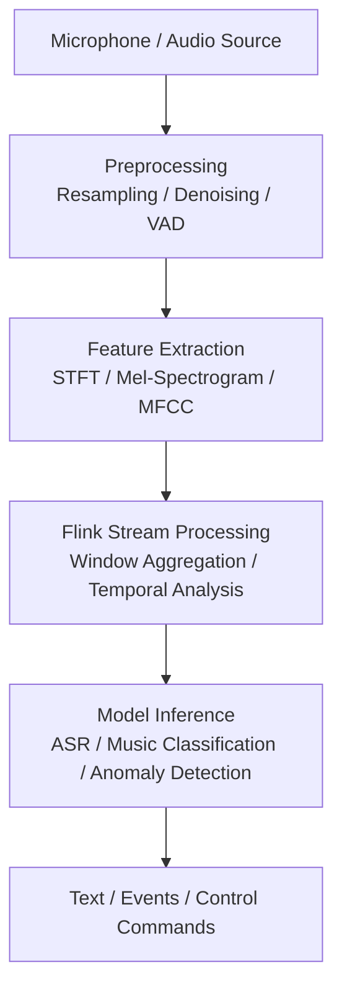
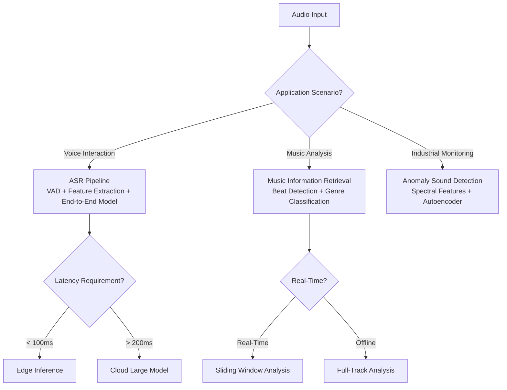
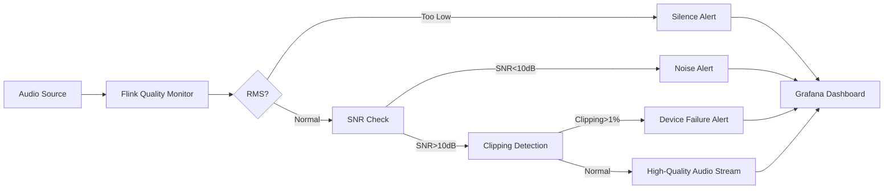

# Real-Time Audio Stream Processing

> **Stage**: Knowledge/06-frontier/ | **Prerequisites**: [Multimodal Stream Processing Architecture](./multimodal-stream-processing.md) | **Formalization Level**: L3

---

## 1. Definitions

**Def-K-Audio-01: Real-Time Audio Stream Processing**
A stream computing application that performs real-time acquisition, feature extraction, event detection, classification, recognition, and response triggering on continuous audio signals (such as speech, music, and ambient sounds). Typical scenarios include real-time speech transcription, music recommendation, anomalous sound detection, and voice-assistant interaction.

**Def-K-Audio-02: Short-Time Fourier Transform (STFT)**
A method that splits a time-domain audio signal into short frames and applies the Fourier transform to each frame, yielding a time-frequency representation. STFT is one of the most fundamental feature-extraction steps in audio stream processing.

**Def-K-Audio-03: Mel-Spectrogram**
A spectral representation designed based on human auditory perception, mapping the linear frequency axis onto the Mel scale to better capture perceptually relevant information in speech and music.

---

## 2. Properties

**Lemma-K-Audio-01: Perceptual Boundaries of Audio Stream Latency**
Human sensitivity to latency in voice interaction is about 200–300 ms (conversation naturalness), while sensitivity to synchronization in music playback is about 20–40 ms. Therefore, the end-to-end latency of real-time speech processing systems should be < 200 ms, and the synchronization precision of multi-channel music mixing should be < 20 ms.

**Lemma-K-Audio-02: Decoupling Advantage of Feature Extraction and Inference**
In audio stream processing, feature extraction such as Mel-spectrogram computation is lightweight and low-latency, suitable for high-frequency execution (e.g., one frame every 10 ms); deep-learning inference (e.g., speech recognition models) is computationally heavy and better suited for lower-frequency batch processing (e.g., one batch every 500 ms). Decoupling the two optimizes resource utilization.

**Prop-K-Audio-01: Sliding Windows Are Key to Audio Event Detection**
Because audio events (such as keywords or anomalous sounds) can occur at any moment and have variable durations, using overlapping sliding windows significantly improves event-detection recall, preventing events that straddle window boundaries from being missed.

---

## 3. Relations

### 3.1 Audio Stream Processing Architecture



### 3.2 Comparison of Audio Processing with Other Modalities

| Feature | Audio Stream | Video Stream | Text Stream |
|---------|--------------|--------------|-------------|
| Data Rate | Medium (16–128 kbps) | Extremely High (Mbps–Gbps) | Low (bps–kbps) |
| Typical Latency Requirement | < 200 ms | < 1–3 s | < 100 ms |
| Core Feature | Spectral / Temporal | Spatial / Temporal | Semantic / Syntactic |
| Inference Frequency | Medium (100–500 ms) | Low (1–5 s) | High (10–50 ms) |
| Primary Hardware | CPU / GPU | GPU | CPU |

---

## 4. Argumentation

### 4.1 Core Challenges of Audio Stream Processing

1. **High real-time requirements**: Speech recognition must have low latency to ensure conversational fluency
2. **Complex noisy environments**: Reverberation, background noise, and overlapping speakers in real-world scenes severely degrade recognition accuracy
3. **Multilingualism and dialects**: There are 7,000+ languages globally; mainstream ASR models still have limited support for low-resource languages
4. **Privacy sensitivity**: Voice data contains biometric information (voiceprint), creating strong demand for localized / edge processing

### 4.2 Typical Application Scenarios

- **Real-time meeting transcription**: Real-time conversion of multi-person meeting speech into text, with speaker diarization support
- **Intelligent customer-service quality inspection**: Real-time analysis of emotions, keywords, and compliance in customer-service calls
- **Industrial anomaly detection**: Monitoring equipment operation sounds via microphones to detect bearing wear, belt loosening, and other faults early
- **Real-time music recommendation**: Recommending the next song in real time based on the user's current music style and mood

---

## 5. Formal Proof / Engineering Argument

### 5.1 Completeness of Sliding-Window Event Detection

**Theorem (Thm-K-Audio-01)**: Let the maximum duration of an audio event be $T_{max}$, the sliding window length be $W$, and the sliding step be $S$. If $W \geq T_{max}$ and $S \leq W / 2$, then any audio event will be covered by at least one complete window.

**Engineering Argument**:

1. Audio events are continuous in the time domain with length $t \leq T_{max}$
2. The sliding window advances with step $S$; the uncovered gap between adjacent windows is $W - S$
3. If $S \leq W / 2$, then $W - S \geq W / 2 > 0$, and any event of length $t \leq W$ cannot fully fall into the gap
4. Therefore, every event is captured completely by at least one window
5. In practice, $W = 2 \times T_{max}$ and $S = W / 2$ are typically chosen to balance detection accuracy and computational overhead

---

## 6. Examples

### 6.1 Flink Audio Feature Extraction Job

```java
DataStream<AudioFrame> audioStream = env
    .addSource(new MicrophoneSource(16000, 1024))
    .assignTimestampsAndWatermarks(
        WatermarkStrategy.<AudioFrame>forBoundedOutOfOrderness(Duration.ofMillis(100))
    );

// Sliding window of 500ms, compute Mel-spectrogram
DataStream<MelSpectrogram> melStream = audioStream
    .windowAll(SlidingEventTimeWindows.of(Time.milliseconds(500), Time.milliseconds(250)))
    .process(new MelSpectrogramWindowFunction());

// Feed into ASR model
melStream
    .map(new AsrInferenceMapFunction())
    .addSink(new TranscriptSink());
```

### 6.2 Python Audio Feature Extraction UDF

```python
from pyflink.table.udf import udf
from pyflink.table import DataTypes
import librosa
import numpy as np

@udf(result_type=DataTypes.ARRAY(DataTypes.FLOAT()))
def extract_mel_features(audio_bytes, sample_rate=16000):
    y = np.frombuffer(audio_bytes, dtype=np.float32)
    mel_spec = librosa.feature.melspectrogram(y=y, sr=sample_rate, n_mels=128)
    log_mel = librosa.power_to_db(mel_spec, ref=np.max)
    return log_mel.flatten().tolist()
```

### 6.3 Voice Activity Detection (VAD) Configuration

```yaml
# WebRTC VAD configuration example
vad:
  mode: 3  # 0=Normal, 1=LowBitRate, 2=Aggressive, 3=VeryAggressive
  frame_duration_ms: 30
  sample_rate: 16000
```

---

## 7. Visualizations

### Audio Stream Processing Decision Tree



---

## 8. References


### 6.4 Challenges and Countermeasures in Audio Stream Processing

**Challenge 1: Robustness in Noisy Environments**

Industrial sites, public transport, and open offices often have signal-to-noise ratios (SNR) below 10 dB, severely affecting ASR and event-detection accuracy.

**Countermeasures**:

- **Signal Preprocessing**: Spectral subtraction, Wiener filtering to reduce stationary noise
- **Neural Network Denoising**: Use lightweight models such as RNNoise and DeepFilterNet for real-time speech enhancement
- **Multi-Channel Beamforming**: Microphone arrays leverage spatial information to enhance signals from the target direction

```python
# Lightweight denoising example based on spectral subtraction
import numpy as np

def spectral_subtraction(signal, noise_estimate, alpha=1.5):
    """
    signal: time-domain audio frame
    noise_estimate: pre-estimated noise spectrum
    alpha: over-subtraction factor
    """
    spec = np.fft.rfft(signal)
    magnitude = np.abs(spec)
    phase = np.angle(spec)

    # Spectral subtraction + half-wave rectification
    cleaned_mag = np.maximum(magnitude - alpha * noise_estimate, 0.01 * magnitude)
    cleaned_spec = cleaned_mag * np.exp(1j * phase)

    return np.fft.irfft(cleaned_spec, n=len(signal))
```

**Challenge 2: Speaker Overlap (Cocktail Party Problem)**

Meeting scenarios often have multiple people speaking simultaneously, causing ASR to produce confused transcriptions.

**Countermeasures**:

- **Speaker Diarization**: Use clustering or end-to-end models (e.g., pyannote.audio) to identify "who speaks when"
- **Target Speaker Extraction**: Extract a specific speaker's voice based on an enrolled voiceprint
- **Streaming Diarization State Management**: Flink's KeyedState can be used to store speaker clustering centers for each meeting room, enabling cross-window speaker consistency tracking

**Challenge 3: Missing Models for Low-Resource Languages**

Mainstream ASR models support English and Chinese well, but coverage for minor languages, dialects, and professional terminology is insufficient.

**Countermeasures**:

- **Fine-Tuning**: Fine-tune general models on domain-specific data
- **Hotword Boosting**: Increase the probability of specific vocabulary (e.g., names, product names) during decoding
- **Hybrid Decoding**: General model + n-gram language model interpolation to improve domain accuracy

---

### 6.5 Audio Quality Assessment Pipeline

In audio stream processing systems, real-time monitoring of input audio quality is critical for early detection of device failures or network anomalies.

```java
public class AudioQualityMonitorFunction extends ProcessFunction<AudioFrame, QualityMetric> {
    @Override
    public void processElement(AudioFrame frame, Context ctx, Collector<QualityMetric> out) {
        double[] samples = frame.getSamples();

        // 1. Compute RMS energy
        double rms = Math.sqrt(Arrays.stream(samples).map(s -> s * s).average().orElse(0));

        // 2. Estimate SNR (simplified: based on silence-segment assumption)
        double noiseFloor = estimateNoiseFloor(samples);
        double snrDb = 20 * Math.log10(rms / (noiseFloor + 1e-10));

        // 3. Detect clipping
        long clipCount = Arrays.stream(samples)
            .filter(s -> Math.abs(s) > 0.99).count();
        double clipRatio = (double) clipCount / samples.length;

        // 4. Detect DC offset
        double dcOffset = Arrays.stream(samples).average().orElse(0);

        out.collect(new QualityMetric(
            frame.getTimestamp(),
            rms,
            snrDb,
            clipRatio,
            dcOffset
        ));
    }

    private double estimateNoiseFloor(double[] samples) {
        // Estimate noise floor using quantile method
        double[] sorted = samples.clone();
        Arrays.sort(sorted);
        double[] magnitudes = Arrays.stream(sorted).map(Math::abs).toArray();
        Arrays.sort(magnitudes);
        return magnitudes[magnitudes.length / 10]; // 10th percentile
    }
}
```

---

## 7. Visualizations

### 7.4 Audio Stream Quality Monitoring Dashboard Architecture



---

## 8. References


### 6.6 Flink State Management in Audio Streams

In long-running audio monitoring scenarios (e.g., 24×7 call-center quality inspection), Flink's state management is needed to maintain speaker identities, session context, and audio quality baselines.

```java
// KeyedState-based speaker tracking operator
public class SpeakerTrackingFunction extends KeyedProcessFunction<String, AudioFrame, SpeakerEvent> {
    // State: active speaker list for the current room
    private ListState<SpeakerProfile> speakerState;
    // State: cumulative speaking time per speaker
    private MapState<String, Long> speakingTimeState;
    // State: audio quality historical baseline (for anomaly detection)
    private ValueState<QualityBaseline> baselineState;

    @Override
    public void open(Configuration parameters) {
        speakerState = getRuntimeContext().getListState(
            new ListStateDescriptor<>("speakers", SpeakerProfile.class));
        speakingTimeState = getRuntimeContext().getMapState(
            new MapStateDescriptor<>("speaking-time", String.class, Long.class));
        baselineState = getRuntimeContext().getState(
            new ValueStateDescriptor<>("quality-baseline", QualityBaseline.class));
    }

    @Override
    public void processElement(AudioFrame frame, Context ctx, Collector<SpeakerEvent> out)
            throws Exception {
        String roomId = ctx.getCurrentKey();

        // Update speaking time
        String speakerId = frame.getDetectedSpeakerId();
        Long currentTime = speakingTimeState.get(speakerId);
        if (currentTime == null) currentTime = 0L;
        speakingTimeState.put(speakerId, currentTime + frame.getDurationMs());

        // Update audio quality baseline (exponential moving average)
        QualityBaseline baseline = baselineState.value();
        if (baseline == null) {
            baseline = new QualityBaseline(frame.getRms(), frame.getSnrDb());
        } else {
            baseline.update(frame.getRms(), frame.getSnrDb(), 0.01);
        }
        baselineState.update(baseline);

        // Detect anomaly: current frame SNR deviates from baseline by more than 2 standard deviations
        if (Math.abs(frame.getSnrDb() - baseline.meanSnr) > 2 * baseline.stdSnr) {
            out.collect(new SpeakerEvent(
                roomId, speakerId, "QUALITY_ANOMALY",
                frame.getSnrDb(), ctx.timestamp()
            ));
        }

        // Timer: output session summary once per hour
        long currentHour = ctx.timestamp() / 3_600_000 * 3_600_000;
        ctx.timerService().registerEventTimeTimer(currentHour + 3_600_000);
    }

    @Override
    public void onTimer(long timestamp, OnTimerContext ctx, Collector<SpeakerEvent> out)
            throws Exception {
        String roomId = ctx.getCurrentKey();
        for (Map.Entry<String, Long> entry : speakingTimeState.entries()) {
            out.collect(new SpeakerEvent(
                roomId, entry.getKey(), "HOURLY_SUMMARY",
                entry.getValue(), timestamp
            ));
        }
    }
}
```

**Design Highlights**:

- Use `KeyedProcessFunction` partitioned by room ID to ensure speaker-state consistency within the same room
- `MapState` is suitable for storing dynamic numbers of speakers, avoiding pre-allocation of fixed-size state
- The once-per-hour timer enables periodic output of session summaries without requiring an additional batch job

---

### 6.7 Deployment Configuration for Audio Stream Pipeline

Below is a complete Flink audio stream processing job deployment configuration on Kubernetes, including resource limits, Checkpoint configuration, and PVC mounting (for storing speech models):

```yaml
apiVersion: flink.apache.org/v1beta1
kind: FlinkDeployment
metadata:
  name: audio-stream-pipeline
spec:
  image: flink:1.18-scala_2.12
  flinkVersion: v1.18
  jobManager:
    resource:
      memory: 2Gi
      cpu: 1
  taskManager:
    resource:
      memory: 4Gi
      cpu: 2
    podTemplate:
      spec:
        containers:
          - name: flink-main-container
            volumeMounts:
              - name: model-volume
                mountPath: /opt/models
        volumes:
          - name: model-volume
            persistentVolumeClaim:
              claimName: audio-models-pvc
  job:
    jarURI: local:///opt/flink/usrlib/audio-pipeline.jar
    parallelism: 4
    upgradeMode: stateful
    state: running
    args:
      - --checkpointing.interval
      - 30s
      - --state.backend
      - rocksdb
      - --state.checkpoints.dir
      - s3://flink-checkpoints/audio-pipeline
```


**Summary**: Audio stream processing plays an increasingly important role in real-time meetings, industrial monitoring, smart homes, and other scenarios. Through Flink's window aggregation, state management, and side-output capabilities, end-to-end low-latency audio analysis pipelines can be built. In the future, as multimodal large models and dedicated AI audio chips become widespread, audio stream processing will deeply integrate with video and text to become one of the core data channels of next-generation intelligent interaction systems.
