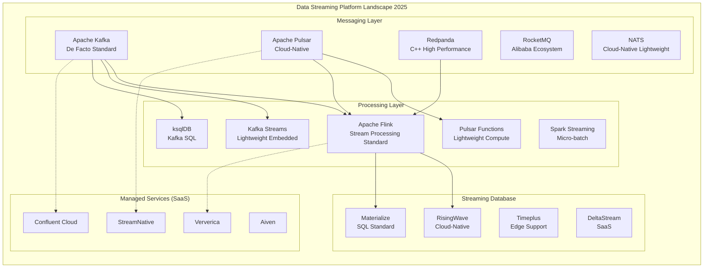
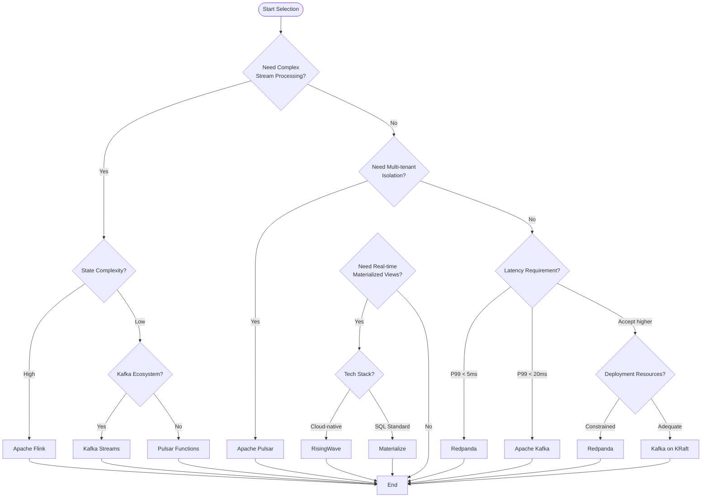
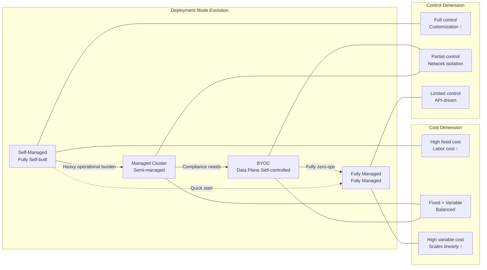
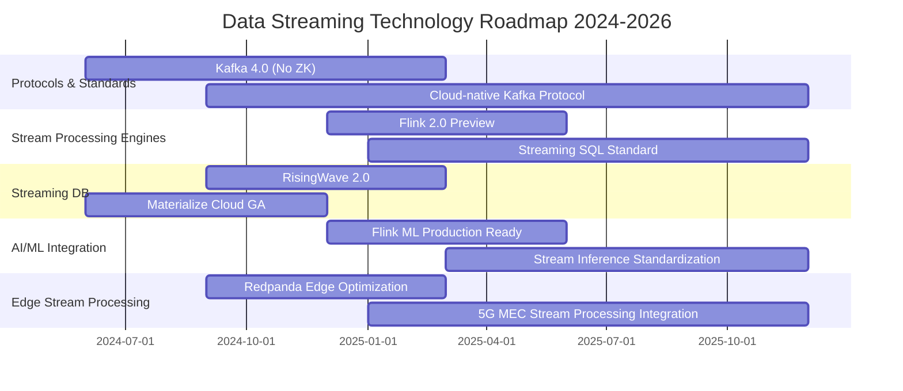

# Data Streaming Platform Landscape 2025 — Kafka vs Pulsar vs Flink

> **Stage**: Knowledge/Frontier | **Prerequisites**: [Flink/ Full Architecture Series](../../Flink/), [Knowledge/04-patterns/stream-processing-patterns.md](../02-design-patterns/pattern-event-time-processing.md) | **Formality Level**: L4 (Engineering Selection Argumentation)

---

## 1. Definitions

### Def-K-06-250: Data Streaming Platform

A **data streaming platform** is a distributed system with **continuous data streams as the core abstraction**, providing real-time data ingestion, storage, processing, and distribution capabilities.

**Formal Definition**:

```
DSP = ⟨P, S, C, F⟩
Where:
  P: Producer set — data producers
  S: Stream set — logical data streams (Topic/Partition)
  C: Consumer set — data consumers
  F: Function set — stream processing operators (optional)
```

### Def-K-06-251: Stream Processing Semantic Classification

| Semantic Level | Definition | Fault Tolerance Mechanism |
|---------------|------------|---------------------------|
| At-Most-Once | Message processed at most once, may be lost | No retry |
| At-Least-Once | Message processed at least once, may be duplicated | Retry on failure |
| Exactly-Once | Message processed exactly once | Idempotency + transactions |

### Def-K-06-252: Deployment Mode Classification

**Definition**: Data streaming platform deployment topology and operational responsibility division.

| Mode | Control Plane | Data Plane | Applicable Scenario |
|------|---------------|------------|---------------------|
| Self-Managed | User | User | Strong compliance, customization needs |
| Managed Cluster | Provider | User VPC | Medium scale, controllable cost |
| Fully Managed SaaS | Provider | Provider | Quick start, zero operations |
| BYOC | Provider | User VPC | Data sovereignty + managed convenience |

### Def-K-06-253: Storage-Compute Separation Architecture

**Definition**: An architecture pattern that decouples message persistence layer (BookKeeper/S3) from the compute layer (Broker).

```
Traditional: Producer → Broker(storage+compute) → Consumer

Storage-Compute Separation:
  Producer → Broker(compute) → BookKeeper/S3(storage) → Consumer
                  ↕
             Metadata (ZooKeeper/etcd)
```

### Def-K-06-254: Stream Processing Engine Core Metrics

| Metric | Definition | Typical Range |
|--------|------------|---------------|
| Latency | Delay from event generation to processing completion | ms ~ s level |
| Throughput | Events processed per unit time | 10K ~ 10M+ events/s |
| State Size | State data maintained by operators | GB ~ TB level |
| Checkpoint Interval | State snapshot period | 1s ~ 10min |

### Def-K-06-255: Streaming Database

**Definition**: A new class of systems that integrates stream processing directly into the database engine, providing real-time updates to Materialized Views.

**Characteristics**:

- Declarative SQL interface
- Continuous Query
- Incremental Computation
- Storage and compute integration

---

## 2. Properties

### Lemma-K-06-160: Kafka Protocol Standardization Effect

**Proposition**: The Apache Kafka protocol has become the **de facto industry standard**.

**Basis**:

1. **Kafka Connect**: 300+ connector ecosystem
2. **Kafka Streams**: Native Java/Scala stream processing
3. **Compatible implementations**: Redpanda, Pulsar (Kafka Protocol Handler), WarpStream
4. **Cloud services**: AWS MSK, Azure Event Hubs, Google Cloud Pub/Sub (Kafka API)

**Engineering implication**: Choosing the Kafka protocol means choosing the largest ecosystem compatibility and talent pool.

### Lemma-K-06-161: Storage-Compute Separation Trade-off Law

**Proposition**: Storage-compute separation architectures have an inherent trade-off between **elastic scaling** and **end-to-end latency**.

**Formal Statement**:

```
Let T_broker be Broker processing latency, T_storage be storage layer write latency
Then total latency L = T_broker + T_storage + T_metadata

Storage-compute separation: T_storage ↑ (network IO), but elasticity coefficient E ↑
Storage-compute integration: T_storage ↓ (local IO), but elasticity coefficient E ↓
```

**Examples**:

| System | Architecture | P99 Latency | Elasticity |
|--------|--------------|-------------|------------|
| Apache Kafka | Integrated | ~5ms | Minute-level scaling |
| Apache Pulsar | Separated | ~20ms | Second-level scaling |
| Redpanda | Integrated | ~3ms | Minute-level scaling |

### Lemma-K-06-162: Stream Processing Engine State Complexity Boundary

**Proposition**: A stream processing engine's state management capability is positively correlated with its **checkpoint overhead**.

| Engine | State Backend | Exactly-Once Semantics | State Size Limit |
|--------|---------------|------------------------|------------------|
| Apache Flink | RocksDB/Heap | ✅ Native support | TB level |
| Spark Streaming | External storage | ⚠️ Requires Kafka coordination | GB level |
| Kafka Streams | RocksDB | ✅ Transactional support | Single-node limit |
| ksqlDB | Kafka + RocksDB | ✅ Depends on underlying | Medium scale |

---

## 3. Relations

### 3.1 Core Platform Architecture Mapping

```
┌─────────────────────────────────────────────────────────────────────┐
│                     Data Streaming Platform Ecosystem               │
├─────────────────────────────────────────────────────────────────────┤
│                                                                     │
│  ┌──────────────┐     ┌──────────────┐     ┌──────────────┐        │
│  │   Message    │     │   Stream     │     │ Streaming DB │        │
│  │   Queue      │────▶│   Engine     │────▶│              │        │
│  │   (MQ)       │     │  (Engine)    │     │              │        │
│  └──────────────┘     └──────────────┘     └──────────────┘        │
│         │                    │                    │                │
│         ▼                    ▼                    ▼                │
│  ┌──────────────┐     ┌──────────────┐     ┌──────────────┐        │
│  │ Apache Kafka │     │Apache Flink  │     │ RisingWave   │        │
│  │ Apache Pulsar│     │Spark Streaming│    │ Materialize  │        │
│  │    Redpanda  │     │Kafka Streams │     │  Timeplus    │        │
│  │ Apache RocketMQ│   │  ksqlDB      │     │  DeltaStream │        │
│  └──────────────┘     └──────────────┘     └──────────────┘        │
│                                                                     │
└─────────────────────────────────────────────────────────────────────┘
```

### 3.2 Platform Capability Matrix

| Dimension | Kafka | Pulsar | Flink | Redpanda | ksqlDB |
|-----------|-------|--------|-------|----------|--------|
| **Core Positioning** | Messaging standard | Cloud-native messaging | Stream processing engine | C++ Kafka | Kafka SQL |
| **Storage Architecture** | Integrated | Separated | State backend | Integrated | Depends on Kafka |
| **Multi-tenancy** | ❌ (KRaft improving) | ✅ Native | ✅ Application layer | ❌ | ❌ |
| **Geo-replication** | MirrorMaker | Geo-Replication | - | - | - |
| **Stream Processing** | KStreams/ksqlDB | Pulsar Functions | Native | Limited | Native |
| **Latency (P99)** | ~5ms | ~20ms | Sub-second | ~3ms | ~10ms |
| **Throughput (per node)** | ~1M msg/s | ~500K msg/s | Depends on state | ~2M msg/s | ~500K msg/s |

### 3.3 Deployment Mode and Platform Mapping

```
┌─────────────────────────────────────────────────────────────────┐
│                  Deployment Mode Decision Space                 │
├─────────────────────────────────────────────────────────────────┤
│                                                                 │
│  Self-Managed        Managed Cluster        SaaS (Fully)        │
│  ├─ Apache Kafka     ├─ AWS EMR + Kafka     ├─ Confluent        │
│  ├─ Apache Pulsar    ├─ GCP Dataflow        ├─ Aiven            │
│  ├─ Apache Flink     ├─ Azure HDInsight     ├─ Ververica        │
│  └─ Redpanda         └─ Databricks          └─ Upstash          │
│                                                                 │
│  ───────────────── BYOC (Bring Your Own Cloud) ─────────────── │
│  ├─ Confluent BYOC   ├─ Ververica BYOC    ├─ StreamNative      │
│                                                                 │
└─────────────────────────────────────────────────────────────────┘
```

---

## 4. Argumentation

### 4.1 Kafka's Dominance Analysis

**Arguments**:

1. **First-mover advantage**: Open-sourced in 2011, became synonymous with streaming data infrastructure
2. **Ecosystem network effects**: LinkedIn → Confluent commercialization path validated
3. **Protocol standardization**: Kafka Protocol became the de facto standard

**Counter-argument**: Kafka's cloud-native transformation lagged (ZooKeeper → KRaft migration took years)

**Response**: KRaft (Kafka Raft) mode is GA in 3.3+, removing ZooKeeper dependency and simplifying operations.

### 4.2 Pulsar's Differentiated Value

**Core advantage argumentation**:

| Scenario | Pulsar Advantage | Kafka Limitation |
|----------|-----------------|------------------|
| Multi-tenant isolation | Namespace + quota native support | Requires external implementation |
| Tiered storage | Automatic offload to S3, infinite retention | Requires manual configuration |
| Geo-replication | Built-in active-active multi-site | MirrorMaker requires separate deployment |
| Function compute | Lightweight Pulsar Functions | Requires Kafka Streams |

**Disadvantage**: Operational complexity is higher than Kafka; community size is about 1/10 of Kafka's.

### 4.3 Flink's Stream Processing Hegemony

**Technical argumentation**:

```
Spark Streaming (micro-batch) vs Flink (native streaming)

Time model:
  Spark: Event Time ≈ Processing Time (micro-batch windows)
  Flink: Event Time ≠ Processing Time (Watermark mechanism)

State management:
  Spark: Depends on external storage (HBase, Redis)
  Flink: Built-in RocksDB state backend

Fault tolerance:
  Spark: RDD Lineage + Checkpoint
  Flink: Chandy-Lamport distributed snapshots (Checkpoints)
```

### 4.4 Streaming Database Rise Logic

**Market drivers**:

1. **Simplified architecture**: From Lambda/Kappa to a single system
2. **SQL ubiquity**: Lowers stream processing technical barrier
3. **Real-time analytics**: Materialized views replace repeated queries

**Representative system comparison**:

| System | Core Features | Deployment Mode | Status |
|--------|---------------|-----------------|--------|
| RisingWave | Cloud-native, storage-compute separation | Self/SaaS | Production-ready |
| Materialize | SQL standard compatible, strong consistency | Self/Cloud | Production-ready |
| Timeplus | Proton engine, edge support | Self/Cloud | Rapid iteration |
| DeltaStream | Stateless stream processing SaaS | SaaS only | Early stage |

---

## 5. Proof / Engineering Argument

### Thm-K-06-160: Stream Platform Selection Decision Theorem

**Theorem**: For a given business scenario S, there exists an optimal platform selection function Optimal(S) that minimizes total cost C.

**Variable Definitions**:

```
C_total = C_infra + C_ops + C_dev + C_risk

Where:
  C_infra: Infrastructure cost (compute/storage/network)
  C_ops: Operational labor cost
  C_dev: Development adaptation cost
  C_risk: Technical debt / vendor lock-in risk
```

**Scenario-Platform Matching Mapping**:

| Scenario Feature | Recommended Platform | Argumentation |
|-----------------|----------------------|---------------|
| High-throughput logs (>1M/s) | Kafka / Redpanda | Sequential write optimization, zero-copy |
| Multi-tenant SaaS | Pulsar | Namespace isolation, quota management |
| Complex stream processing | Flink | State management, CEP, window operations |
| Kafka ecosystem SQL | ksqlDB | Native integration, no extra dependencies |
| Real-time materialized views | RisingWave/Materialize | SQL semantics, auto-refresh |
| Edge/IoT scenarios | Redpanda / Pulsar | Lightweight, low resource usage |

### Thm-K-06-161: Deployment Mode Cost Boundary Theorem

**Theorem**: Total cost of deployment modes changes non-linearly with data scale; there exists a scale threshold T where SaaS mode becomes cheaper than Self-Managed.

**Proof Framework**:

```
Let data volume be D (TB/month)

Self-Managed cost:
  C_self = C_hardware(D) + C_engineers × T_ops

SaaS cost:
  C_saas = k × D  (k is unit data price)

Break-even point:
  C_self(D) = C_saas(D)
  → D_critical = C_engineers × T_ops / (k - c_hardware_unit)

Engineering empirical value: D_critical ≈ 10-50 TB/month (depends on team size)
```

### Thm-K-06-162: Stream Processing Engine Capability Completeness Theorem

**Theorem**: Apache Flink constitutes the supremum in the partial order of stream processing functional completeness dimensions.

**Proof Points**:

1. **Time semantic completeness**: Event Time + Watermark + Allow Lateness
2. **State management completeness**: Keyed State + Operator State + State TTL
3. **Fault tolerance semantic completeness**: Exactly-Once Checkpoint + Savepoint
4. **Join mode completeness**: Stream-Stream / Stream-Table / Table-Table Join
5. **Deployment mode completeness**: Session / Per-Job / Application Mode

**Corollary**: For scenarios requiring complex stream processing, Flink is the most functionally complete choice.

---

## 6. Examples

### 6.1 E-commerce Real-time Recommendation System

**Scenario**: User behavior → Real-time features → Recommendation model

```
Architecture choice:
┌─────────────┐     ┌─────────────┐     ┌─────────────┐
│   Kafka     │────▶│    Flink    │────▶│  Redis/ML   │
│ (Behavior   │     │(Feature Eng)│     │ (Online Svc)│
│   Logs)     │     └─────────────┘     └─────────────┘
└─────────────┘

Selection rationale:
- Kafka: High-throughput behavior log collection (10M+ events/s)
- Flink: Complex window aggregation, Session identification, state management
- Deployment: AWS MSK + Ververica Platform (managed Flink)
```

### 6.2 Financial Risk Control Real-time Decision

**Scenario**: Transaction events → Rule engine → Risk score

```
Architecture choice:
┌─────────────┐     ┌─────────────┐     ┌─────────────┐
│   Pulsar    │────▶│    Flink    │────▶│ Risk Engine │
│(Multi-tenant│     │(CEP Pattern │     │ (Decision   │
│  Isolation) │     │   Matching) │     │   Output)   │
└─────────────┘     └─────────────┘     └─────────────┘

Selection rationale:
- Pulsar: Strong multi-tenant isolation (business-line independent Namespaces)
- Flink CEP: Complex event pattern recognition (continuous anomaly detection)
- Deployment: StreamNative Cloud (Pulsar SaaS) + Self-hosted Flink
```

### 6.3 IoT Edge Stream Processing

**Scenario**: Edge devices → Local aggregation → Cloud sync

```
Architecture choice:
┌─────────────┐     ┌─────────────┐     ┌─────────────┐
│  Redpanda   │────▶│    Flink    │────▶│   Kafka     │
│ (Edge Light)│     │(Local Agg)  │     │ (Cloud Agg) │
└─────────────┘     └─────────────┘     └─────────────┘

Selection rationale:
- Redpanda: Single binary, no JVM, resource usage < 1GB
- Flink MiniCluster: Edge node deployment
- Deployment: Edge bare metal + Confluent Cloud (cloud)
```

### 6.4 Real-time Data Warehouse Streaming Database Solution

**Scenario**: Business DB CDC → Real-time materialized views → BI queries

```
Architecture choice (simplified):
┌─────────────┐     ┌─────────────────┐     ┌─────────────┐
│   MySQL     │────▶│   RisingWave    │────▶│   BI Tool   │
│   (CDC)     │     │(MV Real-time    │     │(Direct Query│
│             │     │   Refresh)      │     │             │
└─────────────┘     └─────────────────┘     └─────────────┘

Selection rationale:
- RisingWave: Replaces Kafka+Flink+PostgreSQL combination
- SQL-native: BI tools connect directly, no extra ETL needed
- Deployment: RisingWave Cloud or self-hosted Kubernetes
```

---

## 7. Visualizations

### 7.1 2025 Data Streaming Ecosystem Panorama



### 7.2 Platform Selection Decision Tree



### 7.3 Deployment Mode Comparison Matrix



### 7.4 Stream Processing Engine Capability Radar Chart (Text Description)

```
                    State Management
                      5 |
                        |   4
          Fault Tol. 3 ──┼── 3  Time Semantics
                  2     |     2
                        |
            5 ──────────┼────────── 5
                        |
                  2     |     4
          Ecosystem 4 ──┼── 5  Throughput
                        |   3
                      4 |
                   Latency Optimization

Apache Flink:   [5,5,5,3,4,5] - All-rounder
Spark Streaming:[3,3,3,5,4,4] - Batch-stream unified
Kafka Streams:  [4,3,4,4,2,3] - Lightweight embedded
ksqlDB:         [3,2,3,3,3,2] - SQL-first
```

### 7.5 2025 Trend Timeline



---

## 8. References


---

## Appendix: Selection Checklist

### A. Technical Evaluation Items

| Check Item | Weight | Evaluation Method |
|------------|--------|-------------------|
| Peak throughput requirement | High | Stress test |
| Latency SLA | High | P99/P999 test |
| State data scale | High | Capacity planning |
| Multi-tenant requirement | Medium | Architecture review |
| Geo-replication requirement | Medium | Disaster recovery drill |
| SQL interface requirement | Medium | Development efficiency assessment |
| Ecosystem compatibility | Medium | Connector evaluation |
| Operational complexity | High | PoC operations |
| Team skill reserves | High | Training cost estimation |
| Long-term roadmap | Medium | Community activity analysis |

### B. Cost Estimation Template

```
Three-Year TCO Estimation:

Self-Managed:
  Infrastructure: $____/year × 3 = $____
  Operations labor: $____/year × 3 = $____
  Training cost: $____
  ─────────────────────────────
  Total: $____

SaaS:
  Service fee: $____/GB/month × ____GB × 36 = $____
  Data transfer: $____/month × 36 = $____
  ─────────────────────────────
  Total: $____
```

---

*Document Version: 1.0 | Last Updated: 2025-04-03 | Status: Production Ready*
