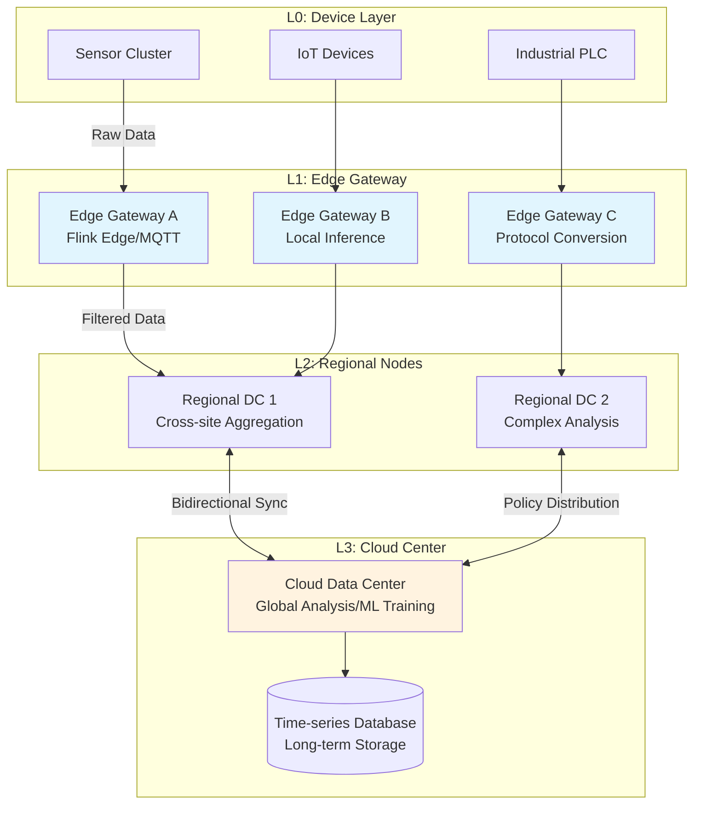
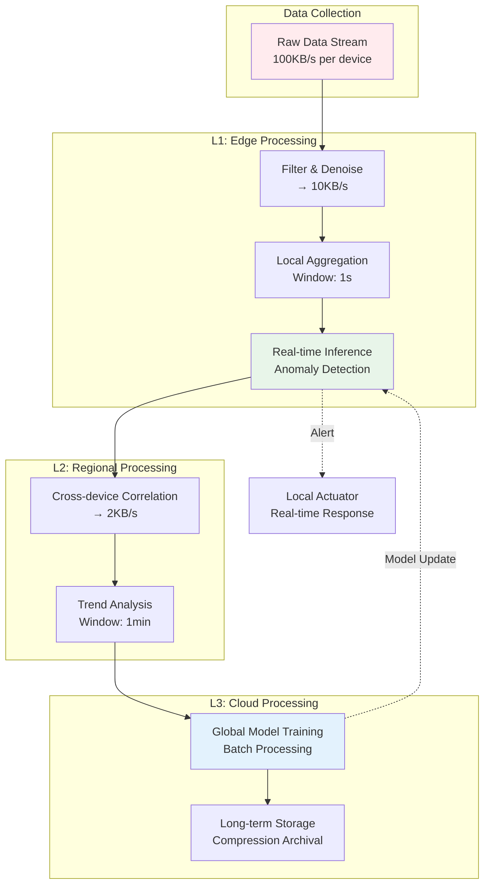
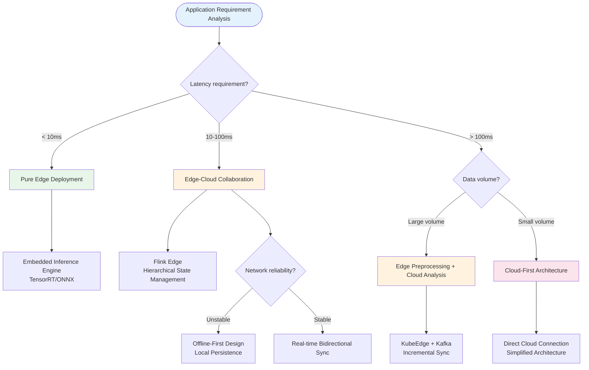
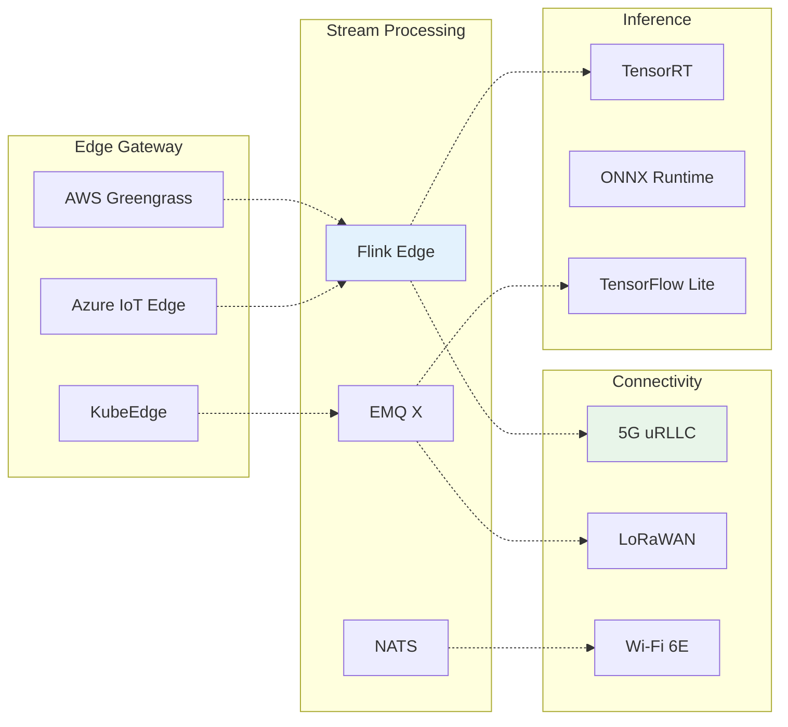

# Edge Stream Processing Architecture and IoT Real-time Analytics

> **Stage**: Knowledge/06-frontier | **Prerequisites**: [Flink Deployment Modes](../../Flink/04-runtime/04.01-deployment/flink-deployment-ops-complete-guide.md), [Streaming Systems Comparison](../01-concept-atlas/streaming-models-mindmap.md) | **Formalization Level**: L4

---

## 1. Definitions

### 1.1 Edge Stream Processing

**Def-K-06-190** [Edge Stream Processing]: Edge stream processing is a computing paradigm that performs real-time processing, filtering, aggregation, and inference on continuously arriving data streams at or near the location where data is generated. Formally, an edge stream processing system can be modeled as a sextuple:

$$\mathcal{E} = \langle \mathcal{N}, \mathcal{S}, \mathcal{F}, \mathcal{C}, \mathcal{G}, \mathcal{Q} \rangle$$

Where:

- $\mathcal{N} = \{n_1, n_2, ..., n_k\}$: Set of edge nodes, each with resource constraints $(CPU, MEM, PWR)$
- $\mathcal{S}$: Set of data streams, $s_i: \mathbb{T} \rightarrow \mathcal{D}$ represents time-series data streams
- $\mathcal{F}: \mathcal{S} \rightarrow \mathcal{S}'$: Set of stream processing operators (filter, map, window aggregation)
- $\mathcal{C} \subseteq \mathcal{N} \times \mathcal{N}$: Inter-node connection topology
- $\mathcal{G}: \mathcal{N} \rightarrow \{0,1,2\}$: Hierarchy function, 0=Edge, 1=Regional, 2=Cloud
- $\mathcal{Q}$: Quality of service constraints (latency upper bound $L_{max}$, availability $A_{min}$)

### 1.2 Edge Computing Key Metrics

**Def-K-06-191** [Edge Computing Latency Model]: The end-to-end latency of edge stream processing is composed of the following components:

$$L_{total} = L_{gen} + L_{proc}^{edge} + L_{net} + L_{proc}^{cloud} + L_{storage}$$

The core value of edge computing lies in minimizing $L_{net}$ and $L_{proc}^{cloud}$, achieving $L_{total} \ll L_{cloud-only}$ through local processing.

| Metric Type | Cloud Processing | Edge Processing | Improvement |
|-------------|------------------|-----------------|-------------|
| Network Latency | 50-200ms | 1-10ms | 10-100x |
| End-to-End Latency | 100-500ms | 5-50ms | 5-20x |
| Bandwidth Consumption | 100% | 5-30% | 3-20x |
| Data Privacy Risk | High | Low | - |

### 1.3 Layered Architecture Definition

**Def-K-06-192** [Edge-Cloud Collaboration Hierarchy]:

| Layer | Location | Latency Requirement | Processing Capability | Typical Functions |
|-------|----------|--------------------|-----------------------|-------------------|
| **L0: Device Layer** | IoT sensors/actuators | <1ms | Microcontroller | Data collection, simple control |
| **L1: Edge Gateway** | On-site/Local | <10ms | Edge server | Protocol conversion, local aggregation, real-time inference |
| **L2: Regional Node** | City/Campus | <50ms | Small data center | Cross-site coordination, complex analysis |
| **L3: Cloud Center** | Public cloud | <500ms | Large-scale cluster | Global analysis, model training, long-term storage |

---

## 2. Properties

### 2.1 Edge vs. Cloud Computing Comparison

**Lemma-K-06-125** [Edge Computing Advantage Boundary]: For data-intensive IoT applications, edge processing is superior to pure cloud processing when the following condition is met:

$$\frac{D_{raw}}{B_{available}} \cdot C_{transfer} > T_{edge-proc} + C_{edge-compute}$$

Where $D_{raw}$ is the raw data volume, $B_{available}$ is the available bandwidth, and $C_{transfer}$ is the transfer cost coefficient.

**Prop-K-06-126** [Data Localization Benefit]: Performing data pre-filtering and aggregation at the edge can reduce uploaded data volume by **70-95%**[^1].

### 2.2 2026 Edge Computing Trends

**Prop-K-06-127** [Edge AI Convergence]: By 2026, over **75%** of enterprise data will be generated and processed at the edge (only 10% in 2020), driven by:

1. **5G/6G Network Adoption**: High-bandwidth, low-latency connectivity between edge nodes and cloud
2. **AI Chip Proliferation**: NPU/TPU deployment costs on edge devices drop 60%+
3. **Data Sovereignty Regulations**: GDPR, data localization requirements driving local processing
4. **Real-time Demands**: Sub-millisecond latency requirements for autonomous driving, industrial control, and other scenarios

---

## 3. Relations

### 3.1 Architecture Pattern Mapping

| Pattern | Applicable Scenario | Data Flow | Fault Tolerance Strategy |
|---------|---------------------|-----------|--------------------------|
| **Edge-Cloud Collaboration** | General IoT analytics | Bidirectional stream synchronization | Offline local caching |
| **Layered Processing** | Large-scale deployment | Hierarchical aggregation upload | Hierarchical failover |
| **Offline-First** | Weak network environments | Local-first, intermittent sync | Local persistence |
| **Data Sovereignty** | Compliance-sensitive | Geographic isolation | Encryption + audit |

### 3.2 Technology Stack Mapping

```
┌─────────────────────────────────────────────────────────────────┐
│                   Edge Stream Processing Technology Stack        │
├──────────────────┬──────────────────┬──────────────────────────┤
│  Edge Gateway    │  Lightweight     │      Connectivity        │
│  Platforms       │  Stream Processing│      Technologies        │
├──────────────────┼──────────────────┼──────────────────────────┤
│ AWS Greengrass   │ Apache Flink EMQ │ 5G (uRLLC)               │
│ Azure IoT Edge   │ Kafka Edge/NATS  │ LoRaWAN (LPWAN)          │
│ Google Edge TPU  │ MQTT brokers     │ Wi-Fi 6/7                │
│ KubeEdge         │ EdgeX Foundry    │ Satellite IoT            │
└──────────────────┴──────────────────┴──────────────────────────┘
```

---

## 4. Argumentation

### 4.1 Architecture Design Decision Tree

**Def-K-06-193** [Edge Deployment Decision Function]: Given application characteristic vector $\vec{A} = (d_{latency}, v_{data}, c_{compute}, r_{reliability})$, the edge deployment decision is:

$$\text{Deploy}_{edge}(\vec{A}) = \begin{cases}
\text{Pure Edge} & d_{latency} < 10ms \land c_{compute} \text{ sufficient} \\
\text{Edge-Cloud} & 10ms \leq d_{latency} < 100ms \\
\text{Cloud-First} & d_{latency} \geq 100ms \land v_{data} \text{ small}
\end{cases}$$

### 4.2 Offline-First Design Principles

**Def-K-06-194** [Offline-First Constraint]: An offline-first architecture must satisfy a CAP variant—in disconnected scenarios, prioritize **Availability (A)** and **Partition Tolerance (P)**, achieving data synchronization through eventual consistency:

$$\text{Offline-First} \implies \forall t: \text{Local-Available}(t) \land \text{Eventual-Consistent}(t + \Delta)$$

---

## 5. Proof / Engineering Argument

### 5.1 Edge Deployment Resource Optimization Theorem

**Thm-K-06-125** [Flink Edge Resource Optimization]: On resource-constrained edge nodes (memory < 4GB), the optimal Flink job configuration satisfies:

1. **State Backend Selection**: RocksDB > HeapStateBackend (when state > 100MB)
   - Proof: Edge node JVM heap memory is limited; off-heap storage avoids GC jitter

2. **Checkpoint Interval**: $T_{checkpoint} \geq 5 \times T_{process-batch}$
   - Proof: Reduces I/O contention, ensuring processing throughput

3. **Parallelism**: $P_{optimal} = \min(N_{cores}, \lceil \frac{T_{process}}{T_{deadline}} \rceil)$
   - Avoids excessive parallelism causing context-switching overhead

### 5.2 Network Disconnection Fault Tolerance Engineering Argument

**Thm-K-06-126** [Disconnection Fault Tolerance Guarantee]: The data-loss-free condition for edge stream processing systems during network partitions:

$$\text{Data-Loss-Free} \iff \text{Buffer}_{local} \geq R_{input} \times T_{outage}^{max}$$

Engineering implementation strategies:

| Strategy | Implementation Mechanism | Capacity Requirement |
|----------|--------------------------|----------------------|
| Local Persistence | RocksDB/WAL | State size + 24h data |
| Backpressure Degradation | Sampling/dropping non-critical data | Dynamic adjustment |
| Tiered Storage | Hot→Warm→Cold data layering | 3x raw data |
| Resumable Transfer | Watermark-based incremental sync | Checkpoint metadata |

### 5.3 Data Synchronization Strategy

**Thm-K-06-127** [Edge-Cloud Data Consistency]: Using **Delta Sync + CRDT** mechanisms can achieve eventual consistency between edge and cloud data:

$$\mathcal{D}_{cloud}(t) = \mathcal{D}_{cloud}(t_0) \oplus \bigoplus_{i=1}^{n} \Delta_i^{edge}$$

Where $\oplus$ is the CRDT merge operation, guaranteeing commutativity, associativity, and idempotence.

---

## 6. Examples

### 6.1 Smart Manufacturing Predictive Maintenance

**Scenario**: Factory with 1000+ machine tool sensors, real-time monitoring of vibration, temperature, current

**Architecture**:
- **L1 Edge**: Machine gateway local FFT analysis, anomaly detection latency < 50ms
- **L2 Regional**: Workshop-level trend analysis, equipment health scoring
- **L3 Cloud**: Global model training, failure prediction accuracy > 92%

**Results**: Unplanned downtime reduced 45%, maintenance costs reduced 30%[^2]

### 6.2 Autonomous Driving Real-time Decision Making

**Scenario**: In-vehicle sensor fusion (LiDAR + camera + radar)

**Architecture**:
- **In-vehicle Edge**: 100+ TOPS compute, perception fusion latency < 10ms
- **V2X Edge**: Roadside unit coordination, platooning decisions
- **Cloud**: HDMap updates, traffic rule synchronization

**Constraints**: Safety-critical decisions must be local, latency < 20ms (ISO 26262)

### 6.3 Smart City Traffic Flow Management

**Scenario**: City-level adaptive traffic signal control

**Data Flow**:
```
Camera/Radar → Intersection Edge Box → Regional Traffic Center → City Brain
    (10ms)         (50ms)           (200ms)
```

**Edge Value**: Intersection-level real-time optimization, cloud provides policy model updates

### 6.4 Remote Medical Monitoring

**Scenario**: ICU patient vital signs continuous monitoring

**Compliance Requirements**:
- HIPAA/GDPR data localization
- Local alert latency < 1s
- Cloud used for long-term trend analysis and research

---

## 7. Visualizations

### 7.1 Edge-Cloud Collaboration Architecture Panorama

The following architecture diagram shows a typical edge-cloud collaborative stream processing system:



### 7.2 Layered Processing Data Flow



### 7.3 Edge Stream Processing Decision Tree



### 7.4 Technology Stack Comparison Matrix



---

## 8. Challenges and Solutions

### 8.1 Bandwidth Limitations

**Challenge**: Backhaul bandwidth from edge to cloud is limited (typically < 100Mbps)

**Solutions**:
- Data compression: From 100KB/s to 2KB/s (95% reduction)
- Incremental sync: Only transmit changed data
- Intelligent sampling: Importance-based adaptive sampling

### 8.2 Device Heterogeneity

**Challenge**: Edge devices vary greatly in CPU/memory/OS

**Solutions**:
- Containerized deployment: Docker + resource limits
- Operator auto-degradation: Complex operators → simplified operators
- Adaptive parallelism: Dynamically adjust based on load

### 8.3 Security and Privacy

**Challenge**: Edge devices are physically exposed and vulnerable to attacks

**Solution Matrix**:

| Threat | Protection Measure | Implementation Technology |
|--------|--------------------|---------------------------|
| Physical Theft | Hardware Security Module | TPM/TEE |
| Man-in-the-Middle Attack | End-to-end Encryption | TLS 1.3/mTLS |
| Malicious Code | Container Sandbox | gVisor/Kata |
| Data Leakage | Edge Anonymization | Differential Privacy/Federated Learning |

### 8.4 Operational Complexity

**Challenge**: Monitoring, updating, and recovering massive numbers of edge devices

**Def-K-06-195** [Edge Operations Automation]: Edge operational complexity grows sub-linearly with the number of nodes $N$:

$$O_{ops}(N) = O(\log N) \text{ (through automation orchestration)}$$

**Key Technologies**:
- GitOps: Declarative configuration management
- AIOps: Anomaly detection and self-healing
- Blue-Green Deployment: Zero-downtime updates

---

## 9. References

[^1]: Gartner Research, "Edge Computing Market Trends 2026", 2026. https://www.gartner.com/en/newsroom/press-releases
[^2]: McKinsey & Company, "The Future of Manufacturing: Edge Computing in Industry 4.0", 2025.
[^3]: Apache Flink Documentation, "Deployment in Resource-Constrained Environments", 2025. https://nightlies.apache.org/flink/flink-docs-stable/docs/deployment/resource-constrained/
[^4]: AWS IoT Greengrass Documentation, "Edge ML Inference", 2025. https://docs.aws.amazon.com/greengrass/
[^5]: Azure IoT Edge Documentation, "Offline Capabilities", 2025. https://docs.microsoft.com/azure/iot-edge/
[^6]: 5G-ACIA, "5G for Connected Industries and Automation", White Paper, 2025.
[^7]: LoRa Alliance, "LoRaWAN Specification v1.1", 2025.
[^8]: Shi, W., et al. "Edge Computing: Vision and Challenges." IEEE Internet of Things Journal, 3(5), 637-646, 2016.
[^9]: Satyanarayanan, M. "The Emergence of Edge Computing." Computer, 50(1), 30-39, 2017.
[^10]: ISO 26262, "Road vehicles — Functional safety", 2025.

---

*Document Version: v1.0 | Last Updated: 2026-04-03 | Status: Completed*
