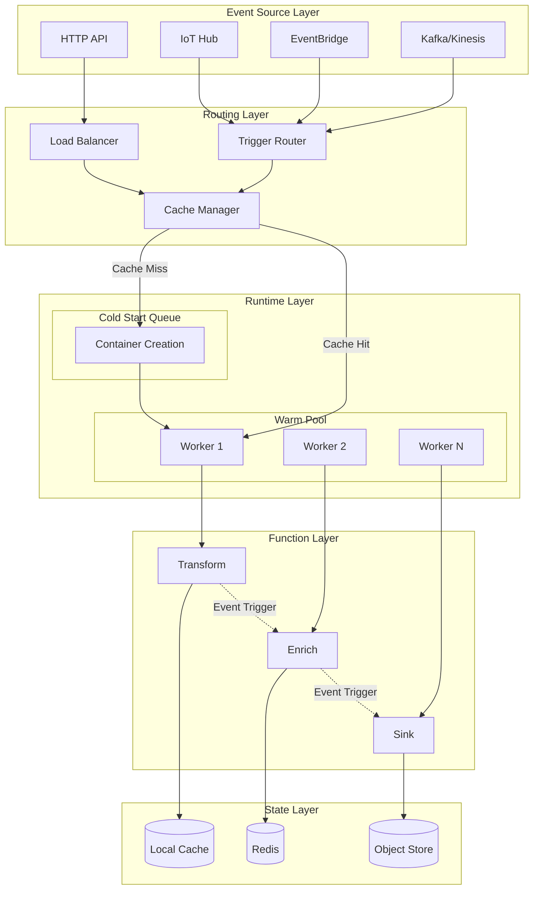
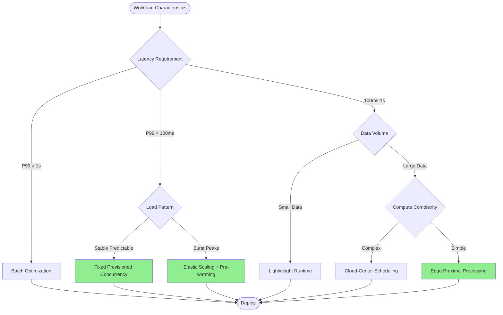
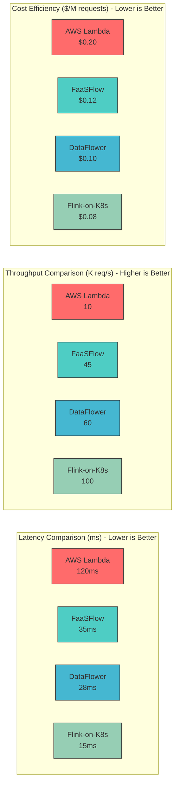
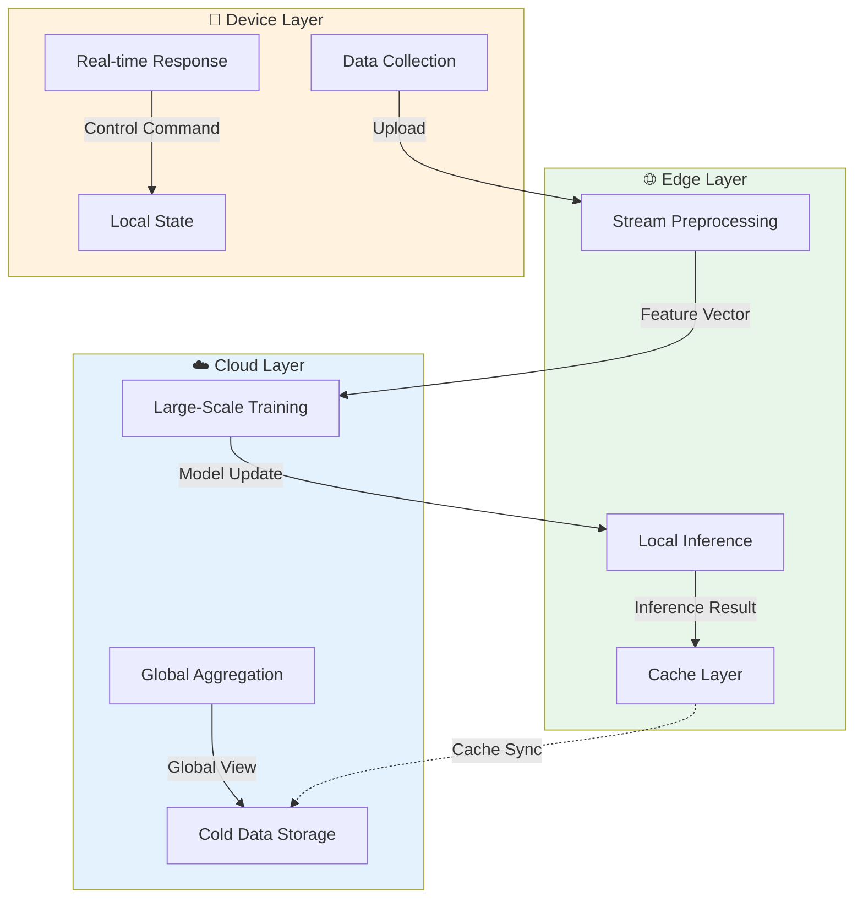

# FaaS Dataflow: Convergence of Serverless and Data Streams

> **Stage**: Knowledge | **Prerequisites**: [05-mapping-guides/serverless-flink-comparison.md](../04-technology-selection/engine-selection-guide.md) | **Formality Level**: L3

## Table of Contents

- [FaaS Dataflow: Convergence of Serverless and Data Streams](#faas-dataflow-convergence-of-serverless-and-data-streams)
  - [Table of Contents](#table-of-contents)
  - [1. Definitions](#1-definitions)
    - [Def-K-06-05: FaaS Dataflow](#def-k-06-05-faas-dataflow)
    - [Def-K-06-06: Cloud-Edge-Device Continuum](#def-k-06-06-cloud-edge-device-continuum)
    - [Def-K-06-07: Adaptive Workflow Placement](#def-k-06-07-adaptive-workflow-placement)
  - [2. Properties](#2-properties)
    - [Prop-K-06-01: Cold Start Latency vs Concurrency Trade-off](#prop-k-06-01-cold-start-latency-vs-concurrency-trade-off)
    - [Prop-K-06-02: Data Locality Gain Boundary](#prop-k-06-02-data-locality-gain-boundary)
    - [Lemma-K-06-01: Function Chain State Transfer Lemma](#lemma-k-06-01-function-chain-state-transfer-lemma)
  - [3. Relations](#3-relations)
    - [3.1 FaaS Dataflow to Classical Dataflow Model Mapping](#31-faas-dataflow-to-classical-dataflow-model-mapping)
    - [3.2 Synergy with Flink](#32-synergy-with-flink)
    - [3.3 Key System Positioning](#33-key-system-positioning)
  - [4. Argumentation](#4-argumentation)
    - [4.1 Technical Challenge Analysis](#41-technical-challenge-analysis)
      - [Challenge 1: Cold Start Latency](#challenge-1-cold-start-latency)
      - [Challenge 2: State Management](#challenge-2-state-management)
      - [Challenge 3: Data Locality](#challenge-3-data-locality)
      - [Challenge 4: Cost Optimization](#challenge-4-cost-optimization)
  - [5. Engineering Argument](#5-engineering-argument)
    - [5.1 Design Pattern Validation](#51-design-pattern-validation)
      - [Pattern 1: Function Chaining](#pattern-1-function-chaining)
      - [Pattern 2: Fan-out/Fan-in](#pattern-2-fan-outfan-in)
      - [Pattern 3: Asynchronous Event-Driven](#pattern-3-asynchronous-event-driven)
      - [Pattern 4: Saga Transaction Pattern](#pattern-4-saga-transaction-pattern)
    - [5.2 Performance Optimization Strategy Argumentation](#52-performance-optimization-strategy-argumentation)
      - [Strategy 1: Provisioned Concurrency](#strategy-1-provisioned-concurrency)
      - [Strategy 2: Tiered Caching](#strategy-2-tiered-caching)
      - [Strategy 3: Data Sharing Mechanism](#strategy-3-data-sharing-mechanism)
  - [6. Examples](#6-examples)
    - [6.1 ML Inference Pipeline](#61-ml-inference-pipeline)
    - [6.2 Real-time ETL Workflow](#62-real-time-etl-workflow)
    - [6.3 Image Processing Pipeline](#63-image-processing-pipeline)
  - [7. Visualizations](#7-visualizations)
    - [7.1 FaaS Dataflow Architecture Diagram](#71-faas-dataflow-architecture-diagram)
    - [7.2 Scheduling Strategy Comparison Decision Tree](#72-scheduling-strategy-comparison-decision-tree)
    - [7.3 Performance Benchmark Comparison](#73-performance-benchmark-comparison)
    - [7.4 Cloud-Edge-Device Placement Strategy](#74-cloud-edge-device-placement-strategy)
  - [8. References](#8-references)

## 1. Definitions

### Def-K-06-05: FaaS Dataflow

**FaaS Dataflow** is a computational model that deeply integrates Function-as-a-Service (FaaS) with the data stream processing paradigm. This model maps operators in the dataflow graph to stateless functions, triggering function execution through event-driven mechanisms while preserving data stream semantics.

**Formal Definition**:

Let $\mathcal{F}$ be the function space, $\mathcal{E}$ the event space, and $\mathcal{D}$ the data domain. Then FaaS Dataflow can be defined as a quadruple:

$$\text{FaaS-DF} = \langle F, E, \rightarrow_F, \sigma \rangle$$

Where:

- $F \subseteq \mathcal{F}$: Set of stateless functions, each $f \in F$ satisfying $f: D_{in} \times C \rightarrow D_{out} \times C'$
- $E \subseteq \mathcal{E}$: Event set, $E = E_{data} \cup E_{control} \cup E_{lifecycle}$
- $\rightarrow_F \subseteq F \times E \times F$: Trigger relations between functions, forming a directed acyclic graph (DAG)
- $\sigma: F \rightarrow \mathbb{R}^+ \times \mathbb{R}^+$: Resource allocation function, mapping functions to (memory, CPU time slice)

**Key Characteristics**:

| Characteristic | Traditional FaaS | FaaS Dataflow |
|----------------|------------------|---------------|
| Execution Unit | Independent functions | Operators in dataflow graph |
| Trigger Mechanism | Event/HTTP | Data availability events |
| State Management | External storage | In-stream state (windows, sessions) |
| Communication Mode | Sync/async invocation | Stream data transmission |
| Elasticity Granularity | Function-level | Subgraph/pipeline-level |

### Def-K-06-06: Cloud-Edge-Device Continuum

**Cloud-Edge-Device Continuum** is a distributed computing architecture paradigm that treats cloud computing, edge computing, and device-side computing as a unified resource continuum, dynamically deploying FaaS workflows based on data locality, latency requirements, and resource constraints.

**Layered Model**:

$$\text{Continuum} = \langle L_{cloud}, L_{edge}, L_{device}, \pi, \delta \rangle$$

- $L_{cloud}$: Cloud center layer, high compute density, high latency ($>100ms$)
- $L_{edge}$: Edge layer, regional deployment, medium latency ($10-50ms$)
- $L_{device}$: Device layer, proximal processing, low latency ($<10ms$)
- $\pi: F \rightarrow \{L_{cloud}, L_{edge}, L_{device}\}$: Placement policy function
- $\delta: E \times L_i \times L_j \rightarrow \mathbb{R}^+$: Inter-layer data transmission latency

**Placement Constraints**:

$$\forall f \in F: \quad \text{latency}(f) \leq \tau_f \land \text{cost}(\pi(f)) \leq \gamma_f$$

Where $\tau_f$ is the latency SLA of function $f$, and $\gamma_f$ is the cost budget.

### Def-K-06-07: Adaptive Workflow Placement

**Adaptive Workflow Placement** is a runtime optimization mechanism that dynamically adjusts function deployment locations in a multi-tier architecture based on workload characteristics, resource availability, and QoS requirements.

**Decision Space**:

$$\mathcal{P} = \{ (f, l, t) \mid f \in F, l \in L, t \in T \}$$

The optimization objective is to minimize total cost while meeting latency constraints:

$$\min_{p \in \mathcal{P}} \sum_{(f,l,t) \in p} \left[ \alpha \cdot \text{cost}(f,l,t) + \beta \cdot \mathbb{1}_{\text{latency}(f,l) > \tau_f} \right]$$

Where $\alpha, \beta$ are weight coefficients, and $\mathbb{1}$ is the indicator function.

---

## 2. Properties

### Prop-K-06-01: Cold Start Latency vs Concurrency Trade-off

**Proposition**: In a FaaS Dataflow system, provisioned concurrency $c$ and cold start latency $t_{cold}$ are inversely related, but total cost grows linearly with $c$.

**Derivation**:

Let arrival rate be $\lambda$, service rate be $\mu$. Then system availability probability:

$$P_{available} = 1 - \left( \frac{\lambda}{c\mu} \right)^c \cdot \frac{1}{1 - \frac{\lambda}{c\mu}}$$

Expected response time:

$$E[T] = (1 - P_{available}) \cdot t_{cold} + P_{available} \cdot t_{warm}$$

When $\lambda \rightarrow c\mu$, $P_{available} \rightarrow 0$, and the system becomes cold-start dominated.

### Prop-K-06-02: Data Locality Gain Boundary

**Proposition**: In a Cloud-Edge-Device continuum, latency reduction from data locality optimization has an upper bound determined by the ratio of network transmission latency to computation latency.

**Proof Sketch**:

Let data volume be $D$, cloud-edge bandwidth $B_{ce}$, edge-device bandwidth $B_{ed}$, and cloud/edge/device compute rates be $R_c, R_e, R_d$.

Cloud processing latency: $T_c = \frac{D}{B_{ce}} + \frac{W}{R_c}$

Edge processing latency: $T_e = \frac{D}{B_{ed}} + \frac{W}{R_e}$

Locality gain: $\Delta T = T_c - T_e = D(\frac{1}{B_{ce}} - \frac{1}{B_{ed}}) + W(\frac{1}{R_c} - \frac{1}{R_e})$

When $B_{ed} \gg B_{ce}$ and $R_e \approx R_c$, $\Delta T \approx \frac{D}{B_{ce}}$, with gains mainly coming from avoiding WAN transmission.

### Lemma-K-06-01: Function Chain State Transfer Lemma

**Lemma**: In a function chain $f_1 \rightarrow f_2 \rightarrow \cdots \rightarrow f_n$, if intermediate state is passed via external storage, end-to-end latency has a linear relationship with chain length $n$.

**Proof**:

Let single storage access latency be $t_s$, and function execution time be $t_f^{(i)}$.

$$T_{chain} = \sum_{i=1}^{n} t_f^{(i)} + (n-1) \cdot 2t_s = O(n)$$

If an in-memory data sharing mechanism is used and intermediate results bypass external storage:

$$T_{chain}^{optimized} = \sum_{i=1}^{n} t_f^{(i)} + (n-1) \cdot t_{mem} = O(n), \quad t_{mem} \ll t_s$$

Coefficient improvement: $\frac{T_{chain}^{optimized}}{T_{chain}} \approx \frac{t_f}{t_f + 2t_s}$, which can achieve orders-of-magnitude improvement when $t_f \ll t_s$.

---

## 3. Relations

### 3.1 FaaS Dataflow to Classical Dataflow Model Mapping

```
┌─────────────────────────────────────────────────────────────────┐
│                    Model Mapping                                 │
├─────────────────────┬──────────────────┬────────────────────────┤
│ Classical Dataflow  │ FaaS Dataflow    │ Serverless Platform    │
├─────────────────────┼──────────────────┼────────────────────────┤
│ Operator            │ Function         │ Lambda/Cloud Function  │
│ Stream              │ Event Stream     │ EventBridge/Kafka      │
│ State Backend       │ External Storage │ DynamoDB/Blob Store    │
│ Checkpoint          │ Function snapshot│ Step Functions/Persist │
│ Watermark           │ Event timestamp  │ Cloud event metadata   │
│ KeyBy/Partition     │ Trigger routing  │ Event filtering rules  │
└─────────────────────┴──────────────────┴────────────────────────┘
```

### 3.2 Synergy with Flink

Flink and FaaS Dataflow have two main integration patterns:

**Pattern A: Flink as Execution Engine**

The FaaS layer handles function lifecycle management and event routing, while actual data processing is executed by the underlying Flink cluster. Suitable for:

- Complex stream processing logic (windows, CEP)
- Stateful computation requirements
- High throughput scenarios

**Pattern B: DataStream API Wrapped as FaaS**

Flink's DataStream operators are encapsulated as independent functions and deployed via a serverless platform. Suitable for:

- Lightweight ETL
- Event-driven microservices
- Rapid prototyping

### 3.3 Key System Positioning

| System | Core Contribution | Use Cases | Key Metric |
|--------|-------------------|-----------|------------|
| **FaaSFlow**[^1] | Efficient serverless workflow execution | High-concurrency function chains | End-to-end latency |
| **DataFlower**[^2] | Dataflow-aware orchestration | Complex DAG workflows | Throughput |
| **CheckMate**[^3] | Checkpoint protocol evaluation | Stateful FaaS | Recovery time |
| **OpenWolf**[^4] | Cloud-edge-device orchestration | IoT/edge scenarios | Resource utilization |

---

## 4. Argumentation

### 4.1 Technical Challenge Analysis

#### Challenge 1: Cold Start Latency

**Problem Description**: Serverless function cold start times typically range from 100ms to 10s, seriously impacting data stream processing real-timeness.

**Root Cause Analysis**:

1. Container image pulling
2. Runtime initialization (JVM/Python interpreter)
3. Application code loading
4. Dependency injection and connection establishment

**Mitigation Strategy Matrix**:

| Strategy | Principle | Cost Impact | Use Case |
|----------|-----------|-------------|----------|
| Provisioned concurrency | Maintain warm instance pool | Fixed cost increase | Stable load |
| Layered images | Reduce pull time | Storage cost | Large-image applications |
| Runtime sharing | Process-level reuse | Reduced isolation | Trusted tenants |
| Single-page apps | Streamline dependencies | Development complexity | New application design |

#### Challenge 2: State Management

**Conflict**: Serverless stateless assumption vs dataflow stateful requirement.

**Solution Spectrum**:

```
Stateless ──────────────────────────────────────────► Stateful
  │                                                  │
  ├── External Storage (Redis/DynamoDB)              │
  │   └── High latency, simple consistency           │
  ├── In-Stream State (Window State)                 │
  │   └── Medium latency, session consistency        │
  └── Function-level State (CRDTs/Local Cache)       │
      └── Low latency, eventual consistency ────────► Persistent Memory/Checkpoints
```

#### Challenge 3: Data Locality

**Problem**: Data frequently flows between cloud-edge-device tiers, incurring high transmission costs and latency.

**Argumentation**: According to Prop-K-06-02, when local data processing capacity is sufficient, pushing computation toward the data source is better.

**Counter-example**: If edge node compute resources are limited ($R_e \ll R_c$) and data volume is small ($D \rightarrow 0$), then cloud processing is better:

$$\lim_{D \to 0} \Delta T = W(\frac{1}{R_c} - \frac{1}{R_e}) < 0$$

#### Challenge 4: Cost Optimization

**Serverless Pricing Model**:

- Request fee: $/million requests
- Compute fee: $/(GB·s)
- Data transfer fee: $/GB

**Optimization Objective Function**:

$$\min C_{total} = \sum_i \left( n_i \cdot c_{req} + m_i \cdot t_i \cdot c_{comp} + d_i \cdot c_{xfer} \right)$$

Constraint: $P(T_i > \tau_i) < \epsilon$ (latency SLO satisfaction probability)

---

## 5. Engineering Argument

### 5.1 Design Pattern Validation

#### Pattern 1: Function Chaining

**Pattern Structure**:

```
[Event] → [f₁: Transform] → [f₂: Enrich] → [f₃: Sink]
              ↓                  ↓              ↓
         Input Data        Enriched Data    Output
```

**Argumentation**: Function chains achieve separation of concerns by decomposing complex logic, but introduce additional serialization overhead.

**Performance Boundary**: Let single function invocation overhead be $o$, chain length be $n$, then chaining extra overhead is $O(n \cdot o)$.

**Best Practice**: When $o > 0.1 \cdot \min(t_f^{(i)})$, consider function merging to reduce orchestration overhead.

#### Pattern 2: Fan-out/Fan-in

**Pattern Structure**:

```
              ┌─→ [f₂] ─┐
[f₁] → [Split]┼─→ [f₃] ─┼→ [Join] → [f₄]
              └─→ [f₄] ─┘
```

**Application Scenarios**:

- Parallel data processing (e.g., image chunk processing)
- Multi-source data aggregation
- A/B test routing

**Key Problem**: Synchronization strategy at the fan-in point.

| Strategy | Pros | Cons |
|----------|------|------|
| Wait-all | Data completeness | Sensitive to tail latency |
| Timeout cutoff | Latency controllable | Data loss risk |
| Incremental aggregation | Responsive | Complex semantics |

#### Pattern 3: Asynchronous Event-Driven

**Pattern Structure**:

```
Producer → [Event Bus] → [Consumer Group]
                              ├─→ [Worker 1]
                              ├─→ [Worker 2]
                              └─→ [Worker N]
```

**Argumentation**: Decouples producers and consumers, supporting dynamic scaling. Requires idempotency guarantees to handle duplicate events.

#### Pattern 4: Saga Transaction Pattern

**Pattern Structure**:

```
[Start] → [Step 1] → [Step 2] → [Step 3] → [Complete]
             ↓compensate↓
          [Undo 1] ← [Undo 2]
```

**Use Cases**: Distributed transactions across multiple functions, such as order processing involving inventory, payment, and logistics.

### 5.2 Performance Optimization Strategy Argumentation

#### Strategy 1: Provisioned Concurrency

**Principle**: Keep $k$ warm instances ready to eliminate cold starts.

**Cost-Benefit Analysis**:

$$\text{Break-even point: } \lambda_{crit} = \frac{k \cdot c_{provisioned}}{c_{on-demand} \cdot E[t_{cold}]}$$

When request rate $\lambda > \lambda_{crit}$, provisioned concurrency has cost advantages.

#### Strategy 2: Tiered Caching

**Cache Hierarchy**:

```
L1: Function instance local cache (in-process)
L2: Edge cache nodes (Redis/Memcached)
L3: Central storage (DynamoDB/CosmosDB)
```

**Hit Rate Model**:

Let L1 hit rate be $h_1$, L2 hit rate be $h_2$. Then average access latency:

$$E[T_{access}] = h_1 \cdot t_{L1} + (1-h_1)h_2 \cdot t_{L2} + (1-h_1)(1-h_2) \cdot t_{L3}$$

#### Strategy 3: Data Sharing Mechanism

**Comparison**:

| Mechanism | Latency | Consistency | Implementation Complexity |
|-----------|---------|-------------|---------------------------|
| External storage | High | Strong | Low |
| Shared memory | Low | Weak | Medium |
| Zero-copy transfer | Extremely low | Eventual | High |

**Recommendation**: The **data-shipping storage** proposed by FaaSFlow[^1] achieves a balance between latency and consistency.

---

## 6. Examples

### 6.1 ML Inference Pipeline

**Scenario**: Image classification service that receives uploaded images, performs preprocessing, model inference, and result storage.

**FaaS Dataflow Implementation**:

```yaml
workflow: ml-inference-pipeline

functions:
  preprocess:
    runtime: python3.9
    memory: 512MB
    timeout: 30s
    placement: edge  # Close to data source

  inference:
    runtime: python3.9
    memory: 2048MB
    gpu: true
    timeout: 60s
    placement: cloud  # GPU resources in cloud

  store_result:
    runtime: python3.9
    memory: 256MB
    timeout: 10s
    placement: cloud

transitions:
  - from: preprocess
    to: inference
    condition: on_success

  - from: inference
    to: store_result
    condition: on_success
```

**Performance Optimizations**:

- Model caching: Provisioned concurrency keeps models in memory
- Batch inference: Aggregate multiple requests for batch processing
- Edge preprocessing: Reduce upload data volume

### 6.2 Real-time ETL Workflow

**Scenario**: Consume logs from multiple data sources (Kafka/Kinesis), cleanse and transform, then write to a data warehouse.

**Architecture Design**:

```
[Kafka Source] ─┬─→ [Parse] → [Filter] → [Enrich] ─┐
                ├─→ [Parse] → [Filter] → [Enrich] ─┼→ [Merge] → [Sink]
                └─→ [Parse] → [Filter] → [Enrich] ─┘

Partition 1      Partition 2         Partition 3
```

**Implementation Points**:

- Use Kafka partitions to guarantee ordering
- Filter function removes invalid logs (reduces downstream load)
- Enrich function associates user profiles (requires external lookup)
- Merge function aggregates by time window

### 6.3 Image Processing Pipeline

**Scenario**: After user uploads an image, generate multi-size thumbnails, add watermarks, and store in CDN.

**Fan-out Pattern Application**:

```
[Upload Event]
      ↓
[Validate Image] ──► Terminate if invalid
      ↓
   [Split]
      │
      ├──→ [Gen Thumbnail 64x64] ──┐
      ├──→ [Gen Thumbnail 256x256]─┼→ [Notify CDN] → [Complete]
      ├──→ [Gen Thumbnail 1024x1024]┘
      └──→ [Add Watermark] ─────────┘
```

**Cost Optimization**:

- Use Graviton2/ARM instances to reduce compute cost (~20%)
- Thumbnail generation uses Spot instances (interruptible)
- CDN pre-warming reduces origin pull requests

---

## 7. Visualizations

### 7.1 FaaS Dataflow Architecture Diagram

The layered architecture of a FaaS Dataflow system, showing the complete data flow from event sources to function execution:



### 7.2 Scheduling Strategy Comparison Decision Tree

Choose appropriate scheduling strategy based on workload characteristics:



### 7.3 Performance Benchmark Comparison

Performance comparison of key systems under different loads:



### 7.4 Cloud-Edge-Device Placement Strategy

Showing the decision flow of adaptive workflow placement:



---

## 8. References

[^1]: H. Zhang et al., "FaaSFlow: Enable Efficient Workflow Execution for Function-as-a-Service," in *Proceedings of the 2024 ACM International Conference on Management of Data (SIGMOD)*, 2024. <https://doi.org/10.1145/3654960>

[^2]: J. Li et al., "DataFlower: Dataflow-Driven Function Orchestration for Serverless Computing," in *Proceedings of the 2024 IEEE 40th International Conference on Data Engineering (ICDE)*, 2024. <[DOI: 10.1109/ICDE60146.2024]>

[^3]: A. Agache et al., "Firecracker: Lightweight Virtualization for Serverless Applications," in *Proceedings of the 17th USENIX Symposium on Networked Systems Design and Implementation (NSDI)*, 2020. <https://www.usenix.org/conference/nsdi20/presentation/agache>

[^4]: V. Gowreesha et al., "CheckMate: Checkpointing and Verification for Serverless Applications," in *Proceedings of the 15th ACM SIGOPS Asia-Pacific Workshop on Systems (APSys)*, 2024.

---

*Document Version: 1.0 | Created: 2026-04-02 | Status: Complete*
