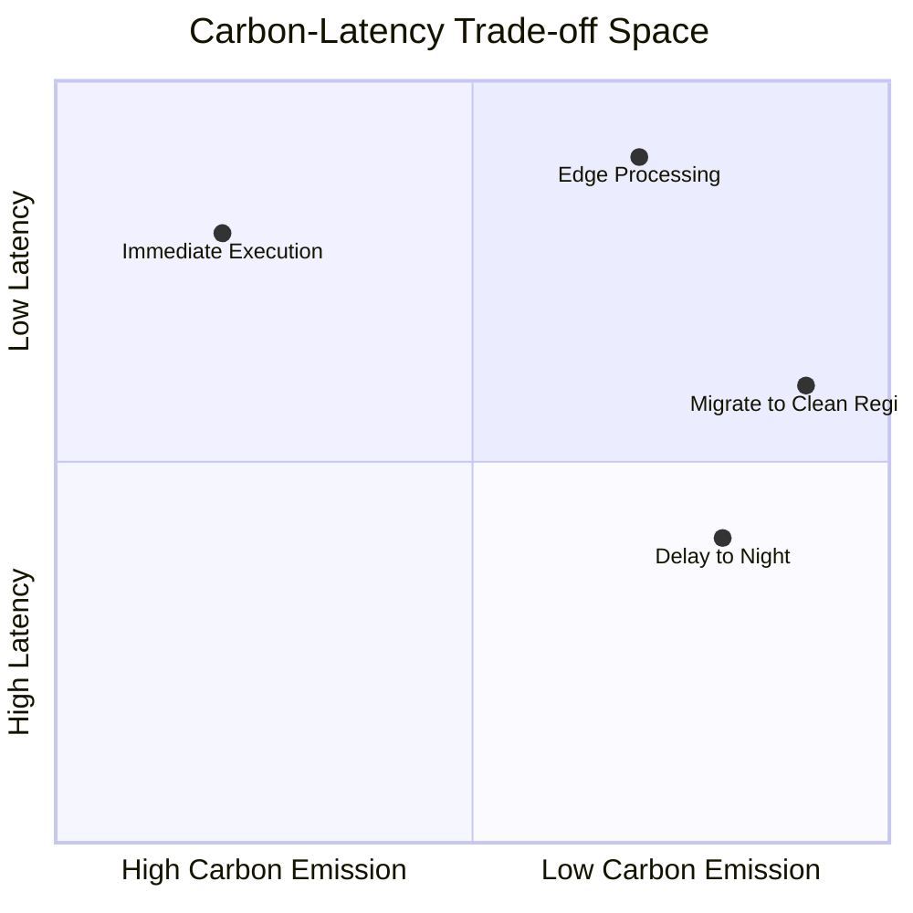
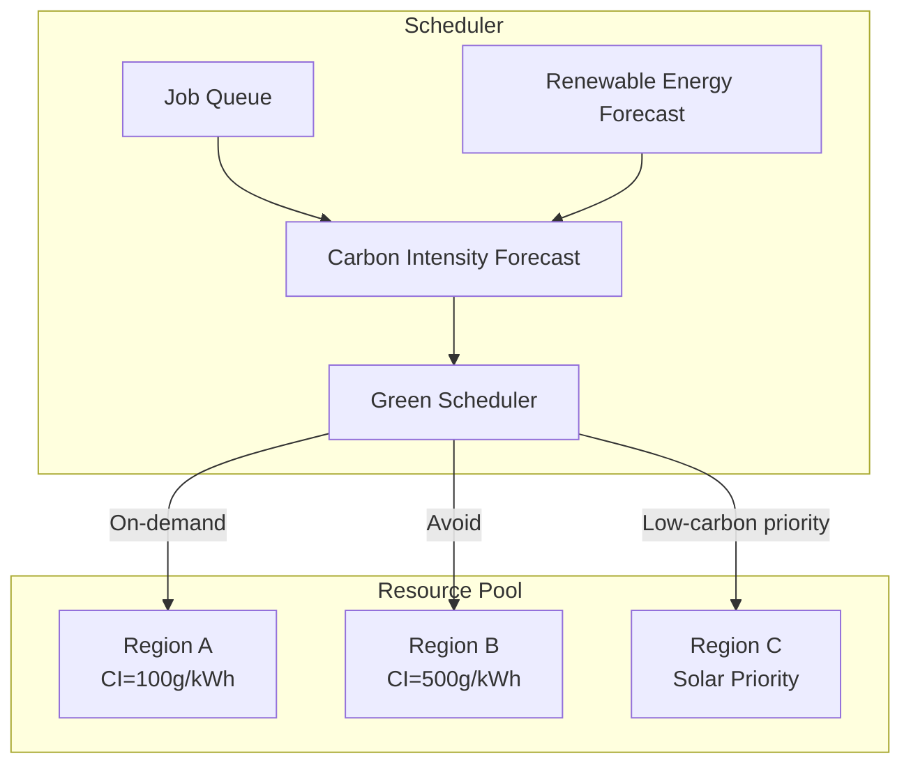
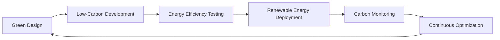

# Green AI Streaming: Low-Carbon Stream Processing Architecture

> **Stage**: Knowledge/06-frontier/green-ai-streaming | **Prerequisites**: [realtime-ai-streaming-2026.md](../realtime-ai-streaming-2026.md) | **Formalization Level**: L3-L4
> **Document Status**: v1.0 | **Created Date**: 2026-04-13

---

## Table of Contents

- [Green AI Streaming: Low-Carbon Stream Processing Architecture](#green-ai-streaming-low-carbon-stream-processing-architecture)
  - [Table of Contents](#table-of-contents)
  - [1. Concept Definitions](#1-concept-definitions)
    - [Def-K-06-GREEN-01: Carbon-Aware Stream Processing](#def-k-06-green-01-carbon-aware-stream-processing)
    - [Def-K-06-GREEN-02: Energy Efficiency Model](#def-k-06-green-02-energy-efficiency-model)
    - [Def-K-06-GREEN-03: Green AI Inference](#def-k-06-green-03-green-ai-inference)
  - [2. Carbon Footprint Quantification Model](#2-carbon-footprint-quantification-model)
    - [2.1 Stream Processing System Carbon Emission Formula](#21-stream-processing-system-carbon-emission-formula)
    - [2.2 AI Model Carbon Cost](#22-ai-model-carbon-cost)
  - [3. Green Architecture Patterns](#3-green-architecture-patterns)
    - [Pattern 1: Carbon-Aware Scheduling](#pattern-1-carbon-aware-scheduling)
    - [Pattern 2: Dynamic Precision Adjustment](#pattern-2-dynamic-precision-adjustment)
    - [Pattern 3: Edge-Cloud Collaboration](#pattern-3-edge-cloud-collaboration)
    - [Pattern 4: Renewable Energy Awareness](#pattern-4-renewable-energy-awareness)
  - [4. Energy Efficiency Optimization Techniques](#4-energy-efficiency-optimization-techniques)
    - [4.1 Hardware-Level Optimization](#41-hardware-level-optimization)
    - [4.2 Algorithm-Level Optimization](#42-algorithm-level-optimization)
    - [4.3 System-Level Optimization](#43-system-level-optimization)
  - [5. Industry Practices and Cases](#5-industry-practices-and-cases)
    - [Case 1: Data Center Carbon Neutrality](#case-1-data-center-carbon-neutrality)
    - [Case 2: Edge AI Energy Efficiency Optimization](#case-2-edge-ai-energy-efficiency-optimization)
  - [6. Evaluation and Metrics](#6-evaluation-and-metrics)
    - [6.1 Green KPIs](#61-green-kpis)
    - [6.2 Comparison Baselines](#62-comparison-baselines)
  - [7. Visualizations](#7-visualizations)
    - [Carbon-Aware Scheduling Architecture](#carbon-aware-scheduling-architecture)
    - [Green Stream Processing Lifecycle](#green-stream-processing-lifecycle)
  - [8. References](#8-references)

---

## 1. Concept Definitions

### Def-K-06-GREEN-01: Carbon-Aware Stream Processing

**Definition (Carbon-Aware Stream Processing)**:

Carbon-aware stream processing is a stream computing paradigm that treats carbon emissions as a first-class scheduling constraint:

$$
\mathcal{G}_{streaming} ::= (\mathcal{J}, \mathcal{R}, C_{carbon}, \Omega_{energy}, \mathcal{P}_{green})
$$

| Component | Semantics |
|-----------|-----------|
| $\mathcal{J}$ | Stream processing job set |
| $\mathcal{R}$ | Resource pool (with carbon intensity attributes) |
| $C_{carbon}$ | Carbon emission cost function |
| $\Omega_{energy}$ | Energy mix (renewable/fossil) |
| $\mathcal{P}_{green}$ | Green scheduling policy |

**Carbon Intensity Index**:

$$
CI_{location}(t) = \frac{CO_2e \text{ emitted}}{kWh \text{ consumed}} \text{ at location, time } t
$$

**Global data center carbon intensity range**: 20g/kWh (Norway) ~ 700g/kWh (coal-heavy regions)

---

### Def-K-06-GREEN-02: Energy Efficiency Model

**Definition (Energy Efficiency Index)**:

$$
\text{Energy Efficiency} = \frac{\text{Useful Work}}{\text{Energy Consumed}}
$$

**Stream Processing Specific Metrics**:

| Metric | Formula | Description |
|--------|---------|-------------|
| Records per kWh | $\frac{R_{processed}}{E_{total}}$ | Records processed per kWh |
| Carbon per TB | $\frac{CO_2e}{Data_{TB}}$ | Carbon emission per TB of data |
| Energy Delay Product | $E \times D$ | Energy-delay product |
| Carbon SLA | $P(CO_2e < threshold) > 0.95$ | Carbon emission service level |

---

### Def-K-06-GREEN-03: Green AI Inference

**Definition (Green AI Inference)**:

A methodology for optimizing energy efficiency during the AI inference phase:

$$
\text{GreenAI} = \arg\min_{model} \frac{Carbon(model)}{Accuracy(model) \geq threshold}
$$

**Technical Dimensions**:

```
Green AI Techniques
├── Model Compression
│   ├── Quantization (INT8/INT4)
│   ├── Pruning
│   └── Distillation
├── Dynamic Inference
│   ├── Early Exit
│   ├── Adaptive Depth
│   └── Input-Dependent Inference
├── Hardware Co-design
│   ├── NPU/GPU Energy-Efficient Selection
│   ├── Dynamic Frequency Scaling
│   └── Heterogeneous Scheduling
└── Renewable Energy
    ├── Solar Priority
    ├── Wind Balancing
    └── Energy Storage Buffer
```

---

## 2. Carbon Footprint Quantification Model

### 2.1 Stream Processing System Carbon Emission Formula

**Total Carbon Emissions**:

$$
CO_2e_{total} = CO_2e_{compute} + CO_2e_{storage} + CO_2e_{network} + CO_2e_{cooling}
$$

**Compute Emissions**:

$$
CO_2e_{compute} = \sum_{t} P_{server}(t) \times CI_{grid}(t) \times \Delta t
$$

Where:

- $P_{server}$: Server power (kW)
- $CI_{grid}$: Grid carbon intensity (gCO2e/kWh)
- $PUE$: Power usage effectiveness (typical value 1.2-1.6)

**Flink Job Carbon Estimation**:

```python
def estimate_flink_carbon(job_config, duration_hours):
    # Base power (idle)
    p_base = 0.2  # kW per TaskManager

    # Processing power (proportional to throughput)
    p_compute = job_config['throughput'] * 0.001  # kW per 1000 records/s

    # Total power
    p_total = (p_base + p_compute) * job_config['parallelism'] * PUE

    # Carbon emissions
    energy_kwh = p_total * duration_hours
    co2e = energy_kwh * CI_grid[region]

    return co2e
```

---

### 2.2 AI Model Carbon Cost

**Training Carbon Cost** (one-time):

$$
CO_2e_{training} = Hours \times GPUs \times Power_{GPU} \times CI_{location}
$$

**Inference Carbon Cost** (ongoing):

$$
CO_2e_{inference} = Queries \times Energy_{per\_query} \times CI_{location}
$$

**LLM Example**:

| Model | Energy per Inference | Carbon per Inference (500g/kWh) |
|-------|----------------------|---------------------------------|
| GPT-4 class | ~0.5 kWh | ~250g CO2e |
| Llama-3 70B | ~0.1 kWh | ~50g CO2e |
| Llama-3 8B | ~0.01 kWh | ~5g CO2e |
| Quantized INT4 8B | ~0.005 kWh | ~2.5g CO2e |

---

## 3. Green Architecture Patterns

### Pattern 1: Carbon-Aware Scheduling

**Principle**: Schedule jobs to the spatiotemporal location with the lowest carbon intensity

**Algorithm**:

```
for each job in queue:
    best_location = argmin(CI(location, time) for location in available)
    schedule(job, best_location)
```

**Latency-Carbon Trade-off**:



---

### Pattern 2: Dynamic Precision Adjustment

**Principle**: Dynamically adjust AI model precision based on confidence

```python
class AdaptivePrecision:
    def process(self, input_data):
        # First try low-precision model
        result, confidence = model_int4(input_data)

        if confidence < threshold:
            # Upgrade to high precision
            result, confidence = model_fp16(input_data)

        if confidence < threshold:
            # Finally use full precision
            result = model_fp32(input_data)

        return result
```

**Energy Efficiency Improvement**: 2-10x (depending on data distribution)

---

### Pattern 3: Edge-Cloud Collaboration

**Architecture**:

```
Data Source → Edge Preprocessing → [Filtering/Aggregation] → Cloud Deep Analysis
                    ↓
            Local Decision (Low Latency + Low Carbon)
```

**Carbon Savings Calculation**:

$$
Savings = 1 - \frac{CO_2e_{edge} + CO_2e_{reduced\_cloud}}{CO_2e_{original\_cloud}}
$$

Typical savings: 30-70%

---

### Pattern 4: Renewable Energy Awareness

**Real-time Scheduling**:

```python
def renewable_aware_schedule(jobs, solar_forecast):
    schedule = []
    for t in time_slots:
        available_energy = solar_forecast[t]
        scheduled_jobs = []

        for job in jobs:
            if job.energy <= available_energy:
                scheduled_jobs.append(job)
                available_energy -= job.energy

        schedule[t] = scheduled_jobs
    return schedule
```

---

## 4. Energy Efficiency Optimization Techniques

### 4.1 Hardware-Level Optimization

| Technique | Principle | Energy Saving Effect |
|-----------|-----------|----------------------|
| ARM Processors | Low-power design | 3-5x vs x86 |
| Dedicated NPUs | AI inference acceleration | 10-100x vs GPU |
| Liquid Cooling | Reduce PUE | PUE 1.03 vs 1.5 |
| Renewable Energy | Clean electricity | Carbon intensity ↓90% |

### 4.2 Algorithm-Level Optimization

| Technique | Principle | Applicable Scenario |
|-----------|-----------|---------------------|
| Approximate Computing | Allow tiny errors | Monitoring aggregation |
| Sparse Activation | Process only valid data | Event-driven |
| Incremental Computing | Reuse intermediate results | Window aggregation |
| Model Compression | Reduce parameter count | AI inference |

### 4.3 System-Level Optimization

**Flink Green Configuration**:

```yaml
# Enable energy-saving mode
execution.energy-saving-mode: true

# Dynamically adjust parallelism
execution.auto-parallelism.enabled: true
execution.auto-parallelism.target-utilization: 0.7

# Batch mode (non-real-time scenarios)
execution.runtime-mode: BATCH

# Compress transfers
taskmanager.memory.network.memory.fraction: 0.15
```

---

## 5. Industry Practices and Cases

### Case 1: Data Center Carbon Neutrality

**Company**: Google Cloud
**Strategy**:

- 100% renewable energy matching
- Carbon-aware workload migration
- Efficient cooling systems

**Results**:

- Data center PUE 1.10
- Carbon intensity reduced by 90%

### Case 2: Edge AI Energy Efficiency Optimization

**Scenario**: Smart traffic cameras
**Optimizations**:

- Edge preprocessing filters 95% of data
- INT8 quantized models
- Solar-powered

**Results**:

- Bandwidth reduced by 90%
- Inference energy consumption reduced by 75%
- Fully off-grid operation

---

## 6. Evaluation and Metrics

### 6.1 Green KPIs

| KPI | Target Value | Measurement Method |
|-----|--------------|--------------------|
| Carbon Efficiency | <100g CO2e/TB | Total emissions / processed data volume |
| Energy Efficiency | >1M records/kWh | Processed records / energy consumption |
| Renewable Energy Ratio | >80% | Green power / total power |
| Hardware Lifecycle | >5 years | Equipment replacement cycle |

### 6.2 Comparison Baselines

| System Type | Carbon Efficiency (gCO2e/TB) | Energy Efficiency (M records/kWh) |
|-------------|------------------------------|-----------------------------------|
| Traditional Batch Processing | 500-1000 | 0.1-0.5 |
| Standard Stream Processing | 300-500 | 0.5-1.0 |
| Optimized Stream Processing | 100-300 | 1.0-5.0 |
| Green Architecture | 20-100 | 5.0-20.0 |

---

## 7. Visualizations

### Carbon-Aware Scheduling Architecture



### Green Stream Processing Lifecycle



---

## 8. References


---

**Related Documents**:

- [Real-time AI and Stream Processing](../realtime-ai-streaming-2026.md)
- [Edge AI Streaming Architecture](../edge-ai-streaming-architecture.md)
- [AI Agent Streaming Architecture](../ai-agent-streaming-architecture.md)
