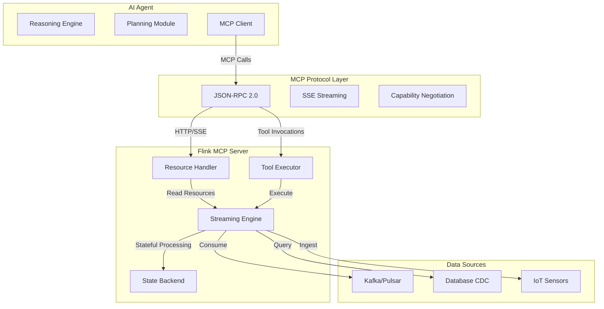
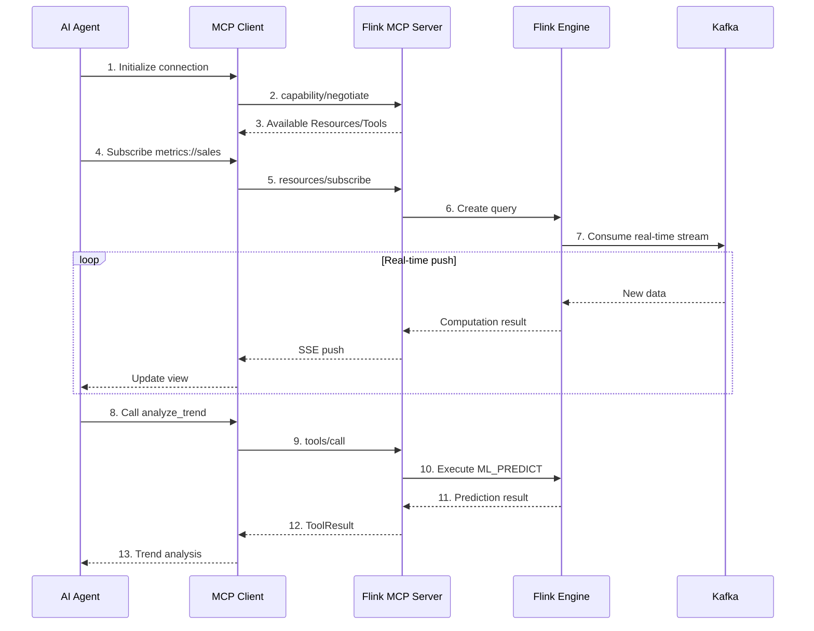
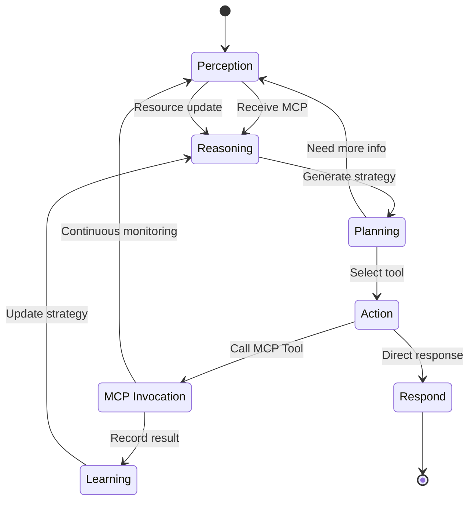
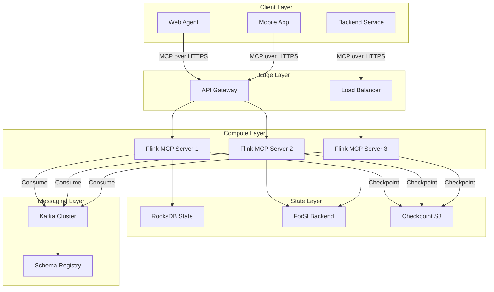

# MCP Protocol and Stream Processing Integration Architecture

> **Status**: Forward-looking | **Estimated Release**: 2026-06 | **Last Updated**: 2026-04-12
>
> ⚠️ The features described in this document are in early discussion stages and have not been officially released. Implementation details may change.

> Stage: Knowledge/06-frontier | Prerequisites: [Flink LLM Integration](./real-time-rag-architecture.md), [RAG Architecture](./real-time-rag-architecture.md) | Formalization Level: L3-L4

## 1. Definitions

### Def-K-06-220: Model Context Protocol (MCP)

**MCP** is an open protocol standard proposed by Anthropic in 2024 for standardizing context interaction between AI models and external data sources/tools:

$$
\text{MCP} \triangleq \langle \mathcal{S}, \mathcal{C}, \mathcal{R}, \mathcal{T}, \mathcal{P} \rangle
$$

Where:

- $\mathcal{S}$: Set of Servers providing context capabilities
- $\mathcal{C}$: Set of Clients consuming context services
- $\mathcal{R}$: Resources, readable data structures
- $\mathcal{T}$: Tools, invocable functional units
- $\mathcal{P}$: Prompts, templated instructions

**Key Features**:

- Based on JSON-RPC 2.0 transport
- Supports Server-Sent Events (SSE) streaming transport
- Bidirectional communication capability
- Type-safe interface contracts

### Def-K-06-221: MCP Server

**MCP Server** is the protocol provider, exposing resource and tool capabilities:

```typescript
interface MCPServer {
  // Metadata
  name: string;
  version: string;

  // Capability declaration
  capabilities: {
    resources?: boolean;
    tools?: boolean;
    prompts?: boolean;
    streaming?: boolean;
  };

  // Resource list
  resources: Resource[];

  // Tool list
  tools: Tool[];
}
```

**Flink as MCP Server**:
Flink stream processing jobs can be wrapped as an MCP Server, exposing real-time computation results as Resources and stream processing operators as Tools.

### Def-K-06-222: MCP Client

**MCP Client** is the protocol consumer, connecting to and invoking Server capabilities:

```typescript
interface MCPClient {
  // Connection management
  connect(serverEndpoint: string): Promise<void>;
  disconnect(): Promise<void>;

  // Resource operations
  listResources(): Promise<Resource[]>;
  readResource(uri: string): Promise<ResourceContent>;
  subscribe(uri: string, callback: Handler): Promise<void>;

  // Tool invocation
  listTools(): Promise<Tool[]>;
  callTool(name: string, args: object): Promise<ToolResult>;
}
```

### Def-K-06-223: Resources and Tools

**Resources** (Context Resources):

- Read-only data structures
- Identified by URI
- Support subscription to changes
- Examples: Real-time metrics streams, user behavior logs, sensor data

**Tools** (Invocable Tools):

- Executable functions
- Have input/output schemas
- Support streaming returns
- Examples: Aggregation queries, anomaly detection, predictive inference

### Def-K-06-224: Streaming Context Flow

**Streaming Context Flow** is defined as a continuously updated context data pipeline:

$$
\text{SCF} \triangleq \langle \mathcal{D}, \mathcal{F}, \Delta t \rangle
$$

Where:

- $\mathcal{D}$: Data stream (Flink DataStream)
- $\mathcal{F}$: Context transformation function
- $\Delta t$: Update interval

### Def-K-06-225: Agent Workflow Orchestration

**Agent Workflow** is an MCP-based automated decision process:

```
Perception → Reasoning → Action → Learning
        ↑___________________________________|
```

## 2. Properties

### Lemma-K-06-210: MCP Protocol Latency Bound

**Lemma**: The end-to-end latency of an MCP protocol call satisfies:

$$
L_{\text{MCP}} \leq L_{\text{network}} + L_{\text{serialization}} + L_{\text{processing}} + L_{\text{stream}}
$$

Where $L_{\text{stream}}$ is the inherent stream processing latency (typically 100ms-10s).

**Proof Sketch**:

- Network latency: Typical < 50ms (same region)
- Serialization: JSON parsing < 10ms
- Processing latency: Depends on tool complexity
- Stream latency: Flink Checkpoint period

### Prop-K-06-210: Streaming Resource Freshness

**Proposition**: The freshness of a streaming Resource exposed through MCP is limited by:

$$
\text{Freshness} = t_{\text{now}} - t_{\text{last\_checkpoint}}
$$

**Engineering Implications**:

- Configure `FRESHNESS INTERVAL` to control update frequency
- Use `FOR SYSTEM_TIME AS OF` to query historical versions

### Prop-K-06-211: Tool Invocation Idempotency

**Proposition**: For Tools derived from stream data, idempotency is satisfied under stateless design:

$$
\forall x: \text{Tool}(x) = \text{Tool}(\text{Tool}(x))
$$

**Constraints**:

- Tool does not modify external state
- Input parameters contain deterministic timestamps
- Avoid reliance on external mutable state

### Lemma-K-06-211: Concurrent Tool Invocation Safety

**Lemma**: The MCP protocol natively supports concurrent Tool invocations, but must satisfy:

$$
\forall t_1, t_2 \in \mathcal{T}, t_1 \parallel t_2 \Rightarrow \text{State}(t_1) \cap \text{State}(t_2) = \emptyset
$$

**Engineering Practice**:

- Use Flink KeyedProcessFunction to ensure partition isolation
- Prevent state bloat through state TTL

## 3. Relations

### 3.1 MCP vs Function Calling Comparison

| Dimension | Function Calling | MCP Protocol |
|-----------|------------------|--------------|
| **Standardization** | Vendor-specific per model | Open standard |
| **Transport** | HTTP/Model-specific | JSON-RPC 2.0/SSE |
| **Discovery** | Static definitions | Dynamic capability negotiation |
| **Bidirectional** | Unidirectional call | Bidirectional streaming |
| **Ecosystem** | Closed | Open Server ecosystem |

### 3.2 Stream Processing and MCP Integration Architecture

```
┌─────────────────────────────────────────────────────────────────┐
│                        AI Agent (Client)                        │
│  ┌──────────────┐  ┌──────────────┐  ┌──────────────────────┐  │
│  │  Reasoning   │  │  Planning    │  │  Tool Use            │  │
│  │  Engine      │  │  Module      │  │  (MCP Client)        │  │
│  └──────────────┘  └──────────────┘  └──────────────────────┘  │
└───────────────────────────┬─────────────────────────────────────┘
                            │ MCP Protocol (JSON-RPC/SSE)
┌───────────────────────────┴─────────────────────────────────────┐
│                    Flink MCP Server                             │
│  ┌──────────────────────────────────────────────────────────┐  │
│  │                    Resources                              │  │
│  │  - Real-time Metrics    - User Events                    │  │
│  │  - Sensor Data          - Business KPIs                  │  │
│  └──────────────────────────────────────────────────────────┘  │
│  ┌──────────────────────────────────────────────────────────┐  │
│  │                      Tools                                │  │
│  │  - Aggregate Query      - Anomaly Detection              │  │
│  │  - Trend Analysis       - Prediction                     │  │
│  └──────────────────────────────────────────────────────────┘  │
│  ┌──────────────────────────────────────────────────────────┐  │
│  │              Flink Streaming Engine                       │  │
│  │  DataStream API / Table API / SQL                         │  │
│  └──────────────────────────────────────────────────────────┘  │
└─────────────────────────────────────────────────────────────────┘
```

### 3.3 Architecture Layer Mapping

| Layer | Component | Responsibility |
|-------|-----------|----------------|
| **L1: Protocol Layer** | MCP JSON-RPC | Communication standardization |
| **L2: Service Layer** | MCP Server | Capability exposure |
| **L3: Compute Layer** | Flink | Stream processing |
| **L4: Storage Layer** | Kafka/Pulsar | Data persistence |
| **L5: Source Layer** | IoT/Logs/Business DB | Data generation |

### 3.4 MCP Ecosystem Status and Governance

MCP was launched by Anthropic in 2024-11 and is now governed by the **Linux Foundation AAIF** (AI Alliance Innovation Foundation)[^1]. As of 2026-02, the MCP ecosystem has reached **~97M monthly downloads**, with public MCP servers exceeding **5800+**[^2].

#### Def-K-06-226: MCP Ecosystem

**MCP Ecosystem** is defined as the collection of service providers, client hosts, tool developers, and governance organizations formed around the Model Context Protocol:

$$
\text{MCP-Eco} \triangleq \langle \mathcal{S}_{pub}, \mathcal{H}_{client}, \mathcal{D}_{tool}, \mathcal{G}_{AAIF} \rangle
$$

Where:

- $\mathcal{S}_{pub}$: Public MCP Server collection (~5800+)
- $\mathcal{H}_{client}$: Host application collection (IDEs, chat clients, etc.)
- $\mathcal{D}_{tool}$: Tool developer community
- $\mathcal{G}_{AAIF}$: Linux Foundation AAIF governance body

**Governance Characteristics**:
- Open Standard: Protocol specifications maintained and evolved by AAIF
- Community-driven: Server registration, capability classification, and security audits contributed by the community
- Vendor-neutral: Anthropic retains the initiator role, but protocol decisions are led by the foundation

## 4. Argumentation

### 4.1 Why Use Stream Processing as an MCP Server?

**Traditional Scheme Problems**:

- Polling database: High latency, heavy load
- Static files: No real-time capability
- Message queue: Requires clients to understand queue semantics

**Stream Processing Advantages**:

- Continuous computation: Data changes are reflected instantly
- Complex processing: Window aggregation, CEP, ML inference
- Horizontal scaling: Processing capacity scales automatically with load
- Fault tolerance guarantee: Exactly-Once semantics

### 4.2 Anti-patterns: Design Pitfalls to Avoid

**Anti-pattern 1: Over-exposing Internal State**

```python
# ❌ Wrong: exposing raw state handle
@app.resource("state://internal")
def get_internal_state():
    return flink_state_backend.get_raw()  # Dangerous!
```

**Anti-pattern 2: Blocking Tool Implementation**

```python
# ❌ Wrong: synchronously waiting for Flink results
@app.tool()
def analyze_trend_blocking(params):
    result = flink_client.execute_sync(sql)  # Blocking!
    return result
```

**Anti-pattern 3: Unbounded State Growth**

```python
# ❌ Wrong: state without TTL
class StatefulTool:
    def __init__(self):
        self.cache = {}  # Continuously growing!
```

## 5. Proof / Engineering Argument

### Thm-K-06-145: Streaming Context Consistency Theorem

**Theorem**: In the architecture where Flink serves as an MCP Server, Resources read by the client satisfy causal consistency:

$$
\forall r_1, r_2 \in \text{Resources}: \text{if } r_1 \prec r_2 \text{ then } \text{read}(r_1) \text{ before } \text{read}(r_2)
$$

**Proof**:

1. Flink's Watermark mechanism guarantees event-time ordering
2. Checkpoint barriers guarantee consistent processing boundaries
3. MCP's SSE transport preserves message order
4. Therefore, the order observed by the client is causally consistent with events

### Thm-K-06-146: Tool Invocation Safety Theorem

**Theorem**: Under correct security configuration, MCP Tool invocations satisfy:

$$
\text{Isolated}(\text{Tool}_i) \land \text{Authenticated}(\text{Client}) \Rightarrow \text{Safe}(\text{Invocation})
$$

**Engineering Implementation**:

1. **Isolation**: Using Flink Task Slot isolation
2. **Authentication**: JWT Token verification
3. **Authorization**: RBAC permission checks
4. **Rate Limiting**: Token Bucket to prevent abuse

### Thm-K-06-147: Streaming Update Completeness Theorem

**Theorem**: Clients subscribing to Resource changes will receive all updates, without loss or duplication:

$$
\forall u \in \text{Updates}: \Diamond \text{delivered}(u) \land \neg \exists u': \text{duplicate}(u, u')
$$

**Dependency Conditions**:

- Flink Exactly-Once semantics
- MCP acknowledgement mechanism (ACK)
- Persistent offset management

## 6. Examples

### 6.1 Flink MCP Server Implementation

```python
# mcp_flink_server.py
from mcp.server.fastmcp import FastMCP
from pyflink.datastream import StreamExecutionEnvironment
import json

mcp = FastMCP("FlinkAnalytics")

# Define real-time metrics Resource
@mcp.resource("metrics://realtime/sales")
def get_realtime_sales() -> str:
    """Get real-time sales metrics"""
    # Query current metrics view from Flink
    result = flink_table_env.execute_sql("""
        SELECT
            TUMBLE_START(event_time, INTERVAL '1' MINUTE) as window_start,
            SUM(amount) as total_sales,
            COUNT(*) as order_count
        FROM sales_events
        GROUP BY TUMBLE(event_time, INTERVAL '1' MINUTE)
    """)
    return json.dumps(result)

# Define trend analysis Tool
@mcp.tool()
def analyze_sales_trend(time_range: str) -> dict:
    """
    Analyze sales trend

    Args:
        time_range: Time range (1h, 24h, 7d)
    """
    sql = f"""
        SELECT
            trend_direction,
            growth_rate,
            forecast_next_hour
        FROM ML_PREDICT(-- Note: ML_PREDICT is an experimental feature
            'sales_forecast_model',
            DESCRIPTOR(event_time)
        )
        WHERE window_time > NOW() - INTERVAL '{time_range}'
    """
    return flink_table_env.execute_sql(sql).fetch_all()

# Start Server
if __name__ == "__main__":
    mcp.run(transport='sse')  # Server-Sent Events
```

### 6.2 MCP Client Usage Example

```python
# agent_client.py
from mcp import ClientSession, StdioServerParameters
from mcp.client.stdio import stdio_client

async def run_agent():
    # Connect to Flink MCP Server
    server_params = StdioServerParameters(
        command="python",
        args=["mcp_flink_server.py"]
    )

    async with stdio_client(server_params) as (read, write):
        async with ClientSession(read, write) as session:
            # Initialize
            await session.initialize()

            # List available Resources
            resources = await session.list_resources()
            print(f"Available resources: {[r.uri for r in resources.resources]}")

            # Read real-time metrics
            sales_data = await session.read_resource(
                "metrics://realtime/sales"
            )

            # Call trend analysis Tool
            trend_result = await session.call_tool(
                "analyze_sales_trend",
                {"time_range": "24h"}
            )

            # Agent decision
            if trend_result["growth_rate"] > 0.1:
                await send_alert("Sales growth exceeded 10%!")
```

### 6.3 Streaming Data Subscription

```python
# streaming_subscription.py
@mcp.resource("stream://events/user_activity")
async def subscribe_user_activity():
    """Real-time user activity stream"""
    # Create Flink DataStream
    env = StreamExecutionEnvironment.get_execution_environment()
    stream = env.from_source(
        KafkaSource.builder()
        .set_bootstrap_servers("kafka:9092")
        .set_topics("user-events")
        .build(),
        WatermarkStrategy.for_monotonous_timestamps(),
        "kafka-source"
    )

    # Real-time processing and SSE push
    async for event in stream:
        yield {
            "user_id": event["user_id"],
            "action": event["action"],
            "timestamp": event["timestamp"],
            "enriched": await enrich_user_data(event["user_id"])
        }
```

### 6.4 Complete Agent Workflow

```python
# agent_workflow.py
class StreamingAnalyticsAgent:
    def __init__(self):
        self.mcp_client = MCPClient()
        self.llm = OpenAIChatModel()

    async def handle_user_query(self, query: str):
        """Handle user analytics query"""

        # Step 1: LLM understands intent and plans tool calls
        plan = await self.llm.generate(
            f"Based on available tools, plan how to answer: {query}\n"
            f"Available tools: analyze_sales_trend, detect_anomaly, compare_metrics"
        )

        # Step 2: Execute tool calls (via MCP)
        results = []
        for tool_call in plan.tool_calls:
            result = await self.mcp_client.call_tool(
                tool_call.name,
                tool_call.arguments
            )
            results.append(result)

        # Step 3: Subscribe to real-time updates
        subscription = await self.mcp_client.subscribe(
            "metrics://realtime/sales"
        )

        # Step 4: Generate final answer
        answer = await self.llm.generate(
            f"Based on the following data, generate an analysis report:\n"
            f"{results}\n"
            f"User question: {query}"
        )

        return answer, subscription

# Usage example
async def main():
    agent = StreamingAnalyticsAgent()
    answer, live_feed = await agent.handle_user_query(
        "How have sales trends been in the past 24 hours? Any anomalies?"
    )

asyncio.run(main())
```

## 7. Visualizations

### 7.1 MCP-Flink Integration Architecture Diagram



### 7.2 Real-time Data Processing Flow



### 7.3 Agent Decision Workflow



### 7.4 Deployment Topology



## 8. References

[^1]: Anthropic, "Model Context Protocol", 2024-11. https://modelcontextprotocol.io/
[^2]: Linux Foundation AAIF, "MCP Ecosystem Report", 2026-02. https://lf-ai-foundation.org/
