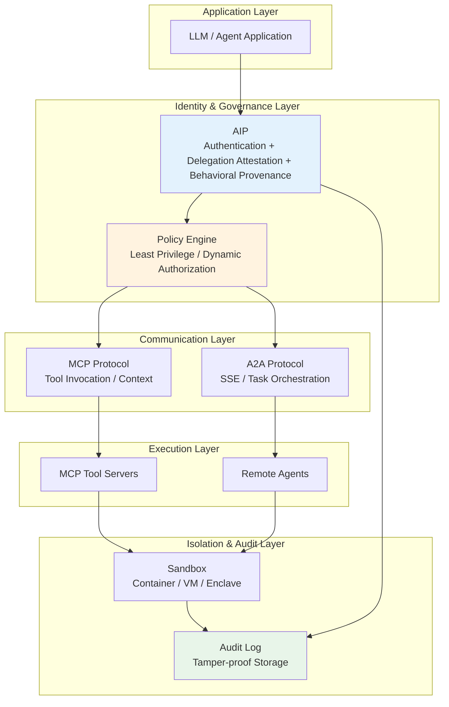
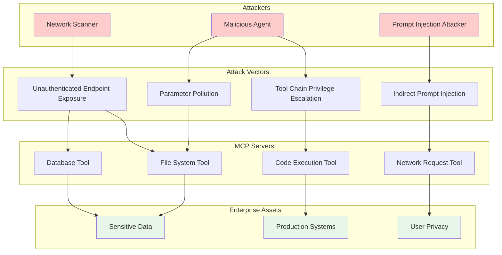
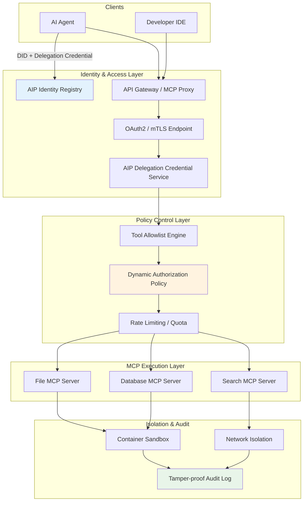
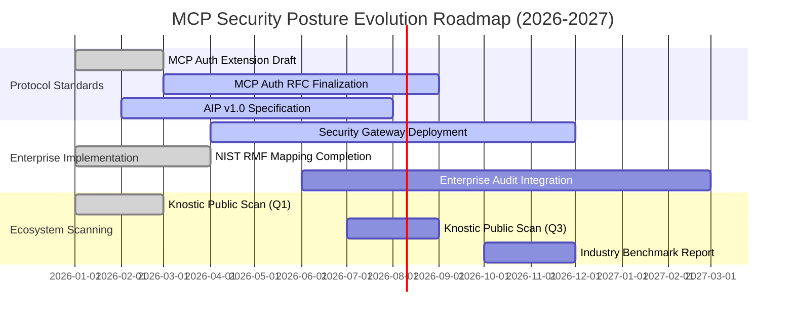
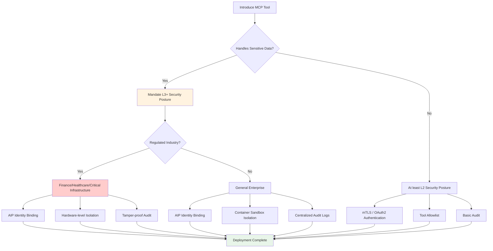

# MCP Security Governance and Enterprise Deployment Guide (2026)

> **Status**: Forward-looking | **Estimated Release**: 2026-06 | **Last Updated**: 2026-04-14
>
> ⚠️ The security posture described in this document is based on publicly released security research reports in 2026; relevant policies and standards are still evolving rapidly.

> **Stage**: Knowledge/06-frontier | **Prerequisites**: [ai-agent-streaming-architecture.md](ai-agent-streaming-architecture.md), [ai-agent-a2a-protocol.md](ai-agent-a2a-protocol.md) | **Formality Level**: L3-L4

---

## 1. Definitions

### Def-K-06-300: MCP Security Posture

**Definition**: The MCP security posture describes the security state of Model Context Protocol servers across four dimensions—authentication, authorization, auditing, and isolation—formalized as a quadruple:

$$
\mathcal{S}_{mcp} \triangleq \langle \mathcal{A}_{auth}, \mathcal{A}_{authz}, \mathcal{A}_{audit}, \mathcal{A}_{iso} \rangle
$$

Where:

| Component | Symbol | Formal Definition | Functional Description |
|-----------|--------|-------------------|------------------------|
| **Authentication** | $\mathcal{A}_{auth}$ | $\{none, token, mTLS, OAuth2\}$ | Client identity confirmation mechanism |
| **Authorization** | $\mathcal{A}_{authz}$ | $\mathcal{P}(client) \times \mathcal{R}(resource) \rightarrow \{allow, deny\}$ | Resource access control decision |
| **Audit** | $\mathcal{A}_{audit}$ | $\{log, trace, attest\}^*$ | Operation recording and traceability |
| **Isolation** | $\mathcal{A}_{iso}$ | $\{process, container, vm, enclave\}$ | Execution environment boundary protection |

**Security Posture Levels**:

| Level | Condition | Description |
|-------|-----------|-------------|
| **L0 - Unprotected** | $\mathcal{A}_{auth} = none \land \mathcal{A}_{authz} = \top$ | Any client has full access |
| **L1 - Basic Protection** | $\mathcal{A}_{auth} \neq none$ | At least one authentication mechanism |
| **L2 - Standard Protection** | $\mathcal{A}_{auth} \neq none \land \mathcal{A}_{authz} \neq \top$ | Authentication + fine-grained authorization |
| **L3 - Enterprise Protection** | L2 + $\mathcal{A}_{audit} \neq \emptyset \land \mathcal{A}_{iso} \neq process$ | Full auditing + environment isolation |
| **L4 - High Assurance** | L3 + $\mathcal{A}_{auth} = mTLS/OAuth2 \land \mathcal{A}_{iso} \in \{vm, enclave\}$ | Mutual authentication + hardware-level isolation |

---

### Def-K-06-301: MCP Threat Model

**Definition**: The MCP threat model is formalized as the combination of attacker capability sets and system asset exposure surfaces:

$$
\mathcal{T}_{mcp} \triangleq \langle \mathcal{K}, \mathcal{C}, \mathcal{I}, \mathcal{G} \rangle
$$

Where:

- **$\mathcal{K}$ (Knowledge)**: The attacker's knowledge of MCP server interface specifications, tool lists, and input parameters
- **$\mathcal{C}$ (Capability)**: The set of MCP tools the attacker can invoke, $\mathcal{C} = \{c_1, c_2, ..., c_n\}$
- **$\mathcal{I}$ (Intent)**: Attack objectives, $\mathcal{I} \in \{data\_exfiltration, privilege\_escalation, remote\_execution, denial\_of\_service\}$
- **$\mathcal{G}$ (Gain)**: The payoff function after a successful attack, $\mathcal{G}: \mathcal{I} \rightarrow \mathbb{R}^+$

**Key Attack Vectors**:

| Vector | Formal Description | Risk Level |
|--------|-------------------|------------|
| **Tool Injection** | $\exists c \in \mathcal{C}: inject(c, payload) \rightarrow RCE$ | Critical |
| **Data Exfiltration** | $\exists c \in \mathcal{C}: c(query) \rightarrow data\_leak$ | Critical |
| **Privilege Escalation** | $\exists c_i, c_j \in \mathcal{C}: c_i \circ c_j \rightarrow elevated\_privilege$ | High |
| **Indirect Prompt Injection** | $\exists input: LLM(input) \rightarrow invoke(c_{malicious})$ | High |

---

### Def-K-06-302: Agent Identity Protocol (AIP)

**Definition**: AIP is a protocol framework that provides verifiable identity, delegated authorization, and behavioral provenance for AI Agents, formalized as a triple:

$$
\mathcal{P}_{aip} \triangleq \langle \mathcal{I}_{agent}, \mathcal{D}_{attest}, \mathcal{V}_{prov} \rangle
$$

Where:

| Component | Symbol | Formal Definition | Functional Description |
|-----------|--------|-------------------|------------------------|
| **Agent Identity** | $\mathcal{I}_{agent}$ | $\langle did, pk, metadata \rangle$ | Decentralized identifier + public key |
| **Delegation Attestation** | $\mathcal{D}_{attest}$ | $Sign_{pk_{owner}}(delegate, agent_{id}, scope, expiry)$ | Verifiable delegation credential |
| **Provenance Verification** | $\mathcal{V}_{prov}$ | $\{action\}^* \rightarrow \{verified, unverified\}$ | Verifiability check of action chains |

**Relationship between AIP and MCP/A2A**:

$$
\text{Security Layer} = \underbrace{\text{AIP}}_{\text{Identity + Delegation + Provenance}} + \underbrace{\text{MCP}}_{\text{Tool Invocation}} + \underbrace{\text{A2A}}_{\text{Inter-Agent Communication}}
$$

AIP fills the gaps in **authentication, delegated authorization, and behavioral provenance** that exist in MCP (tool layer) and A2A (communication layer).

---

### Def-K-06-303: AI Agent Compliance Framework

**Definition**: The AI Agent compliance framework is a set of security governance rules based on NIST AI RMF and NCCoE 2026 project requirements, formalized as:

$$
\mathcal{F}_{compliance} \triangleq \langle \mathcal{R}_{gov}, \mathcal{R}_{map}, \mathcal{R}_{measure}, \mathcal{R}_{manage} \rangle
$$

Where:

- **$\mathcal{R}_{gov}$ (Govern)**: Governance rule set, including role definition, responsibility assignment, and policy formulation
- **$\mathcal{R}_{map}$ (Map)**: Risk mapping rules, identifying the context, purpose, and stakeholders of Agent systems
- **$\mathcal{R}_{measure}$ (Measure)**: Measurement rules, quantifying risk indicators, performance indicators, and compliance indicators
- **$\mathcal{R}_{manage}$ (Manage)**: Management rules, defining risk response, monitoring, and continuous improvement processes

**Compliance State Function**:

$$
\text{Compliance}(system) = \bigwedge_{r \in \mathcal{F}_{compliance}} satisfy(system, r)
$$

---

## 2. Properties

### Prop-K-06-300: MCP Unauthenticated Exposure Risk Boundary Theorem

**Proposition**: For an MCP server with security posture L0 ($\mathcal{A}_{auth} = none$), the attacker's expected cost of successful exploitation satisfies:

$$
E[cost_{attack}] \approx 0, \quad \text{when } \mathcal{A}_{auth} = none
$$

**Proof Sketch**:

1. **Zero-barrier access**: Any network entity that can discover the server endpoint can initiate a connection
2. **Low tool enumeration cost**: The MCP protocol typically exposes available tool lists (`tools/list`)
3. **Low parameter inference cost**: Valid inputs can be quickly inferred through LLMs or pattern analysis
4. **Knostic 2026 scanning empirical evidence**: Among approximately 2,000 public MCP servers, authentication coverage is 0%

**Corollary**: On unauthenticated MCP servers, the risk probability of data leakage and remote code execution approaches the network reachability probability:

$$
P(compromise) \approx P(network\_reachable)
$$

---

### Lemma-K-06-300: AIP Delegation Monotonicity Lemma

**Lemma**: AIP delegation attestations satisfy permission monotonic decreasing property:

$$
\forall d \in \mathcal{D}_{attest}: scope(d) \subseteq scope(owner)
$$

That is, an Agent's permission scope never exceeds its delegator's original permission scope.

**Proof Sketch**:

1. Delegation credentials are signed by the owner's private key and contain an explicit `scope` field
2. Verification nodes perform intersection operations when parsing delegation chains: $scope_{effective} = \bigcap_{i=1}^{n} scope_i$
3. Any delegation credential attempting to expand scope will fail cryptographic verification

---

## 3. Relations

### 3.1 MCP and AIP/A2A Security Layer Relationship



**Layer Responsibility Matrix**:

| Layer | Security Responsibility | Current Coverage (2026-Q2) | Key Gap |
|-------|------------------------|---------------------------|---------|
| **AIP** | Identity, delegation, provenance | ~5% (early draft) | Standardization progress is slow |
| **A2A** | OAuth2/mTLS | ~30% | Insufficient fine-grained authorization |
| **MCP** | Tool-level access control | ~0% (public servers) | Missing authentication mechanisms |
| **Sandbox** | Execution isolation | ~15% | Sandbox deployment costs are high |

---

### 3.2 NIST AI RMF to MCP Governance Mapping

| NIST AI RMF Function | MCP Governance Requirement | Implementation Control Points |
|---------------------|---------------------------|------------------------------|
| **GOVERN** | Establish MCP server asset inventory, responsibility matrix | CM-8, PM-5 |
| **MAP** | Identify MCP tool data access boundaries, risk exposure surfaces | RA-3, RA-7 |
| **MEASURE** | Continuously scan MCP server authentication status, vulnerability status | CA-7, PM-31 |
| **MANAGE** | Formulate MCP tool invocation allowlists, anomalous behavior response playbooks | IR-4, RA-9 |

---

### 3.3 Enterprise MCP Deployment Security Checklist

**Authentication**:

- [ ] All MCP servers must be configured with strong authentication (mTLS or OAuth2)
- [ ] Prohibit use of unauthenticated MCP servers in production environments
- [ ] Scan internal MCP server authentication coverage regularly (at least monthly)
- [ ] Use AIP to assign independent identities and delegation credentials to Agents invoking MCP tools

**Authorization**:

- [ ] Implement least privilege at the tool level
- [ ] Configure dynamic authorization policies: based on Agent identity, task context, time window
- [ ] Prohibit generic Admin credentials from accessing all MCP tools
- [ ] Regularly audit consistency between permission assignments and actual usage

**Audit**:

- [ ] Record complete parameters and return summaries for all MCP tool invocations
- [ ] Write audit logs to tamper-proof storage (WORM / blockchain / HSM-signed)
- [ ] Configure anomaly detection rules: high-frequency invocation, sensitive parameters, cross-domain tool chains
- [ ] Retain audit logs no less than regulatory requirements (Financial: 7 years, Healthcare: 6 years)

**Isolation**:

- [ ] MCP tool servers run in independent containers or VMs
- [ ] Network isolation: MCP servers and core databases communicate through API gateways or zero-trust networks
- [ ] Enable hardware-level isolation for highly sensitive tools (e.g., Intel TDX, AMD SEV)
- [ ] Prohibit MCP servers from directly accessing production privileged credentials or root certificates

---

## 4. Argumentation

### 4.1 Knostic 2026 Scan Results Analysis

**Statement of Fact**: In 2026, security vendor Knostic conducted an automated security scan of approximately 2,000 public MCP servers, with results showing:

- **Authentication coverage**: 0%
- **Authorization mechanism coverage**: < 5%
- **Input validation coverage**: ~20%
- **Sandbox isolation coverage**: ~10%

**Risk Analysis**:

| Risk Type | Impact | Probability | Risk Level |
|-----------|--------|-------------|------------|
| **Data Exfiltration** | Sensitive data extracted unauthorized via MCP tools | High | Critical |
| **Privilege Escalation** | Gaining higher system permissions through tool chain combinations | Medium | High |
| **Remote Code Execution** | Tool injection or parameter pollution leading to RCE | Medium | Critical |
| **Supply Chain Attack** | Malicious MCP servers distributed to end users | High | Critical |

**Argumentation**: The current public MCP ecosystem's security baseline is far below the minimum acceptable threshold for enterprise production (L2). Enterprises must implement additional security control layers when introducing MCP tools and cannot rely on MCP protocol-native security mechanisms.

---

### 4.2 Why MCP Authentication Absence is a Structural Problem

**Observation 1**: The MCP protocol was designed to simplify LLM and external tool integration; security features were considered later.

**Observation 2**: The MCP community is dominated by open-source tools whose maintainers lack security engineering resources.

**Observation 3**: The current MCP specification (as of 2026-Q2) does not list authentication as a MUST-implement item, leading to fragmented implementations.

**Argumentation**:

$$
\text{Authentication Absence} \Leftarrow \text{Loose Specification} + \text{Low Implementation Cost} + \text{Insufficient Security Incentives}
$$

This means authentication absence is not a single implementation issue but a structural defect of the protocol ecosystem. Enterprises must compensate through overlay security architecture rather than waiting for protocol-native fixes.

---

### 4.3 AIP's Reinforcement Mechanism for MCP Security

AIP reinforces MCP security shortcomings from three dimensions:

| Shortcoming | AIP Reinforcement Mechanism | Effect |
|-------------|---------------------------|--------|
| **No Authentication** | Agent DID + Public Key Binding | Every MCP call can be traced to a unique Agent |
| **No Delegation** | Verifiable Credentials (VC) | Limit the scope of MCP tools an Agent can invoke |
| **No Provenance** | Signed operation logs | Establish a non-repudiable audit chain |

**AIP-MCP Integration Pattern**:

```
┌─────────────────────────────────────────────────────────────┐
│              AIP + MCP Integration Invocation Flow          │
├─────────────────────────────────────────────────────────────┤
│                                                             │
│  1. Agent applies for DID and delegation credential from    │
│     AIP identity registry                                   │
│                                                             │
│  2. Before invoking MCP tool, Agent generates invocation    │
│     intent signature:                                       │
│     Sign(pk_agent, tool_name, params_hash, timestamp)       │
│                                                             │
│  3. MCP gateway verifies:                                   │
│     a) Signature validity                                   │
│     b) Whether delegation credential covers this tool       │
│     c) Whether timestamp is replay-safe                     │
│                                                             │
│  4. After verification, gateway proxies the call to the     │
│     MCP server                                              │
│                                                             │
│  5. Return result and invocation log are written to the     │
│     audit chain                                             │
│                                                             │
└─────────────────────────────────────────────────────────────┘
```

---

## 5. Engineering Argument

### 5.1 MCP Threat Model Architecture Diagram



---

### 5.2 Enterprise MCP Security Deployment Reference Architecture



---

### 5.3 Industry Compliance Impact Analysis

**Financial Industry**:

- **Regulatory Requirements**: SEC AI Guidance, EU AI Act (High-Risk Systems), Basel III Operational Risk Management
- **MCP Impact**: Any MCP tool connected to trading data or customer records must meet L4 security posture
- **Compliance Must-have**: AIP identity provenance + tamper-proof audit logs are hard requirements for regulatory review

**Healthcare Industry**:

- **Regulatory Requirements**: HIPAA (US), GDPR (EU), NIST AI RMF
- **MCP Impact**: PHI (Protected Health Information) access must go through least-privilege authorization and full auditing
- **Compliance Must-have**: MCP tool invocations must be decoupled from patient identity while retaining operational traceability

**Critical Infrastructure**:

- **Regulatory Requirements**: NIST CSF 2.0, IEC 62443, EO 14110
- **MCP Impact**: MCP integration into industrial control systems must be implemented through network isolation and hardware-level sandboxing
- **Compliance Must-have**: Prohibit any unverified MCP tool from directly accessing OT networks

---

## 6. Examples

### 6.1 MCP Security Configuration Check Script

```python
"""
MCP Server Security Configuration Scanner
Automated check tool based on Knostic 2026 research findings
"""

import asyncio
import json
from dataclasses import dataclass
from typing import List, Dict
from enum import Enum

class SecurityLevel(Enum):
    L0 = "Unprotected"
    L1 = "Basic Protection"
    L2 = "Standard Protection"
    L3 = "Enterprise Protection"
    L4 = "High Assurance"

@dataclass
class MCPSecurityPosture:
    server_url: str
    auth_mechanism: str
    authorization_enabled: bool
    audit_logging: bool
    isolation_level: str

    def evaluate(self) -> SecurityLevel:
        auth_map = {
            "none": 0, "token": 1, "oauth2": 2,
            "mtls": 3
        }
        iso_map = {
            "none": 0, "process": 1, "container": 2,
            "vm": 3, "enclave": 4
        }

        auth_score = auth_map.get(self.auth_mechanism, 0)
        authz_score = 1 if self.authorization_enabled else 0
        audit_score = 1 if self.audit_logging else 0
        iso_score = iso_map.get(self.isolation_level, 0)

        total = auth_score + authz_score + audit_score + iso_score

        if total >= 8:
            return SecurityLevel.L4
        elif total >= 6:
            return SecurityLevel.L3
        elif total >= 3:
            return SecurityLevel.L2
        elif total >= 1:
            return SecurityLevel.L1
        return SecurityLevel.L0

async def scan_mcp_server(url: str) -> MCPSecurityPosture:
    """Simulate MCP server security scan"""
    # Actual implementation should probe /health, /.well-known/mcp.json, etc.
    return MCPSecurityPosture(
        server_url=url,
        auth_mechanism="none",  # Knostic 2026 finding: public servers generally unauthenticated
        authorization_enabled=False,
        audit_logging=False,
        isolation_level="process"
    )

async def batch_scan(urls: List[str]) -> Dict:
    """Batch scan and generate report"""
    results = await asyncio.gather(*[scan_mcp_server(u) for u in urls])

    level_counts = {level: 0 for level in SecurityLevel}
    for r in results:
        level_counts[r.evaluate()] += 1

    return {
        "total_scanned": len(results),
        "level_distribution": {
            k.value: v for k, v in level_counts.items()
        },
        "l0_percentage": level_counts[SecurityLevel.L0] / len(results) * 100
    }

# Example run
if __name__ == "__main__":
    sample_urls = [
        "https://mcp-files.example.com",
        "https://mcp-db.example.com",
        "https://mcp-search.example.com"
    ]
    report = asyncio.run(batch_scan(sample_urls))
    print(json.dumps(report, indent=2, ensure_ascii=False))
```

---

### 6.2 AIP Delegation Credential Example

```json
{
  "@context": ["https://www.w3.org/ns/credentials/v2"],
  "id": "urn:uuid:aip-delegation-001",
  "type": ["VerifiableCredential", "AIPDelegationCredential"],
  "issuer": {
    "id": "did:aip:enterprise:hr-dept",
    "type": "Organization"
  },
  "credentialSubject": {
    "id": "did:aip:agent:recruitment-bot-01",
    "delegation": {
      "scope": [
        "mcp:read:employee_profiles",
        "mcp:write:interview_notes"
      ],
      "constraints": {
        "allowedTools": ["hr-profile-mcp", "interview-mcp"],
        "maxCallsPerHour": 100,
        "allowedTimeWindow": "09:00-18:00 UTC",
        "dataClassification": ["internal", "confidential"]
      },
      "expiry": "2026-12-31T23:59:59Z"
    }
  },
  "proof": {
    "type": "Ed25519Signature2020",
    "created": "2026-04-14T12:00:00Z",
    "proofPurpose": "assertionMethod",
    "verificationMethod": "did:aip:enterprise:hr-dept#keys-1",
    "proofValue": "z58DAd...<signature>"
  }
}
```

---

## 7. Visualizations

### 7.1 MCP Security Posture Evolution Roadmap



---

### 7.2 Enterprise MCP Security Decision Tree



---

## 8. References


---

*Document Version: v1.0 | Created: 2026-04-14 | Status: Active*
*Update Notes: Based on Knostic 2026 scan data, establishes MCP security posture framework, threat model, and enterprise deployment checklist*
