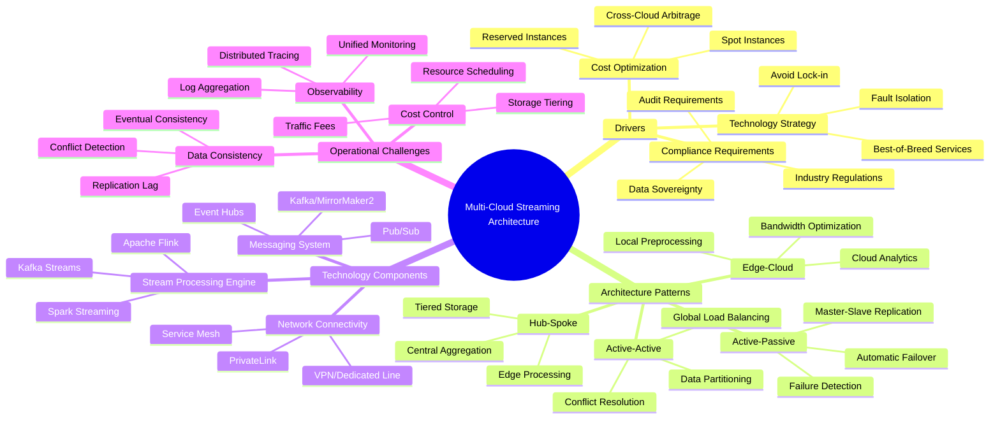
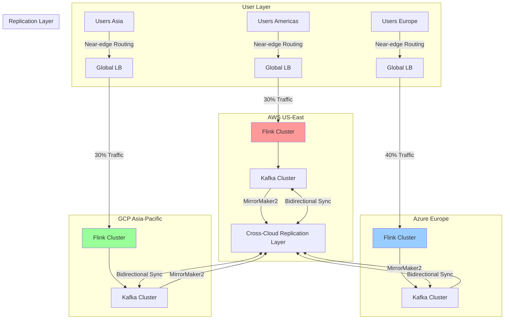
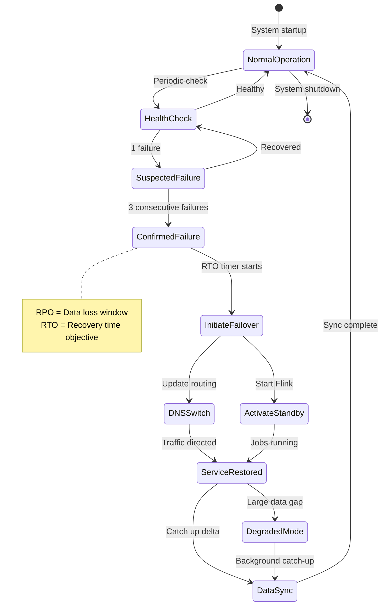
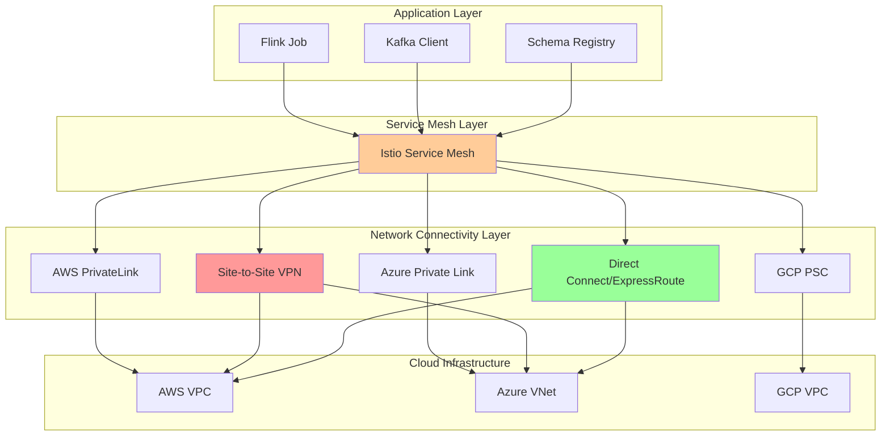
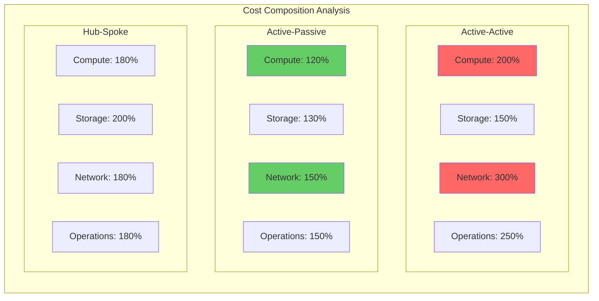

# Multi-Cloud Streaming Architecture and Cross-Region Replication

> **Stage**: Knowledge/06-Frontier | **Prerequisites**: [Flink Cross-Cloud Deployment Guide](../../Flink/04-runtime/04.01-deployment/multi-cloud-deployment-templates.md), [Kafka Geo-Replication Patterns](../03-business-patterns/uber-realtime-platform.md) | **Formality Level**: L3

---

## 1. Definitions

### Def-K-06-150: Multi-Cloud Streaming Architecture

**Definition**: A multi-cloud streaming architecture refers to a system architecture that distributes stream processing components across two or more public cloud providers (such as AWS, Azure, GCP) to achieve continuous data processing, fault isolation, and geographic fault tolerance.

Formal description:

```
Let Cloud = {AWS, Azure, GCP, ...}
Let StreamingComponent = {Source, Processor, Sink, SchemaRegistry}

Multi-Cloud Streaming Architecture := ⟨Deployments, Links, Policies⟩
Where:
  - Deployments ⊆ Cloud × StreamingComponent
  - Links ⊆ Deployments × Deployments represents cross-cloud data flows
  - Policies: Deployments → {Active, Standby, ScaleOnDemand}
```

### Def-K-06-151: Cross-Region Replication Pattern

**Definition**: The cross-region replication pattern defines the synchronization mechanism for stream data between different geographic regions, including synchronization direction, consistency level, and failover strategy.

```
Replication Pattern := ⟨SourceRegion, TargetRegion, Direction, Consistency⟩
Where:
  - Direction ∈ {UniDirectional, BiDirectional, MultiMaster}
  - Consistency ∈ {Eventual, Causal, Strong, Session}
```

### Def-K-06-152: Active-Active Architecture

**Definition**: An active-active architecture means that stream processing instances in multiple cloud regions are simultaneously active, jointly sharing traffic load, and any instance can independently handle complete requests.

```
Active-Active := ∀r ∈ Regions: State(r) = Active ∧ Traffic(r) > 0
```

### Def-K-06-153: Active-Passive Architecture

**Definition**: An active-passive architecture means that only one region is active and processing traffic, while other regions are in standby mode, taking over only when the primary region fails.

```
Active-Passive := ∃!r ∈ Regions: State(r) = Active ∧
                    ∀r' ≠ r: State(r') ∈ {Passive, Standby}
```

### Def-K-06-154: RPO/RTO (Recovery Point/Time Objective)

**Definition**:

- **RPO (Recovery Point Objective)**: The acceptable data loss time window during disaster recovery
- **RTO (Recovery Time Objective)**: The maximum acceptable time from failure occurrence to service restoration

```
RPO := max{t | Data in interval [Now-t, Now] may be lost}
RTO := max{t | Service must recover within t after failure}
```

### Def-K-06-155: Zero Trust Network

**Definition**: A zero trust network is a security architecture principle that requires authentication and authorization for every access request, regardless of whether the request source is within the organizational network boundary.

```
Zero Trust Principle := ∀request: Verify(request.identity) ∧ Verify(request.context) ∧
                                 LeastPrivilege(request.access)
```

---

## 2. Properties

### Prop-K-06-105: Availability Upper Bound of Multi-Cloud Deployment

**Proposition**: In a multi-cloud architecture, overall system availability is constrained by how the availability of individual clouds is combined.

**Derivation**:

```
Let AWS availability = 0.9999 (four 9s)
Let Azure availability = 0.9999
Let GCP availability = 0.9999

Active-Active scenario (OR relationship):
Availability_total = 1 - ∏(1 - Availability_i)
                   = 1 - (0.0001)^3 ≈ 0.999999999999

Active-Passive scenario (constrained by switchover):
Availability_total = Availability_primary × P(successful switchover)
```

**Engineering Implication**: Active-Active can improve availability to near "six 9s," but complexity increases significantly.

### Prop-K-06-106: Cross-Cloud Latency Lower Bound

**Proposition**: Cross-cloud data transmission has a physical latency lower bound that cannot be eliminated by technical means.

**Derivation**:

```
Speed of light in fiber optic cable ≈ 200,000 km/s
AWS us-east-1 to eu-west-1 distance ≈ 6,400 km
Theoretical minimum latency = 6,400 / 200,000 × 2(RTT) = 64ms

Actual observations:
- AWS↔Azure: 60-120ms
- AWS↔GCP: 50-100ms
- Azure↔GCP: 40-80ms
```

### Prop-K-06-107: Data Consistency Triangle Trade-off

**Proposition**: A cross-cloud stream processing system cannot simultaneously satisfy strong consistency, high availability, and partition tolerance (CAP theorem extension for multi-cloud).

**Derivation**:

```
Multi-cloud CAP extension:
  - Inter-cloud partition is inevitable (network failures)
  - Choose CP: Reject writes during partition, guarantee consistency
  - Choose AP: Accept writes, may produce conflicts

Stream processing scenario recommendations:
  - Financial transactions: CP (RPO=0)
  - Log analysis: AP (RPO>0 acceptable)
  - Recommendation systems: Eventual consistency
```

---

## 3. Relations

### 3.1 Multi-Cloud Architecture Pattern Comparison

| Dimension | Active-Active | Active-Passive | Hub-Spoke | Edge-Cloud Hybrid |
|-----------|---------------|----------------|-----------|-------------------|
| **RTO** | < 1 minute | 5-30 minutes | < 5 minutes | < 1 minute |
| **RPO** | Near 0 | Depends on replication | Depends on replication | Edge buffering |
| **Complexity** | High | Medium | Medium | High |
| **Cost** | 2x+ | 1.2-1.5x | 1.5-2x | 1.5-2.5x |
| **Applicable Scenario** | Global services | DR backup | Multi-region expansion | IoT/Real-time |

### 3.2 Cross-Cloud Replication Technology Mapping

```
┌─────────────────┬──────────────────┬──────────────────┬──────────────────┐
│   Technology    │      AWS         │      Azure       │       GCP        │
├─────────────────┼──────────────────┼──────────────────┼──────────────────┤
│ Kafka Replication│ MSK MirrorMaker2 │ HDInsight Kafka  │ Confluent Cloud  │
│                 │ Cluster Linking  │ MirrorMaker      │ Cluster Linking  │
├─────────────────┼──────────────────┼──────────────────┼──────────────────┤
│ Flink Deployment│ EMR/Kinesis      │ HDInsight        │ Dataproc         │
│                 │ Managed Flink    │ Flink on AKS     │ Flink on GKE     │
├─────────────────┼──────────────────┼──────────────────┼──────────────────┤
│ Private Connect │ PrivateLink      │ Private Link     │ Private Service  │
│                 │                  │                  │ Connect          │
├─────────────────┼──────────────────┼──────────────────┼──────────────────┤
│ Schema Registry │ Glue Schema      │ Event Hub        │ Confluent Schema │
│                 │ Registry         │ Schema Registry  │ Registry         │
└─────────────────┴──────────────────┴──────────────────┴──────────────────┘
```

### 3.3 Network Topology and Data Flow Relationships

**Data flow in layered architecture**:

```
Edge Layer → Regional Hub Layer → Global Core Layer
   ↓              ↓                     ↓
 Latency-sensitive  Regional aggregation   Global insights
 Local processing   Cross-AZ replication   Cross-cloud analytics
```

---

## 4. Argumentation

### 4.1 Multi-Cloud Driving Factors Analysis

**Cost Drivers**:

- Pricing differences for storage, compute, and egress traffic across cloud vendors can reach 30-50%
- Utilizing spot instances and reserved instance combinations can optimize costs by 40%+
- Cross-cloud traffic costs are often underestimated ($0.02-0.12/GB)

**Compliance Drivers**:

- Data sovereignty requirements (GDPR, China Cybersecurity Law)
- Industry regulations (finance, healthcare, government)
- Customer data residency requirements

**Technology Drivers**:

- Avoid vendor lock-in
- Leverage best-of-breed services from each cloud (AWS Lambda, Azure Functions, Cloud Run)
- Fault domain isolation

### 4.2 Multi-Cloud Challenges and Responses

| Challenge | Impact | Response Strategy |
|-----------|--------|-------------------|
| Network complexity | Latency, cost, security | Dedicated interconnect, traffic engineering |
| Data consistency | Conflicts, loss, duplication | CRDT, idempotent design, SAGA |
| Operational complexity | Monitoring, troubleshooting, upgrades | Unified control plane, observability |
| Cost control | Hidden fees, traffic costs | FinOps, automated governance |
| Skill requirements | Multi-platform expertise | Platform abstraction, training |

### 4.3 2026 Multi-Cloud Trends

1. **Kubernetes becomes the standard multi-cloud abstraction layer**: Over 80% of multi-cloud workloads run on K8s
2. **Service mesh standardization**: Istio/Linkerd become the de facto standard for cross-cloud service communication
3. **Unified data plane**: Apache Iceberg/Delta Lake provide cross-cloud data layer abstraction
4. **FinOps maturity**: Cross-cloud cost management tools become standard
5. **AI/ML driven**: Multi-cloud architectures support separated deployment of AI training (batch) and inference (real-time)

---

## 5. Formal Proof / Engineering Argument

### 5.1 Engineering Feasibility Argumentation for Active-Active Architecture

**Theorem**: Under specific conditions, an active-active stream processing architecture can achieve linear scaling and fault isolation.

**Conditions**:

1. Data partitioning is clear (by user ID, geographic location)
2. Write operations are idempotent (support duplicate processing)
3. Conflict resolution strategy is clear (Last-Write-Wins / vector clocks)

**Argumentation**:

```
Assumptions:
  - Traffic is evenly distributed across N regions
  - Each region has processing capacity C
  - Failure probability is p, and independent

Total processing capacity = N × C
Availability = 1 - p^N

When N=3, p=0.001:
Availability = 1 - 0.001^3 = 0.999999999
```

**Engineering Constraints**:

- Requires global load balancing (Global Serverless Load Balancer)
- Requires distributed transaction coordination (SAGA / 2PC)
- Requires unified identity authentication (OIDC/SPIFFE)

### 5.2 Data Consistency Boundary for Cross-Region Replication

**Theorem**: In cross-region stream replication, when network partition occurs, the system must choose between consistency and availability.

**Proof**:

```
Assume the system simultaneously satisfies:
  1. Consistency: All nodes see the same write order
  2. Availability: Every request receives a non-error response
  3. Partition tolerance: The system continues operating during network partition

Proof by contradiction:
  - Region A and B experience network partition
  - Client writes data x=v1 to A
  - Client writes data x=v2 to B

  If the system maintains availability, both writes succeed
  But due to partition, A and B cannot synchronize
  When partition recovers, the value of x is indeterminate
  Violates consistency

∴ The three cannot be simultaneously satisfied ∎
```

**Engineering Trade-offs**:

- Choose CP: Use Kafka transactions + two-phase commit, sacrificing availability
- Choose AP: Use async replication + conflict resolution, sacrificing consistency
- Choose middle ground: Use causal consistency + vector clocks

---

## 6. Examples

### 6.1 Active-Active E-commerce Real-time Recommendation System

**Scenario**: Global e-commerce platform with users distributed across US East, Europe, and Asia Pacific

**Architecture**:

```
┌─────────────┐     ┌─────────────┐     ┌─────────────┐
│  AWS US-East │◄───►│ Azure Europe │◄───►│  GCP Asia   │
│             │     │             │     │             │
│ ┌─────────┐ │     │ ┌─────────┐ │     │ ┌─────────┐ │
│ │Flink    │ │     │ │Flink    │ │     │ │Flink    │ │
│ │Cluster  │ │     │ │Cluster  │ │     │ │Cluster  │ │
│ └────┬────┘ │     │ └────┬────┘ │     │ └────┬────┘ │
│      │      │     │      │      │     │      │      │
│ ┌────┴────┐ │     │ ┌────┴────┐ │     │ ┌────┴────┐ │
│ │Kafka    │ │     │ │Kafka    │ │     │ │Kafka    │ │
│ │MirrorMaker2  │◄──────────►│MirrorMaker2  │◄──────────►│MirrorMaker2  │
│ └─────────┘ │     │ └─────────┘ │     │ └─────────┘ │
└─────────────┘     └─────────────┘     └─────────────┘
```

**Key Configuration**:

```yaml
# MirrorMaker2 bidirectional replication configuration
clusters: source, target
source.bootstrap.servers: source-kafka:9092
target.bootstrap.servers: target-kafka:9092

# Bidirectional replication
source->target.enabled: true
target->source.enabled: true

# Conflict resolution: by timestamp
conflict.resolution: timestamp
```

**Effects**:

- RTO < 30 seconds
- RPO ≈ 0 (synchronous replication)
- Supports near-edge reads, latency < 50ms

### 6.2 Active-Passive Financial Trading Disaster Recovery

**Scenario**: Securities trading system, primary region AWS, DR region Azure

**Architecture**:

```
Production (AWS)          DR (Azure)
┌─────────────┐         ┌─────────────┐
│   Route 53  │────────►│  Azure DNS  │
│ (Health Check)│ Failover │  (Standby)  │
└──────┬──────┘         └──────┬──────┘
       │                       │
┌──────▼──────┐         ┌──────▼──────┐
│  MSK Kafka  │◄───────►│ Event Hubs  │
│   (Active)   │  Sync Replication │   (Standby)  │
└──────┬──────┘         └──────┬──────┘
       │                       │
┌──────▼──────┐         ┌──────▼──────┐
│ Kinesis Data│         │ HDInsight   │
│   Analytics │         │    Flink    │
│  (Processing)│         │  (Standby)   │
└─────────────┘         └─────────────┘
```

**Switchover Process**:

1. Health check failure (3 consecutive, 10-second intervals)
2. Trigger DNS switchover (TTL=60 seconds)
3. Activate Flink jobs in Azure environment
4. Service restored (Total RTO ≈ 5 minutes)

**RPO/RTO Targets**:

- RPO = 0 (synchronous replication for critical trading data)
- RTO = 5 minutes (automated switchover)

### 6.3 Edge-Cloud Hybrid IoT Architecture

**Scenario**: Smart manufacturing factory, edge preprocessing + cloud analytics

**Architecture**:

```
Factory Edge Layer                    Cloud Aggregation Layer
┌─────────────────┐          ┌─────────────────┐
│   Edge Gateway   │          │   AWS/Azure/GCP  │
│  (K3s Cluster)   │          │   (EKS/AKS/GKE)  │
│                 │          │                 │
│ ┌─────────────┐ │          │ ┌─────────────┐ │
│ │ Edge Flink  │ │  MQTT    │ │ Cloud Flink │ │
│ │ (Light Mode)│├──────────►│ │ (Full Mode) │ │
│ └─────────────┘ │          │ └─────────────┘ │
│ ┌─────────────┐ │          │ ┌─────────────┐ │
│ │ Local Kafka │ │  Kafka   │ │ Cloud Kafka │ │
│ │ (Single Node)│├──────────►│ │  (Cluster)  │ │
│ └─────────────┘ │  Mirror   │ └─────────────┘ │
└─────────────────┘          └─────────────────┘
```

**Edge Configuration**:

```yaml
# Flink edge mode
jobmanager.memory.process.size: 512mb
taskmanager.memory.process.size: 1gb
taskmanager.numberOfTaskSlots: 2
parallelism.default: 2

# Only retain aggregated metrics
checkpoint.interval: 5min
checkpoint.mode: AT_LEAST_ONCE
```

---

## 7. Visualizations

### 7.1 Multi-Cloud Streaming Architecture Overview

The following mind map shows the core components and relationships of multi-cloud streaming:



### 7.2 Active-Active Architecture Data Flow

The following flowchart shows data flow in an active-active architecture:



### 7.3 Disaster Recovery Failover Process

The following state diagram shows the failure detection and switchover process:



### 7.4 Cross-Cloud Network Connection Topology

The following hierarchy diagram shows the multi-cloud network architecture:



### 7.5 Multi-Cloud Cost Structure Comparison

The following matrix diagram shows cost distribution across different architecture patterns:



---

## 8. References


---

*Document Version: v1.0 | Created: 2026-04-03 | Theorem IDs: Def-K-06-150~155, Thm-K-06-105~107*
