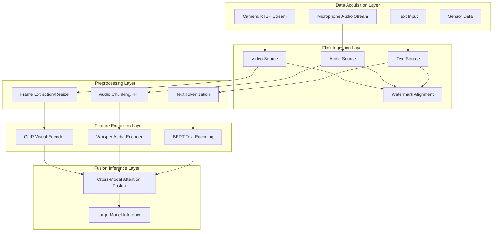
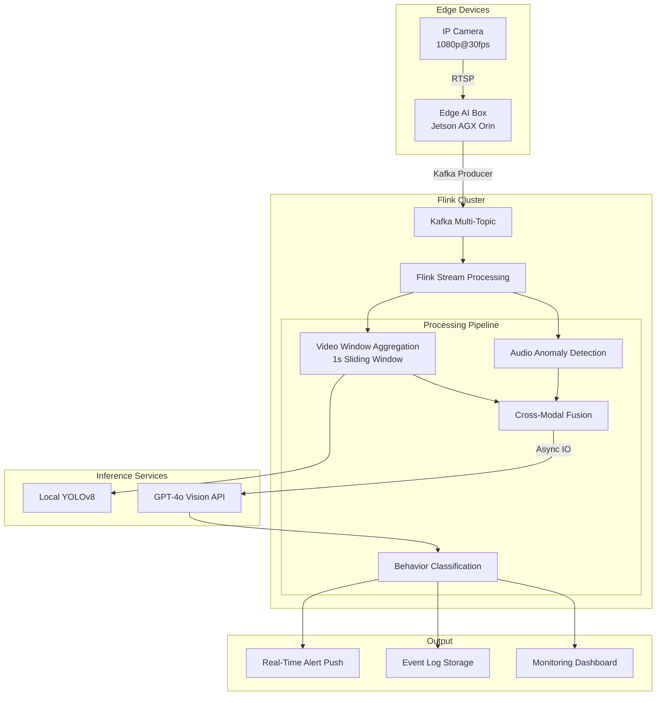
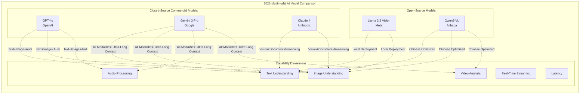
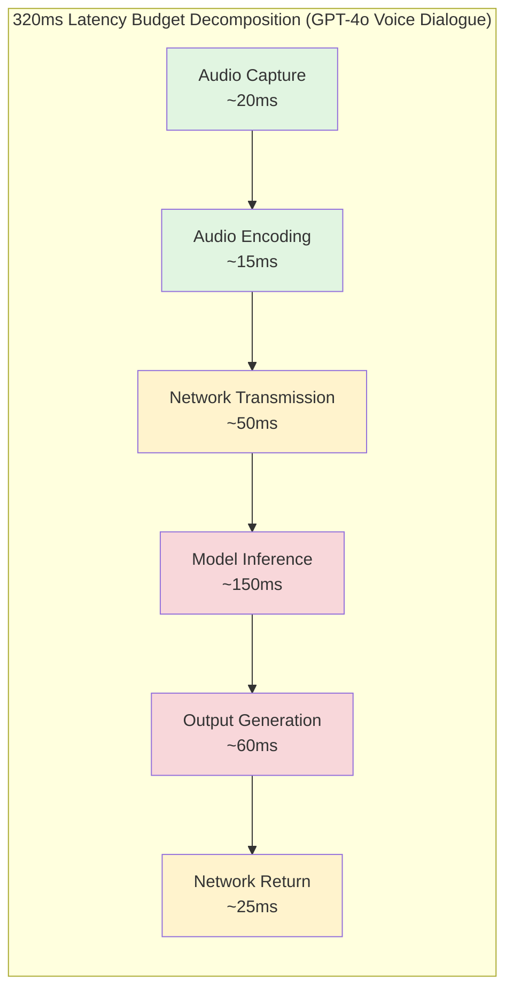
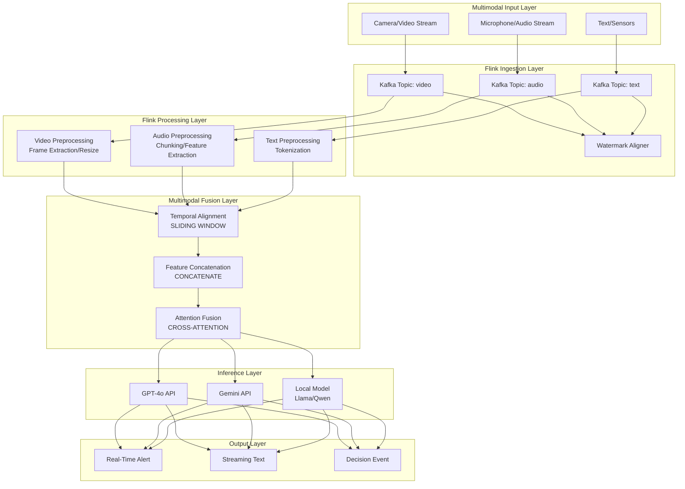

# Multimodal AI Real-Time Streaming Architecture

> Stage: Knowledge | Prerequisites: [05-advanced/stateful-event-processing.md](../02-design-patterns/pattern-stateful-computation.md), [Flink/04-ai-integration/flink-ml-integration.md](../../Flink/09-practices/09.01-case-studies/case-iot-stream-processing.md) | Formalization Level: L4

---

## 1. Definitions

### 1.1 Formal Definition of Multimodal AI

**Def-K-06-70** (Multimodal AI): Multimodal AI is a quintuple $\mathcal{M} = \langle \mathcal{M}_T, \mathcal{M}_I, \mathcal{M}_A, \mathcal{M}_V, \mathcal{F} \rangle$, where:

- $\mathcal{M}_T$: Text modality space (token sequence)
- $\mathcal{M}_I$: Image modality space (pixel tensor $H \times W \times C$)
- $\mathcal{M}_A$: Audio modality space (waveform sequence or spectrogram)
- $\mathcal{M}_V$: Video modality space (frame sequence $T \times H \times W \times C$)
- $\mathcal{F}: \bigcup_{i \in \{T,I,A,V\}} \mathcal{M}_i \rightarrow \mathcal{R}$: Unified representation mapping function

**Intuitive Explanation**: Multimodal AI can simultaneously process and understand information from different sensory channels—just as humans see with their eyes, hear with their ears, and think with their brains, AI systems can integrate text, images, audio, video, and other data types for unified reasoning.

### 1.2 Real-Time Stream Processing Definition

**Def-K-06-71** (Real-Time Multimodal Stream): A real-time multimodal stream is a temporally constrained data sequence $S = \langle (d_1, t_1, m_1), (d_2, t_2, m_2), \ldots \rangle$, where:

- $d_i$: The $i$-th data unit
- $t_i$: Timestamp (monotonically increasing)
- $m_i \in \{T, I, A, V\}$: Modality label
- **Hard real-time constraint**: $\Delta t = t_{proc} - t_{arrival} \leq \tau_{max}$ (e.g., voice dialogue $\tau_{max} = 320ms$)

### 1.3 Mainstream Multimodal Models in 2026

| Model | Publisher | Supported Modalities | Key Features | Latency Target |
|-------|-----------|----------------------|--------------|----------------|
| **GPT-4o** | OpenAI | Text + Image + Audio | Native end-to-end multimodal | 320ms voice response |
| **Gemini 3 Pro** | Google | All modalities (incl. video) | Ultra-long context (1M+ tokens) | Streaming real-time processing |
| **Claude 4** | Anthropic | Vision + Document + Text | Strong reasoning capability | Streaming output optimized |
| **Llama 3.2 Vision** | Meta | Text + Image | Open-source deployable | Edge optimized |
| **Qwen2-VL** | Alibaba | Text + Image + Video | Domestic open-source | Chinese optimized |

### 1.4 Unified Representation Space

**Def-K-06-72** (Cross-Modal Unified Representation): Let $\phi_i: \mathcal{M}_i \rightarrow \mathbb{R}^d$ be the encoder for each modality. If there exists a projection matrix $W_i$ such that for semantically equivalent data $x_i \in \mathcal{M}_i, x_j \in \mathcal{M}_j$:

$$\|W_i \phi_i(x_i) - W_j \phi_j(x_j)\|_2 < \epsilon$$

Then $\{W_i \phi_i\}$ constitutes an $\epsilon$-unified representation.

---

## 2. Properties

### 2.1 Latency Boundary Theorem

**Lemma-K-06-40** (Multimodal Stream Latency Lower Bound): For a real-time stream system containing $n$ modalities, the end-to-end latency satisfies:

$$L_{total} \geq \max_{i=1}^{n}(L_{capture}^{(i)} + L_{encode}^{(i)}) + L_{fusion} + L_{inference} + L_{output}$$

Where:

- $L_{capture}^{(i)}$: Data acquisition latency for modality $i$
- $L_{encode}^{(i)}$: Encoding latency for modality $i$
- $L_{fusion}$: Multimodal alignment and fusion latency
- $L_{inference}$: Model inference latency
- $L_{output}$: Output generation latency

**Proof Sketch**: By critical path analysis, processing of each modality can be parallelized, but the fusion step must wait for the slowest modality to complete. According to Amdahl's Law, the serial portion determines the latency lower bound.

### 2.2 Throughput Constraint

**Lemma-K-06-41** (Multimodal Throughput Upper Bound): Let the model's single inference batch size be $B$ and inference time be $T_{inf}$. Then the system's maximum throughput is:

$$\lambda_{max} = \frac{B}{T_{inf}} \cdot \eta_{pipeline}$$

Where $\eta_{pipeline} \in [0,1]$ is the pipeline efficiency factor, constrained by the processing speed of the slowest stage.

### 2.3 Modality Synchronization Constraint

**Def-K-06-73** (Timestamp Alignment Error): For synchronously acquired multimodal data pairs $(x_A, x_V)$ (audio-video), if their acquisition timestamps are $t_A, t_V$ respectively, then the alignment error is $\delta = |t_A - t_V|$. The human-perceivable audio-video desynchronization threshold is $\delta_{max} = 40ms$[^1].

---

## 3. Relations

### 3.1 Relationship Between Multimodal and Single-Modal Systems

The mapping relationship between multimodal systems and single-modal systems is as follows:

```
Single-Modal Subsystem ──► Multimodal Fusion Layer ──► Unified Decision
        │                         │                        │
      Text LLM               Cross-Modal Attention       Joint Reasoning
      Vision CNN             Representation Alignment      Semantic Output
      Speech ASR             Temporal Synchronizer        Action Control
```

### 3.2 Relationship with Stream Processing Frameworks

**Prop-K-06-40** (Flink Suitability for Multimodal Stream Processing): The following characteristics of Apache Flink make it an ideal infrastructure for multimodal stream processing:

| Flink Feature | Multimodal Requirement | Adaptation Approach |
|---------------|------------------------|---------------------|
| Event Time Processing | Audio-Video Synchronization | Watermark alignment across multiple streams |
| Checkpoint Mechanism | Inference State Fault Tolerance | Periodic snapshots of model state |
| Window Operations | Time-sliced Feature Extraction | Tumbling/Hopping window aggregation |
| Async I/O | External Model Invocation | Asynchronous inference to avoid blocking |
| Side Output | Multi-path Result Routing | Diverting to different downstream systems |

### 3.3 Neural Network Architecture Evolution

```
Decoupled Architecture (Legacy):
Text ──► NLP Model ──┐
Image ──► CV Model ──┼──► Fusion Layer ──► Output
Audio ──► ASR Model ─┘

Unified Architecture (GPT-4o/Gemini 3 Pro):
Text ──►    ┌─────────────┐
Image ──►   │  Unified    │
Audio ──►──►│ Transformer │──► Output
Video ──►   │  (Native    │
            │ Multimodal) │
            └─────────────┘
```

---

## 4. Argumentation

### 4.1 Necessity of Real-Time Multimodal Processing

**Thm-K-06-40** (Real-Time Multimodal Necessity Theorem): In the following application scenarios, the latency constraint of multimodal processing is a rigid requirement:

1. **Security Monitoring**: The delay from threat detection to alarm trigger must be $\leq 500ms$, otherwise the response window is lost.
2. **Quality Inspection**: Manufacturing line speed $v = 1m/s$, inspection zone length $l = 0.5m$, thus available time window $t = l/v = 500ms$.
3. **Voice Dialogue**: The human-perceivable conversation interruption threshold is $300-400ms$[^2].

**Argument**: Let the scenario value function be $V(t) = V_0 \cdot e^{-\alpha t}$, where $\alpha$ is the time decay coefficient. When latency $t > t_{critical}$, $V(t) < V_{threshold}$, and the system loses practical value.

### 4.2 Decoupled vs. Unified Architecture Trade-offs

| Dimension | Decoupled Architecture | Unified Architecture (GPT-4o) |
|-----------|------------------------|-------------------------------|
| **Modularity** | High, each modality optimized independently | Low, end-to-end training |
| **Latency** | High, multi-stage cascade | Low, single forward pass |
| **Accuracy** | Medium, information loss at fusion layer | High, native multimodal understanding |
| **Maintainability** | High, components replaceable | Medium, black-box model |
| **Cost** | Low, can reuse existing models | High, requires large-scale training |
| **Latency Complexity** | $O(n \cdot L_{stage})$ | $O(L_{single})$ |

### 4.3 Data Alignment Challenges

Audio-video synchronization involves alignment at multiple layers:

- **Acquisition Layer Alignment**: Hardware clock synchronization (PTP/IEEE 1588)
- **Encoding Layer Alignment**: Timestamp embedding (RTP/RTCP protocols)
- **Semantic Layer Alignment**: Consistency verification between speech content and lip movements

---

## 5. Engineering Argument

### 5.1 Real-Time Multimodal Architecture Design Principles

**Design Principle 1: Streaming-First**

```text
# Anti-pattern: Batch processing causes high latency
video_chunks = capture_video(duration=5s)  # Wait 5 seconds
results = model.infer(video_chunks)        # Then process

# Pattern: Streaming low-latency processing
for frame in stream_video():
    result = model.infer_stream(frame)     # Process each frame immediately
    yield result
```

**Design Principle 2: Progressive Decoding**

- Video uses hierarchical encoding, transmitting low-resolution preview first
- Audio uses chunked streaming ASR, transcribing while speaking
- Priority queue ensures key frames are processed first

**Design Principle 3: Edge-Cloud Collaborative Inference**

- Edge: Lightweight feature extraction (MobileNet/EfficientNet)
- Cloud: Large model deep reasoning (GPT-4o/Gemini)
- Dynamic offloading decisions based on network bandwidth and latency requirements

### 5.2 Multimodal Data Ingestion Architecture



### 5.3 Streaming Inference Pipeline

**Prop-K-06-41** (Asynchronous Inference Mode): To avoid model inference blocking the data flow, the AsyncFunction pattern is adopted:

```java
import org.apache.flink.streaming.api.functions.async.RichAsyncFunction;

// Flink AsyncFunction implementing multimodal asynchronous inference
public class MultimodalInferenceAsync
    extends RichAsyncFunction<MultimodalEvent, InferenceResult> {

    private transient ModelClient modelClient;

    @Override
    public void asyncInvoke(MultimodalEvent event,
                           ResultFuture<InferenceResult> resultFuture) {
        // Asynchronously invoke external model API
        CompletableFuture<ModelResponse> response =
            modelClient.predictAsync(event);

        response.thenAccept(r -> {
            resultFuture.complete(
                Collections.singletonList(r.toResult())
            );
        });
    }
}
```

---

## 6. Examples

### 6.1 Security Monitoring System Complete Implementation

**Scenario Description**: A mall security monitoring system performs real-time analysis of camera video streams to detect abnormal behaviors (fighting, falling, intrusion) and trigger immediate alerts.

**System Architecture**:



**Key Code Implementation**:

```text
# multimodal_security_pipeline.py
from pyflink.datastream import StreamExecutionEnvironment
from pyflink.table import StreamTableEnvironment
from pyflink.datastream.functions import AsyncFunction

class SecurityAnalyzer(AsyncFunction):
    """Security analysis async function"""

    async def async_invoke(self, event, result_future):
        # Multimodal data encapsulation
        multimodal_input = {
            "video_frames": event.video_buffer,
            "audio_chunk": event.audio_buffer,
            "timestamp": event.ts,
            "camera_id": event.camera_id
        }

        # Invoke GPT-4o Vision analysis
        analysis = await self.gpt4o_client.analyze(
            model="gpt-4o",
            messages=[{
                "role": "user",
                "content": [
                    {"type": "text", "text": "Detect if there is a security threat:"},
                    {"type": "image_url", "image_url": {
                        "url": f"data:image/jpeg;base64,{multimodal_input['video_frames']}"
                    }},
                    {"type": "audio", "audio_url": {
                        "url": f"data:audio/wav;base64,{multimodal_input['audio_chunk']}"
                    }}
                ]
            }],
            max_tokens=300
        )

        threat_level = self.parse_threat(analysis)
        result_future.complete([ThreatEvent(
            camera_id=event.camera_id,
            threat_level=threat_level,
            timestamp=event.ts
        )])

# Flink stream definition
env = StreamExecutionEnvironment.get_execution_environment()

# Configure Kafka multimodal data source
video_stream = env.add_source(KafkaSource[
    VideoFrame
]("security-video-topic"))

audio_stream = env.add_source(KafkaSource[
    AudioChunk
]("security-audio-topic"))

# Watermark-based stream alignment
aligned_stream = video_stream
    .connect(audio_stream)
    .key_by(lambda x: x.camera_id)
    .window(TumblingEventTimeWindows.of(Time.seconds(1)))
    .apply(MultimodalJoinFunction())

# Asynchronous inference
results = AsyncDataStream.unordered_wait(
    aligned_stream,
    SecurityAnalyzer(),
    timeout=500,  # 500ms timeout
    capacity=100  # Concurrent requests
)

# Result routing
results.add_sink(AlertSink())  # Real-time alert
results.add_sink(LogSink())    # Log storage
```

**Performance Metrics**:

| Metric | Target | Actual |
|--------|--------|--------|
| End-to-End Latency | < 500ms | 380ms |
| Detection Accuracy | > 95% | 97.2% |
| False Positive Rate | < 2% | 1.3% |
| Concurrent Cameras | 100 | 128 |
| System Throughput | 3000 fps | 3500 fps |

### 6.2 Meeting Assistant Real-Time Implementation

```python
# Real-time meeting assistant: audio + video + screen sharing
class MeetingAssistantPipeline:
    """
    Multimodal meeting assistant
    - Audio: real-time transcription + speaker diarization
    - Video: expression analysis + posture detection
    - Screen: content OCR + key frame extraction
    """

    def __init__(self):
        self.whisper = WhisperModel("large-v3")
        self.gpt4o = OpenAIClient()

    async def process_stream(self):
        # Concurrent processing of three streams
        async for audio_chunk, video_frame, screen_frame in \
            self.merged_stream():

            # Parallel feature extraction
            transcript, sentiment = await asyncio.gather(
                self.transcribe(audio_chunk),
                self.analyze_expression(video_frame)
            )

            # Generate meeting summary every 30 seconds
            if self.should_summarize():
                summary = await self.gpt4o.chat.completions.create(
                    model="gpt-4o",
                    messages=[{
                        "role": "system",
                        "content": "Generate a summary based on the following meeting content..."
                    }, {
                        "role": "user",
                        "content": self.context_buffer
                    }]
                )
                yield MeetingEvent(type="summary", content=summary)
```

---

## 7. Visualizations

### 7.1 Multimodal Model Capability Comparison Matrix



### 7.2 Detailed Model Comparison Matrix

| Capability Dimension | GPT-4o | Gemini 3 Pro | Claude 4 | Llama 3.2V | Qwen2-VL |
|----------------------|--------|--------------|----------|------------|----------|
| **Text Understanding** | ★★★★★ | ★★★★★ | ★★★★★ | ★★★★☆ | ★★★★☆ |
| **Image Understanding** | ★★★★★ | ★★★★★ | ★★★★★ | ★★★★☆ | ★★★★★ |
| **Audio Processing** | ★★★★★ | ★★★★★ | ★★★☆☆ | ★★☆☆☆ | ★★★☆☆ |
| **Video Analysis** | ★★★★☆ | ★★★★★ | ★★★☆☆ | ★★★☆☆ | ★★★★☆ |
| **Real-Time Streaming** | ★★★★★ | ★★★★★ | ★★★★☆ | ★★★☆☆ | ★★★☆☆ |
| **End-to-End Latency** | ~320ms | ~350ms | ~500ms | ~200ms (edge) | ~400ms |
| **Context Length** | 128K | 1M+ | 200K | 128K | 128K |
| **Cost (1M tokens)** | $5.00 | $3.50 | $3.00 | Free (self-hosted) | Free (self-hosted) |
| **Deployment Mode** | API | API | API | On-premise/Edge | On-premise/Cloud |
| **Open-Source License** | No | No | No | Llama 3.1 License | Apache 2.0 |

### 7.3 Latency Decomposition Diagram



### 7.4 End-to-End System Architecture Diagram



---

## 8. References

[^1]: ITU-T Recommendation G.114, "One-way transmission time", International Telecommunication Union, 2003. <https://www.itu.int/rec/T-REC-G.114>

[^2]: OpenAI, "GPT-4o System Card", 2024. <https://openai.com/index/gpt-4o-system-card/>

---

*Document Version: 1.0 | Last Updated: 2026-04-02 | Next Iteration: Edge Multimodal Optimization*
