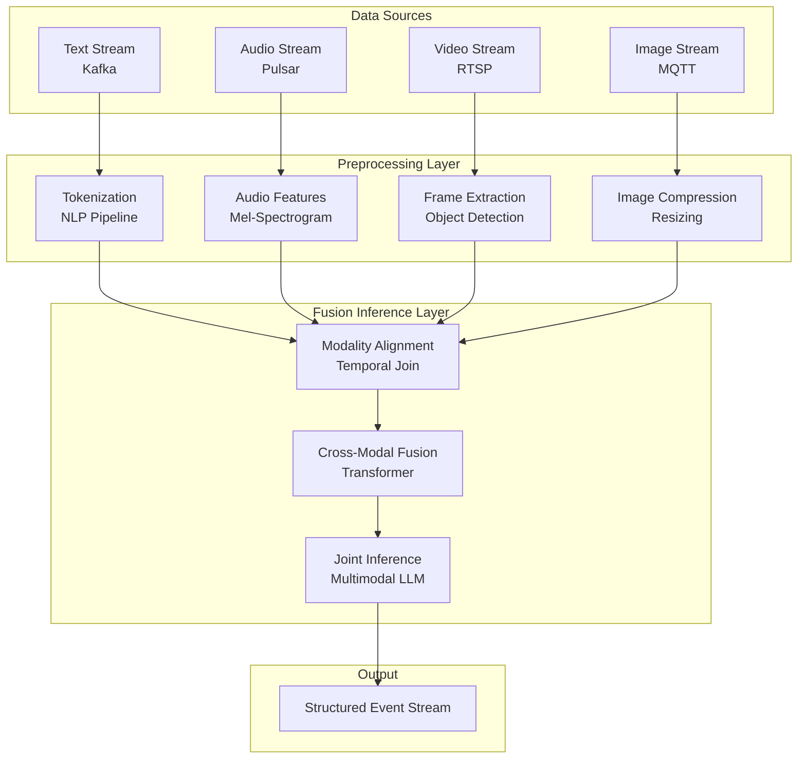
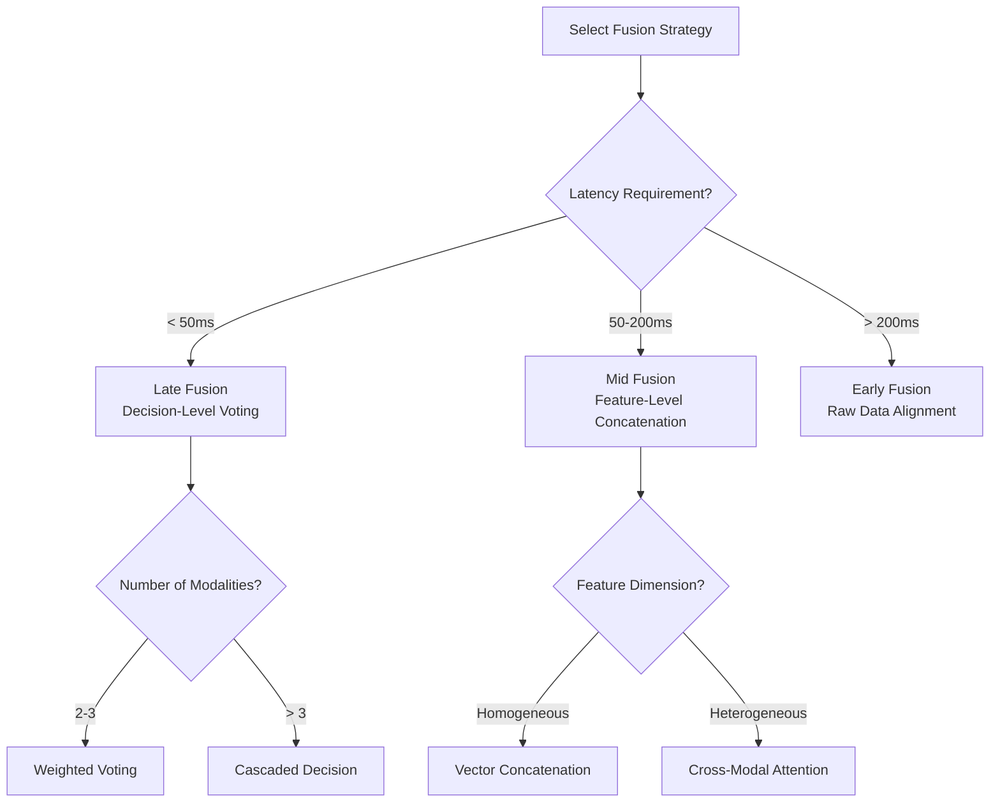

# Multimodal Stream Processing Architecture

> **Stage**: Knowledge/06-frontier/ | **Prerequisites**: [Real-Time ML Inference](../06-frontier/realtime-ml-inference/06.04.01-ml-model-serving.md) | **Formalization Level**: L4

---

## 1. Definitions

**Def-K-MM-01: Multimodal Stream Processing**
A stream computing paradigm that simultaneously performs real-time ingestion, preprocessing, feature extraction, fusion analysis, and inference response on data streams of multiple modalities such as text, image, audio, and video. Its core challenge lies in the significant differences in sampling rates, data volumes, semantic spaces, and processing latencies across modalities.

**Def-K-MM-02: Cross-Modal Embedding**
Mapping data from different modalities into a unified low-dimensional vector space, such that semantically similar content (e.g., a segment of speech and its corresponding text transcription) are close to each other in the vector space, thereby supporting cross-modal retrieval and similarity computation.

**Def-K-MM-03: Modality Alignment**
Synchronizing and aligning heterogeneous data streams from different sensors in the temporal dimension based on timestamps or event triggering mechanisms, ensuring that each modality points to the same semantic moment during fusion analysis.

---

## 2. Properties

**Lemma-K-MM-01: Bounds of Modality Latency Differences**
In typical multimodal systems, text stream latency < 10ms, audio stream frame latency 20-40ms, video stream frame latency 33ms (30fps) to 16ms (60fps), while high-resolution image stream batch processing latency can reach 100-500ms. The total system response time is bounded by the slowest modality's processing path.

**Lemma-K-MM-02: Accuracy-Efficiency Tradeoff in Cross-Modal Fusion**
Early fusion (merging before the feature layer) typically yields higher downstream task accuracy but requires handling dimensional heterogeneity and temporal misalignment across modalities; late fusion (merging at the decision layer) is simpler to implement and has lower latency but may lose complementary information between modalities.

**Prop-K-MM-01: Stream Sharding is Key to Processing High-Resolution Visual Data**
Sharding video/image streams in real time by scene, object, or time window allows large-volume visual processing tasks to be parallelized across multiple Flink Tasks, avoiding single-point bottlenecks.

---

## 3. Relations

### 3.1 Multimodal Stream Processing Architecture



### 3.2 Modality Characteristics Comparison

| Modality | Data Rate | Typical Latency | Preprocessing Complexity | Fusion Position |
|----------|-----------|-----------------|--------------------------|-----------------|
| Text | Low | < 10ms | Low | Early/Late |
| Audio | Medium | 20-40ms | Medium | Feature Layer |
| Image | High | 50-200ms | High | Feature Layer |
| Video | Very High | 100-500ms | Very High | Late/Decision Layer |

---

## 4. Argumentation

### 4.1 Why is Streaming Multimodal Processing Needed?

1. **Real-Time Intelligent Surveillance**: Simultaneously analyzing video from cameras, audio from microphones, and text alerts from sensors enables more accurate event detection.
2. **Autonomous Driving**: Fusing camera images, LiDAR point clouds, GPS text, and voice commands for millisecond-level decision-making.
3. **Live Content Moderation**: Real-time detection of violations in video frames, speech content, and bullet-comment text.
4. **Industrial Quality Inspection**: Combining visual inspection images, equipment vibration audio, and log text for comprehensive product quality assessment.

### 4.2 Key Technical Challenges

- **Temporal Alignment**: Different modalities have different capture devices and network paths, leading to timestamp drift.
- **Computational Heterogeneity**: Text can be processed on CPU, while images/video require GPU acceleration.
- **Storage Pressure**: The storage and transmission cost of video streams is over 1000x that of text streams.
- **Model Complexity**: Multimodal large models (e.g., CLIP, GPT-4V) have high inference latency, making direct deployment in streaming scenarios difficult.

---

## 5. Proof / Engineering Argument

### 5.1 Correctness of Modality Alignment

**Theorem (Thm-K-MM-01)**: Suppose the system uses an event-time Watermark mechanism for modality alignment. If the out-of-order latency upper bound for each modality Source is $\delta_i$, and the Watermark generation function is $W(t) = \min_i(t - \delta_i)$, then when the window is triggered, the window contains all records with event time $\leq W(t)$, and the probability of missing records is 0 (within the out-of-order boundary).

**Engineering Argument**:

1. Flink's Watermark mechanism independently generates Watermarks for each modality stream.
2. In CoProcessFunction or Interval Join, the minimum Watermark is used as the trigger condition for the joint window.
3. As long as the out-of-order boundary $\delta_i$ for each modality is correctly estimated, the system will not be blocked indefinitely waiting for the slowest modality.
4. Upon triggering, all records arriving within the out-of-order boundary are included in the window computation.
5. Late records beyond the out-of-order boundary can be optionally dropped or handled via side-output.

---

## 6. Examples

### 6.1 Flink Multimodal Alignment Job

```java
// [伪代码片段 - 不可直接运行] 仅展示核心逻辑
DataStream<TextEvent> textStream = env
    .addSource(new KafkaSource<>())
    .assignTimestampsAndWatermarks(
        WatermarkStrategy.<TextEvent>forBoundedOutOfOrderness(Duration.ofSeconds(2))
            .withIdleness(Duration.ofMinutes(1))
    );

DataStream<VideoFrame> videoStream = env
    .addSource(new RstpSource())
    .assignTimestampsAndWatermarks(
        WatermarkStrategy.<VideoFrame>forBoundedOutOfOrderness(Duration.ofSeconds(5))
            .withIdleness(Duration.ofMinutes(1))
    );

// Event-time based Interval Join
textStream
    .keyBy(e -> e.sessionId)
    .intervalJoin(videoStream.keyBy(f -> f.sessionId))
    .between(Time.seconds(-3), Time.seconds(3))
    .process(new MultimodalFusionProcessFunction());
```

### 6.2 Video Frame Preprocessing Configuration

```python
# Flink Python UDF for video frame preprocessing
from pyflink.table.udf import udf
from pyflink.table import DataTypes
import cv2
import numpy as np

@udf(result_type=DataTypes.ARRAY(DataTypes.FLOAT()))
def extract_video_features(frame_bytes):
    img = cv2.imdecode(np.frombuffer(frame_bytes, np.uint8), cv2.IMREAD_COLOR)
    img = cv2.resize(img, (224, 224))
    features = cv2.dnn.blobFromImage(img, 1.0, (224, 224), (0, 0, 0))
    return features.flatten().tolist()
```

### 6.3 Cross-Modal Fusion Model Serving Configuration

```yaml
# Triton Inference Server multimodal model configuration
name: "multimodal_fusion"
platform: "onnxruntime_onnx"
max_batch_size: 8
input:
  - name: "text_embedding"
    data_type: TYPE_FP32
    dims: [512]
  - name: "image_embedding"
    data_type: TYPE_FP32
    dims: [512]
output:
  - name: "fused_embedding"
    data_type: TYPE_FP32
    dims: [512]
instance_group:
  - count: 2
    kind: KIND_GPU
```

---

## 7. Visualizations

### 7.1 Multimodal Fusion Position Decision Tree



---

## 8. References
