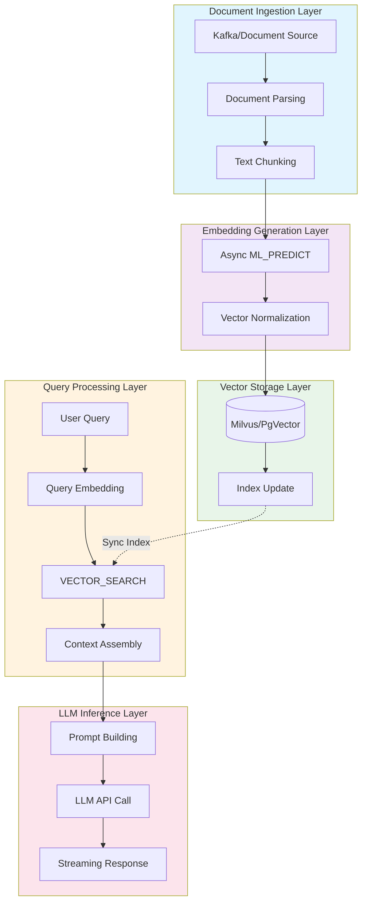
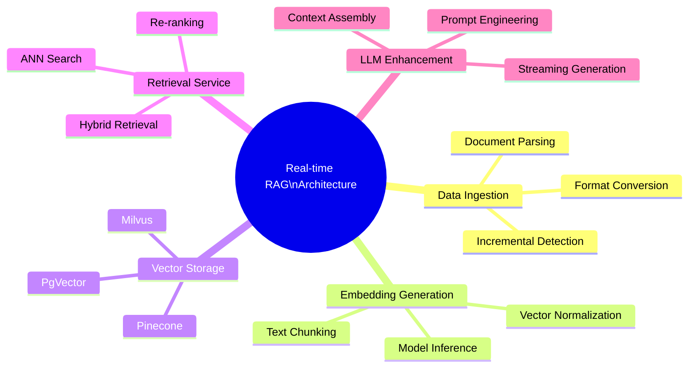
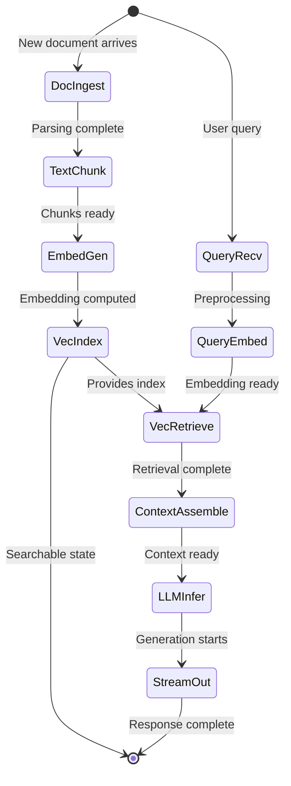
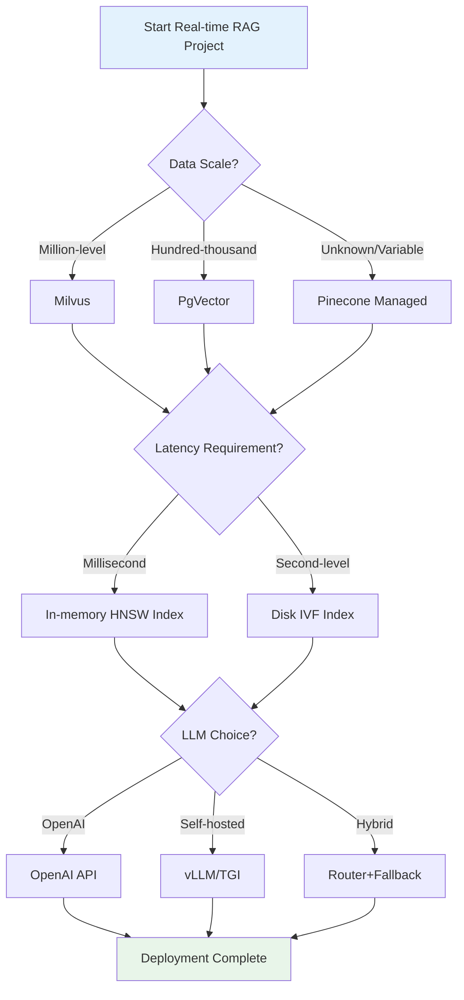
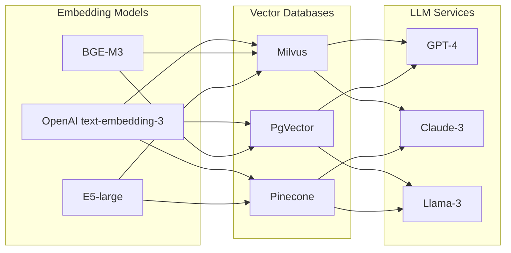

# Real-time RAG Architecture

> Stage: Knowledge/06-frontier | Prerequisites: [Flink Architecture Overview](../../Flink/01-concepts/deployment-architectures.md), [Stream Processing Patterns](../02-design-patterns/pattern-event-time-processing.md) | Formalization Level: L3

## 1. Definitions

### Def-K-06-26: RAG Pipeline

**Definition**: A RAG pipeline is a quadruple $\mathcal{P}_{RAG} = (\mathcal{D}, \mathcal{E}, \mathcal{V}, \mathcal{L})$, where:

- $\mathcal{D}$: Document stream, $\mathcal{D} = \{d_1, d_2, ..., d_n\}$, each document $d_i = (\text{content}_i, \text{metadata}_i, t_i)$
- $\mathcal{E}$: Embedding function, $\mathcal{E}: \mathcal{D} \rightarrow \mathbb{R}^k$, mapping documents to a $k$-dimensional vector space
- $\mathcal{V}$: Vector store, $\mathcal{V} \subset \mathbb{R}^k$, supporting Approximate Nearest Neighbor (ANN) queries
- $\mathcal{L}$: LLM inference function, $\mathcal{L}: (q, \mathcal{C}) \rightarrow \text{response}$, where $q$ is the query and $\mathcal{C}$ is the retrieved context

**Intuitive Explanation**: The RAG pipeline converts real-time incoming documents into vector representations, stores them in a vector database, and when a user queries, the system retrieves relevant context to augment the LLM's generation capability.

---

### Def-K-06-27: Real-time Embedding Generation

**Definition**: Real-time embedding generation is a stream processing operator $\Phi_{embed}$ defined as:

$$\Phi_{embed}: \text{Stream}(\mathcal{D}) \rightarrow \text{Stream}(\mathbb{R}^k)$$

$$\Phi_{embed}(d_t) = \text{ML\_PREDICT}(\text{model}_{emb}, \text{chunk}(d_t))$$

Where:

- $\text{chunk}(\cdot)$: Document chunking function, splitting long documents into semantically coherent segments
- $\text{model}_{emb}$: Pre-trained embedding model (e.g., text-embedding-3, BGE, E5)
- $\text{ML\_PREDICT}$: Model inference operation, with latency constraint $L_{embed} < 100\text{ms}$

**Key Properties**:

- **Stream Processing**: Single-document processing latency is independent of batch size
- **Version Control**: Model version changes trigger vector recomputation
- **Dimension Alignment**: Output dimensions must be consistent with the vector store schema

---

### Def-K-06-28: Streaming Context Retrieval

**Definition**: Streaming context retrieval is a stateful operator $\Phi_{retrieve}$:

$$\Phi_{retrieve}: (q_t, \mathcal{V}_t) \rightarrow \mathcal{C}_t$$

$$\mathcal{C}_t = \text{TOP\_K}\left\{ v \in \mathcal{V}_t \mid \text{sim}(\mathcal{E}(q_t), v) \geq \theta \right\}$$

Where:

- $q_t$: Query request at time $t$
- $\mathcal{V}_t$: Vector store state at time $t$
- $\text{sim}(\cdot, \cdot)$: Similarity function (cosine similarity or dot product)
- $\theta$: Relevance threshold
- $\text{TOP\_K}$: Returns the top $k$ most relevant results

**Retrieval Strategies**:

| Strategy | Applicable Scenario | Complexity |
|----------|---------------------|------------|
| Exact KNN | Small datasets (<10K) | $O(n)$ |
| HNSW | Large-scale online queries | $O(\log n)$ |
| IVF | Balance between precision and speed | $O(\sqrt{n})$ |
| Hybrid Retrieval | Keywords + Semantics | $O(\log n + m)$ |

---

### Def-K-06-29: Vector Store Synchronization

**Definition**: Vector store synchronization is a consistency protocol $\mathcal{S}_{vec}$ ensuring:

$$\forall t, \mathcal{V}_t = \bigcup_{t' \leq t} \Phi_{embed}(d_{t'})$$

**Synchronization Modes**:

1. **Strong Consistency Sync**: Write immediately after embedding generation, wait for acknowledgement
2. **Eventual Consistency Sync**: Asynchronous batch writes, tolerating brief inconsistency
3. **Incremental Sync**: Only propagate changes (delta), reducing network overhead

**Consistency Levels**:

- **Write-Through**: Update vector index simultaneously with writing to primary storage
- **Write-Behind**: Buffer batch writes to optimize throughput
- **CQRS Pattern**: Separate reads and writes, independently scale retrieval and update paths

---

## 2. Properties

### Prop-K-06-10: End-to-End Latency Upper Bound

**Proposition**: The end-to-end latency $L_{total}$ of a real-time RAG system satisfies:

$$L_{total} \leq L_{embed} + L_{index} + L_{retrieve} + L_{llm}$$

**Typical Values** (p99):

| Component | Latency | Optimization |
|-----------|---------|--------------|
| Embedding Generation | 50-150ms | Model quantization, batching |
| Vector Indexing | 10-50ms | In-memory index, partitioning |
| Context Retrieval | 20-100ms | HNSW index, pre-filtering |
| LLM Inference | 500-2000ms | Streaming generation, caching |
| **Total** | **580-2300ms** | Parallelization, prefetching |

---

### Prop-K-06-11: Retrieval Quality Bound

**Proposition**: Let the true relevant document set be $\mathcal{C}^*$, and the retrieved result be $\mathcal{C}$, then:

$$\text{Recall} = \frac{|\mathcal{C} \cap \mathcal{C}^*|}{|\mathcal{C}^*|}$$

$$\text{Precision} = \frac{|\mathcal{C} \cap \mathcal{C}^*|}{|\mathcal{C}|}$$

**Quality Assurance Conditions**:

1. **Embedding Quality**: $\text{rank-sim}(d_{relevant}, d_{query}) < \text{rank-sim}(d_{irrelevant}, d_{query})$
2. **Index Coverage**: The vector store contains embeddings of all candidate documents
3. **Threshold Tuning**: $\theta$ is dynamically adjusted according to business tolerance

---

### Lemma-K-06-07: Vector Consistency Lemma

**Lemma**: Under the eventual consistency model, the divergence between vector store $\mathcal{V}_t$ and document stream $\mathcal{D}_t$ is bounded:

$$|\mathcal{D}_t \setminus \mathcal{V}_t| \leq \lambda \cdot \Delta t$$

Where $\lambda$ is the document arrival rate and $\Delta t$ is the synchronization window.

**Proof Sketch**:

1. Document arrivals follow a Poisson process with rate $\lambda$
2. The expected number of unsynchronized documents accumulated within synchronization window $\Delta t$ is $\lambda \Delta t$
3. The batch synchronization mechanism ensures completion of writes at the end of the window $\square$

---

## 3. Relations

### Mapping to Stream Computing Model

```
┌─────────────────────────────────────────────────────────────┐
│              Real-time RAG × Stream Computing Mapping       │
├─────────────────────────────────────────────────────────────┤
│  RAG Concept          │  Flink Abstraction                  │
├───────────────────────┼─────────────────────────────────────┤
│  Document Stream (D)  │  DataStream<Document>               │
│  Embedding Generation │  AsyncFunction<ML_PREDICT> (Exp.)   │
│  Vector Store         │  KeyedStateStore<Vector>            │
│  Query Stream         │  BroadcastStream<Query>             │
│  Retrieval Operator   │  ProcessFunction<VECTOR_SEARCH> (Planned)│
│  LLM Inference        │  ExternalSystemCall(OpenAI API)     │
│  Result Stream        │  DataStream<Response>               │
└───────────────────────┴─────────────────────────────────────┘
```

### Architecture Layer Relations

```
┌──────────────────────────────────────────────────────────────┐
│                 Application Layer                             │
│  ┌─────────────┐  ┌─────────────┐  ┌─────────────────────┐  │
│  │ Smart CS    │  │ Real-time   │  │ Dynamic Knowledge   │  │
│  │ Bot         │  │ Recommendation│ │ Base QA            │  │
│  └─────────────┘  └─────────────┘  └─────────────────────┘  │
└──────────────────────────────────────────────────────────────┘
                              ▼
┌──────────────────────────────────────────────────────────────┐
│                 Service Layer                                 │
│  ┌─────────────┐  ┌─────────────┐  ┌─────────────────────┐  │
│  │ LLM Gateway │  │ RAG Engine  │  │ Query Orchestrator  │  │
│  └─────────────┘  └─────────────┘  └─────────────────────┘  │
└──────────────────────────────────────────────────────────────┘
                              ▼
┌──────────────────────────────────────────────────────────────┐
│                 Compute Layer                                 │
│  ┌───────────────────────────────────────────────────────┐  │
│  │            Apache Flink / Stateful Functions           │  │
│  │  ┌─────────┐  ┌─────────┐  ┌─────────┐  ┌─────────┐  │  │
│  │  │Document │→ │ Embedding│→ │ Vector  │→ │  LLM    │  │  │
│  │  │  Source │  │  Async  │  │  Index  │  │  Sink   │  │  │
│  │  └─────────┘  └─────────┘  └─────────┘  └─────────┘  │  │
│  └───────────────────────────────────────────────────────┘  │
└──────────────────────────────────────────────────────────────┘
                              ▼
┌──────────────────────────────────────────────────────────────┐
│                 Storage Layer                                 │
│  ┌─────────────┐  ┌─────────────┐  ┌─────────────────────┐  │
│  │ Vector DB   │  │  Document   │  │   Cache Layer       │  │
│  │(Milvus/     │  │   Store     │  │  (Redis/Guava)      │  │
│  │PgVector)    │  │             │  │                     │  │
│  └─────────────┘  └─────────────┘  └─────────────────────┘  │
└──────────────────────────────────────────────────────────────┘
```

---

## 4. Argumentation

### 4.1 Architecture Selection Argument

**Q: Why choose Flink over batch processing systems?**

**Argument**:

| Dimension | Batch Processing | Flink Stream Processing |
|-----------|------------------|-------------------------|
| Latency | Minutes (T+1) | Seconds/Milliseconds |
| Freshness | High document visibility delay | Near real-time visibility |
| Resource Utilization | Periodic peaks | Smooth and continuous |
| Complexity | Requires scheduling + storage ETL | Unified stream processing semantics |

**Conclusion**: Real-time interactive scenarios (e.g., customer service conversations) require documents to be immediately retrievable; a streaming architecture is a necessary condition.

---

### 4.2 Vector Database Selection Matrix

| Feature | Milvus | PgVector | Pinecone | Weaviate |
|---------|--------|----------|----------|----------|
| Deployment Mode | Self-hosted/Cloud | PostgreSQL Extension | Fully Managed | Self-hosted/Cloud |
| Max Dimensions | 32768 | 16000 | 20000 | 65535 |
| ANN Algorithm | HNSW/IVF | HNSW/IVF | Proprietary | HNSW |
| Hybrid Retrieval | Supported | Supported | Limited | Native Support |
| Real-time Update | Excellent | Good | Excellent | Good |
| Flink Integration | Official Connector | JDBC | REST API | REST API |

**Recommendation Strategy**:

- **Enterprise**: Milvus (feature-complete, rich ecosystem)
- **Lightweight**: PgVector (existing PostgreSQL infrastructure)
- **Quick Start**: Pinecone (zero operations, pay-as-you-go)

---

### 4.3 Counterexample Analysis: Limitations of Pure Cache Solutions

**Scenario**: Attempting to use only Redis cache for precomputed embeddings

**Issues**:

1. **Memory Explosion**: Tens of millions of docs × 1536 dims × 4 bytes = 60GB+ RAM
2. **Update Latency**: Cache invalidation strategies struggle to guarantee consistency
3. **Retrieval Precision**: Redis has no native ANN support, requiring full scans

**Lesson**: The specialized index structures of vector databases (HNSW/IVF) are a necessary condition for large-scale retrieval.

---

## 5. Engineering Argument

### 5.1 Flink Integration Architecture Design



### 5.2 End-to-End Latency Optimization Strategies

**Optimization 1: Embedding Parallelization**

```java
import org.apache.flink.streaming.api.functions.async.AsyncFunction;

// Flink AsyncFunction implementation
class EmbeddingAsyncFn extends AsyncFunction<Document, Vector> {
    @Override
    public void asyncInvoke(Document doc, ResultFuture<Vector> future) {
        CompletableFuture.supplyAsync(() -> {
            return embeddingService.predict(doc.getText());
        }).thenAccept(future::complete);
    }
}
```

**Optimization 2: Vector Batch Write**

```java
import org.apache.flink.streaming.api.functions.sink.RichSinkFunction;

// Bulk Sink to reduce network RTT
class VectorBulkSink extends RichSinkFunction<Vector> {
    private List<Vector> buffer = new ArrayList<>();
    private static final int BATCH_SIZE = 100;

    @Override
    public void invoke(Vector value) {
        buffer.add(value);
        if (buffer.size() >= BATCH_SIZE) {
            milvusClient.insert(buffer);
            buffer.clear();
        }
    }
}
```

**Optimization 3: Query-Index Separation**

- Write Path: Flink updates vectors in real time
- Read Path: Independent service cluster handles queries
- Advantage: Reads and writes scale independently, avoiding resource contention

---

## 6. Examples

### 6.1 Example: Real-time Technical Support RAG System

**Scenario**: SaaS product technical support, requiring answers based on the latest documents

**Data Flow**:

```
Product Docs (Git) → Webhook → Kafka → Flink → Milvus
                              ↓
User Question → API Gateway → Flink SQL → Retrieve+Generate → Response
```

**Flink SQL Implementation**:

```sql
-- Document stream table
CREATE TABLE document_stream (
    doc_id STRING,
    content STRING,
    metadata MAP<STRING, STRING>,
    event_time TIMESTAMP(3),
    WATERMARK FOR event_time AS event_time - INTERVAL '5' SECOND
) WITH (
    'connector' = 'kafka',
    'topic' = 'documents',
    'properties.bootstrap.servers' = 'kafka:9092'
);

-- Vector store Sink (via UDF)
CREATE TABLE vector_store (
    doc_id STRING,
    vector ARRAY<FLOAT>,
    metadata STRING
) WITH (
    'connector' = 'jdbc',
    'url' = 'jdbc:postgresql://db/vectors',
    'table-name' = 'document_embeddings'
);

-- Embedding generation Pipeline
INSERT INTO vector_store
SELECT
    doc_id,
    ML_PREDICT('text-embedding-3', content) as vector,
    TO_JSON(metadata) as metadata
FROM document_stream;
```

**Performance Metrics**:

- Document visibility latency: < 3 seconds
- Query response time (p99): 800ms
- Supported document scale: 1 million+

---

### 6.2 Example: Real-time Financial Document Analysis

**Scenario**: Real-time parsing of listed company announcements, answering analyst queries

**Architecture Characteristics**:

1. **Multimodal Input**: Supports PDF, HTML, table parsing
2. **Incremental Update**: Only processes changed parts, avoiding full recomputation
3. **Access Control**: Retrieval filtering based on document metadata

**Key Code**:

```java
public class FinancialDocProcessor {

    // Document chunking strategy
    public List<Chunk> chunkDocument(Document doc) {
        if (doc.getType() == DocumentType.TABLE) {
            return tableChunker.chunk(doc);  // preserve table structure
        } else {
            return semanticChunker.chunk(doc, 512);  // semantic chunking
        }
    }

    // Retrieval with authorization
    public List<Vector> searchWithAuth(Query query, User user) {
        return vectorStore.search(
            query.getEmbedding(),
            filter -> filter
                .eq("company_id", user.getCompanyId())
                .in("doc_type", user.getAllowedDocTypes())
        );
    }
}
```

---

## 7. Visualizations

### 7.1 RAG Architecture Mind Map



### 7.2 Real-time RAG Execution Tree



### 7.3 Technology Selection Decision Tree



### 7.4 Component Comparison Matrix



---

## 8. References

---

## Appendix: Core Parameter Quick Reference

| Parameter | Recommended Value | Description |
|-----------|-------------------|-------------|
| Embedding Dimension | 768/1024/1536 | Depends on model selection |
| Chunk Size | 256-512 tokens | Balance semantic integrity and granularity |
| Chunk Overlap | 20% | Preserve context continuity |
| HNSW M Parameter | 16 | Precision-speed tradeoff |
| HNSW efConstruction | 200 | Build-time search depth |
| Retrieval TOP-K | 5-10 | Context window limit |
| Similarity Threshold | 0.7-0.85 | Filter low-quality results |
| Batch Size | 50-100 | Write throughput optimization |
