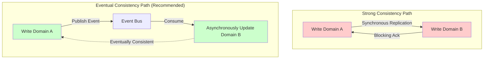
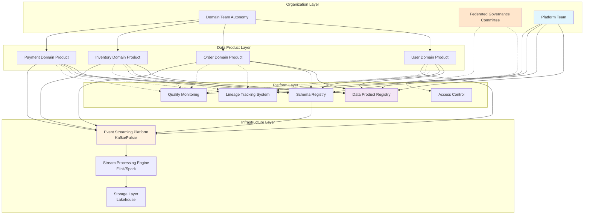
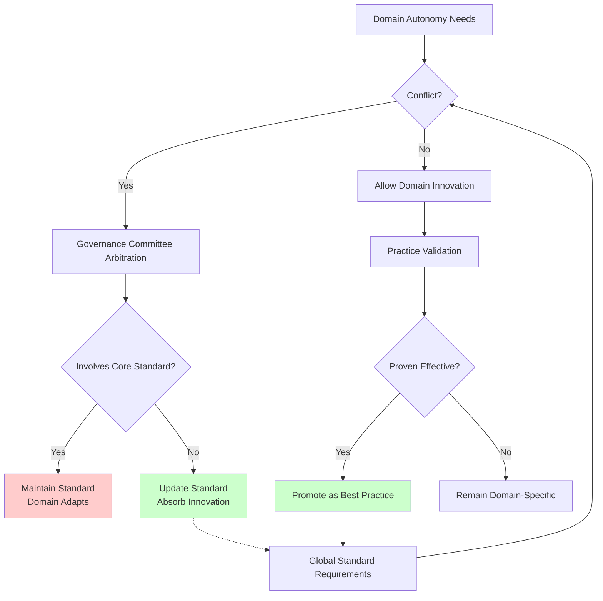
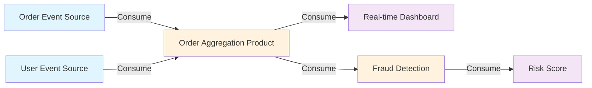
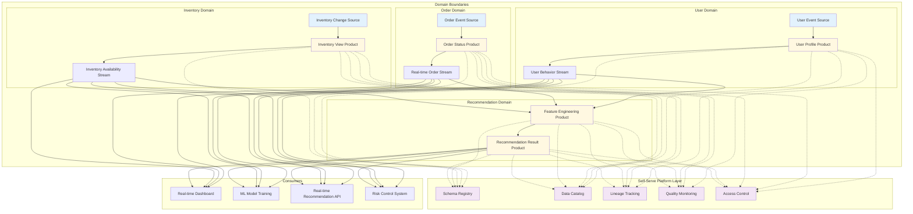
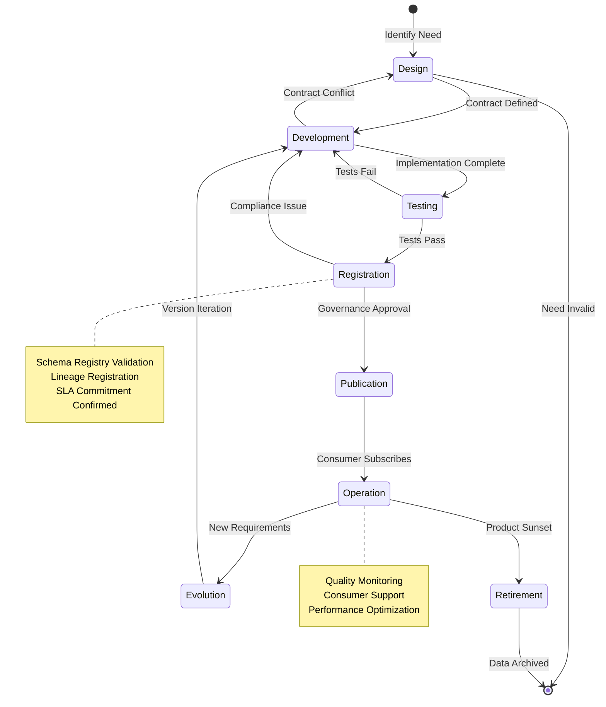
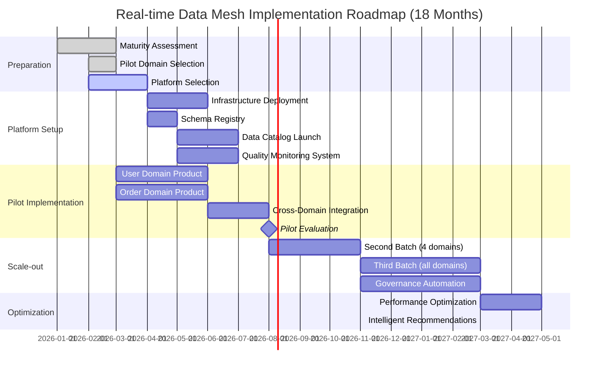
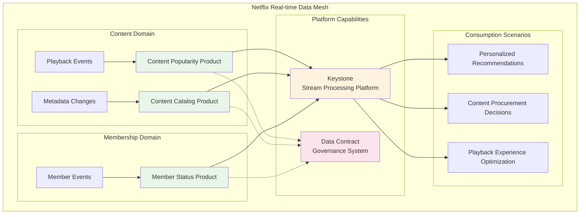

# Real-time Data Mesh Architecture Practice

> **Stage**: Knowledge/06-frontier | **Prerequisites**: [streaming-data-mesh-architecture.md](./streaming-data-mesh-architecture.md), [data-mesh-streaming-architecture-2026.md](../03-business-patterns/data-mesh-streaming-architecture-2026.md), [realtime-data-product-architecture.md](./realtime-data-product-architecture.md) | **Formality Level**: L4 (Engineering Practice)

---

## 1. Definitions

### Def-K-06-201: Real-time Data Mesh

> **Data Mesh** is a decentralized data architecture paradigm that treats data as a product, owned by domain teams, and enables federated governance through a self-serve data platform. A **real-time data mesh** specifically refers to a Data Mesh implementation where **event streams** are the primary data product interfaces, supporting low-latency data consumption.

```
Traditional Data Architecture    vs.    Data Mesh Architecture
┌──────────────────┐          ┌────────────────────────────────┐
│  Central Data    │          │  Domain A   Domain B  Domain C │
│  Lake/Warehouse  │          │  Product    Product   Product  │
│  (Centralized    │   →→→    │    ↓          ↓         ↓      │
│   ETL Pipelines) │          │  Self-Serve Platform +         │
│  Single Team     │          │  Federated Governance Layer    │
│   Bottleneck     │          └────────────────────────────────┘
└──────────────────┘
```

### Def-K-06-202: Domain Data Product

> A **domain data product** is the fundamental building block of a Data Mesh, comprising three core components:
>
> - **Data**: Real-time or batch datasets of domain business entities
> - **Metadata**: Contextual information describing data semantics, quality, and lineage
> - **Interfaces**: Standardized data access endpoints (event streams, APIs, files, etc.)

Data products follow a **Code-First** principle, managing data schemas, processing logic, and quality rules as versioned artifacts.

### Def-K-06-203: Data Contract

> A **data contract** is a formal agreement between data producers and consumers that defines:
>
> - Schema structure (fields, types, constraints)
> - Service quality metrics (latency, availability, freshness)
> - Compatibility rules (forward/backward compatibility policies)
> - Semantic definitions (business terms, computation logic)

```yaml
# Data Contract Example (data-contract.yaml)
contract:
  id: "user-profile-v2"
  owner: "customer-domain@company.com"

  schema:
    type: "avro"
    definition: |
      {
        "type": "record",
        "name": "UserProfile",
        "fields": [
          {"name": "userId", "type": "string"},
          {"name": "tier", "type": {"type": "enum", "name": "Tier", "symbols": ["FREE", "PREMIUM"]}},
          {"name": "updatedAt", "type": "long", "logicalType": "timestamp-millis"}
        ]
      }

  sla:
    freshness: "PT5S"           # 5-second freshness
    availability: "99.99%"      # Four 9s availability
    latency_p99: "100ms"        # P99 latency

  compatibility:
    policy: "BACKWARD_FORWARD"  # Bidirectional compatibility
    deprecation_period: "90d"   # 90-day deprecation period
```

### Def-K-06-204: Federated Governance

> **Federated governance** is a distributed governance model that achieves cross-domain interoperability through **global standards** while preserving domain autonomy. Core governance dimensions include:
>
> - **Interoperability standards**: Common data formats, identifiers, protocols
> - **Discoverability standards**: Unified metadata catalog, data product registry
> - **Accessibility standards**: Authentication, authorization, data security classification
> - **Quality expectations**: Observability metrics, SLA baselines

### Def-K-06-205: Self-serve Data Platform

> A **self-serve data platform** is the technical infrastructure that empowers domain teams to independently build, publish, and operate data products, providing:
>
> - **Infrastructure abstraction**: Hiding underlying storage and compute complexity
> - **Data product lifecycle management**: Complete toolchain from development to retirement
> - **Governance automation**: Policy-as-code, compliance check pipelines

---

## 2. Properties

### Lemma-K-06-201: Decentralization Advantages of Data Mesh

> Decentralized architecture has systematic advantages across the following dimensions:
>
> 1. **Scalability**: Eliminates the bottleneck of a central data team; domains can evolve independently
> 2. **Domain alignment**: Data models align with business boundaries, ensuring high semantic fidelity
> 3. **Velocity**: Domain teams respond directly to business needs, shortening delivery cycles

**Proof Sketch**: Let a central data team handle demands from N domains with processing time O(N). After decentralization, each domain processes independently with complexity O(1) (intra-domain), and overall throughput becomes N × O(1) = O(N), but queue waiting latency is eliminated.

### Prop-K-06-130: Necessity of Event Streams as Data Product Interfaces

> In a real-time data mesh, the **Event Stream** is the only data product interface that satisfies all of the following requirements:
>
> - Low-latency push (< 1 second)
> - Decoupling of production and consumption
> - Supporting concurrent multi-consumer subscriptions
> - Natural time-series semantics

**Argumentation**: Request-response APIs require consumer polling, increasing latency; file interfaces require batch accumulation, violating real-time requirements; only event streams, through publish-subscribe patterns, achieve multi-consumer decoupling while maintaining low latency.

### Prop-K-06-131: Compatibility Propagation of Data Contracts

> Let data product DP have n downstream consumers {C₁, C₂, ..., Cₙ}. If DP's contract changes follow the declared compatibility policy, downstream consumers can upgrade smoothly with **zero coordination cost**.

| Compatibility Policy | Schema Change Example | Consumer Impact |
|---------------------|----------------------|-----------------|
| BACKWARD | Add optional field | Old consumers ignore new field, continue running |
| FORWARD | Delete optional field | New consumers do not depend on the field, old data readable |
| FULL | Add optional field + delete optional field | Interoperability between old and new versions |
| NONE | Change field type | All consumers must upgrade simultaneously |

### Thm-K-06-130: CAP Trade-off in Real-time Data Mesh

> Under the premise of partition tolerance (P), a real-time data mesh chooses **availability (A)** over **strong consistency (C)**, guaranteeing data correctness through **eventual consistency**.

**Engineering Argumentation**:

- **Partition Tolerance (P)**: The distributed nature of cross-domain data products makes P non-negotiable
- **Availability (A)**: Real-time business decisions depend on continuous data flows; unavailability is costly
- **Consistency (C)**: Event Sourcing and CQRS patterns are adopted, achieving eventual consistency through asynchronous projections



---

## 3. Relations

### Mapping Data Mesh to Existing Architecture Paradigms

| Architecture Paradigm | Core Abstraction | Relationship with Data Mesh | Applicable Scenario |
|----------------------|------------------|----------------------------|---------------------|
| **Data Lake** | Centralized storage | Data Mesh can be built on top of a data lake, but ownership is decentralized | Batch analytics |
| **Data Fabric** | Metadata-driven automation | Data Mesh focuses on organizational governance; they are complementary | Cross-cloud data integration |
| **Lambda Architecture** | Batch-stream separation | Domain products in Data Mesh can independently choose processing modes | Hybrid workloads |
| **Kappa Architecture** | Pure stream processing | Highly aligned with real-time Data Mesh philosophy | Pure real-time scenarios |
| **Event Sourcing** | Events as source of truth | Internal implementation pattern for Data Mesh data products | Audit trails |
| **CQRS** | Read-write separation | Pattern reference for data product interface design | High read loads |

### Data Mesh Hierarchy



---

## 4. Argumentation

### 4.1 Why Traditional Data Architectures Cannot Meet Real-time Requirements

**Problem Analysis**:

1. **ETL Bottleneck**: In traditional architectures, central data teams maintain complex ETL pipelines; any new data source onboarding requires queuing
2. **Semantic Drift**: After multiple transformations, domain data loses business semantics, making it difficult for consumers to understand
3. **Latency Accumulation**: T+1 latency in batch processing modes cannot satisfy real-time decision-making needs

**Data Mesh Solution**:

```
Traditional Mode:
Business System → [ETL Pipeline - Domain A Waits] → Central Data Lake → [ETL Pipeline - Domain B Waits] → Data Warehouse → Analytics App

Data Mesh Mode:
Business System → Domain A Data Product (Real-time Stream) ─┬─→ Analytics App A
                                                            ├─→ Analytics App B
                                                            └─→ Domain B Data Product (Consume & Enrich) ──→ Analytics App C
```

### 4.2 Anti-patterns of Real-time Data Products

| Anti-pattern | Description | Consequence | Improvement |
|-------------|-------------|-------------|-------------|
| **Giant Data Product** | Single data product exposes too many entities | Consumers find it hard to understand; broad change impact | Split by business subdomain |
| **Private Protocol** | Uses non-standard formats/protocols | Poor interoperability; high integration cost | Adopt Avro/Protobuf + Kafka |
| **Unversioned Contract** | Schema changes without notification or compatibility policy | Downstream consumers frequently break | Enforce data contracts |
| **Dark Data** | Data product exists but cannot be discovered | Redundant construction; resource waste | Mandatory registration in data catalog |
| **Over-real-time** | All data pursues millisecond-level latency | Excessive cost; diminishing returns | Design by SLA tier |

### 4.3 Boundary Discussion of Federated Governance

**Autonomy vs. Standards Tension**:



---

## 5. Proof / Engineering Argument

### Thm-K-06-131: Completeness of Data Contract Validation

> Automated contract validation implemented through a Schema Registry can **completely prevent** data publications that violate compatibility policies.

**Engineering Argumentation**:

Let the compatibility check function be `validate(schema_old, schema_new, policy)`, returning a boolean indicating whether registration is allowed.

```python
# Pseudocode: Compatibility validation algorithm
def validate(old_schema, new_schema, policy):
    if policy == "BACKWARD":
        # New schema must be able to read old data
        return can_read(new_schema, old_schema)
    elif policy == "FORWARD":
        # Old schema must be able to read new data
        return can_read(old_schema, new_schema)
    elif policy == "FULL":
        return (can_read(new_schema, old_schema) and
                can_read(old_schema, new_schema))
    else:  # NONE
        return True

def can_read(reader_schema, writer_schema):
    # Avro specification: field matching rules
    # 1. Writer fields must have same-name fields in reader
    # 2. Types must be compatible
    # 3. Fields without defaults cannot be missing
    return avro_compatibility_check(reader_schema, writer_schema)
```

**Proof Points**:

1. The Schema Registry acts as a **mandatory gateway** for data publication
2. Compatibility checks are performed at the **registration stage**, not the consumption stage
3. Violating schemas are rejected and cannot propagate downstream

### Thm-K-06-132: Transitive Closure of Lineage Tracking

> If a data mesh's lineage tracking system records each data product's **direct dependencies**, then through transitive closure, the **complete upstream lineage** of any data product can be fully reconstructed.

**Engineering Implementation**:



**Lineage Query Example**:

```sql
-- Recursive query: Get complete upstream of F (Risk Score)
WITH RECURSIVE lineage AS (
    -- Anchor: target data product
    SELECT product_id, product_name, source_product_id
    FROM data_products
    WHERE product_id = 'risk-score-v1'

    UNION ALL

    -- Recursive: trace upward
    SELECT dp.product_id, dp.product_name, dp.source_product_id
    FROM data_products dp
    JOIN lineage l ON dp.product_id = l.source_product_id
)
SELECT * FROM lineage;

-- Result: F → E → B → [A, C]
```

---

## 6. Examples

### 6.1 Technical Implementation: End-to-End Data Product Pipeline

```yaml
# data-product-definition.yaml
apiVersion: datamesh.company.io/v1
kind: DataProduct
metadata:
  name: user-behavior-stream
  domain: customer-experience
  owner: team-ce@company.com
spec:
  inputs:
    - source: kafka://events/user-clicks
      format: json
    - source: kafka://events/page-views
      format: json

  processing:
    engine: flink
    sql: |
      CREATE TABLE user_behavior (
        user_id STRING,
        event_type STRING,
        page_url STRING,
        event_time TIMESTAMP(3),
        WATERMARK FOR event_time AS event_time - INTERVAL '5' SECOND
      ) WITH (...);

      INSERT INTO output_stream
      SELECT
        user_id,
        event_type,
        COUNT(*) OVER (
          PARTITION BY user_id
          ORDER BY event_time
          RANGE BETWEEN INTERVAL '10' MINUTE PRECEDING AND CURRENT ROW
        ) as event_count_10m
      FROM user_behavior;

  output:
    topic: dataproduct.customer-experience.user-behavior
    format: avro
    schemaRegistry: https://schema-registry.company.io

  quality:
    freshness_sla: "PT30S"
    completeness_threshold: 0.999
    schema_compatibility: BACKWARD_FORWARD

  access:
    auth: mTLS
    consumers:
      - domain: personalization
        permissions: [read]
      - domain: analytics
        permissions: [read]
```

### 6.2 Organizational Transformation: Domain Team Structure Template

```
┌─────────────────────────────────────────────────────────────┐
│                    User Domain                              │
│                  Data Product Team Structure                │
├─────────────────────────────────────────────────────────────┤
│                                                             │
│  ┌─────────────────┐  ┌─────────────────┐  ┌─────────────┐ │
│  │  Data Product   │  │  Domain Eng x2  │  │ Data Eng    │ │
│  │     Owner       │  │                 │  │             │ │
│  │                 │  │                 │  │             │ │
│  │ • Product vision│  │ • Business rules│  │ • Pipeline  │ │
│  │ • Prioritization│  │ • Quality rules │  │   dev       │ │
│  │ • Consumer liais│  │ • Semantic val. │  │ • Performance│ │
│  │ • Governance    │  │ • Consumer supp.│  │ • Monitoring│ │
│  │   coordination  │  │                 │  │ • Incident  │ │
│  │                 │  │                 │  │   response  │ │
│  └─────────────────┘  └─────────────────┘  └─────────────┘ │
│                                                             │
│  Platform Support: Data Platform Team provides infrastructure,│
│  toolchain, and best-practice guidance                      │
└─────────────────────────────────────────────────────────────┘
```

### 6.3 Implementation Path: Maturity Model

| Dimension | Level 1 (Initial) | Level 2 (Repeatable) | Level 3 (Defined) | Level 4 (Managed) | Level 5 (Optimized) |
|-----------|-------------------|----------------------|-------------------|-------------------|---------------------|
| **Data Products** | Few pilots | Multiple domains have products | Full product line coverage | Productized operations | Auto-optimization recommendations |
| **Contract Management** | Document agreements | Schema versioning | Automated validation | SLA monitoring | Intelligent compatibility suggestions |
| **Lineage Tracking** | Manual records | Partial automation | Full-linkage automatic | Impact analysis | Predictive lineage |
| **Governance Model** | Centralized approval | Federation initial build | Mature standards | Autonomy + oversight | Adaptive governance |
| **Platform Capability** | Basic tools | Self-service onboarding | Full lifecycle | Intelligent operations | Platform as a product |

---

## 7. Visualizations

### Figure 1: Real-time Data Mesh Overall Architecture



### Figure 2: Data Product Lifecycle



### Figure 3: Implementation Roadmap Gantt Chart



### Figure 4: Netflix Data Mesh Simplified Architecture



---

## 8. References


---

*Document Version: v1.0 | Last Updated: 2026-04-03 | Status: Complete*
