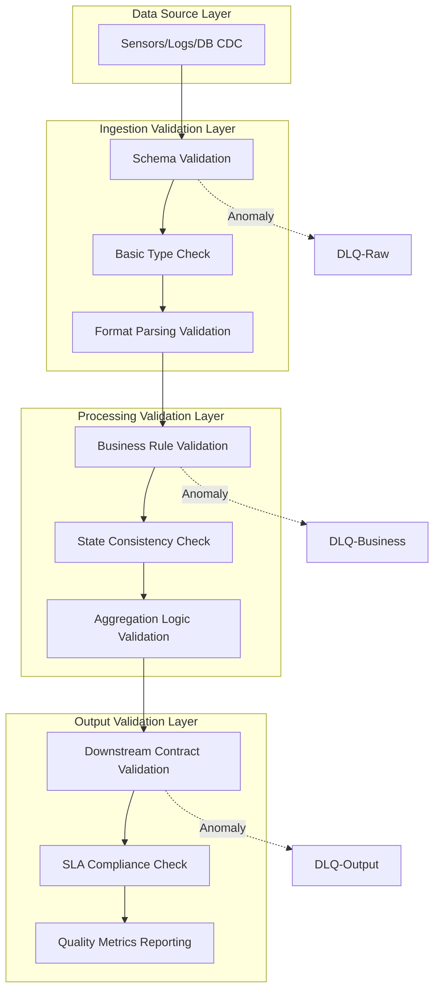
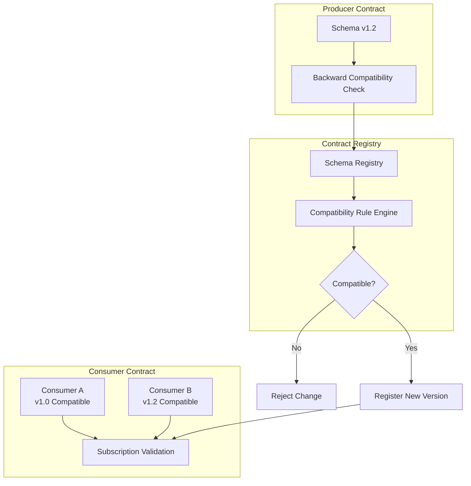
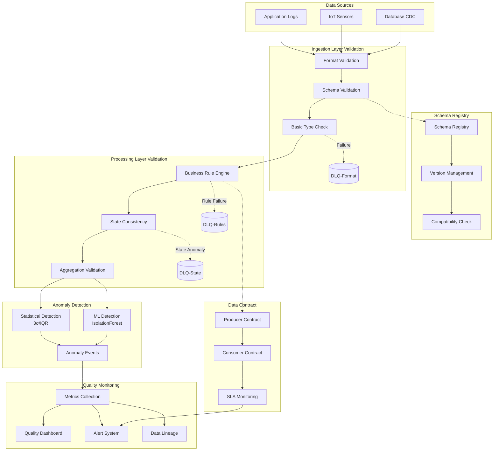
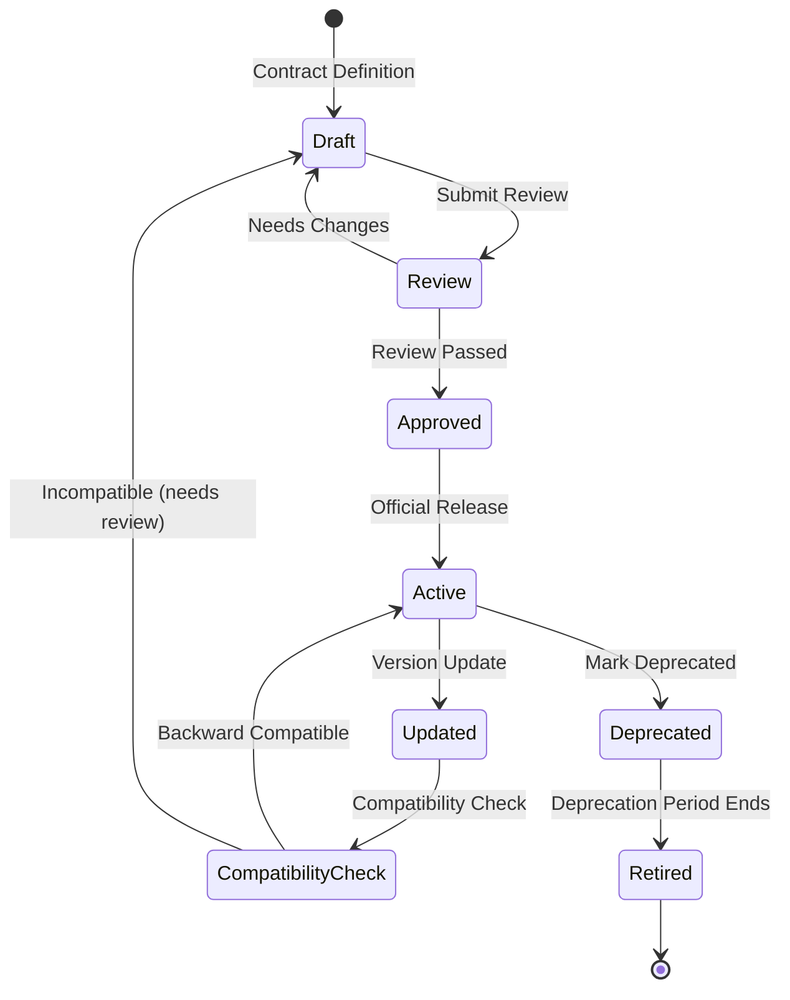
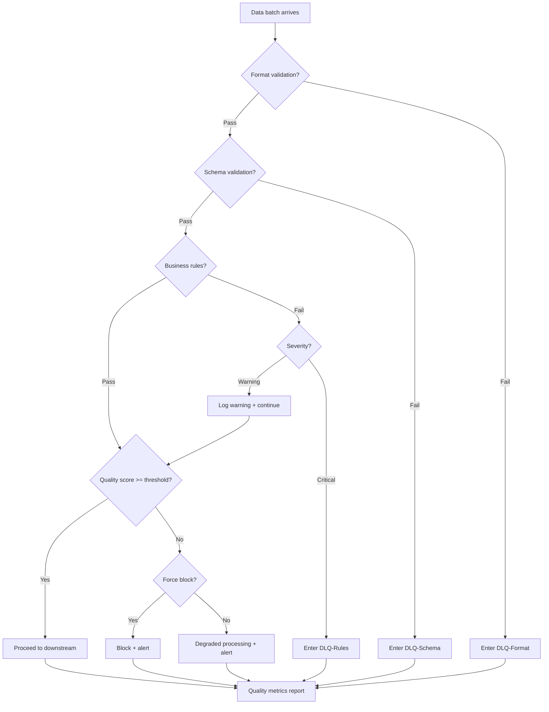
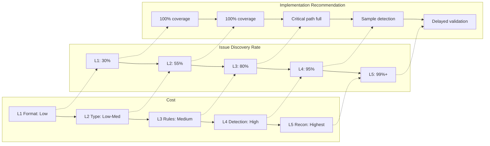

# Real-time Stream Processing Data Quality and Validation

> **Stage**: Knowledge | **Prerequisites**: [05-streaming-design-patterns.md](../02-design-patterns/pattern-event-time-processing.md), [Flink/04-state-checkpoint/exactly-once-semantics.md](../../Flink/02-core/exactly-once-end-to-end.md) | **Formality Level**: L3

---

## 1. Definitions

### 1.1 Five Dimensions of Data Quality

**Def-K-06-140 (Data Quality Dimensions)**

Data quality dimensions are measurable attributes that assess the degree to which data meets business needs. In stream processing scenarios, the five core dimensions are defined as follows:

| Dimension | Definition | Stream Processing Metrics |
|-----------|------------|---------------------------|
| **Completeness** | Degree of missing data records and fields | Null rate, field fill rate, arrival rate |
| **Accuracy** | Degree of conformity between data and the real world or reference sources | Validation pass rate, outlier ratio, match rate |
| **Consistency** | Logical consistency of data across systems and time | Cross-source consistency, temporal consistency, constraint violation rate |
| **Timeliness** | Degree of delay in data arrival | End-to-end latency, watermark delay, freshness |
| **Validity** | Degree to which data conforms to predefined formats and business rules | Schema compliance rate, rule pass rate, type error rate |

### 1.2 Stream Processing Data Quality Challenges

**Def-K-06-141 (Stream Data Quality Loss Function)**

Let the quality loss function $L(S)$ of stream $S$ in time window $[t_0, t_1]$ be defined as:

$$L(S) = \sum_{d \in D} w_d \cdot l_d(S, [t_0, t_1])$$

Where:

- $D = \{\text{Completeness}, \text{Accuracy}, \text{Consistency}, \text{Timeliness}, \text{Validity}\}$
- $w_d$ is the weight coefficient for dimension $d$, $\sum w_d = 1$
- $l_d$ is the loss measure for dimension $d$ within the window

### 1.3 Data Contract

**Def-K-06-142 (Data Contract)**

A data contract is a formal agreement between producers and consumers regarding data format, semantics, and SLA, comprising a quadruple:

$$\text{Contract} = (\text{Schema}, \text{Semantics}, \text{SLA}, \text{Version})$$

- **Schema**: Structured type definition (fields, types, constraints)
- **Semantics**: Business semantic description (field meaning, value range, business rules)
- **SLA**: Service Level Agreement (latency ceiling, availability target, quality threshold)
- **Version**: Semantic version number (following SemVer: MAJOR.MINOR.PATCH)

### 1.4 Data Observability

**Def-K-06-143 (Data Observability)**

Data observability is the practice of inferring the internal state of data through system external outputs; core capabilities include:

| Capability | Description | Key Questions |
|------------|-------------|---------------|
| **Metrics** | Quantitative indicator collection | Data volume, latency, error rate, quality score |
| **Logging** | Structured logs | Who did what when, data change trajectory |
| **Tracing** | Distributed tracing | Where data came from and went to, processing path |
| **Profiling** | Data profiling | Statistical characteristics of data, distribution changes |
| **Lineage** | Data lineage | Data dependency relationships, impact analysis |

**Data Quality vs. Data Observability**:

- **Data Quality**: Focuses on "is the data correct" (What)
- **Data Observability**: Focuses on "why is there a problem" (Why)
- **Relationship**: Observability is the infrastructure for quality governance

---

## 2. Properties

### 2.1 Timeliness Constraints of Real-time Validation

**Lemma-K-06-001 (Validation Latency Inequality)**

Let the end-to-end latency of the stream processing system be $L_{e2e}$ and the quality validation latency be $L_{val}$. The necessary condition for effective validation is:

$$L_{val} \ll L_{e2e}$$

That is, validation latency must be much smaller than end-to-end latency; otherwise quality feedback loses timeliness.

**Proof**:
If $L_{val} \geq L_{e2e}$, then by the time a quality issue is discovered, dirty data has already affected downstream consumers, and validation loses its preventive value. QED.

### 2.2 Throughput Impact of Quality Validation

**Prop-K-06-001 (Validation Throughput Upper Bound)**

Let the baseline system throughput be $T_{base}$, the throughput after introducing validation be $T_{validated}$, and the validation overhead be $\alpha$. Then:

$$T_{validated} \leq \frac{T_{base}}{1 + \alpha}$$

Where $\alpha$ depends on validation complexity:

- Schema validation: $\alpha \approx 0.05$ (5%)
- Business rule validation: $\alpha \approx 0.15$ (15%)
- ML anomaly detection: $\alpha \approx 0.50$ (50%+)

### 2.3 Dead Letter Queue Completeness

**Lemma-K-06-002 (DLQ Completeness Condition)**

The Dead Letter Queue mechanism guarantees that all unprocessable data is captured if and only if:

$$\forall e \in \text{Stream}: \text{Process}(e) = \bot \Rightarrow e \in \text{DLQ}$$

That is, any event that fails processing must enter the dead letter queue; otherwise the system will produce **silent data loss**.

---

## 3. Relations

### 3.1 Validation Architecture Layers



### 3.2 Spatio-temporal Trade-offs of Validation Strategies

| Validation Type | Space Complexity | Time Complexity | Applicable Scenario |
|-----------------|------------------|-----------------|---------------------|
| Stateless validation | $O(1)$ | $O(1)$ | Schema, format, basic rules |
| Window validation | $O(W)$ | $O(W)$ | Temporal consistency, window aggregation verification |
| Stateful validation | $O(S)$ | $O(1)$ | Deduplication, state-dependent rules |
| Full validation | $O(N)$ | $O(N)$ | End-to-end consistency, delayed loading |

Where $W$ is window size, $S$ is state size, and $N$ is total data volume.

### 3.3 Data Contract Change Propagation



---

## 4. Argumentation

### 4.1 Layered Validation Strategy Design

**Design Principle**: Validation cost should be inversely proportional to data quality risk.

```
┌─────────────────────────────────────────────┐
│  L1: Format Validation (Low cost, 100% cov) │
│  - JSON/Avro/Protobuf parsing               │
│  - Required field existence check           │
├─────────────────────────────────────────────┤
│  L2: Type Validation (Low-Med cost, 100%)   │
│  - Data type matching                       │
│  - Range constraint check                   │
├─────────────────────────────────────────────┤
│  L3: Business Rules (Med cost, sample/full) │
│  - Cross-field validation                   │
│  - State-dependent rules                    │
├─────────────────────────────────────────────┤
│  L4: Anomaly Detection (High cost, sample)  │
│  - Statistical anomaly detection            │
│  - ML anomaly detection                     │
├─────────────────────────────────────────────┤
│  L5: End-to-end Validation (Highest cost,   │
│      delayed)                               │
│  - Reconciliation with source system        │
│  - Business result validation               │
└─────────────────────────────────────────────┘
```

### 4.2 Anomaly Detection Method Comparison

| Method | Latency | Accuracy | Explainability | Applicable Scenario |
|--------|---------|----------|----------------|---------------------|
| Threshold rules | Real-time | Medium | High | Known boundary conditions |
| Statistical detection (3σ) | Real-time | Medium-High | High | Normally distributed data |
| IQR method | Real-time | Medium | Medium | Skewed distribution data |
| Moving average deviation | Minute-level | High | Medium | Trending data |
| Isolation Forest | Minute-level | High | Low | Multi-dimensional anomalies |
| LSTM Autoencoder | Hour-level | Very High | Low | Complex temporal patterns |

### 4.3 Data Quality Metric Design

**Core Metric Matrix**:

```
                 High Impact
                    │
    ┌───────────────┼───────────────┐
    │   Fix Now     │   Fix Now     │
    │   (Data Loss) │   (Core Biz)  │
Low ─┤───────────────┼───────────────┤─ High
Freq │   Schedule    │   Urgent      │  Freq
    │   (Edge Case) │   (New Found) │
    └───────────────┼───────────────┘
                    │
                 Low Impact
```

---

## 5. Proof / Engineering Argument

### 5.1 Layered Validation Completeness Theorem

**Thm-K-06-100 (Layered Validation Completeness)**

Let the layered validation system be $\mathcal{V} = \{V_1, V_2, ..., V_n\}$, where $V_i$ is the $i$-th layer validator. If the following conditions are satisfied:

1. **Full Coverage**: $\bigcup_{i=1}^{n} \text{Dom}(V_i) = \text{AllData}$
2. **No Omission**: $\forall i < j: \text{Dom}(V_i) \cap \text{Dom}(V_j) = \emptyset$ or $V_j \text{ enhances } V_i$
3. **Fault Isolation**: $\forall V_i: \text{Failure}(V_i) \Rightarrow \text{NoCascade}$

Then the system guarantees data quality under the quality loss upper bound $L_{max}$.

**Engineering Argumentation**:

In actual stream processing systems, the above conditions are achieved through the following mechanisms:

```java

import org.apache.flink.streaming.api.datastream.DataStream;

// Flink layered validation pattern
DataStream<Event> validatedStream = source
    // L1: Format validation (100% coverage, failures go to DLQ)
    .map(new SchemaValidationMapper())
    .split(new OutputSelector<Event>() {
        @Override
        public Iterable<String> selectOutputs(Event event) {
            return event.isValid()
                ? Collections.singleton("valid")
                : Collections.singleton("dlq-format");
        }
    })
    // L2: Business rule validation
    .map(new BusinessRuleValidator())
    // L3: Anomaly detection (Side Output mode)
    .process(new AnomalyDetectionProcessFunction());
```

### 5.2 Data Contract Backward Compatibility

**Thm-K-06-101 (Contract Compatibility)**

Let contract version $C_v = (S_v, Sem_v, SLA_v)$. A version upgrade $C_v \to C_{v'}$ is backward compatible if and only if:

$$\forall c \in \text{Consumers}: c \text{ compatible } S_v \Rightarrow c \text{ compatible } S_{v'}$$

**Compatibility Rule Matrix**:

| Change Type | Schema Compatible | Semantic Compatible | SLA Compatible | Version Impact |
|-------------|-------------------|---------------------|----------------|----------------|
| Add optional field | ✓ | ✓ | - | MINOR |
| Extend enum values | ✓ | ⚠️ | - | MINOR |
| Relax constraint | ✓ | ⚠️ | - | MINOR |
| Add required field | ✗ | ✗ | - | MAJOR |
| Delete field | ✗ | ✗ | - | MAJOR |
| Change field type | ✗ | ✗ | - | MAJOR |
| Tighten SLA | - | - | ✗ | MAJOR |
| Relax SLA | - | - | ✓ | MINOR |

### 5.3 Dead Letter Queue Data Integrity Guarantee

**Thm-K-06-102 (DLQ Integrity)**

Under at-least-once semantics, the DLQ mechanism guarantees zero data loss if and only if:

$$\forall e: \text{ProcessFail}(e) \Rightarrow (e \in DLQ \land \text{Ack}(e) = \text{false})$$

**Flink Implementation Pattern**:

```java
// DLQ-enabled ProcessFunction
public class ValidatedProcessFunction extends ProcessFunction<Event, Result> {
    private final OutputTag<Event> dlqTag =
        new OutputTag<Event>("dlq"){};

    @Override
    public void processElement(Event event, Context ctx,
                               Collector<Result> out) {
        try {
            ValidationResult result = validate(event);
            if (result.isSuccess()) {
                out.collect(result.getValue());
            } else {
                // Route to DLQ without throwing exception
                ctx.output(dlqTag, enrichWithError(event, result));
            }
        } catch (Exception e) {
            // Unexpected errors enter DLQ
            ctx.output(dlqTag, enrichWithException(event, e));
        }
    }
}
```

---

## 6. Examples

### 6.1 Flink SQL DDL Constraints

```sql
-- Flink DDL example with constraints
CREATE TABLE user_events (
    user_id STRING NOT NULL,
    event_type STRING NOT NULL,
    timestamp TIMESTAMP(3) NOT NULL,
    amount DECIMAL(10, 2),

    -- Row-level constraints
    CONSTRAINT valid_amount CHECK (amount >= 0),
    CONSTRAINT valid_event CHECK (event_type IN ('click', 'purchase', 'logout')),

    -- Watermark definition (timeliness guarantee)
    WATERMARK FOR timestamp AS timestamp - INTERVAL '5' SECOND
) WITH (
    'connector' = 'kafka',
    'topic' = 'user-events',
    'format' = 'json',
    'json.fail-on-missing-field' = 'false',
    'json.ignore-parse-errors' = 'true'
);

-- Quality metrics collection table
CREATE TABLE quality_metrics (
    window_start TIMESTAMP(3),
    validation_type STRING,
    total_count BIGINT,
    passed_count BIGINT,
    failed_count BIGINT,
    PRIMARY KEY (window_start, validation_type) NOT ENFORCED
) WITH (
    'connector' = 'jdbc',
    'url' = 'jdbc:postgresql://...',
    'table-name' = 'quality_metrics'
);

-- Quality metrics aggregation
INSERT INTO quality_metrics
SELECT
    TUMBLE_START(timestamp, INTERVAL '1' MINUTE) as window_start,
    'schema_validation' as validation_type,
    COUNT(*) as total_count,
    COUNT(*) FILTER (WHERE user_id IS NOT NULL) as passed_count,
    COUNT(*) FILTER (WHERE user_id IS NULL) as failed_count
FROM user_events
GROUP BY TUMBLE(timestamp, INTERVAL '1' MINUTE);
```

### 6.2 Data Quality Operator Implementation

```java
import org.apache.flink.streaming.api.functions.ProcessFunction;

/**
 * Generic data quality validation operator
 * Supports: Schema validation, rule validation, anomaly detection
 */
public class DataQualityOperator<T> extends
    ProcessFunction<T, T> implements CheckpointedFunction {

    private final List<ValidationRule<T>> rules;
    private final OutputTag<QualityViolation> violationTag;
    private final OutputTag<T> dlqTag;

    // Quality metrics state
    private transient MapState<String, ValidationMetrics> metricsState;

    @Override
    public void processElement(T element, Context ctx, Collector<T> out) {
        boolean allPassed = true;

        for (ValidationRule<T> rule : rules) {
            ValidationResult result = rule.validate(element);

            if (!result.isPassed()) {
                allPassed = false;

                // Send violation event to Side Output
                ctx.output(violationTag, new QualityViolation(
                    rule.getName(),
                    result.getSeverity(),
                    result.getMessage(),
                    System.currentTimeMillis()
                ));

                // Critical errors go directly to DLQ
                if (result.getSeverity() == Severity.CRITICAL) {
                    ctx.output(dlqTag, element);
                    return; // Stop further processing
                }
            }

            // Update metrics
            updateMetrics(rule.getName(), result.isPassed());
        }

        if (allPassed) {
            out.collect(element);
        }
    }

    private void updateMetrics(String ruleName, boolean passed) {
        ValidationMetrics metrics = metricsState.get(ruleName);
        if (metrics == null) {
            metrics = new ValidationMetrics(ruleName);
        }
        metrics.increment(passed);
        metricsState.put(ruleName, metrics);
    }
}
```

### 6.3 Schema Registry Integration

```java
/**
 * Validation based on Confluent Schema Registry
 */
public class SchemaRegistryValidation implements
    DeserializationSchema<GenericRecord> {

    private final String subject;
    private transient SchemaRegistryClient client;
    private transient DatumReader<GenericRecord> reader;

    @Override
    public GenericRecord deserialize(byte[] message) throws IOException {
        // Read schema ID (Confluent format: magic byte + 4 bytes ID)
        int schemaId = ((message[1] & 0xFF) << 24) |
                       ((message[2] & 0xFF) << 16) |
                       ((message[3] & 0xFF) << 8) |
                       (message[4] & 0xFF);

        // Get Schema from Registry
        Schema schema = client.getSchemaById(schemaId);

        // Validate and deserialize
        reader = new SpecificDatumReader<>(schema);
        Decoder decoder = DecoderFactory.get().binaryDecoder(
            message, 5, message.length - 5, null);

        return reader.read(null, decoder);
    }

    // Compatibility check
    public Compatibility checkCompatibility(String subject,
                                           Schema newSchema) {
        return client.testCompatibility(subject, newSchema);
    }
}
```

### 6.4 Real-time Quality Dashboard Configuration

```yaml
# Grafana Dashboard config snippet
apiVersion: 1
datasources:
  - name: QualityMetrics
    type: postgres
    url: postgres:5432
    database: data_quality

dashboards:
  - title: "Real-time Data Quality Monitoring"
    panels:
      - title: "Quality Score Trend"
        type: graph
        targets:
          - rawSql: |
              SELECT
                time_bucket('1 minute', window_start) as time,
                AVG(passed_count::float / total_count) as quality_score
              FROM quality_metrics
              WHERE $__timeFilter(window_start)
              GROUP BY 1

      - title: "Validation Failure Distribution"
        type: pie
        targets:
          - rawSql: |
              SELECT
                validation_type,
                SUM(failed_count) as failures
              FROM quality_metrics
              WHERE $__timeFilter(window_start)
              GROUP BY validation_type

      - title: "Data Latency Heatmap"
        type: heatmap
        targets:
          - rawSql: |
              SELECT
                time_bucket('5 minutes', event_time) as time,
                EXTRACT(EPOCH FROM (processing_time - event_time)) / 60
                  as lag_minutes
              FROM event_lag_metrics
              WHERE $__timeFilter(event_time)
```

---

## 7. Visualizations

### 7.1 Real-time Data Quality Architecture Panorama



### 7.2 Data Contract Lifecycle



### 7.3 Quality Gate Decision Tree



### 7.4 Layered Validation Cost-Benefit Analysis



---

## 8. References


---

## Appendix: Theorem/Definition Index

| ID | Name | Section |
|----|------|---------|
| Def-K-06-140 | Data Quality Dimensions | 1.1 |
| Def-K-06-141 | Stream Data Quality Loss Function | 1.2 |
| Def-K-06-142 | Data Contract | 1.3 |
| Def-K-06-143 | Data Observability | 1.4 |
| Lemma-K-06-001 | Validation Latency Inequality | 2.1 |
| Prop-K-06-001 | Validation Throughput Upper Bound | 2.2 |
| Lemma-K-06-002 | DLQ Completeness Condition | 2.3 |
| Thm-K-06-100 | Layered Validation Completeness | 5.1 |
| Thm-K-06-101 | Contract Compatibility | 5.2 |
| Thm-K-06-102 | DLQ Integrity | 5.3 |
