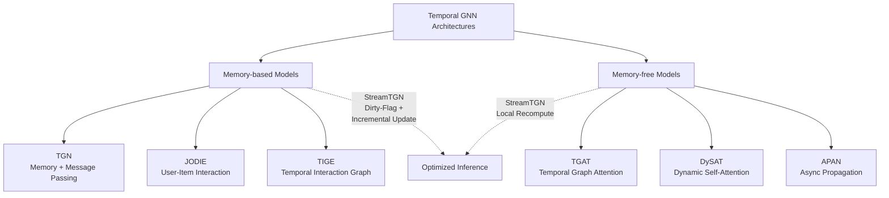
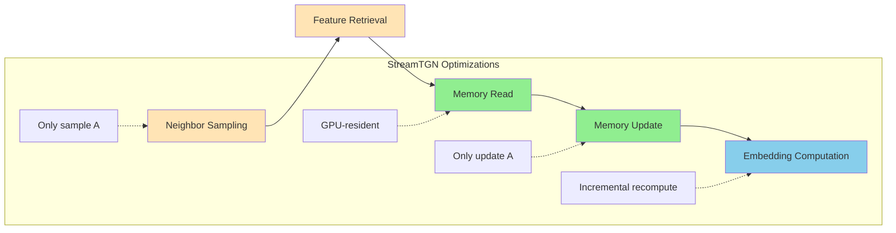
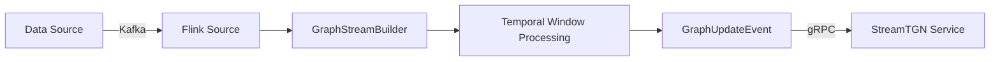
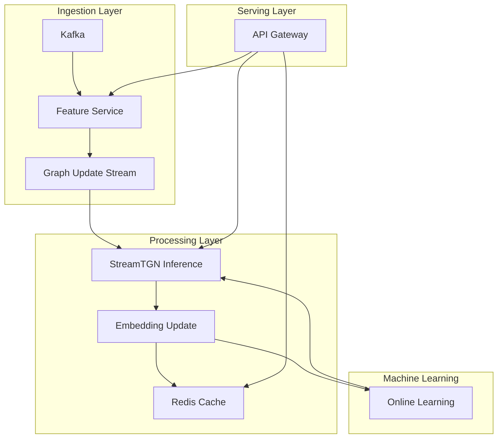

# Real-Time Graph Stream Processing and Temporal GNN (StreamTGN)

> **Stage**: Knowledge/06-frontier | **Prerequisites**: [Stream Processing Patterns](../02-design-patterns/pattern-event-time-processing.md), [Flink Gelly Graph Processing](../../Flink/05-ecosystem/05.04-graph/flink-gelly-streaming-graph-processing.md) | **Formalization Level**: L3

## 1. Definitions

### Def-K-06-230: Temporal Graph

**Definition**: A temporal graph is a dynamic graph structure composed of a sequence of timestamped edges $\mathcal{G}_T = (V, E_T)$, where:

- $V$: set of nodes, $|V| = n$
- $E_T = \{(u, v, t) \mid u, v \in V, t \in \mathcal{T}\}$: set of timestamped edges
- $\mathcal{T} = \{t_1, t_2, ..., t_m\}$: time domain, $t_1 < t_2 < ... < t_m$

**Dynamic property**: The temporal graph evolves over time; the graph state at each timestamp $t$ is $\mathcal{G}_t = (V, E_t)$, where $E_t = \{(u, v, t') \in E_T \mid t' \leq t\}$.

**Intuitive explanation**: A temporal graph describes the process of how relationships between entities change over time, such as follow relationships in social networks, transfer records in financial transaction networks, and fact updates in knowledge graphs.

---

### Def-K-06-231: Streaming Graph

**Definition**: A streaming graph is an infinite sequence of graph update events:

$$\mathcal{S}_G = \langle e_1, e_2, e_3, ... \rangle$$

Where each event $e_i = (\text{type}_i, (u_i, v_i), t_i, \text{feat}_i)$ contains:

- $\text{type}_i \in \{\text{ADD}, \text{DEL}, \text{UPD}\}$: event type (add/delete/update edge)
- $(u_i, v_i)$: endpoint nodes of the edge
- $t_i$: timestamp of the event occurrence
- $\text{feat}_i$: edge feature vector

**Comparison with static graphs**:

| Property | Static Graph | Streaming Graph |
|----------|--------------|-----------------|
| Scale | Fixed $|V|$ | Dynamic growth |
| Edge set | $E$ unchanged | $E_t$ evolves over time |
| Query | Based on full graph | Based on time window |
| Algorithm complexity | $O(f(|V|, |E|))$ | Must consider time dimension $O(f(|V|, |E_t|, W))$ |
| Storage | Batch loading | Incremental update |

---

### Def-K-06-232: Temporal Graph Neural Network (TGNN)

**Definition**: TGNN is a neural network that learns temporal graph representations, defined as:

$$\mathcal{N}_{TGNN}: \mathcal{G}_t \times \mathcal{H}_{t-1} \rightarrow \mathcal{H}_t \times \mathcal{Z}_t$$

Where:

- $\mathcal{H}_t = \{h_v^{(t)} \mid v \in V\}$: node memory states at time $t$
- $\mathcal{Z}_t = \{z_v^{(t)} \mid v \in V\}$: node embedding outputs at time $t$
- State transition: $h_v^{(t)} = \text{MEM}_{\text{UPDATE}}(h_v^{(t-1)}, m_v^{(t)})$
- Message aggregation: $m_v^{(t)} = \text{AGG}_{u \in \mathcal{N}(v)} \text{MSG}(h_u^{(t-1)}, e_{uv}^{(t)})$

**Intuitive explanation**: TGNN captures historical information by maintaining node memory states, aggregates neighbor features through a message passing mechanism, and generates temporal-aware node embeddings.

---

### Def-K-06-233: Incremental vs Full Recomputation

**Definition**: For a temporal graph update event $e_t$, two computation strategies are defined:

**Full Recomputation**:
$$\mathcal{Z}_t^{\text{full}} = \text{TGNN}(\mathcal{G}_t; \Theta)$$
Complexity: $O(|V| \cdot k^L)$, where $k$ is the neighbor sampling number and $L$ is the number of layers

**Incremental Computation**:
$$\mathcal{Z}_t^{\text{inc}} = \{z_v^{(t)} \mid v \in \mathcal{A}_t\} \cup \{z_v^{(t-1)} \mid v \notin \mathcal{A}_t\}$$
Where the affected node set $\mathcal{A}_t = \{v \mid \text{dist}(v, e_t) \leq L\}$
Complexity: $O(|\mathcal{A}_t| \cdot k^L)$, where $|\mathcal{A}_t| \ll |V|$

**Precision equivalence**: If $\text{MEM}_{\text{UPDATE}}$ is a deterministic function, then $\mathcal{Z}_t^{\text{inc}} = \mathcal{Z}_t^{\text{full}}$.

---

### Def-K-06-234: Dirty-Flag Propagation

**Definition**: Dirty-flag propagation is a lightweight mechanism in StreamTGN used to identify affected nodes:

$$\text{DIRTY}: V \times E_T \rightarrow \{0, 1\}$$

Initialization: $\forall v \in V, \text{DIRTY}_0(v) = 0$

Update rule: For a newly arrived edge $(u, v, t)$,

$$\text{DIRTY}_t(x) = \begin{cases}
1 & \text{if } x = u \text{ or } x = v \\
1 & \text{if } \exists y \in \mathcal{N}(x): \text{DIRTY}_{t'}(y) = 1 \land t' < t \land \text{dist}(x, y) \leq L
\\
\text{DIRTY}_{t-1}(x) & \text{otherwise}
\end{cases}$$

**Affected node set**: $\mathcal{A}_t = \{v \in V \mid \text{DIRTY}_t(v) = 1\}$

**Key property**: On million-node graphs, the proportion of affected nodes per batch is typically $< 0.2\%$[^1].

---

### Def-K-06-235: Drift-Aware Rebuild

**Definition**: Drift-aware rebuild is an adaptive strategy that controls the accuracy of incremental computation:

Let $z_v^{\text{inc}}$ be the incrementally computed embedding and $z_v^{\text{full}}$ be the fully recomputed embedding. Define the drift metric:

$$\Delta_t = \frac{1}{|V|} \sum_{v \in V} \|z_v^{\text{inc}} - z_v^{\text{full}}\|_2$$

**Rebuild trigger condition**: Full rebuild is triggered when $\Delta_t > \delta_{\max}$, where $\delta_{\max}$ is the tolerable drift upper bound.

**Adaptive scheduling**: The rebuild interval $\tau$ is dynamically adjusted according to historical drift patterns:

$$\tau_{t+1} = \tau_t \cdot \left(1 + \alpha \cdot \frac{\delta_{\max} - \Delta_t}{\delta_{\max}}\right)$$

Where $\alpha$ is the learning rate.

---

## 2. Properties

### Prop-K-06-70: Locality Theorem

**Proposition**: In an $L$-layer TGNN, the upper bound on the number of nodes affected by a single edge update $(u, v, t)$ is:

$$|\mathcal{A}_t| \leq 2 \cdot \sum_{l=0}^{L} k^l = 2 \cdot \frac{k^{L+1} - 1}{k - 1}$$

Where $k$ is the neighbor sampling number per layer.

**Proof**:
- Layer 0: Directly affects endpoints $u, v$ (2 nodes)
- Layer 1: Affects sampled neighbors of $u, v$ (at most $2k$ nodes)
- Layer $l$: Affects at most $2k^l$ nodes
- Total affected nodes is the sum of a geometric series

**Actual observation**: On real-world graphs, due to skewed degree distributions and sampling overlap, the actual $|\mathcal{A}_t|$ is far below the theoretical bound[^1].

---

### Prop-K-06-71: Complexity Comparison

**Proposition**: The speedup of StreamTGN relative to full recomputation is:

$$\text{Speedup} = \frac{O(|V|)}{O(|\mathcal{A}_t|)} = O\left(\frac{|V|}{|\mathcal{A}_t|}\right)$$

**Experimental data** (Stack-Overflow dataset, 2.6M nodes)[^1]:

| Model | Dirty Nodes per Batch | Affected Proportion | Speedup |
|-------|----------------------|---------------------|---------|
| TGN | 3,497 | 0.14% | 739× |
| TGAT | 2,100 | 0.08% | 4,207× |
| DySAT | 4,200 | 0.16% | 56× |

---

### Prop-K-06-72: Memory Footprint Analysis

**Proposition**: The GPU memory requirement of StreamTGN is:

$$M_{\text{StreamTGN}} = M_{\text{node}} + M_{\text{edge}} + M_{\text{cache}}$$

Where:
- $M_{\text{node}} = |V| \cdot d_{\text{mem}}$: node memory states (resident)
- $M_{\text{edge}} = |E_t| \cdot d_{\text{edge}}$: edge feature storage
- $M_{\text{cache}} = |V| \cdot d_{\text{emb}}$: embedding cache (optional)

**Comparison** (Unit: GB)[^1]:

| Dataset | Nodes | TGL Memory | StreamTGN Memory | Savings |
|---------|-------|------------|------------------|---------|
| WIKI | 9K | 2.1 | 1.8 | 14% |
| REDDIT | 11K | 3.4 | 2.1 | 38% |
| MOOC | 7K | 1.9 | 1.5 | 21% |
| Stack-OF | 2.6M | 48.2 | 12.6 | 74% |

---

## 3. Relations

### 3.1 TGNN Architecture Classification



### 3.2 StreamTGN Relationship with Existing Systems

| System | Optimization Phase | Core Technology | Relationship with StreamTGN |
|--------|--------------------|-----------------|-----------------------------|
| TGL | Training + Inference | GPU parallel sampling | StreamTGN inference replacement, orthogonal optimization |
| ETC | Training | Adaptive batching | Can be叠加 in training phase |
| SIMPLE | Training | Dynamic data placement | Can be叠加 in training phase |
| SWIFT | Training | Tiered storage pipeline | Best combination: SWIFT + StreamTGN = 24× speedup |
| StreamTGN | Inference | Incremental refresh | Focuses on inference optimization, no precision loss |

---

## 4. Argumentation

### 4.1 Five-Stage Pipeline Analysis

StreamTGN optimization is based on a detailed breakdown of TGN inference bottlenecks[^1]:

| Stage | Description | TGL Proportion | TGAT Proportion | Optimization Strategy |
|-------|-------------|----------------|-----------------|-----------------------|
| ① Neighbor Sampling | Sample historical neighbors by time | 22.5-25.7% | 18.2-22.0% | Only sample affected nodes |
| ② Feature Retrieval | Retrieve node/edge features | 15.1-23.3% | 26.0-30.9% | Cache dirty node features |
| ③ Memory Read | Read node memory states | 2.4-3.9% | 0% | GPU-resident memory |
| ④ Memory Update | Update node memory | 11.5-14.9% | 0% | Only update dirty nodes |
| ⑤ Embedding Computation | Message passing + aggregation | 36.3-45.1% | 45.5-51.1% | Incremental recomputation |

**Key insight**: Stages ④ and ⑤ account for 80%+ of execution time. StreamTGN reduces the complexity of these two stages from $O(|V|)$ to $O(|\mathcal{A}|)$ through incremental updates.

### 4.2 Batched Streams and Relaxed Ordering

**Strict sequential processing bottleneck**: Single-edge processing results in GPU utilization of only 15-25%

**Relaxed ordering strategy**:
- Edges are grouped and processed in batches $B$
- Edges in the same batch share a logical timestamp
- The difference from strict ordering is guaranteed to be bounded by $\leq \delta$

**Throughput improvement**: Batched processing + relaxed ordering can achieve order-of-magnitude throughput improvements[^1].

---

## 5. Proof / Engineering Argument

### Thm-K-06-150: StreamTGN Equivalence Theorem

**Theorem**: The output of StreamTGN incremental computation is completely consistent with the output of full recomputation:

$$\forall v \in V, t \in \mathcal{T}: z_v^{\text{StreamTGN}, (t)} = z_v^{\text{Full}, (t)}$$

**Proof**:

1. **Base case**: At $t=0$, both compute from the initialized state, so outputs are equal.

2. **Inductive hypothesis**: Assume at time $t-1$, $z_v^{(t-1)}$ is equal for all $v$.

3. **Inductive step**:
   - For dirty nodes $v \in \mathcal{A}_t$, StreamTGN performs a complete forward propagation:
     $$z_v^{(t)} = \text{TGNN}_L(v, \mathcal{N}_L(v), \mathcal{H}_{t-1})$$
   - For non-dirty nodes $v \notin \mathcal{A}_t$, memory states remain unchanged:
     $$h_v^{(t)} = h_v^{(t-1)}, \quad z_v^{(t)} = z_v^{(t-1)}$$
   - Full recomputation yields the same results, because the inputs to non-dirty nodes have not changed.

4. **Conclusion**: By mathematical induction, outputs are equal at all timestamps. $\square$

---

### Thm-K-06-151: Optimal Complexity Theorem

**Theorem**: The per-batch inference complexity $O(|\mathcal{A}_t|)$ of StreamTGN is asymptotically optimal.

**Proof**:

1. **Lower bound**: Any algorithm must at least process the nodes directly affected by the edge update (endpoints and their $L$-hop neighbors), i.e., $|\mathcal{A}_t|$ is the lower bound of computational necessity.

2. **StreamTGN upper bound**: By precisely identifying $\mathcal{A}_t$ through dirty-flag propagation, computation is only performed on these nodes.

3. **Tightness**: StreamTGN reaches the lower bound, and is therefore asymptotically optimal. $\square$

---

### Thm-K-06-152: Bounded Drift Theorem

**Theorem**: The drift-aware rebuild strategy guarantees bounded output error:

$$\mathbb{E}[\|z^{\text{approx}} - z^{\text{exact}}\|] \leq \epsilon_{\max}$$

Where $\epsilon_{\max}$ is a preset error threshold.

**Proof sketch**:

1. Let the rebuild interval be $\tau$, and the single-step drift be $\delta_i$
2. Cumulative drift $\Delta = \sum_{i=1}^{\tau} \delta_i$
3. The trigger condition $\Delta > \delta_{\max}$ ensures the drift does not exceed the threshold
4. Adaptive adjustment of $\tau$ makes $\mathbb{E}[\Delta] \approx \frac{\delta_{\max}}{2}$
5. Therefore the expected error is bounded $\square$

---

## 6. Examples

### 6.1 StreamTGN Performance Benchmark

**Experimental setup**:
- GPU: NVIDIA RTX 4090
- Batch size: $B=600$
- Datasets: WIKI, REDDIT, MOOC, GDELT, Stack-Overflow

**TGN model performance**[^1]:

| Dataset | Nodes | TGL Latency (ms) | StreamTGN Latency (ms) | Speedup | AP (%) |
|---------|-------|------------------|--------------------------|---------|--------|
| WIKI | 9K | 109.4 | 19.0 | 5.8× | 97.4 |
| REDDIT | 11K | 126.6 | 28.1 | 4.5× | 99.6 |
| MOOC | 7K | 59.4 | 6.9 | 8.6× | 99.4 |
| GDELT | 17K | 195.2 | 15.5 | 12.6× | 98.2 |
| Stack-OF | 2.6M | 30,004 | 40.6 | 739× | 97.9 |

**TGAT model performance**[^1]:

| Dataset | TGL Latency (ms) | StreamTGN Latency (ms) | Speedup | AP (%) |
|---------|------------------|--------------------------|---------|--------|
| WIKI | 210.3 | 7.9 | 26.6× | 89.5 |
| REDDIT | 294.5 | 16.2 | 18.2× | 98.9 |
| MOOC | 178.2 | 4.6 | 38.7× | 96.3 |
| GDELT | 492.4 | 8.8 | 56.0× | 95.6 |
| Stack-OF | 57,641 | 13.7 | 4,207× | 97.1 |

### 6.2 End-to-End Pipeline Acceleration

**Combined effect of SWIFT (training) + StreamTGN (inference)**[^1]:

| Configuration | Stack-Overflow Dataset |
|---------------|------------------------|
| TGL (training) + TGL (inference) | Baseline |
| SWIFT (training) + TGL (inference) | 12× training speedup, inference unchanged |
| TGL (training) + StreamTGN (inference) | 739× inference speedup |
| SWIFT (training) + StreamTGN (inference) | **24× end-to-end speedup** |

---

## 7. Visualizations

### 7.1 StreamTGN Architecture Diagram

```mermaid
graph TB
    subgraph Input[Streaming Graph Input]
        E1[(Edge Stream $e_t$)]
    end

    subgraph StreamTGN[StreamTGN Core]
        DP[Dirty-Flag Propagation]
        AS[Affected Node Set<br/>$\mathcal{A}_t$]
        GPU[(GPU-Resident Memory)]
        IM[Incremental Message Passing]
        EU[Embedding Update]
        DR[Drift Detection]
        RB[Adaptive Rebuild]
    end

    subgraph Output[Output]
        Z1[Node Embeddings $z_v^{(t)}$]
        P1[Prediction Results]
    end

    E1 --> DP
    DP --> AS
    AS --> IM
    GPU --> IM
    IM --> EU
    EU --> GPU
    EU --> Z1
    Z1 --> P1
    EU --> DR
    DR -->|drift > threshold| RB
    RB --> GPU
```

### 7.2 Incremental Computation vs Full Recomputation Comparison

```mermaid
flowchart TB
    subgraph Full[Full Recomputation O(|V|)]
        F1[Resample neighbors for all nodes] --> F2[Read memory of all nodes]
        F2 --> F3[Update memory of all nodes]
        F3 --> F4[Recompute embeddings of all nodes]
    end

    subgraph Incremental[Incremental Computation O(|A|)]
        I1[Only sample affected nodes] --> I2[Read dirty node memory]
        I2 --> I3[Only update dirty node memory]
        I3 --> I4[Recompute dirty node embeddings]
        I5[Reuse cached embeddings<br/>for v ∉ A] --> Output
    end

    F4 --> Output[Output]
    I4 --> Output

    style Full fill:#ffcccc
    style Incremental fill:#ccffcc
```

### 7.3 Five-Stage Pipeline Optimization



### 7.4 Application Scenario Decision Tree

```mermaid
flowchart TD
    A[Graph Stream Processing Needs] --> B{Data Scale?}
    B -->|Small scale<br/>|V|<10K| C[Full Recomputation]
    B -->|Large scale<br/>|V|>100K| D{Latency Requirements?}
    D -->|High throughput<br/>>10K TPS| E[StreamTGN<br/>Batching + Relaxed Ordering]
    D -->|Low latency<br/><10ms| F[StreamTGN<br/>Single-edge Processing]
    D -->|Balanced| G[StreamTGN<br/>Adaptive Batching]

    E --> H[Financial Fraud Detection]
    E --> I[Social Network Analysis]
    F --> J[Real-Time Recommendation]
    G --> K[Knowledge Graph Update]
```

---

## 8. Application Scenarios

### 8.1 Financial Fraud Detection

**Scenario description**: Real-time detection of anomalous patterns in financial transaction networks.

**TGNN modeling**:
- Nodes: accounts, merchants
- Edges: transaction relationships (with amount, timestamp)
- Task: edge-level prediction (whether a transaction is fraudulent)

**StreamTGN advantages**:
- Millisecond-level detection latency
- Handles tens of thousands of transaction streams per second
- Rapid adaptation to new fraud patterns

### 8.2 Social Network Analysis

**Scenario description**: Analyzing information dissemination and community evolution on social media.

**TGNN modeling**:
- Nodes: users
- Edges: follow/interaction relationships
- Task: node-level prediction (influence, community affiliation)

**StreamTGN advantages**:
- Real-time influence ranking updates
- Rapid discovery of trending topics
- Low resource consumption supporting large-scale users

### 8.3 Recommendation Systems

**Scenario description**: Personalized recommendations based on real-time interactions.

**TGNN modeling**:
- Nodes: users, items
- Edges: interaction behaviors (click, purchase, rating)
- Task: link prediction (predict next interaction)

**StreamTGN advantages**:
- Instant capture of user interest drift
- Rapid modeling of cold-start users
- Online learning + real-time inference closed loop

### 8.4 Knowledge Graph Update

**Scenario description**: Dynamic knowledge graph fact completion and verification.

**TGNN modeling**:
- Nodes: entities
- Edges: relations (with temporal validity)
- Task: link prediction (missing relation inference)

**StreamTGN advantages**:
- New facts integrated in real time
- Outdated knowledge automatically eliminated
- Efficient consistency constraint maintenance

---

## 9. Flink Integration

### 9.1 Streaming Graph Data Ingestion



**Flink graph stream processing code framework**:

```scala
// Define graph update event
sealed trait GraphUpdateEvent
case class AddEdge(
  srcId: Long,
  dstId: Long,
  timestamp: Long,
  features: Vector[Float]
) extends GraphUpdateEvent

// Temporal window aggregation
val graphStream = env
  .addSource(kafkaConsumer)
  .map(parseToEdgeEvent)
  .keyBy(_.srcId)
  .window(TumblingEventTimeWindows.of(Time.seconds(1)))
  .aggregate(new GraphBatchAggregator())
  .addSink(new StreamTGNSink())
```

### 9.2 GNN Inference Service

**Architecture patterns**:

| Pattern | Architecture | Applicable Scenario |
|---------|--------------|---------------------|
| Synchronous call | Flink → REST → StreamTGN | Low-latency prediction |
| Async queue | Flink → Kafka → StreamTGN | High-throughput analysis |
| Embedding cache | Flink + Redis + StreamTGN | Frequent query optimization |

### 9.3 Real-Time Prediction Pipeline



---

## 10. References

[^1]: L. Zhang et al., "StreamTGN: A GPU-Efficient Serving System for Streaming Temporal Graph Neural Networks," arXiv preprint arXiv:2603.21090, 2026. https://arxiv.org/abs/2603.21090

[^2]: E. Rossi et al., "Temporal Graph Networks for Deep Learning on Dynamic Graphs," arXiv preprint arXiv:2006.10637, 2020.

[^3]: D. Xu et al., "Inductive Representation Learning on Temporal Graphs," arXiv preprint arXiv:2002.07962, 2020.

[^4]: A. Sankar et al., "DySAT: Deep Neural Representation Learning on Dynamic Graphs via Self-Attention Networks," WSDM, 2020.

[^5]: S. Kumar et al., "Predicting Dynamic Embedding Trajectory in Temporal Interaction Networks," KDD, 2019.
