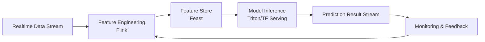

# Realtime ML Inference — Index

> **Stage**: Knowledge/06-frontier/ | **Formalization Level**: L3-L4
> **Last Updated**: 2026-04-13

---

## Document List

| ID | Document | Description | Status |
|------|------|------|------|
| 06.04.01 | [ML Model Serving](./06.04.01-ml-model-serving.md) | Streaming model serving architecture, TensorFlow Serving / TorchServe / Triton integration | ✅ Completed |
| 06.04.02 | [Feature Store Streaming](./06.04.02-feature-store-streaming.md) | Real-time feature store, Feast and Flink integration, online/offline feature consistency | ✅ Completed |
| 06.04.03 | [ML Pipeline Orchestration](./06.04.03-ml-pipeline-orchestration.md) | Streaming ML pipeline orchestration, A/B testing, model version management | ✅ Completed |
| 06.04.04 | [ML Observability](./06.04.04-ml-observability.md) | Real-time model monitoring, drift detection, performance degradation alerts | ✅ Completed |

---

## Architecture Overview

---

*Realtime ML Inference Index*
