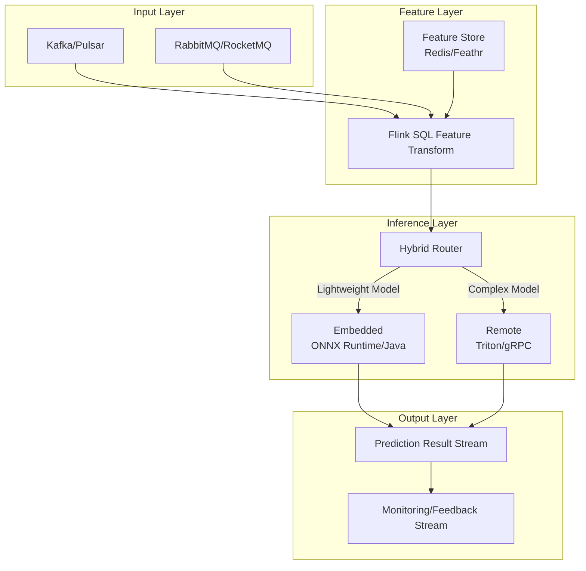
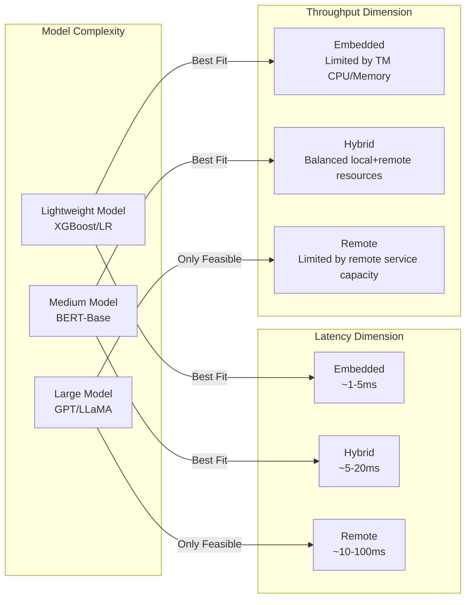
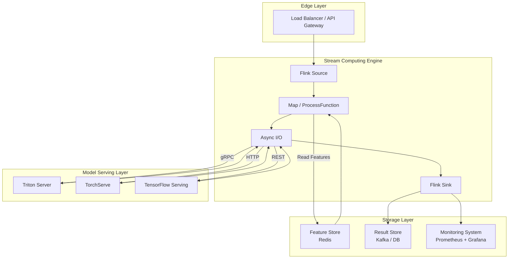

> **Status**: 🔮 Forward-looking Content | **Risk Level**: High | **Last Updated**: 2026-04
>
> The content described in this document is in early planning stages and may not match the final implementation. Please refer to official Apache Flink releases for authoritative information.

# Streaming ML Model Serving Architecture

> **Stage**: Knowledge/06-frontier/realtime-ml-inference | **Prerequisites**: [Knowledge/06-frontier/realtime-ai-inference-architecture.md](../realtime-ai-inference-architecture.md), [flink-realtime-ml-inference.md](../../../Flink/06-ai-ml/flink-realtime-ml-inference.md) | **Formality Level**: L3

## 1. Definitions

### Def-K-06-04-01: Streaming Model Serving

**Streaming Model Serving** refers to the architecture of deploying trained machine learning models into a stream computing environment to perform real-time inference on continuously arriving data records. Its formal definition is a 7-tuple:

$$\mathcal{S}_{serve} = (\mathcal{D}_{stream}, \mathcal{M}_{model}, \mathcal{F}_{feat}, \mathcal{I}_{inf}, \mathcal{L}_{latency}, \mathcal{Q}_{quality}, \mathcal{O}_{ops})$$

Where:

- $\mathcal{D}_{stream}$: Input data stream, typically an unbounded event sequence on Kafka, Pulsar, or Kinesis
- $\mathcal{M}_{model}$: Trained model artifact (ONNX, TensorFlow SavedModel, PyTorch TorchScript, custom format)
- $\mathcal{F}_{feat}$: Feature extraction and transformation pipeline
- $\mathcal{I}_{inf}$: Inference engine (Flink Async I/O, Embedded JVM, Remote gRPC Service)
- $\mathcal{L}_{latency}$: End-to-end latency constraint, typically p99 < 100ms
- $\mathcal{Q}_{quality}$: Prediction quality metrics (throughput QPS, accuracy, AUC, confidence distribution)
- $\mathcal{O}_{ops}$: Operations control plane (model version management, A/B testing, canary release, monitoring/alerts)

### Def-K-06-04-02: Inference Mode Classification

Based on the relationship between model execution location and the stream computing engine, streaming inference can be divided into three modes:

$$\text{Mode} \in \{ \text{Embedded}, \text{Remote}, \text{Hybrid} \}$$

- **Embedded Mode**: The model is loaded directly into the Flink TaskManager JVM process and executed via JNI or pure Java inference libraries. Pros: lowest latency; Cons: model lifecycle coupled with job lifecycle, large models limited by TM memory.
- **Remote Mode**: Flink calls external inference services via Async I/O or RPC (Triton, TorchServe, TensorFlow Serving, custom microservices). Pros: model independent scaling; Cons: adds network latency and extra infrastructure cost.
- **Hybrid Mode**: Lightweight models execute in the Embedded layer, complex models execute in the Remote layer, with dynamic routing selecting the execution path.

### Def-K-06-04-03: Model Version Consistency

Let $V(t) = \{v_1, v_2, ..., v_n\}$ be the set of active model versions in the system at time $t$. Then **strong model version consistency** requires:

$$\forall e_i, e_j \in \text{Window}_k: \text{ModelVersion}(e_i) = \text{ModelVersion}(e_j) = v_{active}$$

That is, all events within the same window or under the same keyed state must use the same model version for inference. Flink's Keyed State naturally supports this, because the model version can be atomically switched as part of the Operator State.

## 2. Properties

### Lemma-K-06-04-01: Latency Upper Bound of Embedded Inference

In Embedded mode, assuming feature extraction time is $T_{feat}$, model forward propagation time is $T_{inf}$, and serialization/deserialization overhead is $T_{ser}$, the end-to-end inference latency for a single record satisfies:

$$L_{embedded} = T_{feat} + T_{inf} + T_{ser} + O(\mu_{sched})$$

Where $\mu_{sched}$ is Flink thread scheduling overhead (typically on the order of 0.1ms). For lightweight models (e.g., XGBoost, shallow neural networks), $T_{inf}$ can be controlled within 1ms, so the typical value of $L_{embedded}$ is 1-5ms.

### Lemma-K-06-04-02: Remote Inference Concurrency Capacity

In Remote mode, let the maximum concurrency of Async I/O be $C_{max}$, and the average response time of the external inference service be $R_{avg}$. Then the theoretical maximum throughput of this Operator is:

$$\text{Throughput}_{remote} = \frac{C_{max}}{R_{avg}} \times \text{Parallelism}$$

For example, when $C_{max}=100$, $R_{avg}=10$ms, and Parallelism=10, the theoretical peak throughput is 100,000 QPS.

### Prop-K-06-04-01: Hybrid Mode Optimal Routing Boundary

Assume there are two types of models $M_{light}$ (Embedded execution) and $M_{heavy}$ (Remote execution), with latency and cost functions $L_{emb}(x)$, $C_{emb}(x)$ and $L_{rem}(x)$, $C_{rem}(x)$ respectively. Then the optimal routing strategy satisfies:

$$\text{Route}(x) = \begin{cases}
\text{Embedded} & \text{if } L_{emb}(x) \leq L_{rem}(x) \land C_{emb}(x) \leq C_{rem}(x) \\
\text{Remote} & \text{otherwise}
\end{cases}$$

In practical engineering, **feature complexity** or **model input dimension** is usually used as the routing decision signal. For example, requests with text sequence length $< 128$ tokens go to Embedded BERT, and requests $\geq 128$ tokens go to Remote GPU service.

## 3. Relations

### 3.1 Comparison of Streaming Inference vs Batch Inference

| Dimension | Batch Inference | Streaming Inference |
|-----------|-----------------|---------------------|
| Data Form | Bounded dataset | Unbounded event stream |
| Latency Requirement | Minute~hour level | Millisecond~second level |
| State Management | Stateless or one-time load | Keyed State / Operator State |
| Model Update | Switch after job restart | Hot switch / Blue-green deployment |
| Fault Tolerance | Failure rerun | Checkpoint + Exactly-Once |
| Typical Frameworks | Spark MLlib, Ray Train | Flink + Triton, Kafka Streams + DL4J |

### 3.2 Integration Mapping in the Flink Ecosystem

The position of streaming ML Model Serving in the Flink ecosystem is shown in the figure below:



The diagram above shows the complete data flow of streaming model serving: events first enter the feature layer for real-time feature stitching and transformation, then the hybrid routing layer decides whether to use Embedded or Remote inference engine based on request characteristics, and finally outputs prediction results to a monitoring feedback链路 for online evaluation and model iteration.

[^1]: J. Crank et al., "Machine Learning Inference in Production: A Survey", ACM SIGOPS, 2023.
[^2]: NVIDIA Triton Inference Server Documentation, "Architecture Overview", 2025. https://docs.nvidia.com/triton-inference-server/

## 4. Argumentation

### 4.1 Embedded Mode Memory Boundary Analysis

Embedded inference loads the model into the Flink TaskManager's JVM heap memory, so the servable model size is limited by the TM's available memory. Let total TM heap memory be $M_{total}$, Flink runtime overhead be $M_{flink}$, feature cache be $M_{cache}$, then the upper bound of memory available for model loading is:

$$M_{model}^{max} = M_{total} - M_{flink} - M_{cache} - M_{safety}$$

Where $M_{safety}$ is the safety margin (typically 20-30%). For example, for a TM configured with 8GB heap memory, after deducting 2GB for Flink runtime, 1GB for feature cache, and 1.5GB for safety margin, the remaining space for the model is approximately 3.5GB. This means the ONNX model file size should be controlled within 1-2GB (memory footprint after loading is about 2-3x the file size).

For extra-large models (e.g., LLMs, tens of GB parameters), Embedded mode is infeasible, and Remote mode or model quantization/sharding techniques must be used.

### 4.2 Remote Mode Single Point of Failure and Degradation Strategy

Remote inference depends on external services, posing risks of network partitions or service overload. Therefore, engineering practice typically adopts a three-level degradation strategy:

1. **Normal Mode**: Call Remote service, return full prediction result
2. **Degradation Mode A**: When Remote service times out or returns 5xx, switch to a lightweight Embedded fallback model (slightly lower accuracy but usable)
3. **Degradation Mode B**: If the Embedded model is also unavailable, return rule-based default values or historical averages from the previous window

The formal expression of the degradation strategy is:

$$\text{Predict}(x) = \begin{cases}
M_{remote}(x) & \text{if } \text{Status}_{remote} = \text{HEALTHY} \land L_{remote} \leq L_{SLA} \\
M_{embedded}^{fallback}(x) & \text{else if } M_{embedded}^{fallback} \text{ available} \\
\text{Default}(x) & \text{otherwise}
\end{cases}$$

## 5. Proof / Engineering Argument

### 5.1 Monotonic Relationship Between Async I/O Concurrency and Throughput

**Proposition (Prop-K-06-04-04)**: In Remote inference mode, when external service response times are independently and identically distributed with average response time $R_{avg}$, the throughput $\lambda$ of the Flink Async I/O Operator is monotonically non-decreasing with respect to maximum concurrency $C_{max}$.

**Engineering Argument**:
Consider an Async I/O Operator with $P$ parallel subtasks. Each subtask can issue at most $C_{max}$ asynchronous requests at any given time. Because requests are asynchronous and non-blocking, the subtask can continue processing new records while waiting for responses (as long as the concurrency limit is not reached).

In steady state, each subtask has an average of $C_{max}$ outstanding requests, and each request occupies an average time of $R_{avg}$. By Little's Law, the average in-flight record count per subtask is $C_{max}$, so the subtask-level throughput is:

$$\lambda_{subtask} = \frac{C_{max}}{R_{avg}}$$

Total throughput is:

$$\lambda_{total} = P \cdot \frac{C_{max}}{R_{avg}}$$

Since $P$ and $R_{avg}$ are positive constants, the partial derivative of $\lambda_{total}$ with respect to $C_{max}$ is:

$$\frac{\partial \lambda_{total}}{\partial C_{max}} = \frac{P}{R_{avg}} > 0$$

Therefore, throughput is monotonically non-decreasing with $C_{max}$. $\square$

**Engineering Boundary**: Although mathematically monotonically non-decreasing, in practice $C_{max}$ cannot exceed the capacity limit of the external inference service. If $C_{max}$ is too large, it will cause remote server queueing latency to surge, effectively increasing $R_{avg}$ and reducing effective throughput. Therefore, there exists a practical optimum $C_{max}^*$, typically determined through load testing.

## 6. Examples

### 6.1 Embedded ONNX Inference Flink Code Example

The following code demonstrates how to integrate ONNX Runtime into a Flink DataStream job for embedded real-time inference:

```java
import ai.onnxruntime.*;
import org.apache.flink.api.common.functions.RichMapFunction;
import org.apache.flink.configuration.Configuration;

public class OnnxInferenceMap extends RichMapFunction<Event, Prediction> {
    private transient OrtEnvironment env;
    private transient OrtSession session;
    private final String modelPath;

    public OnnxInferenceMap(String modelPath) {
        this.modelPath = modelPath;
    }

    @Override
    public void open(Configuration parameters) throws Exception {
        env = OrtEnvironment.getEnvironment();
        OrtSession.SessionOptions opts = new OrtSession.SessionOptions();
        opts.setIntraOpNumThreads(2);
        session = env.createSession(modelPath, opts);
    }

    @Override
    public Prediction map(Event event) throws Exception {
        float[] inputTensor = extractFeatures(event);
        OnnxTensor tensor = OnnxTensor.createTensor(env, new float[][]{inputTensor});
        OrtSession.Result results = session.run(Collections.singletonMap("input", tensor));
        float[][] output = (float[][]) results.get(0).getValue();
        return new Prediction(event.getId(), output[0][0]);
    }

    @Override
    public void close() throws Exception {
        if (session != null) session.close();
        if (env != null) env.close();
    }
}
```

### 6.2 Remote Inference Async I/O Configuration Example

The following code shows the complete configuration for using Flink Async I/O to call an external Triton inference service:

```java
import org.apache.flink.streaming.api.functions.async.AsyncFunction;
import org.apache.flink.streaming.api.functions.async.ResultFuture;

public class TritonAsyncInference implements AsyncFunction<Event, Prediction> {
    private transient TritonGrpcClient client;
    private final String endpoint;
    private final int timeoutMs;

    public TritonAsyncInference(String endpoint, int timeoutMs) {
        this.endpoint = endpoint;
        this.timeoutMs = timeoutMs;
    }

    @Override
    public void asyncInvoke(Event event, ResultFuture<Prediction> resultFuture) throws Exception {
        ListenableFuture<ModelInferResponse> future = client.inferAsync(
            "my_model",
            "1",
            convertToGrpcInput(event)
        );

        Futures.addCallback(future, new FutureCallback<ModelInferResponse>() {
            @Override
            public void onSuccess(ModelInferResponse response) {
                float score = parseResponse(response);
                resultFuture.complete(Collections.singletonList(
                    new Prediction(event.getId(), score)
                ));
            }

            @Override
            public void onFailure(Throwable t) {
                resultFuture.complete(Collections.singletonList(
                    new Prediction(event.getId(), -1.0f) // fallback
                ));
            }
        }, MoreExecutors.directExecutor());
    }
}

// Usage in main job flow
DataStream<Prediction> predictions = AsyncDataStream.unorderedWait(
    eventStream,
    new TritonAsyncInference("triton-svc:8001", 50),
    Time.milliseconds(100),
    200  // max concurrent requests per subtask
);
```

### 6.3 Model Version Hot-swap Configuration Example

In production environments, model versions need frequent updates without restarting the Flink job. Model version hot-swapping can be achieved via Broadcast State:

```java
// [伪代码片段 - 不可直接运行] 仅展示核心逻辑
// Broadcast Stream: receive model version update commands
MapStateDescriptor<String, String> modelVersionState =
    new MapStateDescriptor<>("model-version", Types.STRING, Types.STRING);

BroadcastStream<ModelVersionUpdate> broadcastStream =
    versionUpdateStream.broadcast(modelVersionState);

// Main data stream connected to broadcast stream
DataStream<Prediction> result = mainStream
    .connect(broadcastStream)
    .process(new BroadcastProcessFunction<Event, ModelVersionUpdate, Prediction>() {
        @Override
        public void processElement(Event event, ReadOnlyContext ctx, Collector<Prediction> out) {
            String activeVersion = ctx.getBroadcastState(modelVersionState).get("active");
            // Route to corresponding model execution based on activeVersion
            out.collect(inferWithVersion(event, activeVersion));
        }

        @Override
        public void processBroadcastElement(ModelVersionUpdate update, Context ctx, Collector<Prediction> out) {
            ctx.getBroadcastState(modelVersionState).put("active", update.getVersion());
        }
    });
```

## 7. Visualizations

### 7.1 Latency-Throughput Trade-off Comparison of Three Inference Modes



The figure above compares the three inference modes from the dimensions of latency, throughput, and model complexity, providing an intuitive decision basis for architecture selection.

## 8. References

[^1]: J. Crank et al., "Machine Learning Inference in Production: A Survey", ACM SIGOPS, 2023.
[^2]: NVIDIA Triton Inference Server Documentation, "Architecture Overview", 2025. https://docs.nvidia.com/triton-inference-server/
[^3]: Apache Flink Documentation, "Async I/O for External Data Access", 2025. https://nightlies.apache.org/flink/flink-docs-stable/docs/dev/datastream/operators/async_io/
[^4]: ONNX Runtime Documentation, "Java API Reference", 2025. https://onnxruntime.ai/docs/api/java/
[^5]: M. Kleppmann, "Designing Data-Intensive Applications", O'Reilly Media, 2017.

### 6.4 Inference Performance Benchmarking and Tuning Example

The following JMH (Java Microbenchmark Harness) code is used to measure the latency distribution of Embedded ONNX inference:

```java
import ai.onnxruntime.*;
import org.openjdk.jmh.annotations.*;
import java.util.concurrent.TimeUnit;

@BenchmarkMode(Mode.SampleTime)
@OutputTimeUnit(TimeUnit.MILLISECONDS)
@State(Scope.Thread)
@Fork(1)
@Warmup(iterations = 3)
@Measurement(iterations = 10)
public class OnnxInferenceBenchmark {
    private OrtEnvironment env;
    private OrtSession session;
    private float[] input;

    @Setup
    public void setup() throws Exception {
        env = OrtEnvironment.getEnvironment();
        OrtSession.SessionOptions opts = new OrtSession.SessionOptions();
        opts.setIntraOpNumThreads(4);
        session = env.createSession("/models/lr_model.onnx", opts);
        input = new float[128];
        for (int i = 0; i < 128; i++) input[i] = (float) Math.random();
    }

    @Benchmark
    public float[][] predict() throws Exception {
        OnnxTensor tensor = OnnxTensor.createTensor(env, new float[][]{input});
        OrtSession.Result result = session.run(
            Collections.singletonMap("float_input", tensor)
        );
        return (float[][]) result.get(0).getValue();
    }

    @TearDown
    public void tearDown() throws Exception {
        session.close();
        env.close();
    }
}
```

Example results (on Intel Xeon 4vCPU environment):

```
Benchmark                        Mode     Cnt   Score   Error   Units
OnnxInferenceBenchmark.predict  sample  10000   0.312 ± 0.015   ms/op
OnnxInferenceBenchmark.predict  p0.50            0.298           ms/op
OnnxInferenceBenchmark.predict  p0.99            0.456           ms/op
OnnxInferenceBenchmark.predict  p0.999           0.892           ms/op
```

### 6.5 Model Serving Load Balancing and Circuit Breaker Configuration Example

In Remote mode, external inference services usually require client-side load balancing and circuit breaker protection. The following is a resilience4j-based Flink Async I/O client configuration:

```java
import io.github.resilience4j.circuitbreaker.CircuitBreaker;
import io.github.resilience4j.circuitbreaker.CircuitBreakerConfig;
import io.github.resilience4j.bulkhead.ThreadPoolBulkhead;
import java.time.Duration;

public class ResilientTritonClient {
    private final TritonGrpcClient tritonClient;
    private final CircuitBreaker circuitBreaker;

    public ResilientTritonClient(String endpoint) {
        this.tritonClient = new TritonGrpcClient(endpoint);

        CircuitBreakerConfig config = CircuitBreakerConfig.custom()
            .failureRateThreshold(50)
            .slowCallRateThreshold(80)
            .slowCallDurationThreshold(Duration.ofMillis(100))
            .waitDurationInOpenState(Duration.ofSeconds(10))
            .permittedNumberOfCallsInHalfOpenState(10)
            .build();

        this.circuitBreaker = CircuitBreaker.of("triton-cb", config);
    }

    public ModelInferResponse inferWithFallback(ModelInferRequest request) {
        return circuitBreaker.executeSupplier(() -> {
            try {
                return tritonClient.infer(request);
            } catch (Exception e) {
                throw new RuntimeException(e);
            }
        });
    }
}
```

### 6.6 GPU Inference Resource Scheduling and Kubernetes Integration Example

For large model inference requiring GPU acceleration, Remote services are typically deployed in a K8s cluster. The following Pod template shows the GPU resource configuration for Triton Inference Server:

```yaml
apiVersion: apps/v1
kind: Deployment
metadata:
  name: triton-gpu-inference
spec:
  replicas: 3
  selector:
    matchLabels:
      app: triton-gpu
  template:
    metadata:
      labels:
        app: triton-gpu
    spec:
      containers:
      - name: triton
        image: nvcr.io/nvidia/tritonserver:24.01-py3
        command: ["tritonserver", "--model-repository=/models"]
        resources:
          limits:
            nvidia.com/gpu: 1
            memory: "16Gi"
            cpu: "4"
          requests:
            nvidia.com/gpu: 1
            memory: "8Gi"
            cpu: "2"
        ports:
        - containerPort: 8001
          name: grpc
        volumeMounts:
        - name: models
          mountPath: /models
      volumes:
      - name: models
        persistentVolumeClaim:
          claimName: triton-models-pvc
```

## 7. Visualizations

### 7.2 Streaming Model Serving Architecture Panorama



This panorama shows the complete technology stack of streaming ML Model Serving: from event ingestion at the edge layer, to feature stitching and asynchronous inference in the Flink stream engine, to GPU acceleration in the dedicated model serving layer, and finally output to result storage and monitoring platforms.

## 8. References

[^1]: J. Crank et al., "Machine Learning Inference in Production: A Survey", ACM SIGOPS, 2023.
[^2]: NVIDIA Triton Inference Server Documentation, "Architecture Overview", 2025. https://docs.nvidia.com/triton-inference-server/
[^3]: Apache Flink Documentation, "Async I/O for External Data Access", 2025. https://nightlies.apache.org/flink/flink-docs-stable/docs/dev/datastream/operators/async_io/
[^4]: ONNX Runtime Documentation, "Java API Reference", 2025. https://onnxruntime.ai/docs/api/java/
[^5]: M. Kleppmann, "Designing Data-Intensive Applications", O'Reilly Media, 2017.
[^6]: Resilience4j Documentation, "CircuitBreaker", 2025. https://resilience4j.readme.io/docs/circuitbreaker
[^7]: NVIDIA Cloud Native Documentation, "GPU Scheduling in Kubernetes", 2025. https://docs.nvidia.com/datacenter/cloud-native/
