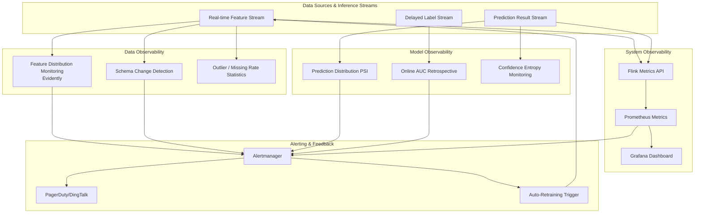

> **Status**: 🔮 Prospective Content | **Risk Level**: High | **Last Updated**: 2026-04
>
> The content described in this document is in the early planning stage and may differ from the final implementation. Please refer to the official Apache Flink release.

# Real-Time ML Observability and Drift Detection

> **Stage**: Knowledge/06-frontier/realtime-ml-inference | **Prerequisites**: [Knowledge/06-frontier/realtime-ml-inference/06.04.01-ml-model-serving.md](./06.04.01-ml-model-serving.md), [Knowledge/06-frontier/realtime-ml-inference/06.04.03-ml-pipeline-orchestration.md](./06.04.03-ml-pipeline-orchestration.md) | **Formalization Level**: L3

## 1. Definitions

### Def-K-06-04-10: Real-Time ML Observability

**Real-time ML Observability** refers to the set of capabilities for continuously monitoring, measuring, and diagnosing the behavior of streaming machine learning systems in production environments, covering four dimensions: data quality, model performance, system latency, and business metrics. Its formal definition is a quadruple:

$$\mathcal{O}_{ml} = (\mathcal{D}_{data}, \mathcal{P}_{perf}, \mathcal{S}_{sys}, \mathcal{B}_{biz})$$

Where:

- $\mathcal{D}_{data}$: Data observability, including input distribution, feature missing rate, outlier ratio, and schema drift
- $\mathcal{P}_{perf}$: Model performance observability, including prediction distribution, confidence entropy, calibration error, and online AUC / LogLoss (computed retrospectively in scenarios with delayed labels)
- $\mathcal{S}_{sys}$: System observability, including end-to-end latency p50/p99, throughput QPS, resource utilization (CPU / GPU / memory), Flink Checkpoint success rate, and alignment time
- $\mathcal{B}_{biz}$: Business observability, including CTR, conversion rate, average order value, user retention, and other business KPIs directly affected by the model

### Def-K-06-04-11: Data Drift

**Data Drift** refers to the statistical deviation between the input data distribution $P_{t}(X)$ received during model serving and the training data distribution $P_{train}(X)$. Let the input feature distribution at time $t$ be $P_t(X)$, then the data drift amount can be quantified as:

$$\Delta_{data}(t) = D\left( P_t(X) \,\|\, P_{train}(X) \right)$$

Where $D(\cdot \| \cdot)$ is some distribution distance metric, such as Kullback-Leibler divergence, Jensen-Shannon divergence, Wasserstein distance, or Maximum Mean Discrepancy (MMD). When $\Delta_{data}(t) > \theta_{drift}$ (drift threshold), the system should trigger an alert and initiate root cause analysis.

Data drift can be further subdivided into:

- **Covariate Drift**: $P(X)$ changes while $P(Y|X)$ remains unchanged
- **Feature Drift**: Statistical properties of individual features change
- **Label Drift**: $P(Y)$ changes

### Def-K-06-04-12: Concept Drift

**Concept Drift** refers to the change in the conditional probability distribution $P(Y|X)$ between features and labels over time, i.e., the input-output mapping relationship learned by the model itself has evolved. Let the conditional distribution during training be $P_{train}(Y|X)$, and the conditional distribution at time $t$ be $P_t(Y|X)$, then the concept drift amount is:

$$\Delta_{concept}(t) = D\left( P_t(Y|X) \,\|\, P_{train}(Y|X) \right)$$

Concept drift is a more fundamental problem than data drift: even if the input feature distribution remains unchanged, changes in $P(Y|X)$ will lead to systematic errors in model predictions. Typical concept drift scenarios include seasonal changes in user preferences, competitor strategy adjustments, macroeconomic fluctuations, and the "interest evolution" phenomenon in recommendation systems.

## 2. Properties

### Lemma-K-06-04-07: Latency-Accuracy Trade-off in Drift Detection

Let the drift detection algorithm process streaming data with a sliding window of size $W$, and the number of samples in the window be $n$. According to the Central Limit Theorem, the variance of the sample mean within the window is $\sigma^2 / n$. To reject the null hypothesis $H_0$ of "no drift" with confidence level $1 - \alpha$, the detection threshold must satisfy:

$$\theta_{detect} = z_{1-\alpha/2} \cdot \frac{\sigma}{\sqrt{n}} = z_{1-\alpha/2} \cdot \frac{\sigma}{\sqrt{\lambda \cdot W}}$$

Where $\lambda$ is the event arrival rate. From this we can see:

1. **Larger window** ($W$ increases), $\theta_{detect}$ decreases, detection sensitivity increases, but detection latency $L_{detect}$ is proportional to $W$.
2. **Smaller window**, lower detection latency, but increased statistical fluctuation and higher false positive rate.

Therefore, drift detection has an irreconcilable **Latency-Accuracy Tradeoff**. In engineering practice, a hierarchical window strategy is often adopted: small windows (1~5 minutes) for rapid alerting, and large windows (1~24 hours) for high-confidence root cause confirmation.

### Lemma-K-06-04-08: Relationship Between Alert Threshold and False Positive Rate

Assume the drift detection metric follows the null hypothesis of standard normal distribution $N(0, 1)$, and the alert threshold is $\theta$, then the expected number of false positives per day is:

$$E[FP] = 24 \times 60 \times f \times P(Z > \theta) = 1440 f \cdot \left( 1 - \Phi(\theta) \right)$$

Where $f$ is the detection frequency (times per minute), and $\Phi$ is the standard normal cumulative distribution function. If $\theta = 3$ (3-sigma rule), $f = 1$, then $E[FP] \approx 1440 \times 0.00135 \approx 1.94$. That is, even if the system is completely normal, an average of about 2 false alarms will be received per day. To reduce false positives, a **multi-window consecutive trigger strategy** can be used: requiring $k$ consecutive windows to exceed the threshold before generating an alert.

### Prop-K-06-04-04: Convergence Condition of the Feedback Loop

Assume the model initiates retraining after detecting drift, the generalization error of the new model $M_{new}$ is $\epsilon_{new}$, and the error of the old model after drift is $\epsilon_{old}(t)$, with $\epsilon_{old}(t)$ growing linearly over time: $\epsilon_{old}(t) = \epsilon_0 + \gamma t$. The retraining period is $T_{retrain}$, then the long-term average error satisfies:

$$\bar{\epsilon} = \frac{1}{T_{retrain}} \int_{0}^{T_{retrain}} \epsilon_{old}(t) \, dt = \epsilon_0 + \frac{\gamma T_{retrain}}{2}$$

As long as the retrained model satisfies $\epsilon_{new} < \epsilon_{old}(T_{retrain})$, the feedback loop can continuously reduce system error. The optimal retraining frequency trades off between: retraining too frequently leads to excessive computational costs, while retraining too sparsely leads to accumulated average error.

## 3. Relations

### 3.1 Comparison of Data Drift, Concept Drift, and Feature Drift

| Drift Type | Definition | Detection Object | Impact on Model | Typical Root Cause | Detection Difficulty |
|------------|------------|------------------|-----------------|--------------------|----------------------|
| **Data Drift** | $P(X)$ changes | Input feature distribution | Moderate, model may perform poorly in new input regions | Upstream system changes, sampling strategy changes, seasonal fluctuations | Low |
| **Concept Drift** | $P(Y\|X)$ changes | Input-output mapping relationship | Severe, learned patterns are outdated | User preference evolution, market competition, policy changes | High (requires labels) |
| **Feature Drift** | Statistical properties of individual features change | Feature-level distribution | Depends on feature importance | Sensor aging, feature engineering code changes, data cleaning logic updates | Low |

The table above shows that concept drift is the most dangerous but hardest to detect type of drift, because it usually requires delayed arrival of true labels for confirmation. In high-delay label scenarios (such as credit default prediction, long-term user retention prediction), data drift detection becomes the primary means of early warning.

### 3.2 Real-Time Monitoring Metrics Matrix

| Monitoring Layer | Core Metrics | Collection Frequency | Anomaly Pattern | Alert Strategy |
|------------------|--------------|----------------------|-----------------|----------------|
| **Data Layer** | Feature missing rate, outlier ratio, feature mean/variance, schema change | Every 1~5 minutes | Sudden spike in missing rate, mean shift beyond 3-sigma | Real-time PagerDuty / DingTalk |
| **Model Layer** | Prediction distribution, confidence entropy, KS-Test PSI, online AUC (delayed computation) | Every 5~15 minutes | PSI > 0.25 (significant drift), AUC drop > 5% | Email + IM notification |
| **System Layer** | p50/p99 latency, throughput, CPU/GPU utilization, Checkpoint duration | Every 1 minute | p99 latency > SLA, Checkpoint timeout | Auto-scaling / Emergency alert |
| **Business Layer** | CTR, conversion rate, GMV, user retention | Every 1 hour | CTR continuously drops > 10% for 3 hours | Business on-call group + root cause meeting |

### 3.3 Drift Detection Algorithm Comparison

| Algorithm | Applicable Scenario | Pros | Cons | Computational Complexity |
|-----------|---------------------|------|------|--------------------------|
| **KS-Test** | Univariate continuous features | Non-parametric, no distribution assumption | Only for univariate, insensitive to tails | $O(n \log n)$ |
| **Population Stability Index (PSI)** | Scorecards, risk control models | Financial industry standard, strong interpretability | Sensitive to binning, not a strict statistical test | $O(n)$ |
| **Wasserstein Distance** | Multi-modal distributions, generative models | Considers distribution geometry, sensitive to shifts | High computational cost for multidimensional extension | $O(n^3)$ (1D) |
| **Maximum Mean Discrepancy (MMD)** | High-dimensional features, kernel methods | Can detect complex high-dimensional drift | Sensitive to kernel choice, requires sufficient samples | $O(n^2)$ |
| **Page-Hinkley Test** | Online streaming detection | Incremental computation, low memory footprint | Sensitive to hyperparameters, higher false positive rate | $O(1)$ per sample |
| **KL Divergence** | Probability distribution comparison | Clear information-theoretic interpretation | Sensitive to zero-probability events, requires smoothing | $O(k)$ (discrete distribution) |

## 4. Argumentation

### 4.1 Why Model Performance Degradation Is Not Always Immediately Noticeable

In real-time streaming inference scenarios, the predicted values output by the model usually do not receive immediate verification from true labels. For example:

- In recommendation systems, click-through rate labels are only produced after the user actually clicks, with a delay of seconds to minutes.
- In financial anti-fraud models, fraud confirmation requires case investigation ranging from hours to days.
- In credit default prediction, the final label may take months or even years to observe.

This **Label Delay** creates a "blind spot" in model performance monitoring: between the occurrence of drift and label confirmation, the system may have made millions of incorrect decisions based on the degraded model. Therefore, **unsupervised input drift detection** becomes an important means to fill this blind spot. By continuously monitoring the distribution changes of input features, early warnings can be issued hours or even days before performance metrics drop.

### 4.2 The Multiple Comparison Problem in Drift Detection

When the feature dimension $d$ is large (e.g., hundreds of features in recommendation systems), running drift detection independently for each feature introduces the **Multiple Comparison Problem**. Under the null hypothesis, if the false positive rate for each feature is $\alpha$, the probability of at least one false positive among all features is:

$$P(\text{at least one false positive}) = 1 - (1 - \alpha)^d \approx d\alpha \quad (\text{when } \alpha \ll 1 \text{)}$$

When $d = 100$, $\alpha = 0.05$, the overall false positive rate is as high as 99.4%. To control the Family-Wise Error Rate, the Bonferroni correction should be applied: adjusting the significance level for each feature to $\alpha' = \alpha / d$. Alternatively, a more modern approach is to use **Principal Component Analysis** (PCA) or **Autoencoder** to project high-dimensional features into a low-dimensional latent space, and perform unified drift detection in the low-dimensional space.

## 5. Proof / Engineering Argument

### Engineering Theorem: False Positive Control in Hierarchical Window Drift Detection

**Theorem Statement**: Assume the system adopts a two-layer window drift detection strategy—the fast detection layer uses window $W_1$ and threshold $\theta_1$, and the confirmation detection layer uses window $W_2 > W_1$ and threshold $\theta_2 > \theta_1$. A formal alert is only generated when both layers trigger simultaneously. Then under the null hypothesis (no drift), the overall false positive rate satisfies:

$$\alpha_{overall} \leq \alpha_1 \cdot \alpha_2$$

Where $\alpha_1 = P(\text{trigger } W_1 \mid H_0)$ and $\alpha_2 = P(\text{trigger } W_2 \mid H_0)$.

**Engineering Argument**:

1. The false positive events of the fast detection layer $W_1$ constitute a Bernoulli trial sequence with probability $\alpha_1$. Since the $W_2$ window contains multiple $W_1$ windows, when $W_1$ triggers, the system enters a "pre-alert" state, requiring $W_2$ to also trigger within the subsequent $W_2$ window.

2. Since the statistics of $W_1$ and $W_2$ are both based on independent and identically distributed samples (under the null hypothesis), the trigger events of the two layers are approximately independent. Therefore, the joint false positive probability is the product of the two.

3. If $\alpha_1 = 0.05$ and $\alpha_2 = 0.01$, then $\alpha_{overall} \leq 0.0005$, i.e., the expected false positives per day (assuming hourly detection) is only $0.012$, significantly better than single-layer detection.

4. The detection latency of this strategy is $W_2$, but early warning can be achieved through $W_1$, achieving an engineering-acceptable balance between latency and false positive rate.

## 6. Examples

### 6.1 Flink + Evidently Real-Time Drift Detection Example

Evidently is an open-source ML model and data drift detection library. The following code demonstrates how to integrate Evidently into the side output of a Flink job for real-time feature drift detection:

```python
from evidently import ColumnMapping
from evidently.report import Report
from evidently.metric_preset import DataDriftPreset
import json

# Initialize Evidently drift report
column_mapping = ColumnMapping(
    numerical_features=["user_age", "click_count_1h", "avg_dwell_time"],
    categorical_features=["device_type", "geo_region"]
)

drift_report = Report(metrics=[DataDriftPreset()])

# Reference dataset (snapshot of feature distribution during training)
reference_data = load_reference_features("s3://ml-bucket/reference/feat.parquet")

class DriftDetectionProcessFunction(ProcessFunction):
    def __init__(self, reference_data, column_mapping, window_size=1000):
        self.reference_data = reference_data
        self.column_mapping = column_mapping
        self.window_size = window_size
        self.buffer = []

    def process_element(self, event, ctx):
        features = extract_features(event)
        self.buffer.append(features)

        if len(self.buffer) >= self.window_size:
            current_data = pd.DataFrame(self.buffer)

            # Run Evidently drift detection
            drift_report.run(
                reference_data=self.reference_data,
                current_data=current_data,
                column_mapping=self.column_mapping
            )

            result = drift_report.as_dict()
            drift_score = result["metrics"][0]["result"]["dataset_drift"]

            if drift_score:
                # Send drift alert to Kafka alert topic
                alert = {
                    "timestamp": ctx.timestamp(),
                    "drift_detected": True,
                    "drift_share": result["metrics"][0]["result"]["drift_share"],
                    "number_of_drifted_columns": result["metrics"][0]["result"]["number_of_drifted_columns"]
                }
                ctx.output(drift_alert_tag, json.dumps(alert))

            # Clear buffer and start next window
            self.buffer = []

        # Original event continues downstream
        yield event
```

In the above implementation, `DriftDetectionProcessFunction` maintains a sliding buffer of size `window_size`, and runs Evidently's `DataDriftPreset` detection after accumulating enough samples. If drift is detected, the alert information is sent to a dedicated Kafka alert topic via Flink Side Output for downstream alert systems to consume.

### 6.2 Prometheus Alertmanager Model Performance Degradation Alert Rules

The following PromQL alert rules demonstrate how to monitor key system metrics and model performance metrics of a Flink ML inference job:

```yaml
groups:
  - name: realtime_ml_observability
    interval: 30s
    rules:
      # Rule 1: Inference p99 latency exceeds SLA
      - alert: MLInferenceLatencyHigh
        expr: |
          histogram_quantile(0.99,
            sum(rate(flink_taskmanager_job_task_operator_inference_latency_bucket[5m])) by (le, job_name)
          ) > 100
        for: 2m
        labels:
          severity: critical
          team: ml-platform
        annotations:
          summary: "ML inference p99 latency exceeds 100ms"
          description: "Job {{ $labels.job_name }} inference p99 latency is {{ $value }}ms, exceeding SLA."

      # Rule 2: Model prediction distribution shifts significantly (PSI > 0.25)
      - alert: ModelPredictionDrift
        expr: |
          ml_model_prediction_psi{model_name=~".*"} > 0.25
        for: 5m
        labels:
          severity: warning
          team: ml-scientists
        annotations:
          summary: "Model prediction distribution drift detected"
          description: "Model {{ $labels.model_name }} prediction PSI is {{ $value }}, root cause analysis recommended."

      # Rule 3: Increased Checkpoint failure rate
      - alert: FlinkCheckpointFailureRate
        expr: |
          (
            sum(rate(flink_jobmanager_checkpoint_numberOfFailedCheckpoints[5m])) by (job_name)
            /
            sum(rate(flink_jobmanager_checkpoint_numberOfCompletedCheckpoints[5m])) by (job_name)
          ) > 0.1
        for: 3m
        labels:
          severity: critical
          team: flink-platform
        annotations:
          summary: "Flink Checkpoint failure rate exceeds 10%"
          description: "Job {{ $labels.job_name }} Checkpoint failure rate is abnormal, potential state loss."

      # Rule 4: Sudden spike in feature missing rate
      - alert: FeatureMissingRateSpike
        expr: |
          (
            sum(rate(ml_feature_missing_total[5m])) by (feature_name, job_name)
            /
            sum(rate(ml_feature_total[5m])) by (feature_name, job_name)
          ) > 0.05
        for: 5m
        labels:
          severity: warning
          team: data-engineering
        annotations:
          summary: "Feature missing rate exceeds 5%"
          description: "Feature {{ $labels.feature_name }} in Job {{ $labels.job_name }} missing rate is {{ $value }}."
```

The above rules cover a complete monitoring matrix from the system layer (latency, Checkpoint) to the data layer (feature missing) to the model layer (prediction drift). Prometheus evaluates the rules every 30 seconds, and after the conditions are continuously met for the duration specified by the `for` field, routes alerts to different on-call teams via Alertmanager.

## 7. Visualizations

### Real-Time ML Observability Architecture

The following Mermaid diagram shows the end-to-end real-time ML observability architecture covering the data layer, model layer, system layer, and business layer:



In this architecture, the feature stream, prediction result stream, and delayed label stream enter the data observability, model observability, and system observability monitoring planes respectively. Evidently is responsible for feature drift detection, Prometheus + Grafana for system-level metric collection and visualization, and Alertmanager for alert routing and escalation. When serious drift or performance degradation is detected, the alerting system can automatically trigger the model retraining pipeline, forming a complete "monitor-alert-fix" closed loop.

## 8. References
