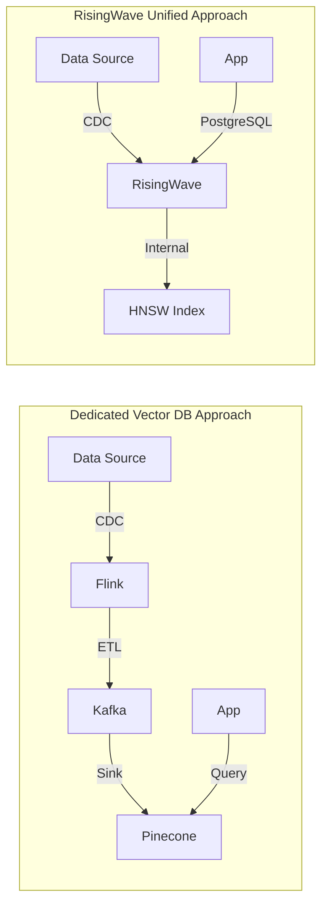

# RisingWave v2.6 Vector Search: The Frontier of Streaming Databases and AI

> **Stage**: Knowledge/06-frontier | **Prerequisites**: [RisingWave Deep Dive](./risingwave-deep-dive.md), [Flink VECTOR_SEARCH](../Flink/03-api/03.02-table-sql-api/flink-vector-search-rag.md) | **Formalization Level**: L3-L4
> **Version**: RisingWave v2.6+ | **Status**: ✅ Released | **Last Updated**: 2026-04-21

---

## 1. Definitions

### Def-K-06-410: Streaming Database Vector Search

**Definition**: Streaming database vector search is the capability to perform real-time similarity retrieval on high-dimensional vector embeddings over continuously arriving data streams, formalized as a sextuple:

$$
\mathcal{V}_{stream} = \langle \mathcal{S}, \mathcal{E}, \mathcal{I}, \mathcal{Q}, \Delta, \tau \rangle
$$

Where:

| Component | Symbol | Definition | Description |
|-----------|--------|------------|-------------|
| Data Stream | $\mathcal{S}$ | Infinite sequence of $\mathbb{R}^d \times \mathbb{T}$ | Timestamped vector stream |
| Embedding Function | $\mathcal{E}$ | $\mathcal{X} \rightarrow \mathbb{R}^d$ | Raw data to vector mapping |
| Index Structure | $\mathcal{I}$ | $\mathcal{P}(\mathbb{R}^d) \rightarrow \mathcal{G}$ | Vector set to graph index mapping |
| Query Interface | $\mathcal{Q}$ | $\mathbb{R}^d \times \mathbb{N} \rightarrow \mathcal{P}(\mathbb{R}^d)$ | Top-K similarity query |
| Incremental Update | $\Delta$ | $\Delta \mathcal{S} \times \mathcal{I}_t \rightarrow \mathcal{I}_{t+1}$ | Index incremental maintenance operator |
| Consistency Bound | $\tau$ | $\mathbb{R}^+$ | Max latency between query results and latest data |

---

### Def-K-06-411: HNSW Streaming Index

**Definition**: RisingWave v2.6 adopts an incrementally maintained version of the HNSW (Hierarchical Navigable Small World) index:

$$
\mathcal{H}_{hnsw}^{stream} = \langle G_0, G_1, ..., G_L, \mathcal{M}_{insert}, \mathcal{M}_{delete} \rangle
$$

Where $G_l$ is the approximate nearest neighbor graph at level $l$, and $\mathcal{M}_{insert}$ and $\mathcal{M}_{delete}$ are stream-oriented add/remove operators.

**Key Difference from Batch HNSW**:

- Batch HNSW: $\mathcal{I} = \text{build}(S_{snapshot})$, full rebuild
- Streaming HNSW: $\mathcal{I}_{t+1} = \Delta(\delta S_t, \mathcal{I}_t)$, incremental update

---

### Def-K-06-412: SQL Native Embedding Function

**Definition**: RisingWave provides SQL built-in functions such as `openai_embedding()` for real-time embedding computation at query time:

$$
\text{openai_embedding}(x, model, api_key) = \mathcal{E}_{model}(x) \in \mathbb{R}^d
$$

**Comparison with Pre-computed Embeddings**:

| Mode | Latency | Cost | Use Case |
|------|---------|------|----------|
| SQL Real-time Embedding | High (API call) | Pay-per-call | Dynamic content, low-frequency queries |
| Pre-computed Embedding | Low (index lookup) | Storage cost | Static content, high-frequency queries |
| Streaming Pre-computation | Medium (CDC-driven) | Hybrid | Real-time updated content |

---

## 2. Properties

### Lemma-K-06-410: Streaming HNSW Query Correctness Bound

**Statement**: Let the streaming HNSW index state at time $t$ be $\mathcal{I}_t$, and the query time be $t_q$. The query result satisfies:

$$
\text{results}(q, \mathcal{I}_t, k) \subseteq \text{results}(q, \mathcal{I}_{t_q}, k) \cup \epsilon_{stale}
$$

Where $\epsilon_{stale}$ is new data arriving during $[t, t_q]$, with $|\epsilon_{stale}| \leq \lambda \cdot (t_q - t)$, and $\lambda$ is the data arrival rate.

**Corollary**: Under RisingWave's 1-second checkpoint interval, the maximum stale data volume is:

$$
|\epsilon_{stale}|_{max} = \lambda \cdot 1s
$$

---

### Lemma-K-06-411: Incremental Index Update Complexity

**Statement**: The amortized complexity of single-record insertion into streaming HNSW is $O(\log N)$, compared to $O(N \log N)$ for batch construction:

$$
\frac{T_{incremental}(N)}{T_{batch}(N)} = \frac{N \cdot O(\log N)}{O(N \log N)} = O(1)
$$

**Engineering Significance**: Incremental maintenance does not introduce asymptotic complexity degradation.

---

### Prop-K-06-410: Unity of Vector Search and Materialized Views

**Proposition**: RisingWave's vector search can be viewed as a special case of materialized views — the vector index is itself a materialized view:

$$
\mathcal{I}_{hnsw} = \text{MATERIALIZED VIEW } \text{hnsw_index}(v) \text{ AS } \mathcal{E}(data)
$$

**Corollary**: Vector indexes automatically inherit all capabilities of RisingWave materialized views:

- Incremental updates
- Cascading materialized views
- Consistency guarantees (1-second checkpoint)
- Direct queries (PostgreSQL protocol)

---

## 3. Relations

### 3.1 RisingWave vs Flink VECTOR_SEARCH

| Dimension | RisingWave v2.6 | Flink 2.2 VECTOR_SEARCH |
|-----------|-----------------|------------------------|
| Architecture Position | Built-in storage + index | SQL TVF + external vector store |
| Index Type | HNSW (incremental) | Depends on external implementation |
| Embedding Computation | `openai_embedding()` SQL function | Depends on external model service |
| Consistency | Snapshot consistency (1s) | Checkpoint consistency |
| Query Protocol | Native PostgreSQL | Flink SQL |
| CDC-driven Index | ✅ Native | ✅ Via CDC connector |
| RAG Integration | Native MCP Server | Requires custom integration |

### 3.2 Streaming Database vs Dedicated Vector Database

```mermaid
graph TB
    subgraph "2023 Siloed Architecture"
        F1[Flink / Kafka / Spark]
        V1[Pinecone / Weaviate / Qdrant]
        F1 -->|ETL| V1
    end

    subgraph "2026 Unified Architecture"
        RW[RisingWave v2.6]
        subgraph "Integrated"
            RW_STREAM[Stream Processing]
            RW_HNSW[HNSW Index]
            RW_EMBED[openai_embedding()]
        end
    end
```

**Evolution Driver**: The convergence of stream processing and vector search eliminates ETL latency and reduces system complexity from $O(n)$ separate components to $O(1)$ unified platform.

---

## 4. Argumentation

### 4.1 Why Streaming Databases for Vector Search?

**Argument 1: Latency Reduction**

- Siloed architecture: Ingestion latency (Flink) + Indexing latency (Vector DB) + Query latency = 5-30s
- Unified architecture: CDC-driven incremental index update = <1s freshness

**Argument 2: Consistency Simplification**

- Siloed: Two-phase commit or eventual consistency between stream processor and vector store
- Unified: Single-system snapshot isolation via checkpoint

**Argument 3: Cost Optimization**

- Eliminates duplicate storage (Kafka + Vector DB + OLAP)
- Single PostgreSQL-compatible endpoint reduces integration cost

---

## 5. Engineering Argument

### Thm-K-06-410: Streaming Vector Search Equivalence

**Theorem**: For any bounded stream $S_{[0,T]}$ and query set $Q$, the result of streaming incremental vector search is eventually consistent with batch vector search:

$$
\lim_{\tau \rightarrow 0} \text{STREAM\_VECTOR\_SEARCH}(S, Q, \tau) = \text{BATCH\_VECTOR\_SEARCH}(S_{[0,T]}, Q)
$$

Where $\tau$ is the checkpoint interval.

**Proof Sketch**:

1. HNSW incremental insert maintains graph connectivity invariant (Lemma-K-06-411)
2. Checkpoint ensures state durability at interval $\tau$
3. As $\tau \rightarrow 0$, stale window $\epsilon_{stale} \rightarrow \emptyset$ (Lemma-K-06-410)
4. Therefore incremental result converges to batch result ∎

---

## 6. Examples

### Example 1: Real-time RAG with RisingWave

```sql
-- Create source table from Kafka CDC
CREATE TABLE documents (
    id BIGINT PRIMARY KEY,
    content TEXT,
    embedding VECTOR(1536)
) WITH (
    connector = 'kafka',
    topic = 'documents',
    format = 'json'
);

-- Create HNSW index (incrementally maintained)
CREATE INDEX doc_embedding_idx ON documents(embedding)
WITH (index_type = 'hnsw', distance = 'cosine');

-- Real-time RAG query
SELECT id, content,
       1 - cosine_distance(embedding, openai_embedding('query text')) AS score
FROM documents
ORDER BY embedding <-> openai_embedding('query text')
LIMIT 10;
```

### Example 2: Streaming Vector Join

```sql
-- User query stream
CREATE TABLE user_queries (
    query_id BIGINT,
    query_text TEXT,
    query_time TIMESTAMPTZ
);

-- Join with document vectors in real-time
SELECT q.query_id, d.id AS doc_id, d.content,
       cosine_similarity(d.embedding, openai_embedding(q.query_text)) AS relevance
FROM user_queries q
JOIN documents d
ON cosine_similarity(d.embedding, openai_embedding(q.query_text)) > 0.85;
```

---

## 7. Visualizations

### Architecture Comparison



---

## 8. References
