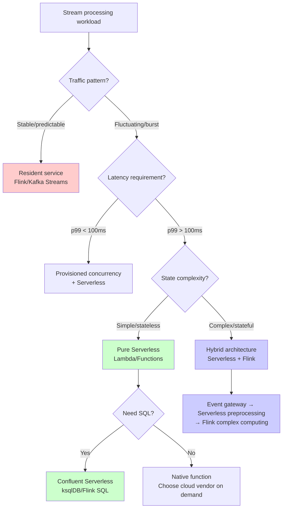
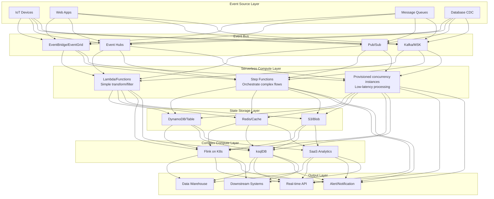
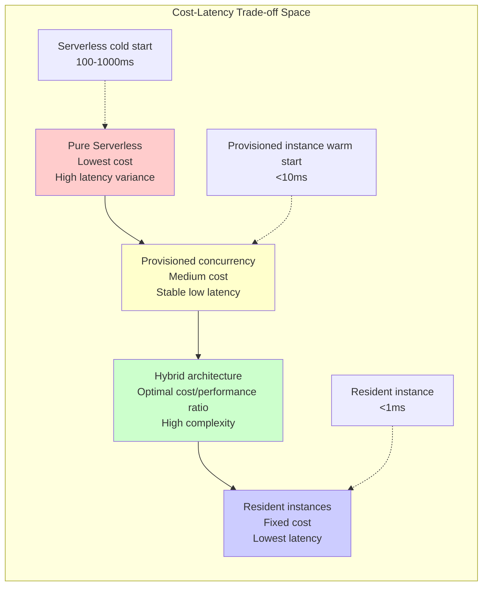
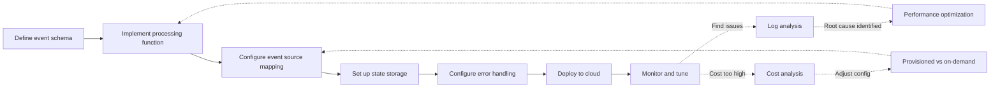

# Serverless Stream Processing Architecture and Cloud-Native Practices

> Stage: Knowledge | Prerequisites: [../../Flink/10-deployment/serverless-flink-ga-guide.md](../../Flink/04-runtime/04.01-deployment/serverless-flink-ga-guide.md) | Formalization Level: L3

## 1. Definitions

### Def-K-06-130: Serverless Stream Processing System

A serverless stream processing system is a 7-tuple $\mathcal{S}_{serverless} = (F, E, S, T, C, \Lambda, \Omega)$, where:

- $F$: set of functions, each function $f_i$ is a stateless compute unit
- $E$: set of event sources, $E = \{e_1, e_2, ..., e_m\}$
- $S$: state storage layer, decoupled from the compute layer
- $T$: set of trigger rules
- $C$: cost function, $C: \mathbb{N} \times \mathbb{N} \rightarrow \mathbb{R}^+$ (requests × execution time → cost)
- $\Lambda$: cold-start latency function
- $\Omega$: auto-scaling policy

**Intuitive explanation**: Serverless stream processing encapsulates event processing logic into stateless functions, automatically triggered by events; compute resources are allocated and billed on demand, and state is persisted to external storage.

### Def-K-06-131: Cold Start vs Warm Start

Let the function instance lifecycle be $L = (t_{init}, t_{ready}, t_{exec}, t_{idle}, t_{term})$:

$$
\text{StartupType}(f) = \begin{cases}
\text{Cold} & \text{if } \nexists i \in \text{Instances}(f): \text{state}(i) = \text{Idle} \\
\text{Warm} & \text{if } \exists i: \text{state}(i) = \text{Idle} \land t_{idle} < T_{max\_idle} \\
\text{Hot} & \text{if } \exists i: \text{state}(i) = \text{Ready}
\end{cases}
$$

Where cold-start latency $\Lambda_{cold}$ is typically 10-1000x higher than warm-start latency $\Lambda_{warm}$.

### Def-K-06-132: Externalized State Pattern

The externalized state pattern requires compute functions to satisfy:

$$\forall f \in F: \text{State}(f) = \emptyset \land \exists S_{ext}: \text{Read}(f) \cup \text{Write}(f) \subseteq S_{ext}$$

That is, the function itself maintains no local state; all state reads and writes go through external storage services.

### Def-K-06-133: Event-Driven Function Chain

An event-driven function chain is a directed acyclic graph $G = (F_{chain}, D)$, where:

- $F_{chain} \subseteq F$ is the set of functions in the chain
- $D \subseteq F_{chain} \times F_{chain}$ is the data dependency relation
- Satisfies: $\forall (f_i, f_j) \in D: \text{Output}(f_i) \subseteq \text{Input}(f_j)$

### Def-K-06-134: Serverless Checkpoint Mechanism

A Serverless Checkpoint is a snapshot function $\mathcal{CP}: (S_{ext}, T_{wm}) \rightarrow \Sigma$, where:

- $S_{ext}$: external state storage
- $T_{wm}$: watermark timestamp
- $\Sigma$: consistent state snapshot

Requires: $\forall \sigma \in \Sigma: \text{Consistency}(\sigma) \in \{\text{EXACTLY\_ONCE}, \text{AT\_LEAST\_ONCE}\}$

### Def-K-06-135: Hybrid Architecture Model

A hybrid architecture is a workload allocation function $\mathcal{H}: W \rightarrow (F_{serverless}, F_{resident})$, mapping workloads to:

- $F_{serverless}$: serverless function pool (elastic, pay-per-invocation)
- $F_{resident}$: resident instance pool (stable, reserved resources)

Optimization objective: $\min_{\mathcal{H}} \left[ C_{serverless}(W_{spike}) + C_{resident}(W_{base}) + \lambda \cdot L_{SLA}(W) \right]$

## 2. Properties

### Prop-K-06-95: Serverless Cost Boundary

**Proposition**: For a workload with request arrival rate $\lambda$ and average execution time $\mu$, the monthly serverless cost satisfies:

$$C_{serverless} = \lambda \cdot \mu \cdot c_{compute} + \lambda \cdot c_{request} + c_{storage}$$

The break-even point with resident instance cost $C_{resident} = c_{provisioned} \cdot T_{month}$:

$$\lambda^* = \frac{c_{provisioned} \cdot T_{month} - c_{storage}}{\mu \cdot c_{compute} + c_{request}}$$

When actual request rate $\lambda < \lambda^*$, serverless is more economical.

**Proof**: Directly from the cost function definition. $\square$

### Prop-K-06-96: Cold-Start Impact Boundary on Latency

Let the function chain length be $n$, and the cold-start probability of each function be $p_i$; then the expected end-to-end latency:

$$\mathbb{E}[L_{e2e}] = \sum_{i=1}^{n} \left[ p_i \cdot \Lambda_{cold} + (1-p_i) \cdot \Lambda_{warm} + \mu_i \right]$$

If $\mathbb{E}[L_{e2e}] \leq L_{SLA}$ is required, then the cold-start probability constraint:

$$p_{max} = \frac{L_{SLA} - \sum_{i=1}^{n}(\Lambda_{warm} + \mu_i)}{\sum_{i=1}^{n}(\Lambda_{cold} - \Lambda_{warm})}$$

**Proof**: Derived from linearity of expectation. $\square$

### Thm-K-06-95: Externalized State Consistency Theorem

**Theorem**: When the following conditions are met, the externalized state pattern can guarantee eventual consistency:

1. **Idempotent writes**: $\forall w \in \text{Writes}: w(S_{ext}, v) = S_{ext} \oplus v$ is an idempotent operation
2. **Monotonic reads**: read operations satisfy $\text{Read}(t_1) \leq \text{Read}(t_2)$ when $t_1 < t_2$
3. **Atomicity guarantee**: all write operations within a single transaction either all succeed or all fail

Then system state converges: $\lim_{t \rightarrow \infty} S_{ext}(t) = S_{correct}$

**Proof**:

Assume concurrent writes $w_1, w_2$ act on the same state item. By idempotence, regardless of execution order, repeated execution produces no side effects. By monotonic reads, subsequent reads always see the latest written value. By atomicity, partial update states cannot appear. Therefore, system state eventually converges to the correct value. $\square$

### Thm-K-06-96: Serverless Auto-Scaling Response Time Theorem

**Theorem**: Let the load spike multiplier be $\alpha$, current instance count be $k$, and target instance count be $k' = \alpha \cdot k$; then scaling response time:

$$T_{scale}(k, k') = \max\left( \frac{k' - k}{r_{create}}, T_{health} \right) + \Lambda_{cold}$$

Where $r_{create}$ is the number of instances creatable per second, and $T_{health}$ is the health-check time.

Request queuing delay during scaling:

$$T_{queue} = \frac{\lambda_{spike} - k \cdot \mu^{-1}}{k \cdot \mu^{-1}} \cdot T_{scale} \quad \text{if } \lambda_{spike} > k \cdot \mu^{-1}$$

**Proof**: Scaling consists of instance creation and health-check phases. Instance creation is parallel, limited by $r_{create}$. All new instances must pass health checks before receiving traffic. During this period, excess requests queue. $\square$

### Thm-K-06-97: Hybrid Architecture Optimal Configuration Theorem

**Theorem**: For a workload with baseline load $\lambda_{base}$ and peak load $\lambda_{peak}$, the optimal hybrid architecture configuration is:

$$F_{resident}^* = \left\lceil \frac{\lambda_{base}}{\mu} \right\rceil, \quad F_{serverless}^* = \left\lceil \frac{\lambda_{peak} - \lambda_{base}}{\mu_{burst}} \right\rceil$$

Where $\mu_{burst}$ is the serverless function burst concurrency.

Total cost optimality condition:

$$\frac{\partial C_{total}}{\partial F_{resident}} = 0 \Rightarrow c_{provisioned} = \int_{0}^{T} P(\lambda > F_{resident} \cdot \mu) \cdot c_{serverless} \, dt$$

**Proof**: Resident instance cost is fixed, independent of request count. Serverless cost is proportional to excess requests. In the optimal configuration, the marginal cost of adding one resident instance equals the marginal savings from reduced serverless invocations. $\square$

## 3. Relations

### 3.1 Relation Between Serverless and the Dataflow Model

| Dimension | Dataflow Model | Serverless Stream Processing |
|-----------|---------------|------------------------------|
| **Compute unit** | ParDo/Transform | Function/Lambda |
| **State management** | State API (built-in) | External Store (externalized) |
| **Time semantics** | Event Time + Watermark | Usually only processing time |
| **Consistency** | Exactly-Once (built-in) | Depends on external storage |
| **Resource management** | Pre-allocated cluster | On-demand auto-scaling |
| **Cost model** | Primarily reserved cost | Pay-per-invocation |

**Mapping relation**: Serverless stream processing can be viewed as a "lightweight" implementation of the Dataflow model, sacrificing some semantic guarantees for extreme elasticity.

### 3.2 Cloud Vendor Serverless Stream Processing Comparison Matrix

```
┌─────────────────┬─────────────────┬─────────────────┬─────────────────┬─────────────────┐
│     Feature     │  AWS Lambda     │ Azure Functions │  Cloud Functions│  Confluent      │
│                 │    + MSK        │  + Event Hubs   │   + Pub/Sub     │  Serverless     │
├─────────────────┼─────────────────┼─────────────────┼─────────────────┼─────────────────┤
│ Cold-start time │    100-1000ms   │    50-500ms     │   100-800ms     │    <100ms       │
│ Max concurrency │    1000/region  │    200/instance │   1000/function │    Unlimited    │
│ Event source    │      Native     │      Native     │      Native     │    Kafka-native │
│ State storage   │  DynamoDB/Elasti│  Cosmos DB/     │  Firestore/     │  ksqlDB built-in│
│ options         │      iCache     │  Redis          │   Memorystore   │                 │
│ Execution limit │     15 min      │    10 min       │    9 min        │    Unlimited    │
│ SQL support     │      None       │      None       │      None       │     Flink SQL   │
│ Cost model      │  Request+GB-s   │  Request+GB-s   │  Request+GB-s   │  Stream+Compute │
└─────────────────┴─────────────────┴─────────────────┴─────────────────┴─────────────────┘
```

### 3.3 Architecture Pattern Evolution Path

```
Monolithic ──► Microservices ──► Containerized ──► Serverless ──► Hybrid Architecture
  │            │          │           │             │
  │            │          │           │             └─► Optimal cost/performance ratio
  │            │          │           └─► Extreme elasticity
  │            │          └─► Environment consistency
  │            └─► Service decoupling
  └─► Simple development, difficult scaling
```

## 4. Argumentation

### 4.1 Cold-Start Latency Optimization Strategy Comparison

| Strategy | Implementation Complexity | Effect | Applicable Scenario |
|----------|--------------------------|--------|---------------------|
| **Provisioned concurrency** | Low | Eliminates cold start | Latency-sensitive apps |
| **Warm-up scripts** | Medium | Reduces cold-start probability | Predictable traffic patterns |
| **Singleton pattern** | Low | Reduces initialization overhead | Shared connection pools |
| **Trim dependencies** | Medium | Reduces startup time | All scenarios |
| **Custom runtime** | High | Minimizes runtime | Extreme performance requirements |

### 4.2 Externalized State vs Built-In State Performance Trade-off

**Externalized state advantages**:

- Functions are completely stateless, easy to scale horizontally
- State persistence is independent of compute lifecycle
- Supports multi-function shared state

**Externalized state disadvantages**:

- Each access adds network latency (typically 1-10ms)
- Need to handle cache consistency
- External storage becomes performance bottleneck and cost source

**Critical point analysis**: When state access frequency $f_{state} > \frac{1}{\Lambda_{cold}}$, the latency cost of externalized state may exceed the cold-start cost.

### 4.3 Boundary Conditions for Serverless Stream Processing

**Applicable conditions**:

1. Event-driven, asynchronous processing
2. Load fluctuates greatly and is hard to predict
3. Latency requirements relatively relaxed (>100ms)
4. State can be externalized

**Inapplicable conditions**:

1. Sustained high throughput (>10K RPS/function)
2. Strict low-latency requirements (<50ms p99)
3. Complex stateful computation (session windows, CEP)
4. Long-running tasks (>15 minutes)

## 5. Engineering Argument

### 5.1 Serverless Stream Processing Architecture Decision Tree



### 5.2 Detailed Cost Model Analysis

**AWS Lambda cost calculation example**:

Assumptions:

- Monthly requests: 100M
- Average execution time: 200ms
- Memory config: 512MB
- Provisioned concurrency instances: 100

Calculation:

```
Compute cost = 100M × 0.2s × 0.5GB × $0.0000166667/GB-s = $166.67
Request cost = 100M × $0.20/M = $20.00
Provisioned concurrency = 100 × $0.000004646/GB-s × 720h × 3600s × 0.5GB = $601.92
────────────────────────────────────────────────────────────────
Total cost = $788.59/month
```

Comparison with resident EC2 (m5.large × 10):

```
EC2 cost = 10 × $0.096/h × 720h = $691.20
Additional costs (ops, auto-scaling) ≈ 30%
Total cost ≈ $898.56/month
```

**Conclusion**: In this scenario, pure serverless is slightly more expensive, but a hybrid architecture (provisioned concurrency for baseline + serverless for peaks) can be optimized to $650-700/month.

### 5.3 Flink on Serverless Implementation Patterns

**Pattern 1: Flink SQL on Kubernetes Serverless**

- Use EKS Fargate / AKS Virtual Nodes / GKE Autopilot
- Flink jobs run as containers without node management
- Suitable for medium-scale, continuously running streaming jobs

**Pattern 2: Confluent Cloud Serverless Flink**

- Fully managed Flink SQL service
- Auto-scaling, billed by compute units
- Native integration with Kafka/MQ

**Pattern 3: Function-Embedded Flink MiniCluster**

- Each function instance starts a micro Flink cluster
- Suitable for short, lightweight computations
- High startup overhead, limited practicality

## 6. Examples

### 6.1 AWS Lambda + MSK Event Processing

```python
# Consume MSK events and process
import json
import boto3
from aws_lambda_powertools import Logger, Tracer

logger = Logger()
tracer = Tracer()

# Externalize state to DynamoDB
dynamodb = boto3.resource('dynamodb')
state_table = dynamodb.Table('event-processing-state')

@logger.inject_lambda_context
@tracer.capture_lambda_handler
def lambda_handler(event, context):
    """
    Process MSK batch events
    Implements idempotent processing and state tracking
    """
    processed_count = 0

    for record in event['records']:
        payload = json.loads(base64.b64decode(record['value']))
        event_id = payload['event_id']

        # Idempotency check
        existing = state_table.get_item(Key={'event_id': event_id})
        if 'Item' in existing:
            logger.info(f"Event {event_id} already processed, skipping")
            continue

        try:
            # Business processing logic
            result = process_event(payload)

            # Record processing state
            state_table.put_item(Item={
                'event_id': event_id,
                'status': 'completed',
                'result': result,
                'ttl': int(time.time()) + 86400  # 24h expiration
            })

            processed_count += 1

        except Exception as e:
            logger.error(f"Failed to process event {event_id}: {e}")
            # Failed events go to dead-letter queue
            send_to_dlq(payload, str(e))

    return {
        'statusCode': 200,
        'body': json.dumps({'processed': processed_count})
    }

def process_event(payload):
    """Actual business processing logic"""
    # Implement data cleansing, transformation, aggregation, etc.
    pass
```

### 6.2 Azure Functions + Event Hubs Externalized State

```csharp
using Microsoft.Azure.Functions.Worker;
using Microsoft.Extensions.Logging;
using StackExchange.Redis;

public class EventProcessor
{
    private readonly ILogger<EventProcessor> _logger;
    private readonly IDatabase _redisDb;

    // Connection reuse reduces cold-start impact
    private static readonly Lazy<ConnectionMultiplexer> _lazyConnection =
        new(() => ConnectionMultiplexer.Connect(
            Environment.GetEnvironmentVariable("REDIS_CONNECTION")));

    public EventProcessor(ILogger<EventProcessor> logger)
    {
        _logger = logger;
        _redisDb = _lazyConnection.Value.GetDatabase();
    }

    [Function("ProcessEvents")]
    public async Task Run(
        [EventHubTrigger("my-hub", Connection = "EventHubConnection")]
        string[] events)
    {
        foreach (var eventData in events)
        {
            var evt = JsonSerializer.Deserialize<Event>(eventData);

            // Retrieve session state from Redis
            var sessionKey = $"session:{evt.SessionId}";
            var state = await _redisDb.StringGetAsync(sessionKey);

            var sessionState = state.IsNullOrEmpty()
                ? new SessionState()
                : JsonSerializer.Deserialize<SessionState>(state!);

            // Update state
            sessionState.Update(evt);

            // Write back to Redis
            await _redisDb.StringSetAsync(
                sessionKey,
                JsonSerializer.Serialize(sessionState),
                TimeSpan.FromMinutes(30));

            _logger.LogInformation("Processed event {EventId} for session {SessionId}",
                evt.Id, evt.SessionId);
        }
    }
}
```

### 6.3 Hybrid Architecture: API Gateway + Lambda + Flink

```yaml
# Architecture sketch: Serverless handles the edge, Flink handles core computing
#
# User request → API Gateway → Lambda (auth/rate-limit/routing)
#                              ↓
#                        Kafka/Event Hub (buffering)
#                              ↓
#         ┌────────────────────┼────────────────────┐
#         ↓                    ↓                    ↓
#    Lambda (simple     Flink (complex aggregation/  Lambda (result
#    transform/filter)   window/CEP)                 output/notification)
#         ↓                    ↓                    ↓
#    DynamoDB           PostgreSQL/            WebSocket/
#    (raw data)          ClickHouse             SNS push
#                       (analytics results)
```

### 6.4 Confluent Serverless Flink SQL

```sql
-- Create Kafka source table
CREATE TABLE user_events (
    user_id STRING,
    event_type STRING,
    event_time TIMESTAMP(3),
    amount DECIMAL(10, 2),
    WATERMARK FOR event_time AS event_time - INTERVAL '5' SECOND
) WITH (
    'connector' = 'kafka',
    'topic' = 'user-events',
    'properties.bootstrap.servers' = '${KAFKA_BROKER}',
    'format' = 'json'
);

-- Create result output table (to another Kafka topic)
CREATE TABLE hourly_stats (
    window_start TIMESTAMP(3),
    window_end TIMESTAMP(3),
    event_type STRING,
    total_amount DECIMAL(10, 2),
    event_count BIGINT
) WITH (
    'connector' = 'kafka',
    'topic' = 'hourly-stats',
    'format' = 'json'
);

-- Tumbling window aggregation
INSERT INTO hourly_stats
SELECT
    TUMBLE_START(event_time, INTERVAL '1' HOUR) as window_start,
    TUMBLE_END(event_time, INTERVAL '1' HOUR) as window_end,
    event_type,
    SUM(amount) as total_amount,
    COUNT(*) as event_count
FROM user_events
GROUP BY
    TUMBLE(event_time, INTERVAL '1' HOUR),
    event_type;
```

## 7. Visualizations

### 7.1 Serverless Stream Processing Architecture Panorama



### 7.2 Cost-Latency Trade-off Decision Map



### 7.3 Serverless Stream Processing Development Workflow



### 7.4 Cloud Vendor Serverless Stream Processing Feature Comparison Radar Chart (Text Version)

```
                    Elastic Scaling
                       10
                        │
         Low Latency ◄───┼─────► High Latency
              0         │        10
                       │
    Rich Ecosystem ◄────┼──────► Simple Ecosystem
              0         │        10
                       │
    Low Cost ◄─────────┼────────► High Cost
              0         │        10
                       │
         Easy ◄────────┼──────► Complex
              0         │        10
                       │
       Open Source ◄───┼──────► Proprietary
              0       10

AWS Lambda:      Elastic(9) Latency(6) Ecosystem(10) Cost(7) Easy(8) Open(5)
Azure Functions: Elastic(8) Latency(7) Ecosystem(7)  Cost(7) Easy(9) Open(4)
Cloud Functions: Elastic(8) Latency(6) Ecosystem(6)  Cost(7) Easy(7) Open(6)
Confluent:       Elastic(10) Latency(8) Ecosystem(8) Cost(6) Easy(8) Open(9)
```

## 8. References
