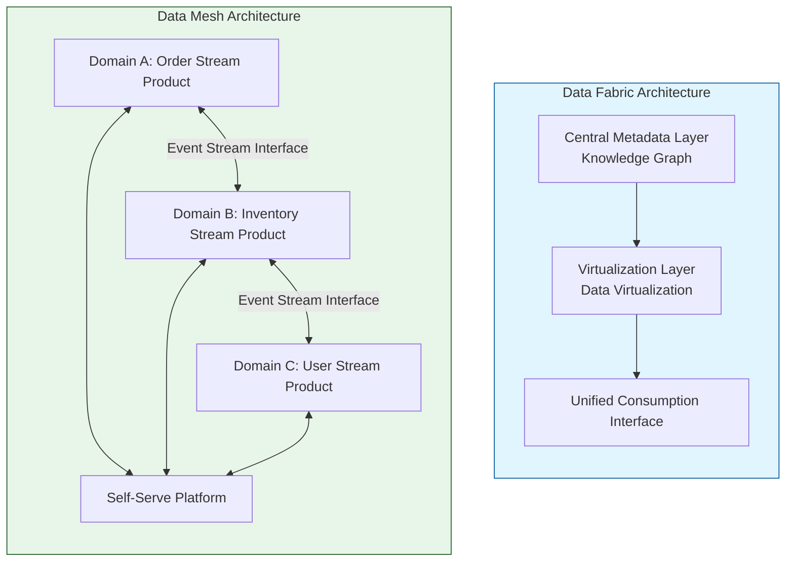
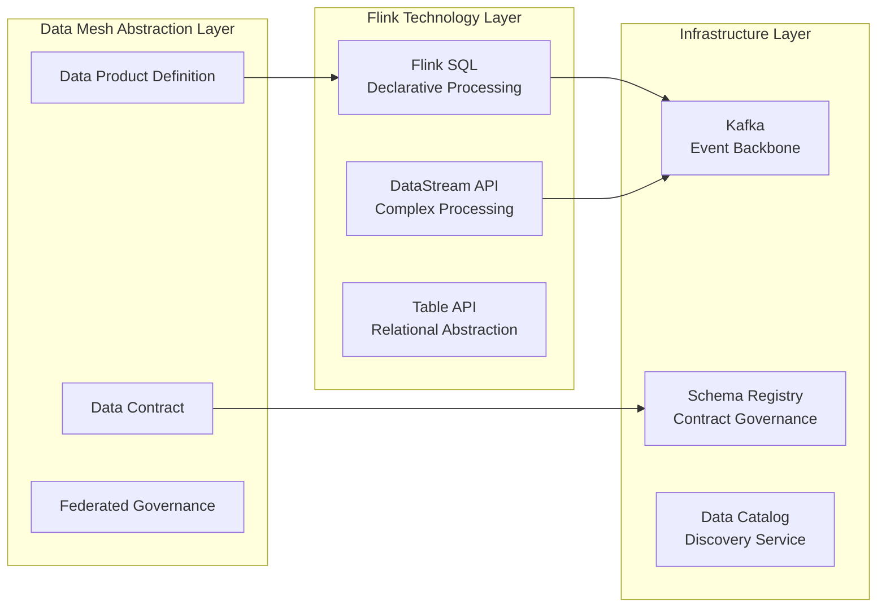
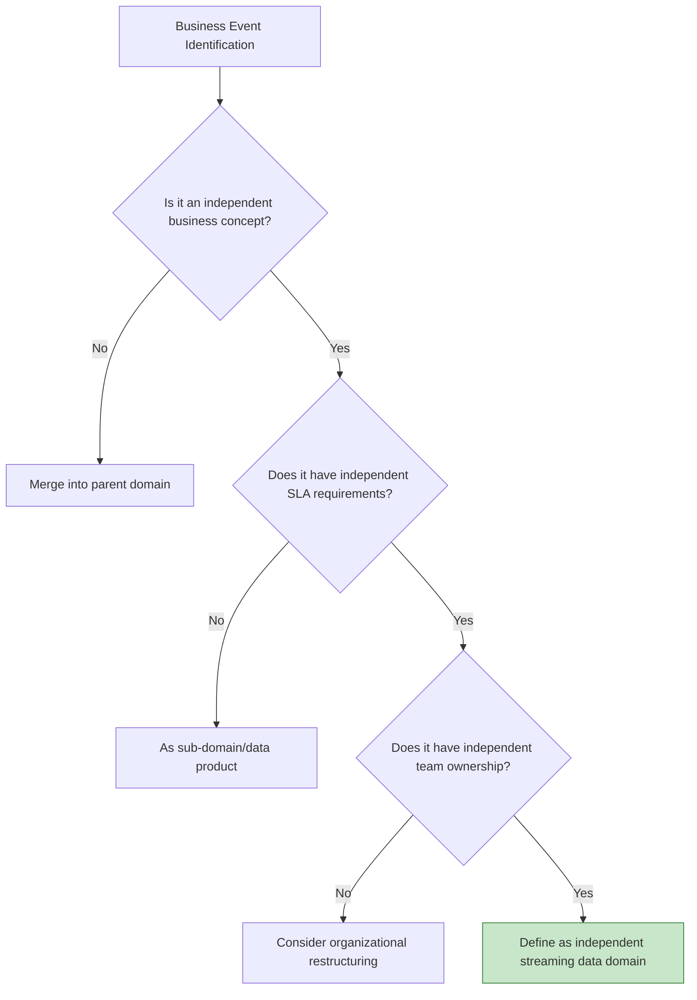
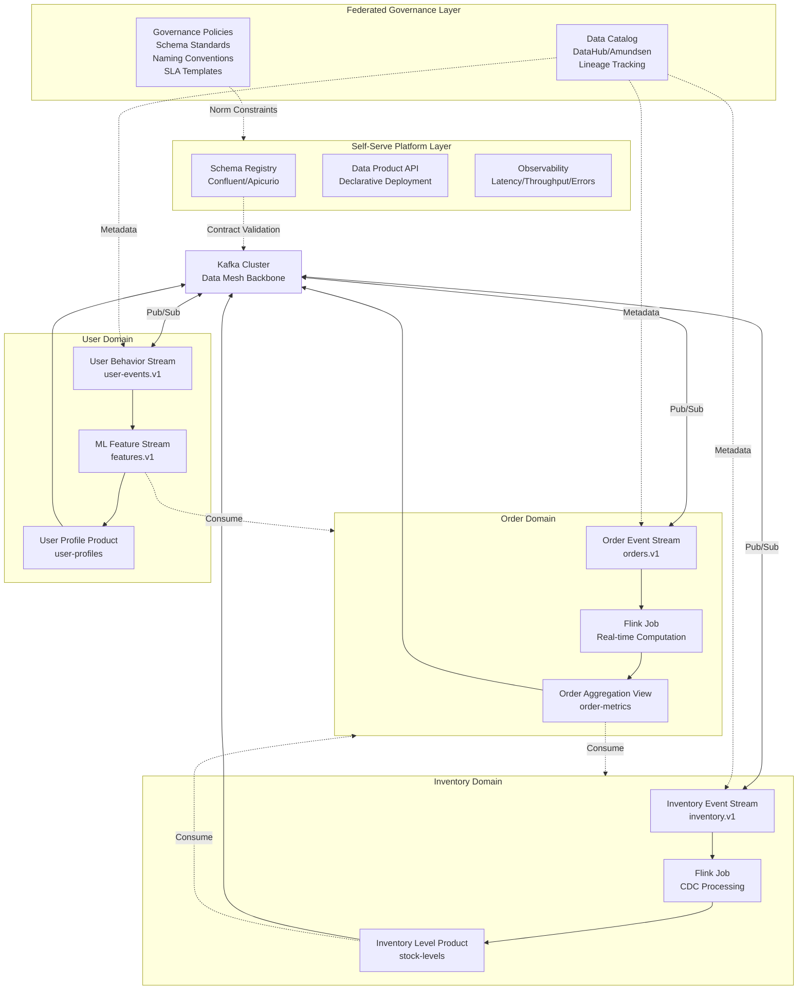
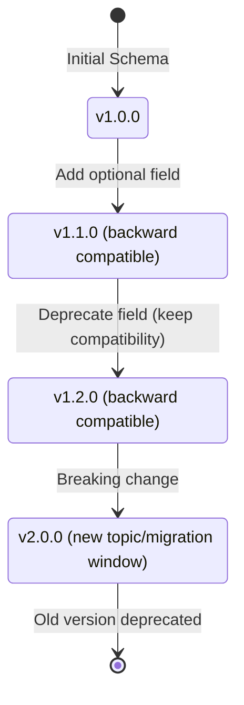
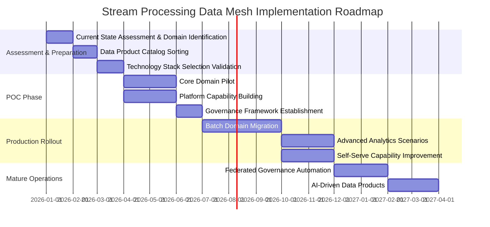
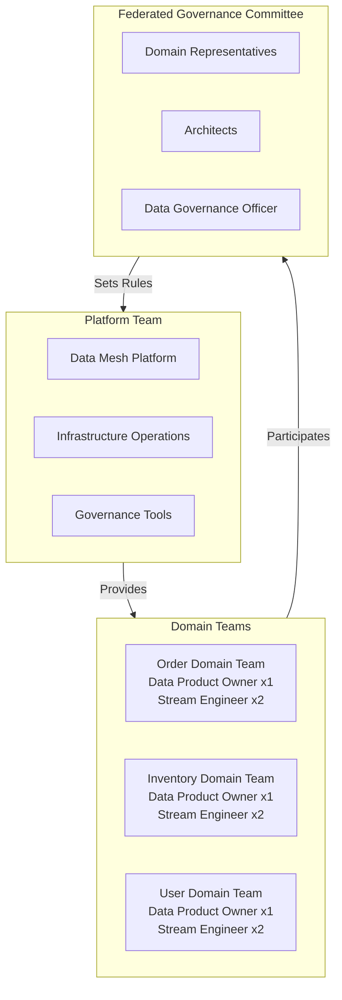

# Streaming Data Mesh Architecture and Real-time Data Products

> Stage: Knowledge | Prerequisites: [Knowledge/05-dataflow/05.01-dataflow-model.md](../01-concept-atlas/streaming-models-mindmap.md), [Knowledge/03-design-patterns/stream-processing-patterns.md](../02-design-patterns/pattern-event-time-processing.md) | Formalization Level: L4

---

## 1. Definitions

### 1.1 Data Mesh Foundation Definition

**Def-K-06-120 (Data Mesh)**: Data Mesh is a **decentralized data architecture paradigm** that treats data as a product owned and operated by independent domain teams, delivering data value at scale through a self-serve data platform and federated governance.

**Formalized Expression of the Four Core Principles**:

| Principle | Formal Definition | Key Attributes |
|-----------|-------------------|----------------|
| **Domain Ownership** | Data sovereignty $D_S$ belongs to business domain $\mathcal{B}_i$, satisfying $\forall d \in D_S, Owner(d) = \mathcal{B}_i$ | End-to-end responsibility, domain autonomy |
| **Data as Product** | Data product $\mathcal{P}_d = (Schema, Quality, Meta, Access, SLA)$ is discoverable, addressable, and trustworthy | Product thinking, user experience first |
| **Self-Serve Platform** | Platform capability $P_f$ provides an abstraction layer, enabling domain teams to satisfy $\forall op \in Ops, Complexity(op) \leq \theta_{domain}$ | Infrastructure as code, lowering barriers |
| **Federated Governance** | Global rules $\mathcal{G}$ are negotiated by domain representatives, satisfying $\mathcal{G} = \bigcup_i \mathcal{G}_i \cap \mathcal{G}_{global}$ | Balance between standardization and autonomy |

### 1.2 Real-time Data Product Definition

**Def-K-06-121 (Real-time Data Product)**: A real-time data product is a special type of data product whose data freshness satisfies the latency constraint $T_{latency} \leq T_{SLO}$, formally defined as:

$$\mathcal{P}_{realtime} = (E_{stream}, \mathcal{T}_{proc}, \mathcal{Q}_{fresh}, SLA_{RT})$$

Where:

- $E_{stream}$: Event stream interface (Kafka Topic, Pulsar Stream, etc.)
- $\mathcal{T}_{proc}$: Processing semantics (At-least-once / Exactly-once)
- $\mathcal{Q}_{fresh}$: Freshness quality metrics (end-to-end latency, Watermark age)
- $SLA_{RT}$: Real-time service level agreement (availability, latency, throughput)

### 1.3 Streaming Data Domain Boundary

**Def-K-06-122 (Streaming Data Domain)**: A streaming data domain $\mathcal{D}_s$ is a domain boundary defined around business event streams, satisfying:

$$\mathcal{D}_s = (E_{in}, \mathcal{F}_{proc}, E_{out}, \mathcal{C}_{contract})$$

- $E_{in}$: Set of input event streams (from other domains or external sources)
- $\mathcal{F}_{proc}$: In-domain stream processing functions (Flink jobs, Kafka Streams applications)
- $E_{out}$: Output event stream products (for consumption by other domains)
- $\mathcal{C}_{contract}$: Data contract (Schema version, compatibility rules, SLA commitments)

### 1.4 Data Contract Formalization

**Def-K-06-123 (Data Contract)**: A data contract is a formal agreement between a streaming data product and its consumers:

$$\mathcal{C} = (S, V, Q, M, A, L)$$

| Component | Description | Example |
|-----------|-------------|---------|
| $S$ (Schema) | Formal definition of data structure | Avro/Protobuf/JSON Schema |
| $V$ (Versioning) | Semantic versioning strategy | SemVer: major.minor.patch |
| $Q$ (Quality) | Data quality assertions | Null rate, value range, uniqueness |
| $M$ (Metadata) | Discovery and governance metadata | Ownership, lineage, business terms |
| $A$ (Access) | Access patterns and authentication | SASL/SSL, RBAC |
| $L$ (Lifecycle) | Retention policy and SLA | 7-day retention, P99 latency<100ms |

---

## 2. Properties

### 2.1 Data Mesh Architecture Properties

**Lemma-K-06-90 (Trade-off between Domain Autonomy and Global Consistency)**: In a Data Mesh architecture, domain autonomy degree $\alpha$ and global consistency $C$ satisfy an inverse relationship:

$$\alpha \cdot C \leq K$$

Where $K$ is an organizational constant determined by the strength of federated governance.

*Intuitive explanation*: The greater the autonomy of domain teams, the harder it is to achieve global standardization; strong governance limits the speed of domain innovation. Federated governance aims to find the optimal balance.

**Lemma-K-06-91 (Network Effects of Real-time Data Products)**: Let the number of domains be $n$ and the number of data products be $m$, then the mesh value $V_{mesh}$ satisfies:

$$V_{mesh} \propto m \cdot \log(n) \cdot \frac{1}{\bar{T}_{latency}}$$

That is, value grows with the number of products and domains, but is moderated by the inverse of average latency — stronger real-time capability leads to higher value.

### 2.2 Stream Processing Specific Properties

**Lemma-K-06-92 (Schema Evolution Compatibility)**: Let the Schema version sequence be $S_1, S_2, ..., S_n$, backward compatibility requires:

$$\forall i < j, Consumer(S_j) \subseteq Consumer(S_i)$$

Forward compatibility requires:

$$\forall i < j, Producer(S_i) \subseteq Producer(S_j)$$

*Engineering implication*: Consumers should be upgraded before producers to ensure that consumers of the new Schema can read old data.

### 2.3 Data Lineage Transitivity

**Prop-K-06-90 (Lineage Transitive Closure)**: If data product $P_A$ depends on $P_B$, and $P_B$ depends on $P_C$, then there exists a path $P_A \rightarrow P_B \rightarrow P_C$ in the lineage graph $\mathcal{G}_{lineage}$, and the impact analysis scope is:

$$Impact(P_C) = \{P \in \mathcal{P} \mid P_C \leadsto^* P\}$$

---

## 3. Relations

### 3.1 Data Mesh vs Data Fabric Comparison



**Comparison Matrix**:

| Dimension | Data Fabric | Data Mesh |
|-----------|-------------|-----------|
| **Architecture Philosophy** | Centralized virtualization | Decentralized productization |
| **Data Location** | Kept in source systems, virtual integration | Physically distributed, domain autonomy |
| **Primary Technologies** | Data virtualization, knowledge graph | Event streams, Schema registry, data product catalog |
| **Governance Model** | Central IT-driven | Federated, domain representative participation |
| **Applicable Scenarios** | Existing system integration, cross-domain query | Real-time analytics, microservices ecosystem, rapid iteration |
| **Stream Processing Capability** | Weak (mainly batch-oriented) | Native support (event-driven core) |

### 3.2 Mapping with Flink Ecosystem



---

## 4. Argumentation

### 4.1 Why is Stream Processing the Ideal Carrier for Data Mesh?

**Argumentation Framework**: Deriving the fitness of stream processing from the four core principles

| Principle | Natural Fit of Stream Processing |
|-----------|----------------------------------|
| **Domain Ownership** | Microservice boundaries naturally align with stream domain boundaries; each service owns its event streams |
| **Data as Product** | Kafka Topic serves as an addressable, discoverable, and subscribable data product interface |
| **Self-Serve Platform** | Kafka Connect + Schema Registry provide declarative data integration capabilities |
| **Federated Governance** | Schema evolution rules and unified ACL policies are implemented across domains |

**Counter-example Analysis**: Limitations of Batch Data Mesh

- Batch jobs are usually scheduled across domains, violating domain ownership
- The centralized nature of batch ETL conflicts with decentralized governance
- Batch data products lack real-time capability, making it hard to meet modern business needs

### 4.2 Domain Boundary Division Decision Tree



---

## 5. Engineering Argument

### 5.1 Stream Processing Data Mesh Reference Architecture



### 5.2 Technology Component Selection Argument

**Thm-K-06-90 (Stream Processing Data Mesh Technology Stack Completeness)**: A production-grade stream processing Data Mesh platform needs to satisfy the following capability matrix:

| Capability Domain | Required Component | Recommended Choice | Reason |
|-------------------|--------------------|--------------------|--------|
| **Event Backbone** | Distributed log | Apache Kafka / Pulsar | High throughput, persistence, replayability |
| **Stream Processing** | Compute engine | Apache Flink | Exactly-once, low latency, SQL support |
| **Schema Governance** | Schema Registry | Confluent Schema Registry | Version control, compatibility checks |
| **Data Catalog** | Metadata management | DataHub / OpenMetadata | Discovery, lineage, governance |
| **Observability** | Monitoring & alerting | Prometheus + Grafana | Latency/throughput/offset metrics |
| **Access Control** | Security layer | Kafka ACL + RBAC | Inter-domain data isolation |

### 5.3 Schema Evolution Engineering Practice



**Schema Compatibility Rules**:

```yaml
# Confluent Schema Registry configuration example
compatibility:
  BACKWARD: # New consumers can read old data
    - allow: add optional fields, remove fields
    - forbid: modify field types, add required fields

  FORWARD: # Old consumers can read new data
    - allow: remove optional fields, add required fields
    - forbid: modify field types

  FULL: # Bidirectional compatibility (recommended default)
    - allow: add optional fields
    - forbid: all other breaking changes
```

---

## 6. Examples

### 6.1 E-commerce Real-time Data Product Example

**Scenario**: An e-commerce platform builds a stream processing Data Mesh to support real-time recommendations and inventory management

**Domain Division**:

| Domain | Data Product | Output Topic | SLA |
|--------|--------------|--------------|-----|
| Order Domain | Real-time Order Stream | `orders.order-events.v1` | P99 latency<50ms |
| Inventory Domain | Inventory Level Product | `inventory.stock-levels.v1` | P99 latency<100ms |
| User Domain | User Behavior Features | `users.behavior-features.v1` | P99 latency<200ms |
| Recommendation Domain | Personalized Recommendations | `recommendations.personalized.v1` | P99 latency<10ms |

**Flink Job Example (Order Domain Aggregation)**:

```sql
-- Order domain data product definition
CREATE TABLE order_events (
    order_id STRING,
    user_id STRING,
    product_id STRING,
    amount DECIMAL(10,2),
    event_time TIMESTAMP(3),
    WATERMARK FOR event_time AS event_time - INTERVAL '5' SECOND
) WITH (
    'connector' = 'kafka',
    'topic' = 'orders.order-events.v1',
    'properties.bootstrap.servers' = 'kafka:9092',
    'format' = 'avro-confluent',
    'avro-confluent.schema-registry.url' = 'http://schema-registry:8081'
);

-- Real-time order statistics product (output to downstream domains)
CREATE TABLE order_metrics (
    window_start TIMESTAMP(3),
    window_end TIMESTAMP(3),
    product_category STRING,
    order_count BIGINT,
    total_amount DECIMAL(16,2),
    PRIMARY KEY (window_start, product_category) NOT ENFORCED
) WITH (
    'connector' = 'kafka',
    'topic' = 'orders.order-metrics.v1',
    'format' = 'avro-confluent'
);

-- Real-time aggregation job (data product production)
INSERT INTO order_metrics
SELECT
    TUMBLE_START(event_time, INTERVAL '1' MINUTE) as window_start,
    TUMBLE_END(event_time, INTERVAL '1' MINUTE) as window_end,
    product_category,
    COUNT(*) as order_count,
    SUM(amount) as total_amount
FROM order_events
GROUP BY
    TUMBLE(event_time, INTERVAL '1' MINUTE),
    product_category;
```

### 6.2 Complete Data Contract Example

```json
{
  "dataContract": {
    "id": "orders.order-events.v1",
    "owner": "order-domain-team@company.com",
    "version": "1.2.0",
    "schema": {
      "type": "avro",
      "definition": "https://schema-registry/orders/order-events/v1.2.0"
    },
    "quality": {
      "assertions": [
        {"column": "order_id", "check": "not_null"},
        {"column": "amount", "check": "greater_than", "value": 0},
        {"column": "event_time", "check": "not_older_than", "value": "1h"}
      ]
    },
    "sla": {
      "freshness": {"p99_latency_ms": 50},
      "availability": "99.99%",
      "throughput": {"min_events_per_sec": 10000}
    },
    "access": {
      "authentication": "SASL_SSL",
      "authorization": ["inventory-domain", "analytics-domain"]
    },
    "lifecycle": {
      "retention_days": 7,
      "deprecation_date": null
    },
    "lineage": {
      "upstream": ["mysql.orders table"],
      "downstream": ["orders.order-metrics.v1", "inventory.reserved-stock.v1"]
    }
  }
}
```

---

## 7. Visualizations

### 7.1 Implementation Roadmap



### 7.2 Data Product Maturity Model

```mermaid
graph LR
    subgraph L1["L1: Basic"]
        L1_1["Event Exposure"]
        L1_2["Basic Schema"]
    end

    subgraph L2["L2: Standard"]
        L2_1["Data Contract"]
        L2_2["Lineage Tracking"]
        L2_3["Basic SLA"]
    end

    subgraph L3["L3: Mature"]
        L3_1["Quality Monitoring"]
        L3_2["Automated Governance"]
        L3_3["Product Marketplace"]
    end

    subgraph L4["L4: Optimized"]
        L4_1["Predictive Optimization"]
        L4_2["Adaptive SLA"]
        L4_3["AI Augmentation"]
    end

    L1 --> L2 --> L3 --> L4
```



### 7.3 Domain Team Organizational Structure



---

## 8. References


---

*Document Version: v1.0 | Last Updated: 2026-04-03 | Theorem Registry: Def-K-06-120~123, Lemma-K-06-90~92, Prop-K-06-90, Thm-K-06-90*
