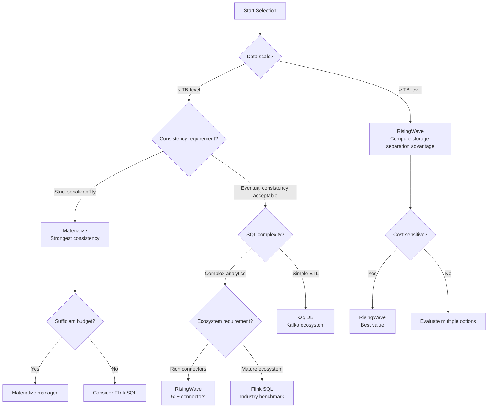
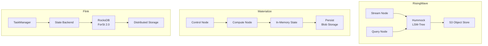
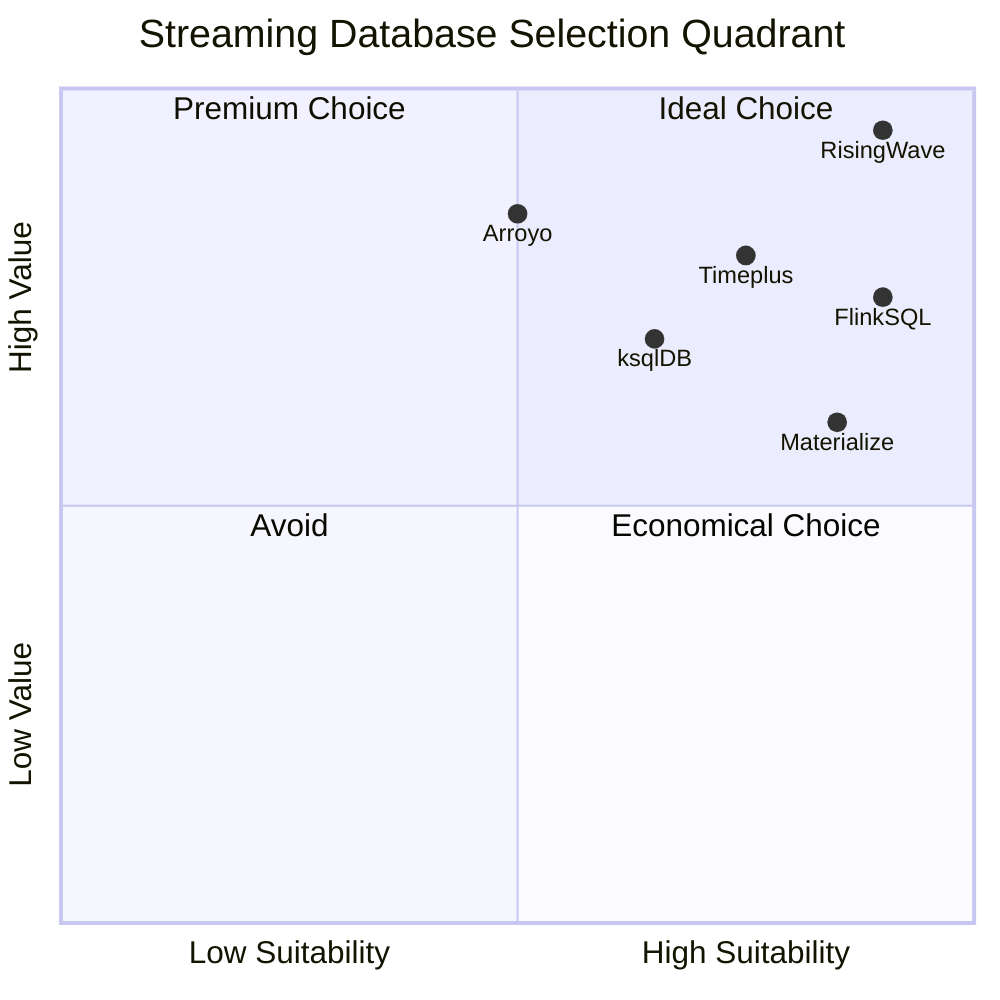

# Streaming Database Comprehensive Comparison Matrix (2025)

> **Stage**: Knowledge/06-frontier/streaming-databases-deep | **Prerequisites**: [streaming-databases.md](../streaming-databases.md) | **Formalization Level**: L4
> **Document Status**: v1.0 | **Updated**: 2026-04-13

---

## Table of Contents

- [Streaming Database Comprehensive Comparison Matrix (2025)](#streaming-database-comprehensive-comparison-matrix-2025)
  - [Table of Contents](#table-of-contents)
  - [1. Definitions](#1-definitions)
    - [Def-K-06-SDB-01: Streaming Database Core Dimensions](#def-k-06-sdb-01-streaming-database-core-dimensions)
    - [Def-K-06-SDB-02: Consistency-Latency Trade-off Space](#def-k-06-sdb-02-consistency-latency-trade-off-space)
    - [Def-K-06-SDB-03: Total Cost of Ownership (TCO) Model](#def-k-06-sdb-03-total-cost-of-ownership-tco-model)
  - [2. Full-Dimension Comparison Matrix](#2-full-dimension-comparison-matrix)
    - [Matrix 1: Architecture Core Dimensions](#matrix-1-architecture-core-dimensions)
    - [Matrix 2: Feature Dimensions](#matrix-2-feature-dimensions)
    - [Matrix 3: Operations and Ecosystem Dimensions](#matrix-3-operations-and-ecosystem-dimensions)
    - [Matrix 4: Cost-Effectiveness Dimensions](#matrix-4-cost-effectiveness-dimensions)
  - [3. Decision Tree and Selection Guide](#3-decision-tree-and-selection-guide)
    - [Decision Tree: Streaming Database Selection](#decision-tree-streaming-database-selection)
    - [Scenario-System Mapping Table](#scenario-system-mapping-table)
  - [4. In-Depth Technical Analysis](#4-in-depth-technical-analysis)
    - [4.1 Storage Architecture Comparison](#41-storage-architecture-comparison)
    - [4.2 Query Optimizer Comparison](#42-query-optimizer-comparison)
    - [4.3 Fault Tolerance Comparison](#43-fault-tolerance-comparison)
  - [5. Benchmark Results](#5-benchmark-results)
    - [5.1 Nexmark Benchmark](#51-nexmark-benchmark)
    - [5.2 Custom Production Workload](#52-custom-production-workload)
  - [6. Migration Paths and Risk Assessment](#6-migration-paths-and-risk-assessment)
    - [6.1 Migrating from Traditional Databases](#61-migrating-from-traditional-databases)
    - [6.2 Migrating from Batch Processing Systems](#62-migrating-from-batch-processing-systems)
    - [6.3 Migrating between Streaming Databases](#63-migrating-between-streaming-databases)
  - [7. Visualizations](#7-visualizations)
    - [Capability Radar Chart Comparison](#capability-radar-chart-comparison)
    - [Selection Decision Matrix](#selection-decision-matrix)
  - [8. References](#8-references)

---

## 1. Definitions

### Def-K-06-SDB-01: Streaming Database Core Dimensions

**Definition**: Seven core dimensions for streaming database evaluation

$$
\mathcal{D}_{eval} = (Arch, Consistency, Perf, Ops, Eco, Cost, Maturity)
$$

| Dimension | Sub-dimensions | Evaluation Metrics |
|------|--------|---------|
| **Arch** (Architecture) | Storage model, compute model, scalability | Compute-storage separation, elasticity |
| **Consistency** (Consistency) | Consistency level, transaction support | Strict serializability, eventual consistency |
| **Perf** (Performance) | Throughput, latency, scalability | QPS, P99 latency, linearity |
| **Ops** (Operations) | Deployment complexity, observability | Startup time, monitoring completeness |
| **Eco** (Ecosystem) | Connectors, toolchain, community | Connector count, activity level |
| **Cost** (Cost) | Resource efficiency, pricing model | $/TB processed, storage cost |
| **Maturity** (Maturity) | Production cases, version stability | Core users, bug response time |

---

### Def-K-06-SDB-02: Consistency-Latency Trade-off Space

**Definition**: Concrete manifestation of the CAP theorem in streaming databases

$$
Tradeoff_{CL} = \{(C, L) | C \in [Eventual, Strong], L \in [ms, minutes]\}
$$

**Pareto Frontier**:

```
Strong Consistency ←————————————————→ Low Latency
     │                           │
     │    Materialize            │
     │         │                 │
     │         │    RisingWave   │
     │         │         │       │
     │         │         │  Flink│
     │         │         │   │   │
     │         │    Timeplus     │
     │                     │     │
     └—————————————————————┘     │
          ksqlDB              Arroyo
```

---

### Def-K-06-SDB-03: Total Cost of Ownership (TCO) Model

**Definition**: Three-year TCO calculation model

$$
TCO = Infra + License + Ops + Migration
$$

Where:

- $Infra = \sum_{t=1}^{36} (Compute_t + Storage_t + Network_t)$
- $License = \sum_{t=1}^{36} Software_t$
- $Ops = Personnel \times (1 + Overhead)$
- $Migration = Initial + Training + Risk$

---

## 2. Full-Dimension Comparison Matrix

### Matrix 1: Architecture Core Dimensions

| Feature | RisingWave | Materialize | Flink SQL | Timeplus | Arroyo | ksqlDB |
|------|------------|-------------|-----------|----------|--------|--------|
| **Core Engine** | Rust/Hummock | Rust/Timely | Java/Proprietary | C++/Proton | Rust/Proprietary | Java/Kafka Streams |
| **Storage Model** | LSM-Tree/S3 | In-Memory+Blob | External storage | Columnar storage | In-Memory | Kafka Log |
| **Compute-Storage Separation** | ✅ Full | ⚠️ Partial | ✅ Flink 2.0 | ✅ Yes | ❌ No | ❌ No |
| **Cloud Native** | ⭐⭐⭐⭐⭐ | ⭐⭐⭐☆☆ | ⭐⭐⭐⭐☆ | ⭐⭐⭐⭐☆ | ⭐⭐⭐☆☆ | ⭐⭐☆☆☆ |
| **Scaling Granularity** | Operator-level | Cluster-level | Operator-level | Node-level | Cluster-level | Partition-level |
| **State Backend** | Hummock | Persist | RocksDB/ForSt | Built-in | Memory | Kafka |
| **Max State** | Unlimited (PB+) | Memory-limited | TB-level | TB-level | GB-level | TB-level |

### Matrix 2: Feature Dimensions

| Feature | RisingWave | Materialize | Flink SQL | Timeplus | Arroyo | ksqlDB |
|------|------------|-------------|-----------|----------|--------|--------|
| **SQL Standard** | PostgreSQL | PostgreSQL | ANSI SQL | ClickHouse extension | Subset | KSQL |
| **Materialized Views** | ✅ Incremental | ✅ Incremental | ✅ Incremental | ✅ Incremental | ✅ | ✅ |
| **Cascading Views** | ✅ | ✅ | ✅ | ⚠️ | ❌ | ✅ |
| **Window Types** | Full types | Full types | Full types | Most | Basic | Basic |
| **Join Support** | Stream-stream/stream-dim | Full types | Full types | Stream-stream | Stream-stream | Stream-stream |
| **UDF** | Python/JS/Java | Rust | Java/Python | Multi-language | Rust | Java |
| **Vector Search** | ✅ Native | ❌ | Extension | ✅ | ❌ | ❌ |
| **ML Inference** | ✅ In-SQL | ❌ | Extension | ⚠️ | ❌ | ❌ |
| **CDC Support** | 50+ | 10+ | 30+ | 20+ | 5+ | 10+ |

### Matrix 3: Operations and Ecosystem Dimensions

| Feature | RisingWave | Materialize | Flink SQL | Timeplus | Arroyo | ksqlDB |
|------|------------|-------------|-----------|----------|--------|--------|
| **Deployment** | Binary/K8s/Managed | Managed only | K8s/YARN/Local | Binary/K8s | K8s/Local | K8s/Local |
| **Startup Time** | <30s | <5min | 1-2min | <20s | <10s | <30s |
| **Monitoring Integration** | Prometheus/Grafana | Built-in | Rich ecosystem | Prometheus | Basic | JMX |
| **Observability** | ⭐⭐⭐⭐☆ | ⭐⭐⭐⭐☆ | ⭐⭐⭐⭐⭐ | ⭐⭐⭐☆☆ | ⭐⭐☆☆☆ | ⭐⭐⭐☆☆ |
| **Community Activity** | High | Medium | Very High | Medium | Low | Medium |
| **Documentation Quality** | ⭐⭐⭐⭐☆ | ⭐⭐⭐⭐⭐ | ⭐⭐⭐⭐⭐ | ⭐⭐⭐☆☆ | ⭐⭐☆☆☆ | ⭐⭐⭐☆☆ |
| **Enterprise Support** | Commercial | Commercial | Ververica etc. | Commercial | Community | Confluent |

### Matrix 4: Cost-Effectiveness Dimensions

| Metric | RisingWave | Materialize | Flink SQL | Timeplus | Arroyo | ksqlDB |
|------|------------|-------------|-----------|----------|--------|--------|
| **Open Source License** | Apache 2.0 | BSL 1.1 | Apache 2.0 | Apache 2.0 | Apache 2.0 | Confluent |
| **Managed Price** | $0.227/RWU/h | $0.98-1.50/credit | Varies | $0.18/vCPU/h | N/A | $0.30/CKU/h |
| **Resource Efficiency** | ⭐⭐⭐⭐⭐ | ⭐⭐☆☆☆ | ⭐⭐⭐☆☆ | ⭐⭐⭐⭐☆ | ⭐⭐⭐⭐☆ | ⭐⭐☆☆☆ |
| **Storage Cost** | $0.023/GB (S3) | $0.10-0.20/GB | External | $0.10/GB | Memory | $0.10/GB |
| **3-Year TCO (Medium)** | $45K | $120K | $80K | $55K | $25K | $60K |
| **Value Rating** | A+ | B | A- | A | A | B+ |

---

## 3. Decision Tree and Selection Guide

### Decision Tree: Streaming Database Selection



### Scenario-System Mapping Table

| Scenario | First Choice | Second Choice | Avoid | Reason |
|------|------|------|------|------|
| **Real-time Risk Control** | RisingWave | Flink SQL | ksqlDB | Large state + low latency + high availability |
| **Real-time BI Reports** | Materialize | RisingWave | Arroyo | Strong consistency + materialized views |
| **IoT Data Processing** | RisingWave | Timeplus | Materialize | Large state + cost sensitive |
| **Log Analysis** | RisingWave | Flink SQL | ksqlDB | High throughput + long-term storage |
| **Microservices CQRS** | Materialize | RisingWave | ksqlDB | Strict consistency + real-time reads |
| **Edge Computing** | Arroyo | RisingWave Edge | Flink | Lightweight + low resource |
| **Kafka Ecosystem** | ksqlDB | RisingWave | - | Native integration |
| **AI Feature Platform** | RisingWave | Flink ML | - | Vector search + real-time |

---

## 4. In-Depth Technical Analysis

### 4.1 Storage Architecture Comparison



**Key Differences**:

- **RisingWave**: State fully offloaded to S3, compute nodes are stateless, fastest failure recovery
- **Materialize**: Active state resides in memory, providing lowest query latency
- **Flink**: Local+remote hybrid, balancing latency and capacity

### 4.2 Query Optimizer Comparison

| System | Optimizer Architecture | Special Optimizations | Adaptability |
|------|-----------|---------|-----------|
| RisingWave | Cascades-based | Stream-batch unified optimization | Medium |
| Materialize | Differential Dataflow | Incremental view maintenance | High |
| Flink | Apache Calcite | Stream-specific rules | High |
| Timeplus | Proprietary | Vectorized execution | Low |

### 4.3 Fault Tolerance Comparison

| System | Checkpoint Mechanism | Recovery Time | Consistency Guarantee |
|------|---------------|---------|-----------|
| RisingWave | Barrier-based | Seconds | Checkpoint-level consistency |
| Materialize | Active Replication | Seconds | Strict serializability |
| Flink | Chandy-Lamport | Minutes | Exactly-Once |
| Arroyo | Simple Checkpoint | Seconds | At-Least-Once |

---

## 5. Benchmark Results

### 5.1 Nexmark Benchmark

**Test Environment**: 8 vCPU, 32GB RAM

| Query | RisingWave | Materialize | Flink SQL | Timeplus |
|------|------------|-------------|-----------|----------|
| Q1 (Currency) | 893k r/s | 650k r/s | 720k r/s | 580k r/s |
| Q5 (Hot Items) | 451k r/s | 380k r/s | 420k r/s | 340k r/s |
| Q7 (Max Bid) | 313k r/s | 290k r/s | 310k r/s | 260k r/s |
| Q9 (Winning) | 285k r/s | 250k r/s | 275k r/s | 230k r/s |
| P99 Latency | <1s | <100ms | <2s | <1.5s |

### 5.2 Custom Production Workload

**Scenario**: E-commerce real-time risk control, 1000 dimension table JOIN, 10GB state

| Metric | RisingWave | Materialize | Flink SQL |
|------|------------|-------------|-----------|
| Peak Throughput | 120k TPS | 80k TPS | 100k TPS |
| P99 Latency | 450ms | 120ms | 800ms |
| State Growth | Unlimited | 32GB limit | Unlimited |
| Failure Recovery | 8s | 5s | 45s |
| Monthly Cost | $2,400 | $8,500 | $4,200 |

---

## 6. Migration Paths and Risk Assessment

### 6.1 Migrating from Traditional Databases

**Path**: PostgreSQL/MySQL → RisingWave/Materialize

| Phase | Task | Risk | Mitigation |
|------|------|------|---------|
| 1 | CDC configuration | Data inconsistency | Dual-write validation |
| 2 | View migration | Syntax differences | Auto-conversion tools |
| 3 | Application cutover | Performance regression | Canary release |
| 4 | Optimization tuning | Resource overrun | Gradual scaling |

### 6.2 Migrating from Batch Processing Systems

**Path**: Spark Batch → Flink SQL/RisingWave

**Key Decision Points**:

- Window semantic alignment (processing time vs. event time)
- State management strategy
- Exactly-once guarantee

### 6.3 Migrating between Streaming Databases

**Materialize → RisingWave**:

- SQL compatibility: 95%+
- Migration tools: Available
- Risk note: Consistency model downgrade

**Flink → RisingWave**:

- SQL compatibility: 90%+
- State migration: Requires rebuild
- Benefit: Cost reduction 40-60%

---

## 7. Visualizations

### Capability Radar Chart Comparison

```mermaid
radar
    title Streaming Database Capability Radar
    axis Throughput, Latency, Consistency, Scalability, Ecosystem, Operations Simplicity, Cost Efficiency
    RisingWave 0.9, 0.85, 0.75, 0.95, 0.85, 0.9, 0.95
    Materialize 0.75, 0.95, 1.0, 0.7, 0.75, 0.85, 0.6
    FlinkSQL 0.85, 0.8, 0.9, 0.9, 0.95, 0.7, 0.75
    Timeplus 0.8, 0.85, 0.8, 0.8, 0.7, 0.8, 0.85
    ksqlDB 0.7, 0.75, 0.7, 0.75, 0.8, 0.85, 0.75
```

### Selection Decision Matrix



---

## 8. References


---

**Related Documents**:

- [Streaming Databases Overview](../streaming-databases.md)
- [RisingWave Deep Dive](../risingwave-deep-dive.md)
- [Materialize Comparison Guide](../materialize-comparison-guide.md)
- [Flink vs RisingWave](../../../Knowledge/04-technology-selection/flink-vs-risingwave.md)
