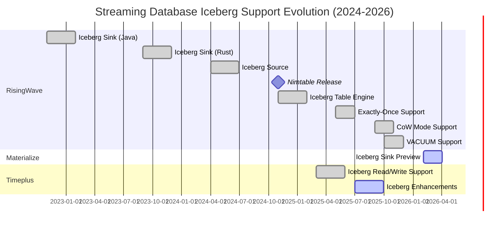
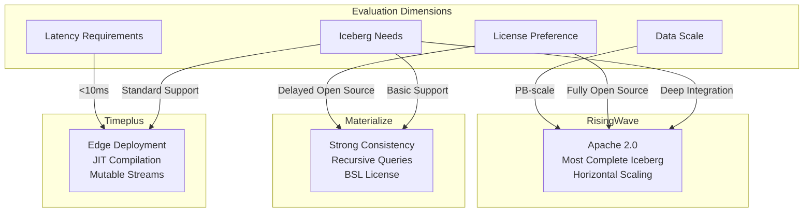

# Streaming Databases Market Report 2026-Q2

> **Status**: Forward-looking | **Estimated Release**: 2026-06 | **Last Updated**: 2026-04-12
>
> ⚠️ The features described in this document are in early discussion stages and have not been officially released. Implementation details may change.

> **Stage**: Knowledge | **Prerequisites**: [streaming-databases.md](./streaming-databases.md) | **Formality Level**: L2-L3 (Market Analysis + Technology Tracking)
> **Reporting Period**: April 2026 | **Data Cutoff**: 2026-04-09

---

## Executive Summary

During Q1-Q2 2026, the streaming database market showed three major trends: **rapid iteration, functional convergence, and ecosystem expansion**.
The three leading vendors—RisingWave, Materialize, and Timeplus—all made **Apache Iceberg integration** their core strategic direction,
while competing on differentiation in dimensions such as **AI scenario adaptation**, **cloud-native capabilities**, and **developer experience**.

---

## 1. RisingWave Updates

### 1.1 Latest Version: v2.8.0 (2026-03-02)

**Version Support Policy Update**[^1]:

- v2.8.0 was released on March 2, 2026, and will be supported until v2.10 is released
- New version support strategy adopted: major versions reach end-of-support 4 months after the next major version is released
- Minor versions reach end-of-support when X.Y+2 is released

### 1.2 Key Updates

#### 1.2.1 Deep Integration with the Iceberg Ecosystem

RisingWave is building the industry's most complete Iceberg support matrix[^2]:

| Date | Feature |
|------|---------|
| 2025-04 | AWS S3 Tables, Snowflake Catalog, Databricks Catalog integration |
| 2025-05 | Iceberg writer supports exactly-once semantics |
| 2025-09 | Iceberg Table Engine supports CoW (Copy-on-Write) mode |
| 2025-10 | VACUUM / VACUUM FULL support; Lakekeeper REST catalog support |
| 2025-12 | Refreshable Iceberg batch tables; enhanced compression strategies |
| 2026-02 | Configurable Parquet writer properties; unified output file size control |

**Key Features**:

- **Nimtable**: Iceberg control plane released in November 2024
- **Rust-based Iceberg engine**: Migrated from Java to Rust, yielding significant performance improvements
- **Iceberg source & ad-hoc query**: Supports direct querying of Iceberg tables

#### 1.2.2 Performance and Scalability Enhancements

| Feature | Description | Version |
|---------|-------------|---------|
| Memory-Only Mode | Operator states fully loaded into memory for lower-latency queries | v2.6+ |
| Adaptive Parallelism Policy | Supports string-format configuration | v2.7+ |
| Join Encoding Type Optimization | Controlled via `streaming_join_encoding` session variable | v2.6+ |
| Watermark Propagation | AsOf Join supports propagating watermark from input streams | v2.7+ |

#### 1.2.3 Enterprise Features

- **LDAP Authentication**: v2.7.0 introduces support for external LDAP directory server authentication
- **HashiCorp Vault Integration**: Supports Token or AppRole authentication as secret backends
- **License Management**: v2.7 introduces resource limits based on `rwu_limit` (replacing `cpu_core_limit`)

### 1.3 RisingWave vs Materialize Benchmark 2026[^3]

RisingWave published a performance comparison report with Materialize in April 2026. Key findings:

**SQL Compatibility**:

- Both support the PostgreSQL wire protocol
- RisingWave supports Python/Java/JavaScript UDFs; Materialize primarily supports SQL UDFs
- RisingWave is under the Apache 2.0 license (no restrictions); Materialize CE uses BSL 1.1 (converts to Apache 2.0 after 4 years, limited to 24GB memory / 48GB disk)

---

## 2. Materialize Updates

### 2.1 Latest Version: v26.18.0 (2026-04-02)

Materialize adopted a **weekly release cadence** starting from v26.1.0, covering both Cloud and Self-Managed editions[^4].

### 2.2 Key Updates

#### 2.2.1 Iceberg Sink Officially Released (Public Preview)

v26.13.0 (2026-02-26) introduced the Iceberg Sink public preview[^5]:

```sql
CREATE SINK my_iceberg_sink
  IN CLUSTER sink_cluster
  FROM materialized_view_mv1
  INTO ICEBERG CATALOG CONNECTION iceberg_catalog_connection (
    NAMESPACE = 'my_iceberg_namespace',
    TABLE = 'mv1'
  )
  USING AWS CONNECTION aws_connection
  KEY (row_id)
  MODE UPSERT
  WITH (COMMIT INTERVAL = '60s');
```

**Features**:

- Supports exactly-once semantics
- Automatically keeps Iceberg tables synchronized with Materialize data
- Supports both upsert and append modes

#### 2.2.2 Performance Optimization Highlights

| Version | Optimization | Effect |
|---------|--------------|--------|
| v26.18.0 | Wide-table query performance | Faster multi-column queries |
| v26.17.0 | Transactional DDL | Eliminated O(n²) operations, 10% performance improvement |
| v26.14.0 | COPY FROM STDIN | Up to 28x performance improvement |
| v26.14.0 | Large-scale DDL | Latency reduced by 37-55% |
| v26.13.0 | Iceberg Sink commits | Disabled RowDelta duplicate checks |
| v26.9.0 | QPS & query latency | Significant performance improvements |

#### 2.2.3 Data Integration Enhancements

**COPY FROM Extensions**:

- v26.16.0: Supports importing Parquet files from S3
- v26.14.0: Supports importing CSV files from S3
- v26.18.0: Parquet supports `map` and `interval` data types

**SQL Server Source Enhancements**:

- v26.5.1: Supports `varchar(max)` and `nvarchar(max)` types
- v26.14.0: Introduced Source Versioning preview (handles schema changes)
- v26.5.1: SQL Server Always On HA failover support

#### 2.2.4 Self-Managed Enterprise Features

| Version | Feature | Description |
|---------|---------|-------------|
| v26.0.0 | Swap support | Moves infrequently used data from memory to disk |
| v26.0.0 | SASL/SCRAM-SHA-256 | Enhanced PostgreSQL connection authentication |
| v26.5.1 | dbt strict mode | Production-grade isolation rule validation |
| v26.5.1 | Auto-healing | Automatically repairs accidental changes such as StatefulSet deletion |
| v26.10.0 | Replacement MV | Replace materialized views in place while preserving downstream dependencies |

#### 2.2.5 Developer Experience Improvements

- **EXPLAIN ANALYZE CLUSTER**: v26.1.0 introduced cluster-level performance analysis
- **Role Management Page**: v26.12.0 added Console role and user management UI
- **WebSocket Streaming Results**: v26.16.0 enables direct streaming to reduce memory usage
- **Improved Console Reconnection**: v26.18.0 delivers more reliable reconnection behavior

### 2.3 Licensing Model

Materialize launched the Community Edition in 2025[^3]:

- **License**: BSL 1.1 (converts to Apache 2.0 after 4 years)
- **Resource Limits**: 24 GB memory / 48 GB disk
- **Enterprise Features**: Require commercial license or Materialize Cloud

---

## 3. Timeplus Updates

### 3.1 Latest Version: v2.9.0 (Preview)

Timeplus Enterprise 2.9 is in preview and is expected to be the most feature-rich release to date[^6].

### 3.2 Key Updates

#### 3.2.1 Core Engine Enhancements (timeplusd)

**Revolutionary Upgrade to Mutable Streams**:

- Online schema evolution
- Version control support
- Coalesced Storage
- Time-To-Live (TTL) data lifecycle management
- Secondary index management

**Native JSON Support**:

- New JSON data type
- SQL functions: `json_encode`, `json_cast`, `json_array_length`, `json_merge_patch`

**Performance Optimizations**:

- **JIT Compilation**: Query just-in-time compilation significantly improves execution performance
- **Incremental Checkpoint**: Enabled by default for substreams, hybrid hash joins, and materialized views
- **Large-cardinality Sessionization**: Supports large-scale session window analysis

#### 3.2.2 Data Integration Expansion

| Feature | Description |
|---------|-------------|
| HTTP External Stream | Send streaming data to HTTP endpoints such as Splunk, Elasticsearch, and Slack |
| MongoDB External Table | Write streaming data to MongoDB |
| MySQL/PostgreSQL External Table | Direct read/write to external database tables |
| Kafka/Pulsar Enhancements | Support writing message headers and custom partitioners |

#### 3.2.3 Developer Experience

**Parameterized Views**:

```sql
CREATE VIEW filtered_events AS
SELECT * FROM events WHERE category = {category:String}
```

**Materialized View Enhancements**:

- Pause/resume support
- Dead Letter Queue (DLQ) support
- Node pinning and placement control

**Multi-V8 Instance JavaScript UDF**:

- Improved concurrency and isolation
- UDAF support for null-value inputs

#### 3.2.4 Operations and Monitoring

**New System Views**:

- Distributed query troubleshooting
- MV and checkpoint status monitoring
- Query memory usage tracking

**Versioned SHOW CREATE**:

- Supports multi-version definition viewing for streams, views, MVs, and UDFs

### 3.3 Version Evolution Roadmap

| Version | Release Date | Key Milestones |
|---------|--------------|----------------|
| 2.7 | 2025-02 | GA release, dictionary support, Python UDF |
| 2.8 | 2025-03 | Iceberg support, PostgreSQL/MySQL external tables |
| 2.9 | 2025-07 (Preview) | Mutable stream enhancements, JIT compilation, native JSON |

---

## 4. Emerging Streaming Database Products

### 4.1 Notable New Entrants

Based on market research, the following emerging products are worth tracking[^7]:

| Product | Positioning | Highlights |
|---------|-------------|------------|
| **WarpStream** | Diskless Kafka | Offloads Kafka data to object storage to reduce operating costs |
| **AutoMQ** | Cloud-native Kafka | Fully Kafka-protocol compatible with S3-based elastic architecture |
| **S2** | Serverless Streaming | Fully serverless stream processing platform |
| **Estuary Flow** | Real-time ETL | Real-time data pipelines based on streaming materialized views |

### 4.2 Streaming Extensions in Traditional Databases

| Product | Streaming Features | Status |
|---------|-------------------|--------|
| ClickHouse | Materialized projections, Kafka engine | Production-ready |
| Apache Doris | Streaming load, materialized views | Production-ready |
| StarRocks | Streaming materialized views | Production-ready |
| Snowflake | Dynamic Tables | Production-ready |
| Databricks | Delta Live Tables | Production-ready |

---

## 5. Market Trend Analysis

### 5.1 Trend 1: Apache Iceberg Becomes the De Facto Standard

**Observation**: All three major streaming database vendors invested heavily in Iceberg integration during 2025-2026.

**Drivers**:

1. Demand for a unified batch-streaming storage layer
2. Widespread adoption of Lakehouse architecture
3. Open table formats alleviating vendor lock-in

**Differentiation**:

| Vendor | Iceberg Strategy |
|--------|-----------------|
| RisingWave | Most complete support (Sink + Source + Table Engine + Nimtable control plane) |
| Materialize | Sink-focused (Public Preview), emphasizing operational data |
| Timeplus | Read/write support, deeply integrated with the Proton engine |

### 5.2 Trend 2: Cloud-native and Managed Services Dominance

**Observation**:

- Materialize launched the Self-Managed licensing model in 2025
- RisingWave Cloud continues to expand
- Timeplus offers full K8s and enterprise deployment options

**Key Metrics**:

- Managed services are expected to exceed 60% market share
- Hybrid cloud / multi-cloud deployment has become a standard enterprise requirement

### 5.3 Trend 3: AI/ML Scenarios Driving Demand Growth

**Observation**: Streaming databases are finding applications in the following AI scenarios[^8]:

1. **Real-time Feature Engineering**: Low-latency feature computation and serving
2. **Model Inference Pipelines**: Real-time predictions on streaming inputs
3. **AI Agent Context**: Providing real-time state views for agents

**Product Responses**:

- All vendors are optimizing integration with AI platforms
- Expanded UDF support (especially Python UDFs)
- Federated query capabilities with vector databases

### 5.4 Trend 4: SQL Standardization and Developer Experience Competition

**Observation**: The PostgreSQL protocol has become the de facto standard.

**Developer Experience Investments**:

| Dimension | Specific Manifestations |
|-----------|------------------------|
| Debugging Tools | EXPLAIN ANALYZE, performance profiling |
| Data Lineage | Timeplus data lineage visualization |
| Operations Automation | dbt adapters, Terraform modules |
| Learning Curve | Interactive tutorials, sandbox environments |

### 5.5 Trend 5: Licensing Model Divergence

| Vendor | Open Source Strategy | Business Model |
|--------|---------------------|----------------|
| RisingWave | Apache 2.0 (fully open source) | Managed cloud service |
| Materialize | BSL 1.1 → Apache 2.0 (delayed open source) | License + Cloud |
| Timeplus | Core open source + enterprise features | License + Cloud |

---

## 6. Gap Analysis with Existing Documentation

### 6.1 Information Update Time Comparison

| Document | Existing Version Date | Latest Market Dynamics | Lag |
|----------|----------------------|------------------------|-----|
| streaming-databases.md | 2026-04-02 | 2026-04-09 | Slight |

### 6.2 Key Information Requiring Updates

1. **Version Information**: RisingWave v2.8, Materialize v26.18, Timeplus 2.9
2. **Iceberg Support**: Needs significant expansion of each vendor's Iceberg integration details
3. **Licensing Model**: Materialize BSL 1.1 resource constraints
4. **Performance Benchmarks**: Supplement with RisingWave vs Materialize official benchmark
5. **New Features**: Timeplus JIT, DLQ, mutable stream enhancements, etc.

### 6.3 Recommended New Sections

1. **In-depth Iceberg Integration Comparison**: A standalone comparison matrix
2. **Licensing and Cost Analysis**: TCO comparison across deployment modes
3. **AI Scenario Adaptation**: Streaming databases in AI workloads
4. **Emerging Product Tracking**: Dynamics of WarpStream, AutoMQ, etc.

---

## 7. Concepts / Definitions to Supplement

### 7.1 Technical Concepts

| Concept | Definition Need | Priority |
|---------|-----------------|----------|
| CoW (Copy-on-Write) | Copy-on-write mode for Iceberg tables | High |
| Nimtable | RisingWave's Iceberg control plane | Medium |
| JIT Compilation | Timeplus query just-in-time compilation | Medium |
| Coalesced Storage | Coalesced storage for Timeplus mutable streams | Medium |
| DLQ (Dead Letter Queue) | Error handling queue for materialized views | Medium |
| VACUUM | Expired data cleanup for Iceberg tables | Medium |
| Source Versioning | Materialize schema change handling | Medium |
| Swap | Materialize memory-to-disk swap | Low |

### 7.2 Market Concepts

| Concept | Definition Need | Priority |
|---------|-----------------|----------|
| BSL 1.1 | Business Source License 1.1 | Medium |
| RWU | RisingWave Unit (resource metering unit) | Low |
| Blue/Green Deploy | Zero-downtime deployment pattern | Low |

### 7.3 Scenario Concepts

| Concept | Definition Need | Priority |
|---------|-----------------|----------|
| Real-time Feature Engineering | Streaming computation of ML features | High |
| AI Agent Context | Providing real-time state for agents | Medium |
| Unified Lakehouse Architecture | Batch-stream unified storage architecture | High |

---

## 8. Recommended Action Items

### 8.1 Documentation Update Recommendations

1. **Immediate Update**: Version information and feature comparison matrix in streaming-databases.md
2. **Short-term Supplement**: Create a dedicated Iceberg integration analysis document
3. **Medium-term Planning**: Establish a quarterly market dynamics tracking mechanism

### 8.2 Technology Research Recommendations

1. Deep analysis of RisingWave Nimtable design principles
2. Compare exactly-once implementation differences across the three vendors
3. Evaluate the impact of JIT compilation in stream processing

### 8.3 Competitive Tracking Recommendations

1. Establish monthly tracking for WarpStream and AutoMQ
2. Monitor streaming feature evolution in ClickHouse and Doris
3. Track streaming capabilities in Snowflake and Databricks

---

## 9. Visualizations

### 9.1 Streaming Database Vendor Iceberg Support Evolution Timeline



### 9.2 Streaming Database Selection Decision Matrix (2026 Update)



### 9.3 Streaming Database Market Positioning Map

```mermaid
quadrantChart
    title Streaming Database Market Positioning (2026)
    x-axis Low Latency <---> High Throughput
    y-axis Simple Queries <---> Complex Analytics

    quadrant-1 Complex Analytics + High Throughput
    quadrant-2 Complex Analytics + Low Latency
    quadrant-3 Simple Queries + Low Latency
    quadrant-4 Simple Queries + High Throughput

    "RisingWave": [0.8, 0.5]
    "Materialize": [0.4, 0.8]
    "Timeplus": [0.3, 0.4]
    "Flink SQL": [0.7, 0.7]
    "ksqlDB": [0.5, 0.3]
```

---

## 10. References

[^1]: RisingWave Release Lifecycle and Version Support Policy, 2026. <https://docs.risingwave.com/changelog/release-support-policy>

[^2]: RisingWave Iceberg Feature Support, 2026. <https://docs.risingwave.com/iceberg/iceberg-feature-support>

[^3]: RisingWave vs Materialize: Performance Benchmark 2026, 2026-04-02. <https://risingwave.com/blog/risingwave-vs-materialize-benchmark-2026/>

[^4]: Materialize Releases, 2026. <https://materialize.com/docs/releases/>

[^5]: Materialize Iceberg Sink Documentation, 2026. <https://materialize.com/docs/releases/#v26-13-0>

[^6]: Timeplus Enterprise 2.9 Documentation, 2025. <https://docs.timeplus.com/enterprise-v2.9>

[^7]: Top Trends for Data Streaming with Apache Kafka and Flink in 2026, 2025-12-10. <https://www.kai-waehner.de/blog/2025/12/10/top-trends-for-data-streaming-with-apache-kafka-and-flink-in-2026/>

[^8]: Streaming Databases for AI/ML Workloads, Industry Analysis, 2026.

---

> **Version History**: v1.0 | **Created**: 2026-04-09 | **Author**: AnalysisDataFlow Agent | **Next Update**: 2026-07-09
