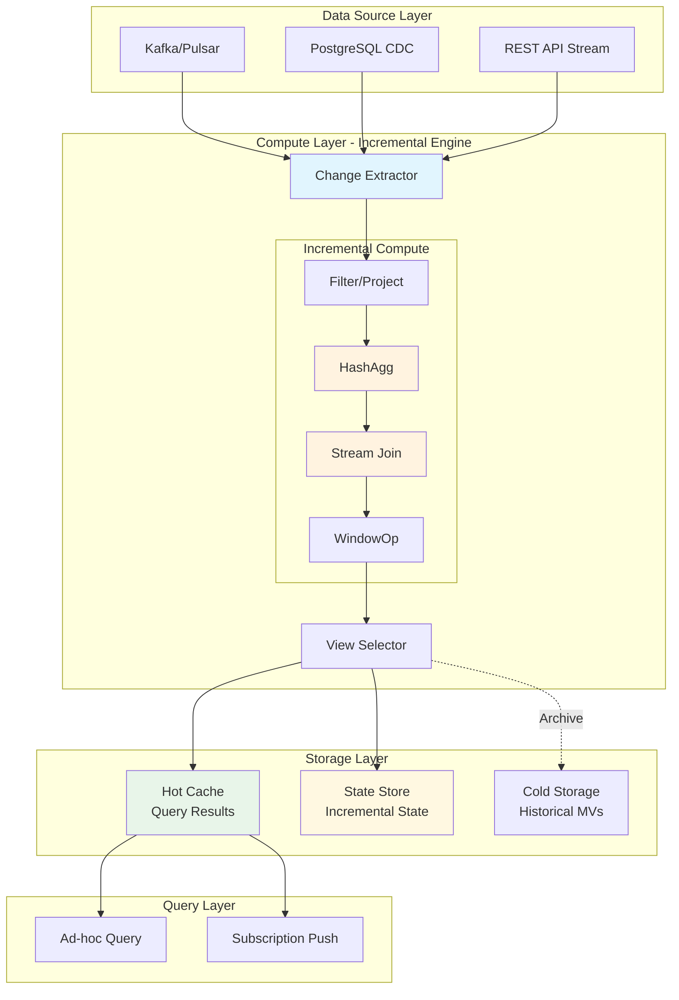
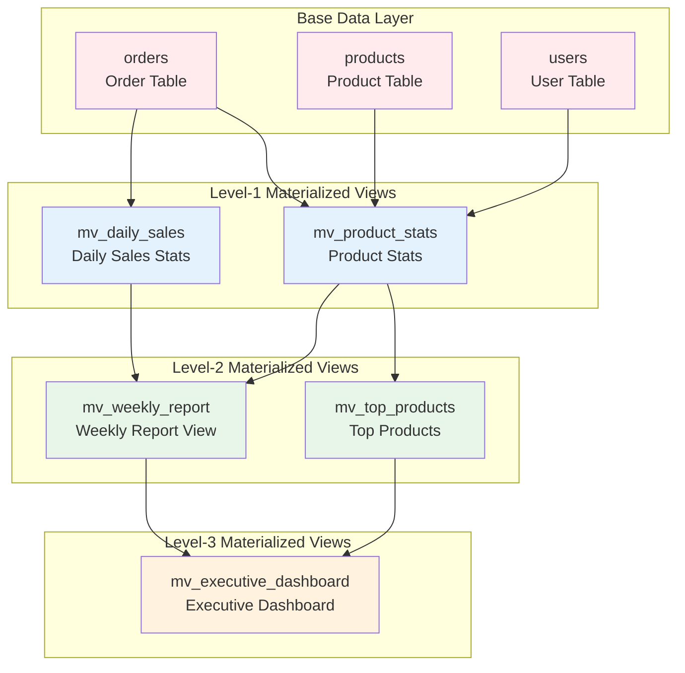
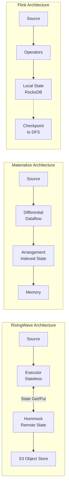
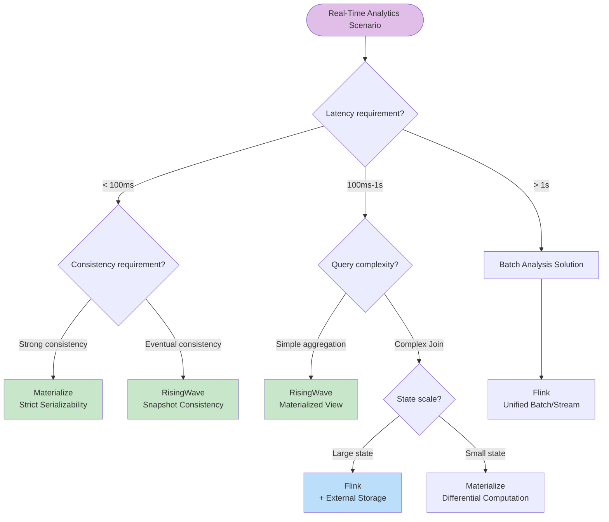
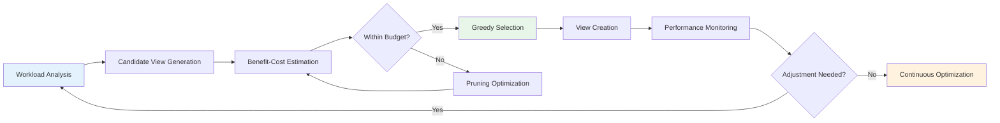
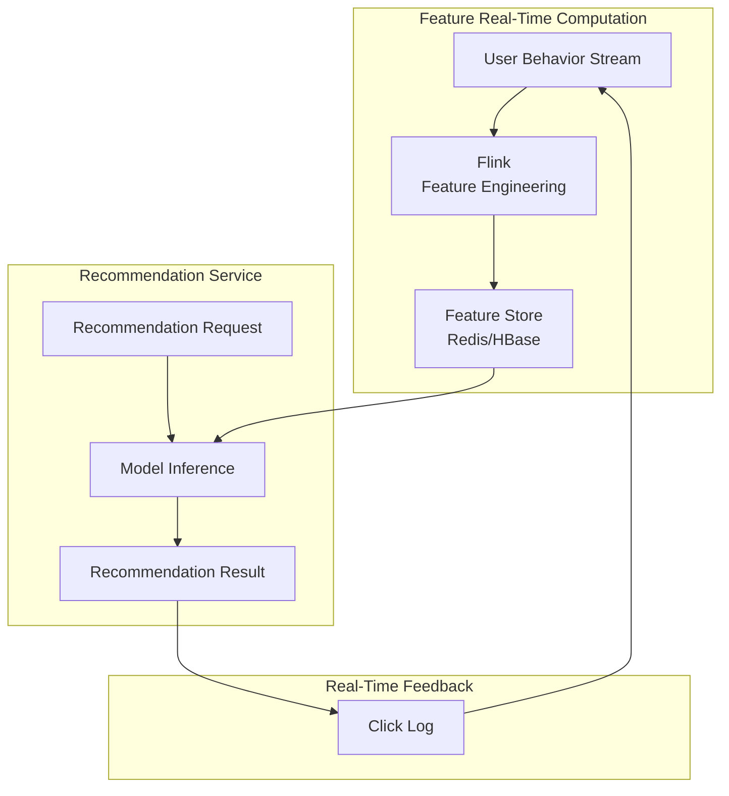

# Streaming Materialized View Architecture and Real-Time Analytics

> **Stage**: Knowledge | **Prerequisites**: [streaming-databases.md](./streaming-databases.md), [risingwave-deep-dive.md](./risingwave-deep-dive.md) | **Formality Level**: L4-L5

## 1. Definitions

### 1.1 Materialized View Foundation Definitions

**Def-K-06-170** (Materialized View). Given a base table set $\mathcal{B} = \{B_1, B_2, ..., B_n\}$ and a view definition query $Q$, the materialized view $V$ is defined as:

$$V = Q(\mathcal{B}) = \{ t \mid \exists b_1 \in B_1, ..., b_n \in B_n: t = Q(b_1, ..., b_n) \}$$

A materialized view is the **physical storage** of query results, unlike a virtual view which is a logical definition.

**Def-K-06-171** (Traditional Materialized View vs Streaming Materialized View). Formal comparison of the two types of materialized views:

| Dimension | Traditional Materialized View | Streaming Materialized View |
|-----------|------------------------------|----------------------------|
| **Data flow** | Batch update $V_{new} = Q(\mathcal{B}_{new})$ | Streaming incremental $V(t) = V(t-1) \oplus \Delta V(t)$ |
| **Consistency** | Transactional consistency (ACID) | Event-time consistency |
| **Latency** | Minutes-hours | Milliseconds-seconds |
| **Trigger mode** | Manual/scheduled refresh | Event-driven automatic update |
| **State storage** | Relational table storage | Distributed stream state storage |

**Def-K-06-172** (Incremental View Maintenance IVM). The incremental view maintenance mechanism $\mathcal{I}$ is defined as a mapping function:

$$\mathcal{I}: \Delta \mathcal{B} \times State(t-1) \rightarrow \Delta V \times State(t)$$

Where:

- $\Delta \mathcal{B}$: Base table change stream (insert/update/delete)
- $State(t)$: Internal computation state at time $t$
- $\Delta V$: View incremental update
- $\oplus$: View update operation (merge incremental into materialized result)

### 1.2 Streaming Materialized View Architecture Definition

**Def-K-06-173** (Compute-Storage Disaggregated Architecture). The streaming materialized view system architecture is defined as a quadruple:

$$\mathcal{SMV} = \langle \mathcal{C}, \mathcal{S}, \mathcal{M}, \mathcal{G} \rangle$$

Where each component is defined as follows:

| Component | Symbol | Function Description |
|-----------|--------|---------------------|
| Compute layer | $\mathcal{C}$ | Incremental compute engine, stateless or light-state |
| Storage layer | $\mathcal{S}$ | Materialized result persistence, supporting random queries |
| Metadata layer | $\mathcal{M}$ | View dependency graph, consistency coordination |
| Execution graph | $\mathcal{G}$ | Incremental computation dataflow graph $G = (V, E)$ |

### 1.3 Consistency Guarantee Definitions

**Def-K-06-174** (Cascading Materialized Views). Cascading materialized views form a directed acyclic graph $DAG = (\mathcal{V}, \mathcal{E})$:

- Nodes $\mathcal{V} = \{V_1, V_2, ..., V_m\}$ represent materialized views
- Edges $\mathcal{E} \subseteq \mathcal{V} \times \mathcal{V}$ represent view dependency relationships; $(V_i, V_j)$ means $V_j$ depends on $V_i$

For base table change $\Delta B$, cascading updates must satisfy topological order:

$$\forall (V_i, V_j) \in \mathcal{E}: Update(V_i) \prec Update(V_j)$$

**Def-K-06-175** (Streaming Consistency Model). Streaming materialized view consistency levels are defined as:

1. **Strong Consistency**:
   $$\forall q(t): Result(q) = Q(\mathcal{B}(t))$$
   Query results correspond to the real-time state at the query moment.

2. **Eventual Consistency**:
   $$\lim_{t \rightarrow \infty} V(t) = Q(\mathcal{B}(\infty))$$
   When no new changes occur, the view eventually converges to the correct state.

3. **Bounded Consistency**:
   $$\forall t: |V(t) - Q(\mathcal{B}(t))| \leq \epsilon \land Delay(V) \leq \delta$$
   The deviation between the view and the true state is bounded, and latency is bounded.

## 2. Properties

### 2.1 Incremental Computation Properties

**Lemma-K-06-115** (Incremental Computation Correctness). For any query $Q$ and base table change sequence $\langle \Delta B_1, \Delta B_2, ..., \Delta B_k \rangle$, the incremental maintenance mechanism $\mathcal{I}$ satisfies:

$$Q(B_0 \cup \bigcup_{i=1}^{k} \Delta B_i) = Q(B_0) \oplus \bigoplus_{i=1}^{k} \mathcal{I}(\Delta B_i, State_{i-1})$$

**Proof Sketch**: Proved by induction over the change sequence.

- Base case: $k=0$ trivially holds
- Inductive step: Assume holds for $k-1$, expand step $k$ using the definition of $\mathcal{I}$
- The algebraic properties of query $Q$ guarantee composability of incremental updates ∎

**Lemma-K-06-116** (Cascading Update Propagation). In a cascading materialized view $DAG$, for any node $V$, its update latency satisfies:

$$Delay(V) \leq \sum_{(U,V) \in InEdges(V)} Delay(U) + Proc(V)$$

Where $Proc(V)$ is the processing latency of view $V$ itself.

### 2.2 Resource Efficiency Properties

**Lemma-K-06-117** (Storage Space Optimization). The storage complexity of a materialized view system is:

$$Space(V) = O(|Q(\mathcal{B})| + |State_{incremental}|)$$

For query classes supporting incremental computation, the state space typically satisfies:

$$|State_{incremental}| \ll |Q(\mathcal{B})|$$

**Proof**: Taking aggregation queries as an example, only aggregation state needs to be maintained rather than the full dataset. ∎

## 3. Relations

### 3.1 Mapping to Classical Database Theory

| Traditional Database Concept | Streaming Materialized View Correspondent | Key Difference |
|-----------------------------|------------------------------------------|----------------|
| View Definition | Streaming SQL + materialization declaration | Supports windows, stream Join |
| Query Rewrite | View selection optimization | Considers incremental maintenance cost |
| View Maintenance | Incremental stream processing | From batch to streaming |
| Index Selection | State storage optimization | Tiered storage strategy |

### 3.2 Relationship with Stream Processing Models

Streaming materialized views can be mapped to Timely Dataflow:

```
Materialized view execution graph:
┌──────────┐     ┌──────────────┐     ┌──────────┐
│  Source  │────→│  Incremental │────→│ Material-│
│  (Stream)│     │  Operators   │     │ ized View│
└──────────┘     └──────────────┘     └──────────┘
                        ↑
                   ┌──────────┐
                   │  State   │
                   │  Store   │
                   └──────────┘
```

### 3.3 Mainstream Implementation Comparison

| Feature Dimension | RisingWave | Materialize | Flink Table | pg_ivm |
|------------------|------------|-------------|-------------|--------|
| **Core model** | Stream database | Differential Dataflow | Unified batch/stream | PostgreSQL extension |
| **Incremental engine** | Change propagation | Differential computation | Mini-Batch | Triggers |
| **Consistency** | Snapshot consistency | Strict serializability | Checkpoint | Transactional consistency |
| **Latency** | Sub-second | Millisecond | Second | Second |
| **SQL compatibility** | PostgreSQL | PostgreSQL | Flink SQL | PostgreSQL |
| **Deployment model** | Cloud-native | Cloud/On-prem | Cluster | Single-node |

## 4. Argumentation

### 4.1 Compute-Storage Disaggregation Engineering Design Argument

**Design decision**: Modern streaming materialized view systems commonly adopt compute-storage disaggregated architecture.

**Engineering tradeoff analysis**:

| Solution | Advantages | Disadvantages | Applicable Scenarios |
|----------|-----------|---------------|----------------------|
| **Tight coupling (Flink)** | Low-latency state access | Scaling requires state migration | Ultra-large state, latency-sensitive |
| **Disaggregated architecture** | Elastic scaling, independent scaling | Network overhead, cache management | Cloud environments, variable workloads |

**Formal argument**:

Let total state size be $S$, number of compute nodes be $n$, and checkpoint interval be $\Delta$:

**Tight coupling total cost**:
$$C_{tight} = n \cdot c_{compute}(S/n) + n \cdot c_{local}(S/n) + c_{migration}(n_{change})$$

**Disaggregated architecture total cost**:
$$C_{separate} = n \cdot c_{compute}(S_{hot}/n) + c_{remote}(S) + c_{network}(throughput)$$

When state access is highly skewed (hot data concentrated):

$$S_{hot} \ll S \Rightarrow C_{separate} < C_{tight}$$

### 4.2 Incremental Maintenance Strategy Selection Argument

**Strategy comparison matrix**:

| Strategy | Applicable Query Types | State Overhead | Latency | Implementation Complexity |
|----------|----------------------|----------------|---------|--------------------------|
| **Immediate maintenance** | Simple aggregation, filter | Low | Low | Low |
| **Deferred maintenance** | Complex Join, nested query | Medium | Medium | Medium |
| **Batch maintenance** | Full computation, window aggregation | High | High | Low |
| **Adaptive maintenance** | Mixed workloads | Variable | Adjustable | High |

## 5. Proof / Engineering Argument

### 5.1 View Selection Optimization Problem

**Thm-K-06-115** (View Selection NP-Completeness). Given a query workload $\mathcal{Q}$ and a materialized view candidate set $\mathcal{C}$, the view selection problem of maximizing query performance improvement under storage budget $S_{budget}$ is NP-complete.

**Proof**:

1. **Reduction**: From the 0-1 knapsack problem
   - View candidate $\leftrightarrow$ Item
   - Performance improvement $\leftrightarrow$ Value
   - Storage cost $\leftrightarrow$ Weight

2. **Verification**: Given a view set, constraints and objective function can be verified in polynomial time.

3. **Conclusion**: View selection $\in$ NP, and is NP-complete. ∎

**Heuristic algorithm**:

```
Greedy view selection algorithm:
1. Initialize: selected = ∅, remaining = C
2. While storage(selected) < S_budget:
   a. Compute benefit/cost ratio for each candidate view
   b. Select view v* with highest ratio
   c. If storage(selected ∪ {v*}) ≤ S_budget:
        selected = selected ∪ {v*}
   d. remaining = remaining \ {v*}
3. Return selected
```

### 5.2 Consistency Guarantee Engineering Implementation

**Thm-K-06-116** (Streaming Materialized View Consistency Bound). Streaming materialized view systems using Barrier checkpoint mechanisms provide bounded consistency:

$$\forall t, \forall V: |V(t) - Q(\mathcal{B}(t))| \leq \lambda \cdot \Delta_{checkpoint}$$

Where $\lambda$ is the maximum change rate and $\Delta_{checkpoint}$ is the checkpoint interval.

**Proof framework**:

1. **Barrier propagation invariant**: All changes before the Barrier are processed
2. **State snapshot atomicity**: Checkpoints capture a globally consistent state
3. **Query read boundary**: Queries read the most recent checkpoint state

### 5.3 Incremental Computation Complexity Analysis

**Thm-K-06-117** (Incremental Computation Complexity Lower Bound). For aggregation query classes, the lower bound of incremental maintenance time complexity is:

$$\Omega(|\Delta \mathcal{B}| \cdot \log |Groups|)$$

Where $|Groups|$ is the cardinality of the grouping key.

**Proof**: Considering the worst case of hash aggregation, an index structure for grouping keys must be maintained, and each update consumes at least logarithmic time. ∎

## 6. Examples

### 6.1 RisingWave Materialized View Example

```sql
-- Create Kafka data source
CREATE SOURCE user_events (
    user_id INT,
    event_type VARCHAR,
    amount DECIMAL,
    event_time TIMESTAMP
) WITH (
    connector = 'kafka',
    topic = 'user_events',
    properties.bootstrap.server = 'kafka:9092'
) FORMAT PLAIN ENCODE JSON;

-- Create real-time revenue statistics materialized view
CREATE MATERIALIZED VIEW revenue_stats AS
SELECT
    TUMBLE(event_time, INTERVAL '1' MINUTE) as window_start,
    event_type,
    COUNT(*) as event_count,
    SUM(amount) as total_amount,
    AVG(amount) as avg_amount
FROM user_events
GROUP BY TUMBLE(event_time, INTERVAL '1' MINUTE), event_type;
```

**Incremental computation process**:

```
Input change stream:
  +---------+------------+--------+-------------------+
  | user_id | event_type | amount | event_time        |
  +---------+------------+--------+-------------------+
  | 1001    | purchase   | 150.00 | 2024-01-01 10:00  |
  | 1002    | refund     | -20.00 | 2024-01-01 10:00  |
  | 1003    | purchase   |  75.00 | 2024-01-01 10:01  |
  +---------+------------+--------+-------------------+

Incremental update:
  HashAgg operator maintains state:
    Key=("10:00", "purchase"): count=0, sum=0
    Key=("10:00", "refund"):  count=0, sum=0

  Process 1001: Key=("10:00", "purchase") → count=1, sum=150
  Process 1002: Key=("10:00", "refund")  → count=1, sum=-20
  Process 1003: Key=("10:01", "purchase") → count=1, sum=75

Materialized view state:
  +-------------+------------+-------------+--------------+
  | window_start| event_type | event_count | total_amount |
  +-------------+------------+-------------+--------------+
  | 10:00       | purchase   | 1           | 150.00       |
  | 10:00       | refund     | 1           | -20.00       |
  | 10:01       | purchase   | 1           | 75.00        |
  +-------------+------------+-------------+--------------+
```

### 6.2 Materialize Differential Dataflow Example

```sql
-- Create source table
CREATE SOURCE transactions
FROM KAFKA BROKER 'kafka:9092' TOPIC 'transactions'
FORMAT JSON;

-- Create derived view (multi-stream Join)
CREATE MATERIALIZED VIEW user_transaction_summary AS
SELECT
    u.user_id,
    u.user_name,
    COUNT(t.transaction_id) as txn_count,
    SUM(t.amount) as total_volume
FROM users u
LEFT JOIN transactions t ON u.user_id = t.user_id
GROUP BY u.user_id, u.user_name;
```

**Differential Dataflow characteristics**:

- Differential computation tracks changes for each data version
- Supports recursive queries and complex iterative computation
- Strict serializability consistency guarantee

### 6.3 Flink SQL Materialized Table Example

```sql
-- Define source table
CREATE TABLE orders (
    order_id STRING,
    user_id STRING,
    amount DECIMAL(10,2),
    order_time TIMESTAMP(3),
    WATERMARK FOR order_time AS order_time - INTERVAL '5' SECOND
) WITH (
    'connector' = 'kafka',
    'topic' = 'orders',
    'properties.bootstrap.servers' = 'kafka:9092',
    'format' = 'json'
);

-- Create materialized table (Flink 1.18+)
CREATE TABLE mv_order_stats (
    window_start TIMESTAMP(3),
    window_end TIMESTAMP(3),
    order_count BIGINT,
    total_amount DECIMAL(10,2),
    PRIMARY KEY (window_start, window_end) NOT ENFORCED
) WITH (
    'connector' = 'jdbc',
    'url' = 'jdbc:postgresql://postgres:5432/analytics',
    'table-name' = 'order_stats'
);

-- Incremental insert into materialized table
INSERT INTO mv_order_stats
SELECT
    TUMBLE_START(order_time, INTERVAL '1' HOUR) as window_start,
    TUMBLE_END(order_time, INTERVAL '1' HOUR) as window_end,
    COUNT(*) as order_count,
    SUM(amount) as total_amount
FROM orders
GROUP BY TUMBLE(order_time, INTERVAL '1' HOUR);
```

### 6.4 PostgreSQL pg_ivm Example

```sql
-- Enable pg_ivm extension
CREATE EXTENSION IF NOT EXISTS pg_ivm;

-- Create base table
CREATE TABLE sales (
    sale_id SERIAL PRIMARY KEY,
    product_id INT,
    quantity INT,
    sale_date DATE,
    amount DECIMAL(10,2)
);

-- Create incremental materialized view
CREATE INCREMENTAL MATERIALIZED VIEW daily_sales_summary AS
SELECT
    sale_date,
    product_id,
    SUM(quantity) as total_quantity,
    SUM(amount) as total_amount,
    COUNT(*) as transaction_count
FROM sales
GROUP BY sale_date, product_id;

-- Automatic incremental update
-- When sales table has INSERT/UPDATE/DELETE, materialized view is automatically maintained incrementally
```

## 7. Visualizations

### 7.1 Streaming Materialized View Architecture Panorama



### 7.2 Cascading Materialized View Dependency Graph



### 7.3 Mainstream Implementation Architecture Comparison



### 7.4 Real-Time Analytics Scenario Decision Tree



### 7.5 View Selection Optimization Flow



## 8. Real-Time Analytics Scenario Practice

### 8.1 Real-Time Dashboard Architecture

**Scenario characteristics**: High-frequency queries, low latency, near real-time data

**Recommended architecture**:


**Best practices**:

- Pre-aggregation reduces query-time computation
- Tiered materialized views (minute-level → hour-level → day-level)
- Result caching + incremental updates

### 8.2 Real-Time Recommendation System

**Scenario characteristics**: Real-time user behavior feedback, rapid feature updates

**Architecture pattern**:



### 8.3 Real-Time Risk Control System

**Scenario characteristics**: Ultra-low latency, high accuracy, complex rules

**Architecture selection**:

| Component | Technology Selection | Rationale |
|-----------|---------------------|-----------|
| Rule engine | Flink CEP | Complex event pattern matching |
| Feature computation | Materialize | Strict consistency guarantee |
| Decision service | Custom service | Sub-millisecond latency |

## 9. Best Practices

### 9.1 Materialized View Design Principles

**Principle 1: Layered Design**

```
L0: Raw Data Layer (Source)
L1: Cleansing/Standardization Layer (Clean)
L2: Topic Aggregation Layer (Topic MV)
L3: Application Service Layer (App MV)
```

**Principle 2: Incremental-Friendly Queries**

| Recommended Pattern | Avoid Pattern |
|--------------------|---------------|
| `SELECT ... GROUP BY key` | `SELECT DISTINCT *` (full deduplication) |
| `SELECT ... WHERE time > NOW() - INTERVAL` | `SELECT ... ORDER BY time DESC LIMIT N` (unbounded TopN) |
| `Stream JOIN Stream WITHIN WINDOW` | `Stream JOIN Stream` (unbounded Join) |
| Incremental aggregate functions (SUM/COUNT/AVG) | Non-incremental functions (MEDIAN/PERCENTILE) |

**Principle 3: Resource Isolation**

```sql
-- Assign resource pools for views with different SLAs
CREATE MATERIALIZED VIEW critical_mv
WITH (resource_pool = 'high_priority')
AS SELECT ...;

CREATE MATERIALIZED VIEW batch_mv
WITH (resource_pool = 'low_priority')
AS SELECT ...;
```

### 9.2 Cost Optimization Strategies

**Storage cost optimization**:

| Strategy | Implementation | Expected Savings |
|----------|---------------|------------------|
| TTL automatic cleanup | `WITH (retention = '7d')` | 70%+ |
| Tiered storage | Hot/warm/cold data tiering | 50%+ |
| Result compression | Columnar storage + compression | 30%+ |

**Compute cost optimization**:

```
1. View reuse: Reuse upstream materialized views, avoid redundant computation
2. Lazy materialization: Non-critical views use deferred updates
3. Incremental pruning: Only maintain necessary historical partitions
```

### 9.3 Monitoring and Tuning

**Key metrics**:

| Metric | Alert Threshold | Optimization Direction |
|--------|----------------|------------------------|
| MV latency | > 5 seconds | Scale out / query optimization |
| State size | > 80% memory | Adjust TTL / partitioning |
| Query P99 | > 100ms | Index optimization |
| Failure rate | > 0.1% | Checkpoint tuning |

## 10. References


---

*Document version: 1.0 | Created: 2026-04-03 | Maintainer: AnalysisDataFlow Project*
