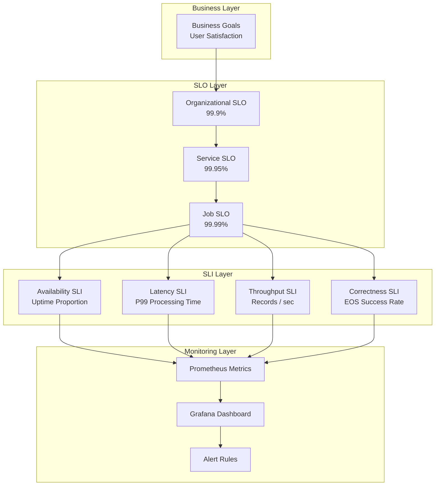
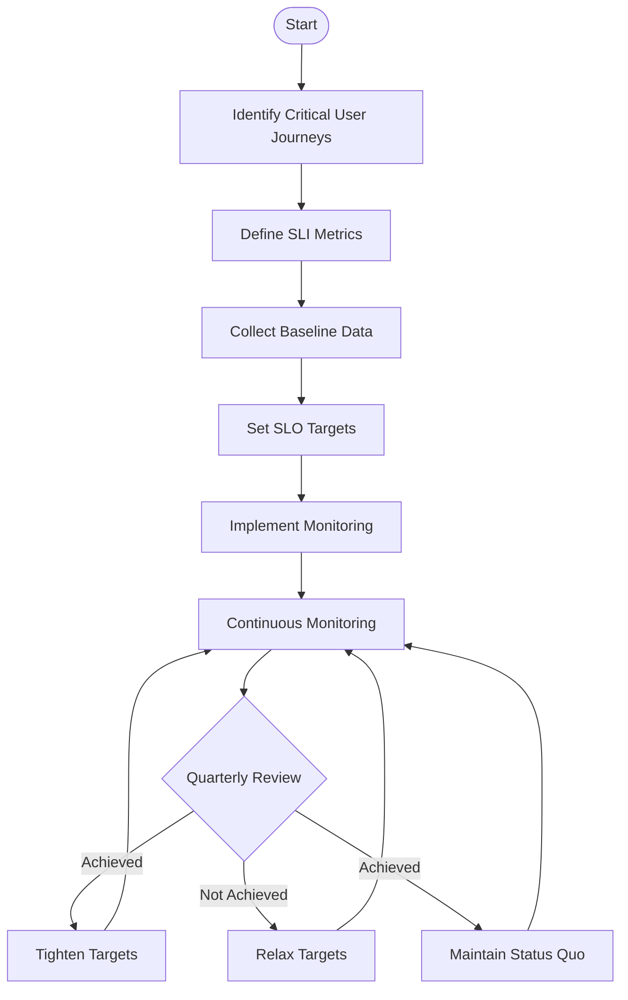
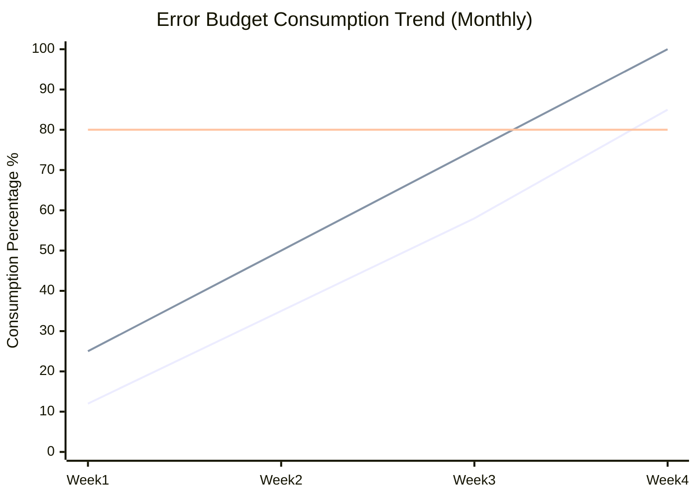

# Streaming SLO/SLI Definition and Reliability Engineering

> **Stage**: Knowledge | **Prerequisites**: [05-ecosystem/streaming-quality-assurance.md](../07-best-practices/07.01-flink-production-checklist.md) | **Formalization Level**: L3

---

## Table of Contents

- [Streaming SLO/SLI Definition and Reliability Engineering](#streaming-slosli-definition-and-reliability-engineering)
  - [Table of Contents](#table-of-contents)
  - [1. Definitions](#1-definitions)
    - [Def-K-06-19: Service Level Indicator (SLI)](#def-k-06-19-service-level-indicator-sli)
    - [Def-K-06-20: Service Level Objective (SLO)](#def-k-06-20-service-level-objective-slo)
    - [Def-K-06-21: Error Budget](#def-k-06-21-error-budget)
    - [Def-K-06-22: Availability Calculation](#def-k-06-22-availability-calculation)
  - [2. Properties](#2-properties)
    - [Prop-K-06-01: SLI Selection Criteria](#prop-k-06-01-sli-selection-criteria)
    - [Prop-K-06-02: SLO Layered Structure](#prop-k-06-02-slo-layered-structure)
    - [Lemma-K-06-01: Error Budget Exhaustion Theorem](#lemma-k-06-01-error-budget-exhaustion-theorem)
  - [3. Relations](#3-relations)
    - [3.1 Mapping SLO to Engineering Practice](#31-mapping-slo-to-engineering-practice)
    - [3.2 Association with the Dataflow Model](#32-association-with-the-dataflow-model)
    - [3.3 Mapping to Flink Mechanisms](#33-mapping-to-flink-mechanisms)
  - [4. Argumentation](#4-argumentation)
    - [4.1 Why Does Stream Processing Need Special SLOs?](#41-why-does-stream-processing-need-special-slos)
    - [4.2 Common Pitfalls in SLO Setting](#42-common-pitfalls-in-slo-setting)
  - [5. Engineering Argument](#5-engineering-argument)
    - [5.1 Stream-Processing-Specific SLO System](#51-stream-processing-specific-slo-system)
    - [5.2 SLO Formulation Process](#52-slo-formulation-process)
    - [5.3 Error Budget Policy](#53-error-budget-policy)
  - [6. Examples](#6-examples)
    - [6.1 E-Commerce Real-Time Recommendation System SLO](#61-e-commerce-real-time-recommendation-system-slo)
    - [6.2 Financial Risk Control System SLO](#62-financial-risk-control-system-slo)
  - [7. Visualizations](#7-visualizations)
    - [7.1 SLO/SLI System Hierarchy](#71-slosli-system-hierarchy)
    - [7.2 SLO Formulation Flowchart](#72-slo-formulation-flowchart)
    - [7.3 Error Budget Consumption Tracking](#73-error-budget-consumption-tracking)
  - [8. References](#8-references)

## 1. Definitions

### Def-K-06-19: Service Level Indicator (SLI)

**Formal Definition**: Let the service system be $S$ and the observation window be $T$; then an SLI is the mapping:

$$\text{SLI}_S: T \times \Omega \to \mathbb{R}^+$$

Where $\Omega$ is the observation sample space and the output is a quantitative measure of service quality.

**SLI in the Stream-Processing Context**:

- **Availability SLI**: $A = \frac{\text{Service Uptime}}{\text{Total Observation Time}}$
- **Latency SLI**: $L_p = p\text{-th percentile processing latency}$
- **Throughput SLI**: $T = \frac{\text{Actual Records Processed / sec}}{\text{Target Throughput}}$
- **Freshness SLI**: $F = t_{\text{now}} - t_{\text{last\_event}}$

**Intuitive Explanation**: An SLI is the "thermometer" of service quality—it answers the question "How is the service performing?" A good SLI should be measurable, actionable, representative, and comprehensible.

---

### Def-K-06-20: Service Level Objective (SLO)

**Formal Definition**: An SLO is a pair $(\text{SLI}, \theta)$, where:

$$\text{SLO} = \{ (s, c) \mid s \in \text{SLI}, c \in C, P(s \text{ satisfies } c) \geq 1 - \epsilon \}$$

- $C$ is the set of target conditions (e.g., $\geq 99.9\%$, $< 1$s)
- $\epsilon$ is the allowed violation probability threshold
- $1 - \epsilon$ is called the **confidence level**

**SLO Compliance Determination**:
Within observation period $T$, if the proportion of samples satisfying the condition is $r$, then:

$$\text{Compliance}(\text{SLO}) = \mathbb{1}_{[r \geq \theta]} \in \{0, 1\}$$

**Intuitive Explanation**: An SLO is the "passing grade" of service quality—it binds the SLI to business expectations and defines "what counts as good."

---

### Def-K-06-21: Error Budget

**Formal Definition**: Given an SLO target $\theta$ and a time window $T$, the error budget $E$ is defined as:

$$E = (1 - \theta) \times |T|$$

Where $|T|$ is the total number of requests / events in the window.

**Budget Consumption Rate**:
Let $e(t)$ be the budget consumed up to the current time $t$; then:

$$\text{Consumption Rate} = \frac{e(t)}{E \times \frac{t}{|T|}}$$

| Consumption Rate Range | Status | Recommended Action |
|------------------------|--------|--------------------|
| $< 50\%$ | Healthy | Normal iteration |
| $50\% - 80\%$ | Caution | Assess risk |
| $80\% - 100\%$ | Danger | Freeze new feature releases |
| $> 100\%$ | Breach | Launch reliability攻坚 |

**Intuitive Explanation**: The error budget is the "monetized" expression of an SLO—it converts abstract percentages into actionable time / count units, balancing reliability and innovation velocity.

---

### Def-K-06-22: Availability Calculation

**Formal Definition**: Availability $A$ is the proportion of time the system is in a serviceable state:

$$A = \frac{MTBF}{MTBF + MTTR}$$

Where:

- $MTBF$ (Mean Time Between Failures): Average time between failures
- $MTTR$ (Mean Time To Recovery): Average recovery time

**Nines Mapping**:

| Availability Target | Annual Allowed Downtime | Monthly Allowed Downtime | Applicable Scenario |
|---------------------|-------------------------|--------------------------|---------------------|
| 99% (2 nines) | 3.65 days | 7.3 hours | Internal tools |
| 99.9% (3 nines) | 8.76 hours | 43.8 minutes | Standard business |
| 99.99% (4 nines) | 52.6 minutes | 4.4 minutes | Critical business |
| 99.999% (5 nines) | 5.26 minutes | 26.3 seconds | Financial core |

**Stream-Processing Availability Extension**:
For long-running (Always-On) streaming jobs, availability calculation must consider:

$$A_{\text{streaming}} = \frac{\sum_{i} (t_{i}^{\text{end}} - t_{i}^{\text{start}})}{T_{\text{total}}}$$

Where $\{(t_{i}^{\text{start}}, t_{i}^{\text{end}})\}$ is the set of all normal-operation intervals.

---

## 2. Properties

### Prop-K-06-01: SLI Selection Criteria

**Proposition**: An effective stream-processing SLI should satisfy the following properties:

1. **End-to-End Observability**: The SLI should cover the complete path actually perceived by the user
   $$\text{SLI}_{\text{e2e}} = f(\text{SLI}_{\text{ingest}}, \text{SLI}_{\text{process}}, \text{SLI}_{\text{sink}})$$

2. **Causal Explainability**: If an SLO is violated, it should be possible to pinpoint the specific component
   $$\text{Violation}(\text{SLO}) \implies \exists c \in \text{Components}: \text{RootCause}(c)$$

3. **Statistical Stability**: The SLI should converge within a reasonable time window
   $$\text{Var}(\text{SLI}_T) < \delta, \quad \forall T \geq T_{\min}$$

---

### Prop-K-06-02: SLO Layered Structure

**Proposition**: Stream-system SLOs have a natural hierarchy:

$$
\text{SLO}_{\text{org}} \supseteq \text{SLO}_{\text{service}} \supseteq \text{SLO}_{\text{pipeline}} \supseteq \text{SLO}_{\text{operator}}
$$

And they satisfy the error-allocation constraint:

$$1 - \theta_{\text{org}} \geq \sum_{i} (1 - \theta_{i})$$

**Engineering Significance**: The organizational-level SLO must be looser than lower-level SLOs, reserving error margin for each layer.

---

### Lemma-K-06-01: Error Budget Exhaustion Theorem

**Lemma**: If the error budget is exhausted within time window $\tau < T$, then:

$$P(\text{SLO}_{\text{next}} \text{ satisfied}) \leq \frac{T - \tau}{T} \times \theta$$

**Proof Sketch**:
The remaining allowable error share is 0; any subsequent failure will lead to an SLO breach. The only remaining strategy is to ensure 100% success going forward, which has extremely low probability in complex stream systems.

---

## 3. Relations

### 3.1 Mapping SLO to Engineering Practice

```
┌─────────────────────────────────────────────────────────────┐
│                    Reliability Engineering System             │
├─────────────────────────────────────────────────────────────┤
│  SLO (Goal)  ←──────→  SLI (Metric)  ←──────→  SLI Collection│
│     ↑                                            ↓          │
│  Error Budget  ←────→  Release Strategy  ←──→  Alerting    │
│     ↑                                            ↓          │
│  Reliability Drive  ←──→  Post-Mortem  ←────→  Observability│
│                                                              │
└─────────────────────────────────────────────────────────────┘
```

### 3.2 Association with the Dataflow Model

| Dataflow Concept | SLO/SLI Counterpart |
|------------------|---------------------|
| Watermark Delay | Freshness SLI |
| Processing-Time Latency | Latency SLI |
| Exactly-Once Guarantee | Correctness SLO |
| Window Trigger Timeliness | Availability / Latency SLO |

### 3.3 Mapping to Flink Mechanisms

| Flink Mechanism | Related SLO | Monitoring Entry Point |
|-----------------|-------------|------------------------|
| Checkpoint | Recovery-Time SLO | checkpointDuration, failedCheckpoints |
| Watermark | Freshness SLO | currentOutputWatermark |
| Backpressure | Latency / Throughput SLO | backPressuredTimeMsPerSecond |
| Savepoint | Release-Window SLO | Coordinate Checkpoint trigger |

---

## 4. Argumentation

### 4.1 Why Does Stream Processing Need Special SLOs?

**Traditional Batch Processing vs Stream Processing**:

| Dimension | Batch Processing | Stream Processing |
|-----------|------------------|-------------------|
| Time Model | Discrete batches | Continuous time |
| Failure Impact | Single job | Continuous accumulation |
| Recovery Requirement | Hours acceptable | Seconds / minutes expected |
| Measurement Frequency | At batch completion | Continuous sampling |

**Core Difference**: Stream job failures have a **continuous accumulation effect**—every minute of downtime may mean millions of events lost or delayed, whereas in batch processing only a single batch is affected.

### 4.2 Common Pitfalls in SLO Setting

1. **Over-optimizing availability while neglecting latency**
   - Counterexample: The system shows 99.99% availability, but P99 latency reaches 30 seconds
   - Consequence: Poor actual user experience, business logic timeouts

2. **SLI metrics disconnected from user experience**
   - Counterexample: Monitoring Kafka Consumer Lag instead of end-to-end latency
   - Consequence: Lag is normal but Sink is blocked, so users still perceive latency

3. **Overly aggressive SLOs leading to runaway costs**
   - Counterexample: Pursuing 5 nines availability when the failure rate is only 0.001%
   - Consequence: Redundancy costs may exceed business benefits

---

## 5. Engineering Argument

### 5.1 Stream-Processing-Specific SLO System

Based on industry practice, stream-processing systems should define the following SLO categories:

| Category | SLI Definition | Typical SLO | Measurement Method |
|----------|----------------|-------------|--------------------|
| **Availability** | Job uptime proportion | 99.9% | (Uptime / Total Time) × 100% |
| **Latency** | P99 processing latency | < 1 s | P99 of `now() - event_timestamp` |
| **Correctness** | Exactly-Once success rate | 99.99% | Successful EOS transactions / Total transactions |
| **Freshness** | Data arrival delay | < 5 s | `now() - max(event_time in window)` |
| **Throughput** | Actual / target throughput ratio | > 80% | Actual RPS / Target RPS |
| **Recoverability** | Fault-recovery time | < 3 min | Failure detection → full recovery |

**SLO Priority Recommendation**:

```
P0 (Critical): Availability > Correctness > Recoverability
P1 (Important): Latency > Freshness
P2 (Optimize): Throughput
```

### 5.2 SLO Formulation Process

**Step 1: Identify Critical User Journeys (CUJ)**

```
Example CUJ: Real-time risk control decision
├── Data Ingestion (Kafka → Flink)
├── Rule Computation (CEP window processing)
├── Decision Output (Flink → Redis)
└── Result Query (API service)
```

**Step 2: Define SLIs**

For each CUJ step, define a quantifiable SLI:

- Data ingestion latency: `kafka_consumer_lag × avg_event_size / throughput`
- Processing latency: `output_watermark - input_watermark`
- End-to-end latency: `api_response_time - event_timestamp`

**Step 3: Set SLO Targets**

Adopt a **gradual tightening** strategy:

1. Initial target = Current baseline × 0.9
2. Evaluate actual achievement after 4 weeks
3. If consistently achieved, tighten the target; if frequently breached, relax the target

**Step 4: Implement Monitoring**

```java
// [伪代码片段 - 不可直接运行] 仅展示核心逻辑
// Prometheus metric example
Counter slo_violations_total = Counter.build()
    .name("streaming_slo_violations_total")
    .labelNames("slo_type", "pipeline_name")
    .help("Total SLO violations")
    .register();

Histogram event_latency = Histogram.build()
    .name("event_processing_latency_seconds")
    .buckets(0.01, 0.1, 0.5, 1, 5, 10)
    .help("End-to-end event processing latency")
    .register();
```

**Step 5: Continuous Improvement**

- Weekly SLO review meetings
- Monthly error-budget consumption analysis
- Quarterly SLO target adjustment

### 5.3 Error Budget Policy

**Budget Allocation Model**:

```
Total Error Budget (100%)
├── Planned Maintenance: 20%
├── Known Risks: 30%
├── New Feature Releases: 30%
└── Unknown Failure Buffer: 20%
```

**Budget Consumption Alerts**:

| Alert Level | Trigger Condition | Response Action |
|-------------|-------------------|-----------------|
| INFO | Consumption > 50% | Notify team to pay attention |
| WARNING | Consumption > 80% | Freeze non-urgent releases |
| CRITICAL | Consumption > 95% | Launch reliability drive, block releases |
| PAGE | Consumption > 100% | Full team on call, immediate damage control |

**Release Strategy Association**:

```
Error Budget Status → Release Strategy
─────────────────────────────────
Green (< 50%)  → Standard release process
Yellow (50-80%) → Add manual approval
Red (> 80%)  → Emergency fixes only
Exhausted (> 100%) → Freeze all changes
```

---

## 6. Examples

### 6.1 E-Commerce Real-Time Recommendation System SLO

**Business Scenario**: Product recommendation stream processing based on real-time user behavior

| CUJ | SLI | SLO | Monitoring Implementation |
|-----|-----|-----|---------------------------|
| Click event processing | P99 latency | < 500 ms | Flink metrics reporter |
| Recommendation result generation | Throughput | > 10K TPS | Kafka consumer metrics |
| Feature update | Freshness | < 10 s | Watermark lag monitor |
| System availability | Job uptime | 99.95% | JobManager REST API |

**Error Budget Calculation**:

- Annual allowed downtime = (1 - 0.9995) × 365 × 24 = 4.38 hours
- Monthly budget = 4.38 / 12 = 21.9 minutes

### 6.2 Financial Risk Control System SLO

**Business Scenario**: Real-time transaction anti-fraud detection

| Level | SLO | Note |
|-------|-----|------|
| Organizational | 99.99% | Regulatory requirement |
| Service | 99.995% | Multi-AZ deployment |
| Job | 99.999% | Critical-path job |

**SLI Calculation Example**:

```text
# Latency SLI calculation
def calculate_latency_sli(events: List[Event], slo_threshold_ms: int) -> float:
    """Calculate the proportion of events meeting the latency SLO"""
    compliant = sum(1 for e in events
                   if e.processed_at - e.event_time <= slo_threshold_ms)
    return compliant / len(events)

# Availability SLI calculation
def calculate_availability_sli(
    job_uptime_ms: int,
    total_time_ms: int
) -> float:
    """Calculate job availability"""
    return job_uptime_ms / total_time_ms
```

---

## 7. Visualizations

### 7.1 SLO/SLI System Hierarchy



### 7.2 SLO Formulation Flowchart



### 7.3 Error Budget Consumption Tracking



---

## 8. References
