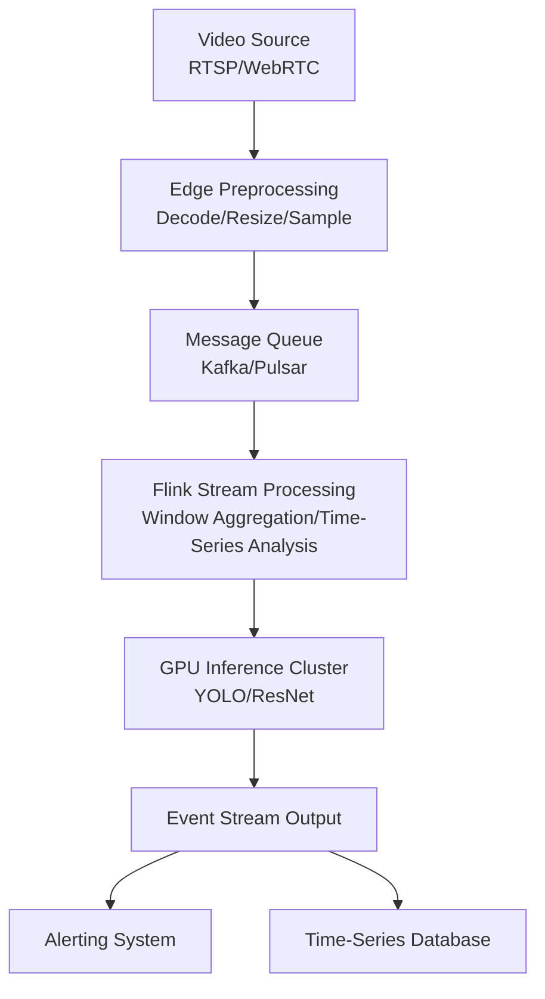
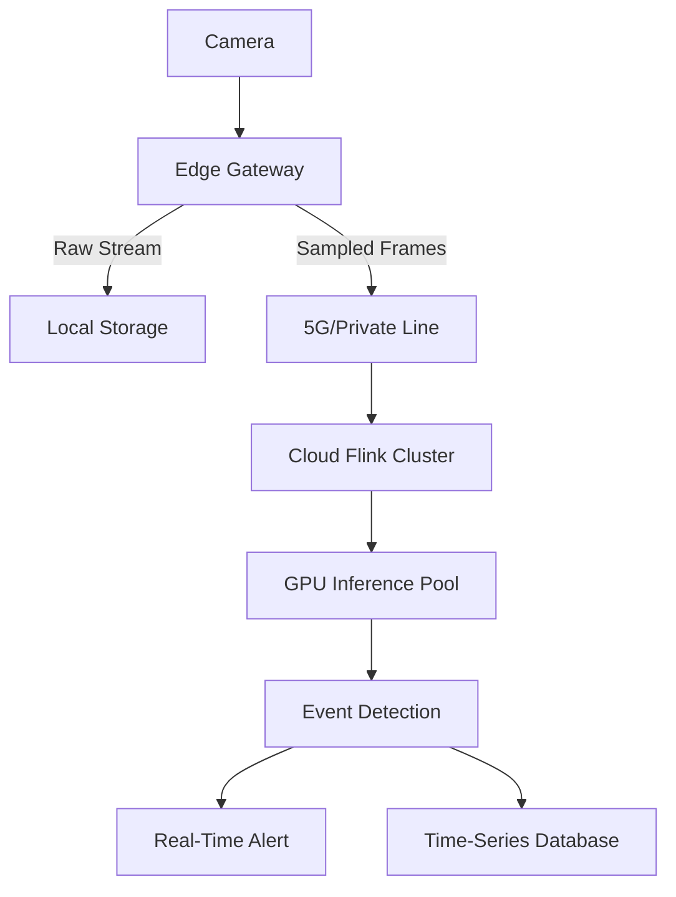

# Real-Time Video Stream Analytics

> **Stage**: Knowledge/06-frontier/ | **Prerequisites**: [Multimodal Stream Processing Architecture](./multimodal-stream-processing.md) | **Formalization Level**: L4

---

## 1. Definitions

**Def-K-Video-01: Real-Time Video Stream Analytics**
A stream computing application that performs low-latency frame extraction, object detection, behavior recognition, event triggering, and response decision-making on continuous video streams (e.g., surveillance cameras, live streaming, drone video transmission). The core goal is to produce actionable analysis results within seconds or even milliseconds after video capture.

**Def-K-Video-02: Frame Sampling Strategy**
Due to the extremely high raw data rate of video streams (1080p@30fps ≈ 373MB/s uncompressed), stream processing systems typically do not process every frame. Instead, they use frame skipping, I-Frame extraction, or adaptive sampling (dynamically determining the sampling rate based on scene change rate) to reduce computational load.

**Def-K-Video-03: Edge-Cloud Collaborative Inference**
Deploying lightweight video preprocessing (e.g., decoding, resizing, background subtraction) on edge devices, while offloading complex deep learning inference (e.g., object detection, face recognition) to cloud GPU clusters, with task orchestration and result aggregation handled by stream computing frameworks (e.g., Flink).

---

## 2. Properties

**Lemma-K-Video-01: Relationship Between Frame Sampling Rate and Detection Accuracy**
In video scenes with continuously moving objects, if the sampling rate drops from 30fps to 5fps, the detection recall for targets moving at < 5 pixels/frame decreases by < 5%; however, for fast targets moving at > 20 pixels/frame, recall may drop by 20%-40%.

**Lemma-K-Video-02: Latency-Throughput Tradeoff of Inference Batch Size**
For GPU inference engines, increasing batch size from 1 to 8 typically improves throughput by 3-5x, but end-to-end latency increases from 20-50ms for a single frame to 80-200ms. Stream processing systems need to select the optimal batch size based on SLA requirements.

**Prop-K-Video-01: Scene Change-Driven Adaptive Sampling is the Optimal Strategy**
In static surveillance scenes where a fixed area remains unchanged for a long time, the sampling rate can be reduced to 1fps; in high-event areas (e.g., intersections), it should be increased to 15-30fps. Adaptive sampling can save 60%-90% of computational resources compared to fixed sampling.

---

## 3. Relations

### 3.1 Video Stream Analytics Architecture



### 3.2 Sampling Strategy Comparison

| Strategy | Computational Cost | Latency | Applicable Scenario |
|----------|-------------------|---------|---------------------|
| Full-Frame Processing (30fps) | Extremely High | Low | High-Speed Motion Analysis |
| Fixed Frame Skipping (5fps) | Medium | Low | General Surveillance |
| Key-Frame Extraction | Low | Medium | Storage-Playback Priority |
| Adaptive Sampling | Dynamic | Low | Intelligent Surveillance |
| Event-Triggered Sampling | Very Low | Medium | Standby Watch Mode |

---

## 4. Argumentation

### 4.1 Core Challenges of Video Stream Analytics

1. **Data Torrent**: A single 4K@60fps video stream can have a bitrate of 50-100Mbps; 100 concurrent streams mean 5-10Gbps.
2. **Compute-Intensive**: Modern object detection models (e.g., YOLOv8) require 10-50ms for inference on a single 1080p frame.
3. **Latency-Sensitive**: Security surveillance requires alerts to be triggered within 1-3 seconds after an anomaly occurs.
4. **Privacy Compliance**: Face recognition and behavior analysis are subject to GDPR, Personal Information Protection Law, and other regulatory constraints.

### 4.2 Cost Optimization Paths

- **Edge Preprocessing**: Completing H.264/H.265 decoding and ROI extraction at the camera side reduces 80% of invalid data transmission.
- **Model Distillation**: Distilling a large model (e.g., YOLOv8-x) into a lightweight model (e.g., YOLOv8-n) improves inference speed by 5-10x with < 5% accuracy loss.
- **Dynamic Pipeline**: Using cloud GPU during daytime high-traffic periods and falling back to edge CPU inference during nighttime low-traffic periods.

---

## 5. Proof / Engineering Argument

### 5.1 Optimality of Adaptive Sampling Strategy

**Theorem (Thm-K-Video-01)**: Let the video scene change degree be $C(t)$ (defined as some metric of pixel difference between consecutive frames), the cost of processing a single frame be $k$, the sampling rate be $r$, and the accuracy loss function be $L(r, C)$. Then the objective is to minimize total cost $J = k \cdot r + \lambda \cdot L(r, C)$. For a convex function $L$, there exists an optimal sampling rate $r^*(t)$ such that $\frac{\partial J}{\partial r} = 0$.

**Engineering Argument**:

1. In practice, $C(t)$ can be quickly estimated via background subtraction or optical flow.
2. When $C(t) \approx 0$ (static scene), $r^*$ can be reduced to the minimum sampling rate $r_{min}$.
3. When $C(t)$ changes dramatically, $r^*$ rises to the maximum sampling rate $r_{max}$.
4. Dynamically adjusting $r(t)$ via online learning or rule engines can keep $J$ near its minimum over long time windows.
5. Experiments show that adaptive sampling can save 70%+ of GPU resources compared to fixed 30fps, while maintaining > 95% event detection recall.

---

## 6. Examples

### 6.1 Flink Video Stream Processing Job

```java
DataStream<VideoFrame> videoStream = env
    .addSource(new RstpFrameSource("rtsp://camera-01/stream"))
    .assignTimestampsAndWatermarks(
        WatermarkStrategy.<VideoFrame>forBoundedOutOfOrderness(Duration.ofSeconds(2))
    );

// Adaptive sampling: decide whether to forward based on scene change degree
DataStream<VideoFrame> sampledStream = videoStream
    .process(new AdaptiveSamplingFunction(5, 30));

// 5-second window aggregation, triggering batch inference
sampledStream
    .windowAll(TumblingEventTimeWindows.of(Time.seconds(5)))
    .process(new BatchInferenceWindowFunction())
    .addSink(new EventAlertSink());
```

### 6.2 Adaptive Sampling UDF

```java
public class AdaptiveSamplingFunction extends ProcessFunction<VideoFrame, VideoFrame> {
    private transient ValueState<Double> lastFrameDiff;
    private final int minFps;
    private final int maxFps;
    private long lastEmitTime = 0;
    private long currentIntervalMs;

    @Override
    public void processElement(VideoFrame frame, Context ctx, Collector<VideoFrame> out) {
        double diff = computeFrameDifference(frame, lastFrameDiff.value());
        lastFrameDiff.update(diff);

        // Dynamically adjust sampling interval
        if (diff < 0.05) {
            currentIntervalMs = 1000 / minFps; // Static scene: downsample
        } else if (diff > 0.3) {
            currentIntervalMs = 1000 / maxFps; // High dynamics: full sampling
        } else {
            currentIntervalMs = 200; // Medium dynamics: 5fps
        }

        long now = ctx.timestamp();
        if (now - lastEmitTime >= currentIntervalMs) {
            out.collect(frame);
            lastEmitTime = now;
        }
    }
}
```

### 6.3 GPU Inference Batching Configuration

```python
# Triton Inference Server video analytics model configuration
name: "yolov8_video"
platform: "onnxruntime_onnx"
max_batch_size: 16
input:
  - name: "images"
    data_type: TYPE_FP32
    dims: [3, 640, 640]
output:
  - name: "output0"
    data_type: TYPE_FP32
    dims: [84, 8400]
dynamic_batching:
  preferred_batch_size: [8, 16]
  max_queue_delay_microseconds: 50000
instance_group:
  - count: 4
    kind: KIND_GPU
```

---

## 7. Visualizations

### 7.1 Edge-Cloud Collaborative Video Analytics Pipeline



---

## 8. References
