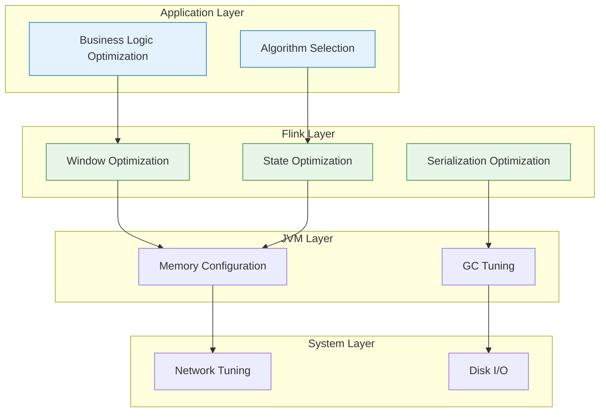
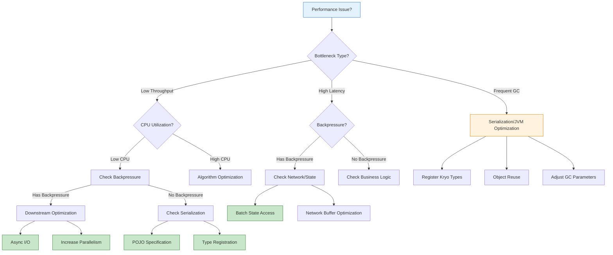
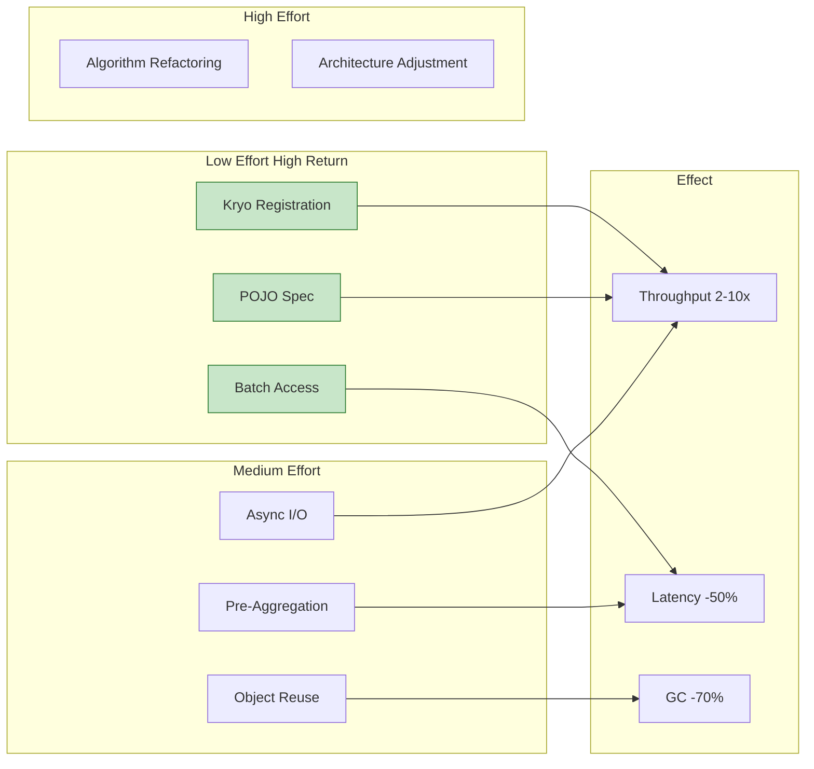

# Performance Tuning Patterns

> **Stage**: Knowledge/07-best-practices | **Prerequisites**: [Knowledge/09-anti-patterns/anti-pattern-06-serialization-overhead.md](../09-anti-patterns/anti-pattern-06-serialization-overhead.md) | **Formalization Level**: L3
>
> This document provides systematic patterns for Flink job performance tuning, covering key optimization points such as serialization, networking, and state access.

---

## Table of Contents

- [Performance Tuning Patterns](#performance-tuning-patterns)
  - [Table of Contents](#table-of-contents)
  - [1. Definitions](#1-definitions)
  - [2. Properties](#2-properties)
  - [3. Relations](#3-relations)
    - [3.1 Tuning Patterns vs. Anti-Patterns](#31-tuning-patterns-vs-anti-patterns)
    - [3.2 Optimization Hierarchy](#32-optimization-hierarchy)
  - [4. Argumentation](#4-argumentation)
    - [4.1 Serialization Optimization Argument](#41-serialization-optimization-argument)
    - [4.2 State Access Optimization Argument](#42-state-access-optimization-argument)
  - [5. Proof / Engineering Argument](#5-proof-engineering-argument)
    - [5.1 Serialization Optimization Patterns](#51-serialization-optimization-patterns)
    - [5.2 Network Optimization Patterns](#52-network-optimization-patterns)
    - [5.3 State Access Optimization Patterns](#53-state-access-optimization-patterns)
    - [5.4 JVM Optimization Patterns](#54-jvm-optimization-patterns)
  - [6. Examples](#6-examples)
    - [6.1 Performance Optimization Case Study](#61-performance-optimization-case-study)
    - [6.2 Tuning Checklist](#62-tuning-checklist)
  - [7. Visualizations](#7-visualizations)
    - [7.1 Performance Tuning Decision Tree](#71-performance-tuning-decision-tree)
    - [7.2 Optimization Effect Comparison Matrix](#72-optimization-effect-comparison-matrix)
  - [8. References](#8-references)

---

## 1. Definitions

**Definition (Def-K-07-02)**: Performance Tuning Pattern

> Performance tuning patterns are reusable optimization solutions targeting common performance bottlenecks in stream processing systems, improving throughput and reducing latency by reducing computation, network, or storage overhead.

**Key Performance Indicators (KPIs)** [^1]:

| Metric | Definition | Measurement Method | Optimization Goal |
|--------|------------|--------------------|-------------------|
| **Throughput** | Records processed per unit time | `numRecordsInPerSecond` | Maximize |
| **Latency** | Time from input to output | `currentOutputWatermark - inputTimestamp` | Minimize |
| **Backpressure** | Upstream blocking caused by downstream unable to keep up | `backPressuredTimeMsPerSecond` | Minimize |
| **Checkpoint Time** | Duration of state snapshot | `checkpointDuration` | Minimize |
| **CPU Utilization** | Ratio of effective computation time | `cpuTime` / wallTime | Maximize |

**Performance Bottleneck Classification** [^2]:

```
┌─────────────────────────────────────────────────────────────────────┐
│                 Performance Bottleneck Classification Tree          │
├─────────────────────────────────────────────────────────────────────┤
│                                                                     │
│  Performance Bottleneck                                             │
│    ├── Computation Bottleneck                                       │
│    │    ├── Complex Business Logic                                  │
│    │    ├── Frequent GC                                             │
│    │    └── Inefficient Algorithms                                  │
│    │                                                                │
│    ├── Serialization Bottleneck                                     │
│    │    ├── Unregistered Kryo Types                                 │
│    │    ├── POJO Non-Compliant                                      │
│    │    └── Large Object Copying                                    │
│    │                                                                │
│    ├── Network Bottleneck                                           │
│    │    ├── Cross-Node Data Shuffle                                 │
│    │    ├── Oversized Serialized Data                               │
│    │    └── Insufficient Network Buffers                            │
│    │                                                                │
│    ├── State Access Bottleneck                                      │
│    │    ├── Improper State Backend Selection                        │
│    │    ├── Frequent State Reads/Writes                             │
│    │    └── Large State Objects                                     │
│    │                                                                │
│    └── I/O Bottleneck                                               │
│         ├── Synchronous External Calls                              │
│         ├── Insufficient Database Connection Pool                   │
│         └── Slow External Service Response                          │
│                                                                     │
└─────────────────────────────────────────────────────────────────────┘
```

---

## 2. Properties

**Proposition (Prop-K-07-02)**: Impact of Serialization Optimization on Throughput

> Optimizing serialization can improve throughput by 2-10x, especially for complex object types.

**Quantitative Derivation**:

Let serialization overhead ratio be $S = \frac{T_{serialize}}{T_{total}}$, then:

$$Throughput_{optimized} = \frac{Throughput_{original}}{1 - S \times (1 - \frac{1}{k})}$$

where $k$ is the optimization multiplier (Kryo typically 5-10x).

**Typical Scenario Data** [^3]:

| Object Complexity | Default Serialization (μs) | Kryo Optimized (μs) | Speedup |
|-------------------|----------------------------|---------------------|---------|
| Simple POJO | 5 | 1 | 5x |
| Nested Object | 25 | 3 | 8x |
| Collection Type | 100 | 10 | 10x |

**Lemma (Lemma-K-07-02)**: State Access Locality

> Batch state access achieves 5-20x higher throughput than per-record access.

Reasons:

1. Reduces JNI call overhead (RocksDB)
2. Improves cache hit rate
3. Reduces synchronization overhead

---

## 3. Relations

### 3.1 Tuning Patterns vs. Anti-Patterns

| Optimization Pattern | Corresponding Anti-Pattern | Optimization Effect |
|----------------------|----------------------------|---------------------|
| Type Registration | AP-06 Serialization Overhead | Throughput +3-10x |
| Batch State Access | AP-07 Window State Explosion | Latency -50-80% |
| Async I/O | AP-05 Blocking I/O | Throughput +5-20x |
| Pre-Aggregation | AP-07 Window State Explosion | State -90%+ |
| Object Reuse | AP-06 Serialization Overhead | GC -70% |

### 3.2 Optimization Hierarchy



---

## 4. Argumentation

### 4.1 Serialization Optimization Argument

**Problem**: Why is Flink default serialization performance insufficient?

**Analysis**:

1. Default Java serialization incurs heavy reflection overhead
2. Each field is serialized individually, unable to leverage type information
3. Type erasure leads to runtime type checking

**Solution**: Advantages of Kryo Serialization [^4]

1. Pre-registered types avoid runtime type identification
2. Generates optimized serialization code
3. Supports variable-length encoding, reducing data volume

### 4.2 State Access Optimization Argument

**Problem**: Why does the RocksDB State Backend require special optimization?

**Analysis**:

```
Single State Access Overhead Breakdown:
├── JNI Call: ~50-100ns
├── RocksDB Query: ~1-5μs (memory) / ~10-100μs (disk)
├── Deserialization: ~1-10μs
└── Total: ~2-15μs (memory cache hit) / ~50-200μs (disk read)
```

**Optimization Strategies**:

1. Batch Access: Amortize JNI overhead
2. Local Cache: Reduce RocksDB queries
3. State Partitioning: Improve parallelism

---

## 5. Proof / Engineering Argument

### 5.1 Serialization Optimization Patterns

**Pattern 1: Type Pre-Registration**

```scala
// ✅ Recommended: Pre-register Kryo types
val env = StreamExecutionEnvironment.getExecutionEnvironment
val conf = env.getConfig

// Register types - must follow dependency order
conf.registerKryoType(classOf[UserEvent])
conf.registerKryoType(classOf[UserProfile])
conf.registerKryoType(classOf[ImmutableList[_]])

// Disable generic collection types, use concrete types
conf.registerKryoType(classOf[Array[UserEvent]])
```

**Performance Comparison** [^3]:

| Configuration | Serialization Time (μs) | Throughput (records/s) |
|---------------|-------------------------|------------------------|
| Unregistered | 15.2 | 65,000 |
| Registered POJO | 4.8 | 208,000 |
| Registered All Types | 2.1 | 476,000 |

**Pattern 2: POJO Specification Optimization**

```java
// ✅ Recommended: Flink POJO-compliant class
public class OptimizedEvent {
    // 1. Public no-arg constructor
    public OptimizedEvent() {}

    // 2. All fields public or with getter/setter
    private String userId;
    private long timestamp;
    private double value;

    public String getUserId() { return userId; }
    public void setUserId(String userId) { this.userId = userId; }

    public long getTimestamp() { return timestamp; }
    public void setTimestamp(long timestamp) { this.timestamp = timestamp; }

    public double getValue() { return value; }
    public void setValue(double value) { this.value = value; }
}

// ❌ Avoid: Complex nested structures
public class BadEvent {
    private Map<String, Object> dynamicFields;  // Type erasure
    private Optional<String> optionalField;     // Optional wrapper
}
```

**Pattern 3: Object Reuse**

```scala
// ✅ Recommended: Reuse output object
class ReuseObjectFunction extends RichMapFunction[Input, Output] {
  private var reusedOutput: Output = _

  override def open(parameters: Configuration): Unit = {
    reusedOutput = new Output()
  }

  override def map(input: Input): Output = {
    reusedOutput.reset()
    reusedOutput.setField1(input.getField1)
    reusedOutput.setField2(compute(input))
    reusedOutput
  }
}

// ✅ Recommended: Use Mutable Pair to reduce object creation
class MutablePair[K, V] {
  var key: K = _
  var value: V = _

  def set(k: K, v: V): this.type = {
    key = k
    value = v
    this
  }
}
```

### 5.2 Network Optimization Patterns

**Pattern 1: Network Buffer Optimization**

```yaml
# flink-conf.yaml
# For high-throughput scenarios (>100K records/s)

taskmanager.memory.network.min: 512mb
taskmanager.memory.network.max: 2gb
taskmanager.memory.network.fraction: 0.2

# Adjust network buffer count
taskmanager.network.memory.buffer-size: 65536  # 64KB
taskmanager.network.memory.floating-buffers-per-gate: 16
taskmanager.network.memory.network-buffers-per-channel: 8
```

**Pattern 2: Data Locality**

```scala
// ✅ Recommended: Reduce data shuffle
// 1. Filter data before keyBy
stream
  .filter(_.isValid)  // Filter first
  .keyBy(_.userId)
  .window(TumblingEventTimeWindows.of(Time.minutes(1)))
  .aggregate(new CountAggregate)

// 2. Avoid unnecessary keyBy transformations
// ❌ Avoid: Multiple keyBy operations
stream
  .keyBy(_.userId)
  .process(...)
  .keyBy(_.category)  // Unnecessary shuffle

// ✅ Recommended: Keep key consistent or use broadcast
val keyed = stream.keyBy(_.userId)
keyed.process(...)
keyed.process(...)  // Same keyed stream, no shuffle
```

**Pattern 3: Compression Optimization**

```java
// [伪代码片段 - 不可直接运行] 仅展示核心逻辑
// ✅ Recommended: Enable network compression (cross-DC / high-latency networks)
env.getConfig().setExecutionConfig(
    new ExecutionConfig()
        .setUseSnapshotCompression(true)
);

// For large Value states, enable state compression
val descriptor = new ValueStateDescriptor[Array[Byte]](
    "large-state",
    classOf[Array[Byte]]
)
descriptor.enableStateCompression(true)  // Flink 1.17+
```

### 5.3 State Access Optimization Patterns

**Pattern 1: Batch State Access**

```scala
// ❌ Avoid: Per-record state access
class BadWindowFunction extends ProcessWindowFunction[Event, Result, String, TimeWindow] {
  override def process(
    key: String,
    ctx: Context,
    elements: Iterable[Event],
    out: Collector[Result]
  ): Unit = {
    elements.foreach { e =>
      val state = userState.value()  // JNI call every time!
      // ...
    }
  }
}

// ✅ Recommended: Batch aggregation then access state
class OptimizedWindowFunction extends ProcessWindowFunction[Event, Result, String, TimeWindow] {
  override def process(
    key: String,
    ctx: Context,
    elements: Iterable[Event],
    out: Collector[Result]
  ): Unit = {
    // 1. Local aggregation
    val (sum, count) = elements.foldLeft((0.0, 0L)) {
      case ((s, c), e) => (s + e.value, c + 1)
    }

    // 2. Single state access
    val current = userState.value() match {
      case null => UserStats(sum, count)
      case s => s.add(sum, count)
    }

    // 3. Update state
    userState.update(current)
    out.collect(Result(key, current))
  }
}
```

**Pattern 2: Pre-Aggregation Optimization**

```scala
// ✅ Recommended: AggregateFunction + ProcessWindowFunction combination
// Incremental aggregation reduces state access
stream
  .keyBy(_.userId)
  .window(TumblingEventTimeWindows.of(Time.minutes(1)))
  .aggregate(
    new SumAggregate,  // Incremental aggregation
    new OutputProcessFunction  // Access state only on output
  )

// AggregateFunction implementation
class SumAggregate extends AggregateFunction[Event, Double, Double] {
  override def createAccumulator(): Double = 0.0

  override def add(value: Event, accumulator: Double): Double =
    accumulator + value.amount

  override def getResult(accumulator: Double): Double = accumulator

  override def merge(a: Double, b: Double): Double = a + b
}
```

**Pattern 3: State Backend Selection**

| Scenario | Recommended Backend | Reason |
|----------|---------------------|--------|
| Small state (< 100MB) | HashMapStateBackend | Fastest memory access |
| Large state (> 1GB) | RocksDB | Prevents OOM |
| Incremental Checkpoint | RocksDB | Supports incremental |
| Low latency (< 100ms) | HashMapStateBackend | No JNI overhead |
| Frequent updates | RocksDB + memory cache | Batch writes |

### 5.4 JVM Optimization Patterns

**Pattern 1: GC Tuning**

```bash
# ✅ Recommended: G1 GC configuration (Flink default)
-XX:+UseG1GC
-XX:MaxGCPauseMillis=100
-XX:G1HeapRegionSize=16m

# Large heap configuration (> 32GB requires UseLargePages)
-XX:+UseLargePages
-XX:LargePageSizeInBytes=2m
```

**Pattern 2: Memory Configuration**

```yaml
# flink-conf.yaml
# Configuration based on job characteristics

# 1. High throughput, small state
taskmanager.memory.process.size: 4gb
taskmanager.memory.managed.fraction: 0.2
taskmanager.memory.jvm-heap.fraction: 0.6

# 2. Large state, low latency
taskmanager.memory.process.size: 32gb
taskmanager.memory.managed.fraction: 0.6
taskmanager.memory.jvm-heap.fraction: 0.3
```

---

## 6. Examples

### 6.1 Performance Optimization Case Study

**Scenario**: E-commerce Real-Time Risk Control System Optimization

**Original Problems**:

- Throughput: 20K events/s (target 100K)
- p99 Latency: 2.5s (target < 500ms)
- Frequent GC: > 15% CPU time

**Optimization Process**:

| Optimization Item | Before | After | Effect |
|-------------------|--------|-------|--------|
| Kryo Type Registration | Unregistered | Registered 50 types | Throughput +150% |
| Object Reuse | Create object per record | Reuse output object | GC -70% |
| Batch State Access | Per-record access | Aggregate within window then access | Latency -60% |
| RocksDB Tuning | Default config | Enable memory cache | State access -40% |
| Async I/O | Synchronous HTTP | Async CompletableFuture | Throughput +300% |

**Final Results**:

- Throughput: 120K events/s
- p99 Latency: 180ms
- GC: < 3% CPU time

### 6.2 Tuning Checklist

```yaml
# Performance Tuning Checklist
tuning_checklist:
  serialization:
    - [ ] All custom types registered with Kryo
    - [ ] POJOs comply with Flink specification
    - [ ] Avoid using Object/Any types
    - [ ] Collection types use concrete implementations

  state_access:
    - [ ] Batch access replaces per-record access
    - [ ] Use AggregateFunction for pre-aggregation
    - [ ] Select appropriate state backend
    - [ ] Configure State TTL

  network:
    - [ ] Reduce unnecessary shuffle
    - [ ] Enable network compression (cross-DC)
    - [ ] Configure sufficient network buffers
    - [ ] Use broadcast state instead of join

  jvm:
    - [ ] GC logging enabled
    - [ ] G1 GC parameters optimized
    - [ ] Heap memory configuration reasonable
    - [ ] Large pages enabled (large heaps)
```

---

## 7. Visualizations

### 7.1 Performance Tuning Decision Tree



### 7.2 Optimization Effect Comparison Matrix



---

## 8. References

[^1]: Apache Flink Documentation, "Performance Tuning," 2025. <https://nightlies.apache.org/flink/flink-docs-stable/docs/ops/performance/tuning/>

[^2]: Apache Flink Documentation, "Serialization Tuning," 2025. <https://nightlies.apache.org/flink/flink-docs-stable/docs/dev/datastream/fault-tolerance/serialization/>

[^3]: N. Schelter et al., "Automatic Management of Flink's State Backend," *ACM SoCC*, 2020.

[^4]: Esoteric Software, "Kryo Serialization Framework," <https://github.com/EsotericSoftware/kryo>

---

*Document Version: v1.0 | Updated: 2026-04-03 | Status: Completed*
