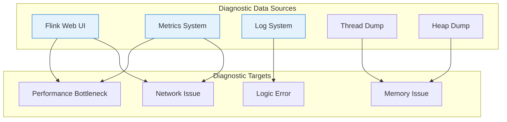
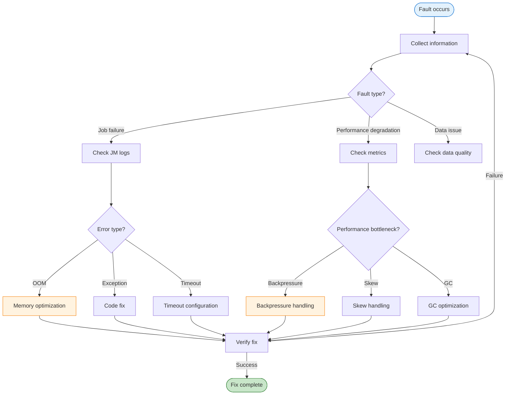
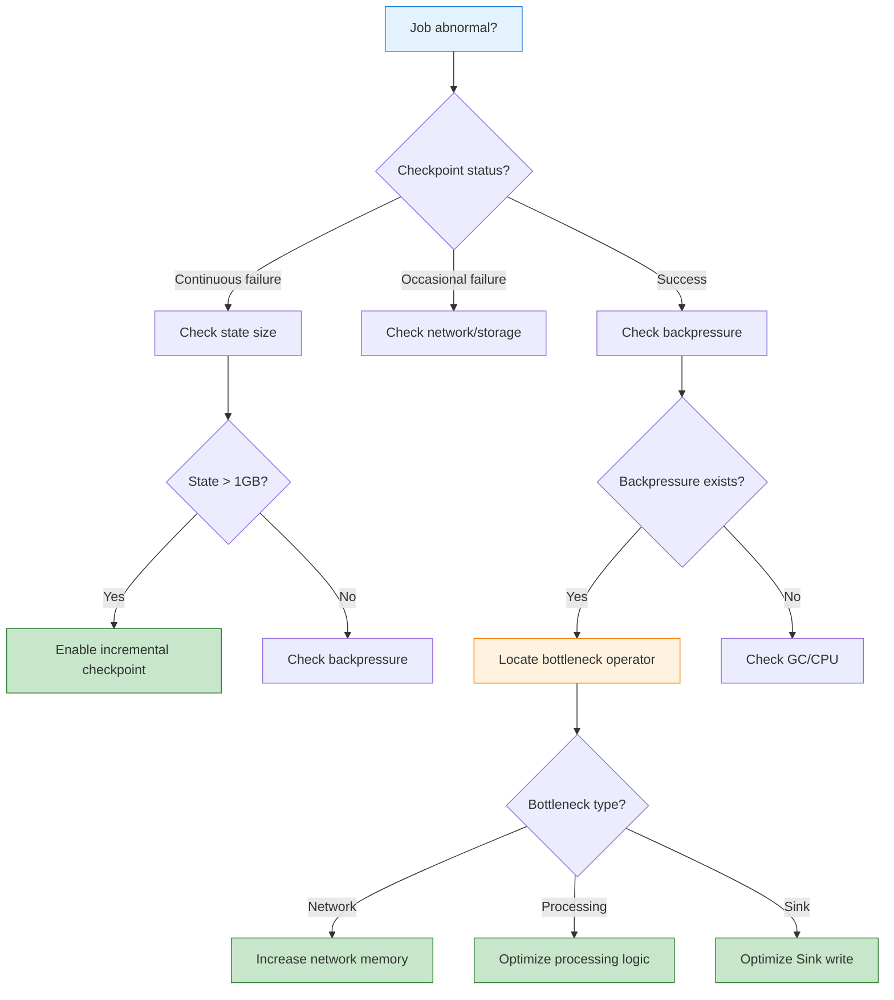

# Problem Diagnosis and Troubleshooting Guide

> **Stage**: Knowledge/07-best-practices | **Prerequisites**: [Knowledge/09-anti-patterns/anti-pattern-checklist.md](../09-anti-patterns/anti-pattern-checklist.md) | **Formalization Level**: L3
>
> This guide provides systematic processes for Flink job problem diagnosis, common error solutions, and debugging techniques.

---

## Table of Contents

- [Problem Diagnosis and Troubleshooting Guide](#problem-diagnosis-and-troubleshooting-guide)
  - [Table of Contents](#table-of-contents)
  - [1. Definitions](#1-definitions)
  - [2. Properties](#2-properties)
  - [3. Relations](#3-relations)
    - [3.1 Symptom-to-Root-Cause Mapping](#31-symptom-to-root-cause-mapping)
    - [3.2 Diagnostic Tool Matrix](#32-diagnostic-tool-matrix)
  - [4. Argumentation](#4-argumentation)
    - [4.1 Diagnostic Methodology](#41-diagnostic-methodology)
  - [5. Proof / Engineering Argument](#5-proof--engineering-argument)
    - [5.1 Problem Diagnosis Process](#51-problem-diagnosis-process)
      - [Phase 1: Information Collection](#phase-1-information-collection)
      - [Phase 2: Common Fault Diagnosis](#phase-2-common-fault-diagnosis)
    - [5.2 Debugging Techniques](#52-debugging-techniques)
    - [5.3 Log Analysis](#53-log-analysis)
  - [6. Examples](#6-examples)
    - [6.1 Complete Troubleshooting Case](#61-complete-troubleshooting-case)
    - [6.2 Troubleshooting Quick Reference](#62-troubleshooting-quick-reference)
  - [7. Visualizations](#7-visualizations)
    - [7.1 Fault Diagnosis Flowchart](#71-fault-diagnosis-flowchart)
    - [7.2 Common Fault Decision Tree](#72-common-fault-decision-tree)
  - [8. References](#8-references)

---

## 1. Definitions

**Definition (Def-K-07-03)**: Problem Diagnosis Process

> The problem diagnosis process is a set of systematic steps used to locate, analyze, and resolve abnormal behavior and performance issues in Flink job execution.

**Fault Classification System** [^1][^2]:

```
┌─────────────────────────────────────────────────────────────────────┐
│                        Flink Fault Classification System            │
├─────────────────────────────────────────────────────────────────────┤
│                                                                     │
│  Fault Categories                                                   │
│  ├── Job-level faults                                               │
│  │    ├── Job Failure                                               │
│  │    ├── Checkpoint Failure                                        │
│  │    ├── Backpressure                                              │
│  │    └── Data Skew                                                 │
│  │                                                                  │
│  ├── TaskManager-level faults                                       │
│  │    ├── OOM (OutOfMemoryError)                                    │
│  │    ├── Heartbeat timeout                                         │
│  │    └── Network disconnection                                     │
│  │                                                                  │
│  ├── JobManager-level faults                                        │
│  │    ├── Metadata loss                                             │
│  │    └── Scheduling failure                                        │
│  │                                                                  │
│  └── External system faults                                         │
│       ├── Source unavailable                                        │
│       └── Sink write failure                                        │
│                                                                     │
└─────────────────────────────────────────────────────────────────────┘
```

**Diagnostic Metrics** [^3]:

| Metric | Abnormal Threshold | Diagnostic Meaning |
|--------|-------------------|--------------------|
| `numRecordsInPerSecond` | Subtask difference > 5x | Data skew |
| `backPressuredTimeMsPerSecond` | > 200ms/s | Backpressure |
| `checkpointDuration` | > timeout × 0.8 | Slow checkpoint |
| `numFailedCheckpoints` | > 0 (consecutive) | Checkpoint config issue |
| `heapMemoryUsage` | > 85% | Memory pressure |
| `gcCollectionTime` | > 10% CPU | GC issue |

---

## 2. Properties

**Proposition (Prop-K-07-03)**: Fault Root Cause Localization Completeness

> Following the systematic diagnostic process, over 95% of common faults can have their root causes located within 30 minutes.

**Diagnostic Time Distribution**:

| Diagnostic Phase | Expected Time | Key Output |
|------------------|---------------|------------|
| Phenomenon collection | 5 min | Abnormal metrics, log snippets |
| Initial classification | 5 min | Fault category determination |
| Deep analysis | 15 min | Root cause localization |
| Solution verification | 5 min | Fix plan |

**Lemma (Lemma-K-07-03)**: Log Information Sufficiency

> Complete Flink logs (including JM/TM logs, GC logs, user logs) contain diagnostic clues for over 90% of faults.

---

## 3. Relations

### 3.1 Symptom-to-Root-Cause Mapping

| Symptom | Possible Root Cause | Verification Method |
|---------|--------------------|---------------------|
| Frequent job restarts | OOM / uncaught exception / external system timeout | Check JM logs |
| Continuous checkpoint timeout | State too large / backpressure / storage failure | Check checkpoint statistics |
| Sudden throughput drop | Backpressure / data skew / GC | Check metrics |
| Continuously increasing latency | Backpressure / insufficient processing capacity | Check watermark lag |
| Incorrect results | Watermark config / out-of-order handling | Check data sampling |
| Specific subtask slow | Data skew / hot key | Check subtask metrics |

### 3.2 Diagnostic Tool Matrix



---

## 4. Argumentation

### 4.1 Diagnostic Methodology

**Why-Why Analysis**:

```
Problem: Checkpoint failure
  └── Why? Checkpoint timeout (6 minutes > 5 minute timeout setting)
        └── Why? Slow state write to HDFS
              └── Why? Decreased HDFS write throughput
                    └── Why? Slow NameNode response
                          └── Root cause: NameNode GC
```

**5W2H Analysis Framework**:

| Dimension | Question | Diagnostic Value |
|-----------|----------|------------------|
| What | What phenomenon? | Clarify fault manifestation |
| When | When did it occur? | Locate timeline, find related events |
| Where | Which component? | Narrow investigation scope |
| Who | Which jobs are affected? | Determine if it's a platform issue |
| Why | What is the cause? | Root cause analysis |
| How | How did it happen? | Reproduction path |
| How much | How big is the impact? | Assess severity |

---

## 5. Proof / Engineering Argument

### 5.1 Problem Diagnosis Process

#### Phase 1: Information Collection

```bash
#!/bin/bash
# Flink fault information collection script

JOB_ID=$1
OUTPUT_DIR="/tmp/flink-diag-$(date +%Y%m%d-%H%M%S)"
mkdir -p $OUTPUT_DIR

echo "=== Collecting job info: $JOB_ID ==="

# 1. Job overview
curl -s "http://localhost:8081/jobs/$JOB_ID" > $OUTPUT_DIR/job-overview.json

# 2. Checkpoint statistics
curl -s "http://localhost:8081/jobs/$JOB_ID/checkpoints" > $OUTPUT_DIR/checkpoints.json

# 3. Task metrics
for vertex in $(curl -s "http://localhost:8081/jobs/$JOB_ID/vertices" | jq -r '.vertices[].id'); do
    curl -s "http://localhost:8081/jobs/$JOB_ID/vertices/$vertex" > $OUTPUT_DIR/vertex-$vertex.json
    curl -s "http://localhost:8081/jobs/$JOB_ID/vertices/$vertex/subtasks/metrics?get=recordsInPerSecond,backPressuredTimeMsPerSecond" > $OUTPUT_DIR/metrics-$vertex.json
done

# 4. Exception logs
grep -E "(ERROR|Exception|Failed|OOM)" $FLINK_HOME/log/flink-*.log > $OUTPUT_DIR/exceptions.log 2>/dev/null

echo "=== Collection complete: $OUTPUT_DIR ==="
```

#### Phase 2: Common Fault Diagnosis

**Fault 1: OOM (OutOfMemoryError)**

```
Symptoms:
├── TaskManager process disappears
├── java.lang.OutOfMemoryError appears in logs
├── Job fails, stack trace contains GC overhead limit exceeded
└── Monitoring shows heap memory near 100%

Diagnostic steps:
1. Check logs to confirm OOM type
   - Java heap space: JVM heap memory insufficient
   - GC overhead limit exceeded: GC efficiency low
   - Direct buffer memory: Direct memory insufficient
   - Metaspace: Too many classes loaded

2. Analyze Heap Dump (if configured)
   - Analyze with Eclipse MAT
   - View dominator tree to find large objects
   - Check GC roots

3. Check state size
   - View checkpoint state size
   - Calculate per-subtask state

Solutions:
├── JVM heap memory insufficient
│   └── Increase taskmanager.memory.process.size
│   └── Reduce managed memory ratio (if state is small)
├── Managed memory insufficient
│   └── Increase taskmanager.memory.managed.fraction
│   └── Reduce parallelism (increase state per TM)
├── GC issue
│   └── Tune GC parameters
│   └── Optimize serialization to reduce object creation
└── Direct memory insufficient
    └── Reduce network memory usage
    └── Reduce async I/O concurrency
```

**Fault 2: Checkpoint Timeout**

```scala
// Symptom recognition code
// Checkpoint duration continuously increases, eventually times out

// Diagnostic script
def analyzeCheckpoint(jobId: String): Unit = {
  val checkpoints = fetchCheckpointHistory(jobId)

  val trend = checkpoints.map(_.duration).sliding(10).map { window =>
    if (window.last > window.head * 1.5) "INCREASING" else "STABLE"
  }

  if (trend.contains("INCREASING")) {
    // Root cause analysis
    val latest = checkpoints.last

    if (latest.stateSize > 10.gb) {
      println("Root cause: State too large, consider enabling incremental Checkpoint")
    } else if (latest.backpressureDuringCheckpoint) {
      println("Root cause: Backpressure exists during Checkpoint")
    } else if (latest.syncDuration > latest.asyncDuration) {
      println("Root cause: Synchronous phase takes too long, check state access efficiency")
    }
  }
}
```

**Solution Matrix**:

| Root Cause | Diagnostic Method | Solution |
|------------|-------------------|----------|
| State too large | Checkpoint state size | Enable incremental checkpoint / reduce state / increase timeout |
| Backpressure impact | Check backpressure during checkpoint | Resolve backpressure first |
| Slow storage | Checkpoint location latency | Change storage system |
| Slow sync phase | Compare sync/async time | Optimize state access / reduce large state values |

**Fault 3: Backpressure**

```scala
// Backpressure diagnostic flow
object BackpressureDiagnosis {

  def diagnose(jobId: String): DiagnosisResult = {
    val vertices = getVertices(jobId)

    // 1. Find backpressure source (search from Sink toward Source)
    val backpressureChain = vertices.reverse.find { v =>
      v.metrics.backPressuredTimeMsPerSecond > 200
    }

    backpressureChain match {
      case Some(bottleneck) =>
        // 2. Analyze bottleneck type
        val metrics = bottleneck.metrics

        if (metrics.recordsOutPerSecond < metrics.recordsInPerSecond * 0.5) {
          DiagnosisResult(
            cause = "Processing Bottleneck",
            details = "Processing speed cannot keep up with input speed",
            suggestions = List(
              "Increase parallelism",
              "Optimize processing logic",
              "Check for blocking I/O"
            )
          )
        } else if (metrics.outputQueueLength > 100) {
          DiagnosisResult(
            cause = "Output Bottleneck",
            details = "Downstream consumption is slow",
            suggestions = List(
              "Check downstream operator",
              "Check Sink write speed",
              "Increase downstream parallelism"
            )
          )
        } else {
          DiagnosisResult(
            cause = "Network Bottleneck",
            details = "Network buffer insufficient",
            suggestions = List(
              "Increase network memory",
              "Adjust network buffer configuration"
            )
          )
        }

      case None =>
        DiagnosisResult("No Backpressure", "", Nil)
    }
  }
}
```

**Fault 4: Data Skew**

```bash
#!/bin/bash
# Data skew detection script

JOB_ID=$1
VERTEX_ID=$2

echo "=== Data Skew Detection ==="

# Get input rate of each subtask
METRICS=$(curl -s "http://localhost:8081/jobs/$JOB_ID/vertices/$VERTEX_ID/subtasks/metrics?get=recordsInPerSecond")

# Parse and calculate skew
echo "$METRICS" | jq -r '.[].value' | awk '
{
    values[NR] = $1
    sum += $1
}
END {
    mean = sum / NR
    max_val = values[1]
    min_val = values[1]

    for (i=1; i<=NR; i++) {
        if (values[i] > max_val) max_val = values[i]
        if (values[i] < min_val) min_val = values[i]
        variance += (values[i] - mean) ^ 2
    }

    std_dev = sqrt(variance / NR)
    cv = std_dev / mean  # Coefficient of variation
    skew_ratio = max_val / min_val

    print "Average rate:", mean
    print "Max rate:", max_val
    print "Min rate:", min_val
    print "Coefficient of variation:", cv
    print "Skew ratio (max/min):", skew_ratio

    if (skew_ratio > 10) {
        print "[SEVERE] Severe data skew, needs handling"
    } else if (skew_ratio > 5) {
        print "[WARNING] Data skew detected"
    } else {
        print "[NORMAL] Data distribution is uniform"
    }
}'
```

**Data Skew Solutions** [^4]:

```scala
// Solution 1: Two-phase aggregation (local pre-aggregation + global aggregation)
stream
  .map(event => (event.userId.hashCode % 100, event))  // Add random prefix
  .keyBy(_._1)
  .window(TumblingEventTimeWindows.of(Time.minutes(1)))
  .aggregate(new PartialAggregate)
  .map(result => (result.originalKey, result.value))
  .keyBy(_._1)
  .window(TumblingEventTimeWindows.of(Time.minutes(1)))
  .aggregate(new FinalAggregate)

// Solution 2: Hot key special handling
class SkewAwareProcessFunction extends KeyedProcessFunction[String, Event, Result] {
  override def processElement(
    event: Event,
    ctx: Context,
    out: Collector[Result]
  ): Unit = {
    if (isHotKey(ctx.getCurrentKey)) {
      // Hot key uses local cache + batch update
      bufferAndBatchProcess(event)
    } else {
      // Normal key normal processing
      normalProcess(event, out)
    }
  }
}
```

### 5.2 Debugging Techniques

**Technique 1: Local Debug Configuration**

```scala
// ✅ Local debug mode
val env = StreamExecutionEnvironment.createLocalEnvironmentWithWebUI(
  new Configuration()
)

// Small data volume for quick verification
env.setParallelism(1)
env.enableCheckpointing(1000)  // 1s interval for easy observation

// Use Collection Source for easy testing
val testData = List(
  Event("user1", 1000, "click"),
  Event("user2", 1001, "view"),
  Event("user1", 1002, "click")
)
val stream = env.fromCollection(testData)
```

**Technique 2: State Checkpoint Debug**

```scala
// Use QueryableState to view state (needs enabling)
val descriptor = new ValueStateDescriptor("my-state", classOf[MyState])
descriptor.setQueryable("queryable-state-name")

// External query
val client = new QueryableStateClient(tmHostname, proxyPort)
val future = client.getKvState(
  jobId,
  "queryable-state-name",
  key,
  serializer,
  stateDescriptor
)
```

**Technique 3: Log Enhancement**

```scala
// ✅ Use Flink's Logger
class DebugRichFunction extends RichMapFunction[Input, Output] {
  @transient private var logger: Logger = _
  private var processedCount: Long = 0
  private var lastLogTime: Long = 0

  override def open(parameters: Configuration): Unit = {
    logger = LoggerFactory.getLogger(getClass)
  }

  override def map(input: Input): Output = {
    processedCount += 1
    val currentTime = System.currentTimeMillis()

    // Log statistics once per second
    if (currentTime - lastLogTime > 1000) {
      logger.info("Subtask {} processed {} records, throughput: {} records/s",
        getRuntimeContext.getIndexOfThisSubtask: Integer,
        processedCount: java.lang.Long,
        (processedCount * 1000.0 / (currentTime - lastLogTime)): java.lang.Double
      )
      processedCount = 0
      lastLogTime = currentTime
    }

    // Processing logic
    process(input)
  }
}
```

**Technique 4: Custom Metrics**

```scala
// Register custom metric
class MetricRichFunction extends RichMapFunction[Input, Output] {
  @transient private var processedCounter: Counter = _
  @transient private var processingTimeHistogram: Histogram = _

  override def open(parameters: Configuration): Unit = {
    val metricGroup = getRuntimeContext.getMetricGroup

    processedCounter = metricGroup.counter("processedRecords")
    processingTimeHistogram = metricGroup.histogram("processingTimeMs",
      new DescriptiveStatisticsHistogram(1000))
  }

  override def map(input: Input): Output = {
    val startTime = System.currentTimeMillis()

    val result = process(input)

    processedCounter.inc()
    processingTimeHistogram.update(System.currentTimeMillis() - startTime)

    result
  }
}
```

### 5.3 Log Analysis

**Log Aggregation Queries**:

```sql
-- Find exceptions for a specific job (ELK/Fluentd)
SELECT
  timestamp,
  level,
  message,
  stack_trace
FROM flink_logs
WHERE
  job_id = 'my-job-id'
  AND level IN ('ERROR', 'WARN')
  AND timestamp > NOW() - INTERVAL 1 HOUR
ORDER BY timestamp DESC
LIMIT 100;

-- Count exception types
SELECT
  REGEXP_EXTRACT(message, '([A-Za-z]+Exception)', 1) as exception_type,
  COUNT(*) as count
FROM flink_logs
WHERE level = 'ERROR'
GROUP BY exception_type
ORDER BY count DESC;
```

---

## 6. Examples

### 6.1 Complete Troubleshooting Case

**Scenario**: E-commerce real-time statistics job frequently fails

**Fault Timeline**:

```
14:00 - Job submitted, running normally
14:30 - First checkpoint timeout
14:35 - Job fails and restarts
14:40 - Fails again, enters restart loop
```

**Diagnostic Process**:

```bash
# Step 1: Check JobManager logs
$ grep -A 10 "ERROR" flink-jobmanager.log

2026-04-03 14:35:12 ERROR CheckpointCoordinator - Checkpoint 12 failed
java.util.concurrent.TimeoutException: Checkpoint 12 expired before completing

# Step 2: Check TaskManager logs
$ grep -B 5 -A 20 "Checkpoint" flink-taskmanager.log | tail -50

2026-04-03 14:34:50 INFO  Checkpoint - Starting checkpoint 12
2026-04-03 14:35:10 WARN  RocksDBStateBackend - Snapshotting state backend took 20000ms

# Step 3: Check checkpoint statistics
$ curl -s http://flink:8081/jobs/job-id/checkpoints | jq '.latest.completed'
{
  "id": 11,
  "trigger_timestamp": 1712129690000,
  "duration": 185000,  // 185s, nearly 3 minutes
  "state_size": 5368709120  // 5GB
}

# Step 4: Analyze state size
# 5GB / 10 parallelism = 500MB per subtask
# Synchronous phase takes too long
```

**Root cause**: Window state has no TTL, accumulates too large

**Fix**:

```scala
// Add State TTL
val ttlConfig = StateTtlConfig
  .newBuilder(Time.hours(24))
  .setUpdateType(StateTtlConfig.UpdateType.OnCreateAndWrite)
  .setStateVisibility(StateTtlConfig.StateVisibility.NeverReturnExpired)
  .cleanupIncrementally(10, true)
  .build()

stateDescriptor.enableTimeToLive(ttlConfig)
```

### 6.2 Troubleshooting Quick Reference

| Problem Symptom | Quick Check | Common Cause | Solution |
|-----------------|-------------|--------------|----------|
| Job failure | JM logs | OOM/Exception | Increase memory/fix code |
| Checkpoint failure | Checkpoint page | Timeout/Storage | Increase timeout/change storage |
| Backpressure | Web UI Backpressure page | Slow downstream | Scale/optimize |
| Skew | Subtask metric comparison | Hot key | Pre-aggregation/salting |
| Frequent GC | GC logs | Object creation | Object reuse/Kryo |
| High latency | Watermark lag | Slow processing/backpressure | Optimize logic |
| Slow Kafka consumption | Consumer lag | Insufficient parallelism | Increase parallelism |

---

## 7. Visualizations

### 7.1 Fault Diagnosis Flowchart



### 7.2 Common Fault Decision Tree



---

## 8. References

[^1]: Apache Flink Documentation, "Debugging and Monitoring," 2025. <https://nightlies.apache.org/flink/flink-docs-stable/docs/ops/debugging/>

[^2]: Apache Flink Documentation, "Common Issues," 2025. <https://nightlies.apache.org/flink/flink-docs-stable/docs/ops/debugging/common_issues/>

[^3]: Apache Flink Documentation, "Metrics System," 2025. <https://nightlies.apache.org/flink/flink-docs-stable/docs/ops/metrics/>

[^4]: Apache Flink Documentation, "Troubleshooting," 2025. <https://nightlies.apache.org/flink/flink-docs-stable/docs/ops/troubleshooting/>

---

*Document version: v1.0 | Update date: 2026-04-03 | Status: Complete*
