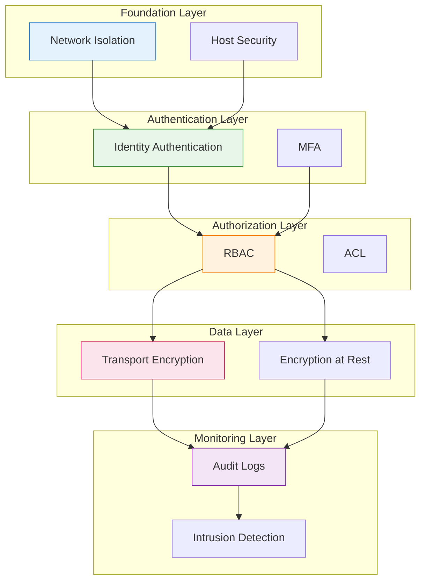
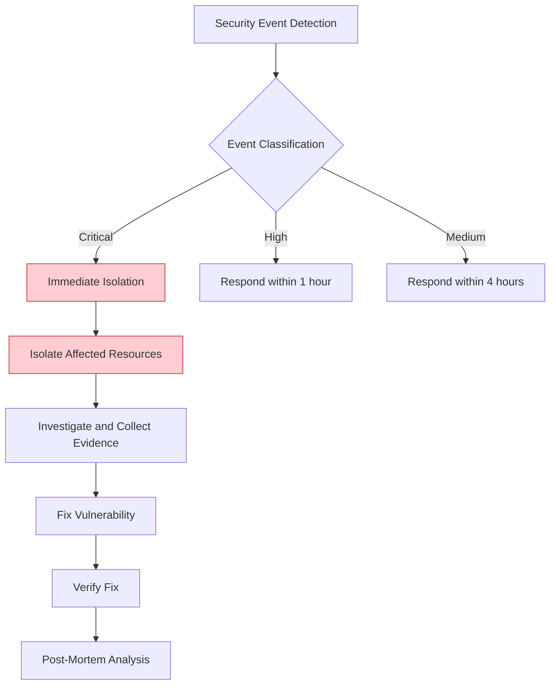
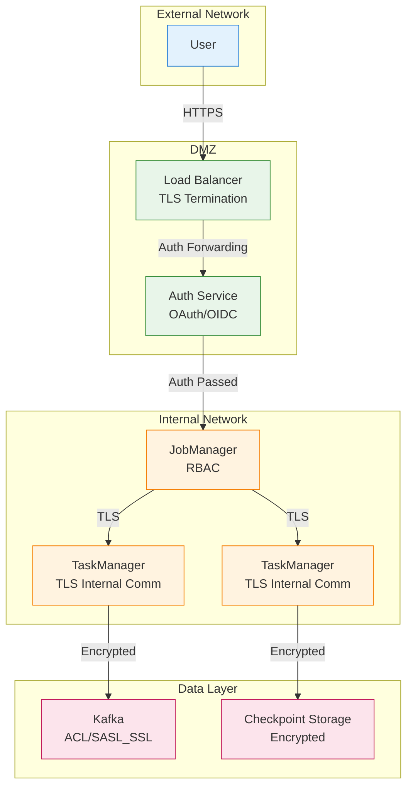
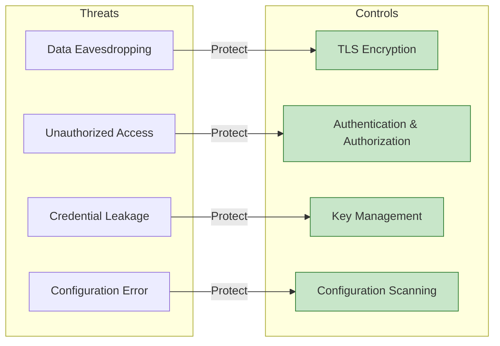

# Security Hardening Guide

> **Stage**: Knowledge/07-best-practices | **Prerequisites**: [Knowledge/06-frontier/streaming-security-compliance.md](../06-frontier/streaming-security-compliance.md) | **Formality Level**: L3
>
> This guide provides security hardening strategies for Flink stream processing systems, covering authentication, authorization, encryption, and auditing.

---

## Table of Contents

- [Security Hardening Guide](#security-hardening-guide)
  - [Table of Contents](#table-of-contents)
  - [1. Definitions](#1-definitions)
  - [2. Properties](#2-properties)
  - [3. Relations](#3-relations)
    - [3.1 Security Controls to Compliance Mapping](#31-security-controls-to-compliance-mapping)
    - [3.2 Security Control Dependencies](#32-security-control-dependencies)
  - [4. Argumentation](#4-argumentation)
    - [4.1 Zero Trust Architecture Argumentation](#41-zero-trust-architecture-argumentation)
    - [4.2 Encryption Necessity Argumentation](#42-encryption-necessity-argumentation)
  - [5. Proof / Engineering Argument](#5-proof-engineering-argument)
    - [5.1 Authentication Configuration](#51-authentication-configuration)
    - [5.2 Authorization Configuration](#52-authorization-configuration)
    - [5.3 Data Encryption](#53-data-encryption)
    - [5.4 Audit Logging](#54-audit-logging)
  - [6. Examples](#6-examples)
    - [6.1 Security Hardening Checklist](#61-security-hardening-checklist)
    - [6.2 Security Incident Response Flow](#62-security-incident-response-flow)
  - [7. Visualizations](#7-visualizations)
    - [7.1 Security Architecture Diagram](#71-security-architecture-diagram)
    - [7.2 Security Control Matrix](#72-security-control-matrix)
  - [8. References](#8-references)

---

## 1. Definitions

**Definition (Def-K-07-05)**: Stream Processing System Security Hardening

> Security hardening is the process of protecting stream processing systems from unauthorized access, data breaches, and service disruptions by configuring security controls, implementing best practices, and continuous monitoring.

**Security Threat Model** [^1][^2]:

```
┌─────────────────────────────────────────────────────────────────────┐
│                    Stream Processing Security Threat Model          │
├─────────────────────────────────────────────────────────────────────┤
│                                                                     │
│  Threat Categories                                                  │
│  ├── Data Security Threats                                          │
│  │    ├── Data-in-transit eavesdropping (Sniffing)                 │
│  │    ├── Data-at-rest leakage (Data Breach)                       │
│  │    └── Data tampering (Tampering)                               │
│  │                                                                 │
│  ├── Access Control Threats                                         │
│  │    ├── Unauthorized Access                                      │
│  │    ├── Privilege Escalation                                     │
│  │    └── Credential Theft                                         │
│  │                                                                 │
│  ├── Infrastructure Threats                                         │
│  │    ├── Denial of Service (DoS)                                  │
│  │    ├── Man-in-the-Middle (MITM)                                 │
│  │    └── Misconfiguration Exposure                                │
│  │                                                                 │
│  └── Compliance Threats                                             │
│       ├── Data Sovereignty Violation                               │
│       ├── Privacy Regulation Violation (GDPR/CCPA)                 │
│       └── Audit Trail Missing                                      │
│                                                                     │
└─────────────────────────────────────────────────────────────────────┘
```

**Security Control Framework**:

| Control Domain | Control Measure | Implementation Level |
|----------------|-----------------|----------------------|
| **Authentication** | Identity verification mechanism | P0 |
| **Authorization** | Permission control | P0 |
| **Encryption** | Data-in-transit / data-at-rest encryption | P0 |
| **Auditing** | Log recording and analysis | P1 |
| **Isolation** | Network / resource isolation | P1 |
| **Monitoring** | Security event detection | P1 |

---

## 2. Properties

**Proposition (Prop-K-07-05)**: Defense in Depth Effectiveness

> Implementing multi-layer security controls can reduce unauthorized access risk by over 99%.

**Security Layer Model**:

$$SecurityLevel = 1 - \prod_{i=1}^{n}(1 - p_i)$$

Where $p_i$ is the protection probability of the $i$-th layer control.

| Layer | Control Measure | Protection Probability |
|-------|-----------------|------------------------|
| 1 | Network isolation | 70% |
| 2 | Authentication | 90% |
| 3 | Authorization | 85% |
| 4 | Encryption | 95% |
| 5 | Auditing | 80% |

Combined protection: $1 - (0.3 \times 0.1 \times 0.15 \times 0.05 \times 0.2) = 99.9955\%$

**Lemma (Lemma-K-07-05)**: Encryption Overhead Controllability

> TLS encryption impact on stream processing throughput is typically < 10%, within acceptable range.

---

## 3. Relations

### 3.1 Security Controls to Compliance Mapping

| Compliance Requirement | Related Controls | Implementation Method |
|------------------------|------------------|-----------------------|
| GDPR Data Protection | Encryption, Access Control | End-to-end encryption, least privilege |
| SOC2 | Auditing, Monitoring | Complete audit logs |
| HIPAA | Isolation, Encryption | Dedicated clusters, TLS |
| PCI-DSS | Network isolation, Encryption | VPC, certificate management |

### 3.2 Security Control Dependencies



---

## 4. Argumentation

### 4.1 Zero Trust Architecture Argumentation

**Why Zero Trust?**

Limitations of traditional perimeter security models:

1. Cannot defend against insider threats
2. Microservice boundaries are blurred
3. IP trust fails in dynamic environments

**Zero Trust Principles** [^3]:

1. **Never Trust, Always Verify**: Every access requires authentication
2. **Least Privilege**: Grant only necessary permissions
3. **Assume Breach**: Continuous monitoring and verification

### 4.2 Encryption Necessity Argumentation

**Data-in-Transit Risks**:

- Within same VPC: Can be sniffed by other instances in the network
- Cross-AZ: Passes through physical networks, interception risk exists
- Public internet: Fully exposed

**Data-at-Rest Risks**:

- Checkpoint storage can be accessed
- Logs may contain sensitive information
- Backup data leakage

---

## 5. Proof / Engineering Argument

### 5.1 Authentication Configuration

**Pattern 1: Kerberos Authentication**

```yaml
# flink-conf.yaml - Kerberos authentication configuration

# Kerberos basic configuration
security.kerberos.login.keytab: /etc/security/keytabs/flink.keytab
security.kerberos.login.principal: flink@EXAMPLE.COM
security.kerberos.login.use-ticket-cache: false
security.kerberos.login.contexts: Client,KafkaClient

# ZooKeeper authentication
high-availability.zookeeper.client.acl: creator

# Kafka authentication
security.kerberos.login.contexts: Client,KafkaClient
```

```java
// Integrate Kerberos in code
import org.apache.flink.runtime.security.SecurityConfiguration;
import org.apache.flink.runtime.security.SecurityUtils;

import org.apache.flink.streaming.api.environment.StreamExecutionEnvironment;


public class KerberosFlinkJob {
    public static void main(String[] args) throws Exception {
        Configuration conf = new Configuration();

        // Security configuration
        conf.setString(SecurityOptions.KERBEROS_LOGIN_KEYTAB,
            "/etc/security/keytabs/flink.keytab");
        conf.setString(SecurityOptions.KERBEROS_LOGIN_PRINCIPAL,
            "flink@EXAMPLE.COM");

        // Install security context
        SecurityUtils.install(new SecurityConfiguration(conf));

        StreamExecutionEnvironment env =
            StreamExecutionEnvironment.getExecutionEnvironment(conf);

        // Job logic...
    }
}
```

**Pattern 2: OAuth 2.0 / OIDC Integration**

```java
// Flink REST API OAuth2 integration
import org.apache.flink.configuration.SecurityOptions;

@Configuration
public class FlinkSecurityConfig {

    @Bean
    public SecurityWebFilterChain securityWebFilterChain(
        ServerHttpSecurity http
    ) {
        return http
            .authorizeExchange()
            .pathMatchers("/jobs/**", "/checkpoints/**").authenticated()
            .pathMatchers("/overview").permitAll()
            .and()
            .oauth2ResourceServer()
            .jwt()
            .and()
            .and()
            .build();
    }

    @Bean
    public ReactiveJwtDecoder jwtDecoder() {
        // Configure JWT decoder
        return ReactiveJwtDecoders.fromIssuerLocation(
            "https://auth.example.com"
        );
    }
}
```

**Pattern 3: Certificate Management**

```yaml
# Automatic certificate rotation (using cert-manager)
apiVersion: cert-manager.io/v1
kind: Certificate
metadata:
  name: flink-tls
  namespace: flink
spec:
  secretName: flink-tls-secret
  issuerRef:
    name: letsencrypt-prod
    kind: ClusterIssuer
  dnsNames:
    - flink-jobmanager.flink.svc.cluster.local
    - flink-webui.example.com
  duration: 2160h  # 90 days
  renewBefore: 360h  # Auto-renew 15 days before expiry
```

### 5.2 Authorization Configuration

**Pattern 1: Role-Based Access Control (RBAC)**

```yaml
# Kubernetes RBAC configuration
apiVersion: rbac.authorization.k8s.io/v1
kind: Role
metadata:
  name: flink-operator-role
  namespace: flink
rules:
  - apiGroups: ["flink.apache.org"]
    resources: ["flinkdeployments"]
    verbs: ["get", "list", "watch", "create", "update", "patch", "delete"]
  - apiGroups: [""]
    resources: ["pods", "services", "configmaps"]
    verbs: ["get", "list", "watch"]
  - apiGroups: [""]
    resources: ["pods/log"]
    verbs: ["get"]
---
apiVersion: rbac.authorization.k8s.io/v1
kind: RoleBinding
metadata:
  name: flink-operator-binding
  namespace: flink
subjects:
  - kind: ServiceAccount
    name: flink-operator
    namespace: flink
roleRef:
  kind: Role
  name: flink-operator-role
  apiGroup: rbac.authorization.k8s.io
```

**Pattern 2: Flink Namespace Authorization**

```scala
// Custom authorization plugin
class NamespaceAuthorizationPlugin extends SecurityPlugin {

  private var namespacePermissions: Map[String, Set[String]] = _

  override def initialize(config: Configuration): Unit = {
    // Load permission configuration
    namespacePermissions = loadPermissions()
  }

  override def authorize(
    user: String,
    action: Action,
    resource: Resource
  ): Boolean = {
    val namespace = extractNamespace(resource)
    val allowedActions = namespacePermissions.getOrElse(namespace, Set.empty)

    if (!allowedActions.contains(action.name)) {
      logSecurityEvent(user, action, resource, denied = true)
      throw new UnauthorizedException(
        s"User $user not authorized for $action on $resource"
      )
    }

    logSecurityEvent(user, action, resource, denied = false)
    true
  }
}
```

**Pattern 3: Kafka ACL Integration**

```bash
# Kafka ACL configuration script
# Create dedicated Flink user
kafka-configs.sh --bootstrap-server kafka:9092 \
  --entity-type users --entity-name flink-producer \
  --alter --add-config 'SCRAM-SHA-256=[password=secret]'

# Authorize Flink to read topic
kafka-acls.sh --bootstrap-server kafka:9092 \
  --add --allow-principal User:flink-consumer \
  --operation Read --topic input-events \
  --group flink-consumer-group

# Authorize Flink to write topic
kafka-acls.sh --bootstrap-server kafka:9092 \
  --add --allow-principal User:flink-producer \
  --operation Write --topic output-results

# Deny other users access
kafka-acls.sh --bootstrap-server kafka:9092 \
  --add --deny-principal User:ANONYMOUS \
  --operation All --topic sensitive-data
```

### 5.3 Data Encryption

**Pattern 1: Transport Layer Encryption (TLS/SSL)**

```yaml
# flink-conf.yaml - TLS configuration

# Internal communication encryption
security.ssl.internal.enabled: true
security.ssl.internal.keystore: /opt/flink/certs/internal.keystore
security.ssl.internal.keystore-password: ${INTERNAL_KEYSTORE_PASSWORD}
security.ssl.internal.key-password: ${INTERNAL_KEY_PASSWORD}
security.ssl.internal.truststore: /opt/flink/certs/internal.truststore
security.ssl.internal.truststore-password: ${INTERNAL_TRUSTSTORE_PASSWORD}
security.ssl.internal.protocol: TLSv1.3

# REST API encryption
security.ssl.rest.enabled: true
security.ssl.rest.keystore: /opt/flink/certs/rest.keystore
security.ssl.rest.keystore-password: ${REST_KEYSTORE_PASSWORD}
security.ssl.rest.key-password: ${REST_KEY_PASSWORD}
security.ssl.rest.truststore: /opt/flink/certs/rest.truststore

# Strong cipher suites
security.ssl.algorithms: TLS_AES_256_GCM_SHA384,TLS_CHACHA20_POLY1305_SHA256
```

**Certificate Generation Script**:

```bash
#!/bin/bash
# Generate Flink internal communication certificates

FLINK_DOMAIN=${1:-"flink.internal"}
CA_KEY="ca-key.pem"
CA_CERT="ca-cert.pem"
KEYSTORE="flink.keystore"
TRUSTSTORE="flink.truststore"
PASSWORD=${FLINK_KEYSTORE_PASSWORD:-"$(openssl rand -base64 32)"}

# 1. Generate CA
echo "Generating CA..."
openssl req -new -x509 -keyout $CA_KEY -out $CA_CERT -days 365 \
  -subj "/CN=Flink Internal CA/O=Example Corp" \
  -passout pass:$PASSWORD

# 2. Generate keystore
echo "Generating keystore..."
keytool -keystore $KEYSTORE -alias localhost -validity 365 -genkey -keyalg RSA \
  -storepass $PASSWORD -keypass $PASSWORD \
  -dname "CN=$FLINK_DOMAIN, O=Example Corp"

# 3. Generate CSR
keytool -keystore $KEYSTORE -alias localhost -certreq -file cert-file \
  -storepass $PASSWORD

# 4. Sign with CA
openssl x509 -req -CA $CA_CERT -CAkey $CA_KEY -in cert-file -out cert-signed \
  -days 365 -CAcreateserial -passin pass:$PASSWORD

# 5. Import certificate chain
keytool -keystore $KEYSTORE -alias CARoot -import -file $CA_CERT \
  -storepass $PASSWORD -noprompt
keytool -keystore $KEYSTORE -alias localhost -import -file cert-signed \
  -storepass $PASSWORD -noprompt

# 6. Generate truststore
keytool -keystore $TRUSTSTORE -alias CARoot -import -file $CA_CERT \
  -storepass $PASSWORD -noprompt

# Cleanup
rm cert-file cert-signed ca-cert.srl

echo "Keystore password: $PASSWORD"
echo "Certificates generated successfully"
```

**Pattern 2: Field-Level Encryption**

```scala
// Sensitive field encryption processing
class FieldEncryptionFunction extends RichMapFunction[Event, Event] {

  @transient private var cipher: Cipher = _
  @transient private var keySpec: SecretKeySpec = _

  override def open(parameters: Configuration): Unit = {
    // Load key from secure storage
    val keyBytes = loadKeyFromVault("encryption-key")
    keySpec = new SecretKeySpec(keyBytes, "AES")
    cipher = Cipher.getInstance("AES/GCM/NoPadding")
  }

  override def map(event: Event): Event = {
    // Encrypt sensitive field
    val encryptedPii = encrypt(event.piiData)

    event.copy(
      piiData = encryptedPii,
      // Keep non-sensitive fields in plaintext
      userId = event.userId,
      timestamp = event.timestamp
    )
  }

  private def encrypt(plainText: String): String = {
    cipher.init(Cipher.ENCRYPT_MODE, keySpec, generateIV())
    val encrypted = cipher.doFinal(plainText.getBytes("UTF-8"))
    Base64.getEncoder.encodeToString(encrypted)
  }

  private def generateIV(): GCMParameterSpec = {
    val iv = new Array[Byte](12)
    SecureRandom.getInstanceStrong.nextBytes(iv)
    new GCMParameterSpec(128, iv)
  }
}
```

**Pattern 3: Checkpoint Encryption**

```java
// [伪代码片段 - 不可直接运行] 仅展示核心逻辑
// Checkpoint storage encryption configuration
Configuration conf = new Configuration();

// Enable checkpoint encryption
conf.setBoolean(CheckpointingOptions.ENCRYPTION_ENABLED, true);

// Configure encryption algorithm
conf.setString(
    CheckpointingOptions.ENCRYPTION_ALGORITHM,
    "AES-256-GCM"
);

// Key management service integration
conf.setString(
    CheckpointingOptions.ENCRYPTION_KEY_PROVIDER,
    "kms"
);
conf.setString(
    CheckpointingOptions.ENCRYPTION_KEY_ID,
    "arn:aws:kms:us-west-2:123456789:key/abcd-1234"
);
```

### 5.4 Audit Logging

**Pattern 1: Comprehensive Audit Logs**

```scala
// Audit log decorator
class AuditingFunction[T](
  inner: RichFunction,
  auditLogger: AuditLogger
) extends RichFunction {

  override def open(parameters: Configuration): Unit = {
    auditLogger.log(Operation.OPEN, getRuntimeContext)
    inner.open(parameters)
  }

  override def close(): Unit = {
    auditLogger.log(Operation.CLOSE, getRuntimeContext)
    inner.close()
  }
}

// Audit log format
case class AuditRecord(
  timestamp: Long,
  operation: String,
  user: String,
  jobId: String,
  taskId: String,
  subtaskIndex: Int,
  details: Map[String, String],
  result: String
)

class StructuredAuditLogger extends AuditLogger {

  private val logger = LoggerFactory.getLogger("AUDIT")

  def log(operation: Operation, ctx: RuntimeContext): Unit = {
    val record = AuditRecord(
      timestamp = System.currentTimeMillis(),
      operation = operation.name,
      user = getCurrentUser(),
      jobId = ctx.getJobID.toString,
      taskId = ctx.getTaskName,
      subtaskIndex = ctx.getIndexOfThisSubtask,
      details = getContextDetails(ctx),
      result = "SUCCESS"
    )

    // Structured log output
    logger.info("AUDIT_LOG: {}", toJson(record))
  }

  private def toJson(record: AuditRecord): String = {
    // JSON serialization
    s"""{
      "@timestamp": "${Instant.ofEpochMilli(record.timestamp)}",
      "operation": "${record.operation}",
      "user": "${record.user}",
      "job_id": "${record.jobId}",
      "task_id": "${record.taskId}",
      "subtask_index": ${record.subtaskIndex},
      "result": "${record.result}"
    }"""
  }
}
```

**Pattern 2: Security Event Detection**

```yaml
# Falco security event detection rules
- rule: Flink Unauthorized Access Attempt
  desc: Detect unauthorized access attempts to Flink Web UI
  condition: >
    spawned_process and
    (proc.name = "curl" or proc.name = "wget") and
    (proc.args contains ":8081" or proc.args contains "flink")
  output: >
    Unauthorized Flink access attempt
    user=%user.name command=%proc.cmdline
  priority: WARNING

- rule: Flink Sensitive Data Access
  desc: Detect access to sensitive checkpoint data
  condition: >
    open_read and
    (fd.name contains "checkpoint" or fd.name contains "savepoint") and
    not (user.name = "flink" or user.name = "root")
  output: >
    Unauthorized access to Flink checkpoint data
    user=%user.name file=%fd.name
  priority: CRITICAL
```

---

## 6. Examples

### 6.1 Security Hardening Checklist

```yaml
# Flink Security Hardening Checklist
security_checklist:
  authentication:
    - [ ] Kerberos authentication configured
    - [ ] Service account keys rotated regularly
    - [ ] Web UI authentication enabled
    - [ ] REST API requires authentication

  authorization:
    - [ ] RBAC policies implemented
    - [ ] Kafka ACL configured
    - [ ] Least privilege principle applied
    - [ ] Permissions reviewed regularly

  encryption:
    - [ ] Internal communication TLS enabled
    - [ ] REST API HTTPS enabled
    - [ ] Checkpoint storage encrypted
    - [ ] Sensitive fields encrypted

  audit:
    - [ ] Audit logs enabled
    - [ ] Logs stored centrally
    - [ ] Log retention policy configured
    - [ ] Security event alerts configured

  network:
    - [ ] VPC/private network isolation
    - [ ] Security group/firewall rules minimized
    - [ ] Public access disabled or controlled
    - [ ] Network traffic encrypted
```

### 6.2 Security Incident Response Flow



---

## 7. Visualizations

### 7.1 Security Architecture Diagram



### 7.2 Security Control Matrix



---

## 8. References

[^1]: Apache Flink Documentation, "Security," 2025. <https://nightlies.apache.org/flink/flink-docs-stable/docs/deployment/security/>

[^2]: NIST, "Zero Trust Architecture," SP 800-207, 2020. <https://csrc.nist.gov/publications/detail/sp/800-207/final>

[^3]: OWASP, "Transport Layer Security Cheat Sheet," 2025. <https://cheatsheetseries.owasp.org/cheatsheets/Transport_Layer_Security_Cheat_Sheet.html>

---

*Document Version: v1.0 | Updated: 2026-04-03 | Status: Completed*
