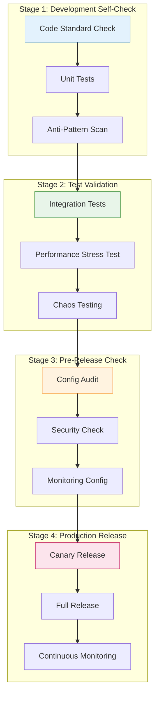
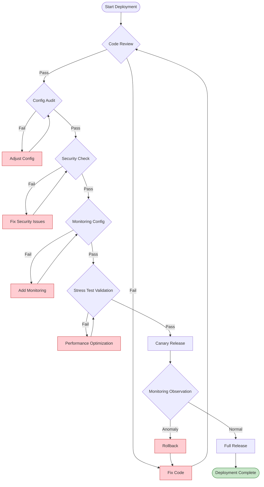
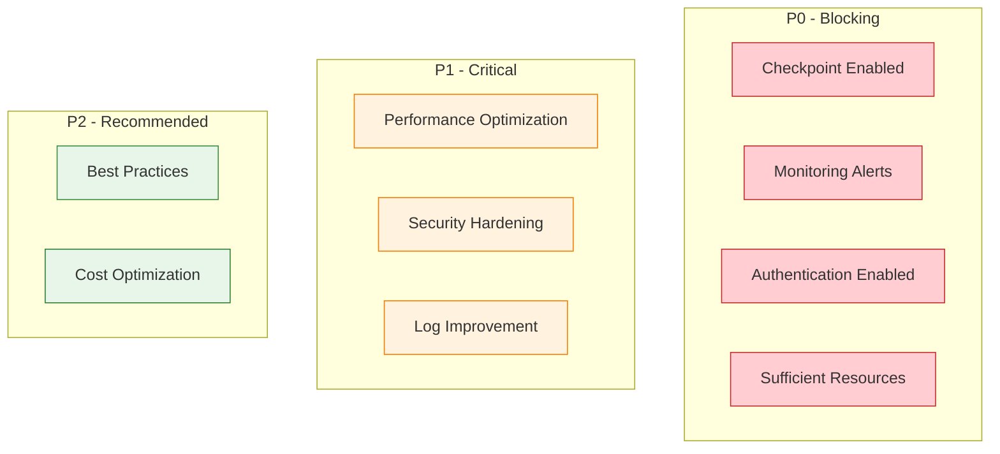

# Flink Production Deployment Checklist

> **Stage**: Knowledge/07-best-practices | **Prerequisites**: [Knowledge/09-anti-patterns/anti-pattern-checklist.md](../09-anti-patterns/anti-pattern-checklist.md) | **Formalization Level**: L3
>
> This checklist provides a complete inspection flow for Flink jobs from development to production deployment, ensuring stable operation in production environments.

---

## Table of Contents

- [Flink Production Deployment Checklist](#flink-production-deployment-checklist)
  - [Table of Contents](#table-of-contents)
  - [1. Definitions](#1-definitions)
  - [2. Properties](#2-properties)
  - [3. Relations](#3-relations)
    - [3.1 Relationship with Anti-Pattern Detection](#31-relationship-with-anti-pattern-detection)
    - [3.2 Inspection Stage Dependencies](#32-inspection-stage-dependencies)
  - [4. Argumentation](#4-argumentation)
    - [4.1 Inspection Priority Argument](#41-inspection-priority-argument)
    - [4.2 Inspection Frequency Argument](#42-inspection-frequency-argument)
  - [5. Checklist Details](#5-checklist-details)
    - [5.1 Configuration Checks](#51-configuration-checks)
      - [5.1.1 Checkpoint Configuration Checklist](#511-checkpoint-configuration-checklist)
      - [5.1.2 Watermark Configuration Checklist](#512-watermark-configuration-checklist)
      - [5.1.3 Resource Configuration Checklist](#513-resource-configuration-checklist)
    - [5.2 Monitoring Checks](#52-monitoring-checks)
      - [5.2.1 Basic Monitoring Checklist](#521-basic-monitoring-checklist)
      - [5.2.2 Log Checklist](#522-log-checklist)
    - [5.3 Security Review](#53-security-review)
      - [5.3.1 Authentication \& Authorization Checklist](#531-authentication--authorization-checklist)
      - [5.3.2 Data Security Checklist](#532-data-security-checklist)
      - [5.3.3 Audit Log Checklist](#533-audit-log-checklist)
    - [5.4 Performance Validation](#54-performance-validation)
      - [5.4.1 Stress Test Checklist](#541-stress-test-checklist)
  - [6. Examples](#6-examples)
    - [6.1 Complete Deployment Check Flow](#61-complete-deployment-check-flow)
    - [6.2 Configuration Template Library](#62-configuration-template-library)
  - [7. Visualizations](#7-visualizations)
    - [7.1 Deployment Check Flowchart](#71-deployment-check-flowchart)
    - [7.2 Checklist Priority Matrix](#72-checklist-priority-matrix)
  - [8. References](#8-references)

---

## 1. Definitions

**Definition (Def-K-07-01)**: Production Deployment Checklist

> A production deployment checklist is a systematic set of validation steps used to ensure that a Flink job meets stability, reliability, security, and performance requirements before being deployed to production.

**Formal Description**:

Let the checklist be $C = \{c_1, c_2, ..., c_n\}$, where each item $c_i = (category, priority, check_fn, remediation)$ contains:

- **category**: Check category (Configuration/Monitoring/Security/Performance)
- **priority**: Priority (P0-Blocking/P1-Critical/P2-Recommended)
- **check_fn**: Validation function returning a boolean
- **remediation**: Fix plan

$$ProductionReady(Job) \iff \forall c_i \in C_{P0} : check_fn(c_i, Job) = true$$

**Production Readiness Standards** [^1][^2]:

| Dimension | Minimum Requirement | Recommended Standard |
|-----------|---------------------|----------------------|
| **Availability** | Checkpoint success rate > 95% | > 99.9% |
| **Latency** | p99 processing latency < SLA × 2 | < SLA × 1.5 |
| **Accuracy** | No data loss | Exactly-Once semantics |
| **Observability** | Basic metric monitoring | Full-link tracing |
| **Security** | Authentication enabled | End-to-end encryption |

---

## 2. Properties

**Proposition (Prop-K-07-01)**: Correct configuration implies stability

> If all P0-level configuration checks pass, the job can recover within RTO under failure scenarios.

**Derivation Process**:

1. **Checkpoint configuration correctness** → State recoverable
   - Interval ≤ RTO/2, ensuring the data loss window is within tolerance
   - Timeout ≥ typical duration × 2, avoiding false failure alerts

2. **State backend configuration correctness** → State persistable
   - RocksDB incremental Checkpoint → Reduces network and storage pressure
   - Local recovery enabled → Reduces recovery time

3. **Resource configuration correctness** → Runtime predictable
   - Managed memory ≥ estimated state × 1.5 → Avoids OOM
   - Sufficient network buffers → Avoids backpressure cascading

**Lemma (Lemma-K-07-01)**: Monitoring completeness

> Complete monitoring coverage can detect over 95% of potential failures.

Three Pillars of Monitoring [^3]:

| Pillar | Key Metrics | Detection Capability |
|--------|-------------|----------------------|
| **Metrics** | Throughput, latency, backpressure | Performance degradation, bottlenecks |
| **Logs** | Error logs, exception stacks | Logic errors, system failures |
| **Traces** | End-to-end latency distribution | Latency root cause localization |

---

## 3. Relations

### 3.1 Relationship with Anti-Pattern Detection

```
┌─────────────────────────────────────────────────────────────────────┐
│                  Checklist and Anti-Pattern Mapping                 │
├─────────────────────────────────────────────────────────────────────┤
│                                                                     │
│  Production Checklist              Anti-Pattern Detection           │
│  ─────────────────             ─────────────────                    │
│                                                                     │
│  Config Check ───────────────► AP-02 Watermark Config Error         │
│         │                                                           │
│         ├────────────────────► AP-03 Checkpoint Interval Improper   │
│         │                                                           │
│         └────────────────────► AP-10 Insufficient Resource Config   │
│                                                                     │
│  Code Review ────────────────► AP-01 Global State Abuse             │
│         │                                                           │
│         ├────────────────────► AP-05 Blocking I/O                   │
│         │                                                           │
│         └────────────────────► AP-06 Serialization Config Error     │
│                                                                     │
│  Monitoring Check ───────────► AP-04 Data Skew                      │
│         │                                                           │
│         └────────────────────► AP-08 Backpressure Ignored           │
│                                                                     │
└─────────────────────────────────────────────────────────────────────┘
```

### 3.2 Inspection Stage Dependencies



---

## 4. Argumentation

### 4.1 Inspection Priority Argument

**Why must all P0 checks pass?**

| P0 Check Item | Failure Consequence | Business Impact |
|---------------|---------------------|-----------------|
| Checkpoint not enabled | State loss on failure | Data inconsistency, full replay required |
| No monitoring alerts | Failures not detected in time | Extended business interruption |
| Password stored in plaintext | Security risk | Data breach, compliance penalties |
| Severely insufficient resources | Frequent OOM | Service unavailable |

**Why are P1/P2 partial failures allowed?**

- P1 items affect performance or operational efficiency, but can be improved later
- P2 items are best-practice recommendations that do not affect basic functionality

### 4.2 Inspection Frequency Argument

| Check Type | Frequency | Trigger Condition |
|------------|-----------|-------------------|
| **Automated Checks** | Every build | CI/CD pipeline |
| **Manual Review** | Every release | Code changes > 100 lines |
| **Routine Patrol** | Weekly | Scheduled task |
| **Special Inspection** | On-demand | Post-mortem, architecture upgrade |

---

## 5. Checklist Details

### 5.1 Configuration Checks

#### 5.1.1 Checkpoint Configuration Checklist

| Check Item | Priority | Check Method | Pass Criteria | Fix Recommendation |
|------------|----------|--------------|---------------|--------------------|
| **Enable Checkpoint** | P0 | Code review | `env.enableCheckpointing()` called | Add Checkpoint configuration |
| **Interval Config** | P0 | Config audit | RTO/5 ≤ interval ≤ RTO/2 | Calculate based on RTO |
| **Timeout Config** | P0 | Config audit | timeout ≥ typical duration × 2 | Refer to historical data |
| **Min Pause** | P1 | Config audit | minPause ≥ checkpoint duration | Avoid Checkpoint pile-up |
| **Max Concurrent** | P1 | Config audit | maxConcurrent ≤ 1 (unless special needs) | Default 1 |
| **Incremental Checkpoint** | P1 | Config audit | Enabled when state > 1GB | Reduce storage pressure |
| **Externalized Cleanup** | P1 | Config audit | Configured as RETAIN_ON_CANCELLATION | Prevent accidental deletion |
| **Unaligned Checkpoint** | P2 | Config audit | Consider enabling under high backpressure | Reduce checkpoint time |

**Configuration Example** [^1]:

```java
// ✅ Recommended configuration template
env.enableCheckpointing(60000); // 1 minute interval
env.getCheckpointConfig().setCheckpointTimeout(300000); // 5 minute timeout
env.getCheckpointConfig().setMinPauseBetweenCheckpoints(30000); // 30s min pause
env.getCheckpointConfig().setMaxConcurrentCheckpoints(1);
env.getCheckpointConfig().enableExternalizedCheckpoints(
    ExternalizedCheckpointCleanup.RETAIN_ON_CANCELLATION
);

// State backend configuration
env.setStateBackend(new EmbeddedRocksDBStateBackend(true)); // Incremental Checkpoint
env.getCheckpointConfig().setCheckpointStorage("hdfs:///checkpoints");
```

#### 5.1.2 Watermark Configuration Checklist

| Check Item | Priority | Check Method | Pass Criteria | Fix Recommendation |
|------------|----------|--------------|---------------|--------------------|
| **Watermark Generation** | P0 | Code review | All streams assign Watermark | Add Watermark strategy |
| **Out-of-Order Delay** | P0 | Config audit | Based on p99 out-of-order delay + 20% margin | Measure source latency |
| **Idleness Timeout** | P1 | Code review | Configure withIdleness for multi-stream scenarios | Avoid window stalls |
| **Late Data Handling** | P1 | Code audit | Configure allowedLateness | Based on business needs |

**Configuration Example** [^4]:

```java

import org.apache.flink.streaming.api.datastream.DataStream;
import org.apache.flink.streaming.api.windowing.time.Time;

// ✅ Recommended Watermark configuration
DataStream<Event> withWatermark = stream
    .assignTimestampsAndWatermarks(
        WatermarkStrategy
            .<Event>forBoundedOutOfOrderness(Duration.ofSeconds(30))
            .withIdleness(Duration.ofMinutes(2))
    );

// Window configuration
withWatermark
    .keyBy(Event::getUserId)
    .window(TumblingEventTimeWindows.of(Time.minutes(1)))
    .allowedLateness(Time.minutes(5))
    .sideOutputLateData(lateTag);
```

#### 5.1.3 Resource Configuration Checklist

| Check Item | Priority | Check Method | Pass Criteria | Fix Recommendation |
|------------|----------|--------------|---------------|--------------------|
| **TaskManager Memory** | P0 | Config audit | Total memory ≥ (managed memory + 2GB + network memory) × 1.2 | Recalculate |
| **Managed Memory** | P0 | Config audit | ≥ estimated state size / parallelism × 1.5 | Increase memory |
| **Network Memory** | P1 | Config audit | ≥ min(parallelism × 64MB, 1GB) | Adjust ratio |
| **JVM Heap** | P1 | Config audit | ≥ max(managed memory × 0.5, 2GB) | Adjust ratio |
| **Managed Memory Fraction** | P1 | Config audit | > 0.5 for state-intensive jobs | Adjust fraction |

**Resource Configuration Calculation Formula** [^2]:

```yaml
# Resource configuration calculation template
estimated:
  state_size_gb: 100          # Estimated total state size
  parallelism: 20             # Parallelism
  state_per_subtask_gb: 5     # 100/20

calculated:
  managed_memory_per_tm: 7.5gb  # 5 * 1.5
  jvm_heap_min: 2gb
  network_memory: 1gb
  safety_factor: 1.2

  # TaskManager total memory = (7.5 + 2 + 1) * 1.2 ≈ 13GB
  total_tm_memory: 13gb

flink_conf:
  taskmanager.memory.process.size: 13gb
  taskmanager.memory.managed.fraction: 0.6  # 7.5/13 ≈ 0.58
```

### 5.2 Monitoring Checks

#### 5.2.1 Basic Monitoring Checklist

| Check Item | Priority | Check Method | Pass Criteria | Alert Rule |
|------------|----------|--------------|---------------|------------|
| **Checkpoint Success Rate** | P0 | Monitoring config | Success rate > 95% | Alert after 3 consecutive failures |
| **Checkpoint Duration** | P0 | Monitoring config | < timeout × 0.8 | Alert if sustained > 60s |
| **Backpressure Time** | P0 | Monitoring config | < 200ms/s | > 200ms/s sustained for 5min |
| **Latency (Watermark)** | P0 | Monitoring config | < configured max out-of-order delay | Sustained > threshold |
| **Job Failure** | P0 | Monitoring config | No failures | Immediate alert |
| **Data Skew** | P1 | Monitoring config | Max/min subtask ratio < 5 | Alert if ratio > 5 |
| **GC Time** | P1 | Monitoring config | < 10% of CPU time | Alert if > 10% |
| **Memory Usage** | P1 | Monitoring config | Managed memory < 90% | Alert if > 90% |

**Prometheus Alert Configuration** [^5]:

```yaml
groups:
  - name: flink_critical
    rules:
      # P0: Checkpoint failure
      - alert: FlinkCheckpointFailed
        expr: flink_jobmanager_checkpoint_numberOfFailedCheckpoints - flink_jobmanager_checkpoint_numberOfFailedCheckpoints offset 5m > 0
        for: 1m
        labels:
          severity: critical
        annotations:
          summary: "Flink Checkpoint Failed"
          description: "Job {{ $labels.job_name }} Checkpoint failed"

      # P0: High backpressure
      - alert: FlinkHighBackpressure
        expr: flink_taskmanager_job_task_backPressuredTimeMsPerSecond > 200
        for: 5m
        labels:
          severity: critical
        annotations:
          summary: "Flink Task Backpressure Too High"

      # P1: Data skew
      - alert: FlinkDataSkew
        expr: |
          max by (task_name) (flink_taskmanager_job_task_numRecordsInPerSecond)
          /
          min by (task_name) (flink_taskmanager_job_task_numRecordsInPerSecond) > 5
        for: 10m
        labels:
          severity: warning
        annotations:
          summary: "Flink Data Skew"

      # P1: Memory pressure
      - alert: FlinkMemoryPressure
        expr: flink_taskmanager_Status_JVM_Memory_Heap_Used / flink_taskmanager_Status_JVM_Memory_Heap_Committed > 0.85
        for: 5m
        labels:
          severity: warning
        annotations:
          summary: "Flink Memory Usage Too High"
```

#### 5.2.2 Log Checklist

| Check Item | Priority | Check Method | Pass Criteria |
|------------|----------|--------------|---------------|
| **Log Collection** | P0 | Config audit | Logs sent to centralized system (ELK/Fluentd) |
| **Log Level** | P1 | Config audit | INFO in production, DEBUG for troubleshooting |
| **Exception Catching** | P0 | Code review | All exceptions are caught and logged |
| **Context Info** | P1 | Code review | Error logs contain sufficient context |

```java
// ✅ Recommended logging practice
private static final Logger LOG = LoggerFactory.getLogger(MyFunction.class);

@Override
public void processElement(Event event, Context ctx, Collector<Result> out) {
    try {
        // Processing logic
    } catch (ValidationException e) {
        // Log sufficient context information
        LOG.error("Event processing failed - key: {}, eventId: {}, error: {}",
            ctx.getCurrentKey(),
            event.getId(),
            e.getMessage(),
            e);

        // Send to side output
        ctx.output(invalidEventsTag, new InvalidEvent(event, e.getMessage()));
    }
}
```

### 5.3 Security Review

#### 5.3.1 Authentication & Authorization Checklist

| Check Item | Priority | Check Method | Pass Criteria | Fix Recommendation |
|------------|----------|--------------|---------------|--------------------|
| **Web UI Authentication** | P0 | Config audit | Authentication enabled | Configure secure authentication |
| **RPC Authentication** | P0 | Config audit | Intra-cluster RPC encrypted | Enable SASL/Kerberos |
| **REST API Authentication** | P0 | Config audit | SSL/TLS enabled | Configure HTTPS |
| **Kerberos Integration** | P1 | Config audit | Integrated with HDFS/Yarn | Configure keytab |
| **Service Account** | P1 | Config audit | Use dedicated service accounts | Avoid root |

**Security Configuration Example** [^6]:

```yaml
# flink-conf.yaml security configuration

# Web UI authentication
security.ssl.rest.enabled: true
security.ssl.rest.keystore: /path/to/server.keystore
security.ssl.rest.keystore-password: ${KEYSTORE_PASSWORD}
security.ssl.rest.key-password: ${KEY_PASSWORD}

# Internal communication encryption
security.ssl.internal.enabled: true
security.ssl.internal.keystore: /path/to/internal.keystore
security.ssl.internal.truststore: /path/to/internal.truststore

# Kerberos authentication
security.kerberos.login.keytab: /etc/security/keytabs/flink.keytab
security.kerberos.login.principal: flink@EXAMPLE.COM
security.kerberos.login.use-ticket-cache: false
```

#### 5.3.2 Data Security Checklist

| Check Item | Priority | Check Method | Pass Criteria | Fix Recommendation |
|------------|----------|--------------|---------------|--------------------|
| **Sensitive Data Masking** | P0 | Code review | No sensitive info in logs | Use masking tools |
| **Config File Encryption** | P1 | Config audit | Passwords use encrypted storage | Use KeyVault |
| **Transmission Encryption** | P1 | Config audit | Kafka/HDFS use encrypted connections | Enable SSL |
| **Data-at-Rest Encryption** | P2 | Config audit | Checkpoint/Savepoint encrypted | Enable encryption |

#### 5.3.3 Audit Log Checklist

| Check Item | Priority | Check Method | Pass Criteria |
|------------|----------|--------------|---------------|
| **Job Submission Audit** | P1 | Config audit | Record submitter, time, configuration |
| **Checkpoint Audit** | P1 | Monitoring check | Record Checkpoint metadata |
| **Config Change Audit** | P1 | Process check | Config changes are approved |

### 5.4 Performance Validation

#### 5.4.1 Stress Test Checklist

| Check Item | Priority | Check Method | Pass Criteria |
|------------|----------|--------------|---------------|
| **Throughput Test** | P0 | Stress test execution | Reach expected TPS × 1.5 |
| **Latency Test** | P0 | Stress test execution | p99 latency < SLA |
| **Failure Recovery Test** | P0 | Chaos engineering | Recover within RTO, no data loss |
| **Scale-Out Test** | P1 | Stress test execution | Linear throughput growth after scaling |
| **Long Tail Test** | P1 | Stress test execution | Stable long-duration operation |

**Stress Test Script Template**:

```bash
#!/bin/bash
# Flink job stress test script

FLINK_URL="http://localhost:8081"
JOB_JAR="target/my-job.jar"
TEST_DURATION=3600  # 1 hour

# 1. Submit job
echo "Submitting job..."
JOB_ID=$(curl -X POST "$FLINK_URL/jars/upload" -F "jarfile=@$JOB_JAR" | jq -r '.filename' | xargs curl -X POST "$FLINK_URL/jars/{}/run" | jq -r '.jobid')

echo "Job ID: $JOB_ID"

# 2. Monitor metrics
for i in $(seq 1 $((TEST_DURATION / 60))); do
    sleep 60

    # Get throughput
    THROUGHPUT=$(curl -s "$FLINK_URL/jobs/$JOB_ID/vertices" | jq '[.vertices[].metrics.readRecords | tonumber] | add')

    # Get latency
    LATENCY=$(curl -s "$FLINK_URL/jobs/$JOB_ID" | jq '.vertices[] | select(.name | contains("Sink")) | .metrics.latency')

    # Get backpressure
    BACKPRESSURE=$(curl -s "$FLINK_URL/jobs/$JOB_ID/vertices" | jq '[.vertices[].metrics.backPressuredTimeMsPerSecond | tonumber] | max')

    echo "[$i min] Throughput: $THROUGHPUT records/s, Latency: ${LATENCY:-N/A} ms, Backpressure: ${BACKPRESSURE} ms"
done

# 3. Cleanup
curl -X PATCH "$FLINK_URL/jobs/$JOB_ID" -d '{"cancel-job": true}'
```

---

## 6. Examples

### 6.1 Complete Deployment Check Flow

**Scenario**: E-commerce real-time recommendation job deployment

**Job Information**:

- Input: Kafka (user behavior events, peak 100K/s)
- Processing: User profile update + real-time recommendation computation
- Output: Redis (recommendation results)
- State: User profiles (estimated 50GB)

**Check Execution Record**:

```
=================================================================
Flink Job Deployment Check Report
Job Name: realtime-recommendation-v2.3
Check Time: 2026-04-03 14:30:00
Checked By: platform-team
=================================================================

[✓] Stage 1: Code Review (15/15 passed)
    ✓ AP-01 Global state check: No static variable usage
    ✓ AP-05 Blocking I/O check: Uses AsyncFunction
    ✓ AP-06 Serialization check: All types registered with Kryo
    ...

[✓] Stage 2: Config Audit (12/12 passed)
    ✓ Checkpoint interval: 60s (RTO=300s, meets RTO/5)
    ✓ Checkpoint timeout: 300s
    ✓ Incremental Checkpoint: Enabled
    ✓ Watermark out-of-order delay: 30s (p99=25s)
    ✓ Managed memory: 8GB (estimated state 5GB × 1.5)
    ...

[✓] Stage 3: Security Check (8/8 passed)
    ✓ Web UI authentication: Enabled
    ✓ RPC encryption: Enabled
    ✓ Sensitive data masking: Confirmed
    ...

[✓] Stage 4: Monitoring Check (10/10 passed)
    ✓ Checkpoint monitoring: Alert configured
    ✓ Backpressure monitoring: Alert configured
    ✓ Latency monitoring: Alert configured
    ...

[✓] Stage 5: Stress Test Validation (6/6 passed)
    ✓ Throughput: 150K/s (target 100K/s × 1.5)
    ✓ p99 latency: 120ms (SLA 200ms)
    ✓ Failure recovery: 45s (RTO 300s)
    ✓ Long-duration run: 24h stable

=================================================================
Conclusion: All checks passed, ready for deployment
Recommendation: Monitor continuously for the first 48 hours after deployment
=================================================================
```

### 6.2 Configuration Template Library

**Template 1: Low-Latency Scenario** (Latency-sensitive)

```java
// For: risk control, real-time bidding, and other latency-sensitive scenarios
env.enableCheckpointing(10000);  // 10s interval
env.getCheckpointConfig().setCheckpointTimeout(60000);
env.getCheckpointConfig().setMinPauseBetweenCheckpoints(5000);
env.setStateBackend(new HashMapStateBackend());  // In-memory state
env.getCheckpointConfig().setCheckpointStorage("hdfs:///checkpoints");
```

**Template 2: Large-State Scenario** (State-intensive)

```java
// For: long time windows, complex stateful computations
env.enableCheckpointing(300000);  // 5min interval
env.getCheckpointConfig().setCheckpointTimeout(600000);
env.setStateBackend(new EmbeddedRocksDBStateBackend(true));
env.getCheckpointConfig().setCheckpointStorage("hdfs:///checkpoints");

// Configure State TTL
StateTtlConfig ttlConfig = StateTtlConfig
    .newBuilder(Time.days(7))
    .setUpdateType(StateTtlConfig.UpdateType.OnCreateAndWrite)
    .setStateVisibility(StateTtlConfig.StateVisibility.NeverReturnExpired)
    .build();
stateDescriptor.enableTimeToLive(ttlConfig);
```

---

## 7. Visualizations

### 7.1 Deployment Check Flowchart



### 7.2 Checklist Priority Matrix



---

## 8. References

[^1]: Apache Flink Documentation, "Checkpoints," 2025. <https://nightlies.apache.org/flink/flink-docs-stable/docs/dev/datastream/fault-tolerance/checkpointing/>

[^2]: Apache Flink Documentation, "Configuration," 2025. <https://nightlies.apache.org/flink/flink-docs-stable/docs/deployment/config/>

[^3]: Beyer, B. et al., "Site Reliability Engineering," O'Reilly Media, 2016. <https://sre.google/sre-book/table-of-contents/>

[^4]: Apache Flink Documentation, "Timestamps and Watermarks," 2025. <https://nightlies.apache.org/flink/flink-docs-stable/docs/concepts/time/>

[^5]: Apache Flink Documentation, "Metrics," 2025. <https://nightlies.apache.org/flink/flink-docs-stable/docs/ops/metrics/>

[^6]: Apache Flink Documentation, "Security," 2025. <https://nightlies.apache.org/flink/flink-docs-stable/docs/deployment/security/>

---

*Document Version: v1.0 | Updated: 2026-04-03 | Status: Completed*
