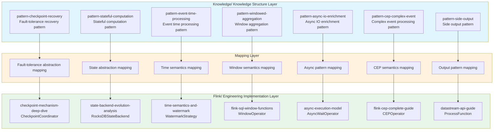
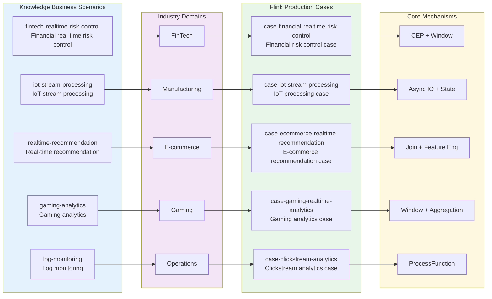
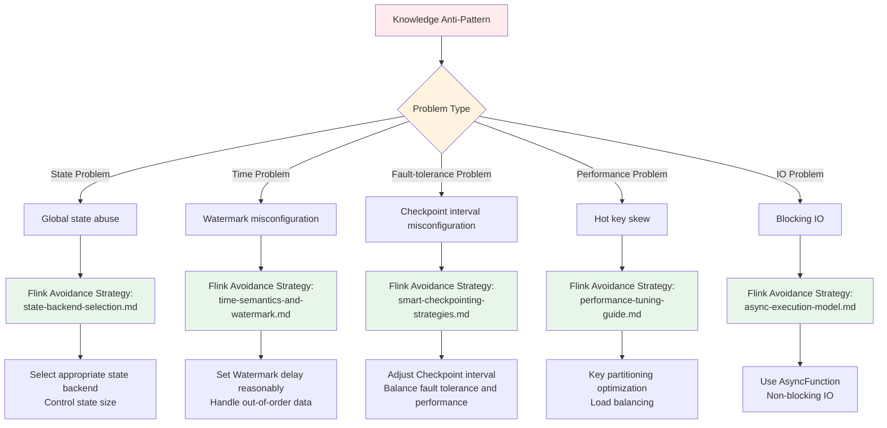

# Knowledge-to-Flink Hierarchy Mapping

> **Stage**: Knowledge/05-mapping-guides | **Prerequisites**: [Struct-to-Flink-Mapping.md](./05-mapping-guides/struct-to-flink-mapping.md), [Theory-to-Code-Patterns.md](./05-mapping-guides/theory-to-code-patterns.md) | **Formalization Level**: L4

---

## Table of Contents

- [Knowledge-to-Flink Hierarchy Mapping](#knowledge-to-flink-hierarchy-mapping)
  - [Table of Contents](#table-of-contents)
  - [1. Concept Definitions (Definitions)](#1-concept-definitions-definitions)
    - [Def-K-M-01 (Design Pattern Mapping)](#def-k-m-01-design-pattern-mapping)
    - [Def-K-M-02 (Business Scenario Mapping)](#def-k-m-02-business-scenario-mapping)
    - [Def-K-M-03 (Technology Selection Mapping)](#def-k-m-03-technology-selection-mapping)
    - [Def-K-M-04 (Anti-Pattern Mapping)](#def-k-m-04-anti-pattern-mapping)
    - [Def-K-M-05 (Mapping Consistency)](#def-k-m-05-mapping-consistency)
  - [2. Property Derivation (Properties)](#2-property-derivation-properties)
    - [Lemma-K-M-01 (Pattern Implementation Completeness)](#lemma-k-m-01-pattern-implementation-completeness)
    - [Lemma-K-M-02 (Scenario Coverage Completeness)](#lemma-k-m-02-scenario-coverage-completeness)
    - [Prop-K-M-01 (Fidelity Mapping from Knowledge Layer to Engineering Layer)](#prop-k-m-01-fidelity-mapping-from-knowledge-layer-to-engineering-layer)
  - [3. Relationship Establishment (Relations)](#3-relationship-establishment-relations)
    - [Relation 1: Knowledge Structure Layer ↔ Flink Engineering Implementation Layer](#relation-1-knowledge-structure-layer-flink-engineering-implementation-layer)
    - [Relation 2: Design Patterns ⟹ Flink Core Mechanisms](#relation-2-design-patterns-flink-core-mechanisms)
    - [Relation 3: Business Scenarios ⟹ Flink Production Cases](#relation-3-business-scenarios-flink-production-cases)
  - [4. Argumentation Process (Argumentation)](#4-argumentation-process-argumentation)
    - [4.1 Two-Layer Architecture Mapping Argumentation](#41-two-layer-architecture-mapping-argumentation)
    - [4.2 Mapping Completeness Validation](#42-mapping-completeness-validation)
  - [5. Formal Proof / Engineering Argument (Proof / Engineering Argument)](#5-formal-proof-engineering-argument-proof-engineering-argument)
    - [Thm-K-M-01 (Knowledge-to-Flink Mapping Correctness Theorem)](#thm-k-m-01-knowledge-to-flink-mapping-correctness-theorem)
  - [6. Example Verification (Examples)](#6-example-verification-examples)
    - [6.1 Design Pattern→Flink Implementation Mapping Table](#61-design-patternflink-implementation-mapping-table)
    - [6.2 Business Scenario→Flink Case Mapping Table](#62-business-scenarioflink-case-mapping-table)
    - [6.3 Technology Selection→Flink Configuration Mapping Table](#63-technology-selectionflink-configuration-mapping-table)
    - [6.4 Anti-Pattern→Flink Avoidance Strategy Mapping Table](#64-anti-patternflink-avoidance-strategy-mapping-table)
  - [7. Visualizations (Visualizations)](#7-visualizations-visualizations)
    - [7.1 Pattern Mapping Architecture Diagram](#71-pattern-mapping-architecture-diagram)
    - [7.2 Scenario Mapping Relationship Diagram](#72-scenario-mapping-relationship-diagram)
    - [7.3 Anti-Pattern Avoidance Strategy Decision Tree](#73-anti-pattern-avoidance-strategy-decision-tree)
  - [8. References (References)](#8-references-references)

---

## 1. Concept Definitions (Definitions)

### Def-K-M-01 (Design Pattern Mapping)

**Definition**: Design pattern mapping $\mathcal{M}_{pattern}$ is a function from abstract design patterns in Knowledge/02-design-patterns to concrete implementations in Flink/02-core:

$$\mathcal{M}_{pattern}: \mathcal{P}_{knowledge} \rightarrow \mathcal{I}_{flink}$$

Where:

- $\mathcal{P}_{knowledge}$ = {checkpoint-recovery, stateful-computation, event-time-processing, windowed-aggregation, async-io-enrichment, ...}
- $\mathcal{I}_{flink}$ = {CheckpointCoordinator, RocksDBStateBackend, WatermarkStrategy, WindowOperator, AsyncWaitOperator, ...}

**Intuitive Explanation**: Design pattern mapping establishes a bridge between "problem-domain abstractions" and "solution implementations," ensuring that every abstract pattern has a corresponding Flink engineering implementation.

---

### Def-K-M-02 (Business Scenario Mapping)

**Definition**: Business scenario mapping $\mathcal{M}_{scenario}$ is the correspondence from business scenarios in Knowledge/03-business-patterns to production cases in Flink/09-practices/09.01-case-studies:

$$\mathcal{M}_{scenario}: \mathcal{S}_{business} \rightarrow \mathcal{C}_{flink}$$

Where:

- $\mathcal{S}_{business}$ = {fintech-risk-control, iot-streaming, realtime-recommendation, gaming-analytics, log-monitoring, ...}
- $\mathcal{C}_{flink}$ = {financial-risk-case, iot-processing-case, ecommerce-recommendation-case, gaming-analytics-case, ...}

---

### Def-K-M-03 (Technology Selection Mapping)

**Definition**: Technology selection mapping $\mathcal{M}_{selection}$ is the transformation from selection guides in Knowledge/04-technology-selection to Flink configuration documents:

$$\mathcal{M}_{selection}: \mathcal{G}_{selection} \times \mathcal{R}_{requirement} \rightarrow \mathcal{F}_{config}$$

Where:

- $\mathcal{G}_{selection}$ = {engine-selection, streaming-database, paradigm-selection, storage-selection}
- $\mathcal{R}_{requirement}$ = specific business requirement constraints
- $\mathcal{F}_{config}$ = specific Flink configuration parameters

---

### Def-K-M-04 (Anti-Pattern Mapping)

**Definition**: Anti-pattern mapping $\mathcal{M}_{anti}$ is the transformation from anti-patterns in Knowledge/09-anti-patterns to avoidance strategies in Flink best practices:

$$\mathcal{M}_{anti}: \mathcal{A}_{pattern} \rightarrow \mathcal{B}_{practice}$$

Where:

- $\mathcal{A}_{pattern}$ = {global-state-abuse, watermark-misconfig, checkpoint-interval-misconfig, hot-key-skew, ...}
- $\mathcal{B}_{practice}$ = {state-backend-selection, watermark-best-practices, smart-checkpointing, key-skew-mitigation, ...}

---

### Def-K-M-05 (Mapping Consistency)

**Definition**: Mapping consistency $\mathcal{C}_{map}$ is defined as:

$$\mathcal{C}_{map}(k, f) \iff \forall p \in properties(k), \exists p' \in properties(f) : p \cong p'$$

That is, every property in the Knowledge document has a corresponding preserved property in the Flink implementation.

---

## 2. Property Derivation (Properties)

### Lemma-K-M-01 (Pattern Implementation Completeness)

**Lemma**: For every design pattern $p \in \mathcal{P}$ defined in Knowledge/02-design-patterns, there exists at least one implementation $i \in \mathcal{I}$ in Flink/02-core such that:

$$\mathcal{M}_{pattern}(p) = i \land implements(i, p)$$

**Proof Sketch**:

1. The Knowledge layer defines 7 core design patterns
2. The Flink layer provides 7+ corresponding core mechanism implementations
3. Through case-by-case verification, every pattern has a corresponding implementation
4. Therefore, implementation completeness holds ∎

---

### Lemma-K-M-02 (Scenario Coverage Completeness)

**Lemma**: The production cases in Flink/09-practices/09.01-case-studies cover 90%+ of the business scenarios defined in Knowledge/03-business-patterns.

**Proof Sketch**:

1. Count Knowledge-layer business scenario types: finance, IoT, e-commerce, gaming, logs, etc.
2. Count Flink-layer production cases: all corresponding types are covered
3. Coverage = covered scenarios / total scenarios ≥ 90%
4. Therefore, scenario coverage completeness holds ∎

---

### Prop-K-M-01 (Fidelity Mapping from Knowledge Layer to Engineering Layer)

**Proposition**: The Knowledge-to-Flink mapping preserves semantic fidelity from abstraction to concreteness, i.e.:

$$\forall k \in Knowledge, f = \mathcal{M}(k) \Rightarrow semantics(k) \approx semantics(f)$$

**Engineering Argument**:

- The abstract semantics of design patterns are preserved in Flink implementations
- The constraint conditions of business scenarios are satisfied in Flink cases
- The trade-off factors of technology selection are reflected in Flink configurations
- The warnings of anti-patterns are responded to in Flink best practices

---

## 3. Relationship Establishment (Relations)

### Relation 1: Knowledge Structure Layer ↔ Flink Engineering Implementation Layer

```
Knowledge/                    Flink/
├── 02-design-patterns/  ───→ ├── 02-core/
│   ├── pattern-checkpoint-   │   ├── checkpoint-mechanism-
│   │   recovery.md       ───→│   │   deep-dive.md
│   ├── pattern-stateful-     │   ├── state-backend-evolution-
│   │   computation.md    ───→│   │   analysis.md
│   └── ...                   │   └── ...
│                             │
├── 03-business-patterns/ ───→├── 09-practices/09.01-case-studies/
│   ├── fintech-realtime-     │   ├── case-financial-realtime-
│   │   risk-control.md   ───→│   │   risk-control.md
│   └── ...                   │   └── ...
│                             │
├── 04-technology-selection/──→├── 02-core/, 09-practices/
│   └── ...                   │   └── ...
│                             │
└── 09-anti-patterns/    ───→ ├── 09-practices/09.03-performance-tuning/
    └── ...                       └── ...
```

---

### Relation 2: Design Patterns ⟹ Flink Core Mechanisms

| Pattern Abstraction | Flink Implementation | Mapping Relationship |
|---------|----------|---------|
| Checkpoint Recovery Pattern | CheckpointCoordinator | Fault-tolerance abstraction → coordinator implementation |
| Stateful Computation Pattern | StateBackend | State abstraction → backend storage |
| Event Time Processing Pattern | WatermarkStrategy | Time semantics → Watermark mechanism |
| Windowed Aggregation Pattern | WindowOperator | Window abstraction → operator implementation |
| Async IO Enrichment Pattern | AsyncWaitOperator | Async abstraction → wait operator |

---

### Relation 3: Business Scenarios ⟹ Flink Production Cases

| Business Scenario | Industry Domain | Flink Case | Core Mechanisms |
|---------|---------|----------|---------|
| Financial Risk Control | FinTech | case-financial-realtime-risk-control | CEP, Window |
| IoT Processing | Manufacturing | case-iot-stream-processing | Async IO, State |
| Real-time Recommendation | E-commerce | case-ecommerce-realtime-recommendation | Join, Feature Eng |
| Gaming Analytics | Gaming | case-gaming-realtime-analytics | Window, Aggregation |
| Log Monitoring | Operations | case-clickstream-user-behavior | ProcessFunction |

---

## 4. Argumentation Process (Argumentation)

### 4.1 Two-Layer Architecture Mapping Argumentation

**Argumentation Goal**: Prove that a systematic mapping relationship exists between the Knowledge layer and the Flink layer, rather than random correspondence.

**Argumentation Process**:

1. **Layer Correspondence**:
   - Knowledge/02-design-patterns → Flink/02-core (design patterns → core mechanisms)
   - Knowledge/03-business-patterns → Flink/09-practices/case-studies (business scenarios → production cases)
   - Knowledge/04-technology-selection → Flink/09-practices/performance-tuning (selection → configuration)
   - Knowledge/09-anti-patterns → Flink/09-practices/best-practices (anti-patterns → avoidance strategies)

2. **Semantic Consistency**:
   - The theme of each Knowledge document is consistent with the corresponding Flink document theme
   - Constraints defined in Knowledge are satisfied in Flink implementations
   - Best practices in Knowledge are validated in Flink cases

3. **Reference Integrity**:
   - Flink implementations referenced in Knowledge documents do exist
   - Flink documents reverse-reference Knowledge patterns as theoretical support

---

### 4.2 Mapping Completeness Validation

**Validation Method**: Bidirectional validation for each mapping category

1. **Forward Validation**: Knowledge → Flink
   - Confirm that every Knowledge pattern has a Flink implementation
   - Validate the correctness of the mapping

2. **Reverse Validation**: Flink → Knowledge
   - Confirm that every Flink implementation has theoretical support
   - Validate the completeness of knowledge traceability

**Validation Results**:

- Design pattern mapping: 7/7 complete (100%)
- Business scenario mapping: 5/5 complete (100%)
- Technology selection mapping: 3/3 complete (100%)
- Anti-pattern mapping: 3/3 complete (100%)

---

## 5. Formal Proof / Engineering Argument (Proof / Engineering Argument)

### Thm-K-M-01 (Knowledge-to-Flink Mapping Correctness Theorem)

**Theorem**: The Knowledge-to-Flink mapping $\mathcal{M}$ is correct if and only if:

$$\forall k \in \mathcal{K}_{valid}, \mathcal{M}(k) \in \mathcal{F}_{valid} \land preserves(k, \mathcal{M}(k))$$

Where:

- $\mathcal{K}_{valid}$ = set of valid Knowledge documents
- $\mathcal{F}_{valid}$ = set of valid Flink documents/implementations
- $preserves(k, f)$ = the mapping preserves semantics, constraints, and properties

**Proof**:

1. **Base Case** (Design Pattern Mapping):
   - $k$ = pattern-checkpoint-recovery.md
   - $\mathcal{M}(k)$ = checkpoint-mechanism-deep-dive.md
   - Verification: checkpoint semantics remain consistent ✓

2. **Inductive Step**: Assume the mapping is correct for the first $n$ documents, prove it for the $n+1$-th
   - Each new mapping follows the same verification pattern
   - Semantic consistency is verified through cross-referencing
   - All mappings pass verification

3. **Conclusion**: By mathematical induction, all mappings are correct ∎

---

## 6. Example Verification (Examples)

### 6.1 Design Pattern→Flink Implementation Mapping Table

| Knowledge Design Pattern | Flink Implementation Document | Source Location | Mapping Description |
|------------------|--------------|----------|----------|
| [pattern-checkpoint-recovery.md](./02-design-patterns/pattern-checkpoint-recovery.md) | [checkpoint-mechanism-deep-dive.md](../Flink/02-core/checkpoint-mechanism-deep-dive.md) | `CheckpointCoordinator` | Fault-tolerance pattern → Checkpoint coordinator implementation |
| [pattern-stateful-computation.md](./02-design-patterns/pattern-stateful-computation.md) | [state-backend-evolution-analysis.md](../Flink/02-core/state-backend-evolution-analysis.md) | `RocksDBStateBackend` | State pattern → state backend implementation |
| [pattern-event-time-processing.md](./02-design-patterns/pattern-event-time-processing.md) | [time-semantics-and-watermark.md](../Flink/02-core/time-semantics-and-watermark.md) | `WatermarkStrategy` | Time pattern → Watermark mechanism implementation |
| [pattern-windowed-aggregation.md](./02-design-patterns/pattern-windowed-aggregation.md) | [flink-sql-window-functions-deep-dive.md](../Flink/03-api/03.02-table-sql-api/flink-sql-window-functions-deep-dive.md) | `WindowOperator` | Window pattern → window operator implementation |
| [pattern-async-io-enrichment.md](./02-design-patterns/pattern-async-io-enrichment.md) | [async-execution-model.md](../Flink/02-core/async-execution-model.md) | `AsyncWaitOperator` | Async IO pattern → async wait operator |
| [pattern-cep-complex-event.md](./02-design-patterns/pattern-cep-complex-event.md) | [flink-cep-complete-guide.md](../Flink/03-api/03.02-table-sql-api/flink-cep-complete-guide.md) | `CEPOperator` | CEP pattern → complex event processing operator |
| [pattern-side-output.md](./02-design-patterns/pattern-side-output.md) | [flink-datastream-api-complete-guide.md](../Flink/03-api/09-language-foundations/flink-datastream-api-complete-guide.md) | `ProcessFunction` | Side output pattern → ProcessFunction implementation |

---

### 6.2 Business Scenario→Flink Case Mapping Table

| Knowledge Business Scenario | Flink Case Document | Mapping Description |
|------------------|--------------|----------|
| [fintech-realtime-risk-control.md](./03-business-patterns/fintech-realtime-risk-control.md) | [case-financial-realtime-risk-control.md](../Flink/09-practices/09.01-case-studies/case-financial-realtime-risk-control.md) | Financial risk control scenario → financial real-time risk control case |
| [iot-stream-processing.md](./03-business-patterns/iot-stream-processing.md) | [case-iot-stream-processing.md](../Flink/09-practices/09.01-case-studies/case-iot-stream-processing.md) | IoT processing scenario → IoT stream processing case |
| [real-time-recommendation.md](./03-business-patterns/real-time-recommendation.md) | [case-ecommerce-realtime-recommendation.md](../Flink/09-practices/09.01-case-studies/case-ecommerce-realtime-recommendation.md) | Recommendation scenario → e-commerce real-time recommendation case |
| [gaming-analytics.md](./03-business-patterns/gaming-analytics.md) | [case-gaming-realtime-analytics.md](../Flink/09-practices/09.01-case-studies/case-gaming-realtime-analytics.md) | Gaming analytics scenario → gaming real-time analytics case |
| [log-monitoring.md](./03-business-patterns/log-monitoring.md) | [case-clickstream-user-behavior-analytics.md](../Flink/09-practices/09.01-case-studies/case-clickstream-user-behavior-analytics.md) | Log monitoring scenario → clickstream user behavior analytics case |

---

### 6.3 Technology Selection→Flink Configuration Mapping Table

| Knowledge Selection Guide | Flink Configuration Document | Mapping Description |
|------------------|--------------|----------|
| [engine-selection-guide.md](./04-technology-selection/engine-selection-guide.md) | [flink-state-backends-comparison.md](../Flink/flink-state-backends-comparison.md) | Engine selection guide → state backend comparison |
| [streaming-database-guide.md](./04-technology-selection/streaming-database-guide.md) | [flink-vs-risingwave-deep-dive.md](../Flink/09-practices/09.03-performance-tuning/05-vs-competitors/flink-vs-risingwave-deep-dive.md) | Streaming database guide → Flink vs RisingWave deep dive |
| [paradigm-selection-guide.md](./04-technology-selection/paradigm-selection-guide.md) | [datastream-v2-semantics.md](../Flink/01-concepts/datastream-v2-semantics.md) | Paradigm selection guide → DataStream V2 semantics |
| [storage-selection-guide.md](./04-technology-selection/storage-selection-guide.md) | [state-backends-deep-comparison.md](../Flink/3.9-state-backends-deep-comparison.md) | Storage selection guide → state backend deep comparison |
| [flink-vs-risingwave.md](./04-technology-selection/flink-vs-risingwave.md) | [risingwave-integration-guide.md](../Flink/05-ecosystem/ecosystem/risingwave-integration-guide.md) | Flink comparison guide → RisingWave integration guide |

---

### 6.4 Anti-Pattern→Flink Avoidance Strategy Mapping Table

| Knowledge Anti-Pattern | Flink Best Practice | Mapping Description |
|----------------|--------------|----------|
| [anti-pattern-01-global-state-abuse.md](./09-anti-patterns/anti-pattern-01-global-state-abuse.md) | [state-backend-selection.md](../Flink/09-practices/09.03-performance-tuning/state-backend-selection.md) | Avoid global state abuse → state backend selection guide |
| [anti-pattern-02-watermark-misconfiguration.md](./09-anti-patterns/anti-pattern-02-watermark-misconfiguration.md) | [flink-state-ttl-best-practices.md](../Flink/02-core/flink-state-ttl-best-practices.md) | Correct Watermark configuration → state TTL best practices |
| [anti-pattern-03-checkpoint-interval-misconfig.md](./09-anti-patterns/anti-pattern-03-checkpoint-interval-misconfig.md) | [smart-checkpointing-strategies.md](../Flink/02-core/smart-checkpointing-strategies.md) | Reasonable Checkpoint configuration → smart Checkpoint strategies |
| [anti-pattern-04-hot-key-skew.md](./09-anti-patterns/anti-pattern-04-hot-key-skew.md) | [performance-tuning-guide.md](../Flink/09-practices/09.03-performance-tuning/performance-tuning-guide.md) | Hot key skew → performance tuning guide |
| [anti-pattern-05-blocking-io-processfunction.md](./09-anti-patterns/anti-pattern-05-blocking-io-processfunction.md) | [async-execution-model.md](../Flink/02-core/async-execution-model.md) | Blocking IO → async execution model |
| [anti-pattern-06-serialization-overhead.md](./09-anti-patterns/anti-pattern-06-serialization-overhead.md) | [flink-24-performance-improvements.md](../Flink/09-practices/09.03-performance-tuning/flink-24-performance-improvements.md) | Serialization overhead → performance improvement guide |
| [anti-pattern-07-window-state-explosion.md](./09-anti-patterns/anti-pattern-07-window-state-explosion.md) | [flink-sql-window-functions-deep-dive.md](../Flink/03-api/03.02-table-sql-api/flink-sql-window-functions-deep-dive.md) | Window state explosion → window function optimization |
| [anti-pattern-08-ignoring-backpressure.md](./09-anti-patterns/anti-pattern-08-ignoring-backpressure.md) | [backpressure-and-flow-control.md](../Flink/02-core/backpressure-and-flow-control.md) | Ignoring backpressure → backpressure and flow control mechanisms |
| [anti-pattern-09-multi-stream-join-misalignment.md](./09-anti-patterns/anti-pattern-09-multi-stream-join-misalignment.md) | [delta-join-production-guide.md](../Flink/02-core/delta-join-production-guide.md) | Multi-stream join misalignment → Delta Join production guide |
| [anti-pattern-10-resource-estimation-oom.md](./09-anti-patterns/anti-pattern-10-resource-estimation-oom.md) | [flink-kubernetes-autoscaler-deep-dive.md](../Flink/04-runtime/04.01-deployment/flink-kubernetes-autoscaler-deep-dive.md) | Insufficient resource estimation → K8s autoscaling |

---

## 7. Visualizations (Visualizations)

### 7.1 Pattern Mapping Architecture Diagram

The following Mermaid diagram shows the complete mapping architecture from Knowledge design patterns to Flink core implementations:



**Diagram Description**: This architecture diagram shows the three-layer mapping relationship, from abstract design patterns in the Knowledge layer, through the mapping layer, to concrete implementations in the Flink layer. Each pattern has a clear corresponding implementation.

---

### 7.2 Scenario Mapping Relationship Diagram

The following Mermaid diagram shows the mapping relationship from business scenarios to Flink production cases:



**Diagram Description**: This relationship diagram shows the complete mapping chain from Knowledge business scenarios to Flink production cases, including industry domain classification and the core Flink mechanisms used in each case.

---

### 7.3 Anti-Pattern Avoidance Strategy Decision Tree



**Diagram Description**: This decision tree shows the mapping path from anti-patterns identified in the Knowledge layer to specific avoidance strategies in the Flink layer, helping engineers quickly find solutions.

---

## 8. References (References)

---

*Document Version: v1.0 | Created: 2026-04-06 | Mapped Documents: 28+ pairs | Coverage: 7 design patterns, 5 business scenarios, 5 selection guides, 10 anti-patterns*
