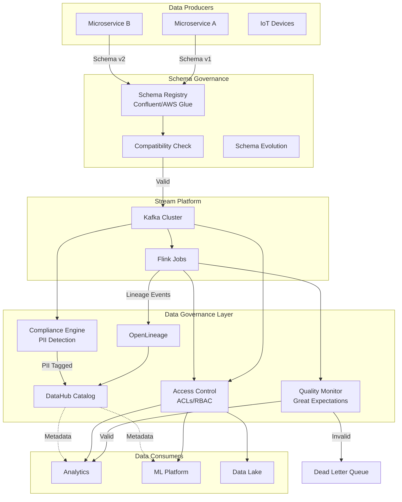
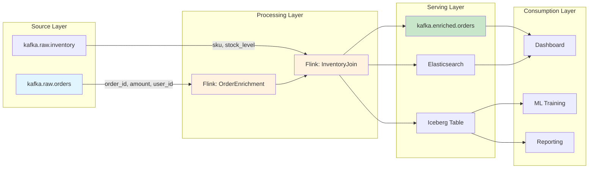
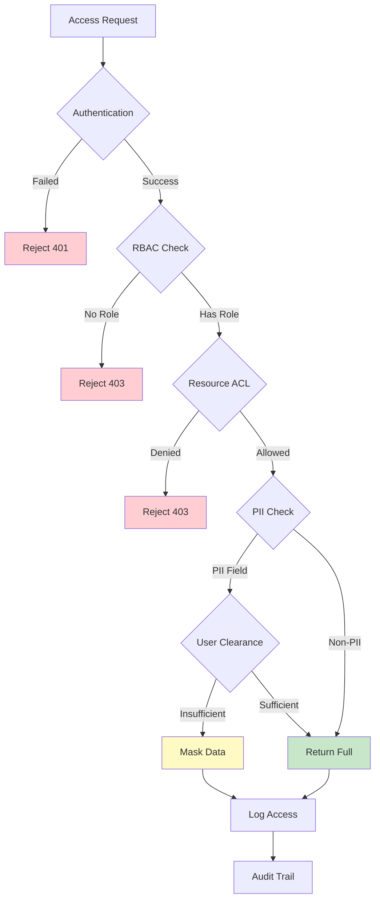
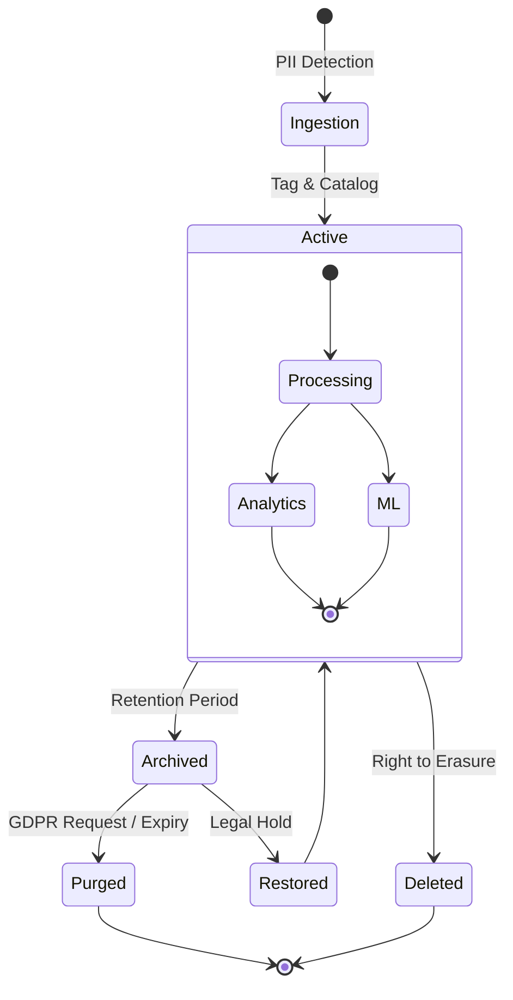

# Streaming Data Governance

> **Stage**: Knowledge | **Prerequisites**: [07-security/streaming-security-model.md](./streaming-security-compliance.md) | **Formality Level**: L4

---

## 1. Definitions

### Def-K-08-20: Streaming Data Governance

**Streaming Data Governance** is a full-lifecycle management framework for real-time data streams, comprising systematic assurance mechanisms for data **availability**, **integrity**, **security**, and **compliance**.

$$
\text{StreamingGovernance} = \langle D, S, P, A, Q, C \rangle
$$

Where:

- $D$: Data Assets
- $S$: Schema Registry
- $P$: Provenance / Lineage
- $A$: Access Control
- $Q$: Quality Monitoring
- $C$: Compliance Engine

### Def-K-08-21: Differences Between Streaming and Batch Data Governance

| Dimension | Batch Governance | Streaming Data Governance |
|-----------|------------------|---------------------------|
| **Time Granularity** | T+1 / Hour-level | Second-level / Millisecond-level |
| **Schema Changes** | Offline Coordination | Real-time Compatibility Policy |
| **Lineage Tracking** | Job-level Dependencies | Event-level Tracing |
| **Quality Validation** | Post-hoc Verification | Online Assertion |
| **Compliance Audit** | Batch Scanning | Real-time PII Detection |

### Def-K-08-22: Three Pillars of Governance

```
┌─────────────────────────────────────────────────────────────┐
│                 Streaming Data Governance Architecture        │
├─────────────────┬─────────────────┬─────────────────────────┤
│   Schema Registry │   Data Lineage   │    Access Control       │
│   Structure Gov.  │   Lineage Track. │    Access Governance    │
├─────────────────┼─────────────────┼─────────────────────────┤
│ • Avro/Protobuf  │ • Field-level lineage │ • Kafka ACLs        │
│ • JSON Schema    │ • Job dependency graph │ • RBAC Model       │
│ • Compatibility check│ • Impact analysis  │ • Data Masking     │
│ • Evolution policy│ • OpenLineage    │ • Row-level Security  │
└─────────────────┴─────────────────┴─────────────────────────┘
```

---

## 2. Properties

### Prop-K-08-12: Governance Coverage Boundary

For the governance coverage $Coverage(S)$ of a streaming data system $S$:

$$
Coverage(S) = \frac{|D_{governed}|}{|D_{total}|} \times \frac{|E_{tracked}|}{|E_{total}|}
$$

Where $E$ denotes lineage edges. In engineering practice, the coverage target is typically set to $Coverage(S) \geq 0.95$.

### Prop-K-08-13: Schema Compatibility Transitivity

If Schema $v_1 \rightarrow v_2$ is backward compatible, and $v_2 \rightarrow v_3$ is backward compatible, then $v_1 \rightarrow v_3$ is backward compatible (when ignoring default-value constraints on newly added fields).

### Prop-K-08-14: Compliance Latency Upper Bound

For GDPR "right to be forgotten" implemented in a streaming system, the compliance latency $T_{compliance}$ satisfies:

$$
T_{compliance} \leq T_{retention} + T_{propagation} + T_{checkpoint}
$$

Where:

- $T_{retention}$: Data retention period
- $T_{propagation}$: Deletion command propagation latency
- $T_{checkpoint}$: Checkpoint interval

---

## 3. Relations

### Relationship with Data Mesh

```
┌────────────────────────────────────────────────────────────────┐
│                      Data Mesh Architecture                     │
├──────────────┬──────────────┬──────────────┬───────────────────┤
│   Domain A   │   Domain B   │   Domain C   │   Platform Team    │
│   (Order)    │  (Customer)  │  (Inventory) │   (Governance)     │
├──────────────┼──────────────┼──────────────┼───────────────────┤
│ Schema Reg.  │ Schema Reg.  │ Schema Reg.  │  Global Schema      │
│  (Local)     │   (Local)    │   (Local)    │   Governance       │
├──────────────┼──────────────┼──────────────┼───────────────────┤
│ Domain ACLs  │ Domain ACLs  │ Domain ACLs  │  Federated Policy   │
│  Self-serve  │  Self-serve  │  Self-serve  │   Enforcement      │
└──────────────┴──────────────┴──────────────┴───────────────────┘
              ↑ Governance as Code (GaC)
```

### Relationship with Data Fabric

Data Fabric provides a **unified metadata layer**, while streaming data governance serves as its **real-time execution engine**:

```
┌─────────────────────────────────────────┐
│          Data Fabric Layer               │
│    (Unified Metadata / AI-driven / Auto) │
├─────────────────────────────────────────┤
│  ┌──────────┐  ┌──────────┐  ┌────────┐ │
│  │ Knowledge│  │ Semantic │  │ Active │ │
│  │  Graph   │  │  Layer   │  │Metadata│ │
│  └────┬─────┘  └────┬─────┘  └───┬────┘ │
│       └─────────────┴────────────┘       │
│                   ↓                      │
│  ┌──────────────────────────────────┐    │
│  │     Streaming Data Governance    │    │
│  │    Execution Layer               │    │
│  │  Schema | Lineage | ACL | Quality│    │
│  └──────────────────────────────────┘    │
└─────────────────────────────────────────┘
```

---

## 4. Argumentation

### Thm-K-08-15: Necessity of Streaming Data Governance

**Statement**: For a production-grade streaming data platform, the absence of governance leads to uncontrollable systemic risks.

**Argumentation**:

1. **Schema Drift Risk**:
   - Producer Schema changes $\rightarrow$ Consumer parsing failures
   - Historical data incompatible with new Schema

2. **Lineage Breakage Risk**:
   - Inability to trace root causes of data quality issues
   - Change impact scope cannot be assessed

3. **Compliance Failure Risk**:
   - Unlabeled PII data $\rightarrow$ Audit failures
   - Inability to enforce deletion rights $\rightarrow$ Legal risks

4. **Privilege Creep Risk**:
   - Lack of fine-grained ACLs $\rightarrow$ Data leakage
   - Excessive authorization $\rightarrow$ Insider threats

---

### Counterexample Analysis: Streaming System Without Governance

A certain e-commerce platform's Kafka cluster:

```
Problem Chain:
OrderService v2.1 adds field "discount_amount" (double)
         ↓
Flink job does not declare this field → Deserialization exception → Order stream interruption
         ↓
No Schema compatibility check → Production incident → 30-minute P0 outage
         ↓
No lineage tracking → Unable to locate downstream impact → Full rollback
```

**Root Cause**: Missing Schema Registry + pre-deployment compatibility policy validation.

---

## 5. Engineering Argument

### 5.1 Schema Registry Selection

#### Confluent Schema Registry

```yaml
# docker-compose.yml deployment
services:
  schema-registry:
    image: confluentinc/cp-schema-registry:7.5.0
    environment:
      SCHEMA_REGISTRY_HOST_NAME: schema-registry
      SCHEMA_REGISTRY_KAFKASTORE_BOOTSTRAP_SERVERS: kafka:9092
      SCHEMA_REGISTRY_AVRO_COMPATIBILITY_LEVEL: BACKWARD
```

**Compatibility Policies**:

| Policy | Definition | Applicable Scenario |
|--------|------------|---------------------|
| `BACKWARD` | New Schema can read old data | Consumers upgraded first |
| `FORWARD` | Old Schema can read new data | Producers upgraded first |
| `FULL` | Bidirectional compatibility | Recommended default |
| `NONE` | No checks | Emergency fixes only |

**Schema Evolution Best Practices**:

```java
// Backward compatible: add optional field + default value
{
  "type": "record",
  "name": "Order",
  "fields": [
    {"name": "order_id", "type": "string"},
    {"name": "amount", "type": "double"},
    // New field: default value ensures compatibility
    {"name": "discount", "type": ["null", "double"], "default": null}
  ]
}
```

#### AWS Glue Schema Registry

```python
# boto3 integration example
import boto3
from aws_schema_registry import SchemaRegistryClient

client = boto3.client('glue', region_name='us-east-1')
registry = SchemaRegistryClient(client, registry_name='streaming-registry')

# Register Schema
schema_version = registry.register_schema(
    schema_name='OrderEvent',
    data_format='AVRO',
    schema_definition=avro_schema_json,
    compatibility='BACKWARD_ALL'  # Check all historical versions
)
```

### 5.2 Data Lineage Implementation

#### OpenLineage Integration

```python
# Flink OpenLineage integration
from pyflink.datastream import StreamExecutionEnvironment
from openlineage.client import OpenLineageClient

env = StreamExecutionEnvironment.get_execution_environment()

# Emit lineage event
client.emit(
    RunEvent(
        eventType=RunState.START,
        eventTime=datetime.now(),
        run=Run(runId=str(uuid4())),
        job=Job(namespace="prod-flink", name="order-enrichment"),
        inputs=[
            InputDataset(namespace="kafka", name="orders-topic"),
            InputDataset(namespace="redis", name="user-cache")
        ],
        outputs=[
            OutputDataset(namespace="kafka", name="enriched-orders")
        ]
    )
)
```

#### Field-level Lineage Tracking

```sql
-- Marquez / DataHub field-level lineage
CREATE VIEW enriched_orders AS
SELECT
    o.order_id,                    -- ← orders-topic.order_id
    o.amount,                      -- ← orders-topic.amount
    u.user_segment,                -- ← user-cache.segment
    o.amount * 0.9 as final_amount -- Derived field
FROM orders o
JOIN users u ON o.user_id = u.id;

-- Lineage output:
-- final_amount → depends on: [orders.amount]
-- user_segment → depends on: [user-cache.segment]
```

### 5.3 Data Catalog Tool Comparison

| Feature | DataHub | Amundsen | Alation |
|---------|---------|----------|---------|
| **Native Streaming Support** | ⭐⭐⭐ | ⭐⭐ | ⭐⭐ |
| **OpenLineage Integration** | ✅ Native | ⚠️ Plugin | ⚠️ Enterprise Edition |
| **Field-level Lineage** | ✅ | ✅ | Enterprise Edition |
| **Real-time Metadata** | ✅ | ⚠️ | ❌ |
| **Open Source / Commercial** | Open Source | Open Source | Commercial |
| **Deployment Complexity** | Medium | Low | High |

**Recommendation**: DataHub is the preferred catalog for streaming data governance.

### 5.4 Access Control Implementation

#### Kafka ACLs

```bash
# Principal-based ACL management
# 1. Grant producer permissions
kafka-acls --bootstrap-server kafka:9092 \
  --add --allow-principal User:order-service \
  --producer --topic orders

# 2. Grant consumer group permissions
kafka-acls --bootstrap-server kafka:9092 \
  --add --allow-principal User:analytics-service \
  --consumer --topic orders --group analytics-group

# 3. Prefix matching (multi-topic authorization)
kafka-acls --bootstrap-server kafka:9092 \
  --add --allow-principal User:etl-service \
  --operation Read --topic-prefix 'raw.'
```

#### Flink SQL Permissions

```sql
-- RBAC-based Flink SQL permissions
-- Create roles
CREATE ROLE data_analyst;
CREATE ROLE data_engineer;

-- Grant table-level permissions
GRANT SELECT ON TABLE user_events TO ROLE data_analyst;
GRANT SELECT, INSERT, DELETE ON TABLE user_events TO ROLE data_engineer;

-- Row-level security (RLS)
CREATE POLICY region_isolation ON user_events
  FOR SELECT
  USING (region = CURRENT_USER_REGION());
```

### 5.5 Data Masking

```java
// Flink UDF for dynamic data masking
public class MaskPII extends ScalarFunction {
    public String eval(String value, String piiType) {
        switch (piiType) {
            case "EMAIL":
                return value.replaceAll("(?<=.{2}).(?=@)", "*");
            case "PHONE":
                return value.replaceAll("(?<=.{3}).(?=.{4})", "*");
            case "SSN":
                return "***-**-" + value.substring(7);
            default:
                return value;
        }
    }
}

// SQL usage
SELECT
    user_id,
    MaskPII(email, 'EMAIL') as email_masked,
    MaskPII(phone, 'PHONE') as phone_masked
FROM users;
```

### 5.6 Data Quality Monitoring

```python
# Great Expectations + Kafka real-time validation
from great_expectations.core import ExpectationSuite
from great_expectations.expectations import (
    ExpectColumnValuesToNotBeNull,
    ExpectColumnValuesToBeBetween,
    ExpectColumnValuesToMatchRegex
)

# Define streaming data quality rules
order_expectations = ExpectationSuite(
    name="order_event_expectations",
    expectations=[
        ExpectColumnValuesToNotBeNull(column="order_id"),
        ExpectColumnValuesToBeBetween(column="amount", min_value=0),
        ExpectColumnValuesToMatchRegex(
            column="email",
            regex=r"^[a-zA-Z0-9._%+-]+@[a-zA-Z0-9.-]+\.[a-zA-Z]{2,}$"
        )
    ]
)

# Flink integration: real-time assertion
class QualityValidator(MapFunction):
    def map(self, event):
        validation_result = self.validator.validate(event)
        if not validation_result.success:
            # Send to dead letter queue
            context.output(DEAD_LETTER_TAG, validation_result)
        return event
```

**Quality SLA Definitions**:

| Metric | Definition | Target |
|--------|------------|--------|
| Completeness | Non-null field ratio | ≥ 99.9% |
| Accuracy | Rule pass rate | ≥ 99.5% |
| Timeliness | End-to-end latency | ≤ 5s |
| Consistency | Cross-system validation consistency rate | ≥ 99.99% |

---

## 6. Examples

### Complete Governance Implementation: Financial Transaction Stream

```yaml
# Governance as Code
# governance/trade-events.yaml

schema:
  name: TradeEvent
  format: AVRO
  compatibility: FULL
  registry: confluent://schema-registry:8081
  definition: |
    {
      "type": "record",
      "name": "TradeEvent",
      "fields": [
        {"name": "trade_id", "type": "string", "doc": "Unique trade ID"},
        {"name": "symbol", "type": "string", "doc": "Trading symbol"},
        {"name": "quantity", "type": "long", "doc": "Trade quantity"},
        {"name": "price", "type": "double", "doc": "Execution price"},
        {"name": "trader_id", "type": "string", "pii": true},
        {"name": "client_id", "type": "string", "pii": true, "sensitive": true}
      ]
    }

lineage:
  source: kafka://trading-cluster/trade-events
  processors:
    - name: trade-validation
      type: flink-job
      inputs: [trade-events]
      outputs: [validated-trades, trade-rejects]
    - name: risk-calculation
      type: flink-job
      inputs: [validated-trades, risk-limits]
      outputs: [risk-enriched-trades]
  sink: kafka://analytics-cluster/enriched-trades

access_control:
  roles:
    - name: trader
      permissions:
        - topic: trade-events
          operations: [READ, WRITE]
          row_filter: "trader_id = '${user.id}'"
      field_masking:
        - field: client_id
          mask_type: HASH  # Hash masking
    - name: risk_manager
      permissions:
        - topic: "*"
          operations: [READ]
      field_masking: []  # No masking
    - name: auditor
      permissions:
        - topic: "*"
          operations: [READ]
      field_masking:
        - field: trader_id
          mask_type: FULL  # Full masking
        - field: client_id
          mask_type: FULL

quality:
  checks:
    - name: price_positive
      type: ExpectColumnValuesToBeBetween
      column: price
      min: 0
      on_failure: DLQ
    - name: symbol_valid
      type: ExpectColumnValuesToBeInSet
      column: symbol
      value_set_ref: listed_symbols  # Dynamically loaded from DB
      on_failure: ALERT

compliance:
  gdpr:
    - field: trader_id
      purpose: contract_performance
      retention_days: 2555  # 7 years
    - field: client_id
      purpose: legal_obligation
      retention_days: 3650  # 10 years
  audit:
    enabled: true
    log_topics: [audit-events]
    retention_days: 2555
```

### Lineage Impact Analysis Example

```
Scenario: Need to modify trade-events Schema (add settlement_date field)

Impact Analysis Flow:
┌────────────────────────────────────────────────────────────┐
│ Step 1: Schema Registry compatibility check                 │
│         FULL compatible → Proceed                           │
├────────────────────────────────────────────────────────────┤
│ Step 2: DataHub lineage query                               │
│         Upstream: trading-service (producer)                │
│         Downstream:                                         │
│           ├─ trade-validation (Flink) → SQL update needed   │
│           ├─ risk-calculation (Flink) → No impact           │
│           ├─ trade-analytics (Dashboard) → Add field        │
│           └─ regulatory-report (Spark Batch) → Regression test needed │
├────────────────────────────────────────────────────────────┤
│ Step 3: Generate change ticket                              │
│         1. Update trading-service release v2.3              │
│         2. Update trade-validation SQL                      │
│         3. Update analytics dashboard                       │
│         4. Execute regression test                          │
└────────────────────────────────────────────────────────────┘
```

---

## 7. Visualizations

### Governance Architecture Panorama



### Data Lineage Tracking Diagram



### Access Control Decision Tree



### Compliance Data Lifecycle



---

## 8. References
