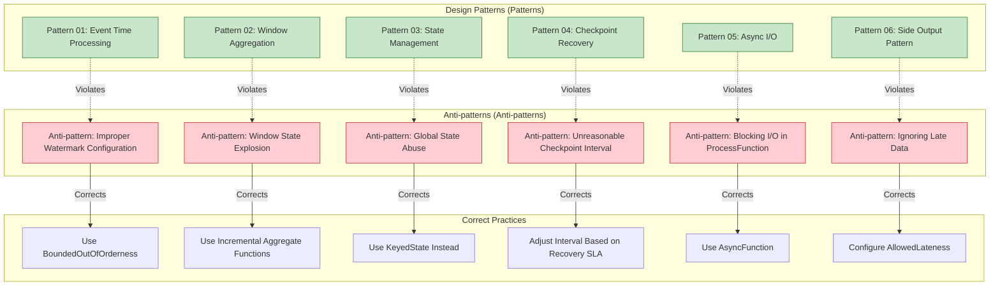

# Stream Processing Anti-patterns Catalog

> **Stage**: Knowledge/09-anti-patterns | **Prerequisites**: [02-design-patterns](../02-design-patterns/) | **Formalization Level**: L3-L5
>
> This directory collects common but inefficient and risky design practices in stream processing systems, complementing design patterns to help engineers identify and avoid typical pitfalls in production environments.

---

## Table of Contents

- [Stream Processing Anti-patterns Catalog](#stream-processing-anti-patterns-catalog)
  - [Table of Contents](#table-of-contents)
  - [1. What is an Anti-pattern?](#1-what-is-an-anti-pattern)
  - [2. Relationship Between Anti-patterns and Design Patterns](#2-relationship-between-anti-patterns-and-design-patterns)
  - [3. Anti-pattern Classification Matrix](#3-anti-pattern-classification-matrix)
    - [By Impact Domain](#by-impact-domain)
    - [By Severity](#by-severity)
    - [By Detection Difficulty](#by-detection-difficulty)
  - [4. Anti-pattern Catalog](#4-anti-pattern-catalog)
    - [Time Semantics](#time-semantics)
    - [State Management](#state-management)
    - [Fault Tolerance Configuration](#fault-tolerance-configuration)
    - [Data Distribution](#data-distribution)
    - [I/O Handling](#io-handling)
    - [Resource Management](#resource-management)
  - [5. Detection Checklist Quick Reference](#5-detection-checklist-quick-reference)
  - [6. References](#6-references)

---

## 1. What is an Anti-pattern?

**Definition (Def-K-09-01)**:

> An **anti-pattern** is a design practice that appears reasonable in a specific context but has proven to be inefficient or harmful in practice. It typically stems from misunderstandings of system mechanisms, prioritizing short-term convenience over long-term maintainability, or neglecting boundary conditions.

Key differences between anti-patterns and design patterns [^1]:

| Dimension | Design Pattern | Anti-pattern |
|-----------|----------------|--------------|
| **Nature** | Best practice, actively adopt | Common problem, actively avoid |
| **Recognition Difficulty** | Requires learning to apply | Seems intuitive, easy to fall into |
| **Consequence** | Improves maintainability and performance | Leads to technical debt and failures |
| **Documentation Role** | Guides correct implementation | Warns against common pitfalls |

**Special Characteristics of Stream Processing Anti-patterns** [^2]:

The distributed, stateful, and real-time nature of stream processing systems means that the consequences of anti-patterns often have the following characteristics:

1. **Delayed Exposure**: State accumulation, resource leakage, and other issues do not manifest immediately
2. **Cascade Amplification**: A single point problem diffuses through the dataflow topology
3. **Difficult Recovery**: Repairing stateful operators involves Checkpoint management and state reconstruction
4. **Hard to Debug**: Timing and concurrency issues in distributed environments are difficult to reproduce

---

## 2. Relationship Between Anti-patterns and Design Patterns



**Design Principles vs. Anti-patterns** [^3]:

| Design Principle | Corresponding Anti-pattern |
|------------------|----------------------------|
| Operators should be stateless when possible | Global State Abuse |
| Watermark must balance latency and completeness | Improper Watermark Configuration |
| Checkpoint frequency should match recovery SLA | Unreasonable Checkpoint Interval |
| Data distribution should be uniform | Hot Key Not Handled |
| Asynchronous processing for external requests | Blocking I/O in ProcessFunction |
| Register custom types to optimize serialization | Serialization Overhead Neglected |
| Window state requires bounded management | State Explosion in Window Functions |
| Respect backpressure signals for flow control | Ignoring Backpressure Signals |
| Join operations require time alignment | Multi-stream Join Without Time Alignment |
| Resource estimation should leave sufficient margin | Insufficient Resource Estimation Leading to OOM |

---

## 3. Anti-pattern Classification Matrix

### By Impact Domain

| Category | Description | Included Anti-patterns |
|----------|-------------|------------------------|
| **Time Semantics** | Misuse related to time processing | AP-02 (Watermark), AP-09 (Multi-stream Join) |
| **State Management** | Performance/stability issues from improper state usage | AP-01 (Global State), AP-07 (Window State Explosion) |
| **Fault Tolerance Configuration** | Misconfiguration of Checkpoint and recovery mechanisms | AP-03 (Checkpoint Interval) |
| **Data Distribution** | Data skew and partitioning issues | AP-04 (Hot Key) |
| **I/O Handling** | Performance traps in external interactions | AP-05 (Blocking I/O), AP-06 (Serialization) |
| **Resource Management** | Resource planning and backpressure handling | AP-08 (Ignoring Backpressure), AP-10 (Resource Estimation) |

### By Severity

```
┌─────────────────────────────────────────────────────────────────────────┐
│                     Anti-pattern Severity Pyramid                        │
├─────────────────────────────────────────────────────────────────────────┤
│                                                                         │
│                              ▲                                          │
│                             /█\     P0 - Catastrophic                   │
│                            /███\    Can cause total system unavailability│
│                           /█████\   e.g., AP-10 OOM, AP-08 Backpressure Out of Control│
│                          /███████\                                      │
│                         ▔▔▔▔▔▔▔▔▔                                       │
│                                                                         │
│                            ▲                                            │
│                           /██\      P1 - High Risk                      │
│                          /████\     Can cause severe performance degradation or data loss│
│                         /██████\    e.g., AP-02 Watermark, AP-07 State Explosion│
│                        ▔▔▔▔▔▔▔▔                                         │
│                                                                         │
│                          ▲                                              │
│                         /██\        P2 - Medium                         │
│                        /████\       Can cause resource waste or maintenance difficulties│
│                       ▔▔▔▔▔▔                                            │
│                                                                         │
│                        ▲                                                │
│                       /██\          P3 - Low Risk                       │
│                      ▔▔▔▔                                               │
│                                                                         │
└─────────────────────────────────────────────────────────────────────────┘
```

### By Detection Difficulty

| Detection Difficulty | Anti-pattern | Detection Method |
|----------------------|--------------|------------------|
| **Easy** | AP-05 Blocking I/O, AP-01 Global State | Code Review |
| **Medium** | AP-03 Checkpoint Interval, AP-06 Serialization | Config Audit + Performance Profiling |
| **Hard** | AP-04 Hot Key, AP-07 Window State Explosion | Runtime Monitoring + Metrics Analysis |
| **Extremely Hard** | AP-02 Watermark, AP-08 Backpressure | Specialized Tools + Expert Experience |

---

## 4. Anti-pattern Catalog

### Time Semantics

| ID | Anti-pattern Name | Severity | Detection Difficulty | Document Link |
|----|-------------------|----------|----------------------|---------------|
| AP-02 | Improper Watermark Configuration | P1 | Extremely Hard | [anti-pattern-02-watermark-misconfiguration.md](anti-pattern-02-watermark-misconfiguration.md) |
| AP-09 | Multi-stream Join Time Misalignment | P1 | Hard | [anti-pattern-09-multi-stream-join-misalignment.md](anti-pattern-09-multi-stream-join-misalignment.md) |

### State Management

| ID | Anti-pattern Name | Severity | Detection Difficulty | Document Link |
|----|-------------------|----------|----------------------|---------------|
| AP-01 | Global State Abuse | P2 | Easy | [anti-pattern-01-global-state-abuse.md](anti-pattern-01-global-state-abuse.md) |
| AP-07 | Window Function State Explosion | P1 | Hard | [anti-pattern-07-window-state-explosion.md](anti-pattern-07-window-state-explosion.md) |

### Fault Tolerance Configuration

| ID | Anti-pattern Name | Severity | Detection Difficulty | Document Link |
|----|-------------------|----------|----------------------|---------------|
| AP-03 | Unreasonable Checkpoint Interval | P1 | Medium | [anti-pattern-03-checkpoint-interval-misconfig.md](anti-pattern-03-checkpoint-interval-misconfig.md) |

### Data Distribution

| ID | Anti-pattern Name | Severity | Detection Difficulty | Document Link |
|----|-------------------|----------|----------------------|---------------|
| AP-04 | Hot Key Not Handled | P1 | Hard | [anti-pattern-04-hot-key-skew.md](anti-pattern-04-hot-key-skew.md) |

### I/O Handling

| ID | Anti-pattern Name | Severity | Detection Difficulty | Document Link |
|----|-------------------|----------|----------------------|---------------|
| AP-05 | Blocking I/O in ProcessFunction | P1 | Easy | [anti-pattern-05-blocking-io-processfunction.md](anti-pattern-05-blocking-io-processfunction.md) |
| AP-06 | Serialization Overhead Neglected | P2 | Medium | [anti-pattern-06-serialization-overhead.md](anti-pattern-06-serialization-overhead.md) |

### Resource Management

| ID | Anti-pattern Name | Severity | Detection Difficulty | Document Link |
|----|-------------------|----------|----------------------|---------------|
| AP-08 | Ignoring Backpressure Signals | P0 | Extremely Hard | [anti-pattern-08-ignoring-backpressure.md](anti-pattern-08-ignoring-backpressure.md) |
| AP-10 | Insufficient Resource Estimation Leading to OOM | P0 | Hard | [anti-pattern-10-resource-estimation-oom.md](anti-pattern-10-resource-estimation-oom.md) |

---

## 5. Detection Checklist Quick Reference

See [anti-pattern-checklist.md](anti-pattern-checklist.md) for details.

Quick detection entry points:

```
┌─────────────────────────────────────────────────────────────────────────┐
│                     Anti-pattern Quick Detection Entry                   │
├─────────────────────────────────────────────────────────────────────────┤
│                                                                         │
│  [Code Review]                                                          │
│   □ Are there blocking calls in ProcessFunction?                        │
│   □ Is ValueState used instead of KeyedState?                           │
│   □ Are Kryo serializers registered?                                    │
│                                                                         │
│  [Configuration Audit]                                                  │
│   □ Does Checkpoint interval match recovery SLA?                        │
│   □ Does Watermark delay match business out-of-order tolerance?         │
│   □ Is idle source handling configured?                                 │
│                                                                         │
│  [Runtime Monitoring]                                                   │
│   □ Are input rates uniform across subtasks?                            │
│   □ Is state size continuously growing?                                 │
│   □ Are there backpressure signals?                                     │
│   □ Are GC frequency and pause times normal?                            │
│                                                                         │
│  [Performance Profiling]                                                │
│   □ Does serialization account for a significant portion of total CPU?  │
│   □ Is Checkpoint duration within acceptable range?                     │
│   □ Does memory usage match estimates?                                  │
│                                                                         │
└─────────────────────────────────────────────────────────────────────────┘
```

---

## 6. References

[^1]: W. J. Brown et al., "AntiPatterns: Refactoring Software, Architectures, and Projects in Crisis," John Wiley & Sons, 1998.

[^2]: M. Kleppmann, "Designing Data-Intensive Applications," O'Reilly Media, 2017. Chapter 11: Stream Processing.

[^3]: Apache Flink Documentation, "Flink Best Practices," 2025. <https://nightlies.apache.org/flink/flink-docs-stable/docs/learn-flink/>


---

*Document Version: v1.0 | Updated: 2026-04-03 | Status: Completed*
