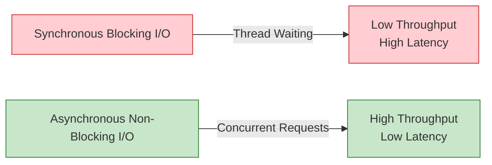

# Anti-Pattern AP-05: Blocking I/O in ProcessFunction

> **Anti-Pattern ID**: AP-05 | **Category**: I/O Processing | **Severity**: P1 | **Detection Difficulty**: Easy
>
> Performing synchronous blocking external I/O calls (e.g., database queries, HTTP requests) inside a ProcessFunction, causing subtask threads to block and throughput to drop sharply.

---

## Table of Contents

- [Anti-Pattern AP-05: Blocking I/O in ProcessFunction](#anti-pattern-ap-05-blocking-io-in-processfunction)
  - [Table of Contents](#table-of-contents)
  - [1. Definition](#1-definition)
  - [2. Symptoms](#2-symptoms)
    - [2.1 Runtime Symptoms](#21-runtime-symptoms)
    - [2.2 Diagnostic Metrics](#22-diagnostic-metrics)
  - [3. Negative Impacts](#3-negative-impacts)
    - [3.1 Throughput Impact](#31-throughput-impact)
    - [3.2 Cascading Impact](#32-cascading-impact)
  - [4. Solution](#4-solution)
    - [4.1 Use AsyncFunction](#41-use-asyncfunction)
    - [4.2 Use Lookup Join (Table API)](#42-use-lookup-jointable-api)
  - [5. Code Examples](#5-code-examples)
    - [5.1 Bad Example](#51-bad-example)
    - [5.2 Good Example](#52-good-example)
  - [6. Examples](#6-examples)
    - [Case Study: Real-Time User Profile Enrichment](#case-study-real-time-user-profile-enrichment)
  - [7. Visualizations](#7-visualizations)
  - [8. References](#8-references)

---

## 1. Definition

**Definition (Def-K-09-05)**:

> Blocking I/O in ProcessFunction refers to calling blocking external services (databases, caches, HTTP APIs, RPC) inside synchronous methods such as `processElement` or `onTimer`, causing the subtask processing thread to suspend and wait for the response, unable to process other data.

**Formal Description** [^1]:

Let the processing time of a single record be $T_{proc}$, which includes blocking I/O time $T_{io}$. Then the effective throughput is:

$$
\text{Throughput} = \frac{1}{T_{proc}} = \frac{1}{T_{compute} + T_{io}}
$$

When $T_{io} \gg T_{compute}$, throughput drops sharply.

---

## 2. Symptoms

### 2.1 Runtime Symptoms

| Symptom | Manifestation | Cause |
|---------|---------------|-------|
| Throughput Plummets | Only 1–10% of expected | Thread waiting for I/O |
| CPU Idling | Utilization < 10% | Thread blocked, not consuming CPU |
| Backpressure Spreading | All upstream slows down | Blocking propagates downstream |
| Timeout Failures | External service connection pool exhausted | Connections held but not released |

### 2.2 Diagnostic Metrics

| Metric | Normal Value | With Blocking I/O |
|--------|--------------|-------------------|
| `recordsInPerSecond` | > 1000 | < 100 |
| CPU Utilization | 60–80% | < 10% |
| Per-Record Processing Time | < 1ms | > I/O latency |

---

## 3. Negative Impacts

### 3.1 Throughput Impact

```
Scenario: Each record queries Redis (latency 2ms)

Synchronous processing:
- Throughput = 500 records/s

Asynchronous processing (concurrency 100):
- Throughput = 50,000 records/s

Improvement: 100x!
```

### 3.2 Cascading Impact

Blocking I/O causes the throughput of the entire DAG to equal the throughput of the slowest blocking operator.

---

## 4. Solution

### 4.1 Use AsyncFunction

```scala
// Use Flink AsyncFunction
class AsyncDatabaseRequest extends AsyncFunction[Event, Result] {
  private var asyncClient: AsyncDatabaseClient = _

  override def asyncInvoke(
    event: Event,
    resultFuture: ResultFuture[Result]
  ): Unit = {
    asyncClient.queryAsync(event.id).whenComplete { (result, ex) =>
      if (ex != null) resultFuture.completeExceptionally(ex)
      else resultFuture.complete(Collections.singleton(result))
    }
  }
}

// Usage
val enriched = AsyncDataStream.unorderedWait(
  inputStream,
  new AsyncDatabaseRequest(),
  1000, TimeUnit.MILLISECONDS,
  100  // concurrency
)
```

### 4.2 Use Lookup Join (Table API)

```sql
-- Enable async lookup and cache
CREATE TABLE user_info (
  user_id STRING,
  user_name STRING,
  PRIMARY KEY (user_id) NOT ENFORCED
) WITH (
  'connector' = 'jdbc',
  'lookup.async' = 'true',
  'lookup.cache.max-rows' = '10000',
  'lookup.cache.ttl' = '1 min'
);

SELECT e.*, u.user_name
FROM events e
LEFT JOIN user_info FOR SYSTEM_TIME AS OF e.event_time u
ON e.user_id = u.user_id;
```

---

## 5. Code Examples

### 5.1 Bad Example

```scala
// ❌ Bad: synchronous JDBC query
class BadEnrichment extends RichMapFunction[Event, Result] {
  private var conn: Connection = _

  override def map(event: Event): Result = {
    val stmt = conn.prepareStatement("SELECT * FROM users WHERE id = ?")
    stmt.setString(1, event.userId)
    val rs = stmt.executeQuery()  // Blocks!
    // ...
  }
}
```

### 5.2 Good Example

```scala
// ✅ Good: async query
class GoodEnrichment extends RichAsyncFunction[Event, Result] {
  private var asyncClient: AsyncDatabaseClient = _

  override def asyncInvoke(event: Event, future: ResultFuture[Result]): Unit = {
    asyncClient.queryAsync(event.userId).whenComplete { (r, e) =>
      if (e != null) future.completeExceptionally(e)
      else future.complete(Collections.singleton(r))
    }
  }
}
```

---

## 6. Examples

### Case Study: Real-Time User Profile Enrichment

| Approach | Throughput | CPU Utilization |
|----------|------------|-----------------|
| Synchronous JDBC | 200 records/s | 5% |
| Async + Connection Pool | 8,000 records/s | 65% |
| Async + Cache | 25,000 records/s | 70% |

---

## 7. Visualizations



---

## 8. References

[^1]: Apache Flink Documentation, "Async I/O," 2025.

---

*Document Version: v1.0 | Updated: 2026-04-03 | Status: Completed*
