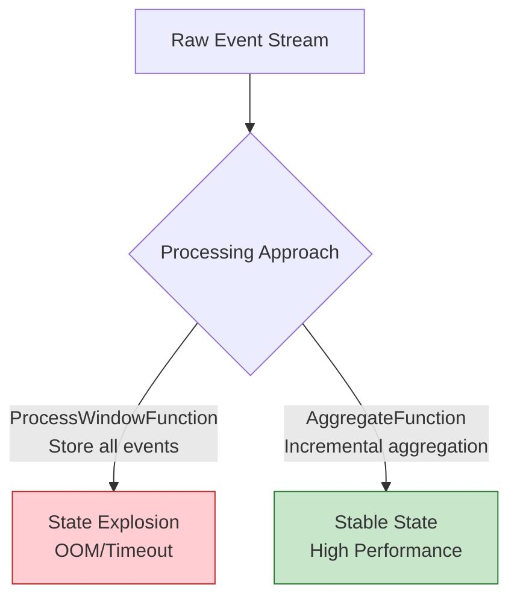

# Anti-Pattern AP-07: Window State Explosion

> **Anti-Pattern ID**: AP-07 | **Category**: State Management | **Severity**: P1 | **Detection Difficulty**: Hard
>
> Accumulating large numbers of raw events in window functions without using incremental aggregation, causing window state to grow unbounded, eventually leading to OOM or Checkpoint timeouts.

---

## Table of Contents

- [Anti-Pattern AP-07: Window State Explosion](#anti-pattern-ap-07-window-state-explosion)
  - [Table of Contents](#table-of-contents)
  - [1. Definition](#1-definition)
  - [2. Symptoms](#2-symptoms)
  - [3. Negative Impacts](#3-negative-impacts)
    - [3.1 Memory Impact](#31-memory-impact)
  - [4. Solution](#4-solution)
    - [4.1 Use AggregateFunction](#41-use-aggregatefunction)
    - [4.2 Combine Aggregate + ProcessWindow](#42-combine-aggregate-processwindow)
    - [4.3 Use Evictor to Limit State](#43-use-evictor-to-limit-state)
  - [5. Code Examples](#5-code-examples)
    - [5.1 Bad Example](#51-bad-example)
    - [5.2 Good Example](#52-good-example)
  - [6. Examples](#6-examples)
    - [Case Study: Real-Time User Behavior Statistics](#case-study-real-time-user-behavior-statistics)
  - [7. Visualizations](#7-visualizations)
  - [8. References](#8-references)

---

## 1. Definition

**Definition (Def-K-09-07)**:

> Window state explosion refers to using `ProcessWindowFunction` in a window operator to store all raw events without using `AggregateFunction` for incremental aggregation, causing window state to grow linearly with the input data volume.

**State Growth Model** [^1]:

```
State Size = Number of Windows × Events per Window × Size per Event

Bad Practice:
- 1-minute window × 1M events/minute × 1KB = 1GB/window

Good Practice:
- 1-minute window × 1 accumulator × 100 bytes = 100 bytes/window

Optimization Ratio: 1GB / 100B = 10,000,000x!
```

---

## 2. Symptoms

| Symptom | Manifestation | Cause |
|---------|---------------|-------|
| Heap OOM | Frequent OOM | Window stores large number of events |
| Checkpoint Timeout | Duration increases | State too large, slow to serialize |
| GC Pauses | Frequent Full GC | Large objects accumulate in Old Gen |
| Throughput Decline | Decreases over time | State access slows down |

---

## 3. Negative Impacts

### 3.1 Memory Impact

```
Scenario: 1-hour window, 10k events/second, 500 bytes/event

Bad Practice (store raw events):
- State Size = 10,000 × 3,600 × 500B = 18GB/window

Good Practice (incremental aggregation):
- State Size = Accumulator ≈ 100 bytes/window

Savings: 18,000,000x!
```

---

## 4. Solution

### 4.1 Use AggregateFunction

```scala
// ✅ Good: Use AggregateFunction for incremental aggregation
val result = stream
  .keyBy(_.userId)
  .window(TumblingEventTimeWindows.of(Time.minutes(1)))
  .aggregate(new CountAggregate)

// Incremental aggregation function
class CountAggregate extends AggregateFunction[Event, CountAcc, CountResult] {
  override def createAccumulator(): CountAcc = CountAcc(0, 0.0)

  override def add(value: Event, accumulator: CountAcc): CountAcc =
    CountAcc(accumulator.count + 1, accumulator.sum + value.amount)

  override def getResult(accumulator: CountAcc): CountResult =
    CountResult(accumulator.count, accumulator.sum)

  override def merge(a: CountAcc, b: CountAcc): CountAcc =
    CountAcc(a.count + b.count, a.sum + b.sum)
}

case class CountAcc(count: Int, sum: Double)
case class CountResult(count: Int, sum: Double)
```

### 4.2 Combine Aggregate + ProcessWindow

```scala
// Use when window metadata is needed
val result = stream
  .keyBy(_.userId)
  .window(TumblingEventTimeWindows.of(Time.minutes(1)))
  .aggregate(
    new CountAggregate,  // Incremental aggregation
    new WindowResultFunction  // Process window metadata
  )

// WindowResultFunction receives aggregated result
class WindowResultFunction extends ProcessWindowFunction[
  CountResult, Output, String, TimeWindow
] {
  override def process(
    key: String,
    context: Context,
    elements: Iterable[CountResult],  // Only 1 element
    out: Collector[Output]
  ): Unit = {
    val result = elements.head
    out.collect(Output(
      key,
      result.count,
      result.sum,
      context.window.getStart,
      context.window.getEnd
    ))
  }
}
```

### 4.3 Use Evictor to Limit State

```scala
// Limit the number of events retained in the window
stream
  .keyBy(_.userId)
  .window(TumblingEventTimeWindows.of(Time.minutes(10)))
  .evictor(CountEvictor.of(1000))  // Keep only the latest 1000
  .process(new LimitedWindowFunction())
```

---

## 5. Code Examples

### 5.1 Bad Example

```scala
// ❌ Bad: Stores all raw events
class BadWindowFunction extends ProcessWindowFunction[
  Event, Output, String, TimeWindow
] {
  override def process(
    key: String,
    context: Context,
    elements: Iterable[Event],  // Stores all events!
    out: Collector[Output]
  ): Unit = {
    // State size = elements.size × Event size
    val count = elements.size
    val sum = elements.map(_.amount).sum
    out.collect(Output(key, count, sum))
  }
}
```

### 5.2 Good Example

```scala
// ✅ Good: Incremental aggregation + metadata processing
val result = stream
  .keyBy(_.userId)
  .window(TumblingEventTimeWindows.of(Time.minutes(1)))
  .aggregate(
    new SumAggregate,  // Stores only accumulator
    new OutputFunction // Receives only aggregated result
  )
```

---

## 6. Examples

### Case Study: Real-Time User Behavior Statistics

| Approach | State Size | Checkpoint Time | GC Frequency |
|----------|------------|-----------------|--------------|
| ProcessWindowFunction | 20GB | 180s | Frequent |
| AggregateFunction | 50MB | 5s | Rare |

---

## 7. Visualizations



---

## 8. References

[^1]: Apache Flink Documentation, "Windows," 2025.

---

*Document Version: v1.0 | Updated: 2026-04-03 | Status: Completed*
