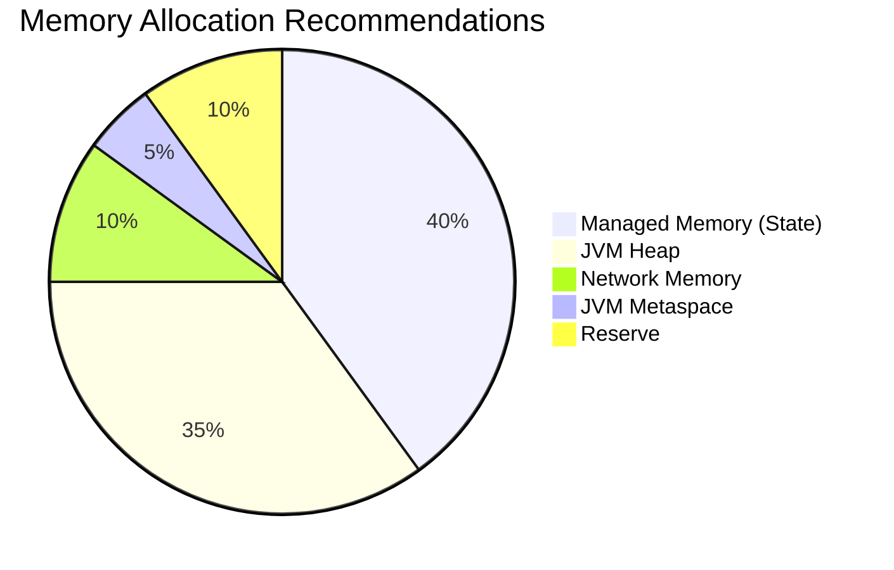

# Anti-Pattern AP-10: OOM Caused by Insufficient Resource Estimation

> **Anti-Pattern ID**: AP-10 | **Category**: Resource Management | **Severity**: P0 | **Detection Difficulty**: Hard
>
> Failing to reasonably estimate memory resources based on state size, throughput, and window configuration, leading to frequent OOM or Checkpoint failures.

---

## Table of Contents

- [Anti-Pattern AP-10: OOM Caused by Insufficient Resource Estimation](#anti-pattern-ap-10-oom-caused-by-insufficient-resource-estimation)
  - [Table of Contents](#table-of-contents)
  - [1. Anti-Pattern Definition (Definition)](#1-anti-pattern-definition-definition)
  - [2. Symptoms (Symptoms)](#2-symptoms-symptoms)
  - [3. Negative Impacts (Negative Impacts)](#3-negative-impacts-negative-impacts)
    - [3.1 OOM Cascading Failure](#31-oom-cascading-failure)
  - [4. Solutions (Solution)](#4-solutions-solution)
    - [4.1 Memory Estimation Formula](#41-memory-estimation-formula)
    - [4.2 Configuration Example](#42-configuration-example)
    - [4.3 Using RocksDB to Reduce Heap Pressure](#43-using-rocksdb-to-reduce-heap-pressure)
  - [5. Code Examples (Code Examples)](#5-code-examples-code-examples)
    - [5.1 Incorrect Configuration](#51-incorrect-configuration)
    - [5.2 Correct Configuration](#52-correct-configuration)
  - [6. Example Validation (Examples)](#6-example-validation-examples)
    - [Case Study: Large-State Job OOM](#case-study-large-state-job-oom)
  - [7. Visualizations (Visualizations)](#7-visualizations-visualizations)
  - [8. References (References)](#8-references-references)

---

## 1. Anti-Pattern Definition (Definition)

**Definition (Def-K-09-10)**:

> Insufficient resource estimation refers to deploying Flink jobs without fully considering state size, network buffers, JVM overhead, and other factors, resulting in configured memory resources far below actual requirements, causing runtime OOM or frequent Full GC.

**Memory Requirement Model** [^1]:

```
Total Memory Requirement =
  + Managed Memory (state)
  + Network Memory (buffers)
  + JVM Metaspace
  + JVM Heap Memory
  + Native Memory (RocksDB)
  + Reserve (20%)
```

---

## 2. Symptoms (Symptoms)

| Symptom | Manifestation |
|---------|---------------|
| OOM | Container killed by K8s |
| Full GC | GC time > Processing time |
| Checkpoint Failure | State too large to save |
| Latency Spike | Caused by GC pauses |

---

## 3. Negative Impacts (Negative Impacts)

### 3.1 OOM Cascading Failure

```
TaskManager OOM ──► Container Restart ──► Checkpoint Failure ──► Job Restart
      │                                              │
      ▼                                              ▼
  Data Replay                                  Service Unavailable
```

---

## 4. Solutions (Solution)

### 4.1 Memory Estimation Formula

```scala
// Estimation example
def estimateMemory(
  stateSizeGb: Double,      // Expected state size
  throughputKps: Double,    // Throughput (thousands/sec)
  windowMinutes: Int,       // Window size
  parallelism: Int          // Parallelism
): MemoryConfig = {

  // 1. Managed memory = state size / parallelism × 1.5 (margin)
  val managedMemory = (stateSizeGb / parallelism * 1.5).gb

  // 2. Network memory = min(parallelism × 64MB, 1GB)
  val networkMemory = Math.min(parallelism * 64, 1024).mb

  // 3. JVM heap = max(managed memory × 0.5, 2GB)
  val heapMemory = Math.max(managedMemory * 0.5, 2.gb)

  // 4. Total memory = (managed + network + heap) × 1.2 (reserve)
  val totalMemory = (managedMemory + networkMemory + heapMemory) * 1.2

  MemoryConfig(totalMemory, managedMemory, networkMemory, heapMemory)
}
```

### 4.2 Configuration Example

```yaml
# Flink memory configuration
taskmanager.memory:
  process:
    size: 8gb          # Total process memory
  managed:
    size: 3gb          # Managed memory (state)
  network:
    max: 256mb         # Network memory
  jvm-heap:
    size: 3gb          # JVM heap
  jvm-metaspace:
    size: 256mb        # Metaspace
```

### 4.3 Using RocksDB to Reduce Heap Pressure

```scala
// Use RocksDB state backend for large state
env.setStateBackend(new EmbeddedRocksDBStateBackend(true))

// RocksDB memory configuration
val config = new Configuration()
config.setString("state.backend.rocksdb.memory.fixed-per-slot", "512mb")
config.setString("state.backend.rocksdb.memory.high-prio-pool-ratio", "0.1")
env.configure(config)
```

---

## 5. Code Examples (Code Examples)

### 5.1 Incorrect Configuration

```yaml
# ❌ Wrong: Memory configuration too small
taskmanager.memory.process.size: 2gb
taskmanager.memory.managed.size: 512mb

# Scenario: 10GB state, parallelism 4
# Each TM needs 2.5GB state, but only 512MB managed memory configured
# Result: OOM
```

### 5.2 Correct Configuration

```yaml
# ✅ Correct: Configure based on state size
taskmanager.memory.process.size: 8gb
taskmanager.memory.managed.size: 3gb
taskmanager.memory.network.max: 256mb

# 10GB state, parallelism 4
# 2.5GB state per TM < 3GB managed memory ✓
```

---

## 6. Example Validation (Examples)

### Case Study: Large-State Job OOM

| Configuration | State Size | Result |
|---------------|------------|--------|
| 2GB Total Memory | 10GB | Frequent OOM |
| 8GB Total Memory | 10GB | Stable Operation |

---

## 7. Visualizations (Visualizations)



---

## 8. References (References)

[^1]: Apache Flink Documentation, "Memory Configuration," 2025.

---

*Document Version: v1.0 | Updated: 2026-04-03 | Status: Completed*
