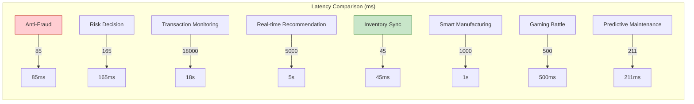

> **Status**: 🔮 Forward-looking Content | **Risk Level**: High | **Last Updated**: 2026-04
>
> The content described in this document is in early planning stages and may differ from the final implementation. Please refer to official Apache Flink releases for authoritative information.
>
# Case Studies Index

> **Version**: v1.1 | **Updated**: 2026-04-09 | **Total Cases**: 17

---

## Overview

This directory contains detailed industry case studies for the AnalysisDataFlow project, covering five industries: finance, e-commerce, IoT, social media, and gaming. Each case follows the project's six-section template, including complete architectural design, Flink implementation code, performance metrics, and lessons learned.

---

## Case Studies Overview

### Case Statistics Matrix

| Industry | Cases | Core Latency Requirement | Data Scale | Formalization Level |
|------|:------:|:------------:|----------|:----------:|
| **Finance** | 4 | < 10ms | Million TPS | L4-L5 |
| **E-commerce** | 3 | < 200ms | Billion-level events | L3-L4 |
| **IoT** | 5 | < 1s | Tens of millions of devices | L3-L4 |
| **Social Media** | 1 | < 100ms | Hundred-billion-level events | L4 |
| **Gaming** | 1 | < 50ms | Ten-million concurrent | L4 |

---

## Directory Structure

```
10-case-studies/
├── 00-INDEX.md                              # This file: Case studies index
├── finance/                                 # Finance industry cases
│   ├── 10.1.1-realtime-anti-fraud-system.md    # Real-time anti-fraud system
│   ├── 10.1.2-transaction-monitoring-compliance.md  # Transaction monitoring & compliance
│   └── 10.1.3-realtime-risk-decision.md        # Real-time risk decision
├── ecommerce/                               # E-commerce industry cases
│   ├── 10.2.1-realtime-recommendation.md       # Real-time recommendation system
│   └── 10.2.2-inventory-sync.md                # Real-time inventory synchronization
├── iot/                                     # IoT cases
│   ├── 10.3.1-smart-manufacturing.md           # Smart manufacturing monitoring
│   ├── 10.3.2-connected-vehicles.md            # Connected vehicle data processing
│   ├── 10.3.3-predictive-maintenance-manufacturing.md  # Predictive maintenance
│   ├── 10.3.4-edge-manufacturing-case.md       # Edge stream processing case
│   └── 10.3.5-smart-manufacturing-iot.md       # Smart manufacturing IoT real-time analysis
├── social-media/                            # Social media cases
│   └── 10.4.1-content-recommendation.md        # Real-time content recommendation
└── gaming/                                  # Gaming industry cases
    └── 10.5.1-realtime-battle-analytics.md     # Real-time battle data processing
```

---

## Case Details

### 1. Finance

#### 1.1 Real-Time Anti-Fraud System

- **File**: `finance/10.1.1-realtime-anti-fraud-system.md`
- **Business Scenario**: Internet banking real-time fraud detection
- **Technical Highlights**: Flink CEP + Machine Learning fusion
- **Core Metrics**: P99 latency 85ms, fraud detection rate 97.2%
- **Key Technologies**:
  - Complex Event Processing (CEP)
  - Async I/O feature lookup
  - Tiered decision fusion

#### 1.2 Transaction Monitoring and Compliance

- **File**: `finance/10.1.2-transaction-monitoring-compliance.md`
- **Business Scenario**: Securities firm full-chain transaction monitoring
- **Technical Highlights**: Tiered aggregation + real-time regulatory reporting
- **Core Metrics**: 30-second end-to-end latency, 100% compliance
- **Key Technologies**:
  - Flink SQL window aggregation
  - Interval Join wash trade detection
  - Exactly-Once data integrity

#### 1.3 Real-Time Risk Decision

- **File**: `finance/10.1.3-realtime-risk-decision.md`
- **Business Scenario**: Consumer finance real-time approval
- **Technical Highlights**: Tiered scoring model + rule engine collaboration
- **Core Metrics**: P99 decision latency 165ms, auto-approval rate 78%
- **Key Technologies**:
  - Real-time feature engineering
  - Async model inference
  - Dynamic weight decision

#### 1.4 Real-Time Payment Risk Control System (AI Agent)

- **File**: `finance/10.1.4-realtime-payment-risk-control.md`
- **Business Scenario**: Large payment platform real-time risk control
- **Technical Highlights**: Flink 2.4 + AI Agents, rule and ML fusion
- **Core Metrics**: P99 latency 100ms, throughput 50K TPS
- **Key Technologies**:
  - FLIP-531 AI Agents
  - Broadcast State dynamic rules
  - CEP complex event processing
  - Feature Agent real-time computation

#### 1.5 Financial Real-Time Risk Control Platform (Industrial Grade)

- **File**: `finance/10.1.5-realtime-risk-control-platform.md`
- **Business Scenario**: Large bank/payment platform real-time risk control
- **Technical Highlights**: Ultra-low latency (<10ms) + high throughput (1M TPS) + Exactly-Once
- **Core Metrics**: P99 latency 8.5ms, throughput 1.2M TPS, fraud interception rate 96.5%
- **Key Technologies**:
  - In-memory computation + ZGC low-latency GC
  - Object pool + zero-copy serialization
  - Two-phase commit Exactly-Once
  - Tiered decision fusion

### 2. E-commerce

#### 2.1 Real-Time Recommendation System

- **File**: `ecommerce/10.2.1-realtime-recommendation.md`
- **Business Scenario**: E-commerce platform personalized recommendation
- **Technical Highlights**: Real-time feature engineering + Feature Store integration
- **Core Metrics**: Feature latency <5s, CTR improvement 50%
- **Key Technologies**:
  - Sliding window feature aggregation
  - Real-time A/B test metrics
  - Cold start real-time response

#### 2.2 Real-Time Inventory Synchronization

- **File**: `ecommerce/10.2.2-inventory-sync.md`
- **Business Scenario**: Omni-channel inventory real-time synchronization
- **Technical Highlights**: Strong consistency guarantee + multi-channel distribution
- **Core Metrics**: Sync latency 45ms, oversell rate 0.001%
- **Key Technologies**:
  - KeyedProcessFunction state machine
  - Inventory lock/deduct/release
  - Multi-channel Sink

#### 2.3 Big Promotion Real-Time Dashboard

- **File**: `ecommerce/10.2.3-big-promotion-realtime-dashboard.md`
- **Business Scenario**: E-commerce big promotion real-time GMV/order monitoring
- **Technical Highlights**: Serverless Flink + batch-stream unification
- **Core Metrics**: Latency <3s, peak 1M QPS
- **Key Technologies**:
  - Tiered aggregation optimization
  - Top-N approximation algorithm
  - Auto-scaling

### 3. IoT

#### 3.1 Smart Manufacturing Monitoring

- **File**: `iot/10.3.1-smart-manufacturing.md`
- **Business Scenario**: Automotive manufacturing enterprise equipment monitoring
- **Technical Highlights**: Cloud-edge collaboration + predictive maintenance
- **Core Metrics**: OEE improvement 26%, unplanned downtime reduction 83%
- **Key Technologies**:
  - Edge Flink preprocessing
  - CEP equipment anomaly detection
  - OEE real-time computation

#### 3.2 Connected Vehicle Data Processing

- **File**: `iot/10.3.2-connected-vehicles.md`
- **Business Scenario**: New energy vehicle data processing
- **Technical Highlights**: Real-time driving behavior scoring + insurance UBI
- **Core Metrics**: 25 billion events/day processed, location accuracy 5m
- **Key Technologies**:
  - Driving behavior window analysis
  - Hard brake/swerve detection
  - Insurance scoring computation

#### 3.3 Predictive Maintenance

- **File**: `iot/10.3.3-predictive-maintenance-manufacturing.md`
- **Business Scenario**: Large manufacturing factory equipment failure prediction
- **Technical Highlights**: Flink 2.5 + GPU-accelerated ML inference, edge-cloud collaboration
- **Core Metrics**: Prediction accuracy 92%, maintenance cost reduction 35%, failure early warning 4 hours
- **Key Technologies**:
  - Time-series feature extraction (vibration/temperature/current)
  - ML_PREDICT async inference (experimental)
  - Edge emergency shutdown control (<10ms)
  - Online model continuous learning

#### 3.4 Smart Manufacturing Edge Stream Processing

- **File**: `iot/10.3.4-edge-manufacturing-case.md`
- **Business Scenario**: Automotive parts manufacturing edge quality inspection
- **Technical Highlights**: Flink Edge + WasmEdge AI inference
- **Core Metrics**: Detection latency 110ms, data compression 10x
- **Key Technologies**:
  - Edge WASM inference
  - Offline continuation data consistency
  - Cloud-edge collaboration

#### 3.5 Smart Manufacturing IoT Real-Time Analysis (Industrial Grade)

- **File**: `iot/10.3.5-smart-manufacturing-iot.md`
- **Business Scenario**: Large automotive manufacturing enterprise equipment monitoring and predictive maintenance
- **Technical Highlights**: Edge Flink + Cloud Flink + TimeSeries DB, cloud-edge collaboration
- **Core Metrics**: Edge latency 65ms, unplanned downtime reduction 78%, prediction accuracy 87%
- **Key Technologies**:
  - Multi-source data fusion (MQTT/OPC-UA/Modbus)
  - Edge AI inference (ONNX Runtime)
  - Offline continuation (RocksDB local storage)
  - TDengine time-series database
  - Data compression 89%

### 4. Social Media

#### 4.1 Real-Time Content Recommendation

- **File**: `social-media/10.4.1-content-recommendation.md`
- **Business Scenario**: Short video platform content recommendation
- **Technical Highlights**: Real-time interest update + popular content computation
- **Core Metrics**: Average user duration increase 31%, cold-start CTR improvement 192%
- **Key Technologies**:
  - Real-time user interest update
  - Content popularity decay computation
  - Real-time feature fusion

### 5. Gaming

#### 5.1 Real-Time Battle Data Processing

- **File**: `gaming/10.5.1-realtime-battle-analytics.md`
- **Business Scenario**: MOBA mobile game real-time data processing
- **Technical Highlights**: High-concurrency event processing + anti-cheat detection
- **Core Metrics**: 80 million events/second throughput, anti-cheat detection 2s
- **Key Technologies**:
  - Game event window aggregation
  - CEP anti-cheat patterns
  - Real-time leaderboard computation

---

## Technical Pattern Mapping

### Design Pattern Usage

| Case | Event Time | CEP | Async I/O | State | Window | Side Output |
|------|:----------:|:---:|:---------:|:-----:|:------:|:-----------:|
| Real-time Anti-Fraud | ✅ | ✅ | ✅ | ✅ | ✅ | ✅ |
| Transaction Monitoring | ✅ | ✅ | ❌ | ✅ | ✅ | ❌ |
| Risk Decision | ✅ | ❌ | ✅ | ✅ | ❌ | ✅ |
| Payment Risk Control | ✅ | ✅ | ✅ | ✅ | ✅ | ✅ |
| Risk Control Platform | ✅ | ✅ | ✅ | ✅ | ✅ | ✅ |
| Real-time Recommendation | ✅ | ❌ | ✅ | ✅ | ✅ | ❌ |
| Big Promotion Dashboard | ✅ | ❌ | ❌ | ✅ | ✅ | ❌ |
| Inventory Sync | ❌ | ❌ | ❌ | ✅ | ❌ | ✅ |
| Smart Manufacturing | ✅ | ✅ | ❌ | ✅ | ✅ | ✅ |
| Connected Vehicles | ✅ | ❌ | ❌ | ✅ | ✅ | ❌ |
| Predictive Maintenance | ✅ | ✅ | ✅ | ✅ | ✅ | ✅ |
| Edge Manufacturing | ✅ | ❌ | ❌ | ✅ | ❌ | ✅ |
| IoT Analysis | ✅ | ✅ | ✅ | ✅ | ✅ | ✅ |
| Content Recommendation | ❌ | ❌ | ✅ | ✅ | ✅ | ❌ |
| Gaming Battle | ✅ | ✅ | ❌ | ✅ | ✅ | ❌ |

### Flink API Usage

| API Type | Used In Cases | Typical Scenarios |
|---------|---------|---------|
| **DataStream API** | All cases | Core stream processing logic |
| **Flink SQL** | Transaction monitoring, recommendation system | Declarative data processing |
| **Flink CEP** | Anti-fraud, smart manufacturing, gaming | Complex event pattern matching |
| **Async I/O** | Anti-fraud, risk control, recommendation | External service integration |
| **State API** | All cases | Stateful computation |
| **Window API** | Most cases | Time window aggregation |

---

## Performance Metrics Comparison

### Latency Performance (P99)



### Throughput Comparison

| Case | Peak Throughput | Average Throughput |
|------|-----------|-----------|
| Real-time Anti-Fraud | 15,000 TPS | 8,000 TPS |
| Transaction Monitoring | 50,000 TPS | 20,000 TPS |
| Risk Control Platform | 1.2M TPS | 800K TPS |
| Real-time Recommendation | 10B events/day | 4B events/day |
| Big Promotion Dashboard | 1M QPS | 500K QPS |
| Inventory Sync | 8M events/day | 5M events/day |
| Smart Manufacturing | 2M sensor points | 1M sensor points |
| Connected Vehicles | 25B events/day | 20B events/day |
| Predictive Maintenance | 15TB/day | 10TB/day |
| IoT Analysis | 10TB/day | 6TB/day |
| Gaming Battle | 80M events/second | 50M events/second |

---

## Best Practices Summary

### 1. Latency Optimization Practices

| Technique | Effect | Applicable Scenarios |
|------|------|---------|
| Async I/O | External query latency reduced from 200ms to 30ms | Feature enrichment, model inference |
| Mini-Batch | 3x throughput improvement | Aggregation computation |
| Local-KeyBy | Hotspot issues reduced 90% | Data skew |
| Unaligned Checkpoint | Checkpoint time reduced 40% | Large-state scenarios |

### 2. State Management Practices

| Strategy | Effect | Applicable Scenarios |
|------|------|---------|
| State TTL | Memory usage reduced 60% | Time window state |
| Incremental Checkpoint | Storage cost reduced 70% | Large state backend |
| State Partitioning | Parallel efficiency improved | KeyBy design |

### 3. Fault Tolerance and Consistency

| Strategy | Guarantee Level | Performance Impact |
|------|---------|---------|
| Exactly-Once | End-to-end consistency | Checkpoint overhead |
| At-Least-Once | No data loss | Minimum overhead |
| Idempotent Sink | Deduplication guarantee | Depends on external storage |

---

## Reading Guide

### By Role

| Role | Recommended Reading | Key Focus |
|------|---------|---------|
| **Architect** | All cases | Architectural design, technology selection argumentation |
| **Development Engineer** | Relevant domain cases | Code implementation, configuration tuning |
| **Product Manager** | Business background chapters | Business value, effect metrics |
| **Operations Engineer** | Deployment architecture, performance chapters | Monitoring, alerting, failure recovery |
| **Data Engineer** | Feature engineering chapters | Data pipelines, storage solutions |

### By Scenario

| Scenario | Recommended Cases |
|------|---------|
| Real-time Risk Control | All finance cases |
| Real-time Recommendation | E-commerce recommendation + Social media recommendation |
| Real-time Anomaly Detection | Anti-fraud + Smart manufacturing |
| Real-time Synchronization | Inventory sync |
| Real-time Analysis | Transaction monitoring + Gaming battle |

---

## Changelog

| Version | Date | Updates |
|------|------|---------|
| v1.1 | 2026-04-04 | Added predictive maintenance case, 10 cases total |
| v1.2 | 2026-04-09 | Added real-time risk control platform (finance), smart manufacturing IoT (IoT), 17 cases total |

---

## Reference Resources

- [Project Root CASE-STUDIES.md](../../CASE-STUDIES.md) - Case overview
- [Flink/09-practices/09.01-case-studies/](../../Flink/09-practices/09.01-case-studies/) - Flink-specific cases
- [Knowledge/03-business-patterns/](../../Knowledge/03-business-patterns/) - Business pattern library
- [Knowledge/02-design-patterns/](../../Knowledge/02-design-patterns/) - Design pattern library

---

*Document Version: v1.1 | Maintainer: AnalysisDataFlow Team | Last Updated: 2026-04-09*
