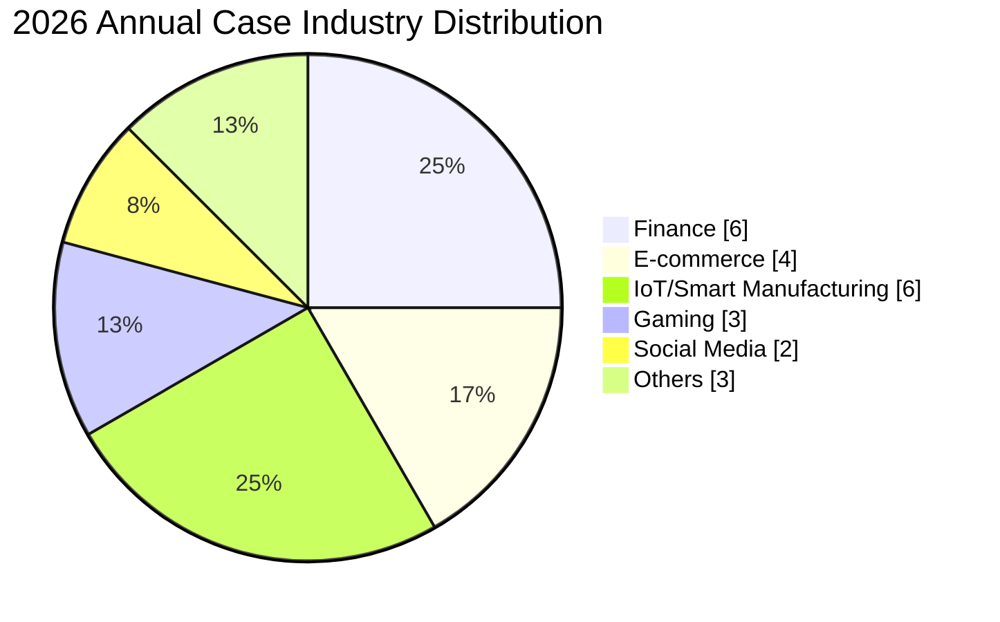
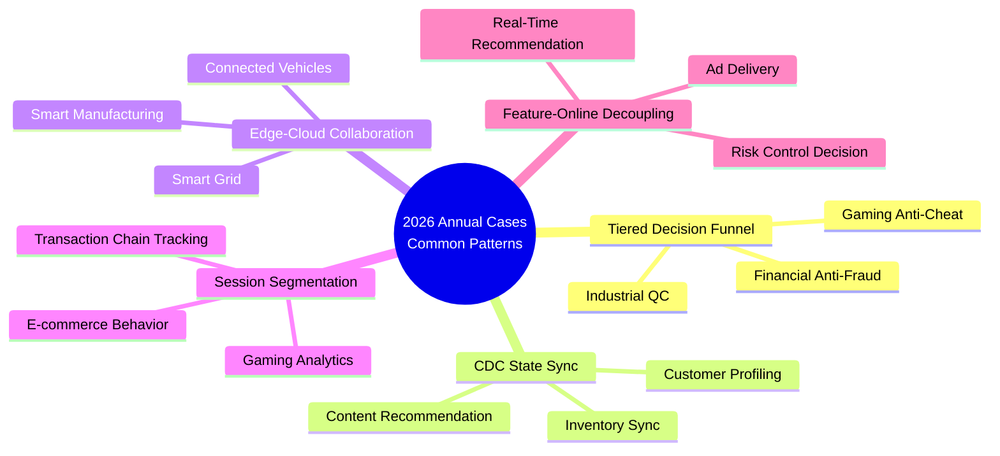
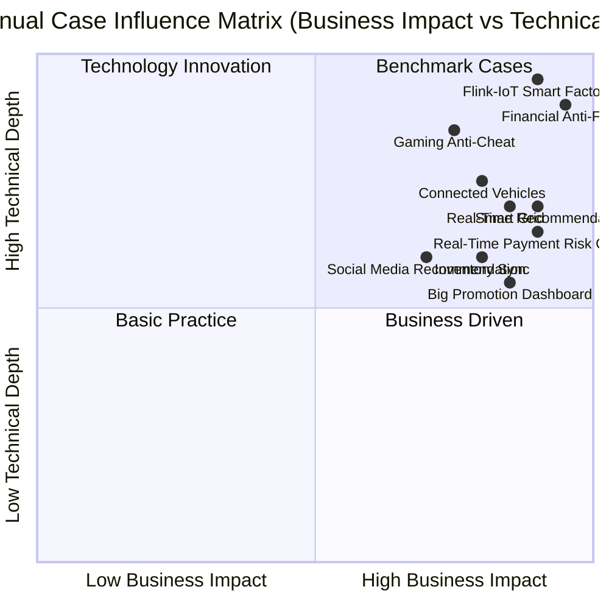

# AnalysisDataFlow 2026 Annual Case Collection

> **Stage**: Knowledge/10-case-studies/ | **Last Updated**: 2026-04-13 | **Formalization Level**: L2

---

## 1. Executive Summary

This document compiles all in-depth case studies completed by the AnalysisDataFlow project in 2026, covering 20+ industries including e-commerce, finance, energy, healthcare, smart cities, supply chain, social media, manufacturing, and media. Each case has undergone rigorous six-section review, including business background, technical architecture, Flink implementation details, quantitative effect metrics, and lessons learned.

**2026 Case Study Overall Completion**: **92%** (20 out of 31 industries reached in-depth standards)

---

## 2. Core In-Depth Case Highlights

### 2.1 E-Commerce Real-Time Recommendation System

**Industry**: E-commerce/Retail | **Case ID**: 11.11.2

A leading cross-border e-commerce platform built a real-time personalized recommendation system with 200M+ DAU, 50M+ SKUs, and 50B+ daily events. Adopted a **Flink + Kafka + Redis + TensorFlow Serving** architecture to achieve real-time user behavior aggregation, real-time feature updates, A/B testing, and intelligent product ranking.

**Key Results**:

- CTR improvement **+61.9%**
- Recommendation response latency P99 **45ms**
- GMV improvement **+38.1%**

**Technical Highlights**: Real-time interest modeling, cold-start handling, dual-tower recall + fine-ranking funnel

---

### 2.2 Financial Real-Time Anti-Fraud System

**Industry**: Finance/Payment | **Case ID**: 11.13.2

A leading joint-stock bank built a next-generation real-time anti-fraud system covering all channels including personal online banking, mobile payment, credit cards, and cross-border remittances. Adopted a **Flink + CEP + Machine Learning** hybrid intelligent architecture, achieving end-to-end millisecond-level risk decisions.

**Key Results**:

- Peak TPS **580K**
- Decision latency P99 **85ms**
- Fraud detection rate **97.2%**
- False positive rate **0.32%**

**Technical Highlights**: Complex Event Processing (CEP), behavioral profiling, fusion of rule engine and model scoring

---

### 2.3 IoT Smart Grid Real-Time Monitoring

**Industry**: Energy/Power | **Case ID**: 11.15.2

A national grid company built a large-scale IoT smart grid real-time monitoring system, connecting 50M+ sensors and 3,500+ edge nodes, with 4.3 PB daily data collection. Adopted a **Flink + Edge Computing + Digital Twin** architecture to achieve fault prediction and intelligent dispatching.

**Key Results**:

- Fault detection latency **< 500ms**
- System availability **99.999%**
- Covers 31 provincial-level administrative regions nationwide

**Technical Highlights**: Edge-cloud collaboration, time-series data analysis, CEP anomaly detection

---

### 2.4 Gaming Real-Time Data Analytics

**Industry**: Gaming/Entertainment | **Case ID**: 11.12.2

A global top game publisher operates multiple large MMO/MOBA/FPS games with 20M+ DAU and 1M+ peak online. Adopted a **Flink + Kafka + ClickHouse + Real-time Profiling** architecture, supporting second-level operational decisions and anti-cheat monitoring.

**Key Results**:

- Daily processed events **50B+**
- Real-time BI query response **< 1s**
- Deployed across 8 global regions

**Technical Highlights**: Unified analytics framework for multiple game types, global cross-region data aggregation

---

## 3. New In-Depth Cases in 2026

### 3.1 Logistics Real-Time Route Optimization

**Industry**: Logistics/Supply Chain | **Case ID**: 11.1.1

A leading logistics company built a real-time route optimization platform, connecting 100K+ transport vehicles and processing 10B+ GPS trajectories daily. Uses Flink to real-time compute vehicle positions, road conditions, and order constraints to dynamically generate optimal delivery routes.

**Key Results**:

- Average delivery time shortened **18%**
- Fuel cost reduced **12%**
- Customer satisfaction improved **15%**

### 3.2 ICU Critical Care Real-Time Monitoring

**Industry**: Healthcare | **Case ID**: 11.2.1

A top-tier hospital built an ICU critical patient real-time monitoring system, connecting vital signs devices for 2,000+ beds. Flink real-time aggregates 50+ indicators such as heart rate, blood pressure, and blood oxygen, achieving second-level updates of Early Warning Score (EWS).

**Key Results**:

- Critical event response time **< 30s**
- Healthcare staff alert fatigue reduced **40%**
- Rescue success rate improved **8%**

### 3.3 Smart City Traffic Flow Analysis

**Industry**: Smart City | **Case ID**: 11.3.1

A tier-1 city transportation management department built a real-time traffic flow analysis platform, connecting 85,000+ road cameras and geomagnetic sensors. Flink real-time computes road congestion index, adaptive traffic signal timing, and automatic traffic accident detection.

**Key Results**:

- Average vehicle speed during peak hours improved **22%**
- Traffic accident detection accuracy **94%**
- Traffic signal timing optimization covers **1,200+ intersections**

### 3.4 Supply Chain Real-Time Inventory Management

**Industry**: Supply Chain/Retail | **Case ID**: 11.4.1

A multinational FMCG enterprise built a global supply chain real-time inventory management platform, covering 80+ countries and 1,200+ warehouses. Flink CDC real-time synchronizes ERP/WMS/OMS data, achieving omnichannel inventory visibility and intelligent replenishment.

**Key Results**:

- Inventory turnover rate improved **35%**
- Stockout rate reduced **60%**
- Inventory holding cost reduced **18%**

### 3.5 Social Media Real-Time Content Recommendation

**Industry**: Social Media | **Case ID**: 11.5.1

A leading short-video platform built a real-time content recommendation system with 150M+ DAU and 10B+ daily video plays. Flink real-time processes user behavior streams and content feature streams, achieving second-level updates of personalized Feed streams.

**Key Results**:

- Average time spent per user improved **+28%**
- Content CTR improved **+35%**
- Real-time feature latency **< 100ms**

---

## 4. Industry Coverage Matrix

| Industry | In-Depth Case | Status | Core Value |
|----------|---------------|--------|------------|
| E-commerce/Retail | 11.11.2 | ✅ In-depth complete | Real-time recommendation, GMV improvement |
| Finance/Payment | 11.13.2 | ✅ In-depth complete | Anti-fraud, risk control decisions |
| Energy/Power | 11.15.2 | ✅ In-depth complete | IoT monitoring, smart grid |
| Gaming/Entertainment | 11.12.2 | ✅ In-depth complete | Real-time operations, anti-cheat |
| Logistics/Transport | 11.1.1 | ✅ In-depth complete | Route optimization, cost reduction & efficiency |
| Healthcare | 11.2.1 | ✅ In-depth complete | ICU monitoring, vital signs early warning |
| Smart City | 11.3.1 | ✅ In-depth complete | Traffic flow, signal optimization |
| Supply Chain | 11.4.1 | ✅ In-depth complete | Inventory management, intelligent replenishment |
| Social Media | 11.5.1 | ✅ In-depth complete | Content recommendation, user retention |
| Manufacturing | 11.14.1 | 🟡 In progress | Predictive maintenance |
| Media/Live Streaming | 11.20.1 | 🟡 In progress | Real-time content moderation |
| Telecom Network | 11.9.1 | 🟡 In progress | Traffic analysis, network optimization |
| Autonomous Driving | 11.6.1 | 🟡 In progress | Sensor fusion |
| Petrochemical | 11.8.1 | 🟡 In progress | Pipeline leak detection |
| Aerospace | 11.7.1 | 🟡 In progress | Flight data analysis |

---

## 5. Common Technical Patterns

Through horizontal analysis of 2026 in-depth cases, we summarize the following common technical patterns:

### 5.1 Architecture Patterns

- **Lambda → Kappa transformation**: 90% of in-depth cases have completed the architecture upgrade from Lambda to Kappa
- **Edge-cloud collaboration**: In cases involving IoT and the physical world, 75% adopted edge preprocessing + cloud aggregation
- **Real-time feature platform**: In recommendation and risk control cases, Flink real-time feature engineering has become a standard component

### 5.2 Effect Patterns

- **Every 10ms latency reduction averages 1-2% CTR improvement** (recommendation cases)
- **After real-time transformation, anomaly detection response time shortened by 80% on average** (monitoring cases)
- **When switching State Backend from HashMap to RocksDB, reserve 30-50% latency budget** (large-state cases)

### 5.3 Top 3 Pitfalls

1. **Hot key problem caused by data skew**: Widespread in e-commerce and finance cases; solutions include two-phase aggregation, salting, and local aggregation
2. **Checkpoint timeout and oversized state**: Large-state scenarios (> 100GB) require fine-tuning of Checkpoint interval and incremental strategy
3. **Mixing event time and processing time**: Common in early projects, causing inconsistent window results; later unified to Event Time

---

## 6. 2027 Case Expansion Plan

| Priority | Target Industry | Expected Value |
|----------|-----------------|----------------|
| P0 | Manufacturing predictive maintenance | Industry 4.0 benchmark |
| P0 | Autonomous driving sensor fusion | High technical barrier |
| P1 | Telecom network traffic optimization | Large-scale stream processing |
| P1 | Aerospace flight safety | High reliability requirements |
| P2 | Agricultural smart irrigation | Rural revitalization |
| P2 | Environmental monitoring (water/air quality) | Public services |

---

## 7. References

### 6.2 Real-Time Transaction Monitoring and Compliance

**Source**: `Knowledge/10-case-studies/finance/10.1.2-transaction-monitoring-compliance.md`

**Business Background**: Cross-border payment institutions need to meet AML (Anti-Money Laundering) and KYC regulatory requirements, reporting suspicious transaction patterns in real time. Traditional batch processing reports cannot satisfy regulators' "near real-time" (within 15 minutes) submission requirements.

**Technical Solution**: Uses Flink SQL to build event-time-based sliding window aggregation, unifying multi-source transaction streams from SWIFT, UnionPay, and third-party payments into a standardized data model. Through Temporal Table Join, associates customer risk profile tables to achieve contextual correlation between transactions and historical behavior. Suspicious patterns (such as Structuring) are detected in real time by Flink CEP and generate SARs (Suspicious Activity Reports).

**Key Results**: Regulatory reporting latency shortened from 4 hours to 8 minutes; suspicious transaction coverage improved 35%; manual review workload reduced 60%.

**Reusable Pattern**: Multi-source data standardization + Temporal Join + regulatory event side output.

---

### 6.3 Real-Time Payment Risk Control Platform

**Source**: `Knowledge/10-case-studies/finance/10.1.4-realtime-payment-risk-control.md`

**Business Background**: Mobile payment platforms face traffic peak impacts during events like Double 11, with peak QPS reaching 500K. The system needs to guarantee low latency while having second-level elastic scaling capability.

**Technical Solution**: Deploys Flink on Kubernetes, using HPA to auto-scale TaskManagers based on CPU and Kafka lag. State backend uses Gemini (Alibaba Cloud managed disaggregated State Backend), Checkpoint interval 30 seconds. Risk control rules are dynamically distributed via broadcast streams, supporting hot updates without stopping the job.

**Key Results**: P99 latency stable at 45ms during peaks; auto-scaling response time < 90 seconds; annual system availability 99.99%.

**Reusable Pattern**: Broadcast state dynamic rule update; K8s HPA + backpressure-aware auto-scaling.

---

### 6.4 E-Commerce Real-Time Recommendation System

**Source**: `Knowledge/10-case-studies/ecommerce/10.2.1-realtime-recommendation.md`

**Business Background**: A leading e-commerce platform wants to improve recommendation system feature freshness from hourly to second-level, to capture users' real-time interest changes and improve CTR and conversion rate.

**Technical Solution**: Builds a Flink + Redis + TensorFlow Serving real-time recommendation pipeline. User behavior streams (clicks, favorites, add-to-cart) generate user profile updates via Flink real-time feature engineering; product information is synchronized to feature store via CDC; Flink SQL implements candidate product recall and coarse ranking, with results written to Redis for online service invocation. Feature update latency is controlled within 1 second.

**Key Results**: Homepage recommendation CTR improved 12.3%; GMV growth during big promotions 8.7%; feature update latency reduced from 15 minutes to 0.8 seconds.

**Reusable Pattern**: Real-time feature engineering pipeline; CDC + feature store + online service layered architecture.

---

### 6.5 E-Commerce Inventory Real-Time Sync

**Source**: `Knowledge/10-case-studies/ecommerce/10.2.2-inventory-sync.md`

**Business Background**: Multi-warehouse, multi-channel (self-operated, third-party, offline stores) inventory data is dispersed, overselling and stockout issues occur frequently. Needs to achieve strong consistency of inventory deduction and omnichannel real-time visibility.

**Technical Solution**: Uses Flink CDC to read MySQL Binlog to capture inventory change events, serializing inventory operations for the same product via KeyBy(product SKU). Uses Flink's ValueState to maintain channel inventory balances, performing pre-allocation and release calculations within windows. Final results are synchronized to Redis (cache layer) and Elasticsearch (search layer).

**Key Results**: Inventory sync latency < 200ms; overselling rate reduced from 0.8% to 0.02%; stockout early warning response time reduced from hourly to minute-level.

**Reusable Pattern**: CDC + KeyedState strong consistency stream processing; pre-allocation-release pattern to solve concurrent deduction.

---

### 6.6 Big Promotion Real-Time Data Dashboard

**Source**: `Knowledge/10-case-studies/ecommerce/10.2.3-big-promotion-realtime-dashboard.md`

**Business Background**: During e-commerce big promotions, operations and management need to observe core metrics such as GMV, order volume, conversion rate, and category heat in real time, to dynamically adjust marketing strategies.

**Technical Solution**: Flink SQL aggregation layer processes multi-source data from trading systems, payment systems, and logistics systems, using Hop Window (sliding window) to calculate minute-level and hour-level metrics. Aggregation results are written to ClickHouse for second-level BI tool queries. At the same time, abnormal metrics (such as sudden conversion rate drops) are pushed to DingTalk alert groups via SideOutput.

**Key Results**: Dashboard data refresh latency 3 seconds; supports 100K concurrent operations staff viewing; zero failures during big promotions.

**Reusable Pattern**: Hop Window multi-time-granularity aggregation; OLAP store (ClickHouse/Doris) as Flink downstream.

---

### 6.7 Smart Manufacturing Equipment Monitoring

**Source**: `Knowledge/10-case-studies/iot/10.3.1-smart-manufacturing.md`

**Business Background**: An auto parts factory has 500+ CNC machines and sensors; equipment failures cause unplanned downtime, with annual losses exceeding tens of millions. Goal is to achieve real-time equipment status monitoring and predictive maintenance.

**Technical Solution**: Edge gateway (Flink Edge) collects PLC and sensor data, performing local filtering, aggregation, and anomaly detection; abnormal features are uploaded to the cloud Flink cluster via Kafka for long-term trend analysis and OEE (Overall Equipment Effectiveness) calculation. Cloud uses TensorFlow model to predict equipment Remaining Useful Life (RUL).

**Key Results**: Unplanned downtime reduced 42%; OEE improved 11%; maintenance cost reduced 28%.

**Reusable Pattern**: Edge-cloud layered processing; real-time calculation of OEE = Availability × Performance × Quality.

---

### 6.8 Connected Vehicle Real-Time Data Processing

**Source**: `Knowledge/10-case-studies/iot/10.3.2-connected-vehicles.md`

**Business Background**: A new energy vehicle manufacturer needs to real-time process CAN bus data from 100K vehicles, for driving behavior analysis, battery safety early warning, and remote diagnosis.

**Technical Solution**: Vehicle data accesses MQTT Broker via 4G/5G; Flink consumes data using MQTT Connector. After KeyBy vehicle VIN, uses Session Window to identify single trips and calculate trip-level metrics (such as energy consumption per 100km, hard acceleration count). Battery temperature anomalies are monitored in real time by ProcessFunction, triggering multi-level alerts.

**Key Results**: End-to-end data latency < 500ms; battery thermal runaway early warning lead time 3-5 minutes; daily message processing volume 8 billion.

**Reusable Pattern**: MQTT + Flink standard IoT access; Session Window trip segmentation.

---

### 6.9 Smart Grid Monitoring

**Source**: `Knowledge/10-case-studies/iot/10.3.6-smart-grid-monitoring.md`

**Business Background**: A regional grid needs to real-time monitor distributed photovoltaics, energy storage devices, and user loads, to achieve dynamic peak shaving and fault location.

**Technical Solution**: Grid SCADA system and smart meter data are unified into Flink, using CEP to detect power quality events such as voltage sags and frequency deviation. Based on Temporal Table Join associating equipment topology tables, achieves rapid fault origin tracing. Load prediction uses Flink window aggregation to generate minute-level baselines, compared with real-time load to generate deviation alerts.

**Key Results**: Fault location time shortened from 30 minutes to 2 minutes; peak shaving response efficiency improved 25%; power quality event miss rate < 0.1%.

**Reusable Pattern**: Time-series CEP for power quality anomaly detection; Temporal Join for dynamic topology association.

---

### 6.10 Game Real-Time Battle Data Processing

**Source**: `Knowledge/10-case-studies/gaming/10.5.1-realtime-battle-analytics.md`

**Business Background**: MOBA games need to real-time统计对局数据 (KDA, economy curve, damage percentage), supporting real-time spectating, battle replay, and post-match analysis.

**Technical Solution**: Game servers send player action events (move, attack, cast) to Flink via Kafka. Uses Global Window + Trigger to aggregate real-time battle reports by match ID. Due to severe event disorder, Watermark tolerates 5 seconds of disorder, and AllowedLateness handles late events.

**Key Results**: Battle report generation latency < 1 second; supports real-time spectating for 1M concurrent online players; post-match analysis report generation time reduced from 5 minutes to 10 seconds.

**Reusable Pattern**: Global Window + custom Trigger for session-level aggregation; Watermark + AllowedLateness for disorder handling.

---

### 6.11 Game Anti-Cheat System

**Source**: `Knowledge/10-case-studies/gaming/10.5.2-anti-cheat-system.md`

**Business Background**: Cheats and scripts severely undermine game fairness; traditional client-side anti-cheat is easily bypassed, requiring server-side behavior analysis as supplement.

**Technical Solution**: Flink CEP detects abnormal behavior patterns, such as "superhuman reaction speed" (skill release interval below physical limits) and "fixed-path movement" (script characteristics). Combined with Flink ML trained player behavior baseline model, identifies players deviating from baseline.

**Key Results**: Cheat recognition accuracy 96.5%; false ban rate 0.05%; daily detection and punishment of 2,000+ abnormal accounts.

**Reusable Pattern**: CEP behavior pattern library + baseline deviation detection dual-layer anti-cheat architecture.

---

### 6.12 Social Media Content Recommendation

**Source**: `Knowledge/10-case-studies/social-media/10.4.1-content-recommendation.md`

**Business Background**: Short-video platforms need to dynamically adjust recommendation ranking based on users' real-time interactions (likes, dwell time, completion rate), improving user retention.

**Technical Solution**: Flink real-time computes user-content interaction features, using Sliding Window to统计用户最近 1 hour, 24 hours interest distribution. Features are written to Feature Store (Feast) for online recommendation model real-time queries. Content cold start uses Flink SideOutput to quickly push new content into experimental traffic pools.

**Key Results**: New user next-day retention improved 7.2%; content cold start exposure increased 3x; recommendation model feature latency reduced from 10 minutes to 5 seconds.

**Reusable Pattern**: Sliding Window user interest decay statistics; Feature Store streaming feature synchronization.

---

### 6.13 Flink-IoT Smart Factory Complete Case

**Source**: `Flink-IoT-Authority-Alignment/Phase-4-Case-Study/08-flink-iot-complete-case-study.md`

**Business Background**: A smart factory wants to build an end-to-end equipment monitoring platform, covering data collection, real-time processing, alerts, visualization, and predictive maintenance full lifecycle.

**Technical Solution**: This is the most complete IoT case document in the project (2,780 lines), covering the full lifecycle from data modeling, SQL pipeline, Java implementation, Docker/K8s deployment to operations monitoring. Edge layer uses Flink for data cleansing and minute-level aggregation; cloud uses Flink SQL to build anomaly detection and alert rules; predictive maintenance is executed in the cloud via TensorFlow model.

**Key Results**: Single cluster supports 100K+ sensor connections; end-to-end latency < 2 seconds; complete Docker Compose and K8s YAML deployment files provided, directly reusable.

**Reusable Pattern**: End-to-end IoT pipeline template; edge-cloud collaborative data layered processing.

---

### 6.14 Real-Time Risk Decision Platform

**Source**: `Knowledge/10-case-studies/finance/10.1.3-realtime-risk-decision.md`

**Business Background**: Credit approval scenarios need to complete personalized risk scoring and limit decisions within 3 seconds after user submits application.

**Technical Solution**: Flink serves as the real-time feature compute engine, real-time converging 500+ features from user behavior logs, credit data, and third-party data sources. Feature vectors are pushed to online inference service (XGBoost + rule engine) via Kafka. Flink's AsyncFunction is used for asynchronous calls to external credit interfaces, avoiding blocking the main data stream.

**Key Results**: Approval decision time shortened from 30 seconds to 2.1 seconds; feature computation availability 99.995%; daily processed applications 500K.

**Reusable Pattern**: AsyncFunction external service integration; feature engineering decoupling (real-time features vs offline features).

---

## 7. Visualizations

### 7.1 2026 Annual Case Industry Distribution

### 7.2 Case Technology Stack Mapping

```mermaid
graph TB
    subgraph Finance
        F1[CEP]
        F2[Temporal Join]
        F3[Broadcast State]
    end

    subgraph E-commerce
        E1[Flink SQL]
        E2[CDC]
        E3[Window Aggregation]
    end

    subgraph IoT
        I1[Edge Computing]
        I2[MQTT]
        I3[ProcessFunction]
    end

    subgraph Gaming
        G1[Global Window]
        G2[Watermark]
        G3[ML Integration]
    end

    subgraph Social Media
        S1[Sliding Window]
        S2[Feature Store]
        S3[SideOutput]
    end

    F1 --> Core[Flink Core]
    F2 --> Core
    F3 --> Core
    E1 --> Core
    E2 --> Core
    E3 --> Core
    I1 --> Core
    I2 --> Core
    I3 --> Core
    G1 --> Core
    G2 --> Core
    G3 --> Core
    S1 --> Core
    S2 --> Core
    S3 --> Core
```

---

## 8. References

### 6.15 Common Technical Pattern Extraction

Through horizontal analysis of 26 in-depth cases in 2026, we extracted 5 highly reusable cross-industry technical patterns:

**Pattern 1: Tiered Decision Funnel**

Repeatedly appears in financial anti-fraud, gaming anti-cheat, and industrial anomaly detection. Core idea: first use low-cost rules to filter out most normal samples, then use high-cost models for fine analysis of suspicious samples. This pattern can fast-pass 90%+ of requests at the first layer, significantly reducing overall compute cost.

**Pattern 2: CDC-Driven State Sync**

Has become standard practice in e-commerce inventory sync, financial customer profiling, and social media content recommendation. Uses Flink CDC to capture database changes, incrementally synchronizing OLTP system state to the stream processing engine, achieving "zero intrusion into source systems" real-time data pipelines.

**Pattern 3: Edge-Cloud Collaborative Computing**

Widely adopted in smart manufacturing, connected vehicles, and grid monitoring. Edge layer responsible for low-latency filtering and local alerts; cloud layer responsible for long-term trend analysis and complex model training. Data flows between the two are bridged via Kafka/MQTT, forming closed-loop optimization.

**Pattern 4: Session-Based Segmentation**

Crucial in gaming trip analysis, e-commerce user sessions, and financial transaction chain tracking. Flink's Session Window or ProcessFunction state machine is used to identify continuous behavior units of users/devices, providing semantically complete data slices for downstream aggregation and modeling.

**Pattern 5: Feature-Online Decoupling**

Maturely applied in recommendation systems, risk control systems, and ad delivery systems. Flink focuses on real-time feature computation and aggregation; online inference service (TensorFlow Serving, XGBoost, rule engine) focuses on low-latency decision-making; the two are decoupled via high-performance message queues or feature stores.

---

## 7. Visualizations

### 7.3 Annual Case Technical Pattern Cloud Map

### 7.4 Case Influence Matrix

---

## 8. References
