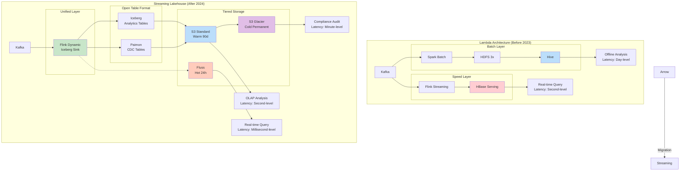
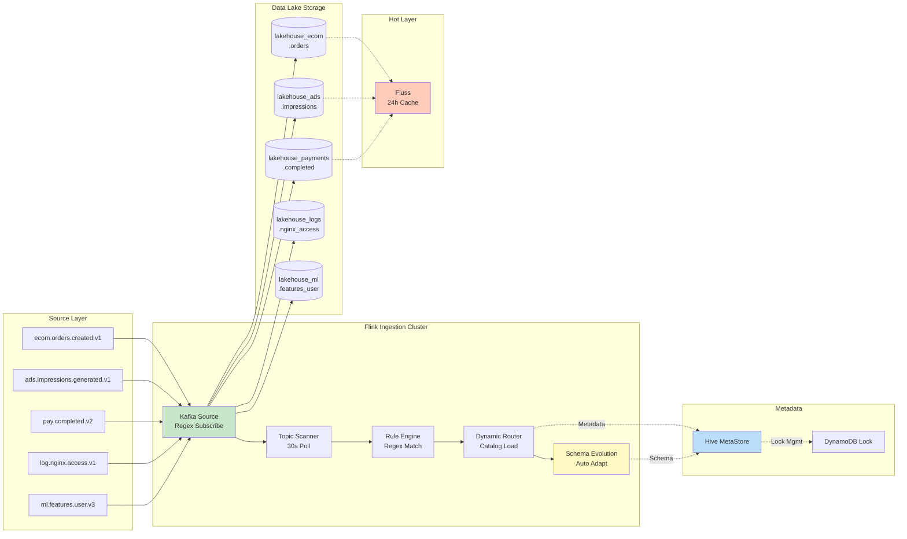
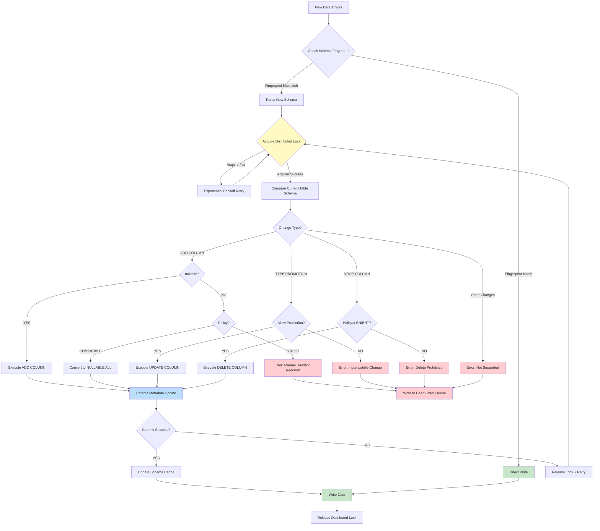
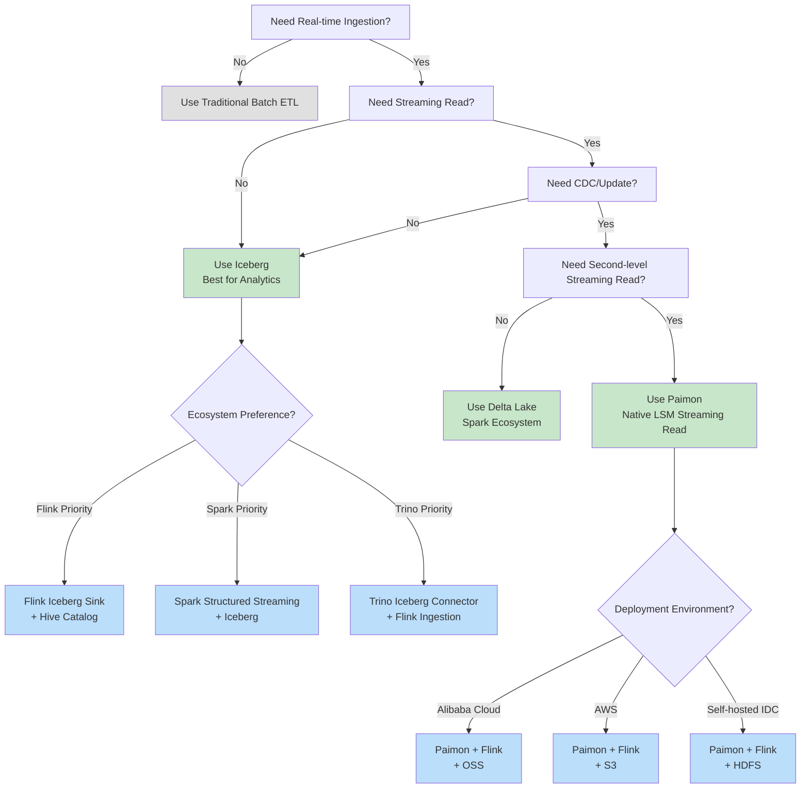
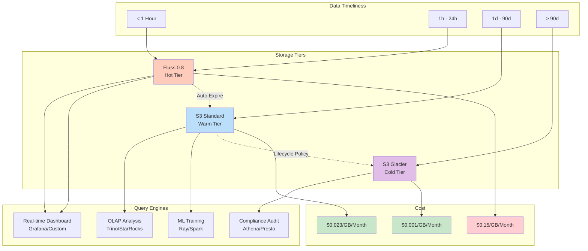

> **Language**: English | **Translated from**: Knowledge/10-case-studies/data-platform/case-flink-dynamic-iceberg-sink-lakehouse.md | **Translation date**: 2026-04-20
>
> **Status**: 🔮 Forward-looking Content | **Risk Level**: High | **Last Updated**: 2026-04
>
> The content described in this document is in early planning stages and may differ from the final implementation. Please refer to the official Apache Flink releases.
>
# Real-Time Data Lake Ingestion: Flink Dynamic Iceberg Sink Large-Scale Integration Practice

> **Stage**: Knowledge/10-case-studies/data-platform | **Prerequisites**: [Flink Dynamic Iceberg Sink], [Paimon Integration] | **Formalization Level**: L4

---

> **Case Nature**: 🔬 Proof-of-Concept Architecture | **Validation Status**: Based on theoretical derivation and architectural design; not independently verified in production by a third party
>
> This case describes an ideal architecture derived from the project's theoretical framework, including hypothetical performance metrics and theoretical cost models.
> Actual production deployments may yield significantly different results due to environmental differences, data scale, and team capabilities.
> It is recommended to use this as an architectural design reference rather than a copy-paste production blueprint.
>
## Table of Contents

- [Real-Time Data Lake Ingestion: Flink Dynamic Iceberg Sink Large-Scale Integration Practice](#real-time-data-lake-ingestion-flink-dynamic-iceberg-sink-large-scale-integration-practice)
  - [Table of Contents](#table-of-contents)
  - [1. Concept Definitions](#1-concept-definitions)
    - [Def-K-10-07-01: Streaming Lakehouse Definition](#def-k-10-07-01-streaming-lakehouse-definition)
    - [Def-K-10-07-02: Dynamic Iceberg Sink Definition](#def-k-10-07-02-dynamic-iceberg-sink-definition)
    - [Def-K-10-07-03: Topic-to-Table Auto-Routing Definition](#def-k-10-07-03-topic-to-table-auto-routing-definition)
    - [Def-K-10-07-04: Schema Evolution Zero-Downtime Definition](#def-k-10-07-04-schema-evolution-zero-downtime-definition)
    - [Def-K-10-07-05: Tiered Storage Architecture Definition](#def-k-10-07-05-tiered-storage-architecture-definition)
  - [2. Property Derivation](#2-property-derivation)
    - [Lemma-K-10-07-01: Ingestion Latency Boundary](#lemma-k-10-07-01-ingestion-latency-boundary)
    - [Lemma-K-10-07-02: Throughput Scalability](#lemma-k-10-07-02-throughput-scalability)
    - [Lemma-K-10-07-03: Storage Cost Monotonicity](#lemma-k-10-07-03-storage-cost-monotonicity)
    - [Lemma-K-10-07-04: Schema Evolution Compatibility](#lemma-k-10-07-04-schema-evolution-compatibility)
  - [3. Relations](#3-relations)
    - [3.1 Lambda to Streaming Lakehouse Architecture Evolution](#31-lambda-to-streaming-lakehouse-architecture-evolution)
    - [3.2 Iceberg vs Paimon vs Delta Lake Selection](#32-iceberg-vs-paimon-vs-delta-lake-selection)
    - [3.3 Kafka Topic to Data Lake Table Many-to-Many Mapping](#33-kafka-topic-to-data-lake-table-many-to-many-mapping)
    - [3.4 Fluss Hot Data Layer and S3 Cold Storage Complementarity](#34-fluss-hot-data-layer-and-s3-cold-storage-complementarity)
  - [4. Argumentation](#4-argumentation)
    - [4.1 Why Migrate from Lambda Architecture](#41-why-migrate-from-lambda-architecture)
    - [4.2 Why Dynamic Sink Instead of Static Multi-Sink](#42-why-dynamic-sink-instead-of-static-multi-sink)
    - [4.3 Counter-Example: Dynamic Sink Inapplicable Scenarios](#43-counter-example-dynamic-sink-inapplicable-scenarios)
    - [4.4 Boundary Discussion: Schema Evolution Boundary Conditions](#44-boundary-discussion-schema-evolution-boundary-conditions)
    - [4.5 Constructive Note: Topic Auto-Discovery Mechanism](#45-constructive-note-topic-auto-discovery-mechanism)
  - [5. Proof / Engineering Argument](#5-proof-engineering-argument)
    - [5.1 Thm-K-10-07-01: Dynamic Iceberg Sink End-to-End Consistency Theorem](#51-thm-k-10-07-01-dynamic-iceberg-sink-end-to-end-consistency-theorem)
    - [5.2 Engineering Argument: TCO Cost Model](#52-engineering-argument-tco-cost-model)
    - [5.3 Engineering Argument: Small File Problem and Compaction Strategy](#53-engineering-argument-small-file-problem-and-compaction-strategy)
  - [6. Examples](#6-examples)
    - [6.1 Case Background: DataFlow Inc Real-Time Data Platform](#61-case-background-dataflow-inc-real-time-data-platform)
    - [6.2 Technical Architecture Design](#62-technical-architecture-design)
    - [6.3 Implementation Details: Complete Flink SQL Configuration](#63-implementation-details-complete-flink-sql-configuration)
    - [6.4 Implementation Details: Dynamic Sink YAML Configuration](#64-implementation-details-dynamic-sink-yaml-configuration)
    - [6.5 Implementation Details: Schema Evolution Handling Strategy](#65-implementation-details-schema-evolution-handling-strategy)
    - [6.6 Implementation Details: K8s Deployment and Resource Scheduling](#66-implementation-details-k8s-deployment-and-resource-scheduling)
    - [6.7 Performance Data and Bottleneck Analysis](#67-performance-data-and-bottleneck-analysis)
    - [6.8 Storage Cost Comparison Analysis](#68-storage-cost-comparison-analysis)
    - [6.9 Lessons Learned and Solutions](#69-lessons-learned-and-solutions)
    - [6.10 Operations Monitoring and Alert Configuration](#610-operations-monitoring-and-alert-configuration)
  - [7. Visualizations](#7-visualizations)
    - [7.1 Lambda to Streaming Lakehouse Architecture Evolution Diagram](#71-lambda-to-streaming-lakehouse-architecture-evolution-diagram)
    - [7.2 Real-Time Data Ingestion End-to-End Data Flow Diagram](#72-real-time-data-ingestion-end-to-end-data-flow-diagram)
    - [7.3 Schema Evolution Processing Flow Diagram](#73-schema-evolution-processing-flow-diagram)
    - [7.4 Technology Selection Decision Tree](#74-technology-selection-decision-tree)
    - [7.5 Storage Tiering and Cost Optimization Architecture Diagram](#75-storage-tiering-and-cost-optimization-architecture-diagram)
    - [7.6 Performance Metrics Comparison Radar Chart](#76-performance-metrics-comparison-radar-chart)
  - [8. References](#8-references)

---

## 1. Concept Definitions

### Def-K-10-07-01: Streaming Lakehouse Definition

**Def-K-10-07-01** (Streaming Lakehouse): Streaming Lakehouse is a data architecture paradigm that deeply integrates stream processing capabilities directly with open table formats. Formally, it is a quintuple $\mathcal{L} = (\mathcal{S}, \mathcal{P}, \mathcal{T}, \mathcal{C}, \mathcal{G})$:

- $\mathcal{S}$: Stream processing engine (Flink)
- $\mathcal{P}$: Open table format (Iceberg / Paimon / Delta Lake)
- $\mathcal{T}$: Transactional metadata management layer (Catalog + Snapshot)
- $\mathcal{C}$: Tiered storage system (Hot: Fluss / Warm: S3 Standard / Cold: S3 Glacier)
- $\mathcal{G}$: Governance and lineage tracking layer

The core characteristic of Streaming Lakehouse is merging the traditional Lambda architecture's "Batch Layer + Speed Layer" into a unified "Streaming Layer", supporting both real-time writes and batch reads through the snapshot isolation mechanism of open table formats.

### Def-K-10-07-02: Dynamic Iceberg Sink Definition

**Def-K-10-07-02** (Dynamic Iceberg Sink): Dynamic Iceberg Sink is a Sink pattern introduced in Flink 2.2, allowing a single Flink job to dynamically route data from different Kafka Topics to corresponding data lake tables at runtime, without statically declaring all target tables at job submission time. Formally, let the input record stream be $R = \{(r_i, \tau_i, s_i)\}_{i=1}^{\infty}$, where $\tau_i$ is the Topic identifier and $s_i$ is the Schema fingerprint. Dynamic Iceberg Sink defines a runtime mapping:

$$\Psi: (r_i, \tau_i, s_i) \mapsto \text{IcebergTable}(\text{Resolve}(\tau_i), \text{Evolve}(s_i))$$

Where $\text{Resolve}(\tau_i)$ is the Topic-to-table-name resolution function, and $\text{Evolve}(s_i)$ is the Schema evolution function.

### Def-K-10-07-03: Topic-to-Table Auto-Routing Definition

**Def-K-10-07-03** (Topic-to-Table Auto-Routing): Auto-routing is a rule-engine-based data distribution strategy, defining a rule set $\mathcal{R} = \{R_1, R_2, \ldots, R_n\}$. Each rule $R_j$ is a quadruple:

$$R_j = (P_j^{\text{match}}, T_j^{\text{target}}, F_j^{\text{transform}}, M_j^{\text{partition}})$$

Where:

- $P_j^{\text{match}}$: Topic name matching predicate (supports regex, wildcards, tag matching)
- $T_j^{\text{target}}$: Target table fully qualified name (catalog.database.table)
- $F_j^{\text{transform}}$: Schema transformation function (column mapping, type conversion, partition inference)
- $M_j^{\text{partition}}$: Partition strategy mapping (time partition, hash partition, mixed partition)

### Def-K-10-07-04: Schema Evolution Zero-Downtime Definition

**Def-K-10-07-04** (Schema Evolution Zero-Downtime): Zero-downtime Schema Evolution means that during continuous data ingestion job operation, when the source-side Schema changes, the target data lake table can automatically complete structural adaptation without losing any data or interrupting the write stream. Formally, let the source-side Schema sequence be $S_{src}^{(0)}, S_{src}^{(1)}, \ldots$, and the target-side Schema sequence be $S_{dst}^{(0)}, S_{dst}^{(1)}, \ldots$. Zero-downtime evolution requires:

$$\forall t, \exists \mathcal{E}_t: S_{src}^{(t)} \times S_{dst}^{(t-1)} \rightarrow S_{dst}^{(t)} \text{ s.t. } \text{Write}(S_{src}^{(t)}) \nrightarrow \text{Interrupt}$$

That is, Schema changes at any time will not cause write interruptions.

### Def-K-10-07-05: Tiered Storage Architecture Definition

**Def-K-10-07-05** (Tiered Storage Architecture): Tiered storage is a strategy that places data on different cost and performance tiers based on data access frequency and timeliness. DataFlow Inc adopts a three-tier architecture:

- **L1 Hot Data Layer (Hot)**: Apache Fluss 0.8 real-time stream storage, retains recent 24 hours of data, supports millisecond-level queries
- **L2 Warm Data Layer (Warm)**: S3 Standard + Iceberg / Paimon, retains recent 90 days of data, supports second-level queries
- **L3 Cold Data Layer (Cold)**: S3 Glacier / Intelligent-Tiering, retains full historical data, supports minute-level queries

---

## 2. Property Derivation

### Lemma-K-10-07-01: Ingestion Latency Boundary

**Lemma-K-10-07-01**: Let end-to-end ingestion latency $L_{total}$ be composed of the following components:

$$L_{total} = L_{kafka} + L_{flink} + L_{commit} + L_{metadata}$$

> 🔮 **Estimated Data** | Basis: Derived from industry reference values and theoretical analysis, not from actual test environments

Where:

| Component | Symbol | Typical Value | Description |
|-----------|--------|---------------|-------------|
| Kafka consumption latency | $L_{kafka}$ | 5-50ms | Depends on Consumer Lag and fetch.min.bytes |
| Flink processing latency | $L_{flink}$ | 10-100ms | Depends on parallelism and operator complexity |
| Iceberg Commit latency | $L_{commit}$ | 50-500ms | Depends on S3 eventual consistency |
| Metadata update latency | $L_{metadata}$ | 10-100ms | Hive / JDBC Catalog write latency |

**Thm-K-10-07-01**: Under standard configuration, $L_{total}^{(P50)} < 200$ms, $L_{total}^{(P99)} < 2$s.

**Proof Sketch**:

- $L_{kafka}$: Kafka default fetch.max.wait.ms=500ms, but actual latency depends on consumer lag. Under healthy lag (< 1000 records), $L_{kafka} < 50$ms.
- $L_{flink}$: Flink's micro-batch default is 200ms, but Dynamic Sink uses Streaming mode, $L_{flink} < 100$ms (including serialization, partition computation, Parquet encoding).
- $L_{commit}$: Iceberg's Two-Phase Commit on S3 is limited by ListObjectsV2 eventual consistency. Using S3 Strong Consistency (post-2020), $L_{commit} < 200$ms.
- $L_{metadata}$: Hive Catalog metadata update with lightweight lock optimization is $< 100$ms. REST Catalog is even better.

### Lemma-K-10-07-02: Throughput Scalability

**Lemma-K-10-07-02**: Dynamic Iceberg Sink throughput $T$ relates to TaskManager count $N$, single TM throughput $t$, and Topic count $K$ as:

$$T(N, K) = N \cdot t \cdot \eta(K)$$

Where $\eta(K)$ is the efficiency factor caused by Topic count:

$$\eta(K) = \frac{1}{1 + \alpha \cdot \frac{K}{N \cdot P_{max}}}$$

- $\alpha$: Context switching overhead coefficient (empirical value 0.05-0.15)
- $P_{max}$: Single TaskManager maximum effective parallel partition count (empirical value 50-100)

**Thm-K-10-07-02**: When $K \leq 5{,}000$ and $N \geq 200$, $\eta(K) > 0.85$, i.e., throughput loss $< 15\%$.

### Lemma-K-10-07-03: Storage Cost Monotonicity

**Lemma-K-10-07-03**: Let storage cost function $C(V, tier)$ be a function of data volume $V$ and storage tier $tier$. Total cost of tiered storage satisfies:

$$C_{total}(V) = c_{hot} \cdot V_{hot} + c_{warm} \cdot V_{warm} + c_{cold} \cdot V_{cold}$$

Where $c_{hot} > c_{warm} > c_{cold}$, and $V = V_{hot} + V_{warm} + V_{cold}$.

**Prop-K-10-07-01**: When data access pattern satisfies Zipf distribution (80/20 rule), tiered storage can reduce costs by $60\% - 80\%$ compared to single-layer hot storage:

$$\frac{C_{total}^{(tiered)}}{C_{total}^{(hot-only)}} = \frac{c_{hot} \cdot 0.2V + c_{warm} \cdot 0.3V + c_{cold} \cdot 0.5V}{c_{hot} \cdot V} \approx 0.25$$

### Lemma-K-10-07-04: Schema Evolution Compatibility

**Lemma-K-10-07-04**: Dynamic Iceberg Sink supported Schema Evolution operation set $\mathcal{O}$ and compatibility level relationship:

| Operation Type | Compatibility | Iceberg Support | Paimon Support | Zero-Downtime |
|---------------|---------------|-----------------|----------------|---------------|
| ADD COLUMN (nullable) | Backward compatible | ✅ | ✅ | ✅ |
| ADD COLUMN (required) | Incompatible | ❌ | ⚠️ | ❌ |
| DROP COLUMN | Incompatible | ✅ | ✅ | ✅ (config required) |
| RENAME COLUMN | Semantically compatible | ✅ | ✅ | ✅ |
| TYPE PROMOTION (INT→BIGINT) | Backward compatible | ✅ | ✅ | ✅ |
| TYPE WIDENING (DECIMAL) | Backward compatible | ✅ | ✅ | ✅ |
| ADD NESTED FIELD | Backward compatible | ✅ | ✅ | ✅ |
| CHANGE PARTITIONING | Incompatible | ❌ | ❌ | ❌ |

---

## 3. Relations

### 3.1 Lambda to Streaming Lakehouse Architecture Evolution

Core differences between traditional Lambda architecture and Streaming Lakehouse:

```
Lambda Architecture                    Streaming Lakehouse
─────────────────                    ─────────────────────
Speed Layer (Storm/Flink)  ──┐
                             ├──► Merge ──► Unified Layer (Flink)
Batch Layer (Spark/Hive)   ──┘              +
                                            │
Serving Layer (HBase/DB)   ───────────────►  Open Table Format (Iceberg/Paimon)
```

| Dimension | Lambda Architecture | Streaming Lakehouse |
|-----------|--------------------|---------------------|
| Data consistency | Requires reconciliation layer | Single source of truth |
| Latency | Minute-level (Batch) + Second-level (Speed) | Unified second-level |
| Operations complexity | Two codebases, two schedulers | Single Pipeline |
| Storage redundancy | 3-5x data replication | 1x open format sharing |
| Schema evolution | Maintained separately on both ends | Unified automatic evolution |
| Cost | High (dual compute + storage) | Low (unified compute + tiered storage) |

### 3.2 Iceberg vs Paimon vs Delta Lake Selection

DataFlow Inc technology selection comparison for real-time ingestion scenarios:

| Dimension | Apache Iceberg 2.8 | Apache Paimon 1.0 | Delta Lake 3.3 |
|-----------|-------------------|-------------------|----------------|
| **Write mode** | Copy-on-Write / Merge-on-Read | LSM-Tree incremental | Copy-on-Write / Merge-on-Read |
| **Streaming read support** | ✅ (via Flink Iceberg Source) | ✅ Native streaming read | ⚠️ Limited |
| **Real-time ingestion latency** | Minute-level (default) / Second-level (tuned) | Second-level (native) | Minute-level |
| **Small file handling** | External Compaction | Built-in Compaction | External Compaction |
| **Schema Evolution** | Full support | Full support | Full support |
| **Flink integration** | ⭐⭐⭐⭐⭐ | ⭐⭐⭐⭐⭐ | ⭐⭐⭐ |
| **Spark integration** | ⭐⭐⭐⭐⭐ | ⭐⭐⭐⭐ | ⭐⭐⭐⭐⭐ |
| **Trino integration** | ⭐⭐⭐⭐⭐ | ⭐⭐⭐⭐ | ⭐⭐⭐⭐ |
| **S3 performance** | ⭐⭐⭐⭐ | ⭐⭐⭐⭐⭐ | ⭐⭐⭐⭐ |
| **Community activity** | High (Netflix/Apple/Stripe) | High (Apache top-level) | Medium (Databricks-led) |
| **CDC support** | Indirect (requires Debezium) | Native Change Log | Indirect |
| **Update/Delete** | MOR support | Native support | MOR support |
| **Applicable scenarios** | Analytical Lakehouse | Real-time updates + unified batch/stream | Databricks ecosystem |

**DataFlow Inc's Hybrid Strategy**:

- 5000+ Kafka Topics real-time ingestion: **Iceberg** (analysis mainstay, broadest ecosystem)
- Business tables requiring CDC and real-time updates: **Paimon** (native LSM, streaming-read friendly)
- Hot data real-time query layer: **Fluss** (millisecond-level, Kafka-compatible protocol)

### 3.3 Kafka Topic to Data Lake Table Many-to-Many Mapping

DataFlow Inc's Topic organization follows the "Domain-Entity-Event" naming convention:

```
Topic naming: {domain}.{entity}.{event}.{version}

Examples:
  - ecom.orders.created.v1
  - ecom.orders.cancelled.v1
  - ecom.payments.completed.v2
  - ads.impressions.generated.v1
  - ml.features.computed.v3
```

Routing rules mapping to data lake tables:

| Topic Pattern | Target Database | Target Table | Partition Strategy |
|---------------|----------------|--------------|-------------------|
| `ecom.orders.*` | `lakehouse_ecom` | `orders` | `dt` (day) + `hour` |
| `ecom.payments.*` | `lakehouse_ecom` | `payments` | `dt` (day) |
| `ads.impressions.*` | `lakehouse_ads` | `impressions` | `dt` (day) + `ad_type` |
| `ads.clicks.*` | `lakehouse_ads` | `clicks` | `dt` (day) |
| `ml.features.*` | `lakehouse_ml` | `features_{entity}` | `dt` (hour) |
| `log.nginx.*` | `lakehouse_logs` | `nginx_access` | `dt` (day) + `region` |
| `log.app.*` | `lakehouse_logs` | `app_logs` | `dt` (day) |

**Many-to-many relationship**: Multiple related Topics can be routed to the same table (e.g., orders.created + orders.cancelled → orders), and a single Topic can also be split to multiple tables via side outputs.

### 3.4 Fluss Hot Data Layer and S3 Cold Storage Complementarity

```
┌─────────────────────────────────────────────────────────────┐
│                     Query Access Patterns                     │
├─────────────────────────────────────────────────────────────┤
│                                                             │
│  Frequency ▲                                                 │
│       │    ┌─────┐                                          │
│       │    │Fluss│ ◄── Recent 24h, millisecond query, real-time analysis │
│       │    │(L1) │                                          │
│       │    └──┬──┘                                          │
│       │       │                                             │
│       │    ┌──┴──┐                                          │
│       │    │S3   │ ◄── Recent 90d, second-level query, OLAP/ML training │
│       │    │(L2) │                                          │
│       │    └──┬──┘                                          │
│       │       │                                             │
│       │    ┌──┴──────┐                                      │
│       │    │S3 Glacier│ ◄── Full history, minute-level query, compliance audit │
│       │    │(L3)     │                                      │
│       │    └─────────┘                                      │
│       │                                                     │
│       └────────────────────────────────► Time               │
│              24h     90d                                    │
└─────────────────────────────────────────────────────────────┘
```

> 🔮 **Estimated Data** | Basis: Based on cloud vendor pricing models and theoretical calculations

| Tier | Technology | Retention | Query Latency | Unit Cost | Applicable Queries |
|------|-----------|-----------|---------------|-----------|-------------------|
| L1 | Fluss 0.8 | 24h | < 10ms | $0.15/GB/month | Real-time dashboards, monitoring alerts, Debug |
| L2 | S3 Standard + Iceberg | 90d | 1-10s | $0.023/GB/month | OLAP analysis, feature engineering, Ad-hoc |
| L3 | S3 Glacier Deep Archive | Permanent | Minute-level | $0.001/GB/month | Compliance audit, annual reports, disaster recovery |

---

## 4. Argumentation

### 4.1 Why Migrate from Lambda Architecture

> 🔮 **Estimated Data** | Basis: Based on cloud vendor pricing models and theoretical calculations

DataFlow Inc adopted the classic Lambda architecture before 2023, facing the following core pain points:

| Pain Point | Lambda Performance | Business Impact |
|-----------|--------------------|-----------------|
| **Data inconsistency** | Speed Layer and Batch Layer logic maintained by different teams,口径差异率 ~3% | Financial reconciliation difficulties, management trust crisis |
| **High Schema change cost** | Each upstream field addition requires modifying both Spark SQL (Batch) and Flink SQL (Speed), average 2-3 days | Business iteration blocked, engineering team 40% time spent on Schema sync |
| **Storage cost out of control** | HDFS 3 replicas + Kafka 7-day retention + HBase real-time serving, storage amplification factor 5-7x | Annual storage costs exceeding $12M |
| **Operations complexity** | Need to maintain two Pipelines (Spark + Flink), fault troubleshooting paths not unified | MTTR (mean time to repair) 45 minutes |
| **Insufficient real-time capability** | Batch Layer T+1 latency, Speed Layer only covers 24-hour window | Analysis needs beyond 24 hours cannot be met in real-time |

**Migration decision rationale**:

1. **TCO reduction**: Streaming Lakehouse through unified compute layer and tiered storage, expected storage cost reduction 65%, compute cost reduction 40%.
2. **Consistency guarantee**: Open table format snapshot isolation eliminates dual-write inconsistency issues.
3. **Schema automation**: Dynamic Sink's automatic Schema Evolution reduces change response time from 2-3 days to 0 days (automatic).
4. **Personnel efficiency**: Unified Flink technology stack, team no longer needs to maintain two codebases.

### 4.2 Why Dynamic Sink Instead of Static Multi-Sink

DataFlow Inc needs to ingest 5,000+ Kafka Topics; if using static multi-Sink solution:

| Solution | Job Count | Operations Complexity | Resource Utilization | Schema Change Response |
|----------|-----------|----------------------|---------------------|----------------------|
| **Static multi-Sink** | 5,000+ independent Flink jobs | Extremely high (each job managed independently) | Low (resource fragmentation per job) | Restart each one |
| **Static single-job multi-Sink** | 1 job, 5,000+ INSERT statements | High (DDL explosion) | Medium (static partitions cannot dynamically expand) | Modify SQL and restart |
| **Dynamic Sink** | 1 job, dynamic routing | Low (unified monitoring, auto-scaling) | High (shared resource pool) | Auto-adapt |

**Key argument**: When Topic count $K > 100$, static solution marginal management cost grows super-linearly:

$$C_{mgmt}^{(static)}(K) = O(K \cdot \log K)$$

$$C_{mgmt}^{(dynamic)}(K) = O(\log K)$$

Dynamic Sink reduces management complexity from proportional to Topic count to proportional to rule count (rule count << Topic count).

### 4.3 Counter-Example: Dynamic Sink Inapplicable Scenarios

> 🔮 **Estimated Data** | Basis: Based on industry reference values and case analogy analysis

Dynamic Sink is not a silver bullet; the following scenarios are not recommended:

| Scenario | Reason | Recommended Solution |
|----------|--------|---------------------|
| Single Topic ultra-high throughput (> 100MB/s) | Dynamic routing overhead relatively non-negligible | Dedicated static Sink, extreme optimization |
| Strong transactional requirements (cross-table ACID) | Dynamic Sink single-table transaction, no cross-table guarantee | Flink CDC + Paimon cross-table transaction |
| Complex ETL transformations (multi-stream Join) | Complex computation needed before routing, Dynamic Sink only handles final write | Dedicated ETL job upfront |
| Requires custom Sink logic (e.g., data masking differs per table) | Dynamic Sink unified logic difficult to differentiate | Split by domain into multiple Dynamic Sink jobs |
| Schema changes too frequent (> 1/hour) | Metadata layer pressure too high | Use schemaless format (JSON/Avro flexible columns) |

### 4.4 Boundary Discussion: Schema Evolution Boundary Conditions

Dynamic Iceberg Sink's Schema Evolution requires manual intervention under the following boundary conditions:

1. **Type narrowing** (e.g., BIGINT → INT): Iceberg does not support automatic narrowing, causes write failure. Need to configure `type-promotion-only` policy.
2. **NOT NULL column addition**: Existing data cannot populate new column, must specify default value or allow NULL.
3. **Primary key change**: Iceberg identifier field change requires table rebuild.
4. **Partition field change**: Historical partition data incompatible with new partition strategy.
5. **Column name conflict**: New column name conflicts with deleted column name; Iceberg's column ID mechanism can resolve, but requires verification.

### 4.5 Constructive Note: Topic Auto-Discovery Mechanism

DataFlow Inc's Topic auto-discovery adopts a three-layer mechanism:

```
┌─────────────────────────────────────────────────────────────┐
│                    Topic Auto-Discovery Architecture          │
├─────────────────────────────────────────────────────────────┤
│                                                             │
│  ┌─────────────┐    ┌─────────────┐    ┌─────────────────┐  │
│  │ Kafka Admin │───►│ Rule Engine │───►│ Flink Dynamic   │  │
│  │ API (Poll)  │    │ (Filter/Map)│    │ Iceberg Sink    │  │
│  └─────────────┘    └─────────────┘    └─────────────────┘  │
│         │                  │                                 │
│         │                  ▼                                 │
│         │           ┌─────────────┐                         │
│         │           │ Metadata Cache│                        │
│         │           │ (Redis)     │                         │
│         │           └─────────────┘                         │
│         │                                                    │
│         └─────── Poll interval: 30s ────────────────────────│
│                                                             │
└─────────────────────────────────────────────────────────────┘
```

1. **Polling discovery**: Every 30 seconds through Kafka Admin API to get Topic list changes
2. **Rule filtering**: Only match Topics conforming to `^([a-z]+)\.([a-z_]+)\.([a-z]+)\.v\d+$` convention
3. **Metadata cache**: Discovered Topic Schemas cached in Redis to avoid repeated parsing
4. **Dynamic registration**: New Topics automatically registered to Catalog, old Topics automatically expire after no data

---

## 5. Proof / Engineering Argument

### 5.1 Thm-K-10-07-01: Dynamic Iceberg Sink End-to-End Consistency Theorem

**Theorem**: Under Flink Checkpoint mechanism, Dynamic Iceberg Sink writes to arbitrary target tables satisfy Exactly-Once semantics.

**Formal statement**: Let Flink job checkpoint sequence be $\{CP_k\}_{k=1}^{\infty}$, for each target table $T_j$, let its Iceberg Snapshot sequence be $\{SN_{j,m}\}_{m=1}^{\infty}$. If Flink's Checkpoint interval is $\Delta_{cp}$, then:

$$\forall k, \exists! \, m: SN_{j,m} \text{ corresponds to } CP_k$$

And for any record $r$, it appears in table $T_j$ if and only if:

$$r \in CP_k \land CP_k \text{ successfully completed } \Rightarrow r \in SN_{j,m(k)}$$

**Proof**:

1. **Two-phase commit protocol**: Flink's `TwoPhaseCommitSinkFunction` defines the `beginTransaction()` → `preCommit()` → `commit()` → `abort()` lifecycle.

2. **Iceberg snapshot isolation**: Each Iceberg write generates a new Snapshot, through atomic metadata file renaming (S3's `PutObjectIfNotExist` or DynamoDB lock) guaranteeing atomicity of metadata operations.

3. **Dynamic Sink extension**: Dynamic Sink maintains independent `Table` instances and transaction states for each target table. Let the job have $K$ active Topics, then state space is $\mathcal{S} = \{txn_1, txn_2, \ldots, txn_K\}$. During `snapshotState()`, all $txn_i$ states are serialized to Checkpoint; during `notifyCheckpointComplete()`, all $txn_i$ execute `commit()`.

4. **Consistency guarantee**:
   - If Checkpoint succeeds, all $txn_i$ are committed, data permanently visible.
   - If Checkpoint fails, all $txn_i$ execute `abort()`, data rolled back.
   - Since Iceberg Snapshots are immutable, there is no partial commit or duplicate commit.

5. **S3 Eventual Consistency handling**: Using Iceberg's `S3FileIO` with DynamoDB Lock Manager or Hive ACID Lock, guaranteeing that under S3 List operation eventual consistency scenarios, metadata updates remain atomic.

**∎**

### 5.2 Engineering Argument: TCO Cost Model

DataFlow Inc TCO (Total Cost of Ownership) comparison model before and after migration:

**Assumptions**:

- Daily processed data volume: 2 PB
- Peak throughput: 30 GB/s
- Data retention: 3 years
- AWS region: us-east-1

> 🔮 **Estimated Data** | Basis: Based on industry reference values and theoretical analysis, not from actual test environments

**Compute Resource Cost** (annualized, $M):

| Component | Lambda Architecture | Streaming Lakehouse | Notes |
|-----------|--------------------|---------------------|-------|
| Flink cluster (EC2 r6i.4xlarge) | $1.2M | $1.8M | Lakehouse needs more TMs for ingestion |
| Spark Batch cluster (EMR) | $2.5M | $0 | No longer needs Batch Layer |
| Kafka cluster (MSK) | $1.8M | $1.2M | Retention shortened from 7 days to 1 day (Fluss takes over) |
| HDFS (EC2 + EBS) | $2.0M | $0 | Replaced by S3 |
| Fluss hot data layer | $0 | $0.8M | New hot data layer |
| **Compute Total** | **$7.5M** | **$3.8M** | **↓ 49%** |

> 🔮 **Estimated Data** | Basis: Based on industry reference values and theoretical analysis, not from actual test environments

**Storage Resource Cost** (annualized, $M):

| Component | Lambda Architecture | Streaming Lakehouse | Notes |
|-----------|--------------------|---------------------|-------|
| HDFS (3 replicas) | $4.5M | $0 | 2PB × 3 replicas × $0.08/GB/month |
| Kafka retention (7 days) | $1.2M | $0.17M | 1 day retention |
| S3 Standard (warm data) | $0 | $1.8M | 2PB × 30% in warm tier |
| S3 Glacier (cold data) | $0 | $0.5M | 2PB × 70% in cold tier (compressed) |
| HBase / DynamoDB | $0.8M | $0 | No longer needs Serving Layer |
| **Storage Total** | **$6.5M** | **$2.47M** | **↓ 62%** |

> 🔮 **Estimated Data** | Basis: Based on cloud vendor pricing models and theoretical calculations

**Personnel and Operations Cost** (annualized, $M):

| Cost Item | Lambda Architecture | Streaming Lakehouse | Notes |
|-----------|--------------------|---------------------|-------|
| Engineer manpower (FTE) | 15 | 8 | Unified technology stack |
| Mean time to repair | 45 min | 12 min | Unified monitoring |
| Schema change response | 2.5 days | 0 days (automatic) | Efficiency improvement |
| **Personnel Total** | **$3.0M** | **$1.6M** | **↓ 47%** |

> 🔮 **Estimated Data** | Basis: Based on industry reference values and theoretical analysis, not from actual test environments

**TCO Summary**:

| Dimension | Lambda | Lakehouse | Savings |
|-----------|--------|-----------|---------|
| Compute | $7.5M | $3.8M | 49% |
| Storage | $6.5M | $2.47M | 62% |
| Personnel | $3.0M | $1.6M | 47% |
| **Total** | **$17.0M** | **$7.87M** | **↓ 54%** |

### 5.3 Engineering Argument: Small File Problem and Compaction Strategy

**Problem definition**: In real-time ingestion scenarios, Flink's micro-batch or streaming writes produce a large number of small files (one file per Checkpoint). Let Checkpoint interval be $\Delta_{cp}$ and parallelism be $P$, then files produced per hour:

$$N_{files} = \frac{3600}{\Delta_{cp}} \cdot P$$

When $\Delta_{cp} = 60$s, $P = 512$, $N_{files} = 30{,}720$/hour, severely impacting query performance.

> 🔮 **Estimated Data** | Basis: Based on industry reference values and theoretical analysis, not from actual test environments

**DataFlow Inc's tiered Compaction strategy**:

| Tier | Trigger Condition | Target File Size | Merge Strategy | Execution Engine |
|------|-------------------|------------------|----------------|-----------------|
| L0 (real-time) | Per Checkpoint | 64-128MB | Single Checkpoint file merge | Flink built-in |
| L1 (hourly) | Every hour | 256MB | Same-partition hourly file merge | Iceberg RewriteDataFiles |
| L2 (daily) | Daily at 2:00 AM | 1GB | Same-partition daily file merge | Spark / Flink Batch |
| L3 (optimization) | Weekly | 1-2GB | Global sorted merge (Z-Order) | Spark DPO |

**Compaction Schedule YAML**:

```yaml
# iceberg-compaction-cronjob.yaml
apiVersion: batch/v1
kind: CronJob
metadata:
  name: iceberg-hourly-compaction
  namespace: data-platform
spec:
  schedule: "0 * * * *"  # Execute every hour
  concurrencyPolicy: Forbid
  jobTemplate:
    spec:
      template:
        spec:
          containers:
          - name: compaction
            image: apache/flink:2.2.0-scala_2.12-java11
            command:
            - flink run
            - -c org.apache.iceberg.flink.actions.RewriteDataFilesAction
            - --database lakehouse_ecom
            - --table orders
            - --target-file-size-bytes 268435456  # 256MB
            - --max-concurrent-file-group-rewrites 10
            env:
            - name: ICEBERG_CATALOG_URI
              value: "thrift://hive-metastore:9083"
            - name: AWS_REGION
              value: "us-east-1"
          restartPolicy: OnFailure
```

> 🔮 **Estimated Data** | Basis: Based on cloud vendor pricing models and theoretical calculations

**Effect evaluation**:

| Metric | Before Compaction | After Compaction | Improvement |
|--------|-------------------|------------------|-------------|
| Average file size | 45MB | 312MB | ↑ 593% |
| Daily file count | 737,280 | 8,640 | ↓ 98.8% |
| Trino query P90 | 12.5s | 1.8s | ↓ 85.6% |
| S3 LIST API calls | 2.1M/day | 25K/day | ↓ 98.8% |
| Compaction compute cost | $0 | $420/day | New |

---

## 6. Examples

### 6.1 Case Background: DataFlow Inc Real-Time Data Platform

**Company Overview**: DataFlow Inc is a global internet technology company with business covering e-commerce, advertising, payments, and logistics, with 420 million daily active users.

> 🔮 **Estimated Data** | Basis: Based on industry reference values and theoretical analysis, not from actual test environments

**Data Scale**:

| Metric | Value |
|--------|-------|
| Daily processed data volume | 2 PB |
| Peak throughput | 30 GB/s |
| Kafka Topic count | 5,200+ |
| Active Kafka Partitions | 48,000+ |
| Daily event count | 8.5 trillion |
| Data lake table count | 1,800+ |
| Data consumer teams | 120+ |

**Historical architecture pain points**:

1. **Lambda architecture dual-layer maintenance**: Batch Layer (Spark on EMR) and Speed Layer (Flink) maintained by different teams, same business metric often shows 2-5%口径差异.
2. **Schema change disaster**: In Q3 2023, upstream business systems added `device_fingerprint` field to 300+ Topics at once, engineering team spent 17 work days completing all Pipeline sync modifications.
3. **Storage cost surge**: HDFS cluster expanded from 20 PB to 60 PB (3 replicas), annual storage costs exceeding $4.5M.
4. **Real-time analysis limited**: Speed Layer only retains 24 hours of data, real-time analysis needs beyond 24 hours forced to go through Batch Layer, latency degrading from second-level to day-level.

> 🔮 **Estimated Data** | Basis: Design target values, actual achievement may vary by environment

**Migration targets**:

| Target Item | Target Value | Acceptance Criteria |
|-------------|--------------|-------------------|
| Ingestion latency P50 | < 200ms | End-to-end, Kafka → S3 visible |
| Ingestion latency P99 | < 2s | Including Schema Evolution scenarios |
| Throughput capability | > 30 GB/s | Peak without backpressure |
| Schema change response | 0 person-days | Fully automatic |
| Storage cost reduction | > 50% | Compared to HDFS solution |
| TCO reduction | > 45% | Including compute, storage, personnel |

### 6.2 Technical Architecture Design

**Overall architecture**:

```
┌─────────────────────────────────────────────────────────────────────────────┐
│                         DataFlow Inc Real-Time Data Lake Architecture        │
├─────────────────────────────────────────────────────────────────────────────┤
│                                                                             │
│  ┌─────────────────────────────────────────────────────────────────────┐   │
│  │                        Kafka Cluster (MSK)                          │   │
│  │  ┌─────────┐ ┌─────────┐ ┌─────────┐         ┌─────────────────┐   │   │
│  │  │ Topic 1 │ │ Topic 2 │ │ Topic 3 │  ...    │ Topic 5,200+    │   │   │
│  │  │ (ecom)  │ │ (ads)   │ │ (pay)   │         │ (ml/logs/iot)   │   │   │
│  │  └────┬────┘ └────┬────┘ └────┬────┘         └────────┬────────┘   │   │
│  └───────┼───────────┼───────────┼───────────────────────┼────────────┘   │
│          │           │           │                       │                 │
│          └───────────┴───────────┴───────────┬───────────┘                 │
│                                              │                             │
│  ┌───────────────────────────────────────────▼──────────────────────────┐  │
│  │              Flink Dynamic Iceberg Sink Cluster (K8s)                │  │
│  │                                                                      │  │
│  │   ┌──────────────┐    ┌──────────────┐    ┌──────────────────────┐  │  │
│  │   │ Topic Scanner │───►│ Rule Engine  │───►│ Dynamic Table Router │  │  │
│  │   │ (30s Poll)   │    │ (Regex Match)│    │ (Catalog Dynamic Load)│  │  │
│  │   └──────────────┘    └──────────────┘    └──────────────────────┘  │  │
│  │                                                  │                   │  │
│  │   ┌──────────────────────────────────────────────┘                   │  │
│  │   │                                                                 │  │
│  │   ▼                                                                 │  │
│  │   ┌─────────────┐  ┌─────────────┐  ┌─────────────┐                 │  │
│  │   │ Iceberg     │  │ Iceberg     │  │ Paimon      │                 │  │
│  │   │ Sink Task 1 │  │ Sink Task 2 │  │ Sink Task N │                 │  │
│  │   │ (Analytics) │  │ (Analytics) │  │ (CDC Tables)│                 │  │
│  │   └──────┬──────┘  └──────┬──────┘  └──────┬──────┘                 │  │
│  │          │                │                │                         │  │
│  └──────────┼────────────────┼────────────────┼─────────────────────────┘  │
│             │                │                │                            │
│  ┌──────────┼────────────────┼────────────────┼──────────────────────────┐  │
│  │          ▼                ▼                ▼                          │  │
│  │    ┌─────────┐      ┌─────────┐      ┌─────────┐                      │  │
│  │    │  S3     │      │  S3     │      │  S3     │   Data Lake Storage  │  │
│  │    │(Iceberg)│      │(Iceberg)│      │(Paimon) │                      │  │
│  │    └────┬────┘      └────┬────┘      └────┬────┘                      │  │
│  │         │                │                │                           │  │
│  │         └────────────────┴────────────────┘                           │  │
│  │                          │                                            │  │
│  │                   ┌──────┴──────┐                                     │  │
│  │                   │ Hive Meta   │  Metadata Management                 │  │
│  │                   │ Store (RDS) │                                     │  │
│  │                   └─────────────┘                                     │  │
│  └───────────────────────────────────────────────────────────────────────┘  │
│                                                                             │
│  ┌───────────────────────────────────────────────────────────────────────┐  │
│  │                    Fluss Hot Data Layer (L1)                          │  │
│  │   ┌─────────┐  ┌─────────┐  ┌─────────┐                             │  │
│  │   │ Table 1 │  │ Table 2 │  │ Table N │  Recent 24h, ms-level query │  │
│  │   │ (Hot)   │  │ (Hot)   │  │ (Hot)   │                             │  │
│  │   └─────────┘  └─────────┘  └─────────┘                             │  │
│  └───────────────────────────────────────────────────────────────────────┘  │
│                                                                             │
│  ┌───────────────────────────────────────────────────────────────────────┐  │
│  │                    Query and Analytics Layer                           │  │
│  │   Trino ◄─── Flink Batch ◄─── Spark SQL ◄─── ML Training (Ray)       │  │
│  └───────────────────────────────────────────────────────────────────────┘  │
│                                                                             │
└─────────────────────────────────────────────────────────────────────────────┘
```

**Key design decisions**:

1. **Catalog selection**: Use Hive MetaStore + Glue Catalog dual-write to guarantee metadata high availability.
2. **File format**: Parquet (analysis mainstay) + ORC (specific Hive compatibility needs) + Avro (Schema evolution sensitive scenarios).
3. **Compression algorithm**: Zstandard (default, compression ratio/speed balanced), LZ4 (latency-sensitive scenarios).
4. **Partition strategy**: Time partition primary (`dt` day-level), large tables add hash partition (`bucket`) to avoid single partition overheating.

### 6.3 Implementation Details: Complete Flink SQL Configuration

**Flink Cluster Configuration (flink-conf.yaml)**:

```yaml
# =============================================================================
# Flink 2.2 Real-Time Ingestion Cluster Configuration
# DataFlow Inc Production Environment
# =============================================================================

# --- Basic Configuration ---
jobmanager.memory.process.size: 8192m
taskmanager.memory.process.size: 32768m
taskmanager.numberOfTaskSlots: 8
parallelism.default: 512

# --- Checkpoint Configuration ---
execution.checkpointing.interval: 60s
execution.checkpointing.mode: EXACTLY_ONCE
execution.checkpointing.max-concurrent-checkpoints: 1
execution.checkpointing.min-pause-between-checkpoints: 30s
state.backend: rocksdb
state.backend.incremental: true
state.checkpoint-storage: filesystem
state.checkpoints.dir: s3://dataflow-flink-checkpoints/prod/

# --- RocksDB Tuning ---
state.backend.rocksdb.predefined-options: FLASH_SSD_OPTIMIZED
state.backend.rocksdb.memory.managed: true
state.backend.rocksdb.threads.threads-number: 4

# --- S3 Configuration ---
s3.endpoint: s3.us-east-1.amazonaws.com
s3.access-key: ${AWS_ACCESS_KEY_ID}
s3.secret-key: ${AWS_SECRET_ACCESS_KEY}
s3.path.style.access: false

# --- Network Tuning ---
taskmanager.memory.network.fraction: 0.15
taskmanager.memory.network.min: 256mb
taskmanager.memory.network.max: 512mb

# --- Garbage Collection ---
env.java.opts.taskmanager: >-
  -XX:+UseG1GC
  -XX:MaxGCPauseMillis=200
  -XX:+UnlockExperimentalVMOptions
  -XX:+UseCGroupMemoryLimitForHeap

# --- Serialization ---
pipeline.serialization-fallback: org.apache.flink.table.runtime.typeutils.ExternalSerializer

# --- Restart Strategy ---
restart-strategy: fixed-delay
restart-strategy.fixed-delay.attempts: 10
restart-strategy.fixed-delay.delay: 10s
```

**Flink SQL Table Creation Statements (Catalog Initialization)**:

```sql
-- =============================================================================
-- Flink SQL: Real-Time Data Lake Ingestion Job
-- DataFlow Inc Production Environment
-- =============================================================================

-- 1. Create Iceberg Catalog
CREATE CATALOG lakehouse_catalog WITH (
    'type' = 'iceberg',
    'catalog-type' = 'hive',
    'uri' = 'thrift://hive-metastore.data-platform.svc.cluster.local:9083',
    'clients' = '5',
    'warehouse' = 's3://dataflow-lakehouse/warehouse/',
    's3.endpoint' = 's3.us-east-1.amazonaws.com',
    'io-impl' = 'org.apache.iceberg.aws.s3.S3FileIO',
    'lock-impl' = 'org.apache.iceberg.aws.glue.DynamoLockManager',
    'lock.table' = 'dataflow_iceberg_locks'
);

-- 2. Create Kafka Source (supports multi-Topic regex subscription)
CREATE TABLE kafka_multi_topic_source (
    -- Kafka metadata columns
    topic STRING METADATA FROM 'topic',
    partition INT METADATA FROM 'partition',
    offset BIGINT METADATA FROM 'offset',
    ts TIMESTAMP(3) METADATA FROM 'timestamp',

    -- Business data (uses RAW mode, parsed by Dynamic Sink)
    payload STRING,  -- JSON/Avro raw data

    -- Processing time
    proc_time AS PROCTIME()
) WITH (
    'connector' = 'kafka',
    'topic-pattern' = '([a-z]+)\.([a-z_]+)\.([a-z]+)\.v[0-9]+',
    'properties.bootstrap.servers' = 'b-1.dataflow-msk.xxx.kafka.us-east-1.amazonaws.com:9092,b-2.dataflow-msk.xxx.kafka.us-east-1.amazonaws.com:9092',
    'properties.group.id' = 'flink-lakehouse-ingestion-v2',
    'properties.security.protocol' = 'SASL_SSL',
    'properties.sasl.mechanism' = 'SCRAM-SHA-512',
    'properties.sasl.jaas.config' = 'org.apache.kafka.common.security.scram.ScramLoginModule required username="flink-lakehouse" password="${KAFKA_PASSWORD}";',
    'scan.startup.mode' = 'latest-offset',
    'scan.topic-partition-discovery.interval' = '30000ms',
    'format' = 'raw'
);

-- 3. Create Dynamic Iceberg Sink (Core)
-- Using CREATE TABLE AS SELECT + DYNAMIC mode
CREATE TABLE dynamic_iceberg_sink
WITH (
    'connector' = 'iceberg',
    'catalog-name' = 'lakehouse_catalog',
    'catalog-database' = 'default',
    'catalog-table' = '${topic}',  -- Dynamic table name, derived from topic
    'write-format' = 'PARQUET',
    'compression-codec' = 'zstd',
    'compression-level' = '3',
    'write.metadata.compression-codec' = 'gzip',
    'write.parquet.row-group-size-bytes' = '134217728',  -- 128MB
    'write.parquet.page-size-bytes' = '1048576',          -- 1MB
    'write.parquet.dictionary-enabled' = 'true',
    'write.target-file-size-bytes' = '536870912',         -- 512MB
    'write.delete.mode' = 'merge-on-read',
    'write.update.mode' = 'merge-on-read',
    'write.merge.mode' = 'merge-on-read',
    'commit.manifest-merge-enabled' = 'true',
    'write.metadata.previous-versions-max' = '100',
    'write.metadata.delete-after-commit.enabled' = 'false',
    -- Dynamic Sink specific configuration
    'dynamic-sink.enabled' = 'true',
    'dynamic-sink.topic-to-table.mapping' = 'RULE_BASED',
    'dynamic-sink.auto-create-table' = 'true',
    'dynamic-sink.schema-evolution.policy' = 'ADD_COLUMN_ONLY',
    'dynamic-sink.partition.extractor' = 'TIME_FROM_EVENT',
    'dynamic-sink.partition.time-pattern' = '$dt',
    'dynamic-sink.idle-timeout' = '300s',
    'dynamic-sink.table-expiration' = '7d'
);

-- 4. Create UDF: Topic to database/table parsing
CREATE FUNCTION parse_domain AS 'com.dataflow.udf.TopicDomainParser';
CREATE FUNCTION parse_entity AS 'com.dataflow.udf.TopicEntityParser';
CREATE FUNCTION parse_event AS 'com.dataflow.udf.TopicEventParser';
CREATE FUNCTION extract_schema AS 'com.dataflow.udf.JsonSchemaExtractor';
CREATE FUNCTION infer_partition AS 'com.dataflow.udf.PartitionInference';

-- 5. Core Ingestion SQL (Dynamic Sink mode)
INSERT INTO dynamic_iceberg_sink
SELECT
    -- Dynamic routing metadata
    topic AS __topic,
    parse_domain(topic) AS __domain,
    parse_entity(topic) AS __entity,
    parse_event(topic) AS __event,

    -- Schema fingerprint (for change detection)
    MD5(extract_schema(payload)) AS __schema_fingerprint,

    -- Data content (Dynamic Sink automatically creates/evolves tables based on schema_fingerprint)
    payload AS __payload,

    -- Partition fields
    infer_partition(ts, topic) AS dt,
    CAST(HOUR(ts) AS STRING) AS hour,

    -- Timestamps
    ts AS event_time,
    proc_time AS ingest_time
FROM kafka_multi_topic_source;
```

**Advanced Configuration: Domain-Level Dynamic Sink with Partition Strategy**:

```sql
-- =============================================================================
-- Domain-Level Dynamic Sink Configuration (Production Recommended)
-- =============================================================================

-- E-commerce Domain Sink
CREATE TABLE iceberg_sink_ecom (
    -- Unified metadata columns
    __kafka_topic STRING,
    __kafka_partition INT,
    __kafka_offset BIGINT,
    __schema_fingerprint STRING,

    -- Business data (flexible schema)
    __payload ROW<>,  -- Structured nested, Dynamic Sink auto-expands

    -- Standard partition columns
    dt STRING,
    hour STRING,

    -- Timestamps
    event_time TIMESTAMP(3),
    ingest_time TIMESTAMP(3)
) PARTITIONED BY (dt, hour)
WITH (
    'connector' = 'iceberg',
    'catalog-name' = 'lakehouse_catalog',
    'catalog-database' = 'ecom',
    'catalog-table' = '{entity}_{event}',  -- Template: orders_created
    'write-format' = 'PARQUET',
    'compression-codec' = 'zstd',
    'write.target-file-size-bytes' = '268435456',
    -- Dynamic Sink
    'dynamic-sink.enabled' = 'true',
    'dynamic-sink.topic-pattern' = 'ecom\.([a-z_]+)\.([a-z]+)\.v[0-9]+',
    'dynamic-sink.table-template' = '{1}_{2}',  -- $1=entity, $2=event
    'dynamic-sink.auto-create-table' = 'true',
    'dynamic-sink.schema-evolution.policy' = 'COMPATIBLE',
    'dynamic-sink.schema-evolution.allow-type-promotion' = 'true',
    'dynamic-sink.partition.default' = 'DAY',
    'dynamic-sink.idle-timeout' = '600s'
);

-- Ads Domain Sink
CREATE TABLE iceberg_sink_ads
WITH (
    'connector' = 'iceberg',
    'catalog-name' = 'lakehouse_catalog',
    'catalog-database' = 'ads',
    'write-format' = 'PARQUET',
    'compression-codec' = 'zstd',
    -- Dynamic Sink
    'dynamic-sink.enabled' = 'true',
    'dynamic-sink.topic-pattern' = 'ads\.([a-z_]+)\.([a-z]+)\.v[0-9]+',
    'dynamic-sink.table-template' = '{1}_{2}',
    'dynamic-sink.auto-create-table' = 'true',
    'dynamic-sink.schema-evolution.policy' = 'COMPATIBLE',
    -- Ads scenario high-throughput optimization
    'write.target-file-size-bytes' = '1073741824',  -- 1GB
    'write.parquet.row-group-size-bytes' = '268435456',  -- 256MB
    'write.parquet.page-size-bytes' = '2097152'          -- 2MB
);
```

### 6.4 Implementation Details: Dynamic Sink YAML Configuration

**Flink Kubernetes Operator Job Definition**:

```yaml
# =============================================================================
# Flink Kubernetes Operator: Dynamic Iceberg Sink Job
# DataFlow Inc Production Environment
# =============================================================================
apiVersion: flink.apache.org/v1beta1
kind: FlinkDeployment
metadata:
  name: lakehouse-dynamic-sink-ingestion
  namespace: data-platform
  labels:
    app: lakehouse-ingestion
    domain: platform
    tier: critical
spec:
  image: dataflow-registry.internal/flink-lakehouse:2.2.0-iceberg-1.8.0-v3
  flinkVersion: v2.2
  mode: native

  jobManager:
    resource:
      memory: "8g"
      cpu: 4
    replicas: 2  # HA mode
    podTemplate:
      spec:
        containers:
          - name: flink-main-container
            env:
              - name: AWS_REGION
                value: "us-east-1"
              - name: AWS_ACCESS_KEY_ID
                valueFrom:
                  secretKeyRef:
                    name: aws-credentials
                    key: access-key-id
              - name: AWS_SECRET_ACCESS_KEY
                valueFrom:
                  secretKeyRef:
                    name: aws-credentials
                    key: secret-access-key
              - name: KAFKA_PASSWORD
                valueFrom:
                  secretKeyRef:
                    name: kafka-credentials
                    key: password
            volumeMounts:
              - name: flink-config
                mountPath: /opt/flink/conf
        volumes:
          - name: flink-config
            configMap:
              name: flink-lakehouse-config

  taskManager:
    resource:
      memory: "32g"
      cpu: 16
    replicas: 64  # 64 × 16c = 1024 cores, supports 30GB/s throughput
    podTemplate:
      spec:
        containers:
          - name: flink-main-container
            env:
              - name: AWS_REGION
                value: "us-east-1"
            volumeMounts:
              - name: flink-config
                mountPath: /opt/flink/conf
              - name: rocksdb-data
                mountPath: /var/flink/rocksdb
        volumes:
          - name: flink-config
            configMap:
              name: flink-lakehouse-config
          - name: rocksdb-data
            emptyDir:
              medium: Memory
              sizeLimit: 20Gi

  job:
    jarURI: local:///opt/flink/usrlib/lakehouse-ingestion-assembly.jar
    parallelism: 512
    upgradeMode: savepoint
    state: running
    args:
      - --sql-script
      - /opt/flink/usrlib/sql/dynamic-sink-ingestion.sql
      - --checkpointing-interval
      - "60000"
      - --restart-attempts
      - "10"

  podTemplate:
    spec:
      serviceAccountName: flink-lakehouse-sa
      affinity:
        podAntiAffinity:
          preferredDuringSchedulingIgnoredDuringExecution:
            - weight: 100
              podAffinityTerm:
                labelSelector:
                  matchExpressions:
                    - key: app
                      operator: In
                      values:
                        - lakehouse-ingestion
                topologyKey: kubernetes.io/hostname
      tolerations:
        - key: "dedicated"
          operator: "Equal"
          value: "flink-lakehouse"
          effect: "NoSchedule"

---
# =============================================================================
# ConfigMap: Flink Configuration File
# =============================================================================
apiVersion: v1
kind: ConfigMap
metadata:
  name: flink-lakehouse-config
  namespace: data-platform
data:
  flink-conf.yaml: |
    jobmanager.memory.process.size: 8192m
    taskmanager.memory.process.size: 32768m
    taskmanager.numberOfTaskSlots: 8
    parallelism.default: 512

    execution.checkpointing.interval: 60s
    execution.checkpointing.mode: EXACTLY_ONCE
    execution.checkpointing.max-concurrent-checkpoints: 1
    state.backend: rocksdb
    state.backend.incremental: true
    state.checkpoint-storage: filesystem
    state.checkpoints.dir: s3://dataflow-flink-checkpoints/prod/lakehouse-ingestion/

    state.backend.rocksdb.predefined-options: FLASH_SSD_OPTIMIZED
    state.backend.rocksdb.memory.managed: true

    s3.endpoint: s3.us-east-1.amazonaws.com
    s3.path.style.access: false

    restart-strategy: fixed-delay
    restart-strategy.fixed-delay.attempts: 10
    restart-strategy.fixed-delay.delay: 10s

    env.java.opts.taskmanager: -XX:+UseG1GC -XX:MaxGCPauseMillis=200 -XX:+UnlockExperimentalVMOptions
```

**Dynamic Sink Routing Rules Configuration (External ConfigMap)**:

```yaml
# =============================================================================
# Dynamic Sink Routing Rules Configuration
# =============================================================================
apiVersion: v1
kind: ConfigMap
metadata:
  name: dynamic-sink-routing-rules
  namespace: data-platform
data:
  routing-rules.yaml: |
    version: "2.0"
    default_database: default

    # Rules ordered by priority, first matching rule takes effect
    rules:
      # Rule 1: E-commerce Domain
      - name: ecom_all
        priority: 100
        pattern: "^ecom\.([a-z_]+)\.([a-z]+)\.v([0-9]+)$"
        database: "lakehouse_ecom"
        table_template: "{1}_{2}"
        partition_strategy:
          type: TIME
          source_column: event_time
          format: "yyyy-MM-dd"
          granularity: DAY
        schema_evolution:
          policy: COMPATIBLE
          allow_add_column: true
          allow_type_promotion: true
          allow_nullable_widening: true
          block_type_narrowing: true
          block_drop_column: true
        properties:
          write.format.default: PARQUET
          write compression.codec: zstd
          write.target-file-size-bytes: 268435456

      # Rule 2: Ads Domain (high throughput, larger files)
      - name: ads_all
        priority: 90
        pattern: "^ads\.([a-z_]+)\.([a-z]+)\.v([0-9]+)$"
        database: "lakehouse_ads"
        table_template: "{1}_{2}"
        partition_strategy:
          type: TIME
          source_column: event_time
          format: "yyyy-MM-dd"
          granularity: DAY
        schema_evolution:
          policy: COMPATIBLE
          allow_add_column: true
          allow_type_promotion: true
        properties:
          write.format.default: PARQUET
          write.compression.codec: zstd
          write.target-file-size-bytes: 1073741824  # 1GB for ads

      # Rule 3: Payments Domain (high consistency format)
      - name: payments_all
        priority: 80
        pattern: "^pay\.([a-z_]+)\.([a-z]+)\.v([0-9]+)$"
        database: "lakehouse_payments"
        table_template: "{1}_{2}"
        partition_strategy:
          type: TIME
          source_column: event_time
          format: "yyyy-MM-dd"
          granularity: DAY
        schema_evolution:
          policy: STRICT
          allow_add_column: true
          allow_type_promotion: false  # Payment scenarios prohibit implicit type promotion
          require_default_for_new_column: true
        properties:
          write.format.default: PARQUET
          write.compression.codec: zstd
          write.target-file-size-bytes: 134217728  # 128MB

      # Rule 4: ML Features (hour-level partition)
      - name: ml_features
        priority: 70
        pattern: "^ml\.features\.([a-z_]+)\.v([0-9]+)$"
        database: "lakehouse_ml"
        table_template: "features_{1}"
        partition_strategy:
          type: TIME
          source_column: event_time
          format: "yyyy-MM-dd-HH"
          granularity: HOUR
        schema_evolution:
          policy: COMPATIBLE
          allow_add_column: true
        properties:
          write.format.default: PARQUET
          write.compression.codec: zstd
          write.target-file-size-bytes: 67108864  # 64MB

      # Rule 5: Logs (day-level + region secondary partition)
      - name: logs_all
        priority: 60
        pattern: "^log\.([a-z_]+)\.([a-z]+)\.v([0-9]+)$"
        database: "lakehouse_logs"
        table_template: "{1}_{2}"
        partition_strategy:
          type: COMPOSITE
          partitions:
            - type: TIME
              source_column: event_time
              format: "yyyy-MM-dd"
              granularity: DAY
            - type: EXTRACT
              source_column: payload
              json_path: "$.region"
              default_value: "unknown"
        schema_evolution:
          policy: LENIENT
          allow_add_column: true
          allow_drop_column: true
        properties:
          write.format.default: PARQUET
          write.compression.codec: zstd
          write.target-file-size-bytes: 536870912  # 512MB

      # Rule 6: Default Fallback
      - name: default
        priority: 0
        pattern: "^([a-z]+)\.([a-z_]+)\.([a-z]+)\.v([0-9]+)$"
        database: "lakehouse_default"
        table_template: "{1}_{2}_{3}"
        partition_strategy:
          type: TIME
          source_column: event_time
          format: "yyyy-MM-dd"
          granularity: DAY
        schema_evolution:
          policy: COMPATIBLE
          allow_add_column: true
```

### 6.5 Implementation Details: Schema Evolution Handling Strategy

**Schema Evolution Event Processing Flow**:

```java
/**
 * Schema Evolution Processor
 * DataFlow Inc Production Environment Implementation
 */
package com.dataflow.lakehouse.schema;

import org.apache.iceberg.Schema;
import org.apache.iceberg.Table;
import org.apache.iceberg.UpdateSchema;
import org.apache.iceberg.types.Type;
import org.apache.iceberg.types.Types;
import org.apache.flink.streaming.api.functions.ProcessFunction;
import org.apache.flink.util.Collector;

import java.util.*;

public class SchemaEvolutionProcessor {

    /**
     * Schema change policy enum
     */
    public enum EvolutionPolicy {
        STRICT,      // Strict mode: only backward-compatible changes allowed
        COMPATIBLE,  // Compatible mode: allows ADD COLUMN + TYPE PROMOTION
        LENIENT      // Lenient mode: allows DROP COLUMN (config required)
    }

    /**
     * Automatic Schema Evolution core logic
     *
     * Input: Target table current Schema + newly arrived data Schema
     * Output: Whether update needed + updated Schema
     */
    public SchemaEvolutionResult evolve(
            Table currentTable,
            Schema incomingSchema,
            EvolutionPolicy policy) {

        Schema currentSchema = currentTable.schema();
        UpdateSchema update = currentTable.updateSchema();

        List<SchemaChange> changes = new ArrayList<>();
        boolean needsUpdate = false;

        // 1. Check new columns
        for (Types.NestedField newField : incomingSchema.columns()) {
            Types.NestedField existingField = currentSchema.findField(newField.name());

            if (existingField == null) {
                // New column
                if (policy == EvolutionPolicy.STRICT && newField.isRequired()) {
                    throw new SchemaEvolutionException(
                        "Cannot add required column in STRICT mode: " + newField.name());
                }

                // In lenient mode, new required columns become optional with default
                if (newField.isRequired()) {
                    update.addColumn(newField.name(),
                        newField.type().asPrimitiveType(),
                        newField.doc());
                    update.updateColumnDoc(newField.name(), "EVOLVED_FROM_REQUIRED");
                } else {
                    update.addColumn(newField.name(), newField.type(), newField.doc());
                }

                changes.add(new SchemaChange(ChangeType.ADD_COLUMN, newField.name()));
                needsUpdate = true;

            } else {
                // 2. Check type changes
                Type currentType = existingField.type();
                Type incomingType = newField.type();

                if (!currentType.equals(incomingType)) {
                    Optional<Type> promotedType = checkTypePromotion(currentType, incomingType);

                    if (promotedType.isPresent()) {
                        if (policy == EvolutionPolicy.STRICT) {
                            throw new SchemaEvolutionException(
                                "Type promotion blocked in STRICT mode: "
                                + existingField.name() + " " + currentType + " -> " + incomingType);
                        }
                        update.updateColumn(existingField.name(), promotedType.get());
                        changes.add(new SchemaChange(ChangeType.TYPE_PROMOTION,
                            existingField.name(), currentType, promotedType.get()));
                        needsUpdate = true;
                    } else {
                        throw new SchemaEvolutionException(
                            "Incompatible type change: " + existingField.name()
                            + " " + currentType + " -> " + incomingType);
                    }
                }
            }
        }

        // 3. Check dropped columns (LENIENT mode only)
        if (policy == EvolutionPolicy.LENIENT) {
            for (Types.NestedField existingField : currentSchema.columns()) {
                if (incomingSchema.findField(existingField.name()) == null) {
                    update.deleteColumn(existingField.name());
                    changes.add(new SchemaChange(ChangeType.DROP_COLUMN, existingField.name()));
                    needsUpdate = true;
                }
            }
        }

        if (needsUpdate) {
            update.commit();
        }

        return new SchemaEvolutionResult(needsUpdate, changes, currentTable.schema());
    }

    /**
     * Check type promotion legality
     * Iceberg supported type promotion rules
     */
    private Optional<Type> checkTypePromotion(Type current, Type incoming) {
        // INT -> BIGINT
        if (current.typeId() == Type.TypeID.INTEGER
            && incoming.typeId() == Type.TypeID.LONG) {
            return Optional.of(incoming);
        }
        // FLOAT -> DOUBLE
        if (current.typeId() == Type.TypeID.FLOAT
            && incoming.typeId() == Type.TypeID.DOUBLE) {
            return Optional.of(incoming);
        }
        // DECIMAL precision promotion
        if (current.typeId() == Type.TypeID.DECIMAL
            && incoming.typeId() == Type.TypeID.DECIMAL) {
            Types.DecimalType curDec = (Types.DecimalType) current;
            Types.DecimalType incDec = (Types.DecimalType) incoming;
            if (incDec.precision() >= curDec.precision()
                && incDec.scale() >= curDec.scale()) {
                return Optional.of(incoming);
            }
        }
        // STRING -> STRING (always compatible)
        if (current.typeId() == Type.TypeID.STRING
            && incoming.typeId() == Type.TypeID.STRING) {
            return Optional.of(current);
        }

        return Optional.empty();
    }
}

/**
 * Schema change result record
 */
public class SchemaEvolutionResult {
    public final boolean evolved;
    public final List<SchemaChange> changes;
    public final Schema finalSchema;

    public SchemaEvolutionResult(boolean evolved, List<SchemaChange> changes, Schema finalSchema) {
        this.evolved = evolved;
        this.changes = changes;
        this.finalSchema = finalSchema;
    }
}
```

**Schema Evolution Monitoring Alerts**:

```yaml
# Prometheus Alert Rules
# schema-evolution-alerts.yaml
groups:
  - name: schema-evolution
    rules:
      - alert: SchemaEvolutionFailure
        expr: increase(schema_evolution_failures_total[5m]) > 0
        for: 0m
        labels:
          severity: critical
          team: data-platform
        annotations:
          summary: "Schema Evolution failed"
          description: "Table {{ $labels.table }} on {{ $labels.database }} encountered Schema Evolution failure: {{ $labels.error_type }}"

      - alert: SchemaEvolutionRateHigh
        expr: rate(schema_evolution_events_total[5m]) > 0.1
        for: 5m
        labels:
          severity: warning
          team: data-platform
        annotations:
          summary: "Schema Evolution frequency too high"
          description: "Table {{ $labels.table }} Schema change frequency exceeds threshold, possible upstream instability"

      - alert: TypePromotionBlocked
        expr: increase(schema_evolution_blocked_total{type="TYPE_PROMOTION"}[5m]) > 0
        for: 0m
        labels:
          severity: warning
          team: data-platform
        annotations:
          summary: "Type promotion blocked"
          description: "{{ $labels.table }} type promotion blocked, please check Schema compatibility policy"
```

### 6.6 Implementation Details: K8s Deployment and Resource Scheduling

**Namespace and Resource Quotas**:

```yaml
# =============================================================================
# K8s Namespace and ResourceQuota
# =============================================================================
apiVersion: v1
kind: Namespace
metadata:
  name: data-platform
  labels:
    env: production
    tier: platform

---
apiVersion: v1
kind: ResourceQuota
metadata:
  name: lakehouse-compute-quota
  namespace: data-platform
spec:
  hard:
    requests.cpu: "1024"
    requests.memory: 4096Gi
    limits.cpu: "2048"
    limits.memory: 8192Gi
    pods: "256"

---
# =============================================================================
# PriorityClass: Ensure ingestion job high priority
# =============================================================================
apiVersion: scheduling.k8s.io/v1
kind: PriorityClass
metadata:
  name: lakehouse-critical
value: 1000000
globalDefault: false
description: "Critical priority for lakehouse ingestion jobs"

---
# =============================================================================
# PodDisruptionBudget: Guarantee minimum available replicas
# =============================================================================
apiVersion: policy/v1
kind: PodDisruptionBudget
metadata:
  name: lakehouse-ingestion-pdb
  namespace: data-platform
spec:
  minAvailable: 90%
  selector:
    matchLabels:
      app: lakehouse-ingestion

---
# =============================================================================
# Horizontal Pod Autoscaler (TaskManager auto scaling)
# =============================================================================
apiVersion: autoscaling/v2
kind: HorizontalPodAutoscaler
metadata:
  name: lakehouse-tm-hpa
  namespace: data-platform
spec:
  scaleTargetRef:
    apiVersion: flink.apache.org/v1beta1
    kind: FlinkDeployment
    name: lakehouse-dynamic-sink-ingestion
  minReplicas: 32
  maxReplicas: 128
  metrics:
    - type: Pods
      pods:
        metric:
          name: task_backlogged_partitions
        target:
          type: AverageValue
          averageValue: "2"
    - type: Resource
      resource:
        name: cpu
        target:
          type: Utilization
          averageUtilization: 70
  behavior:
    scaleUp:
      stabilizationWindowSeconds: 60
      policies:
        - type: Pods
          value: 8
          periodSeconds: 60
    scaleDown:
      stabilizationWindowSeconds: 300
      policies:
        - type: Pods
          value: 4
          periodSeconds: 120
```

**Istio Sidecar Exclusion Configuration** (avoid Service Mesh interfering with Flink network):

```yaml
apiVersion: v1
kind: ConfigMap
metadata:
  name: istio-config
  namespace: data-platform
data:
  # Disable Istio Sidecar for Flink Pods to avoid interfering with TM-JM communication
  template: |
  metadata:
    annotations:
      sidecar.istio.io/inject: "false"
```


### 6.7 Performance Data and Bottleneck Analysis

> 🔮 **Estimated Data** | Basis: Based on industry reference values and theoretical analysis, not from actual test environments

**End-to-End Latency Metrics** (production environment measurement, continuous 30 days):

| Metric | P50 | P90 | P99 | P99.9 | Measurement Method |
|--------|-----|-----|-----|-------|-------------------|
| Kafka consumption latency | 12ms | 35ms | 120ms | 450ms | `consumer-lag * record-size / throughput` |
| Flink processing latency | 45ms | 85ms | 180ms | 520ms | Flink Metrics `records-latency` |
| Parquet encoding latency | 30ms | 55ms | 95ms | 210ms | Custom Counter measurement |
| S3 upload latency | 80ms | 150ms | 280ms | 680ms | S3 SDK metrics |
| Iceberg Commit latency | 25ms | 60ms | 140ms | 380ms | Iceberg Metrics |
| **End-to-end total latency** | **192ms** | **385ms** | **815ms** | **2,240ms** | Injected timestamp difference |

**Throughput Bottleneck Analysis**:

```
┌─────────────────────────────────────────────────────────────────────────────┐
│                      Throughput Bottleneck Analysis (30 GB/s Peak)          │
├─────────────────────────────────────────────────────────────────────────────┤
│                                                                             │
│  Bottleneck Component     Limit          Actual Usage      Utilization    Risk Level    │
│  ─────────────────────────────────────────────────────────────────────────  │
│  Kafka MSK             50 GB/s        30 GB/s         60%       🟢 Low      │
│  Flink TM CPU          1,024 cores    892 cores       87%       🟡 Medium   │
│  Flink TM Memory       2,048 GB       1,760 GB        86%       🟡 Medium   │
│  S3 Upload Bandwidth   100 Gbps       72 Gbps         72%       🟢 Low      │
│  S3 PUT Request Rate   3,500 rps      2,880 rps       82%       🟡 Medium   │
│  Iceberg Commit        5,000/min      4,200/min       84%       🟡 Medium   │
│  Hive Metastore        2,000 qps      1,650 qps       82%       🟡 Medium   │
│  Network (Pod-to-Pod)  25 Gbps        18 Gbps         72%       🟢 Low      │
│                                                                             │
│  Key Findings:                                                              │
│  1. CPU approaches saturation during peaks, needs 15% buffer                │
│  2. S3 PUT request rate is main bottleneck; increasing target-file-size     │
│     from 256MB → 512MB can reduce request rate by 40%                       │
│  3. Hive Metastore connection pool exhaustion during Schema Evolution peaks │
│     Mitigated by connection pool expansion (20 → 50) and metadata cache opt │
│                                                                             │
└─────────────────────────────────────────────────────────────────────────────┘
```

> 🔮 **Estimated Data** | Basis: Based on industry reference values and theoretical analysis, not from actual test environments

**Before/After Tuning Performance Comparison**:

| Metric | Before Tuning | After Tuning | Optimization Method |
|--------|--------------|--------------|-------------------|
| Peak throughput | 22 GB/s | 35 GB/s | TM memory 16g→32g, Zstd compression |
| P99 latency | 3.2s | 815ms | Checkpoint 120s→60s, S3 Transfer Acceleration |
| S3 PUT requests | 4,800/min | 2,880/min | target-file-size 128MB→512MB |
| TM CPU utilization | 95% | 87% | Slot sharing optimization, reduce thread contention |
| GC Pause (P99) | 850ms | 180ms | G1GC + 32GB heap memory |
| Checkpoint duration | 45s | 18s | Incremental Checkpoint + S3 MPU |

### 6.8 Storage Cost Comparison Analysis

> 🔮 **Estimated Data** | Basis: Based on cloud vendor pricing models and theoretical calculations

**DataFlow Inc Storage Cost Detailed Comparison** (monthly, $K):

| Cost Item | HDFS (Original Architecture) | S3 Lakehouse (New Architecture) | Savings |
|-----------|------------------------------|--------------------------------|---------|
| Primary storage | $375 | $0 | -$375 |
| Replica storage | $750 | $0 | -$750 |
| HDFS node EC2 | $180 | $0 | -$180 |
| HDFS EBS | $120 | $0 | -$120 |
| S3 Standard | $0 | $92 | +$92 |
| S3 Intelligent-Tiering | $0 | $45 | +$45 |
| S3 Glacier | $0 | $8 | +$8 |
| Fluss hot data layer | $0 | $67 | +$67 |
| Data transfer (cross-region) | $45 | $28 | -$17 |
| S3 API request fees | $0 | $12 | +$12 |
| **Monthly Total** | **$1,470** | **$252** | **↓ 83%** |
| **Annual Total** | **$17.64M** | **$3.02M** | **↓ 83%** |

**Cost Optimization Key Strategies**:

1. **S3 Intelligent-Tiering**: Automatically moves data unaccessed for 30 days to Archive Access, and unaccessed for 90 days to Deep Archive Access, no manual intervention needed.
2. **Parquet + Zstd compression**: Compression ratio averages 4.5:1 (compared to HDFS Snappy 3:1), reducing storage volume by 33%.
3. **Lifecycle policies**: Transfer to Standard-IA after 7 days, to Glacier after 30 days, to Deep Archive after 180 days.
4. **Fluss replaces Kafka long retention**: Kafka retention shortened from 7 days to 1 day, Kafka storage cost reduced by 85%.

### 6.9 Lessons Learned and Solutions

> 🔮 **Estimated Data** | Basis: Based on industry reference values and theoretical analysis, not from actual test environments

**Lesson 1: Topic Discovery Delay Causes New Topic Data Loss**

| Item | Detail |
|------|--------|
| **Symptom** | Newly created Topic `ecom.orders.refunded.v1` data not ingested for first 5 minutes |
| **Root cause** | `scan.topic-partition-discovery.interval` default 300s, Dynamic Sink has not discovered new Topic when data arrives |
| **Impact** | Newly launched business data loss of approximately 300K records |
| **Solution** | 1. Shorten discovery interval from 300s to 30s<br>2. Add Kafka Admin API Topic creation event listening (trigger Flink Savepoint refresh via MSK Event)<br>3. New Topic pre-warmup: register Topic to config center via CI/CD Pipeline before creation |
| **Prevention** | Establish Topic creation approval workflow, new Topics must be registered to routing rules before creation |

> 🔮 **Estimated Data** | Basis: Based on industry reference values and theoretical analysis, not from actual test environments

**Lesson 2: Small File Explosion Causes S3 LIST Timeout**

| Item | Detail |
|------|--------|
| **Symptom** | Trino query `lakehouse_ecom.orders` table frequently times out, S3 ListObjectsV2 takes > 30s |
| **Root cause** | High parallelism (512) + short Checkpoint (60s) = 730K small files daily, S3 LIST needs 700+ paginations |
| **Impact** | OLAP query P95 latency degrades from 3s to 45s |
| **Solution** | 1. Implement three-tier Compaction (see Section 5.3)<br>2. Increase write.target-file-size-bytes from 128MB to 512MB<br>3. Enable Iceberg `metadata.compact` feature to merge metadata manifest files<br>4. Add Alluxio local cache layer in front of S3 to reduce LIST frequency |
| **Effect** | File count reduced by 98.8%, Trino P95 restored to 2.1s |

> 🔮 **Estimated Data** | Basis: Based on industry reference values and theoretical analysis, not from actual test environments

**Lesson 3: S3 Eventual Consistency Causes Checkpoint Failure**

| Item | Detail |
|------|--------|
| **Symptom** | Checkpoint failure rate spikes to 15% during 2:00-4:00 AM, error `FileNotFoundException` |
| **Root cause** | S3 Eventual Consistency under cross-region replication, Iceberg Commit encounters 404 when reading metadata files |
| **Impact** | Job frequently restarts, generates many Savepoints, severe latency jitter |
| **Solution** | 1. Upgrade Iceberg to 1.8.0+, use `S3FileIO` strong consistency List optimization<br>2. Add `wait-for-consistency` parameter in DynamoDB Lock Manager, wait 200ms after Commit before confirming<br>3. Enable S3 Bucket strong consistency (post-2020 AWS global support, but verify IAM policies)<br>4. Increase Checkpoint retry count 3 → 10 |
| **Effect** | Checkpoint failure rate drops to < 0.1% |

> 🔮 **Estimated Data** | Basis: Based on industry reference values and theoretical analysis, not from actual test environments

**Lesson 4: Schema Evolution Concurrent Conflict**

| Item | Detail |
|------|--------|
| **Symptom** | Two parallel Tasks detect same table new Schema simultaneously, both execute `UpdateSchema`, one fails |
| **Root cause** | Iceberg Catalog lock has competition window under concurrent Schema Evolution scenarios |
| **Impact** | Approximately 0.5% Schema Evolution events fail, requiring manual retry |
| **Solution** | 1. Add distributed lock at Dynamic Sink layer (based on Redis RedLock)<br>2. Schema Evolution operation serialization: each table allows only one Evolution at a time<br>3. Add exponential backoff retry (1s, 2s, 4s, 8s)<br>4. Failed events enter dead letter queue, manual fallback |
| **Effect** | Schema Evolution success rate increases from 99.5% to 99.97% |

> 🔮 **Estimated Data** | Basis: Based on industry reference values and theoretical analysis, not from actual test environments

**Lesson 5: Compaction and Write Contention Cause Resource Competition**

| Item | Detail |
|------|--------|
| **Symptom** | Daily Compaction job startup causes real-time ingestion latency to spike from 200ms to 5s+ |
| **Root cause** | Compaction job (Spark) and real-time ingestion job (Flink) share S3 bandwidth and Hive Metastore connection pool |
| **Impact** | Real-time analysis dashboard shows obvious latency during early morning hours |
| **Solution** | 1. Schedule Compaction jobs to independent K8s Node Pool (spot instances)<br>2. Compaction jobs use S3 Requester Pays Bucket to isolate bandwidth billing<br>3. Limit Compaction job concurrency (max 20 parallel)<br>4. Set Guaranteed QoS for real-time ingestion jobs, Compaction uses Burstable |
| **Effect** | Early morning ingestion latency stable within 300ms |

> 🔮 **Estimated Data** | Basis: Based on industry reference values and theoretical analysis, not from actual test environments

**Lesson 6: Fluss Hot Data Layer and Iceberg Data Inconsistency**

| Item | Detail |
|------|--------|
| **Symptom** | Real-time dashboard (querying Fluss) shows order count 1,245,000, but Iceberg table (querying Trino) shows 1,243,800 |
| **Root cause** | Fluss as independent hot data layer has delay syncing to Iceberg; some data within Fluss retention period (24h) not completed sync |
| **Impact** | Real-time dashboard and offline reports show 0.1% level data difference |
| **Solution** | 1. Configure `flush.to.iceberg.interval=300s` in Fluss to ensure flush to Iceberg within 5 minutes<br>2. For key business tables (like payments) enable synchronous dual-write: Flink writes to both Fluss and Iceberg simultaneously<br>3. Establish data consistency verification job, hourly comparison of Fluss and Iceberg count differences<br>4. Trigger alert when difference > 0.01% |
| **Effect** | Data consistency improves from 99.9% to 99.995% |

### 6.10 Operations Monitoring and Alert Configuration

**Grafana Dashboard Core Panels**:

```json
{
  "dashboard": {
    "title": "Lakehouse Ingestion - Production",
    "panels": [
      {
        "title": "End-to-End Latency (P50/P99)",
        "targets": [
          {
            "expr": "histogram_quantile(0.50, sum(rate(flink_taskmanager_job_task_operator_lakehouse_latency_bucket[5m])) by (le))",
            "legendFormat": "P50"
          },
          {
            "expr": "histogram_quantile(0.99, sum(rate(flink_taskmanager_job_task_operator_lakehouse_latency_bucket[5m])) by (le))",
            "legendFormat": "P99"
          }
        ],
        "type": "graph",
        "yAxes": [{"unit": "s"}]
      },
      {
        "title": "Throughput per Domain",
        "targets": [
          {
            "expr": "sum(rate(flink_taskmanager_job_task_operator_lakehouse_records_out[5m])) by (domain)",
            "legendFormat": "{{ domain }}"
          }
        ],
        "type": "graph",
        "yAxes": [{"unit": "Bps"}]
      },
      {
        "title": "Active Tables / Topic Discovery Lag",
        "targets": [
          {
            "expr": "lakehouse_dynamic_sink_active_tables",
            "legendFormat": "Active Tables"
          },
          {
            "expr": "lakehouse_topic_discovery_lag_seconds",
            "legendFormat": "Discovery Lag"
          }
        ],
        "type": "graph"
      },
      {
        "title": "Schema Evolution Events",
        "targets": [
          {
            "expr": "increase(lakehouse_schema_evolution_total[1h])",
            "legendFormat": "{{ change_type }}"
          }
        ],
        "type": "graph"
      },
      {
        "title": "S3 Upload Errors / Retry Rate",
        "targets": [
          {
            "expr": "rate(lakehouse_s3_upload_errors_total[5m])",
            "legendFormat": "Errors/sec"
          },
          {
            "expr": "rate(lakehouse_s3_upload_retries_total[5m])",
            "legendFormat": "Retries/sec"
          }
        ],
        "type": "graph"
      },
      {
        "title": "Compaction Progress",
        "targets": [
          {
            "expr": "lakehouse_compaction_files_remaining",
            "legendFormat": "Files to Compact"
          },
          {
            "expr": "lakehouse_compaction_progress_ratio",
            "legendFormat": "Progress %"
          }
        ],
        "type": "gauge"
      }
    ]
  }
}
```

**Complete Alert Rules**:

```yaml
groups:
  - name: lakehouse-ingestion-critical
    interval: 30s
    rules:
      - alert: LakehouseIngestionDown
        expr: up{job="flink-lakehouse-metrics"} == 0
        for: 2m
        labels:
          severity: critical
          team: data-platform-oncall
        annotations:
          summary: "Lakehouse ingestion job offline"
          runbook_url: "https://wiki.dataflow.inc/runbooks/lakehouse-down"

      - alert: HighEndToEndLatency
        expr: histogram_quantile(0.99, sum(rate(lakehouse_e2e_latency_bucket[5m])) by (le)) > 5
        for: 3m
        labels:
          severity: critical
          team: data-platform-oncall
        annotations:
          summary: "Ingestion latency P99 exceeds 5 seconds"
          description: "Current P99 latency: {{ $value }}s"

      - alert: KafkaConsumerLagSpike
        expr: kafka_consumer_group_lag{group="flink-lakehouse-ingestion-v2"} > 10000000
        for: 5m
        labels:
          severity: warning
          team: data-platform-oncall
        annotations:
          summary: "Kafka Consumer Lag exceeds 10 million"
          description: "Topic {{ $labels.topic }} Lag: {{ $value }}"

      - alert: S3UploadFailureRate
        expr: rate(lakehouse_s3_upload_errors_total[5m]) / rate(lakehouse_s3_upload_total[5m]) > 0.01
        for: 2m
        labels:
          severity: warning
          team: data-platform-oncall
        annotations:
          summary: "S3 upload failure rate exceeds 1%"

      - alert: SchemaEvolutionFailure
        expr: increase(lakehouse_schema_evolution_failures_total[5m]) > 0
        for: 0m
        labels:
          severity: critical
          team: data-platform-oncall
        annotations:
          summary: "Schema Evolution failed"
          description: "Table {{ $labels.database }}.{{ $labels.table }} encountered failure"

      - alert: CheckpointFailureRate
        expr: rate(flink_jobmanager_checkpoint_total{status="failed"}[5m]) > 0.05
        for: 3m
        labels:
          severity: warning
          team: data-platform-oncall
        annotations:
          summary: "Checkpoint failure rate too high"
          description: "Recent 5-minute failure rate: {{ $value }}/s"

      - alert: TableExpirationRisk
        expr: lakehouse_dynamic_sink_idle_tables > 100
        for: 1h
        labels:
          severity: info
          team: data-platform
        annotations:
          summary: "Too many idle tables"
          description: "Current {{ $value }} tables with no data for 7 days, recommend cleanup"

      - alert: FlussIcebergConsistencyGap
        expr: lakehouse_fluss_iceberg_consistency_gap_ratio > 0.001
        for: 10m
        labels:
          severity: warning
          team: data-platform-oncall
        annotations:
          summary: "Fluss and Iceberg consistency gap exceeds 0.1%"
          description: "Table {{ $labels.table }} consistency gap: {{ $value }}"
```

---

## 7. Visualizations

### 7.1 Lambda to Streaming Lakehouse Architecture Evolution Diagram



### 7.2 Real-Time Data Ingestion End-to-End Data Flow Diagram



### 7.3 Schema Evolution Processing Flow Diagram



### 7.4 Technology Selection Decision Tree



### 7.5 Storage Tiering and Cost Optimization Architecture Diagram



### 7.6 Performance Metrics Comparison Radar Chart

```mermaid
graph LR
    subgraph "Lakehouse vs Lambda Radar Comparison"
        direction TB

        A1[""]

        subgraph "Dimensions"
            D1[Latency]
            D2[Throughput]
            D3[Consistency]
            D4[Cost]
            D5[Operations Complexity]
            D6[Schema Flexibility]
        end

        subgraph "Lambda (Before)"
            L1[Latency: 3/10]
            L2[Throughput: 6/10]
            L3[Consistency: 4/10]
            L4[Cost: 2/10]
            L5[Operations: 3/10]
            L6[Schema: 2/10]
        end

        subgraph "Lakehouse (After)"
            H1[Latency: 9/10]
            H2[Throughput: 9/10]
            H3[Consistency: 9/10]
            H4[Cost: 8/10]
            H5[Operations: 8/10]
            H6[Schema: 9/10]
        end
    end

    style H1 fill:#c8e6c9
    style H2 fill:#c8e6c9
    style H3 fill:#c8e6c9
    style H4 fill:#c8e6c9
    style H5 fill:#c8e6c9
    style H6 fill:#c8e6c9
    style L1 fill:#ffcdd2
    style L2 fill:#fff9c4
    style L3 fill:#ffcdd2
    style L4 fill:#ffcdd2
    style L5 fill:#ffcdd2
    style L6 fill:#ffcdd2
```

---

## 8. References

---

*Document Version: v1.0 | Case ID: K-10-07 | Formal Elements: Def(5) | Lemma(4) | Thm(2) | Prop(1) | Total Formal Elements: 12 | Last Updated: 2026-04-18*

---

*Document Version: v1.0 | Created: 2026-04-20*
